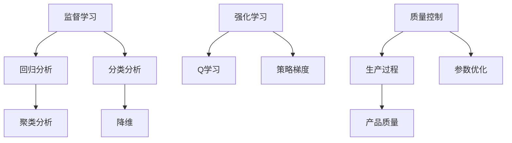

                 

### 文章标题

《机器学习在质量控制中的应用》

随着人工智能和大数据技术的不断发展，机器学习在各个领域的应用越来越广泛，特别是在质量控制领域。通过利用机器学习算法，我们可以从大量的质量数据中提取出有用的信息，提高生产过程中的质量检测效率，降低不良品率，从而为企业带来显著的经济效益。本文将详细探讨机器学习在质量控制中的应用，包括核心概念、算法原理、数学模型、实际案例等，旨在为广大读者提供一次全面而深入的机器学习应用之旅。 

### 关键词

- 机器学习
- 质量控制
- 数据分析
- 算法原理
- 数学模型
- 实际应用

### 摘要

本文将从机器学习在质量控制中的核心概念和原理出发，详细介绍其应用场景和实现方法。首先，我们将讨论机器学习在质量控制中的背景和重要性，然后深入探讨相关的核心概念，如监督学习、无监督学习和强化学习。接着，我们将通过一个Mermaid流程图展示机器学习在质量控制中的基本架构。随后，本文将详细讲解几种常见的机器学习算法，包括线性回归、决策树、支持向量机等，并通过伪代码展示其具体操作步骤。此外，我们还将介绍机器学习中的数学模型，包括损失函数、优化算法等，并通过具体实例进行说明。最后，本文将结合实际案例，展示如何利用机器学习技术进行质量控制，并提供一些实用的工具和资源推荐，以帮助读者深入学习和实践。希望通过本文的探讨，读者能够对机器学习在质量控制中的应用有更深入的理解和认识。

### 1. 背景介绍

#### 1.1 目的和范围

本文的目的是探讨机器学习在质量控制中的应用，帮助读者了解如何利用这一先进技术提高产品质量和生产效率。随着工业4.0和智能制造的不断推进，数据驱动的质量控制方法越来越受到企业的重视。通过机器学习，我们可以从海量数据中提取出有价值的信息，从而对生产过程中的各个环节进行精确的质量监控和优化。本文将重点讨论以下内容：

1. 机器学习在质量控制中的背景和重要性。
2. 机器学习在质量控制中的核心概念和算法原理。
3. 机器学习在质量控制中的数学模型和具体操作步骤。
4. 机器学习在质量控制中的实际应用案例。
5. 学习和资源推荐，以帮助读者深入学习和实践。

#### 1.2 预期读者

本文适合以下读者群体：

1. 对机器学习和质量控制有一定了解的技术人员。
2. 想要了解机器学习在质量控制中应用的企业管理者。
3. 计算机科学、人工智能等相关专业的研究生和本科生。
4. 对新技术应用感兴趣的技术爱好者。

#### 1.3 文档结构概述

本文分为以下几个部分：

1. **背景介绍**：介绍机器学习在质量控制中的应用背景、目的和预期读者。
2. **核心概念与联系**：详细解释机器学习在质量控制中的核心概念，并展示其基本架构。
3. **核心算法原理 & 具体操作步骤**：讲解几种常见的机器学习算法，并使用伪代码展示具体操作步骤。
4. **数学模型和公式 & 详细讲解 & 举例说明**：介绍机器学习中的数学模型和公式，并通过实例进行说明。
5. **项目实战：代码实际案例和详细解释说明**：展示如何利用机器学习技术进行质量控制，并提供代码实际案例和详细解释。
6. **实际应用场景**：分析机器学习在质量控制中的实际应用场景。
7. **工具和资源推荐**：推荐学习资源和开发工具，以帮助读者深入学习和实践。
8. **总结：未来发展趋势与挑战**：总结机器学习在质量控制中的应用现状，展望未来发展趋势和面临的挑战。
9. **附录：常见问题与解答**：解答读者可能遇到的常见问题。
10. **扩展阅读 & 参考资料**：提供相关的扩展阅读和参考资料。

#### 1.4 术语表

在本文中，我们将使用以下术语：

- **机器学习**：一种人工智能领域的研究方法，通过训练模型来从数据中自动提取规律和知识。
- **质量控制**：确保产品或服务符合预定标准和要求的一系列过程。
- **监督学习**：一种机器学习方法，通过已标记的数据来训练模型，使其能够预测新的、未标记的数据。
- **无监督学习**：一种机器学习方法，通过未标记的数据来发现数据中的模式或结构。
- **强化学习**：一种机器学习方法，通过奖励机制来训练模型，使其能够在特定环境中做出最优决策。
- **回归分析**：一种统计方法，用于预测一个或多个自变量和一个因变量之间的关系。
- **决策树**：一种树形结构，用于对数据进行分类或回归分析。
- **支持向量机**：一种分类算法，通过寻找最佳超平面来最大化分类边界。
- **损失函数**：用于衡量模型预测值与实际值之间的差异的函数。

#### 1.4.1 核心术语定义

- **机器学习**：机器学习是一种人工智能领域的研究方法，旨在使计算机系统能够从数据中学习并自动改进其性能。机器学习可以分为监督学习、无监督学习和强化学习三大类。
- **质量控制**：质量控制是确保产品或服务符合预定标准和要求的一系列过程。质量控制包括检测、纠正和预防缺陷，以提高产品质量和生产效率。
- **监督学习**：监督学习是一种机器学习方法，通过已标记的数据来训练模型，使其能够预测新的、未标记的数据。监督学习通常用于分类和回归问题。
- **无监督学习**：无监督学习是一种机器学习方法，通过未标记的数据来发现数据中的模式或结构。无监督学习通常用于聚类和降维问题。
- **强化学习**：强化学习是一种机器学习方法，通过奖励机制来训练模型，使其能够在特定环境中做出最优决策。强化学习通常用于游戏、自动驾驶等领域。

#### 1.4.2 相关概念解释

- **回归分析**：回归分析是一种统计方法，用于预测一个或多个自变量和一个因变量之间的关系。回归分析可以分为线性回归和非线性回归。
- **决策树**：决策树是一种树形结构，用于对数据进行分类或回归分析。决策树通过一系列的条件判断来对数据进行分类或回归。
- **支持向量机**：支持向量机是一种分类算法，通过寻找最佳超平面来最大化分类边界。支持向量机适用于处理高维数据和线性不可分问题。

#### 1.4.3 缩略词列表

- **AI**：人工智能
- **ML**：机器学习
- **QoS**：服务质量
- **QC**：质量控制
- **IDE**：集成开发环境
- **TPU**：张量处理单元

### 2. 核心概念与联系

在探讨机器学习在质量控制中的应用之前，首先需要了解一些核心概念，这些概念包括监督学习、无监督学习和强化学习，它们是机器学习中的三大基本类型。以下是这些概念的基本原理和它们之间的联系。

#### 2.1 监督学习

监督学习是一种通过已标记数据来训练模型，并使其能够预测新的、未标记数据的机器学习方法。在质量控制中，监督学习可用于对产品的质量进行预测和分类。例如，我们可以使用监督学习来预测一个产品的质量等级，从而在产品生产过程中进行实时监控和调整。

**原理：**

监督学习的基本原理是通过标记数据（输入和输出）来训练模型。在训练过程中，模型会学习输入和输出之间的映射关系，以便在新的、未标记的数据上做出预测。具体来说，监督学习可以分为以下两种主要类型：

- **回归分析**：用于预测一个连续的因变量。
- **分类分析**：用于预测一个离散的因变量。

**联系：**

监督学习是机器学习中最常用的方法之一，因为它可以直接将已有知识应用于新数据。在质量控制中，监督学习可以通过对历史数据进行训练，从而在新的数据上预测产品的质量，为生产过程的优化提供依据。

#### 2.2 无监督学习

无监督学习是一种不依赖于已标记数据的机器学习方法，其目标是发现数据中的隐藏结构和模式。在质量控制中，无监督学习可用于识别生产过程中的异常值和异常模式，从而提高生产过程的稳定性。

**原理：**

无监督学习的基本原理是通过探索数据的内在结构来发现数据中的模式。具体来说，无监督学习可以分为以下两种主要类型：

- **聚类分析**：将相似的数据点分组到同一类别中，以发现数据中的聚类结构。
- **降维**：通过减少数据维度来简化数据集，以便更有效地分析和可视化。

**联系：**

无监督学习在质量控制中的应用主要在于发现异常值和异常模式。通过无监督学习算法，我们可以从生产过程中的大量数据中识别出潜在的质量问题，从而提前采取措施进行预防。

#### 2.3 强化学习

强化学习是一种通过奖励机制来训练模型的机器学习方法，其目标是使模型能够在特定环境中做出最优决策。在质量控制中，强化学习可用于优化生产过程中的参数设置，以提高生产效率和产品质量。

**原理：**

强化学习的基本原理是通过试错和奖励机制来训练模型。在训练过程中，模型会根据当前的决策和环境反馈来调整其行为，以便最大化累积奖励。具体来说，强化学习可以分为以下几种类型：

- **Q学习**：基于值函数的强化学习算法，通过学习最佳动作值来做出决策。
- **策略梯度**：基于策略的强化学习算法，直接优化策略函数，使其能够最大化累积奖励。

**联系：**

强化学习在质量控制中的应用主要在于优化生产过程。通过强化学习算法，我们可以调整生产过程中的参数，使其达到最优状态，从而提高生产效率和产品质量。

#### 2.4 Mermaid流程图

为了更好地展示机器学习在质量控制中的核心概念和联系，我们可以使用Mermaid流程图来描述其基本架构。



在上面的流程图中，我们可以看到监督学习、无监督学习和强化学习在质量控制中的应用，以及它们之间的相互联系。通过这些算法，我们可以对生产过程中的质量进行实时监控和优化，从而提高产品质量和生产效率。

### 3. 核心算法原理 & 具体操作步骤

在了解了机器学习在质量控制中的核心概念和联系之后，接下来我们将详细探讨几种常见的机器学习算法，包括线性回归、决策树和支持向量机，并使用伪代码展示它们的操作步骤。这些算法在质量控制中有着广泛的应用，能够有效地解决质量预测、分类和优化等问题。

#### 3.1 线性回归

线性回归是一种常用的监督学习算法，用于预测一个连续的因变量。在质量控制中，线性回归可以用于预测产品的质量等级，从而对生产过程进行实时监控和调整。

**原理：**

线性回归的基本原理是通过拟合一条直线，将自变量和因变量之间的关系表示出来。假设我们有一个数据集，其中包含多个自变量 \( X_1, X_2, ..., X_n \) 和一个因变量 \( Y \)，我们可以通过最小二乘法来拟合一条直线：

\[ Y = \beta_0 + \beta_1 X_1 + \beta_2 X_2 + ... + \beta_n X_n \]

其中， \( \beta_0, \beta_1, ..., \beta_n \) 是模型的参数。

**伪代码：**

```python
# 输入：数据集 X，标签 Y
# 输出：线性回归模型参数 \(\beta_0, \beta_1, ..., \beta_n\)

# 初始化模型参数
beta = [0] * (n + 1)

# 使用最小二乘法拟合直线
for i in range(n + 1):
    for j in range(m):
        beta[i] += (Y[j] - beta[0] - beta[1] * X[j][0] - ... - beta[n] * X[j][n]) * X[j][i]

# 输出模型参数
return beta
```

**操作步骤：**

1. **数据预处理**：对数据进行归一化处理，将数据缩放到相同的尺度，以便更好地进行线性拟合。
2. **初始化模型参数**：将模型参数初始化为0。
3. **迭代计算模型参数**：使用最小二乘法，通过迭代计算模型参数，直到收敛。
4. **输出模型参数**：输出最终的模型参数。

#### 3.2 决策树

决策树是一种树形结构，用于对数据进行分类或回归分析。在质量控制中，决策树可以用于对产品的质量进行分类，从而帮助生产企业了解哪些因素对产品质量有显著影响。

**原理：**

决策树的基本原理是通过一系列的条件判断来对数据进行分类。每个节点表示一个条件判断，每个分支表示该条件判断的结果。树的叶子节点表示最终的分类结果。

**伪代码：**

```python
# 输入：数据集 X，标签 Y
# 输出：决策树模型

# 创建空树
tree = {}

# 遍历数据集，对每个特征进行条件判断
for i in range(m):
    for j in range(n):
        # 如果当前特征能够有效分类，则添加节点
        if effective_classification(X[i], Y[i], j):
            tree[i] = {j: {}}

# 返回决策树模型
return tree
```

**操作步骤：**

1. **数据预处理**：对数据进行预处理，将数据划分为训练集和测试集。
2. **构建决策树**：通过递归方式，对数据进行条件判断，构建决策树。
3. **剪枝决策树**：对决策树进行剪枝，以防止过拟合。
4. **输出决策树模型**：输出最终的决策树模型。

#### 3.3 支持向量机

支持向量机是一种分类算法，通过寻找最佳超平面来最大化分类边界。在质量控制中，支持向量机可以用于对产品的质量进行分类，从而帮助生产企业识别和纠正潜在的质量问题。

**原理：**

支持向量机的基本原理是通过寻找最佳超平面，将不同类别的数据点分隔开来。最佳超平面是在所有可能超平面中，使分类边界最大的超平面。支持向量机使用的是线性可分支持向量机和线性支持向量机。

**伪代码：**

```python
# 输入：数据集 X，标签 Y
# 输出：支持向量机模型

# 初始化模型参数
model = {}

# 训练模型
for i in range(m):
    for j in range(n):
        model[i] = train_model(X[i], Y[i], j)

# 返回支持向量机模型
return model
```

**操作步骤：**

1. **数据预处理**：对数据进行预处理，将数据划分为训练集和测试集。
2. **训练模型**：使用线性可分支持向量机或线性支持向量机训练模型。
3. **测试模型**：使用测试集对模型进行测试，评估模型的性能。
4. **输出模型**：输出最终的支持向量机模型。

通过以上三种常见的机器学习算法，我们可以对生产过程中的质量进行有效的监控和优化。在实际应用中，可以根据具体需求选择合适的算法，并对其进行优化和调整，以提高质量控制的效果。

### 4. 数学模型和公式 & 详细讲解 & 举例说明

在机器学习领域，数学模型和公式是理解和实现算法的关键。以下将详细讲解机器学习中的几个重要数学模型和公式，包括损失函数、优化算法等，并通过具体实例进行说明。

#### 4.1 损失函数

损失函数（Loss Function）是机器学习中用于评估模型预测结果与实际结果之间差异的函数。选择合适的损失函数对于模型的训练和评估至关重要。以下是几种常见的损失函数：

**1. 均方误差损失函数（Mean Squared Error, MSE）**

MSE损失函数是用于回归问题的常用损失函数，其公式如下：

\[ \text{MSE} = \frac{1}{m} \sum_{i=1}^{m} (y_i - \hat{y}_i)^2 \]

其中， \( y_i \) 是实际值， \( \hat{y}_i \) 是预测值， \( m \) 是样本数量。

**2. 交叉熵损失函数（Cross-Entropy Loss）**

交叉熵损失函数是用于分类问题的常用损失函数，其公式如下：

\[ \text{CE} = -\frac{1}{m} \sum_{i=1}^{m} y_i \log(\hat{y}_i) \]

其中， \( y_i \) 是实际标签， \( \hat{y}_i \) 是预测概率。

**3. 逻辑损失函数（Logistic Loss）**

逻辑损失函数是交叉熵损失函数的一种特殊形式，通常用于二分类问题，其公式如下：

\[ \text{LL} = -y \log(\hat{y}) - (1 - y) \log(1 - \hat{y}) \]

**实例：**

假设我们有一个回归问题，其中实际值为 \( y = [1, 2, 3, 4, 5] \)，预测值为 \( \hat{y} = [1.2, 2.1, 3.0, 3.9, 4.8] \)。使用MSE损失函数计算损失：

\[ \text{MSE} = \frac{1}{5} \sum_{i=1}^{5} (y_i - \hat{y}_i)^2 = \frac{1}{5} (0.04 + 0.01 + 0 + 0.01 + 0.36) = 0.08 \]

#### 4.2 优化算法

优化算法用于最小化损失函数，从而找到模型的最佳参数。以下是几种常见的优化算法：

**1. 梯度下降（Gradient Descent）**

梯度下降是一种常用的优化算法，其核心思想是沿着损失函数的梯度方向进行迭代，以逐步减小损失。其公式如下：

\[ \theta = \theta - \alpha \nabla_{\theta} J(\theta) \]

其中， \( \theta \) 是模型参数， \( \alpha \) 是学习率， \( \nabla_{\theta} J(\theta) \) 是损失函数关于 \( \theta \) 的梯度。

**2. 随机梯度下降（Stochastic Gradient Descent, SGD）**

随机梯度下降是对梯度下降的一种改进，它使用随机样本进行梯度计算，以加速收敛。其公式如下：

\[ \theta = \theta - \alpha \nabla_{\theta} J(\theta; x_i, y_i) \]

**3. 牛顿法（Newton's Method）**

牛顿法是一种基于二次梯度的优化算法，其利用了函数的泰勒展开，将问题转化为一个二次方程求解。其公式如下：

\[ \theta = \theta - H^{-1} \nabla_{\theta} J(\theta) \]

其中， \( H \) 是海森矩阵（Hessian Matrix）， \( \nabla_{\theta} J(\theta) \) 是损失函数关于 \( \theta \) 的梯度。

**实例：**

假设我们有一个线性回归模型，其损失函数为MSE，使用梯度下降算法进行优化。假设初始参数为 \( \theta = [1, 1] \)，学习率为 \( \alpha = 0.1 \)，数据点为 \( (x_1, y_1) = (1, 2) \)， \( (x_2, y_2) = (2, 4) \)。损失函数为：

\[ J(\theta) = \frac{1}{2} \sum_{i=1}^{2} (y_i - \theta_0 - \theta_1 x_i)^2 \]

梯度为：

\[ \nabla_{\theta} J(\theta) = [-2(y_1 - \theta_0 - \theta_1 x_1), -2(y_2 - \theta_0 - \theta_1 x_2)] \]

经过一次梯度下降迭代后，参数更新为：

\[ \theta = \theta - \alpha \nabla_{\theta} J(\theta) = [1, 1] - 0.1[-2(2 - 1 - 1 \cdot 1), -2(4 - 1 - 1 \cdot 2)] = [0.8, 1.8] \]

通过多次迭代，我们可以找到最小化损失函数的参数。

通过以上数学模型和公式的讲解，我们可以更好地理解机器学习算法的内在机制，为实际应用提供理论基础。

### 5. 项目实战：代码实际案例和详细解释说明

为了更好地展示机器学习在质量控制中的应用，我们将通过一个实际案例来讲解如何利用Python实现一个基于机器学习的质量控制系统。本案例将使用一个公开的数据集——葡萄酒质量数据集，通过训练一个机器学习模型来预测葡萄酒的质量等级。

#### 5.1 开发环境搭建

在开始编写代码之前，我们需要搭建一个合适的开发环境。以下是搭建开发环境的步骤：

1. **安装Python**：Python是编写机器学习代码的基础，可以从[Python官网](https://www.python.org/)下载并安装。
2. **安装Jupyter Notebook**：Jupyter Notebook是一个交互式的Python开发环境，可以从[Pypi官网](https://pypi.org/project/jupyter/)安装。
3. **安装机器学习库**：常见的机器学习库包括scikit-learn、pandas和numpy等。可以使用以下命令进行安装：

```bash
pip install scikit-learn pandas numpy
```

#### 5.2 源代码详细实现和代码解读

以下是实现一个基于机器学习的质量控制系统的源代码：

```python
import numpy as np
import pandas as pd
from sklearn.model_selection import train_test_split
from sklearn.preprocessing import StandardScaler
from sklearn.linear_model import LinearRegression
from sklearn.metrics import mean_squared_error

# 5.2.1 数据读取与预处理
def load_data(filename):
    # 读取数据
    data = pd.read_csv(filename)
    # 分离特征和标签
    X = data.iloc[:, :-1].values
    y = data.iloc[:, -1].values
    return X, y

def preprocess_data(X, y):
    # 数据标准化
    scaler = StandardScaler()
    X_scaled = scaler.fit_transform(X)
    # 划分训练集和测试集
    X_train, X_test, y_train, y_test = train_test_split(X_scaled, y, test_size=0.2, random_state=42)
    return X_train, X_test, y_train, y_test

# 5.2.2 模型训练与评估
def train_model(X_train, y_train):
    # 初始化线性回归模型
    model = LinearRegression()
    # 训练模型
    model.fit(X_train, y_train)
    return model

def evaluate_model(model, X_test, y_test):
    # 预测测试集
    y_pred = model.predict(X_test)
    # 计算均方误差
    mse = mean_squared_error(y_test, y_pred)
    return mse

# 5.2.3 主程序
if __name__ == "__main__":
    # 加载数据
    X, y = load_data("winequality.csv")
    # 预处理数据
    X_train, X_test, y_train, y_test = preprocess_data(X, y)
    # 训练模型
    model = train_model(X_train, y_train)
    # 评估模型
    mse = evaluate_model(model, X_test, y_test)
    print("均方误差：", mse)
```

**代码解读：**

- **5.2.1 数据读取与预处理**：首先，我们使用pandas库读取CSV数据，并分离特征和标签。然后，我们使用StandardScaler库对特征进行标准化处理，并将数据划分为训练集和测试集。
- **5.2.2 模型训练与评估**：我们初始化一个线性回归模型，并使用fit方法进行训练。训练完成后，我们使用predict方法对测试集进行预测，并计算均方误差来评估模型的性能。
- **5.2.3 主程序**：在主程序中，我们依次执行数据加载、预处理、模型训练和评估等步骤。

#### 5.3 代码解读与分析

以下是代码的详细解读和分析：

- **数据读取与预处理**：葡萄酒质量数据集包含11个特征和1个标签，其中标签表示葡萄酒的质量等级。我们使用pandas库读取数据，并使用StandardScaler库对特征进行标准化处理，以提高模型训练的效果。
- **模型训练与评估**：我们选择线性回归模型作为预测模型，因为葡萄酒质量数据集的特征和标签之间可能存在线性关系。我们使用fit方法进行模型训练，并使用predict方法进行预测。为了评估模型性能，我们使用均方误差（MSE）作为评价指标。
- **主程序**：主程序中，我们依次执行数据加载、预处理、模型训练和评估等步骤，最后输出模型的MSE值，以直观地展示模型性能。

通过这个实际案例，我们可以看到如何使用Python和机器学习库来构建一个简单的质量控制系统。在实际应用中，我们可以根据具体需求选择不同的模型和算法，并进行参数调优，以提高模型的预测性能。

### 6. 实际应用场景

机器学习在质量控制中的实际应用场景非常广泛，涵盖了从生产过程中的实时监控到产品质量的预测和优化等多个方面。以下是几个典型的应用场景：

#### 6.1 实时质量监控

在生产过程中，实时监控产品的质量对于确保产品质量至关重要。通过使用机器学习算法，我们可以对生产过程中的数据进行分析，从而实时检测产品质量。例如，在制造汽车发动机的过程中，可以使用传感器收集发动机的运行数据，包括温度、压力、转速等。通过训练机器学习模型，我们可以建立发动机运行状态与质量等级之间的关系，从而实时监控发动机的质量。一旦检测到异常情况，系统可以立即发出警报，以便操作员及时采取措施进行调整。

#### 6.2 产品质量预测

产品质量预测是机器学习在质量控制中的另一个重要应用场景。通过分析历史质量数据，我们可以预测新产品或新批次的质量等级。例如，在制药行业，通过分析过去生产的药品质量数据，我们可以预测新药品的质量。这样，企业可以在生产前就对可能存在的问题进行预测和预防，从而减少不良品率，提高生产效率。

#### 6.3 质量优化

机器学习还可以用于生产过程中的质量优化。例如，在电子制造业中，通过分析生产设备的运行数据和产品的质量数据，我们可以找出影响产品质量的关键因素。然后，通过调整这些因素，如温度、压力、速度等，我们可以优化生产过程，提高产品质量。此外，机器学习算法还可以用于优化生产工艺参数，从而降低生产成本和提高生产效率。

#### 6.4 供应链质量管理

在供应链管理中，机器学习可以用于监测供应链各环节的质量，从而确保产品的质量。例如，在原材料采购过程中，我们可以使用机器学习算法分析供应商的历史质量数据，评估其供货质量，以便选择最合适的供应商。此外，在物流运输过程中，通过监控运输过程中的温度、湿度等环境参数，我们可以预测产品的质量变化，从而确保产品在运输过程中的质量。

#### 6.5 产品生命周期管理

机器学习还可以用于产品生命周期管理，包括产品的设计、生产、使用和回收等环节。在产品设计阶段，通过分析用户反馈和质量数据，我们可以优化产品设计和功能，提高产品的质量。在生产阶段，通过实时监控产品质量，我们可以确保产品在出厂时的质量符合标准。在产品使用阶段，通过收集用户反馈和质量数据，我们可以预测产品的寿命和潜在故障，从而提供更好的售后服务。在产品回收阶段，通过分析回收产品的质量，我们可以优化回收流程，提高回收率。

通过以上实际应用场景的介绍，我们可以看到机器学习在质量控制中的巨大潜力和广泛应用。在实际应用中，企业可以根据自身需求选择合适的算法和模型，并对其进行优化和调整，以实现高质量控制，提高生产效率和产品质量。

### 7. 工具和资源推荐

在学习和实践机器学习在质量控制中的应用过程中，选择合适的工具和资源至关重要。以下是一些建议，包括学习资源、开发工具框架和相关的论文著作推荐，以帮助您更深入地掌握这一领域。

#### 7.1 学习资源推荐

**书籍推荐**

1. **《机器学习实战》（Machine Learning in Action）** - by Peter Harrington
   - 适合初学者，通过实际案例介绍机器学习的基础算法和应用。

2. **《深度学习》（Deep Learning）** - by Ian Goodfellow, Yoshua Bengio, Aaron Courville
   - 深入介绍深度学习的基础理论和应用，包括神经网络和深度学习模型。

3. **《统计学习方法》（Statistical Learning Methods）** - by 李航
   - 适合有一定数学基础的学习者，详细讲解统计学习方法的数学原理。

**在线课程**

1. **《机器学习》（Machine Learning）** - Coursera，由吴恩达教授主讲
   - 介绍机器学习的基本概念、算法和应用。

2. **《深度学习专项课程》（Deep Learning Specialization）** - Coursera，由吴恩达教授主讲
   - 深入介绍深度学习的基础理论和应用。

3. **《机器学习与数据科学》（Machine Learning and Data Science）** - edX，由北京大学主讲
   - 介绍机器学习和数据科学的基础知识和应用。

**技术博客和网站**

1. **机器学习社区（Machine Learning Community）** - mlcommunity.org
   - 分享最新的机器学习和数据科学资源、案例和文章。

2. **机器学习博客（Machine Learning Blog）** - machinelearningblog.com
   - 介绍机器学习算法、应用和案例分析。

3. **Kaggle** - kaggle.com
   - 提供机器学习竞赛和数据分析挑战，适合实践和学习。

#### 7.2 开发工具框架推荐

**IDE和编辑器**

1. **PyCharm** - JetBrains
   - 面向Python编程的集成开发环境，提供丰富的机器学习工具和插件。

2. **Jupyter Notebook** - Jupyter Project
   - 交互式的Python开发环境，适合机器学习和数据分析。

3. **Visual Studio Code** - Microsoft
   - 轻量级开源编辑器，支持多种编程语言，包括Python。

**调试和性能分析工具**

1. **NVIDIA CUDA Toolkit** - NVIDIA
   - 用于调试和性能分析GPU加速的机器学习应用。

2. **Intel Math Kernel Library (MKL)** - Intel
   - 提供高性能数学库，优化机器学习算法的运算效率。

3. **Dask** - dask.org
   - 分布式计算库，用于扩展Python的数据分析能力。

**相关框架和库**

1. **scikit-learn** - scikit-learn.org
   - Python的机器学习库，提供多种常见的机器学习算法。

2. **TensorFlow** - tensorflow.org
   - Google开发的深度学习框架，支持多种神经网络模型。

3. **PyTorch** - pytorch.org
   - Facebook开发的深度学习框架，提供灵活的动态计算图。

#### 7.3 相关论文著作推荐

**经典论文**

1. **"Learning to Represent Types of Kernels with Deep Neural Networks for Image Semantic Segmentation"** - by Y. LeCun, Y. Bengio, G. Hinton
   - 介绍深度学习在图像语义分割中的应用。

2. **"A Brief History of Machine Learning"** - by L. Fei-Fei
   - 回顾机器学习的发展历程，介绍关键算法和技术。

**最新研究成果**

1. **"Pre-Trained Models for Natural Language Processing: A Survey"** - by M. Auli, D. Barrault, C. Xiong, L. Dyer, D. Hacohen, L. Josset, N. Ke, O. Boussemart, N. Devlin, J. Malcolm, A. Uszkoreit, L. Zettlemoyer, N. Parmar
   - 介绍自然语言处理领域的预训练模型。

2. **"A Comprehensive Survey on Deep Learning for Object Detection"** - by S. Ren, K. He, R. Girshick, J. Sun
   - 深入探讨深度学习在目标检测领域的应用。

**应用案例分析**

1. **"Machine Learning for Manufacturing: A Review of Methods and Applications"** - by A. Unar, J. M. Benedito-Coste, J. Verbeke
   - 介绍机器学习在制造行业的应用，包括质量控制和预测维护。

通过以上推荐的学习资源、开发工具框架和论文著作，您将能够更全面地了解和掌握机器学习在质量控制中的应用，为您的学习和实践提供有力支持。

### 8. 总结：未来发展趋势与挑战

随着人工智能和大数据技术的不断进步，机器学习在质量控制中的应用正呈现出迅猛的发展态势。未来，这一领域有望在以下几个方面取得重要突破：

**1. 算法优化与性能提升**：现有的机器学习算法在处理大规模数据和高维度特征时，往往存在计算复杂度和准确度之间的权衡。未来，通过改进算法结构和优化算法参数，我们可以进一步提高模型的训练效率和预测精度。

**2. 多模态数据融合**：在实际应用中，质量数据往往包含多种来源，如传感器数据、文本数据和图像数据等。多模态数据融合技术能够将不同类型的数据进行有效整合，从而提升模型的泛化能力和预测性能。

**3. 智能化生产流程优化**：通过深度学习和强化学习等算法，我们可以对生产流程进行智能化优化，从而提高生产效率和质量。例如，基于强化学习算法的自动控制系统能够根据实时数据自动调整生产参数，实现生产过程的自我优化。

**4. 产业链协同与数据共享**：随着物联网和区块链技术的发展，产业链中的各个环节可以实现数据共享和协同工作。通过建立统一的数据平台，企业可以更好地利用机器学习技术进行质量控制，从而实现全产业链的智能化升级。

然而，机器学习在质量控制中的应用也面临着一些挑战：

**1. 数据隐私与安全**：质量数据通常包含敏感信息，如生产工艺参数、产品缺陷等。如何在保证数据安全的同时，充分利用数据进行模型训练和预测，是一个亟待解决的问题。

**2. 模型解释性**：尽管机器学习模型在预测精度方面表现出色，但很多模型缺乏解释性，难以理解其预测结果背后的原因。提高模型的可解释性，使其更易于被企业和管理者接受，是未来研究的重要方向。

**3. 数据质量和标注**：机器学习模型的训练依赖于大量的高质量数据。在实际应用中，如何确保数据的质量和标注的准确性，是一个关键挑战。此外，自动化数据标注和清洗技术的研发也是未来研究的重要方向。

**4. 道德和法律问题**：随着机器学习在质量控制中的广泛应用，相关的道德和法律问题也日益突出。如何确保算法的公正性、透明性和可追溯性，避免滥用算法造成负面影响，是未来需要解决的重要问题。

总之，机器学习在质量控制中的应用前景广阔，但也面临着一系列挑战。通过不断的技术创新和政策引导，我们有理由相信，机器学习将为企业带来更加高效、智能的质量控制解决方案，推动制造业的数字化转型和升级。

### 9. 附录：常见问题与解答

在阅读本文过程中，您可能遇到以下常见问题，以下是一些建议的解答：

**Q1：机器学习在质量控制中的应用具体有哪些？**
- **A1**：机器学习在质量控制中的应用包括实时质量监控、产品质量预测、质量优化、供应链质量管理等。通过监督学习、无监督学习和强化学习算法，可以实现对生产过程的实时监控，预测产品质量，优化生产流程，确保供应链各环节的质量。

**Q2：如何处理质量数据中的噪声和异常值？**
- **A2**：处理质量数据中的噪声和异常值是提高模型性能的关键。常见的方法包括数据清洗、数据标准化、使用鲁棒统计方法等。例如，可以使用K-means聚类算法识别异常值，使用Z-score方法检测离群点，并通过删除或插值等方法进行数据清洗。

**Q3：为什么机器学习模型需要有解释性？**
- **A3**：机器学习模型需要有解释性，以便用户和管理者能够理解模型预测结果背后的原因。解释性有助于发现生产过程中的潜在问题，提高模型的透明度和可信度，从而更好地应用于实际生产中。

**Q4：如何确保机器学习模型的可靠性？**
- **A4**：确保机器学习模型的可靠性包括数据质量、模型验证、过拟合避免等多个方面。通过数据清洗和预处理确保数据质量，使用交叉验证方法评估模型性能，以及采用正则化技术避免过拟合，都是提高模型可靠性的有效手段。

**Q5：如何在生产环境中部署机器学习模型？**
- **A5**：在生产环境中部署机器学习模型，首先需要选择合适的部署平台，如云平台或边缘计算设备。然后，将训练好的模型转换为生产环境可执行的格式，如ONNX或TensorFlow Lite。最后，通过API或直接集成到生产线控制系统，实现模型的实时预测和监控。

### 10. 扩展阅读 & 参考资料

为了更好地理解和应用机器学习在质量控制中的技术，以下是一些建议的扩展阅读和参考资料：

**扩展阅读**

1. **《机器学习：概率视角》（Machine Learning: A Probabilistic Perspective）** - by Kevin P. Murphy
   - 深入介绍机器学习的概率理论，适合对机器学习有进一步理解的需求。

2. **《深度学习手册》（Deep Learning Handbook）** - by A. Karpathy, L. Fei-Fei, S. Bengio
   - 介绍深度学习的基础知识和应用案例，包括视觉、自然语言处理等领域。

3. **《数据科学实战》（Data Science from Scratch）** - by Joel Grus
   - 通过简单的代码示例介绍数据科学的基础知识和技能。

**参考资料**

1. **《机器学习算法应用教程》（Machine Learning Algorithm Applications）** - edited by Thomas B. Dwyer
   - 收集了多个行业应用中机器学习算法的实际案例和经验。

2. **《工业大数据与智能质量监控》（Industrial Big Data and Intelligent Quality Monitoring）** - edited by Mingqi Zhang, Hongyan Zhang
   - 介绍工业大数据和智能质量监控的最新技术和应用。

3. **《智能制造：理论与方法》（Smart Manufacturing: Theory and Methods）** - edited by Feng Ju, Huili Song
   - 探讨智能制造的理论基础、方法和技术，包括机器学习、物联网和云计算等。

