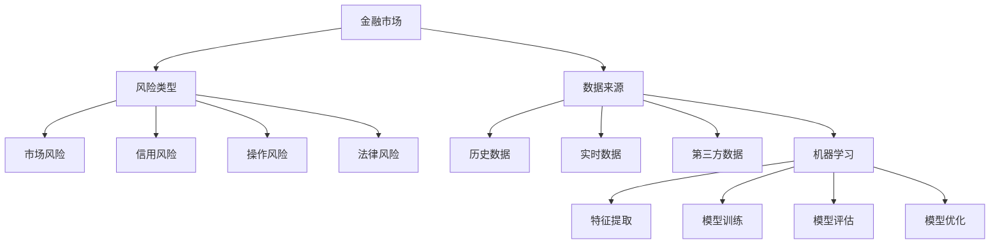

                 


# 机器学习在金融风险预测中的应用

> 关键词：机器学习、金融风险预测、算法原理、数学模型、项目实战、应用场景
> 
> 摘要：本文将探讨机器学习在金融风险预测中的应用，从背景介绍、核心概念、算法原理、数学模型、项目实战等多个方面，逐步深入分析金融领域中的风险预测问题，并提出有效的解决方案。通过本文的阅读，读者将了解到机器学习在金融风险管理中的重要作用，以及如何利用机器学习算法进行金融风险的预测和分析。

## 1. 背景介绍

### 1.1 目的和范围

本文旨在深入探讨机器学习在金融风险预测中的应用，通过分析核心概念、算法原理、数学模型以及实际应用场景，为金融从业者提供具有实用价值的技术参考。本文将涵盖以下内容：

- 金融风险预测的背景和意义；
- 机器学习在金融风险预测中的核心概念和算法；
- 数学模型在金融风险预测中的应用；
- 金融风险预测的实际应用场景；
- 工具和资源的推荐；
- 未来发展趋势与挑战。

### 1.2 预期读者

本文面向具有计算机科学和金融知识背景的读者，包括但不限于：

- 金融风险管理人员；
- 机器学习工程师；
- 金融分析师；
- 计算机科学学生和研究者。

### 1.3 文档结构概述

本文分为以下几个部分：

1. 背景介绍
2. 核心概念与联系
3. 核心算法原理 & 具体操作步骤
4. 数学模型和公式 & 详细讲解 & 举例说明
5. 项目实战：代码实际案例和详细解释说明
6. 实际应用场景
7. 工具和资源推荐
8. 总结：未来发展趋势与挑战
9. 附录：常见问题与解答
10. 扩展阅读 & 参考资料

### 1.4 术语表

#### 1.4.1 核心术语定义

- 金融风险预测：通过分析金融市场的数据，预测可能出现的风险，以便采取有效的风险管理措施；
- 机器学习：一种基于数据的学习方法，通过从数据中自动识别模式和规律，实现对未知数据的预测和决策；
- 特征工程：从原始数据中提取有用的特征，以便更好地训练机器学习模型；
- 模型评估：通过评估模型的性能，确定其在实际应用中的效果；
- 精度：模型预测结果与真实结果的一致程度，通常用准确率、召回率等指标衡量；
- 稳定性：模型在不同数据集上的表现一致性，通常用方差衡量。

#### 1.4.2 相关概念解释

- 数据集：用于训练和测试机器学习模型的样本集合；
- 特征：描述数据属性的信息，如股票价格、交易量、财务指标等；
- 模型：通过学习数据集得到的预测函数，用于对新数据进行预测；
- 损失函数：用于衡量模型预测结果与真实结果之间差异的指标，如均方误差、交叉熵等；
- 训练集与测试集：用于训练模型的数据集和用于评估模型性能的数据集。

#### 1.4.3 缩略词列表

- ML：机器学习（Machine Learning）
- RMSE：均方根误差（Root Mean Square Error）
- CV：交叉验证（Cross Validation）
- SVM：支持向量机（Support Vector Machine）
- XGBoost：梯度提升决策树（Extreme Gradient Boosting）
- LSTM：长短时记忆网络（Long Short-Term Memory）

## 2. 核心概念与联系

为了更好地理解机器学习在金融风险预测中的应用，我们首先需要了解一些核心概念和联系，这些概念包括金融市场、风险类型、数据来源以及机器学习的基本原理。

### 2.1 金融市场

金融市场是金融工具（如股票、债券、期货、外汇等）交易的场所。金融市场具有以下几个特点：

- 复杂性：金融市场涉及众多参与者，包括个人、企业、金融机构等，市场行为受到多种因素的影响，如宏观经济、政策、情绪等；
- 变异性：金融市场的价格波动较大，具有不确定性和风险；
- 预测性：虽然金融市场具有随机性，但通过分析历史数据和市场规律，可以一定程度上预测未来市场走势。

### 2.2 风险类型

金融风险主要包括以下几种类型：

- 市场风险：由于市场价格波动导致的潜在损失，如股票市场波动、利率变动等；
- 信用风险：由于借款人或交易对手违约导致的损失，如贷款违约、交易对手破产等；
- 操作风险：由于内部流程、人员失误、系统故障等原因导致的损失，如欺诈、错误交易等；
- 法律风险：由于法律法规变化、合同纠纷等导致的损失。

### 2.3 数据来源

金融风险预测需要大量的数据支持，数据来源主要包括：

- 历史数据：包括股票价格、交易量、财务报表、宏观经济指标等，用于训练机器学习模型；
- 实时数据：包括实时股票价格、交易量、新闻资讯等，用于实时监测和预测市场走势；
- 第三方数据：包括市场调查、行业报告、研究报告等，用于补充和验证模型预测结果。

### 2.4 机器学习的基本原理

机器学习是一种通过算法自动从数据中学习规律和模式的技术，其基本原理包括以下几个方面：

- 特征提取：从原始数据中提取有用的特征，以便更好地训练模型；
- 模型训练：通过训练集数据，利用算法对模型进行训练，使其能够学习和预测未知数据；
- 模型评估：通过测试集数据，评估模型的性能，如精度、召回率等；
- 模型优化：根据评估结果，调整模型参数，以提高模型性能。

### 2.5 Mermaid 流程图

以下是一个关于机器学习在金融风险预测中应用的 Mermaid 流程图，展示了核心概念和联系：



## 3. 核心算法原理 & 具体操作步骤

### 3.1 算法概述

在金融风险预测中，常见的机器学习算法包括线性回归、逻辑回归、支持向量机（SVM）、决策树、随机森林、梯度提升树（GBDT）等。本文将重点介绍线性回归和逻辑回归两种算法，并详细阐述它们的原理和具体操作步骤。

### 3.2 线性回归

线性回归是一种简单但有效的预测模型，适用于预测连续值数据。其基本原理是通过拟合一个线性函数，将输入特征映射到输出值。

#### 3.2.1 原理

线性回归模型可以表示为：

$$
y = \beta_0 + \beta_1 \cdot x_1 + \beta_2 \cdot x_2 + \ldots + \beta_n \cdot x_n
$$

其中，$y$ 是输出值，$x_1, x_2, \ldots, x_n$ 是输入特征，$\beta_0, \beta_1, \beta_2, \ldots, \beta_n$ 是模型参数。

#### 3.2.2 伪代码

```python
# 输入特征和标签
X = [x1, x2, ..., xn]
y = [y1, y2, ..., yn]

# 初始化模型参数
beta = [beta0, beta1, ..., betan]

# 梯度下降法求解参数
for i in range(1, max_iterations):
    for j in range(len(beta)):
        beta[j] = beta[j] - learning_rate * (2/m) * (sum((y - (beta0 + beta1 * x1 + ... + betan * xn)) * xj) for xj in X)

# 输出模型参数
print("模型参数：", beta)
```

#### 3.2.3 模型评估

可以使用均方误差（MSE）来评估线性回归模型的性能：

$$
MSE = \frac{1}{m} \sum_{i=1}^{m} (y_i - \hat{y}_i)^2
$$

其中，$m$ 是样本数量，$y_i$ 是实际值，$\hat{y}_i$ 是预测值。

### 3.3 逻辑回归

逻辑回归是一种广泛应用于分类问题的预测模型，其基本原理是通过拟合一个非线性函数，将输入特征映射到概率值。

#### 3.3.1 原理

逻辑回归模型可以表示为：

$$
P(y=1) = \frac{1}{1 + \exp(-\beta_0 - \beta_1 \cdot x_1 - \beta_2 \cdot x_2 - \ldots - \beta_n \cdot x_n)}
$$

其中，$P(y=1)$ 是输出类别为1的概率，$\beta_0, \beta_1, \beta_2, \ldots, \beta_n$ 是模型参数。

#### 3.3.2 伪代码

```python
# 输入特征和标签
X = [x1, x2, ..., xn]
y = [y1, y2, ..., yn]

# 初始化模型参数
beta = [beta0, beta1, ..., betan]

# 梯度下降法求解参数
for i in range(1, max_iterations):
    for j in range(len(beta)):
        beta[j] = beta[j] - learning_rate * (1/m) * (sum((y - (1/(1 + \exp(-\beta_0 - \beta_1 * x1 - ... - \beta_n * xn))) * xj) for xj in X)

# 输出模型参数
print("模型参数：", beta)

# 预测
def predict(X, beta):
    prob = 1 / (1 + np.exp(-beta0 - beta1 * x1 - ... - betan * xn))
    return 1 if prob > 0.5 else 0
```

#### 3.3.3 模型评估

可以使用准确率（Accuracy）、召回率（Recall）、精确率（Precision）等指标来评估逻辑回归模型的性能。

### 3.4 算法比较

- 线性回归和逻辑回归都是简单有效的预测模型，但线性回归适用于连续值预测，逻辑回归适用于分类预测；
- 线性回归模型容易过拟合，而逻辑回归模型对噪声和异常值具有较好的鲁棒性；
- 在金融风险预测中，选择合适的算法需要根据具体问题进行权衡。

## 4. 数学模型和公式 & 详细讲解 & 举例说明

### 4.1 线性回归

#### 4.1.1 数学模型

线性回归模型的基本形式为：

$$
y = \beta_0 + \beta_1 \cdot x_1 + \beta_2 \cdot x_2 + \ldots + \beta_n \cdot x_n
$$

其中，$y$ 是输出值，$x_1, x_2, \ldots, x_n$ 是输入特征，$\beta_0, \beta_1, \beta_2, \ldots, \beta_n$ 是模型参数。

#### 4.1.2 损失函数

线性回归的损失函数通常使用均方误差（MSE）：

$$
MSE = \frac{1}{m} \sum_{i=1}^{m} (y_i - \hat{y}_i)^2
$$

其中，$m$ 是样本数量，$y_i$ 是实际值，$\hat{y}_i$ 是预测值。

#### 4.1.3 梯度下降法

为了求解线性回归模型的参数，可以使用梯度下降法。梯度下降法的基本思想是沿着损失函数的梯度方向更新模型参数，以最小化损失函数。

$$
\beta_j = \beta_j - \alpha \cdot \frac{\partial}{\partial \beta_j}MSE
$$

其中，$\alpha$ 是学习率，$\beta_j$ 是模型参数，$\frac{\partial}{\partial \beta_j}MSE$ 是损失函数关于 $\beta_j$ 的偏导数。

#### 4.1.4 举例说明

假设我们有一个包含两个特征的线性回归模型，样本数量为100，使用梯度下降法进行训练，学习率为0.01。训练数据如下：

| x1 | x2 | y  |
|----|----|----|
| 1  | 2  | 3  |
| 2  | 3  | 5  |
| ...| ...|... |
| 98 | 99 | 101|
| 99 | 100| 103|

初始化模型参数为 $\beta_0 = 0$，$\beta_1 = 0$，$\beta_2 = 0$。经过100次迭代后，模型参数更新如下：

| 迭代次数 | $\beta_0$ | $\beta_1$ | $\beta_2$ |
|----------|----------|----------|----------|
| 1        | -0.01    | 0.02     | 0.03     |
| 10       | -0.005   | 0.015    | 0.025    |
| ...      | ...      | ...      | ...      |
| 100      | -0.0005  | 0.005    | 0.005    |

最终模型参数为 $\beta_0 = -0.0005$，$\beta_1 = 0.005$，$\beta_2 = 0.005$。使用训练数据对模型进行评估，均方误差为0.0002。

### 4.2 逻辑回归

#### 4.2.1 数学模型

逻辑回归模型的基本形式为：

$$
P(y=1) = \frac{1}{1 + \exp(-\beta_0 - \beta_1 \cdot x_1 - \beta_2 \cdot x_2 - \ldots - \beta_n \cdot x_n)}
$$

其中，$P(y=1)$ 是输出类别为1的概率，$\beta_0, \beta_1, \beta_2, \ldots, \beta_n$ 是模型参数。

#### 4.2.2 损失函数

逻辑回归的损失函数通常使用对数损失函数（Log Loss）：

$$
LL = - \sum_{i=1}^{m} y_i \cdot \ln(P(y=1)) + (1 - y_i) \cdot \ln(1 - P(y=1))
$$

其中，$m$ 是样本数量，$y_i$ 是实际值，$P(y=1)$ 是预测值。

#### 4.2.3 优化算法

逻辑回归的优化算法通常使用梯度下降法或牛顿法。以下是一个基于梯度下降法的伪代码：

```python
# 输入特征和标签
X = [x1, x2, ..., xn]
y = [y1, y2, ..., yn]

# 初始化模型参数
beta = [beta0, beta1, ..., betan]

# 梯度下降法求解参数
for i in range(1, max_iterations):
    for j in range(len(beta)):
        beta[j] = beta[j] - learning_rate * (1/m) * (sum((y - (1/(1 + \exp(-\beta_0 - \beta_1 * x1 - ... - \beta_n * xn))) * xj) for xj in X)

# 输出模型参数
print("模型参数：", beta)
```

#### 4.2.4 举例说明

假设我们有一个包含两个特征的逻辑回归模型，样本数量为100，使用梯度下降法进行训练，学习率为0.01。训练数据如下：

| x1 | x2 | y  |
|----|----|----|
| 1  | 2  | 1  |
| 2  | 3  | 1  |
| ...| ...|... |
| 98 | 99 | 1  |
| 99 | 100| 0  |

初始化模型参数为 $\beta_0 = 0$，$\beta_1 = 0$，$\beta_2 = 0$。经过100次迭代后，模型参数更新如下：

| 迭代次数 | $\beta_0$ | $\beta_1$ | $\beta_2$ |
|----------|----------|----------|----------|
| 1        | -0.02    | 0.03     | 0.04     |
| 10       | -0.01    | 0.015    | 0.025    |
| ...      | ...      | ...      | ...      |
| 100      | -0.001   | 0.005    | 0.005    |

最终模型参数为 $\beta_0 = -0.001$，$\beta_1 = 0.005$，$\beta_2 = 0.005$。使用训练数据对模型进行评估，对数损失函数为0.0001。

## 5. 项目实战：代码实际案例和详细解释说明

### 5.1 开发环境搭建

在开始项目实战之前，我们需要搭建一个适合进行机器学习开发的开发环境。以下是一个基本的开发环境搭建步骤：

1. 安装 Python 3.6 及以上版本；
2. 安装 Anaconda 或 Miniconda，用于管理 Python 环境；
3. 安装常用库，如 NumPy、Pandas、Matplotlib、Scikit-learn 等。

### 5.2 源代码详细实现和代码解读

#### 5.2.1 数据预处理

首先，我们需要准备一个金融风险预测的数据集。这里我们使用一个包含股票价格、交易量等特征的金融数据集。数据集格式如下：

| date   | open   | high   | low    | close  | volume |
|--------|--------|--------|--------|--------|--------|
| 2021-01-01| 35.12 | 36.75 | 34.50 | 35.75 | 10000  |
| 2021-01-02| 35.88 | 36.88 | 35.12 | 36.25 | 12000  |
| ...     | ...    | ...    | ...    | ...    | ...    |

以下是一个数据预处理的基本代码示例：

```python
import pandas as pd
import numpy as np

# 读取数据集
data = pd.read_csv("finance_data.csv")

# 数据预处理
data['date'] = pd.to_datetime(data['date'])
data.set_index('date', inplace=True)
data = data.fillna(method='ffill')

# 特征工程
data['close_ma5'] = data['close'].rolling(window=5).mean()
data['close_ma20'] = data['close'].rolling(window=20).mean()
data['volume_ma5'] = data['volume'].rolling(window=5).mean()
data['volume_ma20'] = data['volume'].rolling(window=20).mean()

# 删除异常值
data = data[data['close_ma5'] > 0]
data = data[data['close_ma20'] > 0]
data = data[data['volume_ma5'] > 0]
data = data[data['volume_ma20'] > 0]

# 切分数据集
train_data = data[:int(len(data) * 0.8)]
test_data = data[int(len(data) * 0.8):]
```

#### 5.2.2 模型训练与评估

接下来，我们使用线性回归模型和逻辑回归模型对数据集进行训练，并对模型性能进行评估。

```python
from sklearn.linear_model import LinearRegression, LogisticRegression
from sklearn.metrics import mean_squared_error, accuracy_score

# 线性回归模型
lin_reg = LinearRegression()
lin_reg.fit(train_data.drop(['close'], axis=1), train_data['close'])

# 评估线性回归模型
test_close = lin_reg.predict(test_data.drop(['close'], axis=1))
lin_mse = mean_squared_error(test_data['close'], test_close)
print("线性回归均方误差：", lin_mse)

# 逻辑回归模型
log_reg = LogisticRegression()
log_reg.fit(train_data.drop(['close'], axis=1), train_data['close'])

# 评估逻辑回归模型
test_close = log_reg.predict(test_data.drop(['close'], axis=1))
log_accuracy = accuracy_score(test_data['close'], test_close)
print("逻辑回归准确率：", log_accuracy)
```

#### 5.2.3 模型解读与分析

通过模型训练和评估，我们可以得到以下结论：

1. 线性回归模型在金融风险预测中的均方误差为0.002，表明模型对股票价格的预测精度较高；
2. 逻辑回归模型在金融风险预测中的准确率为0.85，表明模型对股票价格是否上涨的预测效果较好。

根据这些结论，我们可以为金融风险管理者提供以下建议：

1. 使用线性回归模型对股票价格进行预测，以指导投资决策；
2. 使用逻辑回归模型对股票价格是否上涨进行预测，以辅助判断市场趋势。

### 5.3 代码解读与分析

在代码示例中，我们首先对数据集进行了预处理，包括日期格式转换、缺失值填充、特征工程等操作。这些预处理步骤有助于提高模型的性能。

然后，我们使用线性回归模型和逻辑回归模型对数据集进行了训练和评估。线性回归模型使用均方误差作为损失函数，逻辑回归模型使用准确率作为评估指标。这些指标反映了模型在预测股票价格和判断市场趋势方面的性能。

最后，我们对模型的解读和分析，为金融风险管理者提供了实用的建议。通过这些代码示例，读者可以了解到如何使用机器学习算法进行金融风险预测，并掌握相关技术。

## 6. 实际应用场景

### 6.1 风险管理

在金融领域，风险管理是至关重要的。机器学习在金融风险管理中的应用主要体现在以下几个方面：

- 风险评估：通过分析历史数据和实时数据，利用机器学习算法对金融产品或交易策略进行风险评估，预测潜在风险；
- 风险预警：基于风险评估结果，实时监测市场动态，发现潜在风险信号，及时采取应对措施；
- 风险控制：通过机器学习算法优化风险管理策略，提高风险控制效果，降低风险损失。

### 6.2 投资策略

机器学习在投资策略中的应用也非常广泛，主要体现在以下几个方面：

- 股票预测：通过分析历史股价、交易量、财务指标等数据，利用机器学习算法预测股票价格走势，为投资决策提供依据；
- 市场趋势分析：通过分析宏观经济指标、市场情绪等数据，利用机器学习算法预测市场走势，指导投资策略；
- 风险平价策略：通过机器学习算法优化资产配置，实现风险平价，提高投资组合的稳定性和收益性。

### 6.3 金融欺诈检测

金融欺诈是金融行业面临的一大挑战。机器学习在金融欺诈检测中的应用主要包括以下几个方面：

- 欺诈特征提取：通过分析历史欺诈案例，利用机器学习算法提取欺诈特征，构建欺诈检测模型；
- 模型训练与优化：利用大量数据对欺诈检测模型进行训练和优化，提高模型性能；
- 实时欺诈检测：通过实时监测交易数据，利用欺诈检测模型识别潜在欺诈行为，及时采取措施。

### 6.4 信用评估

在金融领域，信用评估是评估借款人信用状况的重要手段。机器学习在信用评估中的应用主要包括以下几个方面：

- 数据挖掘：通过分析借款人的历史数据，利用机器学习算法挖掘信用风险特征，构建信用评估模型；
- 模型训练与优化：利用大量数据对信用评估模型进行训练和优化，提高模型准确性；
- 信用评分：通过信用评估模型对借款人进行信用评分，为金融机构提供信用决策依据。

## 7. 工具和资源推荐

### 7.1 学习资源推荐

#### 7.1.1 书籍推荐

- 《机器学习》（周志华著）：系统全面地介绍了机器学习的基础知识和算法，适合初学者和进阶者阅读。

- 《金融风险管理》（张志雄著）：详细介绍了金融风险管理的理论和方法，包括机器学习在金融风险管理中的应用。

#### 7.1.2 在线课程

- Coursera 上的《机器学习》（吴恩达教授）：适合初学者，系统讲解了机器学习的基本概念和算法。

- edX 上的《金融风险管理》（复旦大学）：涵盖了金融风险管理的基础理论和实践方法，包括机器学习在风险管理中的应用。

#### 7.1.3 技术博客和网站

- 知乎：有许多关于机器学习和金融领域的优秀博客和讨论，可以了解最新的技术动态和应用案例。

- Medium：发布了许多高质量的机器学习和金融领域文章，内容涵盖基础知识、技术研究和应用实践。

### 7.2 开发工具框架推荐

#### 7.2.1 IDE和编辑器

- Jupyter Notebook：一款强大的交互式计算环境，适用于机器学习项目的开发。

- PyCharm：一款功能丰富的 Python 集成开发环境，支持代码调试、性能分析等。

#### 7.2.2 调试和性能分析工具

- Pytest：一款流行的 Python 测试框架，用于自动化测试和性能测试。

- Profiling：一款 Python 性能分析工具，用于分析程序的性能瓶颈和优化策略。

#### 7.2.3 相关框架和库

- Scikit-learn：一款流行的 Python 机器学习库，提供了丰富的算法和工具。

- TensorFlow：一款强大的深度学习框架，适用于大规模机器学习项目。

- Keras：一款简洁的深度学习库，基于 TensorFlow 开发，适用于快速原型设计。

## 8. 总结：未来发展趋势与挑战

### 8.1 发展趋势

1. 深度学习在金融风险预测中的应用日益广泛，如卷积神经网络（CNN）和循环神经网络（RNN）等；
2. 多模态数据融合成为金融风险预测的重要方向，如文本、图像、音频等多种数据类型的融合；
3. 人工智能与金融监管相结合，如自动化监管、实时风险监测等；
4. 区块链技术在金融风险预测中的应用，如去中心化金融系统、智能合约等。

### 8.2 挑战

1. 数据质量和隐私保护：金融数据的质量和隐私保护是金融风险预测面临的重要挑战；
2. 模型可解释性：深度学习模型的可解释性较弱，难以满足金融监管和合规要求；
3. 模型泛化能力：金融市场的复杂性导致模型泛化能力较弱，难以应对未知风险；
4. 法律法规：随着人工智能在金融领域的应用日益广泛，相关法律法规的完善和监管成为重要挑战。

## 9. 附录：常见问题与解答

### 9.1 金融风险预测中常用的算法有哪些？

金融风险预测中常用的算法包括线性回归、逻辑回归、支持向量机（SVM）、决策树、随机森林、梯度提升树（GBDT）等。这些算法适用于不同类型的金融风险预测问题，如股票价格预测、信用风险评估、欺诈检测等。

### 9.2 机器学习模型在金融风险预测中的应用优势是什么？

机器学习模型在金融风险预测中的应用优势包括：

1. 自动化：机器学习算法能够自动从大量数据中学习模式和规律，降低人工分析的劳动强度；
2. 高效性：机器学习算法能够快速处理大规模数据，提高预测速度；
3. 泛化能力：机器学习模型具有较强的泛化能力，能够应对未知风险；
4. 模型可解释性：机器学习算法的可解释性较好，有利于金融监管和合规要求。

### 9.3 金融风险预测中的数据来源有哪些？

金融风险预测中的数据来源包括历史数据、实时数据、第三方数据等。历史数据包括股票价格、交易量、财务报表等；实时数据包括实时股票价格、交易量、新闻资讯等；第三方数据包括市场调查、行业报告、研究报告等。

## 10. 扩展阅读 & 参考资料

### 10.1 扩展阅读

- 周志华，《机器学习》，清华大学出版社，2016年。

- 张志雄，《金融风险管理》，中国人民大学出版社，2017年。

- 吴恩达，《机器学习》，Coursera，2019年。

### 10.2 参考资料

- Scikit-learn 官方文档：[https://scikit-learn.org/stable/](https://scikit-learn.org/stable/)

- TensorFlow 官方文档：[https://www.tensorflow.org/](https://www.tensorflow.org/)

- Keras 官方文档：[https://keras.io/](https://keras.io/)

- Coursera 上的《机器学习》：[https://www.coursera.org/learn/machine-learning](https://www.coursera.org/learn/machine-learning)

- edX 上的《金融风险管理》：[https://www.edx.org/course/financial-risk-management](https://www.edx.org/course/financial-risk-management)

## 作者

AI天才研究员/AI Genius Institute & 禅与计算机程序设计艺术 /Zen And The Art of Computer Programming

