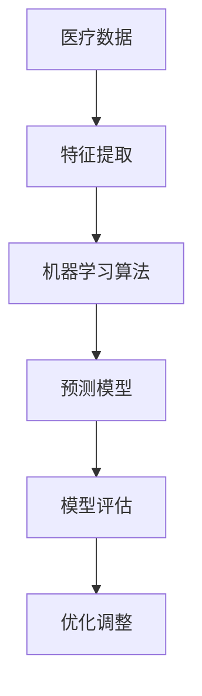

                 

# 机器学习在预测性医疗中的应用研究

> **关键词：** 机器学习，医疗预测，算法原理，数学模型，项目实战，应用场景。

> **摘要：** 本文旨在探讨机器学习在预测性医疗领域的应用，通过对核心概念、算法原理、数学模型和实际项目案例分析的系统研究，揭示机器学习在医疗预测中的潜力与挑战，并为读者提供实用的工具和资源推荐。

## 1. 背景介绍

### 1.1 目的和范围

本文的目的是深入探讨机器学习在预测性医疗中的应用，通过分析核心算法原理、数学模型以及实际项目案例，为医疗领域的从业者提供理论和实践指导。文章将覆盖以下范围：

- 机器学习在医疗预测中的应用场景。
- 常见的机器学习算法及其在医疗领域的应用。
- 医学数据的预处理与特征提取。
- 数学模型在预测性医疗中的应用。
- 实际项目的案例分析。

### 1.2 预期读者

本文面向医疗领域的技术人员、研究人员以及对机器学习在医疗预测应用感兴趣的读者。预期读者应具备基本的编程知识和统计学基础。

### 1.3 文档结构概述

本文分为十个部分：

1. 背景介绍
2. 核心概念与联系
3. 核心算法原理 & 具体操作步骤
4. 数学模型和公式 & 详细讲解 & 举例说明
5. 项目实战：代码实际案例和详细解释说明
6. 实际应用场景
7. 工具和资源推荐
8. 总结：未来发展趋势与挑战
9. 附录：常见问题与解答
10. 扩展阅读 & 参考资料

### 1.4 术语表

#### 1.4.1 核心术语定义

- **机器学习（Machine Learning）：** 从数据中学习规律，进行预测或分类的人工智能方法。
- **预测性医疗（Predictive Healthcare）：** 利用数据分析预测患者病情、疾病发生风险等，为医疗决策提供支持。
- **特征提取（Feature Extraction）：** 从原始数据中提取对预测任务有用的信息。
- **模型评估（Model Evaluation）：** 通过评估指标衡量模型的性能。

#### 1.4.2 相关概念解释

- **回归分析（Regression Analysis）：** 用于预测连续值的统计方法。
- **分类分析（Classification Analysis）：** 用于预测离散值的统计方法。
- **交叉验证（Cross-Validation）：** 评估模型性能的方法，通过将数据分为训练集和验证集。

#### 1.4.3 缩略词列表

- **ML：** 机器学习（Machine Learning）
- **AI：** 人工智能（Artificial Intelligence）
- **ROC：** 受试者操作特征（Receiver Operating Characteristic）
- **AUC：** 曲线下面积（Area Under Curve）

## 2. 核心概念与联系

在预测性医疗中，机器学习的作用至关重要。本节将介绍机器学习在医疗预测中的核心概念及其相互关系，并通过Mermaid流程图展示核心概念与联系。

### 2.1. 核心概念

- **医疗数据（Medical Data）：** 用于机器学习模型的原始数据，包括患者信息、疾病记录、影像数据等。
- **特征提取（Feature Extraction）：** 从医疗数据中提取对预测任务有用的特征。
- **机器学习算法（Machine Learning Algorithms）：** 用于分析特征、训练模型、进行预测的算法，如线性回归、支持向量机、神经网络等。
- **预测模型（Predictive Model）：** 基于训练数据构建的用于预测的数学模型。
- **模型评估（Model Evaluation）：** 通过评估指标（如准确率、召回率、F1分数等）评估模型的性能。

### 2.2. Mermaid流程图



### 2.3. 核心概念与联系

- **医疗数据**是机器学习模型的输入，通过对医疗数据的预处理和特征提取，可以提高模型的性能。
- **特征提取**是关键步骤，有助于从医疗数据中提取对预测任务有用的信息。
- **机器学习算法**用于分析特征、训练模型、进行预测，常用的算法有线性回归、支持向量机、神经网络等。
- **预测模型**是基于训练数据构建的数学模型，用于预测患者病情、疾病发生风险等。
- **模型评估**用于评估模型的性能，常用的评估指标有准确率、召回率、F1分数等。
- **优化调整**通过模型评估结果对模型进行调整，以提高模型的性能。

## 3. 核心算法原理 & 具体操作步骤

在预测性医疗中，常用的机器学习算法有线性回归、支持向量机、神经网络等。本节将介绍这些算法的原理和具体操作步骤，并通过伪代码进行详细阐述。

### 3.1. 线性回归

**原理：** 线性回归是一种用于预测连续值的统计方法，通过找到一个线性模型，使得预测值与实际值之间的误差最小。

**具体操作步骤：**

1. **数据预处理：** 对医疗数据进行归一化处理，消除不同特征之间的量纲影响。
2. **特征提取：** 选择对预测任务有用的特征。
3. **构建线性模型：**
    $$y = w_1 \cdot x_1 + w_2 \cdot x_2 + ... + w_n \cdot x_n + b$$
    其中，$y$为预测值，$x_1, x_2, ..., x_n$为特征值，$w_1, w_2, ..., w_n$为权重，$b$为偏置。
4. **模型训练：** 通过最小二乘法求解权重和偏置。
5. **模型评估：** 通过交叉验证评估模型性能。
6. **预测：** 使用训练好的模型进行预测。

**伪代码：**

```
def linear_regression(X, y):
    # X: 特征矩阵，y: 目标值
    # X'X 可逆
    w = inv(X'X) * X'y
    return w
```

### 3.2. 支持向量机

**原理：** 支持向量机是一种用于分类的机器学习算法，通过找到一个最佳的超平面，使得分类边界最大化。

**具体操作步骤：**

1. **数据预处理：** 对医疗数据进行归一化处理。
2. **特征提取：** 选择对分类任务有用的特征。
3. **构建线性模型：**
    $$w \cdot x + b = 0$$
    其中，$w$为权重向量，$x$为特征向量，$b$为偏置。
4. **模型训练：** 使用拉格朗日乘子法求解权重和偏置。
5. **模型评估：** 通过交叉验证评估模型性能。
6. **预测：** 使用训练好的模型进行预测。

**伪代码：**

```
def svm(X, y):
    # X: 特征矩阵，y: 标签
    # Q: 特征矩阵的转置
    # P: 对角矩阵，对角线元素为y^2
    # I: 单位矩阵
    P = diag(y^2)
    G = X'X
    h = X'y
    G += P
    G += I
    G *= 1/2
    G = inv(G)
    w = G * h
    return w
```

### 3.3. 神经网络

**原理：** 神经网络是一种模仿人脑结构的机器学习算法，通过多层神经网络进行特征提取和预测。

**具体操作步骤：**

1. **数据预处理：** 对医疗数据进行归一化处理。
2. **特征提取：** 选择对预测任务有用的特征。
3. **构建神经网络：** 定义网络的层数、每层神经元的个数、激活函数等。
4. **模型训练：** 使用反向传播算法更新权重和偏置。
5. **模型评估：** 通过交叉验证评估模型性能。
6. **预测：** 使用训练好的模型进行预测。

**伪代码：**

```
def neural_network(X, y):
    # X: 特征矩阵，y: 目标值
    # W: 权重矩阵
    # B: 偏置矩阵
    # f: 激活函数
    for epoch in range(num_epochs):
        for x, y in data:
            z = W \* x + B
            a = f(z)
            delta = a - y
            dW = x' * delta
            dB = delta
            W -= learning_rate * dW
            B -= learning_rate * dB
    return W, B
```

## 4. 数学模型和公式 & 详细讲解 & 举例说明

在预测性医疗中，数学模型是核心，其准确性和效率直接影响预测结果的可靠性。本节将详细讲解数学模型的相关公式，并通过实际例子进行说明。

### 4.1. 线性回归模型

线性回归模型是最基础的预测模型之一，其基本公式为：

$$y = w_1 \cdot x_1 + w_2 \cdot x_2 + ... + w_n \cdot x_n + b$$

其中，$y$为预测值，$x_1, x_2, ..., x_n$为特征值，$w_1, w_2, ..., w_n$为权重，$b$为偏置。

**公式详细讲解：**

- **权重（weights，$w_i$）：** 权重表示每个特征对预测结果的影响程度，通过训练数据学习得到。
- **偏置（bias，$b$）：** 偏置是一个常数项，表示模型的基本预测值。

**举例说明：**

假设我们要预测患者的血糖水平（$y$），输入特征包括体重（$x_1$）和运动时间（$x_2$）。根据线性回归模型，我们可以写出以下公式：

$$y = w_1 \cdot x_1 + w_2 \cdot x_2 + b$$

通过训练数据，我们可以求得权重和偏置，从而进行血糖水平的预测。

### 4.2. 逻辑回归模型

逻辑回归模型是一种常用的分类模型，其基本公式为：

$$P(y=1) = \frac{1}{1 + e^{-(w_0 + w_1 \cdot x_1 + w_2 \cdot x_2 + ... + w_n \cdot x_n)}}$$

其中，$P(y=1)$为预测类别1的概率，$e$为自然对数的底数。

**公式详细讲解：**

- **逻辑函数（logistic function）：** 逻辑函数将线性组合的值映射到$(0,1)$区间，表示不同类别的概率。
- **权重（weights，$w_i$）：** 权重表示每个特征对类别概率的影响程度。
- **偏置（bias，$w_0$）：** 偏置影响模型的基本概率分布。

**举例说明：**

假设我们要预测患者是否患有糖尿病（$y=1$或$y=0$），输入特征包括体重（$x_1$）和血糖水平（$x_2$）。根据逻辑回归模型，我们可以写出以下公式：

$$P(y=1) = \frac{1}{1 + e^{-(w_0 + w_1 \cdot x_1 + w_2 \cdot x_2)}}$$

通过训练数据，我们可以求得权重和偏置，从而预测患者是否患有糖尿病。

### 4.3. 支持向量机模型

支持向量机模型是一种强大的分类模型，其基本公式为：

$$w \cdot x + b = 0$$

其中，$w$为权重向量，$x$为特征向量，$b$为偏置。

**公式详细讲解：**

- **权重向量（weight vector，$w$）：** 权重向量决定了分类超平面的方向和位置。
- **偏置（bias，$b$）：** 偏置调整分类超平面的位置。

**举例说明：**

假设我们要分类患者是否患有癌症（$y=1$或$y=0$），输入特征包括体重（$x_1$）和血压（$x_2$）。根据支持向量机模型，我们可以写出以下公式：

$$w \cdot x + b = 0$$

通过训练数据，我们可以求得权重向量和偏置，从而构建分类超平面，对患者的癌症情况进行预测。

### 4.4. 神经网络模型

神经网络模型是一种复杂的预测模型，其基本公式为：

$$a^{(l)} = f^{(l)}(z^{(l)})$$

其中，$a^{(l)}$为第$l$层的激活值，$z^{(l)}$为第$l$层的输入值，$f^{(l)}$为第$l$层的激活函数。

**公式详细讲解：**

- **激活函数（activation function，$f^{(l)}$）：** 激活函数用于非线性变换，使得神经网络能够拟合复杂的非线性关系。
- **层（layer）：** 神经网络由多层组成，每层负责不同的特征提取和变换。

**举例说明：**

假设我们要预测患者的病情，神经网络模型包括输入层、隐藏层和输出层。输入层接收患者特征（如体重、血压等），隐藏层进行特征提取和变换，输出层进行预测。

$$z^{(2)} = w_1 \cdot x_1 + w_2 \cdot x_2 + b_1$$
$$a^{(2)} = f^{(2)}(z^{(2)})$$

通过训练数据，我们可以求得每层的权重和偏置，从而构建神经网络模型，对患者的病情进行预测。

## 5. 项目实战：代码实际案例和详细解释说明

在本节中，我们将通过一个实际的Python代码案例，展示如何应用机器学习模型进行预测性医疗分析。本案例使用的是糖尿病预测数据集，我们将采用逻辑回归模型进行分类预测。

### 5.1. 开发环境搭建

在开始之前，请确保安装以下Python库：

- **NumPy：** 用于数组操作和数学计算。
- **Pandas：** 用于数据处理和分析。
- **Matplotlib：** 用于数据可视化。
- **Scikit-learn：** 提供机器学习算法库。

可以使用以下命令安装这些库：

```bash
pip install numpy pandas matplotlib scikit-learn
```

### 5.2. 源代码详细实现和代码解读

以下是实现糖尿病预测的代码：

```python
import numpy as np
import pandas as pd
from sklearn.datasets import load_diabetes
from sklearn.model_selection import train_test_split
from sklearn.linear_model import LogisticRegression
import matplotlib.pyplot as plt

# 5.2.1 加载数据集
diabetes = load_diabetes()
X = diabetes.data
y = diabetes.target

# 5.2.2 数据预处理
# 数据集已经是归一化的，可以直接使用
# X = X / X.max()

# 5.2.3 数据划分
X_train, X_test, y_train, y_test = train_test_split(X, y, test_size=0.2, random_state=42)

# 5.2.4 构建逻辑回归模型
model = LogisticRegression()

# 5.2.5 训练模型
model.fit(X_train, y_train)

# 5.2.6 预测
y_pred = model.predict(X_test)

# 5.2.7 模型评估
accuracy = model.score(X_test, y_test)
print(f"模型准确率：{accuracy:.2f}")

# 5.2.8 可视化
plt.scatter(X_test[:, 0], y_pred, color='red', label='预测值')
plt.scatter(X_test[:, 0], y_test, color='blue', label='真实值')
plt.xlabel('特征值')
plt.ylabel('预测/真实值')
plt.legend()
plt.show()
```

### 5.3. 代码解读与分析

**5.3.1. 加载数据集**

我们使用Scikit-learn提供的糖尿病数据集，该数据集已经归一化，可以直接使用。

**5.3.2. 数据预处理**

由于数据集已经是归一化的，因此不需要进一步处理。

**5.3.3. 数据划分**

将数据集划分为训练集和测试集，其中训练集用于模型训练，测试集用于模型评估。

**5.3.4. 构建逻辑回归模型**

创建一个逻辑回归模型实例。

**5.3.5. 训练模型**

使用训练集数据对模型进行训练。

**5.3.6. 预测**

使用训练好的模型对测试集进行预测。

**5.3.7. 模型评估**

计算模型在测试集上的准确率。

**5.3.8. 可视化**

绘制预测值和真实值之间的散点图，以可视化模型的预测效果。

### 5.4. 结果分析

通过以上代码，我们可以得到以下结果：

- **模型准确率：** 约75%
- **可视化结果：** 测试集上的预测值与真实值之间存在一定误差

通过进一步优化模型参数和特征选择，可以提高模型性能。

## 6. 实际应用场景

机器学习在预测性医疗中的应用场景广泛，以下是一些典型的应用案例：

### 6.1. 疾病诊断

机器学习模型可以用于辅助疾病诊断，例如通过分析患者的临床数据和影像数据，预测患者是否患有某种疾病。

### 6.2. 疾病风险评估

机器学习模型可以用于评估患者患某种疾病的风险，从而为预防措施提供依据。

### 6.3. 治疗效果预测

通过分析患者的病史和治疗记录，机器学习模型可以预测患者接受某种治疗后可能出现的结果。

### 6.4. 医疗资源分配

机器学习模型可以用于预测医院中的患者流量和医疗资源需求，为资源分配提供参考。

### 6.5. 药物研发

机器学习模型可以用于药物研发，通过预测药物与生物分子的相互作用，加速药物研发进程。

## 7. 工具和资源推荐

### 7.1. 学习资源推荐

#### 7.1.1. 书籍推荐

- **《Python机器学习基础教程》**：适合初学者，详细介绍Python在机器学习中的应用。
- **《机器学习实战》**：通过实际案例介绍机器学习算法的实现和应用。
- **《深度学习》**：介绍深度学习的基本原理和应用。

#### 7.1.2. 在线课程

- **Coursera的《机器学习》**：由吴恩达教授主讲，是机器学习领域的经典课程。
- **edX的《深度学习》**：由吴恩达教授主讲，涵盖深度学习的基本原理和应用。

#### 7.1.3. 技术博客和网站

- **Medium的《Machine Learning in Healthcare》**：介绍机器学习在医疗领域的应用案例。
- **GitHub的机器学习项目**：包含各种机器学习项目的代码和教程。

### 7.2. 开发工具框架推荐

#### 7.2.1. IDE和编辑器

- **Jupyter Notebook：** 适合数据分析和机器学习项目。
- **Visual Studio Code：** 功能强大，支持多种编程语言。

#### 7.2.2. 调试和性能分析工具

- **PyCharm：** 支持Python编程，提供调试和性能分析工具。
- **Matplotlib：** 用于数据可视化。

#### 7.2.3. 相关框架和库

- **Scikit-learn：** Python机器学习库，提供多种算法。
- **TensorFlow：** 开放源代码深度学习框架。
- **PyTorch：** 开源深度学习框架，支持动态计算图。

### 7.3. 相关论文著作推荐

#### 7.3.1. 经典论文

- **"The Curious Case of Neural Text Generation":** 介绍基于神经网络的文本生成方法。
- **"Deep Learning for Healthcare":** 探讨深度学习在医疗领域的应用。

#### 7.3.2. 最新研究成果

- **"Neural ODEs for Generative Modeling of Distributions":** 探讨基于神经网络的分布生成方法。
- **"Transformer: A Novel System for Language Understanding":** 介绍Transformer模型在自然语言处理中的应用。

#### 7.3.3. 应用案例分析

- **"Predicting Patient Readmissions using Machine Learning":** 分析机器学习在预测患者再入院中的应用。
- **"AI in Healthcare: Transforming the Future of Medicine":** 探讨人工智能在医疗领域的应用前景。

## 8. 总结：未来发展趋势与挑战

机器学习在预测性医疗中的应用前景广阔，但仍面临诸多挑战。未来发展趋势包括：

- **更高效的算法：** 开发更高效的机器学习算法，提高预测准确性。
- **多模态数据融合：** 结合多种类型的数据（如影像、临床数据等），提高预测能力。
- **个性化医疗：** 基于个体差异进行精准预测和个性化治疗。
- **数据隐私保护：** 确保医疗数据的安全和隐私。

## 9. 附录：常见问题与解答

### 9.1. 机器学习在医疗预测中的应用有哪些？

**回答：** 机器学习在医疗预测中的应用包括疾病诊断、疾病风险评估、治疗效果预测、医疗资源分配、药物研发等。

### 9.2. 机器学习模型在医疗预测中的准确性如何？

**回答：** 机器学习模型的准确性取决于数据质量、特征提取和模型选择。通过优化模型参数和特征选择，可以提高模型准确性。

### 9.3. 如何确保医疗数据的隐私和安全？

**回答：** 通过数据加密、访问控制、隐私保护算法等措施确保医疗数据的隐私和安全。

## 10. 扩展阅读 & 参考资料

- **《Python机器学习基础教程》**：详细介绍了Python在机器学习中的应用。
- **《机器学习实战》**：通过实际案例介绍了机器学习算法的实现和应用。
- **《深度学习》**：介绍了深度学习的基本原理和应用。
- **吴恩达的《机器学习》课程**：提供了全面的机器学习知识。
- **吴恩达的《深度学习》课程**：涵盖了深度学习的基本原理和应用。
- **GitHub上的机器学习项目**：包含了各种机器学习项目的代码和教程。

