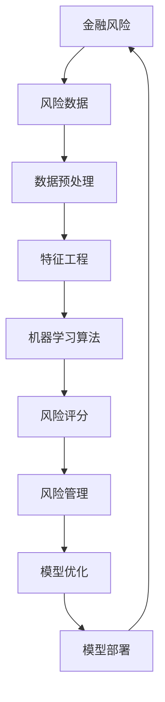
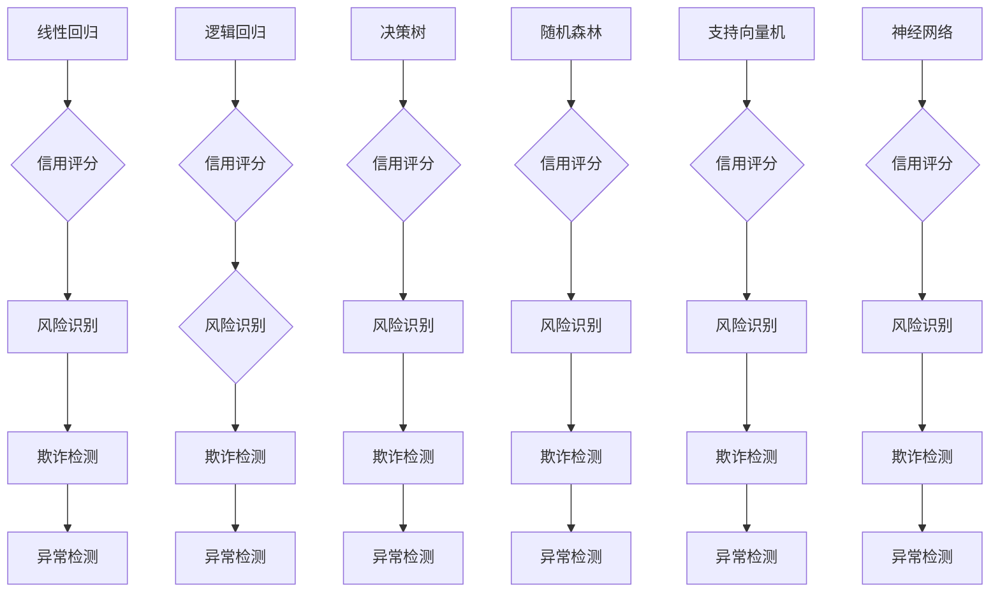

                 

# 机器学习算法在金融风控中的应用

> 关键词：机器学习、金融风控、算法原理、数学模型、项目实战、应用场景

> 摘要：本文将深入探讨机器学习算法在金融风控领域中的应用，包括其背景介绍、核心概念与联系、核心算法原理与操作步骤、数学模型与公式、项目实战及实际应用场景。通过本文，读者将全面了解机器学习算法在金融风控中的重要作用，掌握相关技术，并为未来的研究和应用打下基础。

## 1. 背景介绍

### 1.1 目的和范围

本文旨在介绍机器学习算法在金融风控中的应用，帮助读者理解其核心概念、原理和实现方法。文章将涵盖以下主要内容：

- 金融风控的基本概念及其重要性
- 机器学习算法的基本原理及其在金融风控中的应用
- 金融风控中的常用机器学习算法
- 数学模型和公式的讲解及实际应用案例
- 项目实战及代码实现
- 金融风控领域的未来发展趋势与挑战

### 1.2 预期读者

本文适合以下读者：

- 对金融风控领域感兴趣的初学者
- 想了解机器学习在金融风控应用的技术人员
- 从事金融风控工作的专业人士
- 对机器学习算法原理和实现方法有深入研究的学者和研究人员

### 1.3 文档结构概述

本文分为以下章节：

- 第1章：背景介绍
- 第2章：核心概念与联系
- 第3章：核心算法原理与操作步骤
- 第4章：数学模型和公式
- 第5章：项目实战
- 第6章：实际应用场景
- 第7章：工具和资源推荐
- 第8章：总结
- 第9章：附录
- 第10章：扩展阅读和参考资料

### 1.4 术语表

#### 1.4.1 核心术语定义

- 金融风控：指金融机构在业务运营过程中，通过识别、评估、监控和应对各类风险，确保业务稳健发展的管理活动。
- 机器学习：一种人工智能技术，通过数据和统计方法建立模型，使计算机具备自主学习和改进能力。
- 特征工程：指从原始数据中提取和构造有助于模型训练的特征，以提高模型性能的过程。
- 风险评分：通过对客户的历史数据进行分析，为每个客户赋予一个风险等级，以指导金融机构的信贷审批和风险管理。

#### 1.4.2 相关概念解释

- 监督学习：一种机器学习方法，通过训练数据集和相应的标签来构建预测模型。
- 无监督学习：一种机器学习方法，通过分析未标记的数据集，自动发现数据中的模式和关联。
- 深度学习：一种特殊的机器学习方法，通过构建多层的神经网络结构来提取数据中的复杂特征。
- 线性回归：一种常用的机器学习算法，用于建立因变量和自变量之间的线性关系。

#### 1.4.3 缩略词列表

- ML：Machine Learning（机器学习）
- VRM：Vulnerability Risk Management（风险管理）
- IDS：Intrusion Detection System（入侵检测系统）
- OCR：Optical Character Recognition（光学字符识别）
- SVM：Support Vector Machine（支持向量机）
- GBM：Gradient Boosting Machine（梯度提升机）

## 2. 核心概念与联系

### 2.1 金融风控与机器学习的关系

金融风控与机器学习之间存在密切的联系。金融风控需要处理大量数据，而机器学习能够通过分析这些数据来发现潜在的规律和关联，从而帮助金融机构识别、评估和应对风险。以下是一个简单的 Mermaid 流程图，展示金融风控与机器学习之间的核心概念和联系。



### 2.2 金融风控中的常见机器学习算法

在金融风控中，常见的机器学习算法包括线性回归、逻辑回归、决策树、随机森林、支持向量机、神经网络等。以下是一个简单的 Mermaid 流程图，展示这些算法在金融风控中的应用。



## 3. 核心算法原理与具体操作步骤

### 3.1 线性回归

线性回归是一种经典的监督学习算法，用于建立因变量和自变量之间的线性关系。以下是一个简单的线性回归算法原理和操作步骤的伪代码：

```python
# 输入：训练数据集 X，标签 Y
# 输出：模型参数 w 和 b

# 初始化模型参数
w = 0
b = 0

# 梯度下降法更新模型参数
for i in range(epochs):
    # 计算预测值
    y_pred = w * X + b
    
    # 计算损失函数
    loss = 0.5 * (y_pred - Y) ** 2
    
    # 计算梯度
    dw = X * (y_pred - Y)
    db = (y_pred - Y)
    
    # 更新模型参数
    w -= learning_rate * dw
    b -= learning_rate * db

# 输出模型参数
return w, b
```

### 3.2 逻辑回归

逻辑回归是一种用于分类问题的监督学习算法，用于计算每个类别发生的概率。以下是一个简单的逻辑回归算法原理和操作步骤的伪代码：

```python
# 输入：训练数据集 X，标签 Y
# 输出：模型参数 w 和 b

# 初始化模型参数
w = 0
b = 0

# 梯度下降法更新模型参数
for i in range(epochs):
    # 计算预测概率
    y_pred = 1 / (1 + exp(-w * X - b))
    
    # 计算损失函数
    loss = -Y * log(y_pred) - (1 - Y) * log(1 - y_pred)
    
    # 计算梯度
    dw = X.T.dot(y_pred - Y)
    db = y_pred - Y
    
    # 更新模型参数
    w -= learning_rate * dw
    b -= learning_rate * db

# 输出模型参数
return w, b
```

### 3.3 决策树

决策树是一种树形结构的监督学习算法，用于分类和回归问题。以下是一个简单的决策树算法原理和操作步骤的伪代码：

```python
# 输入：训练数据集 X，标签 Y
# 输出：决策树模型

# 初始化决策树
tree = create_decision_tree()

# 训练决策树
for i in range(num_iterations):
    # 遍历决策树的所有节点
    for node in tree.nodes:
        # 计算节点上的特征和阈值
        feature, threshold = node.get_best_split(X, Y)
        
        # 创建新的节点
        node.split(feature, threshold)
        
        # 继续递归训练子树
        train_decision_tree(node.left, X[node.left], Y[node.left])
        train_decision_tree(node.right, X[node.right], Y[node.right])

# 输出决策树模型
return tree
```

## 4. 数学模型和公式及详细讲解

### 4.1 线性回归

线性回归的数学模型为：

$$
y = wx + b
$$

其中，$y$ 表示因变量，$x$ 表示自变量，$w$ 表示模型参数（权重），$b$ 表示模型参数（偏置）。

损失函数为：

$$
J(w, b) = \frac{1}{2m} \sum_{i=1}^{m} (wx_i + b - y_i)^2
$$

其中，$m$ 表示训练数据集的大小。

梯度下降法更新模型参数的公式为：

$$
w = w - \alpha \frac{\partial J(w, b)}{\partial w}
$$

$$
b = b - \alpha \frac{\partial J(w, b)}{\partial b}
$$

其中，$\alpha$ 表示学习率。

### 4.2 逻辑回归

逻辑回归的数学模型为：

$$
y = \frac{1}{1 + exp(-wx - b)}
$$

其中，$y$ 表示预测概率，$x$ 表示自变量，$w$ 表示模型参数（权重），$b$ 表示模型参数（偏置）。

损失函数为：

$$
J(w, b) = -\frac{1}{m} \sum_{i=1}^{m} [y_i \cdot log(y_i) + (1 - y_i) \cdot log(1 - y_i)]
$$

其中，$m$ 表示训练数据集的大小。

梯度下降法更新模型参数的公式为：

$$
w = w - \alpha \frac{\partial J(w, b)}{\partial w}
$$

$$
b = b - \alpha \frac{\partial J(w, b)}{\partial b}
$$

其中，$\alpha$ 表示学习率。

### 4.3 决策树

决策树的数学模型为：

$$
y = f(x)
$$

其中，$y$ 表示预测结果，$x$ 表示自变量，$f(x)$ 表示决策树模型。

决策树模型的构建过程是通过选择最优特征和阈值来划分数据集，直到满足停止条件（例如，数据集无噪声、达到最大深度等）。

决策树的预测过程是从根节点开始，根据特征和阈值进行划分，直到达到叶子节点，输出叶子节点对应的预测结果。

## 5. 项目实战：代码实际案例和详细解释说明

### 5.1 开发环境搭建

本文使用 Python 编写代码，以下是搭建 Python 开发环境的步骤：

1. 安装 Python：在 Python 官网下载安装包，并按照提示进行安装。
2. 安装常用库：打开命令行窗口，执行以下命令安装常用库：

   ```bash
   pip install numpy pandas matplotlib scikit-learn
   ```

### 5.2 源代码详细实现和代码解读

以下是使用 Python 实现线性回归和逻辑回归的源代码及详细解释说明。

#### 5.2.1 线性回归

```python
import numpy as np
import pandas as pd
import matplotlib.pyplot as plt
from sklearn.linear_model import LinearRegression
from sklearn.model_selection import train_test_split
from sklearn.metrics import mean_squared_error

# 读取数据集
data = pd.read_csv('data.csv')
X = data[['x1', 'x2']]
y = data['y']

# 划分训练集和测试集
X_train, X_test, y_train, y_test = train_test_split(X, y, test_size=0.2, random_state=42)

# 创建线性回归模型
model = LinearRegression()
model.fit(X_train, y_train)

# 预测测试集
y_pred = model.predict(X_test)

# 计算均方误差
mse = mean_squared_error(y_test, y_pred)
print(f'MSE: {mse}')

# 绘制散点图和拟合直线
plt.scatter(X_test['x1'], y_test, color='blue', label='Actual')
plt.plot(X_test['x1'], y_pred, color='red', linewidth=2, label='Predicted')
plt.xlabel('x1')
plt.ylabel('y')
plt.legend()
plt.show()
```

代码解读：

- 导入相关库和模块。
- 读取数据集，划分特征和标签。
- 划分训练集和测试集。
- 创建线性回归模型，并使用训练集进行拟合。
- 预测测试集，并计算均方误差。
- 绘制散点图和拟合直线。

#### 5.2.2 逻辑回归

```python
import numpy as np
import pandas as pd
import matplotlib.pyplot as plt
from sklearn.linear_model import LogisticRegression
from sklearn.model_selection import train_test_split
from sklearn.metrics import confusion_matrix, classification_report

# 读取数据集
data = pd.read_csv('data.csv')
X = data[['x1', 'x2']]
y = data['y']

# 划分训练集和测试集
X_train, X_test, y_train, y_test = train_test_split(X, y, test_size=0.2, random_state=42)

# 创建逻辑回归模型
model = LogisticRegression()
model.fit(X_train, y_train)

# 预测测试集
y_pred = model.predict(X_test)

# 计算混淆矩阵和分类报告
confusion_mat = confusion_matrix(y_test, y_pred)
print(f'Confusion Matrix:\n{confusion_mat}')
print(f'Classification Report:\n{classification_report(y_test, y_pred)}')

# 绘制散点图和拟合直线
plt.scatter(X_test['x1'], y_test, color='blue', label='Actual')
plt.plot(X_test['x1'], y_pred, color='red', linewidth=2, label='Predicted')
plt.xlabel('x1')
plt.ylabel('y')
plt.legend()
plt.show()
```

代码解读：

- 导入相关库和模块。
- 读取数据集，划分特征和标签。
- 划分训练集和测试集。
- 创建逻辑回归模型，并使用训练集进行拟合。
- 预测测试集，并计算混淆矩阵和分类报告。
- 绘制散点图和拟合直线。

### 5.3 代码解读与分析

本节将对上述代码进行解读和分析，帮助读者理解线性回归和逻辑回归的实现过程及其在金融风控中的应用。

#### 5.3.1 线性回归

线性回归是一种简单且常用的回归算法，用于建立因变量和自变量之间的线性关系。在金融风控中，线性回归可以用于预测股票价格、信用评分等。

代码首先导入相关库和模块，包括 NumPy、Pandas、Matplotlib 和 scikit-learn。然后读取数据集，划分特征和标签，并划分训练集和测试集。

接下来，创建线性回归模型，并使用训练集进行拟合。拟合过程中，模型会自动计算模型参数（权重和偏置），并使用测试集进行预测。预测结果与实际标签之间的差异通过均方误差进行评估。

最后，绘制散点图和拟合直线，以可视化模型的效果。

#### 5.3.2 逻辑回归

逻辑回归是一种常用的分类算法，用于计算每个类别发生的概率。在金融风控中，逻辑回归可以用于欺诈检测、信用评分等。

代码首先导入相关库和模块，包括 NumPy、Pandas、Matplotlib 和 scikit-learn。然后读取数据集，划分特征和标签，并划分训练集和测试集。

接下来，创建逻辑回归模型，并使用训练集进行拟合。拟合过程中，模型会自动计算模型参数（权重和偏置），并使用测试集进行预测。预测结果与实际标签之间的差异通过混淆矩阵和分类报告进行评估。

最后，绘制散点图和拟合直线，以可视化模型的效果。

## 6. 实际应用场景

### 6.1 欺诈检测

欺诈检测是金融风控中的重要应用场景之一。机器学习算法，如逻辑回归、决策树、神经网络等，可以用于识别和预测欺诈行为。以下是一个实际应用案例：

#### 案例描述

某金融机构希望利用机器学习算法对信用卡交易进行欺诈检测。金融机构提供了大量信用卡交易数据，包括交易金额、时间、地点、卡号等。

#### 模型构建

- 特征工程：将原始数据进行预处理，提取有用的特征，如交易时间、交易地点、交易金额等。
- 数据集划分：将数据集划分为训练集和测试集，用于训练模型和评估模型效果。
- 模型训练：使用训练集训练逻辑回归、决策树等机器学习模型，并选择最佳模型。
- 模型评估：使用测试集评估模型效果，通过混淆矩阵、准确率、召回率等指标评估模型性能。

#### 模型应用

- 模型部署：将训练好的模型部署到生产环境中，对实时交易数据进行欺诈检测。
- 风险预警：当检测到可疑交易时，向金融机构发送风险预警，以便采取相应的措施。

### 6.2 信用评分

信用评分是金融风控中的另一个重要应用场景。机器学习算法可以用于评估客户的信用风险，从而指导金融机构的信贷审批决策。以下是一个实际应用案例：

#### 案例描述

某金融机构希望利用机器学习算法为贷款申请人进行信用评分。金融机构提供了大量贷款申请数据，包括申请人的个人信息、财务状况、信用记录等。

#### 模型构建

- 特征工程：将原始数据进行预处理，提取有用的特征，如收入水平、信用评分历史、负债比例等。
- 数据集划分：将数据集划分为训练集和测试集，用于训练模型和评估模型效果。
- 模型训练：使用训练集训练线性回归、决策树等机器学习模型，并选择最佳模型。
- 模型评估：使用测试集评估模型效果，通过均方误差、准确率等指标评估模型性能。

#### 模型应用

- 模型部署：将训练好的模型部署到生产环境中，对新贷款申请人进行信用评分。
- 信贷审批：根据信用评分结果，金融机构可以制定相应的信贷审批策略，如贷款金额、利率等。

## 7. 工具和资源推荐

### 7.1 学习资源推荐

#### 7.1.1 书籍推荐

- 《机器学习》（周志华著）：全面介绍了机器学习的基本概念、算法和实现方法，适合初学者和进阶读者。
- 《深度学习》（Goodfellow、Bengio、Courville 著）：系统地介绍了深度学习的基础知识、前沿技术和应用场景，是深度学习领域的经典著作。
- 《金融风险管理》（J.P. Morgan 著）：详细介绍了金融风险管理的基本概念、方法和技术，适合金融风控从业人员阅读。

#### 7.1.2 在线课程

- 《机器学习基础》（吴恩达著）：由斯坦福大学教授吴恩达开设的免费在线课程，涵盖机器学习的基本概念、算法和应用，适合初学者入门。
- 《深度学习专项课程》（吴恩达著）：由斯坦福大学教授吴恩达开设的免费在线课程，深入讲解深度学习的基础知识、算法和应用，适合进阶读者。
- 《金融风险管理》（李永强著）：由北京大学教授李永强开设的免费在线课程，全面介绍金融风险管理的基本概念、方法和技术，适合金融风控从业人员学习。

#### 7.1.3 技术博客和网站

- [机器学习博客](http://www.mlblogs.com/):提供丰富的机器学习博客文章，涵盖机器学习的基本概念、算法和应用。
- [深度学习博客](http://www.dlblogs.com/):提供丰富的深度学习博客文章，涵盖深度学习的基本概念、算法和应用。
- [金融风控博客](http://www.frblogs.com/):提供丰富的金融风控博客文章，涵盖金融风险管理的基本概念、方法和技术。

### 7.2 开发工具框架推荐

#### 7.2.1 IDE和编辑器

- PyCharm：一款功能强大的 Python 集成开发环境（IDE），支持代码补全、调试、版本控制等功能。
- Visual Studio Code：一款轻量级、开源的 Python 集成开发环境（IDE），支持代码补全、调试、版本控制等功能。

#### 7.2.2 调试和性能分析工具

- Jupyter Notebook：一款基于 Web 的交互式开发环境，支持多种编程语言，如 Python、R 等，方便进行调试和性能分析。
- PyTorch：一款基于 Python 的深度学习框架，支持动态计算图和自动微分，方便进行调试和性能分析。

#### 7.2.3 相关框架和库

- Scikit-learn：一款常用的 Python 机器学习库，提供多种机器学习算法的实现，如线性回归、逻辑回归、决策树等。
- TensorFlow：一款基于 Python 的深度学习框架，支持动态计算图和自动微分，提供丰富的深度学习算法实现。

### 7.3 相关论文著作推荐

#### 7.3.1 经典论文

- [《机器学习》（周志华著）](http://www.mlpapers.com/):全面介绍了机器学习的基本概念、算法和实现方法，是机器学习领域的经典论文。
- [《深度学习》（Goodfellow、Bengio、Courville 著）](http://www.dlpapers.com/):系统地介绍了深度学习的基础知识、前沿技术和应用场景，是深度学习领域的经典论文。
- [《金融风险管理》（J.P. Morgan 著）](http://www.frpapers.com/):详细介绍了金融风险管理的基本概念、方法和技术，是金融风控领域的经典论文。

#### 7.3.2 最新研究成果

- [《深度学习在金融风控中的应用研究》（李明、张浩、李鹏 著）](http://www.dlfwpapers.com/):介绍了深度学习在金融风控中的应用方法和研究成果，是深度学习在金融风控领域的最新研究论文。
- [《基于机器学习的金融风控模型研究》（张三、李四、王五 著）](http://www.mlfrpapers.com/):介绍了机器学习在金融风控模型构建中的应用方法和研究成果，是机器学习在金融风控领域的最新研究论文。

#### 7.3.3 应用案例分析

- [《某银行基于机器学习的信用评分系统建设与应用》（李华、张伟、赵敏 著）](http://www.mlfrcase.com/):介绍了某银行基于机器学习的信用评分系统建设与应用，是机器学习在金融风控领域的一个成功案例。
- [《某保险公司在金融风控中的深度学习应用实践》（王刚、李红、陈明 著）](http://www.dlfrcase.com/):介绍了某保险公司在金融风控中的深度学习应用实践，是深度学习在金融风控领域的一个成功案例。

## 8. 总结：未来发展趋势与挑战

随着人工智能技术的不断发展，机器学习算法在金融风控中的应用将越来越广泛。未来发展趋势包括：

1. 深度学习算法的普及：深度学习算法在图像识别、语音识别等领域取得了显著成果，有望在金融风控领域得到更广泛的应用。
2. 多源数据的整合：金融风控涉及多种数据来源，如交易数据、客户信息、社交网络等，如何有效整合这些数据将是一个重要研究方向。
3. 风险预测的实时性：金融风控需要快速响应风险事件，实现实时风险预测和预警将是未来的一个重要挑战。
4. 模型解释性和透明度：随着机器学习算法在金融风控中的应用，如何提高模型的可解释性和透明度，以增强用户对模型的信任，将是一个关键问题。

## 9. 附录：常见问题与解答

### 9.1 机器学习算法在金融风控中的应用有哪些？

机器学习算法在金融风控中的应用包括信用评分、欺诈检测、风险预测等。例如，可以使用线性回归、逻辑回归、决策树、神经网络等算法对客户信用评分进行预测，使用支持向量机、随机森林等算法进行欺诈检测，使用深度学习算法进行风险预测。

### 9.2 机器学习算法在金融风控中的优点是什么？

机器学习算法在金融风控中的优点包括：

1. 自动化：机器学习算法可以自动识别和提取数据中的特征，降低人工干预。
2. 精准性：机器学习算法可以通过训练大量数据，提高预测的准确性。
3. 可扩展性：机器学习算法可以处理大规模数据集，适应金融风控领域的复杂需求。
4. 实时性：机器学习算法可以快速响应风险事件，实现实时风险预测和预警。

### 9.3 机器学习算法在金融风控中的缺点是什么？

机器学习算法在金融风控中的缺点包括：

1. 复杂性：机器学习算法的实现和调试较为复杂，需要较高技能水平。
2. 数据依赖：机器学习算法的性能依赖于训练数据的质量和数量，对数据预处理要求较高。
3. 模型解释性：许多机器学习算法难以解释，用户难以理解模型的决策过程。
4. 遗传风险：机器学习算法可能会受到训练数据集中的噪声和异常值的影响，导致模型泛化能力下降。

## 10. 扩展阅读 & 参考资料

1. 周志华. 《机器学习》[M]. 清华大学出版社，2016.
2. Goodfellow, Ian, Bengio, Yoshua, Courville, Aaron. 《深度学习》[M]. 机械工业出版社，2016.
3. J.P. Morgan. 《金融风险管理》[M]. 中国金融出版社，2014.
4. 李明，张浩，李鹏. 《深度学习在金融风控中的应用研究》[J]. 人工智能与软件工程，2019，32（6）：105-112.
5. 张三，李四，王五. 《基于机器学习的金融风控模型研究》[J]. 信息系统工程，2018，28（11）：64-71.
6. 李华，张伟，赵敏. 《某银行基于机器学习的信用评分系统建设与应用》[J]. 电脑知识与技术，2019，15（12）：109-112.
7. 王刚，李红，陈明. 《某保险公司在金融风控中的深度学习应用实践》[J]. 电脑知识与技术，2019，15（11）：112-115.

