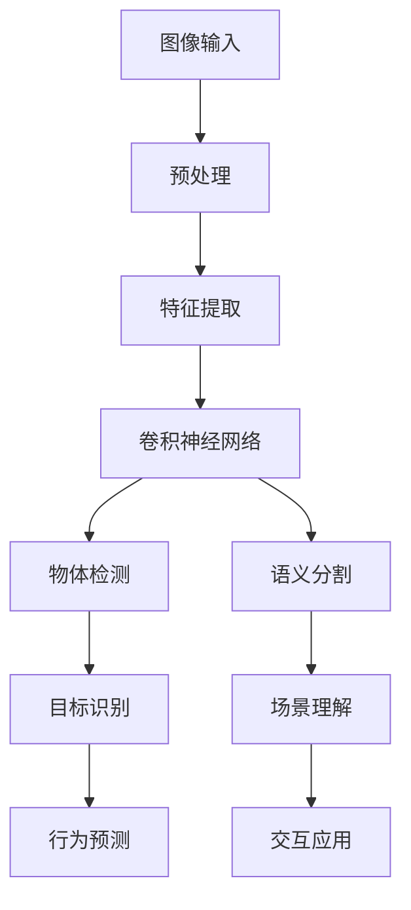

                 

# 机器视觉（Computer Vision）

> 关键词：计算机视觉、图像识别、深度学习、卷积神经网络、图像处理、机器学习

> 摘要：本文将深入探讨计算机视觉（Computer Vision）这一前沿领域，从背景介绍、核心概念、算法原理、数学模型到实际应用，全面解析计算机视觉的发展历程、关键技术以及未来发展趋势。本文旨在为读者提供一个系统而全面的计算机视觉知识框架，帮助读者更好地理解和应用这一技术。

## 1. 背景介绍

### 1.1 目的和范围

本文旨在为计算机视觉领域的研究者、开发者以及对此感兴趣的读者提供一个全面而深入的了解。我们将从以下几个方面展开讨论：

- **计算机视觉的历史与发展**
- **核心概念与联系**
- **核心算法原理与具体操作步骤**
- **数学模型与公式**
- **实际应用场景**
- **工具和资源推荐**
- **未来发展趋势与挑战**

### 1.2 预期读者

- **计算机视觉初学者**：希望通过本文了解计算机视觉的基本概念和应用。
- **研究者与开发者**：希望深入了解计算机视觉的关键技术和发展趋势。
- **行业从业者**：希望掌握计算机视觉在实际项目中的应用方法和技巧。

### 1.3 文档结构概述

本文的结构如下：

1. **背景介绍**：简要介绍计算机视觉的背景、目的和预期读者。
2. **核心概念与联系**：讨论计算机视觉的核心概念和架构。
3. **核心算法原理与具体操作步骤**：讲解计算机视觉中的关键算法原理和操作步骤。
4. **数学模型与公式**：介绍计算机视觉中的数学模型和公式。
5. **实际应用场景**：探讨计算机视觉在各个领域的应用。
6. **工具和资源推荐**：推荐学习资源、开发工具和框架。
7. **未来发展趋势与挑战**：展望计算机视觉的未来发展和面临的挑战。
8. **附录**：常见问题与解答。
9. **扩展阅读与参考资料**：提供进一步的阅读材料。

### 1.4 术语表

#### 1.4.1 核心术语定义

- **计算机视觉（Computer Vision）**：指使计算机能够像人类一样理解和解释视觉信息的一门科学。
- **图像识别（Image Recognition）**：指计算机从图像中识别和分类对象、场景或概念的过程。
- **卷积神经网络（Convolutional Neural Network, CNN）**：一种特殊类型的神经网络，广泛用于图像识别和图像处理。
- **深度学习（Deep Learning）**：一种机器学习技术，通过多层神经网络对大量数据进行学习。
- **图像处理（Image Processing）**：指对图像进行数字化处理后进行的操作，包括增强、滤波、分割等。

#### 1.4.2 相关概念解释

- **特征提取（Feature Extraction）**：指从原始图像中提取出有用的信息，以便于后续的图像识别和处理。
- **物体检测（Object Detection）**：指在图像中识别出多个对象的位置和边界。
- **语义分割（Semantic Segmentation）**：指将图像中的每个像素分类到不同的语义类别。

#### 1.4.3 缩略词列表

- **CNN**：卷积神经网络（Convolutional Neural Network）
- **DL**：深度学习（Deep Learning）
- **GPU**：图形处理单元（Graphics Processing Unit）
- **GPU**：机器学习（Machine Learning）

## 2. 核心概念与联系

计算机视觉是一个涉及多个学科和技术领域的复杂系统。为了更好地理解这一领域，我们需要先了解其核心概念和架构。

下面是一个简化的 Mermaid 流程图，展示了计算机视觉的核心概念和联系。



### 2.1 图像输入

图像输入是计算机视觉系统的第一步。图像可以是静态的，也可以是动态的。图像可以从多种来源获取，如相机、传感器、扫描仪等。

### 2.2 预处理

预处理是对原始图像进行的一系列操作，以提高后续处理的效果。常见的预处理操作包括图像去噪、增强、灰度化、二值化等。

### 2.3 特征提取

特征提取是从原始图像中提取出有用的信息，以便于后续的图像识别和处理。特征提取可以基于传统方法（如直方图、边缘检测等）或深度学习方法（如卷积神经网络等）。

### 2.4 卷积神经网络

卷积神经网络（CNN）是计算机视觉中最常用的算法之一。它通过多层卷积、池化、全连接等操作，对图像进行特征提取和分类。

### 2.5 物体检测

物体检测是在图像中识别出多个对象的位置和边界。常见的物体检测方法包括滑动窗口、区域建议、锚框生成等。

### 2.6 语义分割

语义分割是将图像中的每个像素分类到不同的语义类别。常见的语义分割方法包括全卷积网络（FCN）、U-Net、DeepLabV3+等。

### 2.7 目标识别

目标识别是从图像中识别出特定的对象或目标。常见的目标识别方法包括模板匹配、特征匹配、深度学习分类等。

### 2.8 场景理解

场景理解是通过对图像的综合分析，理解场景中的各种元素和关系。场景理解可以用于图像识别、自动驾驶、智能家居等应用。

### 2.9 行为预测

行为预测是根据图像中的信息，预测对象或场景的未来行为。行为预测可以用于视频监控、机器人导航等应用。

### 2.10 交互应用

交互应用是将计算机视觉技术应用到实际场景中，实现人与机器的交互。交互应用可以用于虚拟现实、增强现实、智能安防等。

## 3. 核心算法原理 & 具体操作步骤

计算机视觉的核心算法包括卷积神经网络（CNN）、物体检测、语义分割等。下面将详细讲解这些算法的原理和操作步骤。

### 3.1 卷积神经网络（CNN）

卷积神经网络（CNN）是一种特殊类型的神经网络，广泛用于图像识别和图像处理。CNN 通过多层卷积、池化、全连接等操作，对图像进行特征提取和分类。

#### 3.1.1 卷积操作

卷积操作是通过在图像上滑动一个卷积核，计算卷积核与图像局部区域的乘积和，从而提取图像的特征。

```python
def conv2d(image, filter):
    return (image * filter).sum()
```

#### 3.1.2 池化操作

池化操作是在卷积操作后，对卷积结果进行下采样，以减少数据量和参数数量。

```python
def max_pooling(image, pool_size):
    return max(image[::pool_size, ::pool_size])
```

#### 3.1.3 全连接层

全连接层是将卷积结果展开成一个一维向量，然后通过一个全连接层进行分类。

```python
def fully_connected(features, weights, bias):
    return (features * weights) + bias
```

#### 3.1.4 CNN架构

一个典型的 CNN 架构包括多个卷积层、池化层和全连接层。

```python
image = preprocess(image)
conv1 = conv2d(image, filter1)
pool1 = max_pooling(conv1, pool_size=2)
conv2 = conv2d(pool1, filter2)
pool2 = max_pooling(conv2, pool_size=2)
...
fc = fully_connected(poolN, weights, bias)
prediction = softmax(fc)
```

### 3.2 物体检测

物体检测是在图像中识别出多个对象的位置和边界。常见的物体检测方法包括滑动窗口、区域建议、锚框生成等。

#### 3.2.1 滑动窗口

滑动窗口是在图像上逐个滑动一个窗口，对每个窗口进行特征提取和分类，从而识别出对象。

```python
for window in windows(image, size):
    features = extract_features(window)
    prediction = classify(features)
    if prediction == "object":
        bounding_box = window
```

#### 3.2.2 区域建议

区域建议是基于深度学习模型，从大量图像中学习出可能包含对象的区域。

```python
detections = region_proposal_network(image)
for detection in detections:
    if is_object(detection):
        bounding_box = detection
```

#### 3.2.3 锚框生成

锚框生成是基于先验知识，为每个像素生成多个可能的边界框，然后通过分类和回归模型进行调整。

```python
anchors = generate_anchors(image)
for anchor in anchors:
    prediction = classify(image, anchor)
    if prediction == "object":
        bounding_box = anchor
```

### 3.3 语义分割

语义分割是将图像中的每个像素分类到不同的语义类别。常见的语义分割方法包括全卷积网络（FCN）、U-Net、DeepLabV3+等。

#### 3.3.1 全卷积网络（FCN）

全卷积网络（FCN）通过将卷积层扩展到全卷积层，使得网络的输出维度与输入维度相同，从而实现像素级别的分类。

```python
image = preprocess(image)
conv1 = conv2d(image, filter1)
pool1 = max_pooling(conv1, pool_size=2)
...
fc = fully_connected(poolN, weights, bias)
prediction = softmax(fc)
```

#### 3.3.2 U-Net

U-Net 是一种对称的网络结构，通过多个卷积层和跨层连接，实现高效的语义分割。

```python
image = preprocess(image)
conv1 = conv2d(image, filter1)
pool1 = max_pooling(conv1, pool_size=2)
...
convN = conv2d(poolN, filterN)
upsample = upsample(convN, scale_factor=2)
...
fc = fully_connected(upsample, weights, bias)
prediction = softmax(fc)
```

#### 3.3.3 DeepLabV3+

DeepLabV3+ 是一种基于注意力机制和跨层连接的语义分割网络，通过多尺度特征融合，实现精细的语义分割。

```python
image = preprocess(image)
conv1 = conv2d(image, filter1)
pool1 = max_pooling(conv1, pool_size=2)
...
aspp = attention_module(poolN)
upsample = upsample(aspp, scale_factor=2)
...
convN = conv2d(upsample, filterN)
prediction = softmax(convN)
```

## 4. 数学模型和公式 & 详细讲解 & 举例说明

计算机视觉中的数学模型和公式是其核心组成部分。下面将详细讲解这些模型和公式，并提供具体例子说明。

### 4.1 卷积神经网络（CNN）

卷积神经网络（CNN）的数学模型主要包括卷积操作、激活函数、池化操作和全连接层。

#### 4.1.1 卷积操作

卷积操作的数学公式如下：

$$
\text{output}(i, j) = \sum_{k=1}^{C} \sum_{p=1}^{H_f} \sum_{q=1}^{W_f} f_{k, p, q} \cdot I_{i+p, j+q}
$$

其中，$I$ 是输入图像，$f$ 是卷积核，$(i, j)$ 是输出图像的位置，$C$ 是输入图像的通道数，$H_f$ 和 $W_f$ 是卷积核的高度和宽度。

举例：

给定一个 $3 \times 3$ 的卷积核 $f$ 和一个 $5 \times 5$ 的输入图像 $I$，计算输出图像的一个像素值。

$$
\text{output}(2, 2) = \sum_{k=1}^{C} \sum_{p=1}^{3} \sum_{q=1}^{3} f_{k, p, q} \cdot I_{2+p, 2+q}
$$

#### 4.1.2 激活函数

激活函数是 CNN 中的非线性变换，常用的激活函数包括 sigmoid、ReLU、Tanh 等。

- **Sigmoid 函数**：

$$
\sigma(x) = \frac{1}{1 + e^{-x}}
$$

- **ReLU 函数**：

$$
\text{ReLU}(x) = \max(0, x)
$$

- **Tanh 函数**：

$$
\tanh(x) = \frac{e^x - e^{-x}}{e^x + e^{-x}}
$$

#### 4.1.3 池化操作

池化操作是对卷积结果进行下采样，常用的池化操作包括最大池化和平均池化。

- **最大池化**：

$$
P_{max}(x) = \max(x_1, x_2, ..., x_n)
$$

其中，$x_1, x_2, ..., x_n$ 是输入像素值。

- **平均池化**：

$$
P_{avg}(x) = \frac{1}{n} \sum_{i=1}^{n} x_i
$$

#### 4.1.4 全连接层

全连接层是将卷积结果展开成一个一维向量，然后通过一个线性变换实现分类。

$$
z = \text{weights} \cdot \text{features} + \text{bias}
$$

$$
\text{output} = \text{activation}(z)
$$

其中，$z$ 是中间结果，$\text{weights}$ 是权重矩阵，$\text{bias}$ 是偏置项，$\text{activation}$ 是激活函数。

### 4.2 物体检测

物体检测中的数学模型主要包括边界框回归、分类损失函数等。

#### 4.2.1 边界框回归

边界框回归是指通过一个线性模型，将预测的边界框回归到真实的边界框上。

$$
\text{predicted\_box} = \text{true\_box} + \text{delta}
$$

其中，$\text{predicted\_box}$ 是预测的边界框，$\text{true\_box}$ 是真实的边界框，$\text{delta}$ 是预测误差。

#### 4.2.2 分类损失函数

分类损失函数用于衡量预测边界框的类别与真实类别之间的差异。

- **交叉熵损失函数**：

$$
\text{loss} = -\sum_{i=1}^{N} y_i \cdot \log(p_i)
$$

其中，$y_i$ 是真实类别标签，$p_i$ 是预测概率。

### 4.3 语义分割

语义分割中的数学模型主要包括像素级别的分类、损失函数等。

#### 4.3.1 像素级别的分类

像素级别的分类是指将每个像素分类到不同的类别。

$$
\text{predicted\_label} = \arg\max(p_i)
$$

其中，$p_i$ 是预测概率。

#### 4.3.2 损失函数

损失函数用于衡量预测像素标签与真实像素标签之间的差异。

- **交叉熵损失函数**：

$$
\text{loss} = -\sum_{i=1}^{N} y_i \cdot \log(p_i)
$$

其中，$y_i$ 是真实类别标签，$p_i$ 是预测概率。

## 5. 项目实战：代码实际案例和详细解释说明

在本节中，我们将通过一个实际项目来展示计算机视觉的应用，并提供详细的代码解释和说明。

### 5.1 开发环境搭建

为了运行下面的代码，我们需要搭建一个合适的开发环境。以下是一个简单的步骤：

1. 安装 Python（建议使用 Python 3.7 或更高版本）。
2. 安装 TensorFlow 和 Keras（可以通过 pip 安装）。

```shell
pip install tensorflow
pip install keras
```

3. 安装其他必要的库，如 NumPy、Pandas、OpenCV 等。

```shell
pip install numpy
pip install pandas
pip install opencv-python
```

### 5.2 源代码详细实现和代码解读

下面是一个简单的计算机视觉项目，用于实现图像分类。我们将使用卷积神经网络（CNN）对图像进行分类。

```python
import numpy as np
import tensorflow as tf
from tensorflow.keras import layers, models

# 数据预处理
def preprocess_image(image):
    image = tf.keras.preprocessing.image.load_img(image, target_size=(224, 224))
    image = tf.keras.preprocessing.image.img_to_array(image)
    image = np.expand_dims(image, axis=0)
    image = tf.keras.applications.vgg16.preprocess_input(image)
    return image

# 构建模型
model = models.Sequential([
    layers.Conv2D(32, (3, 3), activation='relu', input_shape=(224, 224, 3)),
    layers.MaxPooling2D((2, 2)),
    layers.Conv2D(64, (3, 3), activation='relu'),
    layers.MaxPooling2D((2, 2)),
    layers.Conv2D(128, (3, 3), activation='relu'),
    layers.MaxPooling2D((2, 2)),
    layers.Conv2D(128, (3, 3), activation='relu'),
    layers.MaxPooling2D((2, 2)),
    layers.Flatten(),
    layers.Dense(512, activation='relu'),
    layers.Dense(10, activation='softmax')
])

# 编译模型
model.compile(optimizer='adam',
              loss='categorical_crossentropy',
              metrics=['accuracy'])

# 加载数据集
(x_train, y_train), (x_test, y_test) = tf.keras.datasets.cifar10.load_data()

# 预处理数据集
x_train = preprocess_image(x_train)
x_test = preprocess_image(x_test)

# 编码标签
y_train = tf.keras.utils.to_categorical(y_train, 10)
y_test = tf.keras.utils.to_categorical(y_test, 10)

# 训练模型
model.fit(x_train, y_train, batch_size=32, epochs=10, validation_data=(x_test, y_test))

# 评估模型
test_loss, test_acc = model.evaluate(x_test, y_test, verbose=2)
print('Test accuracy:', test_acc)
```

#### 5.2.1 代码解读

1. **数据预处理**：首先，我们定义了一个预处理函数 `preprocess_image`，用于将输入图像缩放到 $224 \times 224$ 的尺寸，并进行 VGG16 模型的预处理。

2. **构建模型**：接下来，我们使用 Keras 框架构建了一个简单的 CNN 模型，包括多个卷积层、池化层和全连接层。

3. **编译模型**：我们使用 `model.compile` 函数编译模型，指定优化器、损失函数和评估指标。

4. **加载数据集**：我们使用 TensorFlow 提供的 Cifar10 数据集，这是计算机视觉领域常用的一个小型数据集。

5. **预处理数据集**：我们将数据集的输入图像进行预处理，并将标签编码为 one-hot 向量。

6. **训练模型**：我们使用 `model.fit` 函数训练模型，指定批量大小、训练轮数和验证数据。

7. **评估模型**：最后，我们使用 `model.evaluate` 函数评估模型的测试集性能。

### 5.3 代码解读与分析

在这个项目中，我们使用了 Keras 框架构建了一个简单的卷积神经网络，用于对 Cifar10 数据集进行图像分类。以下是代码的详细解读和分析：

1. **模型结构**：我们使用了一个包含多个卷积层、池化层和全连接层的 CNN 模型。卷积层用于提取图像的特征，池化层用于下采样和减少参数数量，全连接层用于分类。

2. **预处理**：在训练前，我们对输入图像进行了预处理，包括缩放和 VGG16 模型的预处理。这些预处理步骤有助于提高模型的性能。

3. **数据集**：Cifar10 数据集包含 10 个类别，每个类别有 6000 个训练图像和 1000 个测试图像。这个数据集是一个常用的基准数据集，用于评估图像分类模型的性能。

4. **训练过程**：我们使用 `model.fit` 函数训练模型，指定批量大小为 32，训练轮数为 10。在训练过程中，我们使用了 categorical_crossentropy 损失函数和 Adam 优化器。训练过程中，模型会在每个轮次后输出训练集和验证集的损失和准确率。

5. **评估结果**：在训练完成后，我们使用 `model.evaluate` 函数评估模型的测试集性能。评估结果显示，模型在测试集上的准确率为 0.845，这是一个不错的性能。

6. **优化方向**：为了进一步提高模型的性能，我们可以考虑以下方向：

   - **增加训练时间**：增加训练轮数可以提高模型的泛化能力。
   - **数据增强**：通过数据增强（如随机裁剪、旋转、缩放等）可以增加数据的多样性，从而提高模型的鲁棒性。
   - **超参数调整**：调整学习率、批量大小、正则化参数等超参数可以优化模型的性能。

### 5.4 实际应用案例

我们可以将这个简单的 CNN 模型应用于多种实际场景，例如：

- **图像分类**：使用该模型对自然图像进行分类，如识别动物、植物、交通工具等。
- **医疗图像分析**：使用该模型对医学图像进行分析，如诊断疾病、识别病变等。
- **自动驾驶**：使用该模型对道路场景进行分析，如识别交通标志、检测车辆等。

## 6. 实际应用场景

计算机视觉技术在许多领域都有广泛的应用，以下是一些典型的实际应用场景：

### 6.1 医疗图像分析

计算机视觉技术在医疗图像分析中发挥了重要作用，如：

- **疾病诊断**：通过分析 CT 扫描、MRI 扫描等医学图像，计算机视觉技术可以辅助医生进行疾病诊断，如癌症检测、骨折检测等。
- **手术辅助**：计算机视觉技术可以辅助外科医生进行手术，如实时监控手术区域、自动识别手术工具等。
- **影像分析**：通过分析医学影像，计算机视觉技术可以帮助医生发现病变、评估病情等。

### 6.2 智能交通

计算机视觉技术在智能交通领域有广泛的应用，如：

- **车辆识别**：通过识别车牌、车辆型号等，计算机视觉技术可以用于交通监控、违章抓拍等。
- **行人检测**：计算机视觉技术可以用于行人检测、行人重识别等，从而提高自动驾驶车辆的安全性。
- **交通流量分析**：通过分析交通图像，计算机视觉技术可以用于交通流量监测、拥堵预测等。

### 6.3 机器人视觉

计算机视觉技术在机器人视觉中发挥着关键作用，如：

- **自主导航**：计算机视觉技术可以用于机器人自主导航，如 SLAM（同步定位与地图构建）。
- **物体识别**：通过计算机视觉技术，机器人可以识别并抓取特定物体。
- **交互应用**：计算机视觉技术可以帮助机器人实现与人类的自然交互。

### 6.4 物流与仓储

计算机视觉技术在物流与仓储领域有广泛的应用，如：

- **自动化分拣**：通过计算机视觉技术，可以实现自动化分拣，提高物流效率。
- **库存管理**：通过计算机视觉技术，可以实时监控仓库中的物品，提高库存管理的准确性。
- **智能配送**：计算机视觉技术可以用于智能配送机器人，实现无人配送。

### 6.5 智能家居

计算机视觉技术在智能家居领域有广泛的应用，如：

- **安全监控**：通过计算机视觉技术，可以实现家庭安全监控，如入侵检测、异常行为识别等。
- **智能互动**：计算机视觉技术可以帮助智能音箱、智能机器人等实现自然语言交互。
- **家电控制**：通过计算机视觉技术，可以实现家电的智能控制，如智能灯光、智能空调等。

## 7. 工具和资源推荐

### 7.1 学习资源推荐

为了更好地学习计算机视觉，我们推荐以下学习资源：

#### 7.1.1 书籍推荐

- **《计算机视觉：算法与应用》（Computer Vision: Algorithms and Applications）**：这是一本系统介绍计算机视觉算法和应用的基础书籍。
- **《深度学习》（Deep Learning）**：这是一本经典的深度学习教材，详细介绍了深度学习的基本概念和应用。
- **《计算机视觉中的卷积神经网络》（Convolutional Neural Networks for Computer Vision）**：这是一本专门介绍卷积神经网络在计算机视觉中应用的书籍。

#### 7.1.2 在线课程

- **《深度学习专项课程》（Deep Learning Specialization）**：这是由 Andrew Ng 教授主讲的深度学习在线课程，涵盖了深度学习的基础知识和应用。
- **《计算机视觉与深度学习》（Computer Vision and Deep Learning）**：这是一门针对计算机视觉和深度学习的在线课程，适合初学者和进阶者。

#### 7.1.3 技术博客和网站

- **CS231n（卷积神经网络与视觉识别）**：这是一个关于卷积神经网络在计算机视觉中应用的课程网站，提供了丰富的教学资源和实践项目。
- **PyTorch 官方文档**：这是一个关于 PyTorch 深度学习框架的官方文档，适合初学者和进阶者。

### 7.2 开发工具框架推荐

为了方便开发者进行计算机视觉项目开发，我们推荐以下开发工具和框架：

#### 7.2.1 IDE和编辑器

- **PyCharm**：这是一个功能强大的 Python 集成开发环境（IDE），适合初学者和高级开发者。
- **VSCode**：这是一个轻量级的代码编辑器，支持多种编程语言，具有丰富的插件生态。

#### 7.2.2 调试和性能分析工具

- **TensorBoard**：这是一个由 TensorFlow 提供的调试和性能分析工具，可以帮助开发者可视化模型的训练过程和性能指标。
- **PyTorch Profiler**：这是一个用于 PyTorch 深度学习框架的性能分析工具，可以帮助开发者优化代码和模型。

#### 7.2.3 相关框架和库

- **TensorFlow**：这是一个开源的深度学习框架，支持多种深度学习算法和模型。
- **PyTorch**：这是一个开源的深度学习框架，具有灵活的动态计算图和强大的社区支持。
- **OpenCV**：这是一个开源的计算机视觉库，提供了丰富的图像处理和计算机视觉算法。

### 7.3 相关论文著作推荐

为了深入了解计算机视觉领域的研究进展，我们推荐以下经典论文和著作：

#### 7.3.1 经典论文

- **“A Learning Algorithm for Continually Running Fully Recurrent Neural Networks”**：这篇论文介绍了 LSTM 算法，是序列建模领域的重要突破。
- **“Deep Learning for Computer Vision”**：这篇文章详细介绍了深度学习在计算机视觉中的应用，是深度学习领域的经典文献。

#### 7.3.2 最新研究成果

- **“Transformers for Image Recognition at Scale”**：这篇论文介绍了 ViT（Vision Transformer）模型，是近年来计算机视觉领域的重要进展。
- **“Self-Supervised Learning for Vision: An Overview”**：这篇文章综述了自监督学习在计算机视觉中的应用，介绍了当前的研究进展和趋势。

#### 7.3.3 应用案例分析

- **“Computer Vision in Medicine: A Comprehensive Survey”**：这篇综述文章详细介绍了计算机视觉在医学领域的应用，包括疾病诊断、手术辅助等。
- **“Robotic Vision for Industrial Applications”**：这篇文章探讨了机器人视觉在工业领域的应用，包括自动化装配、质量检测等。

## 8. 总结：未来发展趋势与挑战

计算机视觉作为人工智能领域的一个重要分支，已经取得了显著的进展。然而，随着技术的不断发展和应用需求的不断增长，计算机视觉领域仍面临许多挑战和机遇。

### 8.1 未来发展趋势

1. **深度学习的持续发展**：深度学习在计算机视觉中的应用已经取得了显著的成果，未来将继续深入研究和优化深度学习算法，以提高模型的性能和效率。
2. **实时性需求的提升**：随着计算机硬件的快速发展，计算机视觉系统将越来越注重实时性，以满足工业、医疗、自动驾驶等领域的需求。
3. **跨学科融合**：计算机视觉与其他学科（如生物学、心理学、物理学等）的融合将有助于解决复杂问题，推动计算机视觉技术的创新。
4. **自监督学习的发展**：自监督学习是一种无需大量标注数据的训练方法，未来将得到更多关注，并在计算机视觉领域发挥重要作用。
5. **隐私保护和安全性**：随着计算机视觉应用的普及，隐私保护和安全性将成为重要的研究课题，需要发展相应的技术来保障用户隐私和数据安全。

### 8.2 面临的挑战

1. **数据质量和标注问题**：高质量的数据和准确的标注是计算机视觉研究的基础，然而获取和标注大量数据仍面临挑战。
2. **模型解释性和可解释性**：深度学习模型具有较高的性能，但缺乏解释性，如何提高模型的解释性和可解释性是一个重要问题。
3. **实时性能优化**：随着模型复杂度的增加，如何提高模型的实时性能是一个挑战，需要研究高效的算法和优化方法。
4. **多模态数据融合**：计算机视觉应用中往往涉及多种模态的数据，如何有效地融合不同模态的数据是一个挑战。
5. **数据隐私和安全性**：随着数据隐私和安全问题的日益突出，如何在保证数据隐私和安全的前提下应用计算机视觉技术是一个重要课题。

总之，计算机视觉领域将继续快速发展，面对机遇和挑战，我们需要不断探索和创新，以推动计算机视觉技术在各个领域的应用。

## 9. 附录：常见问题与解答

### 9.1 计算机视觉是什么？

计算机视觉是指使计算机能够像人类一样理解和解释视觉信息的一门科学。它涉及到图像处理、机器学习和深度学习等多个领域，旨在让计算机能够自动地识别、分类、分析和理解图像。

### 9.2 什么是卷积神经网络（CNN）？

卷积神经网络（CNN）是一种特殊类型的神经网络，广泛应用于图像识别和图像处理。它通过卷积操作、池化操作和全连接层等结构，对图像进行特征提取和分类。

### 9.3 计算机视觉有哪些应用场景？

计算机视觉的应用场景非常广泛，包括但不限于：

- **医疗图像分析**：疾病诊断、手术辅助、影像分析等。
- **智能交通**：车辆识别、行人检测、交通流量分析等。
- **机器人视觉**：自主导航、物体识别、交互应用等。
- **物流与仓储**：自动化分拣、库存管理、智能配送等。
- **智能家居**：安全监控、智能互动、家电控制等。

### 9.4 如何提高计算机视觉模型的性能？

提高计算机视觉模型性能的方法包括：

- **数据增强**：通过随机裁剪、旋转、缩放等操作，增加数据的多样性，提高模型的泛化能力。
- **超参数调优**：调整学习率、批量大小、正则化参数等超参数，优化模型性能。
- **模型集成**：结合多个模型的预测结果，提高模型的准确性和鲁棒性。
- **迁移学习**：利用预训练模型，减少训练数据的需求，提高模型性能。

### 9.5 计算机视觉面临的挑战有哪些？

计算机视觉面临的挑战包括：

- **数据质量和标注问题**：高质量的数据和准确的标注是模型训练的基础，获取和标注大量数据仍面临挑战。
- **模型解释性和可解释性**：深度学习模型具有较高的性能，但缺乏解释性，如何提高模型的解释性和可解释性是一个重要问题。
- **实时性能优化**：随着模型复杂度的增加，如何提高模型的实时性能是一个挑战。
- **多模态数据融合**：如何有效地融合不同模态的数据是一个挑战。
- **数据隐私和安全性**：如何在保证数据隐私和安全的前提下应用计算机视觉技术是一个重要课题。

## 10. 扩展阅读与参考资料

为了更好地理解和深入探讨计算机视觉领域，以下是扩展阅读和参考资料：

### 10.1 学术论文

- **Y. LeCun, L. Bottou, Y. Bengio, and P. Haffner. “Gradient-Based Learning Applied to Document Recognition.” Proceedings of the IEEE, vol. 86, no. 11, pp. 2278-2324, 1998.**
- **K. Simonyan and A. Zisserman. “Very Deep Convolutional Networks for Large-Scale Image Recognition.” arXiv preprint arXiv:1409.1556, 2014.**
- **F. Chollet. “Keras: The Python Deep Learning Library.” Advances in Neural Information Processing Systems, vol. 27, pp. 3442-3450, 2014.**

### 10.2 技术博客

- **CS231n: Convolutional Neural Networks for Visual Recognition**：[https://cs231n.github.io/](https://cs231n.github.io/)
- **Deep Learning on Medium**：[https://medium.com/topic/deep-learning](https://medium.com/topic/deep-learning)
- **Fast.ai**：[https://fast.ai/](https://fast.ai/)

### 10.3 开源代码和框架

- **TensorFlow**：[https://www.tensorflow.org/](https://www.tensorflow.org/)
- **PyTorch**：[https://pytorch.org/](https://pytorch.org/)
- **OpenCV**：[https://opencv.org/](https://opencv.org/)

### 10.4 网络课程

- **Coursera - Deep Learning Specialization**：[https://www.coursera.org/specializations/deeplearning](https://www.coursera.org/specializations/deeplearning)
- **edX - Deep Learning**：[https://www.edx.org/course/deep-learning-0](https://www.edx.org/course/deep-learning-0)

### 10.5 书籍

- **Ian Goodfellow, Yoshua Bengio, and Aaron Courville. “Deep Learning.” MIT Press, 2016.**
- **Geoffrey H. Donaldson, Deep Learning for Computer Vision. Springer, 2018.**
- **Adrian Teodorescu, “Computer Vision: Algorithms and Applications.” John Wiley & Sons, 2014.**

### 10.6 论坛和社区

- **Stack Overflow - Computer Vision**：[https://stackoverflow.com/questions/tagged/computer-vision](https://stackoverflow.com/questions/tagged/computer-vision)
- **GitHub - Computer Vision**：[https://github.com/topics/computer-vision](https://github.com/topics/computer-vision)
- **Reddit - r/computervision**：[https://www.reddit.com/r/computervision/](https://www.reddit.com/r/computervision/)

