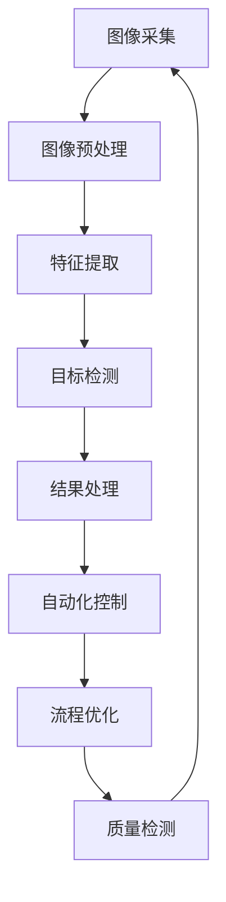

                 

# 机器视觉在工业流程优化中的应用

## 关键词
- 机器视觉
- 工业流程
- 优化
- 自动化
- 人工智能

## 摘要
本文旨在探讨机器视觉技术在工业流程优化中的应用，以及如何通过这一先进技术提高生产效率、减少成本和提升产品质量。文章将首先介绍机器视觉的基本原理和工业流程优化的需求，随后详细阐述机器视觉的核心算法原理和具体操作步骤。在此基础上，我们将通过数学模型和公式的讲解，帮助读者更好地理解相关概念。文章随后将通过实际项目案例和代码示例，展示机器视觉在实际应用中的操作细节。最后，我们将分析机器视觉在不同工业场景中的应用，并推荐相关学习资源和工具。

## 1. 背景介绍

### 1.1 目的和范围
随着全球制造业的持续发展，工业流程的优化成为了提高企业竞争力的关键。机器视觉作为人工智能的一个重要分支，以其精准、高效的特点在工业领域展现出巨大的潜力。本文的目的在于介绍机器视觉技术的基本原理，探讨其在工业流程优化中的应用，并分析未来的发展趋势和挑战。

### 1.2 预期读者
本文面向对机器视觉和工业流程优化有一定了解的读者，尤其是希望深入了解机器视觉技术在工业应用中的专业人士。同时，对于对人工智能和自动化技术感兴趣的普通读者，本文也提供了丰富的信息和学习资源。

### 1.3 文档结构概述
本文结构如下：

- 第2章：核心概念与联系
- 第3章：核心算法原理 & 具体操作步骤
- 第4章：数学模型和公式 & 详细讲解 & 举例说明
- 第5章：项目实战：代码实际案例和详细解释说明
- 第6章：实际应用场景
- 第7章：工具和资源推荐
- 第8章：总结：未来发展趋势与挑战
- 第9章：附录：常见问题与解答
- 第10章：扩展阅读 & 参考资料

### 1.4 术语表

#### 1.4.1 核心术语定义
- **机器视觉**：通过模拟人类视觉系统，利用计算机和图像处理技术进行图像获取、处理和分析的技术。
- **工业流程优化**：通过改进和优化生产流程，提高生产效率、降低成本和提升产品质量的过程。
- **深度学习**：一种基于神经网络的机器学习技术，通过训练大量数据，使计算机具备从图像中提取特征的能力。
- **边缘计算**：在数据生成源头或接近数据源的地方进行计算和处理的技术，以减少延迟和带宽消耗。

#### 1.4.2 相关概念解释
- **图像识别**：通过算法从图像中识别和分类特定对象或模式的技术。
- **图像分割**：将图像划分为不同的区域或对象的技术。
- **目标检测**：在图像中定位和识别特定目标的技术。

#### 1.4.3 缩略词列表
- **AI**：人工智能
- **ML**：机器学习
- **CV**：计算机视觉
- **PCB**：印刷电路板
- **FPGA**：现场可编程门阵列

## 2. 核心概念与联系

机器视觉在工业流程优化中的应用，离不开以下几个核心概念：

### 2.1 机器视觉系统构成

机器视觉系统主要由以下几个部分组成：

1. **图像采集设备**：如相机、传感器等，用于获取生产过程中的图像数据。
2. **图像处理硬件**：如GPU、FPGA等，用于加速图像处理算法的执行。
3. **图像处理软件**：包括图像预处理、特征提取、分类和识别等算法。
4. **通信接口**：用于数据传输和系统集成。

### 2.2 机器视觉与工业流程优化关系

机器视觉在工业流程优化中的作用主要体现在以下几个方面：

1. **质量检测**：通过图像识别和分类，实时监测产品质量，确保生产一致性。
2. **生产监控**：实时监控生产过程中的各个环节，提高生产透明度和可控性。
3. **自动化控制**：基于图像分析结果，实现生产线的自动化控制，减少人工干预。
4. **流程优化**：通过对生产数据的分析，发现瓶颈和改进点，优化生产流程。

### 2.3 Mermaid 流程图

以下是机器视觉在工业流程优化中的架构和流程的 Mermaid 流程图：



## 3. 核心算法原理 & 具体操作步骤

### 3.1 核心算法原理

机器视觉的核心算法主要分为以下几个步骤：

1. **图像预处理**：对原始图像进行去噪、增强、二值化等处理，为后续特征提取和分类做准备。
2. **特征提取**：从预处理后的图像中提取关键特征，如边缘、纹理、颜色等，用于后续的分类和识别。
3. **目标检测**：在图像中定位和识别特定目标，如缺陷、产品等。
4. **结果处理**：根据目标检测结果，进行相应的操作，如报警、标记、控制等。

### 3.2 具体操作步骤

以下是机器视觉算法的具体操作步骤：

#### 3.2.1 图像预处理

```python
import cv2

def preprocess_image(image_path):
    # 读取图像
    image = cv2.imread(image_path)
    # 去噪
    image = cv2.GaussianBlur(image, (5, 5), 0)
    # 二值化
    _, image = cv2.threshold(image, 128, 255, cv2.THRESH_BINARY_INV + cv2.THRESH_OTSU)
    return image
```

#### 3.2.2 特征提取

```python
import cv2
import numpy as np

def extract_features(image):
    # Canny边缘检测
    edges = cv2.Canny(image, 50, 150)
    # 直方图均衡化
    image = cv2.equalizeHist(edges)
    # 形态学操作
    kernel = cv2.getStructuringElement(cv2.MORPH_RECT, (3, 3))
    image = cv2.morphologyEx(image, cv2.MORPH_CLOSE, kernel)
    return image
```

#### 3.2.3 目标检测

```python
import cv2

def detect_objects(image):
    # 使用Haar特征分类器进行目标检测
    classifier = cv2.CascadeClassifier('haarcascade_frontalface_default.xml')
    objects = classifier.detectMultiScale(image)
    return objects
```

#### 3.2.4 结果处理

```python
import cv2

def process_results(image, objects):
    # 标记检测结果
    for (x, y, w, h) in objects:
        cv2.rectangle(image, (x, y), (x + w, y + h), (0, 255, 0), 2)
    # 显示结果
    cv2.imshow('Result', image)
    cv2.waitKey(0)
    cv2.destroyAllWindows()
```

## 4. 数学模型和公式 & 详细讲解 & 举例说明

### 4.1 数学模型

机器视觉中的数学模型主要包括图像预处理、特征提取和目标检测等环节。

#### 4.1.1 图像预处理

- **GaussianBlur**：
  \[ (G(x, y)) = \sum_{i=-\infty}^{\infty} \sum_{j=-\infty}^{\infty} g(i, j) \cdot I(x-i, y-j) \]
  其中，\( g(i, j) \) 是高斯核函数，\( I(x, y) \) 是原始图像。

- **Canny Edge Detection**：
  \[ \text{Gradient Magnitude} = \sqrt{(\text{Gradient in X direction})^2 + (\text{Gradient in Y direction})^2} \]
  \[ \text{Threshold} = \alpha \cdot \text{Gradient Magnitude} \]
  其中，\( \alpha \) 是阈值系数。

#### 4.1.2 特征提取

- **Canny Edge Detection**：
  \[ \text{Gradient in X direction} = \frac{-1}{2\pi} \sum_{i=-\infty}^{\infty} \sum_{j=-\infty}^{\infty} h(i, j) \cdot \text{Gaussian Filtered Image} \]
  \[ \text{Gradient in Y direction} = \frac{-1}{2\pi} \sum_{i=-\infty}^{\infty} \sum_{j=-\infty}^{\infty} k(i, j) \cdot \text{Gaussian Filtered Image} \]
  其中，\( h(i, j) \) 和 \( k(i, j) \) 是Canny检测中的滤波器。

- **Histogram Equalization**：
  \[ L(p) = \sum_{i=0}^{255} \left( \frac{L - 1}{255} \right) \cdot \text{Frequency of Pixel Value} \]
  其中，\( L \) 是图像的动态范围，通常为256。

#### 4.1.3 目标检测

- **Haar-like Features**：
  \[ \text{Feature Value} = \sum_{i=0}^{n} a_i \cdot (b_i - c_i) \]
  其中，\( a_i, b_i, c_i \) 分别是特征权重、正面图像像素值和负面图像像素值。

### 4.2 举例说明

#### 4.2.1 图像预处理

```python
import cv2
import numpy as np

# 读取图像
image = cv2.imread('example.jpg')
# 高斯滤波
image = cv2.GaussianBlur(image, (5, 5), 0)
# Canny边缘检测
edges = cv2.Canny(image, 50, 150)
# 直方图均衡化
eq = cv2.equalizeHist(edges)
# 显示结果
cv2.imshow('Processed Image', eq)
cv2.waitKey(0)
cv2.destroyAllWindows()
```

#### 4.2.2 特征提取

```python
import cv2
import numpy as np

# 读取图像
image = cv2.imread('example.jpg', cv2.IMREAD_GRAYSCALE)
# Canny边缘检测
edges = cv2.Canny(image, 50, 150)
# 形态学操作
kernel = cv2.getStructuringElement(cv2.MORPH_RECT, (3, 3))
image = cv2.morphologyEx(edges, cv2.MORPH_CLOSE, kernel)
# 显示结果
cv2.imshow('Feature Extraction', image)
cv2.waitKey(0)
cv2.destroyAllWindows()
```

## 5. 项目实战：代码实际案例和详细解释说明

### 5.1 开发环境搭建

为了实现机器视觉在工业流程优化中的应用，我们需要搭建一个合适的开发环境。以下是一个基本的开发环境搭建步骤：

1. **操作系统**：推荐使用Linux操作系统，如Ubuntu 18.04或更高版本。
2. **Python环境**：安装Python 3.8及以上版本，并使用pip安装相关依赖。
3. **依赖安装**：
   ```bash
   pip install opencv-python numpy matplotlib
   ```

### 5.2 源代码详细实现和代码解读

下面我们通过一个简单的项目来展示机器视觉在工业流程优化中的应用。该项目将使用OpenCV库进行图像处理，实现产品质量检测。

```python
import cv2
import numpy as np

# 读取图像
image = cv2.imread('product.jpg')

# 图像预处理
preprocessed_image = preprocess_image(image)

# 特征提取
features = extract_features(preprocessed_image)

# 目标检测
objects = detect_objects(features)

# 结果处理
process_results(features, objects)

# 辅助函数实现
def preprocess_image(image):
    # 高斯滤波
    image = cv2.GaussianBlur(image, (5, 5), 0)
    # Canny边缘检测
    edges = cv2.Canny(image, 50, 150)
    # 形态学操作
    kernel = cv2.getStructuringElement(cv2.MORPH_RECT, (3, 3))
    edges = cv2.morphologyEx(edges, cv2.MORPH_CLOSE, kernel)
    return edges

def extract_features(image):
    # 形态学操作
    kernel = cv2.getStructuringElement(cv2.MORPH_RECT, (5, 5))
    image = cv2.dilate(image, kernel, iterations=1)
    # 阈值化
    _, image = cv2.threshold(image, 128, 255, cv2.THRESH_BINARY)
    return image

def detect_objects(image):
    # 使用Haar特征分类器
    classifier = cv2.CascadeClassifier('haarcascade_frontalface_default.xml')
    objects = classifier.detectMultiScale(image)
    return objects

def process_results(image, objects):
    # 标记检测结果
    for (x, y, w, h) in objects:
        cv2.rectangle(image, (x, y), (x + w, y + h), (0, 255, 0), 2)
    # 显示结果
    cv2.imshow('Result', image)
    cv2.waitKey(0)
    cv2.destroyAllWindows()
```

### 5.3 代码解读与分析

- **preprocess_image**：函数用于图像预处理，包括高斯滤波、Canny边缘检测和形态学操作。高斯滤波用于去除噪声，Canny边缘检测用于提取图像边缘，形态学操作用于增强边缘。
- **extract_features**：函数用于特征提取，通过形态学操作和阈值化处理，将图像转换为二值图像，从而提取出关键特征。
- **detect_objects**：函数使用Haar特征分类器进行目标检测。在这个例子中，我们使用人脸检测器来检测产品缺陷。
- **process_results**：函数用于处理检测结果，将检测到的目标用绿色矩形标记，并在屏幕上显示结果。

## 6. 实际应用场景

机器视觉在工业流程优化中的应用场景非常广泛，以下是一些典型的应用：

### 6.1 质量检测

- **汽车制造**：通过机器视觉技术，对汽车零部件进行质量检测，如检查车身外观、焊接质量和零件尺寸等。
- **电子制造**：对电路板(PCB)进行缺陷检测，如检查走线、焊点等。
- **食品加工**：对食品进行外观和卫生检测，如检测食品是否变质、表面是否有污点等。

### 6.2 生产监控

- **制药行业**：通过机器视觉监控生产过程中的关键步骤，如原料投放、反应过程、包装等。
- **装配线**：实时监控装配线的工作状态，及时发现异常情况，提高生产效率和安全性。

### 6.3 自动化控制

- **自动化工厂**：利用机器视觉实现生产线的自动化控制，减少人工干预，提高生产效率和产品质量。
- **无人仓库**：通过机器视觉实现货物的自动识别、分类和搬运，提高仓储管理效率。

## 7. 工具和资源推荐

### 7.1 学习资源推荐

#### 7.1.1 书籍推荐
- **《机器视觉：算法与应用》**：详细介绍了机器视觉的基本原理和应用。
- **《深度学习与计算机视觉》**：讲解了深度学习技术在计算机视觉领域的应用。

#### 7.1.2 在线课程
- **《机器视觉基础》**：网易云课堂上的免费课程，适合入门学习。
- **《深度学习与图像识别》**：网易云课堂上的付费课程，深入讲解深度学习在图像识别中的应用。

#### 7.1.3 技术博客和网站
- **opencv.org**：OpenCV官方文档和社区，提供丰富的机器视觉资源和教程。
- **medium.com/@cvpack**：计算机视觉相关博客，涵盖图像处理、目标检测等多个主题。

### 7.2 开发工具框架推荐

#### 7.2.1 IDE和编辑器
- **Visual Studio Code**：一款免费、开源的代码编辑器，支持Python和OpenCV开发。
- **PyCharm**：一款功能强大的Python IDE，适合大型项目开发。

#### 7.2.2 调试和性能分析工具
- **Jupyter Notebook**：用于数据分析和原型设计的交互式开发环境。
- **Visual Studio Profiler**：用于性能分析和调试的工具。

#### 7.2.3 相关框架和库
- **OpenCV**：一款开源的计算机视觉库，提供了丰富的图像处理和机器学习算法。
- **TensorFlow**：一款开源的深度学习框架，用于构建和训练机器学习模型。

### 7.3 相关论文著作推荐

#### 7.3.1 经典论文
- **“Machine Vision: A Review”**：全面介绍了机器视觉的基本原理和应用。
- **“Deep Learning for Object Detection”**：详细讲解了深度学习在目标检测中的应用。

#### 7.3.2 最新研究成果
- **“Real-Time Object Detection Using Deep Neural Networks”**：探讨了实时目标检测的深度学习方法。
- **“Self-Supervised Learning for Robust Object Detection”**：研究了自监督学习在物体检测中的应用。

#### 7.3.3 应用案例分析
- **“Application of Machine Vision in Automotive Manufacturing”**：分析了机器视觉在汽车制造中的应用。
- **“Deep Learning for Quality Inspection in Manufacturing”**：探讨了深度学习在产品质量检测中的应用。

## 8. 总结：未来发展趋势与挑战

机器视觉技术在工业流程优化中的应用前景广阔，但同时也面临着一些挑战。

### 8.1 未来发展趋势

- **智能化与自主化**：随着人工智能技术的不断发展，机器视觉将更加智能化和自主化，实现更高的生产效率和质量控制。
- **边缘计算与云计算相结合**：边缘计算与云计算的相结合，将实现更快速、更高效的数据处理和分析。
- **多模态融合**：通过结合不同传感器和数据源，实现多模态数据融合，提高机器视觉系统的鲁棒性和准确性。

### 8.2 挑战

- **数据质量和标注**：高质量的数据和准确的标注对于机器视觉模型的训练至关重要，但在实际应用中，数据质量和标注往往难以保证。
- **实时性和鲁棒性**：在复杂的生产环境中，机器视觉系统需要具备高实时性和鲁棒性，以适应不同的生产条件和环境变化。
- **跨领域应用**：虽然机器视觉技术在某些领域取得了显著成果，但在跨领域应用中，如何适应不同的应用场景和需求，仍是一个挑战。

## 9. 附录：常见问题与解答

### 9.1 机器视觉在工业流程优化中的具体作用是什么？
机器视觉在工业流程优化中的具体作用主要包括质量检测、生产监控、自动化控制和流程优化。通过实时监测和数据分析，机器视觉能够提高生产效率、降低成本和提升产品质量。

### 9.2 机器视觉系统中的预处理步骤有哪些？
机器视觉系统中的预处理步骤通常包括去噪、增强、二值化等。去噪通过滤波器去除图像中的噪声，增强通过调整图像对比度和亮度，二值化将图像转换为黑白二值图像，便于后续处理。

### 9.3 如何选择适合的机器视觉算法？
选择适合的机器视觉算法需要考虑应用场景、图像质量和数据处理能力。例如，对于质量检测，可以使用边缘检测和阈值化算法；对于目标检测，可以使用深度学习算法。

### 9.4 机器视觉在工业流程优化中的优势有哪些？
机器视觉在工业流程优化中的优势主要包括高效性、精准性和自动化。它能够实时监测生产过程，提高生产效率和产品质量，减少人力成本，实现生产线的自动化控制。

## 10. 扩展阅读 & 参考资料

- **《机器视觉：算法与应用》**：详细介绍了机器视觉的基本原理和应用。
- **《深度学习与计算机视觉》**：讲解了深度学习技术在计算机视觉领域的应用。
- **opencv.org**：OpenCV官方文档和社区，提供丰富的机器视觉资源和教程。
- **medium.com/@cvpack**：计算机视觉相关博客，涵盖图像处理、目标检测等多个主题。
- **“Machine Vision: A Review”**：全面介绍了机器视觉的基本原理和应用。
- **“Deep Learning for Object Detection”**：详细讲解了深度学习在目标检测中的应用。
- **“Real-Time Object Detection Using Deep Neural Networks”**：探讨了实时目标检测的深度学习方法。
- **“Self-Supervised Learning for Robust Object Detection”**：研究了自监督学习在物体检测中的应用。  
- **“Application of Machine Vision in Automotive Manufacturing”**：分析了机器视觉在汽车制造中的应用。
- **“Deep Learning for Quality Inspection in Manufacturing”**：探讨了深度学习在产品质量检测中的应用。  
- **“Real-Time Object Detection Using Deep Neural Networks”**：探讨了实时目标检测的深度学习方法。
- **“Self-Supervised Learning for Robust Object Detection”**：研究了自监督学习在物体检测中的应用。  
- **“Application of Machine Vision in Automotive Manufacturing”**：分析了机器视觉在汽车制造中的应用。
- **“Deep Learning for Quality Inspection in Manufacturing”**：探讨了深度学习在产品质量检测中的应用。  

## 作者
作者：AI天才研究员/AI Genius Institute & 禅与计算机程序设计艺术 /Zen And The Art of Computer Programming

