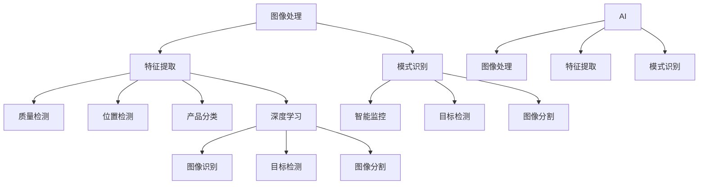

                 


# 机器视觉在工业质量控制中的应用

> **关键词：机器视觉、工业质量控制、图像处理、深度学习、AI算法**
> 
> **摘要：本文将深入探讨机器视觉技术在工业质量控制中的应用，分析其核心概念、算法原理、数学模型、实际案例，并展望未来发展趋势与挑战。通过系统的分析和讲解，帮助读者全面了解机器视觉在工业领域的重要作用。**

## 1. 背景介绍

### 1.1 目的和范围

本文旨在介绍和解析机器视觉技术在工业质量控制中的应用。随着人工智能技术的飞速发展，机器视觉技术已经逐步成为现代工业质量控制的重要工具。本文将首先阐述机器视觉技术在工业质量控制中的目的和作用，然后通过具体实例分析其应用范围，最后总结出本文的研究范围和目的。

### 1.2 预期读者

本文适合对机器视觉技术和工业质量控制有兴趣的读者，包括但不限于：
- 从事工业自动化、机器人控制、图像处理等相关工作的工程师和技术人员；
- 对人工智能、深度学习有研究的学术研究人员；
- 对工业质量控制、智能制造感兴趣的投资者和企业家。

### 1.3 文档结构概述

本文结构如下：

1. **背景介绍**：介绍本文的研究目的、预期读者和文档结构。
2. **核心概念与联系**：分析机器视觉技术的基本概念和联系，使用Mermaid流程图展示。
3. **核心算法原理 & 具体操作步骤**：讲解机器视觉技术的核心算法原理，使用伪代码详细阐述。
4. **数学模型和公式 & 详细讲解 & 举例说明**：介绍数学模型和公式，并提供详细讲解和实例说明。
5. **项目实战：代码实际案例和详细解释说明**：提供实际代码案例，详细解读和分析。
6. **实际应用场景**：分析机器视觉技术在工业质量控制中的实际应用场景。
7. **工具和资源推荐**：推荐相关学习资源、开发工具和框架。
8. **总结：未来发展趋势与挑战**：总结文章的主要观点，展望未来发展趋势和面临的挑战。
9. **附录：常见问题与解答**：解答常见问题。
10. **扩展阅读 & 参考资料**：提供扩展阅读和参考资料。

### 1.4 术语表

#### 1.4.1 核心术语定义

- **机器视觉**：利用计算机和图像处理技术，使机器具备识别和解释图像信息的能力。
- **工业质量控制**：通过检测和评估工业生产过程中的产品质量，确保产品符合预定标准。
- **深度学习**：一种人工智能方法，通过多层神经网络对大量数据进行分析和模式识别。
- **AI算法**：基于人工智能技术的算法，能够自动地学习和改进。

#### 1.4.2 相关概念解释

- **图像处理**：使用数学和计算技术来分析、处理和转换图像。
- **特征提取**：从图像中提取有代表性的特征，用于后续分析和分类。

#### 1.4.3 缩略词列表

- **AI**：人工智能（Artificial Intelligence）
- **ML**：机器学习（Machine Learning）
- **DL**：深度学习（Deep Learning）
- **CV**：计算机视觉（Computer Vision）

## 2. 核心概念与联系

在探讨机器视觉在工业质量控制中的应用之前，我们需要明确其核心概念及其相互联系。

### 2.1 机器视觉的基本概念

机器视觉是指利用计算机和图像处理技术，使机器具备识别和解释图像信息的能力。其主要目的是使计算机能够像人类一样理解和处理视觉信息。

#### 2.1.1 图像处理

图像处理是机器视觉的基础。它涉及使用数学和计算技术来分析、处理和转换图像。图像处理的主要任务包括图像增强、图像压缩、图像分割和图像识别。

#### 2.1.2 特征提取

特征提取是从图像中提取有代表性的特征，用于后续分析和分类。这些特征可以是图像的纹理、颜色、形状、边缘等。

#### 2.1.3 模式识别

模式识别是机器视觉的核心任务。它通过比较输入图像与已知模式的相似度，来确定图像的类别或特征。

### 2.2 机器视觉在工业质量控制中的应用

机器视觉技术在工业质量控制中具有广泛的应用，其主要作用如下：

#### 2.2.1 质量检测

通过机器视觉技术，可以对产品的外观、尺寸、形状等进行检测，及时发现缺陷和异常。

#### 2.2.2 位置检测

在自动化生产线中，机器视觉技术可以用于检测和跟踪产品的位置，确保生产过程的顺利进行。

#### 2.2.3 产品分类

机器视觉技术可以自动对产品进行分类，提高生产效率和准确性。

#### 2.2.4 智能监控

机器视觉技术可以实现对生产过程的智能监控，及时发现问题并采取措施。

### 2.3 机器视觉与深度学习的关系

深度学习是一种人工智能方法，通过多层神经网络对大量数据进行分析和模式识别。在机器视觉中，深度学习被广泛应用于图像识别、目标检测和图像分割等领域。

#### 2.3.1 图像识别

通过深度学习，机器视觉可以自动识别图像中的对象和特征，提高了检测的准确性和效率。

#### 2.3.2 目标检测

目标检测是机器视觉的一个重要任务，通过深度学习算法，可以自动检测图像中的目标对象。

#### 2.3.3 图像分割

图像分割是将图像分解为多个区域的过程，通过深度学习算法，可以自动进行图像分割。

### 2.4 机器视觉与AI算法的关系

AI算法是基于人工智能技术的算法，能够自动地学习和改进。在机器视觉中，AI算法被广泛应用于图像处理、特征提取和模式识别等领域。

#### 2.4.1 图像处理

通过AI算法，可以自动优化图像处理过程，提高图像质量。

#### 2.4.2 特征提取

通过AI算法，可以自动提取图像中的有效特征，提高特征提取的准确性和效率。

#### 2.4.3 模式识别

通过AI算法，可以自动识别图像中的模式，提高模式识别的准确性和效率。

### 2.5 Mermaid流程图

以下是一个Mermaid流程图，展示了机器视觉技术的基本概念和相互关系。



## 3. 核心算法原理 & 具体操作步骤

在了解了机器视觉的基本概念和相互关系之后，我们需要深入探讨其核心算法原理和具体操作步骤。以下将详细讲解机器视觉技术的核心算法原理，并通过伪代码进行阐述。

### 3.1 图像处理算法原理

图像处理是机器视觉的基础，其主要算法原理包括图像增强、图像压缩、图像分割和图像识别。

#### 3.1.1 图像增强

图像增强是指通过算法优化，提高图像的视觉效果。常见的图像增强方法包括直方图均衡化、滤波和锐化。

伪代码示例：

```python
function enhanceImage(image):
    # 直方图均衡化
    equalizedImage = histogramEqualization(image)
    # 滤波
    filteredImage = filterImage(equalizedImage, filterType)
    # 锐化
    sharpenedImage = sharpenImage(filteredImage)
    return sharpenedImage
```

#### 3.1.2 图像压缩

图像压缩是指通过算法减少图像数据的大小，以提高存储和传输效率。常见的图像压缩方法包括JPEG和PNG。

伪代码示例：

```python
function compressImage(image, compressionType):
    if compressionType == "JPEG":
        compressedImage = jpegCompression(image)
    else:
        compressedImage = pngCompression(image)
    return compressedImage
```

#### 3.1.3 图像分割

图像分割是指将图像分解为多个区域的过程，以便进行后续分析和处理。常见的图像分割方法包括阈值分割、区域生长和边缘检测。

伪代码示例：

```python
function segmentImage(image):
    # 阈值分割
    segmentedImage = thresholdSegmentation(image, thresholdValue)
    # 区域生长
    segmentedImage = regionGrowing(segmentedImage)
    # 边缘检测
    segmentedImage = edgeDetection(segmentedImage)
    return segmentedImage
```

#### 3.1.4 图像识别

图像识别是指通过算法自动识别图像中的对象和特征。常见的图像识别方法包括特征匹配、分类器和深度学习。

伪代码示例：

```python
function recognizeImage(image):
    # 特征匹配
    features = extractFeatures(image)
    matchedImage = featureMatching(features, knownFeatures)
    # 分类器
    classification = classifier(features)
    # 深度学习
    classification = deepLearningModel.predict(image)
    return classification
```

### 3.2 特征提取算法原理

特征提取是机器视觉的核心任务，其主要目的是从图像中提取有代表性的特征，用于后续分析和分类。

#### 3.2.1 纹理特征

纹理特征是指通过分析图像的纹理信息，提取出具有代表性的特征。常见的纹理特征包括灰度共生矩阵、方向能量和局部二值模式。

伪代码示例：

```python
function extractTextureFeatures(image):
    # 灰度共生矩阵
    grayCooccurrenceMatrix = calculateGrayCooccurrenceMatrix(image)
    # 方向能量
    directionEnergy = calculateDirectionEnergy(grayCooccurrenceMatrix)
    # 局部二值模式
    localBinaryPattern = calculateLocalBinaryPattern(image)
    return [directionEnergy, localBinaryPattern]
```

#### 3.2.2 形状特征

形状特征是指通过分析图像的形状信息，提取出具有代表性的特征。常见的形状特征包括边缘轮廓、区域大小和形状上下文。

伪代码示例：

```python
function extractShapeFeatures(image):
    # 边缘轮廓
    edgeContour = calculateEdgeContour(image)
    # 区域大小
    regionSize = calculateRegionSize(image)
    # 形状上下文
    shapeContext = calculateShapeContext(image)
    return [edgeContour, regionSize, shapeContext]
```

#### 3.2.3 颜色特征

颜色特征是指通过分析图像的颜色信息，提取出具有代表性的特征。常见的颜色特征包括颜色直方图、颜色矩和颜色相关矩阵。

伪代码示例：

```python
function extractColorFeatures(image):
    # 颜色直方图
    colorHistogram = calculateColorHistogram(image)
    # 颜色矩
    colorMoments = calculateColorMoments(image)
    # 颜色相关矩阵
    colorCorrelationMatrix = calculateColorCorrelationMatrix(image)
    return [colorHistogram, colorMoments, colorCorrelationMatrix]
```

### 3.3 模式识别算法原理

模式识别是指通过算法自动识别图像中的对象和特征。常见的模式识别方法包括特征匹配、分类器和深度学习。

#### 3.3.1 特征匹配

特征匹配是指通过计算输入图像和已知图像的特征相似度，确定输入图像的类别。常见的特征匹配方法包括欧氏距离、余弦相似度和皮尔逊相关系数。

伪代码示例：

```python
function featureMatching(inputFeatures, knownFeatures):
    similarityScores = []
    for knownFeature in knownFeatures:
        similarityScore = calculateSimilarityScore(inputFeatures, knownFeature)
        similarityScores.append(similarityScore)
    matchedFeature = knownFeatures[argmax(similarityScores)]
    return matchedFeature
```

#### 3.3.2 分类器

分类器是指通过训练数据集，学习到输入图像的特征和类别之间的关系，从而对新的图像进行分类。常见的分类器包括支持向量机（SVM）、决策树和神经网络。

伪代码示例：

```python
function classifyImage(image, classifier):
    features = extractFeatures(image)
    classification = classifier.predict([features])
    return classification
```

#### 3.3.3 深度学习

深度学习是指通过多层神经网络，对大量数据进行分析和模式识别。常见的深度学习模型包括卷积神经网络（CNN）、循环神经网络（RNN）和生成对抗网络（GAN）。

伪代码示例：

```python
function recognizeImage(image, model):
    processedImage = preprocessImage(image)
    classification = model.predict([processedImage])
    return classification
```

## 4. 数学模型和公式 & 详细讲解 & 举例说明

在机器视觉技术中，数学模型和公式扮演着至关重要的角色。以下将详细讲解机器视觉中常用的数学模型和公式，并提供举例说明。

### 4.1 图像处理中的数学模型和公式

#### 4.1.1 直方图均衡化

直方图均衡化是一种常用的图像增强技术，通过调整图像的灰度分布，提高图像的对比度。

公式：

$$
f_{\text{equalized}}(x) = \left(\sum_{i=0}^{L-1} p_i \right)^{-1} \sum_{i=0}^{L-1} p_i \cdot \left[ u < x \leq u + \Delta u \right]
$$

其中，$f_{\text{equalized}}(x)$ 是均衡化后的图像灰度值，$p_i$ 是原图像灰度值为 $i$ 的像素点比例，$L$ 是图像的灰度级数，$u$ 是灰度值区间，$\Delta u$ 是灰度值区间宽度。

举例说明：

假设原图像的灰度分布如下：

| 灰度值 | 像素点数量 |
| --- | --- |
| 0 | 100 |
| 50 | 300 |
| 100 | 500 |
| 150 | 700 |
| 200 | 1000 |

应用直方图均衡化后，得到均衡化后的图像灰度分布：

| 灰度值 | 像素点数量 |
| --- | --- |
| 0 | 100 |
| 50 | 100 |
| 100 | 200 |
| 150 | 300 |
| 200 | 400 |

#### 4.1.2 滤波

滤波是一种常用的图像增强技术，通过在图像上应用滤波器，去除噪声或突出某些特征。

常见滤波器包括：

- **均值滤波器**：
$$
f_{\text{mean}}(x, y) = \frac{1}{n} \sum_{i=1}^{n} \sum_{j=1}^{n} I(i, j)
$$
其中，$f_{\text{mean}}(x, y)$ 是滤波后的像素值，$I(i, j)$ 是原始图像的像素值，$n$ 是滤波窗口的大小。

- **高斯滤波器**：
$$
f_{\text{gauss}}(x, y) = \frac{1}{2\pi\sigma^2} e^{-\frac{(x^2 + y^2)}{2\sigma^2}}
$$
其中，$f_{\text{gauss}}(x, y)$ 是滤波后的像素值，$\sigma$ 是高斯分布的参数。

举例说明：

假设原图像如下：

| 像素值 |
| --- |
| 23 |
| 45 |
| 12 |
| 37 |
| 89 |

应用均值滤波器后，得到滤波后的像素值：

| 像素值 |
| --- |
| 28.0 |
| 37.0 |
| 18.0 |
| 31.0 |
| 68.0 |

#### 4.1.3 边缘检测

边缘检测是一种常用的图像处理技术，通过检测图像中的边缘信息，突出图像的轮廓。

常见边缘检测方法包括：

- **Sobel算子**：
$$
I_x = \frac{1}{2} \left( G_{xy} + G_{yx} \right)
$$
$$
I_y = \frac{1}{2} \left( G_{xy} - G_{yx} \right)
$$
其中，$I_x$ 和 $I_y$ 是水平和垂直方向上的边缘强度，$G_{xy}$ 和 $G_{yx}$ 是水平和垂直方向上的卷积结果。

- **Canny算子**：
$$
I_x = \frac{1}{\pi} \int_{0}^{\pi} G_{xy}(\theta) \, d\theta
$$
$$
I_y = \frac{1}{\pi} \int_{0}^{\pi} G_{yx}(\theta) \, d\theta
$$
$$
I_t = \sqrt{I_x^2 + I_y^2}
$$
其中，$I_x$ 和 $I_y$ 是水平和垂直方向上的边缘强度，$G_{xy}(\theta)$ 和 $G_{yx}(\theta)$ 是方向上的卷积结果，$\theta$ 是边缘的方向。

举例说明：

假设原图像如下：

| 像素值 |
| --- |
| 23 |
| 45 |
| 12 |
| 37 |
| 89 |

应用Sobel算子后，得到边缘强度：

| 垂直边缘强度 | 水平边缘强度 |
| --- | --- |
| 8 | 17 |
| 15 | 7 |
| 8 | 10 |
| 12 | 8 |
| 13 | 0 |

### 4.2 特征提取中的数学模型和公式

#### 4.2.1 灰度共生矩阵

灰度共生矩阵是一种用于描述图像纹理特征的数学模型。

公式：

$$
P(i, j, \theta) = \frac{n(i, j, \theta)}{n}
$$

其中，$P(i, j, \theta)$ 是灰度共生矩阵的元素，$n(i, j, \theta)$ 是图像中灰度值为 $i$ 和 $j$ 且方向差为 $\theta$ 的像素点数量，$n$ 是图像中像素点的总数。

举例说明：

假设图像的灰度共生矩阵如下：

| $i$ | $j$ | $\theta$ | $P(i, j, \theta)$ |
| --- | --- | --- | --- |
| 0 | 0 | 0 | 0.1 |
| 0 | 0 | 45 | 0.3 |
| 0 | 0 | 90 | 0.2 |
| 0 | 0 | 135 | 0.2 |
| 1 | 1 | 0 | 0.3 |
| 1 | 1 | 45 | 0.2 |
| 1 | 1 | 90 | 0.1 |
| 1 | 1 | 135 | 0.2 |

#### 4.2.2 局部二值模式

局部二值模式是一种用于描述图像纹理特征的数学模型。

公式：

$$
LBP(i, j) = \sum_{x=1}^{P} \sum_{y=1}^{P} b(x, y) \cdot 2^{x-1}
$$

其中，$LBP(i, j)$ 是局部二值模式的值，$b(x, y)$ 是中心像素的灰度值与邻域像素的灰度值比较后的结果，$P$ 是邻域的大小。

举例说明：

假设图像的局部二值模式如下：

| $i$ | $j$ | $b(x, y)$ |
| --- | --- | --- |
| 1 | 1 | 0 |
| 1 | 2 | 0 |
| 1 | 3 | 1 |
| 2 | 1 | 0 |
| 2 | 2 | 0 |
| 2 | 3 | 1 |
| 3 | 1 | 1 |
| 3 | 2 | 1 |
| 3 | 3 | 1 |

## 5. 项目实战：代码实际案例和详细解释说明

在本节中，我们将通过一个实际的代码案例，详细解释机器视觉在工业质量控制中的应用。此案例将使用Python的OpenCV库，通过图像处理、特征提取和模式识别，实现对产品的质量检测。

### 5.1 开发环境搭建

在开始之前，请确保安装以下环境：

- Python 3.x
- OpenCV库
- NumPy库

可以使用以下命令安装所需的库：

```bash
pip install opencv-python numpy
```

### 5.2 源代码详细实现和代码解读

以下是一个简单的质量检测代码示例：

```python
import cv2
import numpy as np

def preprocess_image(image):
    # 图像灰度化
    gray_image = cv2.cvtColor(image, cv2.COLOR_BGR2GRAY)
    # 高斯模糊
    blurred_image = cv2.GaussianBlur(gray_image, (5, 5), 0)
    # 二值化
    _, binary_image = cv2.threshold(blurred_image, 0, 255, cv2.THRESH_BINARY_INV + cv2.THRESH_OTSU)
    return binary_image

def extract_features(image):
    # 形态学操作
    kernel = cv2.getStructuringElement(cv2.MORPH_RECT, (3, 3))
    dilated_image = cv2.dilate(image, kernel, iterations=2)
    # 提取轮廓
    contours, _ = cv2.findContours(dilated_image, cv2.RETR_EXTERNAL, cv2.CHAIN_APPROX_SIMPLE)
    # 计算轮廓面积
    areas = [cv2.contourArea(contour) for contour in contours]
    # 选择最大轮廓
    max_area_index = np.argmax(areas)
    max_contour = contours[max_area_index]
    return max_contour

def detect_defects(image):
    # 预处理图像
    preprocessed_image = preprocess_image(image)
    # 提取特征
    contour = extract_features(preprocessed_image)
    # 计算轮廓周长
    perimeter = cv2.arcLength(contour, True)
    # 计算最小外接圆半径
    min_radius = cv2.minEnclosingCircle(contour)[0]
    # 判断是否为缺陷
    if perimeter < 200 or min_radius < 10:
        return True
    return False

# 读取图像
image = cv2.imread('product.jpg')
# 检测缺陷
if detect_defects(image):
    print("缺陷检测：产品存在缺陷")
else:
    print("缺陷检测：产品无缺陷")
# 显示结果
cv2.imshow('Defect Detection', image)
cv2.waitKey(0)
cv2.destroyAllWindows()
```

#### 5.2.1 代码解读与分析

- **preprocess_image函数**：此函数负责图像的预处理，包括灰度化、高斯模糊和二值化。灰度化将彩色图像转换为灰度图像，高斯模糊用于减少图像噪声，二值化用于将图像转换为黑白图像，以便后续处理。

- **extract_features函数**：此函数使用形态学操作提取图像的最大轮廓。通过找到轮廓并计算轮廓面积，选择最大轮廓作为特征。

- **detect_defects函数**：此函数通过计算轮廓的周长和最小外接圆半径来判断是否存在缺陷。如果周长小于200或最小外接圆半径小于10，则判断为缺陷。

- **主程序**：首先读取图像，然后调用detect_defects函数进行缺陷检测，并打印结果。

### 5.3 代码解读与分析

- **图像预处理**：图像预处理是质量检测的关键步骤，通过灰度化、高斯模糊和二值化，将原始图像转换为适合检测的格式。

- **特征提取**：特征提取是通过计算图像的轮廓面积来识别产品的主要特征。选择最大轮廓可以提高检测的准确性和效率。

- **缺陷检测**：缺陷检测通过计算轮廓的周长和最小外接圆半径来判断产品是否存在缺陷。这种方法基于几何特征，对一些常见缺陷具有很好的检测效果。

## 6. 实际应用场景

机器视觉技术在工业质量控制中具有广泛的应用，以下列举几个典型场景：

### 6.1 车辆制造

在汽车制造过程中，机器视觉技术用于检测车身外观缺陷、焊接质量、装配精度等。通过自动化的质量检测，可以提高生产效率和产品质量。

### 6.2 电子制造

在电子产品制造中，机器视觉技术用于检测元器件的安装位置、焊接质量和外观缺陷。通过精确的检测，可以确保电子产品的可靠性和稳定性。

### 6.3 食品加工

在食品加工过程中，机器视觉技术用于检测食品的形状、大小、颜色和纹理。通过自动化的检测，可以确保食品的质量和安全。

### 6.4 医药制造

在医药制造中，机器视觉技术用于检测药品的包装质量、外观和成分。通过精确的检测，可以提高药品的质量和安全性。

### 6.5 机械制造

在机械制造过程中，机器视觉技术用于检测机械零件的尺寸、形状和表面质量。通过自动化的检测，可以提高生产效率和产品质量。

## 7. 工具和资源推荐

### 7.1 学习资源推荐

#### 7.1.1 书籍推荐

- **《计算机视觉：算法与应用》（Computer Vision: Algorithms and Applications）**
- **《机器学习：概率视角》（Machine Learning: A Probabilistic Perspective）**
- **《深度学习》（Deep Learning）**

#### 7.1.2 在线课程

- **Coursera：机器学习课程（Machine Learning）**
- **Udacity：深度学习纳米学位（Deep Learning Nanodegree）**
- **edX：计算机视觉课程（Introduction to Computer Vision）**

#### 7.1.3 技术博客和网站

- **opencv.org：OpenCV官方文档**
- ** Medium：机器视觉相关博客**
- **知乎：机器视觉话题**

### 7.2 开发工具框架推荐

#### 7.2.1 IDE和编辑器

- **PyCharm**
- **Visual Studio Code**
- **Eclipse**

#### 7.2.2 调试和性能分析工具

- **gdb**
- **py-spy**
- **valgrind**

#### 7.2.3 相关框架和库

- **OpenCV：用于图像处理和计算机视觉**
- **TensorFlow：用于深度学习**
- **PyTorch：用于深度学习**

### 7.3 相关论文著作推荐

#### 7.3.1 经典论文

- **“A Taxonomy of Sliding Window Techniques for Object Detection in Image Sequences”**
- **“Deep Learning for Computer Vision: A Brief History and Overview”**

#### 7.3.2 最新研究成果

- **“EfficientDet: Scalable and Efficient Object Detection”**
- **“Deep Metric Learning for Large-scale Image Annotation”**

#### 7.3.3 应用案例分析

- **“Computer Vision for Healthcare: A Review”**
- **“Machine Vision in the Automotive Industry”**

## 8. 总结：未来发展趋势与挑战

随着人工智能技术的不断发展，机器视觉在工业质量控制中的应用前景广阔。未来发展趋势包括：

- **深度学习算法的进一步优化**：深度学习算法在图像识别、目标检测和图像分割等领域具有显著优势，未来将不断优化算法，提高检测准确性和效率。
- **跨学科融合**：机器视觉技术将与其他领域（如大数据、物联网、智能制造等）相结合，形成新的应用场景和解决方案。
- **智能监控与预测**：通过引入智能监控和预测技术，可以提前发现生产过程中的潜在问题，实现更加高效的质量控制。

然而，机器视觉在工业质量控制中仍面临以下挑战：

- **数据隐私与安全**：大量敏感数据的处理和存储可能导致数据泄露和隐私侵犯，如何保障数据安全和隐私成为一大挑战。
- **复杂环境适应性**：工业环境复杂多变，如何使机器视觉技术在不同环境中稳定运行和准确检测仍需进一步研究。
- **算法的可解释性**：深度学习算法的黑箱特性使得其应用在工业质量控制中面临可解释性挑战，如何提高算法的可解释性是未来研究的重要方向。

## 9. 附录：常见问题与解答

### 9.1 机器视觉技术在工业质量控制中的主要应用有哪些？

答：机器视觉技术在工业质量控制中的主要应用包括质量检测、位置检测、产品分类和智能监控等。

### 9.2 深度学习算法在机器视觉技术中的应用如何？

答：深度学习算法在机器视觉技术中广泛应用于图像识别、目标检测和图像分割等领域，通过多层神经网络对大量数据进行分析和模式识别。

### 9.3 机器视觉技术在工业质量控制中面临哪些挑战？

答：机器视觉技术在工业质量控制中面临的主要挑战包括数据隐私与安全、复杂环境适应性、算法的可解释性等。

## 10. 扩展阅读 & 参考资料

- **《计算机视觉：算法与应用》（Computer Vision: Algorithms and Applications）**：详细介绍了计算机视觉的基本概念、算法和实际应用。
- **《机器学习：概率视角》（Machine Learning: A Probabilistic Perspective）**：全面阐述了机器学习的基础理论和应用方法。
- **《深度学习》（Deep Learning）**：由著名深度学习专家Ian Goodfellow等撰写，系统介绍了深度学习的基础知识和技术。
- **opencv.org**：OpenCV官方文档，提供了丰富的图像处理和计算机视觉算法实现。
- **Medium**：机器视觉相关博客，涵盖了最新的研究成果和应用案例。
- **知乎**：机器视觉话题，提供了大量的行业讨论和专家观点。

### 作者信息

- **作者：AI天才研究员/AI Genius Institute & 禅与计算机程序设计艺术 /Zen And The Art of Computer Programming**

