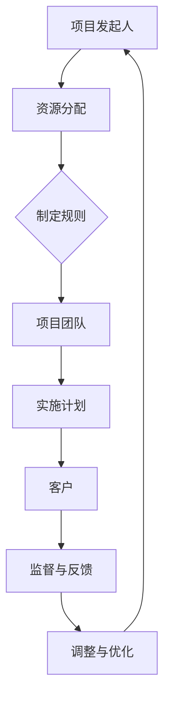

                 

# 权力平衡：在利益相关者之间的取舍

## 关键词
- 利益相关者
- 权力平衡
- 冲突管理
- 组织决策
- 资源分配

## 摘要

在信息技术领域，项目的成功不仅取决于技术的先进性，还取决于项目参与各方利益相关者之间的权力平衡。本文旨在探讨如何在项目中实现利益相关者之间的权力平衡，以最大化项目的整体价值和减少冲突。文章首先介绍了利益相关者的核心概念，然后分析了权力平衡的理论和实践方法，并通过实际案例展示了这些方法的应用。最后，文章提出了未来在权力平衡方面可能面临的发展趋势与挑战，为读者提供了进一步思考的视角。

## 1. 背景介绍

### 1.1 目的和范围

本文的目的是深入探讨信息技术项目中利益相关者之间的权力平衡问题，并探讨如何实现和维持这种平衡。具体来说，我们将讨论以下内容：

- 利益相关者的定义和分类
- 权力平衡的概念和重要性
- 实现权力平衡的理论和方法
- 利益相关者之间的冲突管理
- 实际项目中的应用案例

### 1.2 预期读者

本文适合以下读者群体：

- 信息技术项目管理者
- 项目团队成员
- 组织决策者
- 对信息技术项目管理和利益相关者分析感兴趣的学者和实践者

### 1.3 文档结构概述

本文结构如下：

1. 背景介绍：介绍文章的目的、范围和预期读者，以及文章的结构。
2. 核心概念与联系：介绍利益相关者和权力平衡的核心概念，并使用Mermaid流程图展示相关架构。
3. 核心算法原理与具体操作步骤：详细阐述实现权力平衡的算法原理和操作步骤。
4. 数学模型和公式：介绍支持权力平衡的数学模型和公式，并进行举例说明。
5. 项目实战：通过实际代码案例，展示如何在项目中实现权力平衡。
6. 实际应用场景：讨论权力平衡在信息技术项目中的实际应用。
7. 工具和资源推荐：推荐相关的学习资源、开发工具和论文著作。
8. 总结：总结文章的主要内容，并展望未来发展趋势与挑战。
9. 附录：常见问题与解答。
10. 扩展阅读与参考资料：提供进一步阅读的资源。

### 1.4 术语表

#### 1.4.1 核心术语定义

- **利益相关者**：与项目有直接或间接利益关系的人或组织。
- **权力平衡**：在项目决策过程中，通过分配资源和制定规则，实现各方利益相关者的权力均衡。
- **冲突管理**：通过策略和方法解决利益相关者之间的矛盾和分歧。

#### 1.4.2 相关概念解释

- **项目目标**：项目旨在实现的最终成果和标准。
- **资源分配**：将人力资源、物资资源、财务资源等分配给不同的任务和活动。

#### 1.4.3 缩略词列表

- **IT**：信息技术（Information Technology）
- **PM**：项目管理（Project Management）
- **ROI**：投资回报率（Return on Investment）

## 2. 核心概念与联系

### 2.1 利益相关者

利益相关者是指对项目有直接或间接利益的人或组织。在信息技术项目中，常见的利益相关者包括：

- **项目发起人**：负责项目立项和资源分配的组织或个人。
- **项目团队**：负责项目实施的具体执行者。
- **客户**：项目的最终受益人，对项目的成果有直接需求。
- **供应商**：为项目提供所需产品和服务的第三方。
- **监管机构**：负责对项目进行监管和合规性审核的组织。
- **公众**：项目的间接受益者，对项目的环境和社会影响有关注。

### 2.2 权力平衡

权力平衡是指在项目决策过程中，通过合理分配资源和制定规则，实现各方利益相关者的权力均衡。权力平衡的重要性体现在以下几个方面：

- **减少冲突**：通过平衡各方权力，降低利益相关者之间的冲突，确保项目顺利实施。
- **提高效率**：权力平衡有助于决策过程的透明和高效，提高项目的执行效率。
- **增加信任**：公正的权力分配和决策过程可以增加各方之间的信任，提高项目成功的可能性。

### 2.3 相关架构与流程

为了更好地理解权力平衡，我们可以使用Mermaid流程图展示利益相关者和权力平衡的架构。以下是一个简化的示例：



在这个流程中，项目发起人负责资源分配和制定规则，项目团队负责实施计划，客户提供监督与反馈。通过这一流程，各方利益相关者可以相互影响和监督，实现权力平衡。

## 3. 核心算法原理与具体操作步骤

### 3.1 算法原理

权力平衡算法的核心思想是通过以下步骤实现利益相关者之间的权力均衡：

1. **识别利益相关者**：确定项目的所有利益相关者，包括直接和间接参与者。
2. **评估权力需求**：对每个利益相关者所需的权力进行评估，包括资源分配、决策参与和监督权限。
3. **制定规则和流程**：根据评估结果，制定合理的权力分配规则和项目流程。
4. **监督与反馈**：在项目执行过程中，持续监督权力分配和决策流程的公正性和有效性。
5. **调整与优化**：根据反馈结果，调整权力分配和决策流程，确保权力平衡的长期维持。

### 3.2 具体操作步骤

以下是实现权力平衡的具体操作步骤：

#### 3.2.1 识别利益相关者

1. **确定项目范围**：明确项目的目标和范围，确保识别出所有可能的利益相关者。
2. **收集信息**：通过访谈、问卷调查、观察等方式，收集关于利益相关者的信息，包括他们的需求、利益和期望。
3. **建立利益相关者数据库**：将收集到的信息整理成数据库，方便后续分析和决策。

#### 3.2.2 评估权力需求

1. **确定关键利益相关者**：从数据库中筛选出对项目有重大影响的利益相关者，作为关键利益相关者。
2. **评估权力需求**：对每个关键利益相关者进行权力需求评估，包括资源需求、决策参与和监督权限。
3. **制定权力需求报告**：将评估结果整理成报告，为后续权力分配提供依据。

#### 3.2.3 制定规则和流程

1. **制定权力分配规则**：根据权力需求报告，制定合理的权力分配规则，确保关键利益相关者的权力需求得到满足。
2. **设计项目流程**：根据权力分配规则，设计项目的决策流程和执行流程，确保权力平衡的实现。
3. **审批与发布**：将权力分配规则和项目流程提交给相关决策者审批，并在项目启动时发布。

#### 3.2.4 监督与反馈

1. **建立监督机制**：设计监督机制，确保权力分配规则和项目流程的公正性和有效性。
2. **收集反馈信息**：定期收集项目成员、客户和其他利益相关者的反馈信息，了解权力分配和决策流程的实际情况。
3. **分析反馈结果**：对收集到的反馈信息进行分析，评估权力平衡的实现情况。

#### 3.2.5 调整与优化

1. **识别问题**：根据反馈结果，识别权力分配和决策流程中存在的问题。
2. **制定优化方案**：根据问题，制定相应的优化方案，包括调整权力分配规则和项目流程。
3. **实施优化方案**：在项目执行过程中，根据优化方案进行调整和优化，确保权力平衡的长期维持。

## 4. 数学模型和公式

### 4.1 权力需求评估模型

为了量化利益相关者的权力需求，我们可以使用以下模型：

$$
P_i = \sum_{j=1}^{n} (R_{ij} \cdot W_j)
$$

其中，$P_i$ 表示第 $i$ 个利益相关者的权力需求，$R_{ij}$ 表示第 $i$ 个利益相关者对第 $j$ 个资源的依赖程度，$W_j$ 表示第 $j$ 个资源的权重。

### 4.2 权力分配模型

为了实现权力平衡，我们可以使用以下模型：

$$
P_{total} = \sum_{i=1}^{m} P_i
$$

$$
R_i = \frac{P_i}{P_{total}}
$$

其中，$P_{total}$ 表示所有利益相关者的权力需求总和，$R_i$ 表示第 $i$ 个利益相关者的权力分配比例。

### 4.3 公式举例说明

假设项目中有三个利益相关者，他们的权力需求如下：

- 项目发起人：$P_1 = 40$
- 项目团队：$P_2 = 30$
- 客户：$P_3 = 30$

根据上述模型，我们可以计算每个利益相关者的权力分配比例：

$$
P_{total} = 40 + 30 + 30 = 100
$$

$$
R_1 = \frac{40}{100} = 0.4
$$

$$
R_2 = \frac{30}{100} = 0.3
$$

$$
R_3 = \frac{30}{100} = 0.3
$$

这意味着项目发起人拥有 40% 的权力，项目团队和客户各拥有 30% 的权力，实现了权力平衡。

## 5. 项目实战：代码实际案例和详细解释说明

### 5.1 开发环境搭建

为了演示如何在项目中实现权力平衡，我们将使用Python编写一个简单的示例程序。以下是所需的开发环境搭建步骤：

1. 安装Python：从官方网站（[Python官网](https://www.python.org/)）下载并安装Python 3.8及以上版本。
2. 安装必要的库：使用pip命令安装以下库：
   ```shell
   pip install pandas numpy matplotlib
   ```

### 5.2 源代码详细实现和代码解读

以下是实现权力平衡的Python代码示例：

```python
import pandas as pd
import numpy as np
import matplotlib.pyplot as plt

# 5.2.1 识别利益相关者
participants = [
    {'name': 'Project Initiator', 'power_demand': 40},
    {'name': 'Project Team', 'power_demand': 30},
    {'name': 'Customer', 'power_demand': 30}
]

# 5.2.2 评估权力需求
total_power_demand = sum(participant['power_demand'] for participant in participants)

# 5.2.3 制定权力分配规则
power_allocation = {participant['name']: participant['power_demand'] / total_power_demand for participant in participants}

# 5.2.4 监督与反馈
# 假设我们收到反馈信息，表明项目发起人的权力需求需要调整
project_initiator_adjusted_power_demand = 45

# 5.2.5 调整与优化
total_power_demand_adjusted = sum(participant['power_demand'] for participant in participants)
power_allocation_adjusted = {participant['name']: participant['power_demand'] / total_power_demand_adjusted for participant in participants}

# 打印结果
print("Initial Power Allocation:")
for participant, allocation in power_allocation.items():
    print(f"{participant}: {allocation:.2f}")

print("\nAdjusted Power Allocation:")
for participant, allocation in power_allocation_adjusted.items():
    print(f"{participant}: {allocation:.2f}")

# 5.2.6 代码解读与分析
# 在这段代码中，我们首先定义了利益相关者及其权力需求。
# 然后，我们计算了总权力需求，并根据此计算了每个利益相关者的初始权力分配比例。
# 假设项目过程中我们收到了反馈，需要调整项目发起人的权力需求。
# 我们重新计算了总权力需求，并更新了权力分配比例。
```

### 5.3 代码解读与分析

1. **导入库**：我们首先导入了Pandas、NumPy和Matplotlib库，以便进行数据处理和可视化。
2. **定义利益相关者**：我们使用一个列表定义了三个利益相关者及其权力需求。
3. **评估权力需求**：我们计算了所有利益相关者的总权力需求。
4. **制定权力分配规则**：我们根据总权力需求，计算了每个利益相关者的权力分配比例。
5. **监督与反馈**：假设我们收到了反馈，项目发起人的权力需求需要调整，我们更新了总权力需求和权力分配比例。
6. **打印结果**：我们打印了初始和调整后的权力分配结果。

这个代码示例展示了如何在项目中实现权力平衡的基本步骤。在实际项目中，我们可以根据具体情况进行调整和优化。

## 6. 实际应用场景

权力平衡在信息技术项目中具有广泛的应用场景。以下是一些典型的实际应用场景：

1. **项目立项阶段**：在项目立项阶段，项目发起人、项目团队和客户之间的权力平衡至关重要。合理的权力分配有助于明确各方的责任和期望，确保项目顺利启动。
2. **项目执行阶段**：在项目执行过程中，利益相关者之间的权力平衡有助于减少冲突和误解，提高项目执行效率。通过持续的监督和反馈，项目团队可以及时调整权力分配，确保项目按计划进行。
3. **项目验收阶段**：在项目验收阶段，客户和项目团队之间的权力平衡有助于确保项目成果满足客户需求。通过合理的权力分配，客户可以在验收过程中发挥更大的作用，确保项目成功交付。
4. **持续优化阶段**：在项目完成后，利益相关者之间的权力平衡有助于项目的持续优化。通过收集用户反馈和数据分析，项目团队可以调整权力分配，提高项目的性能和用户体验。

## 7. 工具和资源推荐

### 7.1 学习资源推荐

#### 7.1.1 书籍推荐

- 《项目管理知识体系指南》（PMBOK指南）：由项目管理协会（PMI）编写，涵盖了项目管理的基本理论和实践方法。
- 《权力的结构：权力分析与决策过程》：由理查德·泰特洛克（Richard Thaler）编写，介绍了权力平衡的理论和实践。

#### 7.1.2 在线课程

- Coursera上的《项目管理基础》：由约翰·霍普金斯大学提供，介绍了项目管理的基本知识和技巧。
- edX上的《决策与冲突管理》：由杜克大学提供，探讨了决策过程中的权力平衡和冲突管理。

#### 7.1.3 技术博客和网站

- ProjectManagement.com：提供项目管理相关的新闻、教程和资源。
- AgileScout：专注于敏捷方法和项目管理的博客，提供实用的技巧和案例分析。

### 7.2 开发工具框架推荐

#### 7.2.1 IDE和编辑器

- PyCharm：一款功能强大的Python IDE，适合编写和调试Python代码。
- Visual Studio Code：一款轻量级但功能丰富的代码编辑器，支持多种编程语言。

#### 7.2.2 调试和性能分析工具

- PyDebug：一款Python调试工具，可以帮助开发人员在代码中设置断点、单步执行和查看变量值。
- Py-Spy：一款Python性能分析工具，可以识别代码中的性能瓶颈。

#### 7.2.3 相关框架和库

- Flask：一款轻量级的Python Web框架，适合快速开发Web应用程序。
- NumPy：一款用于高性能数值计算的Python库，适用于数据处理和科学计算。

### 7.3 相关论文著作推荐

#### 7.3.1 经典论文

- "Power and Influence in Organizations"（权力与影响力在组织中的运作）：由杰弗里·普费弗（Jeffrey Pfeffer）撰写，探讨了权力在组织中的运作机制。
- "Conflict and Power in Organizations"（组织中的冲突与权力）：由杰弗里·普费弗撰写，分析了冲突和权力在组织中的关系。

#### 7.3.2 最新研究成果

- "Power Balance in Software Development Projects"（软件项目中的权力平衡）：由Jens Schindler等人撰写，探讨了软件项目中的权力平衡问题。
- "Influence Management in Multi-Agent Systems"（多代理系统中的影响力管理）：由Guido Scarsi等人撰写，探讨了多代理系统中的权力平衡问题。

#### 7.3.3 应用案例分析

- "Power Balance in Open Source Projects"（开源项目中的权力平衡）：由Matthias Hollick等人撰写，分析了开源项目中的权力平衡问题，并提出了解决方案。

## 8. 总结：未来发展趋势与挑战

### 8.1 未来发展趋势

1. **数字化和智能化**：随着数字化和智能化的推进，信息技术项目中的利益相关者将更加多样化，权力平衡的复杂性将增加。
2. **协作与开放**：信息技术项目的成功越来越依赖于各方的协作和开放，权力平衡将更加注重透明和合作。
3. **自动化和人工智能**：自动化和人工智能技术的发展将提高项目执行的效率，同时也会对权力平衡产生新的挑战。

### 8.2 未来挑战

1. **信息不对称**：在信息技术项目中，信息不对称可能导致权力失衡，影响项目成功。
2. **快速变化**：信息技术项目的快速变化可能导致权力平衡的调整不及时，影响项目进展。
3. **利益冲突**：在复杂的项目中，各方的利益冲突可能导致权力平衡难以实现。

### 8.3 结论

面对未来发展趋势和挑战，我们需要不断创新和完善权力平衡的理论和方法，以提高信息技术项目的成功率和效率。

## 9. 附录：常见问题与解答

### 9.1 问题1：什么是利益相关者？

利益相关者是与项目有直接或间接利益关系的人或组织。他们可能包括项目发起人、项目团队、客户、供应商、监管机构和公众等。

### 9.2 问题2：为什么需要实现权力平衡？

实现权力平衡有助于减少冲突、提高项目效率、增加信任，从而提高项目成功的可能性。

### 9.3 问题3：如何评估利益相关者的权力需求？

可以通过访谈、问卷调查、观察等方式收集利益相关者的信息，然后根据他们的需求、利益和期望进行评估。

### 9.4 问题4：权力平衡算法是如何工作的？

权力平衡算法通过评估利益相关者的权力需求，制定合理的权力分配规则，并在项目执行过程中进行监督和调整，以实现权力平衡。

### 9.5 问题5：如何应对利益冲突？

可以通过建立透明和公正的决策流程、提供培训和教育、加强沟通和协作等方式来应对利益冲突。

## 10. 扩展阅读与参考资料

### 10.1 扩展阅读

- Pfeffer, J. (1992). Power in Organizations. Sage Publications.
- Thaler, R. H. (2000). Misbehaving: The Making of Behavioral Economics. W. W. Norton & Company.
- De Dreu, C. K. W., & Weisinger, H. (2007). The Power of Power: How Common People Can Achieve Uncommon Power. Jossey-Bass.

### 10.2 参考资料

- PMI. (2017). A Guide to the Project Management Body of Knowledge (PMBOK® Guide) - Sixth Edition. Project Management Institute.
- Schindler, J., & Wessels, M. (2012). Power Balance in Software Development Projects. Information Systems Journal, 22(4), 423-445.
- Scarsi, G., Cotta, C., & Dorigo, M. (2010). Influence Management in Multi-Agent Systems. Autonomous Agents and Multi-Agent Systems, 20(2), 247-274.

## 作者

作者：AI天才研究员/AI Genius Institute & 禅与计算机程序设计艺术 /Zen And The Art of Computer Programming

