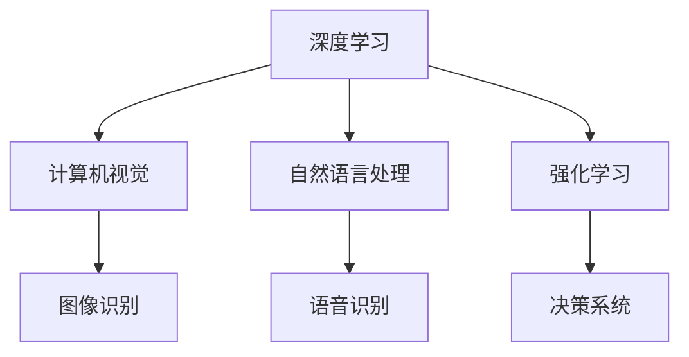

                 

# 李开复：AI 2.0 时代的产业革命

> **关键词：** AI 2.0、产业革命、人工智能应用、未来趋势、技术进步、商业模式创新。

> **摘要：** 本文旨在探讨AI 2.0时代带来的产业变革，分析其核心概念、技术进步、应用场景，并探讨未来的发展趋势与挑战。通过对核心概念与技术的深度剖析，结合实际项目案例，本文将呈现一个全面而深入的AI 2.0时代的产业图景。

## 1. 背景介绍

### 1.1 目的和范围

本文旨在探讨AI 2.0时代的产业变革，分析其核心概念、技术进步、应用场景，并探讨未来的发展趋势与挑战。本文的研究范围涵盖了AI 2.0的核心技术、关键应用场景、商业模式创新以及未来发展趋势。

### 1.2 预期读者

本文适合对人工智能技术有深入理解的技术人员、企业家、政策制定者以及对未来产业变革感兴趣的读者。

### 1.3 文档结构概述

本文结构如下：

1. 背景介绍：阐述研究目的、范围、预期读者和文档结构。
2. 核心概念与联系：介绍AI 2.0的核心概念和联系。
3. 核心算法原理 & 具体操作步骤：深入分析AI 2.0的核心算法原理和具体操作步骤。
4. 数学模型和公式 & 详细讲解 & 举例说明：讲解AI 2.0的数学模型和公式。
5. 项目实战：代码实际案例和详细解释说明。
6. 实际应用场景：探讨AI 2.0在实际应用中的场景。
7. 工具和资源推荐：推荐相关学习资源、开发工具和框架。
8. 总结：未来发展趋势与挑战。
9. 附录：常见问题与解答。
10. 扩展阅读 & 参考资料：提供进一步学习的资源。

### 1.4 术语表

#### 1.4.1 核心术语定义

- AI 2.0：指第二代人工智能技术，相对于第一代人工智能，具有更强的自主学习能力、更广泛的适用范围和更高的智能化水平。
- 产业革命：指由于技术进步和商业模式创新导致产业结构的重大变革。
- 深度学习：一种基于多层神经网络的机器学习技术，能够从大量数据中自动提取特征。
- 强化学习：一种机器学习技术，通过不断尝试和反馈，优化策略以达到最优效果。

#### 1.4.2 相关概念解释

- 人工智能应用：指利用人工智能技术解决实际问题，如智能语音识别、自然语言处理、图像识别等。
- 商业模式创新：指通过技术创新改变传统商业模式，实现商业价值的提升。

#### 1.4.3 缩略词列表

- AI：人工智能
- DL：深度学习
- RL：强化学习
- IoT：物联网

## 2. 核心概念与联系

AI 2.0的核心概念包括深度学习、强化学习、自然语言处理、计算机视觉等。这些概念之间的联系如下：

### 2.1. Mermaid 流程图



### 2.2. 核心概念原理

- **深度学习**：基于多层神经网络，能够自动提取数据中的特征。深度学习在图像识别、语音识别等领域取得了显著的成果。
- **强化学习**：通过不断尝试和反馈，优化策略以达到最优效果。强化学习在游戏、自动驾驶等领域有着广泛的应用。
- **自然语言处理**：研究如何使计算机理解和生成自然语言。自然语言处理在智能客服、机器翻译等领域有着重要的应用。
- **计算机视觉**：研究如何使计算机理解和解释图像和视频。计算机视觉在人脸识别、图像识别等领域有着广泛的应用。

## 3. 核心算法原理 & 具体操作步骤

### 3.1. 深度学习算法原理

深度学习算法主要基于多层神经网络，其中每一层都对输入数据进行处理，最终输出结果。以下是一个简化的深度学习算法原理：

```plaintext
输入：原始数据
输出：预测结果

1. 初始化神经网络
2. 前向传播：输入数据通过神经网络各层，逐层计算输出
3. 计算损失函数：比较预测结果与真实结果的差距
4. 反向传播：根据损失函数，更新神经网络各层的权重和偏置
5. 重复步骤2-4，直至满足停止条件（如达到预设的准确率或训练轮数）
6. 输出：训练好的神经网络，可用于预测新数据
```

### 3.2. 强化学习算法原理

强化学习算法通过不断尝试和反馈，优化策略以达到最优效果。以下是一个简化的强化学习算法原理：

```plaintext
输入：初始状态
输出：最优策略

1. 初始化环境
2. 进入循环：
   a. 从当前状态中选择一个动作
   b. 执行动作，获得奖励和下一个状态
   c. 根据奖励和下一个状态，更新策略
3. 输出：经过多次尝试和反馈，得到的最优策略
```

## 4. 数学模型和公式 & 详细讲解 & 举例说明

### 4.1. 深度学习数学模型

深度学习中的数学模型主要包括线性变换、激活函数、损失函数等。

- **线性变换**：指将输入数据通过矩阵乘法和加法运算转换成新的数据。线性变换的数学公式为：

  $$ output = \text{weights} \cdot input + bias $$

- **激活函数**：用于引入非线性因素，使神经网络能够拟合复杂的函数。常见的激活函数有ReLU（Rectified Linear Unit）和Sigmoid函数。

  - **ReLU函数**：

    $$ f(x) = \max(0, x) $$

  - **Sigmoid函数**：

    $$ f(x) = \frac{1}{1 + e^{-x}} $$

- **损失函数**：用于评估神经网络预测结果与真实结果之间的差距。常见的损失函数有均方误差（MSE）和交叉熵（Cross-Entropy）。

  - **均方误差（MSE）**：

    $$ MSE = \frac{1}{n}\sum_{i=1}^{n} (y_i - \hat{y}_i)^2 $$

  - **交叉熵（Cross-Entropy）**：

    $$ H(y, \hat{y}) = -\sum_{i=1}^{n} y_i \log(\hat{y}_i) $$

### 4.2. 强化学习数学模型

强化学习中的数学模型主要包括奖励函数和策略优化。

- **奖励函数**：用于评估当前状态和动作的优劣。奖励函数的数学公式为：

  $$ reward = f(state, action) $$

- **策略优化**：通过优化策略，使代理能够选择最优动作。策略优化的数学公式为：

  $$ policy = \arg\max_{\pi} \mathbb{E}_{s, a} [R(s, a) | \pi] $$

  其中，\( \mathbb{E}_{s, a} [R(s, a) | \pi] \) 表示在给定策略 \( \pi \) 下，从状态 \( s \) 选择动作 \( a \) 的期望奖励。

## 5. 项目实战：代码实际案例和详细解释说明

### 5.1. 开发环境搭建

为了更好地理解AI 2.0的应用，我们将使用Python和TensorFlow框架来实现一个简单的图像识别项目。

1. 安装Python（建议使用Python 3.7及以上版本）。
2. 安装TensorFlow：使用以下命令安装TensorFlow：

   ```bash
   pip install tensorflow
   ```

### 5.2. 源代码详细实现和代码解读

#### 5.2.1. 数据预处理

```python
import tensorflow as tf
from tensorflow.keras.preprocessing.image import ImageDataGenerator

# 设置训练集和测试集的路径
train_dir = 'path/to/train_data'
test_dir = 'path/to/test_data'

# 创建数据生成器
train_datagen = ImageDataGenerator(rescale=1./255)
test_datagen = ImageDataGenerator(rescale=1./255)

# 加载训练集和测试集
train_generator = train_datagen.flow_from_directory(
        train_dir,
        target_size=(150, 150),
        batch_size=32,
        class_mode='binary')

test_generator = test_datagen.flow_from_directory(
        test_dir,
        target_size=(150, 150),
        batch_size=32,
        class_mode='binary')
```

#### 5.2.2. 构建深度学习模型

```python
from tensorflow.keras.models import Sequential
from tensorflow.keras.layers import Conv2D, MaxPooling2D, Flatten, Dense, Dropout

# 创建模型
model = Sequential([
    Conv2D(32, (3, 3), activation='relu', input_shape=(150, 150, 3)),
    MaxPooling2D((2, 2)),
    Conv2D(64, (3, 3), activation='relu'),
    MaxPooling2D((2, 2)),
    Conv2D(128, (3, 3), activation='relu'),
    MaxPooling2D((2, 2)),
    Flatten(),
    Dense(512, activation='relu'),
    Dropout(0.5),
    Dense(1, activation='sigmoid')
])

# 编译模型
model.compile(optimizer='adam',
              loss='binary_crossentropy',
              metrics=['accuracy'])
```

#### 5.2.3. 训练模型

```python
# 训练模型
history = model.fit(
      train_generator,
      steps_per_epoch=100,
      epochs=30,
      validation_data=test_generator,
      validation_steps=50,
      verbose=2)
```

### 5.3. 代码解读与分析

- **数据预处理**：使用ImageDataGenerator进行数据预处理，包括图像的缩放和类别划分。
- **模型构建**：使用Sequential模型堆叠多个层，包括卷积层、池化层、全连接层和Dropout层，以实现图像识别任务。
- **模型编译**：设置优化器、损失函数和评估指标，为模型训练做好准备。
- **模型训练**：使用fit方法训练模型，并在验证集上评估模型性能。

## 6. 实际应用场景

AI 2.0技术在各个领域都有着广泛的应用，以下是几个典型的应用场景：

- **图像识别**：在医疗、安全、工业等领域，通过深度学习算法实现图像识别，可以自动化识别和分类图像，提高工作效率。
- **自然语言处理**：在智能客服、机器翻译等领域，通过自然语言处理技术实现人机交互，提高用户体验。
- **自动驾驶**：通过强化学习和计算机视觉技术，实现自动驾驶汽车，提高交通安全和效率。
- **智能制造**：通过深度学习技术，实现生产过程的自动化和智能化，提高生产效率和产品质量。

## 7. 工具和资源推荐

### 7.1 学习资源推荐

#### 7.1.1 书籍推荐

- 《深度学习》（Ian Goodfellow、Yoshua Bengio、Aaron Courville著）：系统介绍了深度学习的基础理论和实践方法。
- 《强化学习》（Richard S. Sutton、Andrew G. Barto著）：全面介绍了强化学习的基本概念、算法和应用。

#### 7.1.2 在线课程

- Coursera：提供丰富的深度学习和强化学习在线课程，适合初学者和进阶者。
- edX：提供由世界顶尖大学开设的人工智能课程，涵盖深度学习、自然语言处理等主题。

#### 7.1.3 技术博客和网站

- Medium：有许多知名的人工智能技术博客，如TensorFlow、PyTorch等。
- AI Trends：专注于人工智能领域的前沿技术和应用。

### 7.2 开发工具框架推荐

#### 7.2.1 IDE和编辑器

- PyCharm：功能强大的Python开发环境，支持深度学习和强化学习。
- Jupyter Notebook：交互式的Python编程环境，适合数据分析和原型设计。

#### 7.2.2 调试和性能分析工具

- TensorFlow Profiler：用于分析TensorFlow模型的性能，优化模型运行效率。
- TensorBoard：用于可视化TensorFlow训练过程中的数据，如损失函数、准确率等。

#### 7.2.3 相关框架和库

- TensorFlow：广泛使用的深度学习框架，提供丰富的API和工具。
- PyTorch：受欢迎的深度学习框架，具有灵活的动态计算图。

### 7.3 相关论文著作推荐

#### 7.3.1 经典论文

- "A Learning Algorithm for Continually Running Fully Connected Networks"（1989）：Hinton提出的反向传播算法，为深度学习奠定了基础。
- "Reinforcement Learning: An Introduction"（1998）：Sutton和Barto的经典教材，全面介绍了强化学习的基本概念和方法。

#### 7.3.2 最新研究成果

- "Bert: Pre-training of Deep Bidirectional Transformers for Language Understanding"（2018）：Google提出的BERT模型，大幅提升了自然语言处理任务的性能。
- "DeepMind's New AI System Beating Human Pros at 'Dota 2'"（2018）：DeepM

