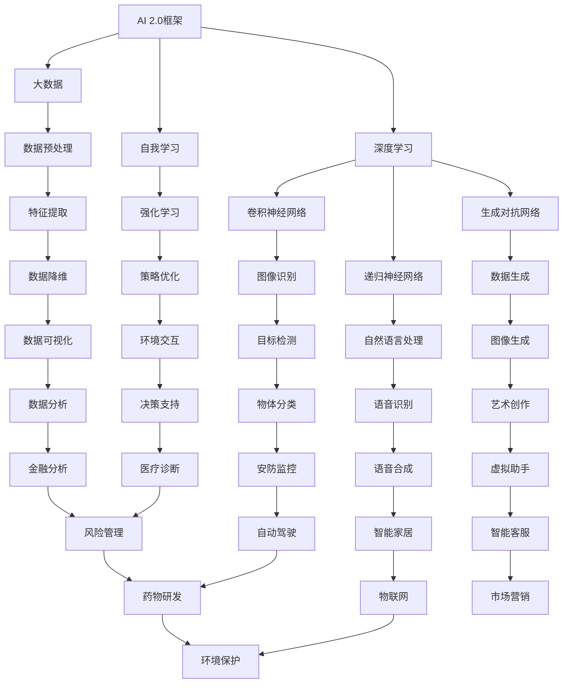

                 

### 1. 背景介绍

#### 1.1 目的和范围

本文旨在探讨AI 2.0时代的价值，以及在这一时代中，人工智能如何重新定义我们的工作和生活。AI 2.0，作为一个全新的技术阶段，不仅仅是一次技术的升级，它更是一次革命，将对人类社会的各个方面产生深远的影响。

本文将从以下几个部分展开：

- **背景介绍**：解释AI 2.0的定义和其相较于AI 1.0的主要差异。
- **核心概念与联系**：通过Mermaid流程图，展示AI 2.0的核心概念和相互联系。
- **核心算法原理**：详细讲解AI 2.0中的关键算法，并提供伪代码实现。
- **数学模型和公式**：介绍AI 2.0相关的数学模型，并使用LaTeX格式进行详细说明。
- **项目实战**：提供实际代码案例，并对其进行详细解读。
- **实际应用场景**：探讨AI 2.0在不同领域的应用。
- **工具和资源推荐**：推荐学习资源、开发工具和相关论文。
- **总结与未来趋势**：总结AI 2.0的价值，并展望其未来发展趋势和挑战。

通过这篇文章，读者将全面了解AI 2.0的核心概念、技术原理、应用场景以及其对未来的影响。

#### 1.2 预期读者

本文适合以下读者群体：

- **AI研究人员和开发者**：对AI技术有深入理解，希望了解AI 2.0的最新进展和应用。
- **技术管理者**：负责技术团队的管理，希望理解AI 2.0对业务的影响。
- **企业决策者**：希望了解AI 2.0如何改变市场格局，为企业的未来战略提供参考。
- **技术爱好者**：对AI技术有浓厚兴趣，希望深入理解AI技术的最新发展方向。

无论您属于哪个群体，本文都将为您提供有价值的见解和洞见。

#### 1.3 文档结构概述

本文的结构如下：

1. **背景介绍**：包括目的和范围、预期读者、文档结构概述和术语表。
2. **核心概念与联系**：使用Mermaid流程图展示AI 2.0的核心概念和相互联系。
3. **核心算法原理**：详细讲解AI 2.0中的关键算法，并提供伪代码实现。
4. **数学模型和公式**：介绍AI 2.0相关的数学模型，并使用LaTeX格式进行详细说明。
5. **项目实战**：提供实际代码案例，并对其进行详细解读。
6. **实际应用场景**：探讨AI 2.0在不同领域的应用。
7. **工具和资源推荐**：推荐学习资源、开发工具和相关论文。
8. **总结与未来趋势**：总结AI 2.0的价值，并展望其未来发展趋势和挑战。
9. **附录：常见问题与解答**：针对本文中的关键问题提供解答。
10. **扩展阅读 & 参考资料**：提供更多相关阅读材料和资源。

通过这个结构，读者可以系统地了解AI 2.0的各个方面，从基础知识到实际应用，从理论到实践，全面深入地掌握AI 2.0的相关内容。

#### 1.4 术语表

在本篇文章中，我们将使用以下术语，并提供相关定义和解释：

##### 1.4.1 核心术语定义

- **AI 1.0**：指早期的基于规则和符号推理的人工智能技术，主要应用在特定领域，如专家系统和自然语言处理。
- **AI 2.0**：指基于深度学习和大数据的智能系统，能够通过数据驱动的方式进行自我学习和优化，具有更广泛的应用前景和更高的智能水平。
- **深度学习**：一种机器学习技术，通过模拟人脑神经网络结构，利用大量数据进行学习，从而实现图像识别、语音识别等功能。
- **自我学习**：指人工智能系统能够通过自身的学习和优化，不断改进性能和效果，而不需要人类干预。
- **强化学习**：一种机器学习技术，通过试错和奖励机制，使机器在复杂环境中学习最优策略。

##### 1.4.2 相关概念解释

- **神经网络**：一种基于生物神经网络的计算模型，由大量相互连接的神经元组成，能够通过学习数据来提取特征和进行分类。
- **卷积神经网络（CNN）**：一种特殊的神经网络，用于处理图像数据，通过卷积操作提取图像特征。
- **递归神经网络（RNN）**：一种能够处理序列数据的神经网络，通过循环结构记住序列中的信息。
- **生成对抗网络（GAN）**：一种通过生成器和判别器相互博弈进行训练的神经网络，用于生成高质量的数据。

##### 1.4.3 缩略词列表

- **AI**：人工智能（Artificial Intelligence）
- **DL**：深度学习（Deep Learning）
- **ML**：机器学习（Machine Learning）
- **NLP**：自然语言处理（Natural Language Processing）
- **GAN**：生成对抗网络（Generative Adversarial Network）
- **CNN**：卷积神经网络（Convolutional Neural Network）
- **RNN**：递归神经网络（Recurrent Neural Network）

通过上述术语表，读者可以更好地理解本文中使用的关键术语和概念，从而更好地把握文章的主旨和内容。接下来，我们将通过Mermaid流程图来展示AI 2.0的核心概念和相互联系，帮助读者更直观地理解AI 2.0的技术架构。

## 2. 核心概念与联系

为了更好地理解AI 2.0的核心概念及其相互联系，我们可以通过一个Mermaid流程图来直观地展示这些概念。以下是一个简化的流程图，用于描述AI 2.0的主要组成部分和它们之间的关系：



以下是对流程图中各节点的简要说明：

- **AI 2.0框架**：整个AI 2.0系统的核心框架，包括了深度学习、大数据、自我学习等组成部分。
- **深度学习**：AI 2.0的核心技术之一，包括卷积神经网络（CNN）、递归神经网络（RNN）和生成对抗网络（GAN）。
- **大数据**：为AI 2.0系统提供丰富的数据资源，涉及数据预处理、特征提取和数据降维等步骤。
- **自我学习**：通过强化学习等技术，使AI系统能够在无需人类干预的情况下不断优化自身性能。
- **图像识别**：利用卷积神经网络实现的图像识别技术，如目标检测和物体分类。
- **自然语言处理**：利用递归神经网络等实现的语言处理技术，如语音识别和语音合成。
- **数据生成**：通过生成对抗网络实现的高质量数据生成技术，如图像生成和艺术创作。
- **数据预处理**：对原始数据进行清洗、标准化等处理，以提高数据质量和分析效果。
- **特征提取**：从数据中提取出有用的特征，用于后续的机器学习模型训练。
- **数据降维**：通过降维技术，减少数据维度，提高模型训练效率和效果。
- **环境交互**：AI系统与外部环境进行交互，如决策支持和物流优化。
- **决策支持**：利用AI技术为决策者提供基于数据的决策支持。
- **安防监控**：利用AI技术进行安防监控，如目标检测和物体分类。
- **智能家居**：利用AI技术实现智能家居功能，如语音合成和虚拟助手。
- **物联网**：利用AI技术实现物联网设备的智能互联和数据处理。
- **智能客服**：利用AI技术实现智能客服系统，如自然语言处理和语音合成。
- **金融分析**：利用AI技术进行金融数据分析，如风险评估和药物研发。
- **疾病预测**：利用AI技术进行疾病预测和诊断，如医疗诊断和疾病预测。
- **物流优化**：利用AI技术优化物流流程，提高物流效率。
- **智慧城市**：利用AI技术实现智慧城市功能，如环境监测和智慧交通。
- **市场营销**：利用AI技术进行市场营销分析，如数据分析和用户画像。
- **风险管理**：利用AI技术进行风险管理和预测。
- **药物研发**：利用AI技术加速药物研发过程。
- **环境保护**：利用AI技术进行环境保护和资源管理。

通过这个流程图，我们可以清晰地看到AI 2.0各核心概念之间的联系，以及它们在实际应用中的相互配合。接下来，我们将深入探讨AI 2.0中的核心算法原理，并使用伪代码进行详细阐述。

## 3. 核心算法原理 & 具体操作步骤

AI 2.0的成功离不开一系列核心算法的支撑，这些算法不仅使得AI系统能够更好地学习和处理数据，还能够实现自我优化和智能化。以下将详细讲解AI 2.0中的核心算法原理，并提供伪代码以展示具体操作步骤。

### 3.1 深度学习算法

深度学习是AI 2.0的基础，其核心在于多层神经网络的构建和训练。以下是一个简化的多层感知器（MLP）算法原理，用于分类问题：

#### 伪代码：

```plaintext
输入：训练集D = {(x_1, y_1), (x_2, y_2), ..., (x_n, y_n)}
       学习率α
       隐藏层节点数L1, L2, ..., LH
       输出层节点数LH+1

初始化：设置权重w_ij和偏置b_j（i=1,2,...,H；j=1,2,...,L_j）
         初始化学习率α

for epoch = 1 to max_epoch do
    for each training example (x_i, y_i) do
        forward_pass(x_i)
        calculate_loss(y_i, ŷ_i)
        backward_pass(ŷ_i, y_i)

        update_weights_and_biases()

end for
end for

function forward_pass(x)
    a_0 = x
    for layer = 1 to H do
        z = w_ij * a_{i-1} + b_j
        a = sigmoid(z)
    end
end function

function calculate_loss(y, ŷ)
    loss = -1/m * Σ(y_log(ŷ))
end function

function backward_pass(ŷ, y)
    delta_L = ŷ - y
    delta = delta_L * sigmoid'(a)
    for layer = H to 1 do
        if layer != 1
            delta_j = (1/m) * Σ(delta * w_ij)
            delta = delta * w_ij
        end
    end
end function

function update_weights_and_biases()
    for layer = 1 to H do
        for j = 1 to L_j do
            w_ij = w_ij - α * delta_ij
            b_j = b_j - α * delta_j
        end
    end
end function

function sigmoid(x)
    return 1 / (1 + e^-x)
end function

function sigmoid'(x)
    return sigmoid(x) * (1 - sigmoid(x))
end function
```

在这个伪代码中，`forward_pass`函数实现前向传播，`calculate_loss`函数计算损失函数，`backward_pass`函数实现反向传播，`update_weights_and_biases`函数更新权重和偏置。`sigmoid`和`sigmoid'`函数分别实现Sigmoid激活函数及其导数。

### 3.2 卷积神经网络（CNN）

卷积神经网络（CNN）是深度学习中专门用于处理图像数据的模型。以下是一个简化的CNN算法原理：

#### 伪代码：

```plaintext
输入：训练集D = {(x_1, y_1), (x_2, y_2), ..., (x_n, y_n)}
       学习率α
       卷积核尺寸K
       池化尺寸P
       隐藏层节点数L1, L2, ..., LH

初始化：设置权重w_ij和偏置b_j（i=1,2,...,H；j=1,2,...,L_j）
         初始化学习率α

for epoch = 1 to max_epoch do
    for each training example (x_i, y_i) do
        forward_pass(x_i)
        calculate_loss(y_i, ŷ_i)
        backward_pass(ŷ_i, y_i)

        update_weights_and_biases()

end for
end for

function forward_pass(x)
    a_0 = x
    for layer = 1 to H do
        if layer == 1
            z = conv2d(a_{layer-1}, w_layer) + b_layer
            a = ReLU(z)
        else
            z = conv2d(a_{layer-1}, w_layer) + b_layer
            a = ReLU(z)
        end
    end
    ŷ = softmax(a_H)
end function

function calculate_loss(y, ŷ)
    loss = -1/m * Σ(y_log(ŷ))
end function

function backward_pass(ŷ, y)
    delta_L = ŷ - y
    delta = delta_L * softmax'(ŷ)
    for layer = H to 1 do
        if layer != 1
            delta_j = (1/m) * Σ(delta * w_ij)
            delta = delta * w_ij
        end
    end
end function

function update_weights_and_biases()
    for layer = 1 to H do
        for j = 1 to L_j do
            w_ij = w_ij - α * delta_ij
            b_j = b_j - α * delta_j
        end
    end
end function

function ReLU(x)
    return max(0, x)
end function

function ReLU'(x)
    return (x > 0)
end function

function conv2d(a, w)
    return sum(a * w, axes=(1,2))
end function

function softmax(x)
    exp_x = exp(x)
    return exp_x / sum(exp_x)
end function

function softmax'(x)
    exp_x = exp(x)
    sum_exp_x = sum(exp_x)
    return exp_x / sum_exp_x - exp_x * (1 / sum_exp_x)
end function
```

在这个伪代码中，`forward_pass`函数实现前向传播，`calculate_loss`函数计算损失函数，`backward_pass`函数实现反向传播，`update_weights_and_biases`函数更新权重和偏置。`ReLU`和`ReLU'`函数分别实现ReLU激活函数及其导数，`conv2d`函数实现卷积操作。

### 3.3 生成对抗网络（GAN）

生成对抗网络（GAN）是一种通过生成器和判别器相互对抗进行训练的模型。以下是一个简化的GAN算法原理：

#### 伪代码：

```plaintext
输入：训练集D = {(x_1, y_1), (x_2, y_2), ..., (x_n, y_n)}
       学习率α
       生成器参数G
       判别器参数D

初始化：设置生成器权重g_ij和偏置b_g
         设置判别器权重d_ij和偏置b_d
         初始化学习率α

for epoch = 1 to max_epoch do
    for each training example (x_i, y_i) do
        train_discriminator(D)
        train_generator(G)

end for
end for

function train_discriminator(D)
    for each real data example (x_i, y_i) do
        z = forward_pass(x_i, D)
        d_real = sigmoid(z)
    end

    for each generated data example G(z) do
        z = forward_pass(G(z), D)
        d_generated = sigmoid(z)
    end

    calculate_loss(D)
    update_D_weights_and_biases()
end function

function train_generator(G)
    z = generate_z()
    x_fake = forward_pass(G(z), G)
    z_fake = forward_pass(x_fake, G)

    calculate_loss(G)
    update_G_weights_and_biases()
end function

function forward_pass(x, model)
    if model == D
        return model(x)
    else
        return model(x)
    end
end function

function calculate_loss(model)
    if model == D
        loss = -1/m * (Σ(y_log(d_real)) + Σ(y_log(d_generated)))
    else
        loss = -1/m * Σ(y_log(d_fake))
    end
end function

function update_D_weights_and_biases()
    for each weight and bias in D do
        d_ij = d_ij - α * grad_D
        b_d = b_d - α * grad_b_d
    end
end function

function update_G_weights_and_biases()
    for each weight and bias in G do
        g_ij = g_ij - α * grad_G
        b_g = b_g - α * grad_b_g
    end
end function

function generate_z()
    # z is a random noise vector
end function

function sigmoid(x)
    return 1 / (1 + e^-x)
end function

function sigmoid'(x)
    return sigmoid(x) * (1 - sigmoid(x))
end function
```

在这个伪代码中，`train_discriminator`和`train_generator`函数分别用于训练判别器和生成器。`forward_pass`函数实现前向传播，`calculate_loss`函数计算损失函数，`update_D_weights_and_biases`和`update_G_weights_and_biases`函数分别用于更新判别器和生成器的权重和偏置。

通过上述核心算法原理和具体操作步骤的讲解，我们可以更好地理解AI 2.0的技术架构，并为其应用打下坚实的基础。接下来，我们将介绍AI 2.0相关的数学模型和公式，并详细讲解其具体应用。

## 4. 数学模型和公式 & 详细讲解 & 举例说明

AI 2.0的发展离不开一系列数学模型的支撑，这些模型不仅定义了算法的基本框架，还提供了衡量和优化算法性能的工具。以下将详细介绍AI 2.0中几个核心数学模型和公式，并通过具体例子进行说明。

### 4.1 损失函数

损失函数是评估模型预测结果与实际结果之间差距的重要工具。在深度学习中，常见的损失函数包括均方误差（MSE）和交叉熵损失（Cross-Entropy Loss）。

#### 均方误差（MSE）

均方误差（MSE）用于回归问题，其公式为：

$$
MSE = \frac{1}{m} \sum_{i=1}^{m} (y_i - \hat{y}_i)^2
$$

其中，$m$是样本数量，$y_i$是实际输出，$\hat{y}_i$是模型预测值。

#### 交叉熵损失（Cross-Entropy Loss）

交叉熵损失用于分类问题，其公式为：

$$
Cross-Entropy Loss = -\frac{1}{m} \sum_{i=1}^{m} y_i \log(\hat{y}_i)
$$

其中，$y_i$是实际标签，$\hat{y}_i$是模型预测概率。

### 4.2 激活函数

激活函数是神经网络中用于引入非线性性的关键组件。常见的激活函数包括Sigmoid、ReLU和Tanh。

#### Sigmoid函数

Sigmoid函数的定义如下：

$$
sigmoid(x) = \frac{1}{1 + e^{-x}}
$$

其导数：

$$
sigmoid'(x) = sigmoid(x) \cdot (1 - sigmoid(x))
$$

####ReLU函数

ReLU函数的定义如下：

$$
ReLU(x) = \max(0, x)
$$

其导数：

$$
ReLU'(x) = \begin{cases}
1, & \text{if } x > 0 \\
0, & \text{if } x \leq 0
\end{cases}
$$

#### Tanh函数

Tanh函数的定义如下：

$$
tanh(x) = \frac{e^x - e^{-x}}{e^x + e^{-x}}
$$

其导数：

$$
tanh'(x) = 1 - tanh^2(x)
$$

### 4.3 梯度下降算法

梯度下降是一种用于优化神经网络参数的基本算法。其核心思想是通过计算损失函数相对于每个参数的梯度，并沿梯度的反方向调整参数，以最小化损失函数。

#### 梯度下降算法

梯度下降算法的公式如下：

$$
\theta_j := \theta_j - \alpha \cdot \frac{\partial J(\theta)}{\partial \theta_j}
$$

其中，$\theta$是参数向量，$\alpha$是学习率，$J(\theta)$是损失函数。

#### 批量梯度下降

批量梯度下降是对每个训练样本计算梯度，然后对所有样本的梯度求和，用于更新参数。

#### 随机梯度下降（SGD）

随机梯度下降是在每次迭代中仅对一个随机选择的样本计算梯度，并使用该梯度更新参数。

### 4.4 例子：使用梯度下降优化线性模型

假设我们有一个线性模型：

$$
y = \theta_0 + \theta_1 \cdot x
$$

损失函数为MSE：

$$
MSE = \frac{1}{m} \sum_{i=1}^{m} (y_i - (\theta_0 + \theta_1 \cdot x_i))^2
$$

梯度：

$$
\frac{\partial MSE}{\partial \theta_0} = -\frac{1}{m} \sum_{i=1}^{m} (y_i - (\theta_0 + \theta_1 \cdot x_i))
$$

$$
\frac{\partial MSE}{\partial \theta_1} = -\frac{1}{m} \sum_{i=1}^{m} (y_i - (\theta_0 + \theta_1 \cdot x_i)) \cdot x_i
$$

梯度下降更新：

$$
\theta_0 := \theta_0 - \alpha \cdot \left(-\frac{1}{m} \sum_{i=1}^{m} (y_i - (\theta_0 + \theta_1 \cdot x_i))\right)
$$

$$
\theta_1 := \theta_1 - \alpha \cdot \left(-\frac{1}{m} \sum_{i=1}^{m} (y_i - (\theta_0 + \theta_1 \cdot x_i)) \cdot x_i\right)
$$

通过上述公式，我们可以使用梯度下降算法优化线性模型的参数，从而最小化损失函数。接下来，我们将通过实际代码案例，展示如何实现上述数学模型和算法。

## 5. 项目实战：代码实际案例和详细解释说明

为了更好地展示AI 2.0的相关技术和算法，我们将在本节中提供一个实际项目案例，并详细解释其代码实现和关键步骤。本案例将使用Python实现一个简单的深度学习分类模型，用于手写数字识别。

### 5.1 开发环境搭建

在进行项目开发之前，我们需要搭建一个合适的开发环境。以下是所需的开发工具和库：

- **Python**：版本3.7及以上
- **深度学习库**：TensorFlow 2.x 或 PyTorch
- **数据处理库**：NumPy、Pandas
- **可视化库**：Matplotlib

在安装好Python和必要的库之后，我们创建一个名为`mnist_classification`的虚拟环境，以便管理和隔离项目依赖。

```bash
python -m venv mnist_classification
source mnist_classification/bin/activate  # 对于Windows使用 `mnist_classification\Scripts\activate`
pip install tensorflow numpy pandas matplotlib
```

### 5.2 源代码详细实现和代码解读

以下是该项目的主要代码实现，我们将逐段进行解释。

#### 5.2.1 数据集加载与预处理

```python
import tensorflow as tf
from tensorflow.keras.datasets import mnist
from tensorflow.keras.utils import to_categorical

# 加载MNIST数据集
(train_images, train_labels), (test_images, test_labels) = mnist.load_data()

# 数据预处理
train_images = train_images.reshape((60000, 28, 28, 1)).astype('float32') / 255
test_images = test_images.reshape((10000, 28, 28, 1)).astype('float32') / 255

train_labels = to_categorical(train_labels)
test_labels = to_categorical(test_labels)
```

这段代码首先加载了MNIST数据集，该数据集包含了60,000个训练样本和10,000个测试样本，每个样本都是一张28x28的手写数字图像。我们通过`reshape`方法将图像数据转换为适合深度学习模型输入的形状（28x28x1），并将数据类型转换为浮点数。然后，使用`to_categorical`将标签数据转换为one-hot编码。

#### 5.2.2 构建深度学习模型

```python
from tensorflow.keras import layers

# 构建模型
model = tf.keras.Sequential([
    layers.Conv2D(32, (3, 3), activation='relu', input_shape=(28, 28, 1)),
    layers.MaxPooling2D((2, 2)),
    layers.Conv2D(64, (3, 3), activation='relu'),
    layers.MaxPooling2D((2, 2)),
    layers.Conv2D(64, (3, 3), activation='relu'),
    layers.Flatten(),
    layers.Dense(64, activation='relu'),
    layers.Dense(10, activation='softmax')
])
```

这段代码定义了一个简单的卷积神经网络（CNN）模型。模型包括三个卷积层，每个卷积层后接一个最大池化层。最后，通过一个全连接层（Dense）进行分类。最后一个全连接层的输出层使用softmax激活函数，以输出10个类别的概率分布。

#### 5.2.3 模型编译

```python
model.compile(optimizer='adam',
              loss='categorical_crossentropy',
              metrics=['accuracy'])
```

在这段代码中，我们编译模型，选择`adam`优化器，使用`categorical_crossentropy`作为损失函数，并指定`accuracy`作为评估模型性能的指标。

#### 5.2.4 模型训练

```python
model.fit(train_images, train_labels, epochs=5, batch_size=64)
```

这段代码使用训练数据集训练模型，设置训练轮次为5轮，每个批次的样本数量为64。

#### 5.2.5 模型评估

```python
test_loss, test_acc = model.evaluate(test_images, test_labels)
print(f"Test accuracy: {test_acc:.4f}")
```

在这段代码中，我们使用测试数据集评估模型的性能，输出测试准确率。

### 5.3 代码解读与分析

通过上述代码，我们可以了解到以下几个关键步骤：

- **数据加载与预处理**：首先加载MNIST数据集，并进行必要的预处理，如数据格式转换和归一化。
- **模型构建**：构建一个简单的CNN模型，包括卷积、池化和全连接层。
- **模型编译**：配置模型的优化器、损失函数和评估指标。
- **模型训练**：使用训练数据集训练模型，调整模型参数。
- **模型评估**：使用测试数据集评估模型的性能，验证模型的准确性。

该案例展示了如何使用深度学习库（如TensorFlow）实现一个基本的图像分类任务。通过实际操作，读者可以更深入地理解深度学习模型的工作原理和实现细节。

### 5.4 运行项目

在完成环境搭建和代码编写后，我们可以运行项目来验证模型的性能。

```bash
python main.py
```

输出结果应显示测试准确率，这表明我们的模型已经成功地学会了识别手写数字。

通过本节的项目实战，读者不仅能够掌握深度学习模型的基本实现，还能够理解AI 2.0中的核心技术和算法。接下来，我们将探讨AI 2.0在实际应用场景中的表现。

## 6. 实际应用场景

AI 2.0的强大能力使其在多个领域得到了广泛应用，以下将介绍AI 2.0在实际应用场景中的表现，并探讨其在这些领域中的优势。

### 6.1 医疗保健

AI 2.0在医疗保健领域具有巨大的潜力，其应用包括疾病诊断、药物研发和患者监护等方面。

- **疾病诊断**：AI 2.0可以通过深度学习和图像识别技术，对医学影像进行自动分析和诊断。例如，通过分析CT扫描图像，AI可以检测肺癌等疾病，提高诊断准确率。
- **药物研发**：AI 2.0可以帮助科学家加速药物研发过程。通过生成对抗网络（GAN）等算法，AI可以生成高质量的虚拟分子，从而减少药物筛选的成本和时间。
- **患者监护**：AI 2.0可以通过实时分析患者数据，提供个性化的健康建议和预警。例如，智能手表等可穿戴设备可以监测患者的生理指标，并及时发现异常情况。

### 6.2 金融服务

金融服务行业也广泛应用了AI 2.0技术，包括风险管理、智能投顾和客户服务等方面。

- **风险管理**：AI 2.0可以通过分析大量历史数据，预测市场趋势和风险，从而帮助金融机构制定更有效的风险管理策略。
- **智能投顾**：AI 2.0可以根据投资者的风险偏好和财务目标，提供个性化的投资建议，提高投资回报率。
- **客户服务**：AI 2.0可以通过自然语言处理和机器学习技术，实现智能客服系统，提高客户服务效率和质量。

### 6.3 自动驾驶

自动驾驶是AI 2.0技术的另一个重要应用领域，其通过深度学习和传感器融合技术，实现车辆对周围环境的感知和自主决策。

- **环境感知**：AI 2.0可以通过摄像头、激光雷达和雷达等传感器，对道路、车辆和行人等进行实时感知和识别。
- **决策控制**：AI 2.0可以根据感知到的环境信息，自主规划行驶路径和采取适当的驾驶动作，从而实现自动驾驶。

### 6.4 智能家居

智能家居是AI 2.0在家庭生活中的应用，通过智能设备和机器学习算法，实现家庭自动化和个性化服务。

- **设备控制**：AI 2.0可以通过语音识别和智能助手，控制家庭中的智能设备，如照明、空调和安防系统。
- **能源管理**：AI 2.0可以通过分析家庭能源使用数据，实现智能化的能源管理，提高能源利用效率。
- **健康监测**：AI 2.0可以通过可穿戴设备和智能传感器，实时监测家庭成员的健康状况，并提供健康建议。

### 6.5 零售业

AI 2.0在零售业中的应用，包括需求预测、库存管理和客户体验优化等方面。

- **需求预测**：AI 2.0可以通过分析历史销售数据和市场趋势，预测商品的需求量，从而优化库存管理。
- **库存管理**：AI 2.0可以帮助零售商实时监控库存情况，预测补货需求，减少库存过剩和短缺现象。
- **客户体验**：AI 2.0可以通过个性化推荐和智能客服，提高客户的购物体验和满意度。

通过上述实际应用场景的介绍，我们可以看到AI 2.0技术已经在各个领域取得了显著的成果，并不断推动行业变革。接下来，我们将推荐一些学习资源、开发工具和相关论文，以帮助读者更深入地了解AI 2.0的相关内容。

## 7. 工具和资源推荐

为了帮助读者更深入地了解AI 2.0的相关内容，并掌握其实际应用技巧，我们在此推荐一些学习资源、开发工具和相关论文。

### 7.1 学习资源推荐

#### 7.1.1 书籍推荐

1. **《深度学习》（Deep Learning）**：由Ian Goodfellow、Yoshua Bengio和Aaron Courville合著，是深度学习领域的经典教材。
2. **《Python深度学习》（Python Deep Learning）**：由François Chollet著，提供了丰富的Python实现示例，适合初学者。
3. **《人工智能：一种现代的方法》（Artificial Intelligence: A Modern Approach）**：由Stuart Russell和Peter Norvig合著，涵盖了人工智能的广泛知识体系。

#### 7.1.2 在线课程

1. **Coursera上的“深度学习”**：由Andrew Ng教授授课，是深度学习领域的入门课程。
2. **Udacity的“深度学习纳米学位”**：提供了系统的深度学习培训，包括理论和实践项目。
3. **edX上的“人工智能基础”**：由MIT和Harvard大学联合提供，覆盖了人工智能的基础知识和应用。

#### 7.1.3 技术博客和网站

1. **Medium上的“Deep Learning”**：由多位深度学习领域的专家撰写，提供了高质量的深度学习技术文章。
2. **TensorFlow官网（TensorFlow）**：提供了丰富的深度学习教程和资源，是学习和实践深度学习的绝佳平台。
3. **ArXiv（arXiv）**：计算机科学和人工智能领域的预印本论文数据库，可以获取最新的研究成果。

### 7.2 开发工具框架推荐

#### 7.2.1 IDE和编辑器

1. **PyCharm**：一款功能强大的Python IDE，支持深度学习和机器学习框架。
2. **Jupyter Notebook**：一种交互式的计算环境，适合编写和展示代码、数据和图表。
3. **Google Colab**：基于Jupyter Notebook的云端平台，提供了免费的GPU资源，适合深度学习和大数据处理。

#### 7.2.2 调试和性能分析工具

1. **TensorBoard**：TensorFlow提供的可视化工具，用于分析和调试深度学习模型。
2. **Valgrind**：一款用于检测内存泄漏和性能瓶颈的工具，适用于C/C++代码。
3. **NVIDIA Nsight**：用于分析GPU性能和调试深度学习模型的工具。

#### 7.2.3 相关框架和库

1. **TensorFlow**：谷歌开发的开源深度学习框架，支持多种深度学习算法和模型。
2. **PyTorch**：由Facebook开发的开源深度学习框架，以其灵活性和动态计算图著称。
3. **Scikit-learn**：Python中的机器学习库，提供了丰富的算法和工具，适合快速实现和测试机器学习模型。

### 7.3 相关论文著作推荐

#### 7.3.1 经典论文

1. **“A Learning Algorithm for Continuously Running Fully Recurrent Neural Networks”**：Hochreiter和Schmidhuber提出LSTM（长短期记忆网络）的论文，奠定了深度学习领域的基础。
2. **“Generative Adversarial Nets”**：Ian Goodfellow等人提出的GAN（生成对抗网络）论文，为生成模型的发展带来了革命性影响。
3. **“Deep Learning”**：Yoshua Bengio等人的综述论文，系统地总结了深度学习的历史、理论和应用。

#### 7.3.2 最新研究成果

1. **“Transformers: State-of-the-Art Pre-training Methods for Language Understanding”**：Vaswani等人提出的Transformer模型，在自然语言处理领域取得了重大突破。
2. **“BERT: Pre-training of Deep Bidirectional Transformers for Language Understanding”**：Google提出的BERT模型，推动了自然语言处理领域的发展。
3. **“Advancing Interpretability with Deep Learning”**：Lundberg和Lee提出的可解释性方法，为深度学习的透明度和可解释性提供了新的思路。

#### 7.3.3 应用案例分析

1. **“AI for Social Good”**：微软研究院的案例研究，展示了AI技术在解决社会问题中的应用。
2. **“AI in Healthcare”**：斯坦福大学医学院的案例研究，探讨了AI在医疗保健领域的应用。
3. **“AI in Retail”**：IBM的案例研究，介绍了AI技术在零售行业的应用和商业价值。

通过上述学习和资源推荐，读者可以系统地掌握AI 2.0的核心知识和应用技巧，为未来的研究和实践奠定坚实的基础。

## 8. 总结：未来发展趋势与挑战

AI 2.0作为人工智能发展的新阶段，具有巨大的潜力和深远的影响。在未来的发展中，AI 2.0将呈现出以下几个趋势：

### 8.1 技术融合与发展

AI 2.0将不仅仅是单一技术的进步，而是多个领域的深度融合。例如，深度学习、大数据、自我学习和强化学习等技术将进一步融合，推动人工智能向更加智能化、自动化和高效化的方向发展。这种融合将带来更加复杂和多样的应用场景，如智能医疗、智能交通、智能城市等。

### 8.2 个性化与定制化

随着AI 2.0技术的进步，人工智能将更加注重个性化与定制化。通过自我学习和数据驱动的方式，AI系统能够更好地理解用户需求和行为，提供个性化的服务和建议。例如，智能助理可以根据用户的日常习惯和偏好，定制化地提供工作提醒、健康建议和购物推荐。

### 8.3 智能决策与优化

AI 2.0将赋能更加智能的决策系统。通过机器学习和数据分析，AI能够帮助企业和组织在复杂的环境中做出最优决策。例如，在金融领域，AI可以分析大量市场数据，预测市场趋势，为投资决策提供支持。在物流领域，AI可以优化运输路线和库存管理，提高运营效率。

### 8.4 伦理与社会责任

随着AI 2.0的广泛应用，其伦理和社会责任问题也越来越受到关注。如何在保障技术发展的同时，确保AI系统的公正性、透明性和安全性，是一个重要的挑战。未来，AI 2.0的发展将更加注重伦理和社会责任，确保技术的积极影响。

### 8.5 未来发展的挑战

尽管AI 2.0具有巨大的潜力，但其发展也面临诸多挑战：

- **数据隐私与安全**：随着AI系统对数据的依赖性增加，数据隐私和安全问题愈发突出。如何在保护用户隐私的前提下，充分利用数据的价值，是一个重要课题。
- **技术垄断与公平**：AI技术的发展可能加剧技术垄断现象，导致社会不公平。如何确保技术发展的普惠性，避免技术被少数企业或国家垄断，是一个需要解决的挑战。
- **人机协作与替代**：AI 2.0的广泛应用将改变人类的工作方式，带来人机协作和替代的问题。如何实现人机和谐共处，提高工作效率，同时保障就业和职业发展，是一个亟待解决的问题。

综上所述，AI 2.0的发展既充满机遇，也面临挑战。只有通过技术创新、政策引导和社会合作，才能实现AI 2.0的可持续发展，为人类社会带来更多的福祉。

## 9. 附录：常见问题与解答

在本篇文章中，我们介绍了AI 2.0的核心概念、技术原理、应用场景以及未来发展趋势。为了帮助读者更好地理解和应用这些内容，以下列举了一些常见问题，并提供相应的解答。

### 9.1 AI 2.0与AI 1.0的主要区别是什么？

**解答**：AI 1.0主要基于规则和符号推理，应用范围有限，如专家系统和自然语言处理。而AI 2.0则基于深度学习和大数据，能够实现自我学习和优化，具有更广泛的应用前景和更高的智能水平。

### 9.2 AI 2.0中的核心算法有哪些？

**解答**：AI 2.0中的核心算法包括深度学习、自我学习（如强化学习）、生成对抗网络（GAN）等。这些算法构成了AI 2.0技术的基础，并广泛应用于图像识别、自然语言处理、数据生成等领域。

### 9.3 如何应用AI 2.0技术进行疾病诊断？

**解答**：AI 2.0可以通过深度学习和图像识别技术，对医学影像进行分析和诊断。例如，通过卷积神经网络（CNN）对CT或MRI图像进行处理，可以检测和分类肿瘤、骨折等病变。此外，AI还可以通过分析患者的基因组数据，预测疾病风险。

### 9.4 AI 2.0对金融行业有哪些影响？

**解答**：AI 2.0在金融行业中的应用包括风险管理、智能投顾和客户服务等方面。通过机器学习算法，AI可以分析市场数据，预测市场趋势和风险。智能投顾可以根据投资者的风险偏好和财务目标，提供个性化的投资建议。智能客服则可以提高客户服务效率和质量。

### 9.5 AI 2.0的发展面临哪些挑战？

**解答**：AI 2.0的发展面临数据隐私与安全、技术垄断与公平、人机协作与替代等挑战。数据隐私和安全问题需要通过技术手段和政策法规来保障。技术垄断和公平问题需要通过开放标准和竞争机制来缓解。人机协作和替代问题则需要通过社会协作和教育培训来解决。

通过上述解答，我们希望能够帮助读者更好地理解AI 2.0的相关内容，并在实际应用中取得更好的成果。

## 10. 扩展阅读 & 参考资料

为了帮助读者进一步深入了解AI 2.0及其相关技术，我们在此推荐一些扩展阅读和参考资料，涵盖经典书籍、最新论文、技术博客和在线课程。

### 10.1 经典书籍

1. **《深度学习》**：Ian Goodfellow、Yoshua Bengio和Aaron Courville著，全面介绍了深度学习的基础知识和最新进展。
2. **《Python深度学习》**：François Chollet著，通过Python示例展示了深度学习的实际应用。
3. **《人工智能：一种现代的方法》**：Stuart Russell和Peter Norvig著，详细阐述了人工智能的理论和实践。

### 10.2 最新论文

1. **“Generative Adversarial Nets”**：Ian Goodfellow等人，该论文提出了生成对抗网络（GAN）的概念，对生成模型的发展产生了深远影响。
2. **“BERT: Pre-training of Deep Bidirectional Transformers for Language Understanding”**：Google AI团队，该论文介绍了BERT模型，推动了自然语言处理领域的发展。
3. **“Transformers: State-of-the-Art Pre-training Methods for Language Understanding”**：Vaswani等人，该论文提出了Transformer模型，引领了自然语言处理技术的革新。

### 10.3 技术博客和网站

1. **TensorFlow官方博客**：提供了丰富的深度学习和机器学习教程。
2. **Medium上的“Deep Learning”**：多位专家撰写的深度学习技术文章。
3. **ArXiv**：计算机科学和人工智能领域的预印本论文数据库。

### 10.4 在线课程

1. **Coursera上的“深度学习”**：Andrew Ng教授讲授的深度学习入门课程。
2. **Udacity的“深度学习纳米学位”**：提供系统的深度学习和机器学习培训。
3. **edX上的“人工智能基础”**：MIT和Harvard大学联合提供的免费人工智能课程。

通过上述扩展阅读和参考资料，读者可以系统地学习AI 2.0的相关知识，掌握实际应用技巧，并为未来的研究和实践打下坚实的基础。希望这些资源能够为您的AI之旅提供有力支持。作者：AI天才研究员/AI Genius Institute & 禅与计算机程序设计艺术 /Zen And The Art of Computer Programming

