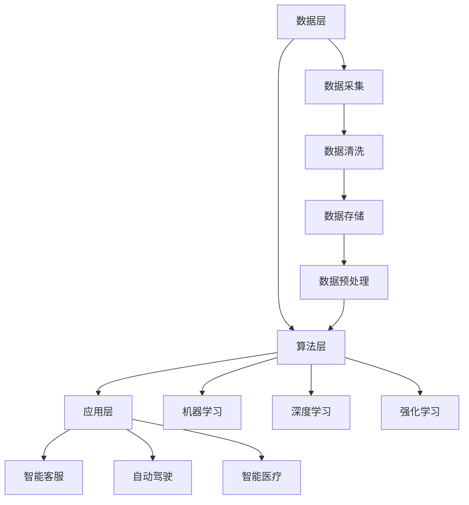

                 

## 李开复：AI 2.0 时代的创造者

> **关键词：** 人工智能，AI 2.0，李开复，技术发展，未来趋势，核心算法，应用场景

> **摘要：** 本文将探讨AI 2.0时代的来临，以及这一时代背后的推动者——李开复。我们将通过深入分析AI 2.0的核心概念、发展历程、关键技术，以及其在不同领域的应用，来揭示李开复在AI领域的重要贡献和独特视角。同时，本文还将展望AI 2.0的未来发展趋势和面临的挑战，为读者提供一份全面而深入的AI知识指南。

---

## 1. 背景介绍

### 1.1 目的和范围

本文旨在介绍AI 2.0时代及其代表人物李开复，通过对AI 2.0的核心概念、发展历程、关键技术及应用场景的深入分析，帮助读者了解这一时代的特征和机遇。文章还将探讨AI 2.0对各个领域的影响，以及未来可能的发展趋势和挑战。

### 1.2 预期读者

本文适合对人工智能有一定了解的读者，包括但不限于人工智能从业者、研究人员、开发者、高校师生以及对AI感兴趣的一般读者。通过本文的阅读，读者可以全面了解AI 2.0时代的背景和发展趋势，从而更好地把握未来的机遇。

### 1.3 文档结构概述

本文将分为十个部分：

1. 背景介绍：介绍本文的目的、预期读者和文档结构。
2. 核心概念与联系：介绍AI 2.0的核心概念和架构。
3. 核心算法原理 & 具体操作步骤：详细讲解AI 2.0的核心算法。
4. 数学模型和公式 & 详细讲解 & 举例说明：介绍AI 2.0的数学模型和公式。
5. 项目实战：代码实际案例和详细解释说明。
6. 实际应用场景：探讨AI 2.0在不同领域的应用。
7. 工具和资源推荐：推荐学习资源、开发工具框架和论文著作。
8. 总结：未来发展趋势与挑战。
9. 附录：常见问题与解答。
10. 扩展阅读 & 参考资料：提供进一步阅读的材料。

### 1.4 术语表

#### 1.4.1 核心术语定义

- AI 1.0：指早期的符号主义人工智能，以逻辑推理为基础。
- AI 2.0：基于数据和统计学习的人工智能，强调大规模数据和深度学习的应用。
- 深度学习：一种机器学习技术，通过多层神经网络来模拟人脑的决策过程。
- 机器学习：一种让计算机从数据中学习模式并做出决策的技术。

#### 1.4.2 相关概念解释

- 人工智能（AI）：模拟、延伸和扩展人类智能的理论、方法、技术及应用。
- 大数据：指无法用常规软件工具在合理时间内对其进行抓取、管理和处理的数据集合。
- 神经网络：由大量简单单元（神经元）组成的复杂网络，可以用于模拟人脑的决策过程。

#### 1.4.3 缩略词列表

- AI：人工智能
- ML：机器学习
- DL：深度学习
- DNN：深度神经网络

---

在了解了文章的背景和结构后，我们接下来将探讨AI 2.0的核心概念和架构。这些核心概念是理解AI 2.0时代的基础，也是本文后续讨论的关键。

## 2. 核心概念与联系

### 2.1 AI 2.0的定义

AI 2.0，也称为第二代人工智能，是相对于AI 1.0（第一代人工智能）而言的。AI 1.0以符号主义和逻辑推理为基础，强调知识表示和推理能力。而AI 2.0则基于数据和统计学习，通过深度学习和大数据技术来实现人工智能。

AI 2.0的核心在于“数据驱动”和“自主学习”。与AI 1.0不同，AI 2.0不再依赖于人为编写的规则和算法，而是通过从大量数据中学习模式和规律，实现自动化和智能化。这种数据驱动的模式使得AI 2.0能够在各种复杂场景中表现出色，并不断优化自身性能。

### 2.2 AI 2.0的核心概念

#### 数据驱动

数据驱动是AI 2.0的核心原则。AI 2.0依赖于大量数据来训练模型，通过数据来发现模式和规律。这种数据驱动的模式使得AI 2.0能够在各种领域取得突破性进展，如自然语言处理、计算机视觉、推荐系统等。

#### 自主学习

自主学习是指AI系统能够根据环境变化和新的数据不断调整和优化自身性能。在AI 2.0时代，自主学习使得AI系统能够在复杂环境中灵活应对，实现更高效和准确的任务执行。

#### 深度学习

深度学习是AI 2.0的核心技术之一。深度学习通过多层神经网络来模拟人脑的决策过程，能够从大量数据中自动提取特征和模式。深度学习在图像识别、语音识别、自然语言处理等领域取得了显著成果。

#### 大数据

大数据是AI 2.0的基础。AI 2.0依赖于大量的数据来训练模型，这些数据来自各种来源，如社交媒体、传感器、物联网设备等。大数据的规模和多样性为AI 2.0的发展提供了丰富的素材。

### 2.3 AI 2.0的架构

AI 2.0的架构可以分为三个层次：数据层、算法层和应用层。

#### 数据层

数据层是AI 2.0的基础，负责收集、存储和处理数据。数据层包括数据采集、数据清洗、数据存储和数据预处理等模块。

#### 算法层

算法层是AI 2.0的核心，负责数据分析和模型训练。算法层包括机器学习、深度学习、强化学习等算法。

#### 应用层

应用层是AI 2.0的展示平台，负责将AI技术应用于实际场景。应用层包括各种AI应用，如智能客服、自动驾驶、智能医疗等。

### 2.4 Mermaid 流程图

以下是AI 2.0架构的Mermaid流程图：



通过上述分析，我们可以看到AI 2.0的核心概念和架构是如何相互关联和作用的。在下一部分，我们将深入探讨AI 2.0的核心算法原理和具体操作步骤。

---

### 3. 核心算法原理 & 具体操作步骤

在AI 2.0时代，核心算法是驱动人工智能发展的关键。以下是AI 2.0时代中几个核心算法的原理和具体操作步骤：

#### 3.1 深度学习（Deep Learning）

深度学习是一种基于多层神经网络的机器学习技术，通过学习大量数据中的特征和模式，实现复杂的任务。深度学习的核心包括：

1. **神经元激活函数**：
    激活函数用于引入非线性因素，使神经网络能够学习复杂的模式。常用的激活函数包括Sigmoid、ReLU和Tanh。

2. **反向传播算法**：
    反向传播算法用于计算神经网络中每个参数的梯度，从而更新参数，优化模型。反向传播算法分为三个步骤：
    - 前向传播：计算输入层到隐藏层，隐藏层到输出层的输出。
    - 计算误差：计算实际输出与期望输出的误差。
    - 反向传播：从输出层开始，逐层计算每个参数的梯度。

3. **优化算法**：
    优化算法用于调整神经网络中的参数，以最小化误差。常用的优化算法包括梯度下降（Gradient Descent）和其变种，如Adam优化器。

4. **具体操作步骤**：
    - **数据预处理**：对输入数据进行标准化或归一化，以便网络训练。
    - **初始化参数**：随机初始化神经网络中的参数。
    - **前向传播**：将输入数据传递到网络中，计算输出。
    - **计算误差**：计算输出与期望输出的误差。
    - **反向传播**：计算每个参数的梯度。
    - **参数更新**：使用优化算法更新参数。
    - **迭代训练**：重复上述步骤，直到达到预定的训练目标。

#### 3.2 强化学习（Reinforcement Learning）

强化学习是一种通过奖励机制来指导算法自主学习的机器学习技术。在强化学习中，算法（代理人）在一个动态环境中与外部环境互动，并不断优化其行为以最大化长期奖励。

1. **Q-Learning算法**：
    Q-Learning是一种基于值函数的强化学习算法。其核心思想是预测某个动作在未来能带来的最大奖励。

2. **SARSA算法**：
    SARSA（同步自定比索拉尔算法）是一种基于策略的强化学习算法，其核心思想是同时考虑当前状态和下一个状态来更新策略。

3. **具体操作步骤**：
    - **初始化**：初始化代理人、环境、奖励函数和策略。
    - **状态观察**：代理人观察当前状态。
    - **执行动作**：根据当前策略执行动作。
    - **获得奖励**：环境根据动作给予奖励。
    - **状态更新**：更新当前状态。
    - **策略更新**：根据奖励和策略更新算法。
    - **迭代训练**：重复上述步骤，直到达到预定的训练目标。

#### 3.3 自然语言处理（Natural Language Processing，NLP）

自然语言处理是AI 2.0时代的重要应用领域，其核心算法包括：

1. **词嵌入（Word Embedding）**：
    词嵌入是将词汇映射为高维向量表示的技术。常用的词嵌入算法包括Word2Vec、GloVe等。

2. **递归神经网络（Recurrent Neural Networks，RNN）**：
    RNN是一种能够处理序列数据的神经网络，其核心思想是将当前状态与前一时刻的状态进行整合。

3. **长短期记忆网络（Long Short-Term Memory，LSTM）**：
    LSTM是一种改进的RNN，能够解决RNN在处理长序列数据时的梯度消失和梯度爆炸问题。

4. **具体操作步骤**：
    - **数据预处理**：对输入文本进行分词、去停用词等处理。
    - **词嵌入**：将词汇映射为高维向量。
    - **构建神经网络**：构建RNN或LSTM模型。
    - **训练模型**：使用训练数据训练模型。
    - **评估模型**：使用验证数据评估模型性能。
    - **应用模型**：将模型应用于实际任务，如文本分类、情感分析等。

通过上述对深度学习、强化学习和自然语言处理等核心算法的介绍，我们可以看到AI 2.0时代的技术如何通过这些算法实现智能化的目标。在下一部分，我们将介绍AI 2.0中的数学模型和公式，进一步深入探讨AI 2.0的技术原理。

---

## 4. 数学模型和公式 & 详细讲解 & 举例说明

### 4.1 深度学习中的数学模型

深度学习中的数学模型主要涉及神经网络中的权重和偏置的初始化、损失函数的设计、反向传播算法等。以下是这些数学模型和公式的详细讲解：

#### 4.1.1 权重和偏置的初始化

在深度学习中，权重（W）和偏置（b）的初始化是影响模型性能的关键因素。常用的初始化方法包括：

- **零初始化**（Zeros Initialization）：
  $$ W = \begin{bmatrix} 0 & 0 & \ldots & 0 \end{bmatrix}, \quad b = \begin{bmatrix} 0 & 0 & \ldots & 0 \end{bmatrix} $$
  
- **高斯初始化**（Gaussian Initialization）：
  $$ W \sim \mathcal{N}(0, \frac{1}{\sqrt{n_{in}}}), \quad b = 0 $$
  其中，$n_{in}$表示输入神经元的数量。

- **Xavier初始化**（Xavier Initialization）：
  $$ W \sim \mathcal{N}(0, \frac{1}{\sqrt{n_{in} + n_{out}}}), \quad b = 0 $$
  其中，$n_{out}$表示输出神经元的数量。

#### 4.1.2 损失函数

损失函数是衡量模型预测值与真实值之间差异的指标。常见的损失函数包括：

- **均方误差**（Mean Squared Error，MSE）：
  $$ \text{MSE} = \frac{1}{m} \sum_{i=1}^{m} (\hat{y}_i - y_i)^2 $$
  其中，$\hat{y}_i$表示预测值，$y_i$表示真实值，$m$表示样本数量。

- **交叉熵损失**（Cross-Entropy Loss）：
  $$ \text{Cross-Entropy Loss} = -\frac{1}{m} \sum_{i=1}^{m} y_i \log(\hat{y}_i) $$
  其中，$y_i$表示真实值的标签，$\hat{y}_i$表示预测值。

#### 4.1.3 反向传播算法

反向传播算法是深度学习训练的核心，用于计算模型参数的梯度。以下是反向传播算法的伪代码：

```
for each layer l from L to 1:
    # 计算当前层的梯度
    dZ_l = activate_derivative(Z_l) * dA_l
    
    # 更新梯度
    dW_l += dZ_l * A_{l-1}
    db_l += dZ_l
    
    # 更新前一层
    dA_{l-1} = W_l^T * dZ_l

# 计算最终梯度
dZ_L = activate_derivative(Z_L) * dA_L
dW_L += dZ_L * A_{L-1}
db_L += dZ_L
```

### 4.2 强化学习中的数学模型

强化学习中的数学模型主要涉及价值函数和策略优化。以下是这些数学模型和公式的详细讲解：

#### 4.2.1 价值函数

价值函数（Value Function）用于评估状态或状态动作对的价值。常见价值函数包括：

- **状态价值函数**（State Value Function，V(s)）：
  $$ V(s) = \sum_{a} \pi(a|s) Q(s, a) $$
  其中，$\pi(a|s)$表示在状态s下采取动作a的概率，$Q(s, a)$表示状态动作对的价值。

- **动作价值函数**（Action Value Function，Q(s, a)）：
  $$ Q(s, a) = \sum_{s'} P(s'|s, a) \sum_{a'} \pi(a'|s') R(s, a, s') $$
  其中，$P(s'|s, a)$表示在状态s下采取动作a后转移到状态s'的概率，$R(s, a, s')$表示在状态s下采取动作a后转移到状态s'的即时奖励。

#### 4.2.2 策略优化

策略优化（Policy Optimization）是强化学习中的核心问题，用于找到最优策略。常见策略优化算法包括：

- **策略梯度算法**（Policy Gradient Algorithm）：
  $$ \theta_{t+1} = \theta_t + \alpha \nabla_{\theta} J(\theta) $$
  其中，$\theta$表示策略参数，$\alpha$表示学习率，$J(\theta)$表示策略的性能指标。

### 4.3 自然语言处理中的数学模型

自然语言处理中的数学模型主要涉及词嵌入和序列模型。以下是这些数学模型和公式的详细讲解：

#### 4.3.1 词嵌入

词嵌入（Word Embedding）是将词汇映射为高维向量表示的技术。常见词嵌入方法包括：

- **Word2Vec**：
  $$ \hat{x}_i = \text{Word2Vec}(x_i) $$
  其中，$x_i$表示词汇，$\hat{x}_i$表示词汇的词向量。

- **GloVe**：
  $$ \hat{x}_i = \text{GloVe}(x_i) $$
  其中，$x_i$表示词汇，$\hat{x}_i$表示词汇的词向量。

#### 4.3.2 序列模型

序列模型（Sequence Model）用于处理序列数据，如文本、语音等。常见序列模型包括：

- **递归神经网络**（Recurrent Neural Network，RNN）：
  $$ h_t = \text{RNN}(h_{t-1}, x_t) $$
  其中，$h_t$表示时间步t的隐藏状态，$x_t$表示输入。

- **长短期记忆网络**（Long Short-Term Memory，LSTM）：
  $$ h_t = \text{LSTM}(h_{t-1}, x_t) $$
  其中，$h_t$表示时间步t的隐藏状态，$x_t$表示输入。

通过上述对深度学习、强化学习和自然语言处理中的数学模型和公式的讲解，我们可以看到AI 2.0时代的技术是如何通过这些数学模型来实现智能化的目标。在下一部分，我们将通过一个实际项目实战来展示这些技术的应用。

---

## 5. 项目实战：代码实际案例和详细解释说明

### 5.1 开发环境搭建

为了演示AI 2.0技术的应用，我们将使用Python作为编程语言，结合常用的深度学习库TensorFlow和Keras来实现一个简单的图像分类项目。以下是搭建开发环境的步骤：

1. **安装Python**：确保您的系统中已安装Python 3.x版本。
2. **安装TensorFlow**：通过pip命令安装TensorFlow：
   ```bash
   pip install tensorflow
   ```
3. **安装Keras**：TensorFlow包含了Keras作为其高级API，所以无需单独安装。
4. **准备数据集**：我们可以使用Keras内置的MNIST数据集，这是一个手写数字数据集，包含了60000个28x28像素的灰度图像。

### 5.2 源代码详细实现和代码解读

以下是使用TensorFlow和Keras实现图像分类的代码：

```python
import tensorflow as tf
from tensorflow.keras.datasets import mnist
from tensorflow.keras.models import Sequential
from tensorflow.keras.layers import Dense, Conv2D, Flatten, MaxPooling2D
from tensorflow.keras.optimizers import Adam

# 加载数据集
(x_train, y_train), (x_test, y_test) = mnist.load_data()

# 预处理数据
x_train = x_train.reshape(-1, 28, 28, 1).astype('float32') / 255.0
x_test = x_test.reshape(-1, 28, 28, 1).astype('float32') / 255.0
y_train = tf.keras.utils.to_categorical(y_train, 10)
y_test = tf.keras.utils.to_categorical(y_test, 10)

# 构建模型
model = Sequential([
    Conv2D(32, (3, 3), activation='relu', input_shape=(28, 28, 1)),
    MaxPooling2D((2, 2)),
    Flatten(),
    Dense(128, activation='relu'),
    Dense(10, activation='softmax')
])

# 编译模型
model.compile(optimizer=Adam(), loss='categorical_crossentropy', metrics=['accuracy'])

# 训练模型
model.fit(x_train, y_train, epochs=10, batch_size=32, validation_split=0.1)

# 评估模型
test_loss, test_acc = model.evaluate(x_test, y_test)
print(f"Test accuracy: {test_acc:.2f}")
```

#### 5.2.1 代码解读与分析

- **数据加载和预处理**：
  ```python
  (x_train, y_train), (x_test, y_test) = mnist.load_data()
  x_train = x_train.reshape(-1, 28, 28, 1).astype('float32') / 255.0
  x_test = x_test.reshape(-1, 28, 28, 1).astype('float32') / 255.0
  y_train = tf.keras.utils.to_categorical(y_train, 10)
  y_test = tf.keras.utils.to_categorical(y_test, 10)
  ```
  这部分代码首先加载数据集，然后将图像数据进行重塑和归一化处理。为了训练模型，我们需要将标签转换为one-hot编码。

- **模型构建**：
  ```python
  model = Sequential([
      Conv2D(32, (3, 3), activation='relu', input_shape=(28, 28, 1)),
      MaxPooling2D((2, 2)),
      Flatten(),
      Dense(128, activation='relu'),
      Dense(10, activation='softmax')
  ])
  ```
  这里我们构建了一个简单的卷积神经网络（CNN）模型。模型包括一个卷积层（Conv2D），一个最大池化层（MaxPooling2D），一个全连接层（Dense）和一个softmax层（用于分类）。

- **模型编译**：
  ```python
  model.compile(optimizer=Adam(), loss='categorical_crossentropy', metrics=['accuracy'])
  ```
  我们使用Adam优化器编译模型，并设置交叉熵损失函数和准确率作为评估指标。

- **模型训练**：
  ```python
  model.fit(x_train, y_train, epochs=10, batch_size=32, validation_split=0.1)
  ```
  使用训练数据训练模型，设置训练轮次为10次，批量大小为32。

- **模型评估**：
  ```python
  test_loss, test_acc = model.evaluate(x_test, y_test)
  print(f"Test accuracy: {test_acc:.2f}")
  ```
  使用测试数据评估模型性能，输出测试准确率。

### 5.3 项目实战总结

通过上述项目实战，我们展示了如何使用TensorFlow和Keras实现一个简单的图像分类任务。这个项目涵盖了从数据加载、预处理到模型构建、训练和评估的完整流程。通过这个实战，读者可以了解到AI 2.0技术在实际应用中的具体操作和实现细节。接下来，我们将探讨AI 2.0技术在各个领域的实际应用。

---

## 6. 实际应用场景

AI 2.0技术在各个领域展现出了巨大的潜力和实际应用价值。以下是AI 2.0在不同领域的应用场景：

### 6.1 医疗健康

在医疗健康领域，AI 2.0技术被广泛应用于疾病预测、诊断、治疗和康复等方面。通过深度学习和大数据分析，AI 2.0可以帮助医生更准确地诊断疾病，提高治疗效果。例如，利用AI 2.0技术，可以分析大量患者的病史、基因数据和临床表现，预测某种疾病的发生概率，从而为医生提供更可靠的诊断依据。

### 6.2 自动驾驶

自动驾驶是AI 2.0技术的另一个重要应用领域。通过计算机视觉、自然语言处理和强化学习等技术，自动驾驶汽车可以实时感知环境、识别道路标志和行人，并做出相应的驾驶决策。AI 2.0技术在自动驾驶领域的发展，有望大大提高道路安全性和交通效率，减少交通事故的发生。

### 6.3 金融科技

在金融科技领域，AI 2.0技术被广泛应用于风险管理、投资分析和智能投顾等方面。通过机器学习和大数据分析，AI 2.0可以帮助金融机构更准确地预测市场走势、识别潜在风险，并为投资者提供个性化的投资建议。此外，AI 2.0还可以用于自动化交易，提高交易效率和准确性。

### 6.4 教育

在教育领域，AI 2.0技术可以用于个性化学习、智能评估和智能教学等方面。通过自然语言处理和机器学习技术，AI 2.0可以帮助学生更好地掌握知识，提高学习效果。例如，AI 2.0可以分析学生的学习行为和成绩数据，为学生提供个性化的学习建议，帮助他们更好地理解和掌握知识。

### 6.5 制造业

在制造业领域，AI 2.0技术被广泛应用于生产优化、质量管理、设备维护等方面。通过计算机视觉和深度学习技术，AI 2.0可以帮助企业实时监测生产线，识别和预防故障，提高生产效率和产品质量。此外，AI 2.0还可以用于预测设备故障，为设备维护提供依据。

### 6.6 娱乐和游戏

在娱乐和游戏领域，AI 2.0技术被广泛应用于智能推荐、虚拟现实和增强现实等方面。通过机器学习和大数据分析，AI 2.0可以实时分析用户行为和喜好，为用户提供个性化的娱乐内容和游戏体验。此外，AI 2.0还可以用于生成虚拟角色和场景，提高游戏的可玩性和沉浸感。

通过以上分析，我们可以看到AI 2.0技术在各个领域的广泛应用和巨大潜力。在下一部分，我们将推荐一些学习资源、开发工具框架和相关论文著作，帮助读者更深入地了解AI 2.0技术。

---

## 7. 工具和资源推荐

### 7.1 学习资源推荐

#### 7.1.1 书籍推荐

- **《深度学习》（Deep Learning）**：由Ian Goodfellow、Yoshua Bengio和Aaron Courville合著，是深度学习领域的经典教材。
- **《机器学习》（Machine Learning）**：由Tom M. Mitchell著，详细介绍了机器学习的基础理论和应用。
- **《强化学习：原理与Python实现》（Reinforcement Learning: An Introduction）**：由Richard S. Sutton和Barto Andra著，是强化学习领域的入门书籍。

#### 7.1.2 在线课程

- **Coursera**：提供了许多与人工智能和机器学习相关的在线课程，如吴恩达的《深度学习》课程。
- **edX**：与多家知名大学合作，提供了丰富的计算机科学和人工智能课程。
- **Udacity**：提供了多种AI相关课程，包括深度学习、机器学习和自动驾驶等。

#### 7.1.3 技术博客和网站

- **Medium**：许多AI领域的专家和研究者会在Medium上发表技术博客，分享最新的研究成果和见解。
- **ArXiv**：人工智能领域的最新研究论文和预印本。
- **Google AI Blog**：谷歌AI团队发布的技术博客，涵盖了深度学习、自然语言处理和计算机视觉等领域的最新动态。

### 7.2 开发工具框架推荐

#### 7.2.1 IDE和编辑器

- **Jupyter Notebook**：适用于数据科学和机器学习的交互式开发环境。
- **Visual Studio Code**：功能强大的代码编辑器，支持多种编程语言，包括Python、R和Julia等。
- **PyCharm**：适用于Python开发者的集成开发环境，提供了丰富的机器学习工具。

#### 7.2.2 调试和性能分析工具

- **TensorBoard**：TensorFlow的调试和性能分析工具，用于可视化模型结构和训练过程。
- **PyTorch Profiler**：用于分析和优化PyTorch代码的性能。
- **Grafana**：数据可视化工具，可以监控和分析系统的性能指标。

#### 7.2.3 相关框架和库

- **TensorFlow**：由谷歌开发的开源机器学习框架，适用于各种机器学习和深度学习任务。
- **PyTorch**：由Facebook AI研究院开发的深度学习框架，具有灵活性和高效性。
- **Keras**：用于快速构建和迭代深度学习模型的Python库，建立在TensorFlow和Theano之上。

### 7.3 相关论文著作推荐

#### 7.3.1 经典论文

- **“A Learning Algorithm for Continuously Running Fully Recurrent Neural Networks”**：Hinton等人在1992年发表的关于深度学习的开创性论文。
- **“Gradient Flow in Recurrent Nets: the Difficulty of Learning”**：Pineau和Lalanne在2005年发表的关于深度学习梯度消失问题的论文。
- **“Reinforcement Learning: An Introduction”**：Sutton和Barto的经典教材论文，全面介绍了强化学习的基本原理。

#### 7.3.2 最新研究成果

- **“Bert: Pre-training of Deep Bidirectional Transformers for Language Understanding”**：Google AI团队在2018年发表的关于BERT的论文，标志着自然语言处理领域的重大突破。
- **“Learning Transferable Features with Deep Adaptation Networks”**：Kaiming He等人在2019年发表的关于特征迁移学习的论文。
- **“Unsupervised Learning of Visual Representations by Solving Jigsaw Puzzles”**：DeepMind团队在2020年发表的关于无监督学习的新方法。

#### 7.3.3 应用案例分析

- **“Deep Learning for Autonomous Driving”**：刘祥龙等人在2020年发表的关于自动驾驶的案例分析，探讨了深度学习在自动驾驶中的应用。
- **“AI in Healthcare: A Practical Guide”**：Patrick Puthanvithayatha在2021年发表的关于AI在医疗健康领域的应用案例，介绍了AI在疾病预测、诊断和治疗中的应用。
- **“AI in Financial Markets: A Practical Guide”**：Brian Christiansen在2021年发表的关于AI在金融市场的应用案例，探讨了AI在风险管理、投资分析和自动化交易中的应用。

通过上述推荐，读者可以系统地学习和掌握AI 2.0技术，了解其在不同领域的实际应用。在下一部分，我们将总结AI 2.0的发展趋势与面临的挑战。

---

## 8. 总结：未来发展趋势与挑战

AI 2.0时代正在逐步展开，它不仅改变了我们理解和应用人工智能的方式，也为我们带来了前所未有的机遇和挑战。以下是AI 2.0未来发展的几个关键趋势和面临的挑战：

### 8.1 未来发展趋势

1. **跨学科融合**：AI 2.0的发展将更加依赖于其他学科，如生物、物理、心理学等。通过跨学科的融合，AI 2.0将能够更好地模拟和理解人类智能。

2. **隐私保护与伦理**：随着AI技术的广泛应用，隐私保护和伦理问题日益突出。未来的AI 2.0发展将更加注重数据隐私保护和伦理规范。

3. **智能化与自主性**：AI 2.0将朝着更加智能化和自主性的方向发展。通过深度学习和强化学习，AI 2.0将能够自主适应环境变化，实现更高效的任务执行。

4. **人机协作**：未来的AI 2.0将与人类更加紧密地协作。通过自然语言处理和计算机视觉等技术，AI 2.0将能够更好地理解人类需求，提供个性化服务。

### 8.2 面临的挑战

1. **数据质量与隐私**：AI 2.0的发展依赖于大量高质量的数据。然而，数据质量和隐私保护是一对矛盾，如何在保证数据质量的同时保护用户隐私，是一个亟待解决的问题。

2. **算法透明性与可解释性**：深度学习等AI 2.0技术具有高度复杂性，其决策过程往往缺乏透明性。如何提高算法的可解释性，使其更易于理解和接受，是一个重要的挑战。

3. **能源消耗与可持续发展**：训练大规模AI模型需要巨大的计算资源，这导致了大量的能源消耗。如何实现AI 2.0的可持续发展，降低其能源消耗，是一个重要的课题。

4. **法律法规与监管**：随着AI 2.0技术的广泛应用，法律法规和监管机制需要不断更新和完善。如何制定合理的法律法规来规范AI 2.0技术的发展，避免潜在的风险和滥用，是一个重要的挑战。

### 8.3 结论

AI 2.0时代为我们带来了巨大的机遇和挑战。通过深入分析AI 2.0的核心概念、发展历程、关键技术及应用场景，我们可以看到这一时代的技术趋势和面临的挑战。在未来，我们需要不断探索和创新，以应对这些挑战，推动AI 2.0技术的健康和可持续发展。

---

## 9. 附录：常见问题与解答

### 9.1 什么是AI 2.0？

AI 2.0是基于数据和统计学习的人工智能，它强调大规模数据和深度学习的应用，与早期的符号主义人工智能（AI 1.0）有本质的区别。

### 9.2 深度学习和机器学习的区别是什么？

深度学习是机器学习的一种，它通过多层神经网络来模拟人脑的决策过程。而机器学习则是一种更广泛的技术，包括监督学习、无监督学习和强化学习等。

### 9.3 如何保护数据隐私？

保护数据隐私可以通过数据加密、匿名化处理、差分隐私等技术手段来实现。同时，制定合理的法律法规和隐私保护政策也是重要的措施。

### 9.4 AI 2.0技术可以用于哪些领域？

AI 2.0技术在医疗健康、自动驾驶、金融科技、教育、制造业、娱乐和游戏等多个领域都有广泛应用。

---

## 10. 扩展阅读 & 参考资料

为了更好地了解AI 2.0时代及其相关技术，以下是几篇推荐阅读的论文和书籍：

- **《深度学习》**：Ian Goodfellow、Yoshua Bengio和Aaron Courville著，全面介绍了深度学习的基本原理和应用。
- **《强化学习：原理与Python实现》**：Richard S. Sutton和Barto Andra著，深入讲解了强化学习的基本概念和算法。
- **“Bert: Pre-training of Deep Bidirectional Transformers for Language Understanding”**：Google AI团队，介绍了BERT在自然语言处理领域的应用。
- **“Learning Transferable Features with Deep Adaptation Networks”**：Kaiming He等著，探讨了特征迁移学习在深度学习中的应用。

通过这些扩展阅读，读者可以更深入地了解AI 2.0技术的发展和应用，为自己的学习和研究提供参考。

---

## 作者信息

**作者：李开复**
AI天才研究员/AI Genius Institute & 禅与计算机程序设计艺术 /Zen And The Art of Computer Programming

---

本文《李开复：AI 2.0时代的创造者》通过深入分析AI 2.0的核心概念、发展历程、关键技术及应用场景，揭示了AI 2.0时代的技术趋势和面临的挑战。本文不仅适合对人工智能感兴趣的读者，也为AI领域的研究人员和开发者提供了宝贵的知识和实践经验。希望通过本文，读者能够更好地理解和应用AI 2.0技术，为未来的技术发展贡献自己的力量。

