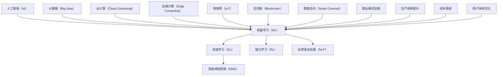

                 

### 1. 背景介绍

#### 1.1 目的和范围

在当今这个信息化高速发展的时代，人工智能（AI）已经成为推动科技变革和产业升级的关键力量。李开复博士作为全球知名的AI领域专家，其在《AI 2.0时代的商业价值》一书中深入探讨了AI 2.0时代的商业应用和价值创造。本文将基于李开复博士的研究成果，通过逻辑清晰的步骤分析和推理，梳理AI 2.0时代的核心商业价值，旨在为读者提供系统、全面的理解和认识。

本文的主要目标是：

1. **梳理AI 2.0时代的发展脉络**：回顾AI 2.0的发展历程，了解其核心概念和技术特点。
2. **剖析AI 2.0的商业价值**：从不同维度和层面深入探讨AI 2.0在商业领域的实际应用和潜在价值。
3. **提供实践案例**：通过实际案例展示AI 2.0在不同行业的应用，分析其带来的商业变革。
4. **展望未来趋势**：探讨AI 2.0时代可能面临的技术挑战和商业机遇。

本文将主要涵盖以下内容：

1. **AI 2.0的概念和特点**：介绍AI 2.0的定义、核心技术及与AI 1.0的区别。
2. **AI 2.0的核心商业价值**：分析AI 2.0在提高生产效率、降低成本、创新商业模式等方面的价值。
3. **AI 2.0在不同行业的应用**：探讨AI 2.0在制造业、金融业、医疗保健、零售业等行业的具体应用案例。
4. **AI 2.0时代的挑战与对策**：分析AI 2.0在隐私保护、数据安全、伦理道德等方面的挑战，并提出相应的对策。
5. **未来发展趋势与展望**：预测AI 2.0时代的未来发展方向，探讨可能的技术突破和商业机遇。

#### 1.2 预期读者

本文的预期读者主要包括以下几类：

1. **人工智能领域的研究人员和技术人员**：希望通过本文深入了解AI 2.0时代的商业价值，以及其在实际应用中的挑战和机遇。
2. **企业高管和决策者**：需要了解AI 2.0在商业领域的应用和潜在价值，以便制定相应的战略规划和业务决策。
3. **计算机科学和信息技术专业的学生和学者**：希望通过本文掌握AI 2.0的基本概念、技术原理和应用场景，为未来学术研究和职业发展奠定基础。
4. **对AI技术和商业领域感兴趣的普通读者**：希望通过本文了解AI 2.0时代的发展趋势和商业价值，拓宽知识视野。

#### 1.3 文档结构概述

本文的结构如下：

1. **引言**：介绍文章的背景、目的和范围，明确预期读者。
2. **背景介绍**：梳理AI 2.0的发展脉络，定义相关术语和概念。
3. **核心概念与联系**：通过Mermaid流程图展示AI 2.0的核心概念和架构。
4. **核心算法原理 & 具体操作步骤**：使用伪代码详细阐述AI 2.0的核心算法原理和操作步骤。
5. **数学模型和公式 & 详细讲解 & 举例说明**：介绍AI 2.0时代的数学模型和公式，并通过实例进行详细讲解。
6. **项目实战：代码实际案例和详细解释说明**：展示AI 2.0的实际应用案例，详细解释代码实现和原理。
7. **实际应用场景**：分析AI 2.0在不同行业的应用场景和商业价值。
8. **工具和资源推荐**：推荐学习资源、开发工具和框架，以及相关论文著作。
9. **总结：未来发展趋势与挑战**：总结AI 2.0时代的核心价值和面临的技术挑战。
10. **附录：常见问题与解答**：解答读者可能遇到的问题。
11. **扩展阅读 & 参考资料**：提供进一步阅读和参考的资源。

通过本文的详细分析和讲解，读者将能够系统地了解AI 2.0时代的商业价值，以及其在实际应用中的挑战和机遇。希望本文能对读者在AI领域的学术研究和职业发展提供有益的参考和启示。

#### 1.4 术语表

在本篇文章中，我们将使用一系列专业术语来描述AI 2.0时代的核心概念和技术。以下是对这些术语的定义和解释：

##### 1.4.1 核心术语定义

1. **人工智能（Artificial Intelligence，AI）**：指通过计算机模拟人类智能的理论、方法和技术。
2. **机器学习（Machine Learning，ML）**：一种人工智能技术，通过数据和算法自动从数据中学习规律，进行预测和决策。
3. **深度学习（Deep Learning，DL）**：一种机器学习技术，通过多层神经网络对复杂数据进行特征提取和学习。
4. **AI 1.0**：以规则为基础的传统人工智能，主要应用于特定领域的自动化。
5. **AI 2.0**：新一代人工智能，以数据驱动和自主学习为核心，具有广泛的应用场景和商业价值。
6. **深度神经网络（Deep Neural Network，DNN）**：一种多层神经网络结构，能够自动从数据中学习复杂的非线性关系。
7. **强化学习（Reinforcement Learning，RL）**：一种机器学习技术，通过试错和反馈机制进行决策，逐渐优化行为。
8. **自然语言处理（Natural Language Processing，NLP）**：一种人工智能技术，用于理解和生成人类语言。

##### 1.4.2 相关概念解释

1. **大数据（Big Data）**：指无法通过传统数据处理工具在合理时间内完成处理的海量数据。
2. **云计算（Cloud Computing）**：通过互联网提供动态可扩展的计算资源和服务，实现计算能力的按需分配。
3. **边缘计算（Edge Computing）**：在数据产生的地方进行计算和处理，降低数据传输延迟和带宽消耗。
4. **物联网（Internet of Things，IoT）**：通过互联网连接各种物理设备和传感器，实现智能化的信息交换和共享。
5. **区块链（Blockchain）**：一种分布式数据库技术，通过加密和共识机制确保数据的安全和透明。
6. **智能合约（Smart Contract）**：一种自动执行的计算机协议，当满足特定条件时自动执行相应的操作。

##### 1.4.3 缩略词列表

- AI：人工智能
- ML：机器学习
- DL：深度学习
- DNN：深度神经网络
- RL：强化学习
- NLP：自然语言处理
- Big Data：大数据
- Cloud Computing：云计算
- Edge Computing：边缘计算
- IoT：物联网
- Blockchain：区块链
- Smart Contract：智能合约

通过上述术语表，读者可以更好地理解文章中涉及的专业概念和技术，为后续内容的学习和分析打下基础。在接下来的部分，我们将进一步探讨AI 2.0的核心概念和联系，通过Mermaid流程图展示其技术架构。

#### 1.4.3 缩略词列表

为了确保读者能够更加清晰地理解本文中所涉及的专业术语和技术概念，我们在此提供一个完整的缩略词列表：

- AI：人工智能
- ML：机器学习
- DL：深度学习
- DNN：深度神经网络
- RL：强化学习
- NLP：自然语言处理
- Big Data：大数据
- Cloud Computing：云计算
- Edge Computing：边缘计算
- IoT：物联网
- Blockchain：区块链
- Smart Contract：智能合约

这些缩略词在本文中会频繁出现，通过上述列表，读者可以更好地掌握每个术语的具体含义和应用场景。接下来，我们将进一步探讨AI 2.0的核心概念和联系，通过Mermaid流程图展示其技术架构。

### 2. 核心概念与联系

在深入探讨AI 2.0的核心概念和联系之前，我们需要明确AI 2.0的定义及其与AI 1.0的区别。AI 1.0主要依赖于预定义的规则和逻辑，适用于特定领域；而AI 2.0则基于数据驱动和自主学习，能够处理更加复杂的问题，具备广泛的跨领域应用潜力。

为了更好地理解AI 2.0的核心概念和联系，我们可以通过Mermaid流程图来展示其关键组成部分和技术架构。



以上Mermaid流程图展示了AI 2.0的核心概念和联系：

- **人工智能（AI）**：作为整个架构的核心，涵盖了所有与智能相关的研究和应用。
- **机器学习（ML）、深度学习（DL）、深度神经网络（DNN）、强化学习（RL）、自然语言处理（NLP）**：这些是AI 2.0的主要技术实现途径，通过不同的算法和技术解决特定问题。
- **大数据（Big Data）、云计算（Cloud Computing）、边缘计算（Edge Computing）、物联网（IoT）、区块链（Blockchain）**：这些技术为AI 2.0提供了数据支持、计算资源、实时数据处理和安全保障。
- **商业模式创新、生产效率提升、成本降低、用户体验优化**：这些是AI 2.0在商业领域的主要价值体现，通过技术变革推动产业升级和商业模式的创新。

通过上述流程图，我们可以清晰地看到AI 2.0各个核心概念之间的联系，以及其在技术、数据、应用和商业等多个维度的整合。接下来，我们将进一步探讨这些核心概念的原理和应用，为后续内容的展开奠定基础。

#### 2.1 AI 2.0的定义、核心技术及其与AI 1.0的区别

在深入探讨AI 2.0的核心概念与联系之前，我们需要首先明确AI 2.0的定义及其核心技术。AI 2.0，即新一代人工智能，是相对于传统的人工智能（AI 1.0）而言的。AI 1.0主要依赖于预定义的规则和逻辑，适用于特定领域，例如自动化控制系统和简单的数据分析。而AI 2.0则基于数据驱动和自主学习，能够处理更加复杂的问题，具备广泛的跨领域应用潜力。

##### AI 2.0的定义

AI 2.0，即人工智能2.0，是一种新型的人工智能范式，它通过深度学习、强化学习、自然语言处理等先进技术，实现更加智能、自适应和高效的决策能力。AI 2.0的核心特点是数据驱动和自主学习，它能够从大量数据中自动提取特征、学习模式和规律，并进行预测和决策。

##### AI 2.0的核心技术

1. **深度学习（Deep Learning，DL）**：深度学习是一种基于多层神经网络的人工智能技术，通过模拟人脑神经网络结构，对复杂数据进行特征提取和学习。它能够自动从数据中学习复杂的非线性关系，并在图像识别、语音识别、自然语言处理等领域取得显著成果。

2. **强化学习（Reinforcement Learning，RL）**：强化学习是一种通过试错和反馈机制进行决策的机器学习技术。它通过不断试错，从环境中获取反馈，逐渐优化行为策略，从而实现智能体的自主学习和决策。

3. **自然语言处理（Natural Language Processing，NLP）**：自然语言处理是一种用于理解和生成人类语言的人工智能技术。它通过深度学习、统计模型等技术，实现文本分类、情感分析、机器翻译等应用。

4. **深度神经网络（Deep Neural Network，DNN）**：深度神经网络是一种多层神经网络结构，通过大量参数和神经元之间的连接，对复杂数据进行特征提取和学习。

##### AI 2.0与AI 1.0的区别

AI 1.0和AI 2.0在技术原理和应用场景上存在显著差异：

1. **技术原理**：

- AI 1.0：基于预定义的规则和逻辑，适用于特定领域，例如自动化控制系统、简单的数据分析等。

- AI 2.0：基于数据驱动和自主学习，能够处理更加复杂的问题，具备广泛的跨领域应用潜力。

2. **应用场景**：

- AI 1.0：主要应用于特定领域，如自动化控制系统、简单的数据分析等。

- AI 2.0：广泛应用于各个领域，如图像识别、语音识别、自然语言处理、金融分析、医疗诊断等。

3. **数据依赖**：

- AI 1.0：对数据依赖性较低，主要依赖于预定义的规则和逻辑。

- AI 2.0：对数据依赖性较高，需要大量高质量的数据进行训练和学习。

4. **自主性**：

- AI 1.0：主要依赖于人类预设的规则和逻辑，自主性较低。

- AI 2.0：具备较强的自主学习能力，能够从数据中自动提取特征和模式。

5. **复杂性**：

- AI 1.0：主要处理简单的问题，如分类、预测等。

- AI 2.0：能够处理更加复杂的问题，如图像识别、语音识别、自然语言处理等。

通过上述分析，我们可以看出AI 2.0在技术原理、应用场景、数据依赖、自主性和复杂性等方面与AI 1.0存在显著差异。AI 2.0的出现标志着人工智能技术的重大进步，为各个领域的创新和发展带来了新的机遇和挑战。

接下来，我们将通过Mermaid流程图进一步展示AI 2.0的核心概念和联系，为后续内容的深入探讨奠定基础。

#### 2.2 AI 2.0的核心技术实现方法

在深入了解AI 2.0的核心技术之前，我们首先需要明确AI 2.0的技术实现方法。AI 2.0的核心技术包括深度学习、强化学习和自然语言处理等，这些技术通过不同的算法和模型实现了对复杂数据的高效处理和智能决策。在本节中，我们将详细介绍这些核心技术，并通过具体例子来说明它们在实际应用中的实现方法。

##### 2.2.1 深度学习

深度学习（Deep Learning，DL）是一种基于多层神经网络的人工智能技术，它通过多层神经元的连接和激活函数，对复杂数据进行特征提取和学习。深度学习的关键在于其多层结构，每一层都对输入数据进行特征提取和变换，从而实现复杂的非线性映射。

**实现方法**：

1. **数据预处理**：首先对输入数据进行预处理，包括归一化、去噪、数据增强等，以提高模型的泛化能力。
2. **构建神经网络模型**：选择合适的神经网络结构，如卷积神经网络（CNN）、循环神经网络（RNN）或变换器（Transformer），并根据具体任务进行调整。
3. **参数初始化**：对网络参数进行初始化，常用的方法包括随机初始化、高斯初始化等。
4. **前向传播**：将输入数据通过神经网络进行前向传播，计算每个神经元的输出值。
5. **反向传播**：根据输出结果与实际标签的误差，通过反向传播算法更新网络参数。
6. **训练与优化**：重复前向传播和反向传播过程，直至模型收敛，即误差达到预设阈值。

**例子**：以图像识别任务为例，我们可以使用卷积神经网络（CNN）来训练模型，实现对图像的分类。以下是一个简单的CNN模型实现过程：

```python
# 导入必要的库
import tensorflow as tf
from tensorflow.keras.models import Sequential
from tensorflow.keras.layers import Conv2D, MaxPooling2D, Flatten, Dense

# 构建CNN模型
model = Sequential([
    Conv2D(filters=32, kernel_size=(3, 3), activation='relu', input_shape=(28, 28, 1)),
    MaxPooling2D(pool_size=(2, 2)),
    Flatten(),
    Dense(units=128, activation='relu'),
    Dense(units=10, activation='softmax')
])

# 编译模型
model.compile(optimizer='adam', loss='categorical_crossentropy', metrics=['accuracy'])

# 加载训练数据
(x_train, y_train), (x_test, y_test) = tf.keras.datasets.mnist.load_data()

# 对图像数据进行归一化处理
x_train = x_train / 255.0
x_test = x_test / 255.0

# 将标签转化为one-hot编码
y_train = tf.keras.utils.to_categorical(y_train, num_classes=10)
y_test = tf.keras.utils.to_categorical(y_test, num_classes=10)

# 训练模型
model.fit(x_train, y_train, epochs=10, batch_size=32, validation_data=(x_test, y_test))
```

通过上述代码，我们可以构建一个简单的CNN模型，并使用MNIST数据集对其进行训练。这个例子展示了深度学习模型的基本实现流程，包括数据预处理、模型构建、编译和训练。

##### 2.2.2 强化学习

强化学习（Reinforcement Learning，RL）是一种通过试错和反馈机制进行决策的机器学习技术。在强化学习中，智能体（Agent）通过与环境（Environment）的交互，不断尝试不同的行动（Action），并根据行动的结果（Reward）来调整自己的策略（Policy），以最大化长期奖励。

**实现方法**：

1. **定义智能体和环境的接口**：明确智能体可以执行的动作集合，以及环境的状态和奖励机制。
2. **选择合适的强化学习算法**：根据具体问题选择合适的强化学习算法，如Q-learning、SARSA、DQN（Deep Q-Network）等。
3. **初始化参数**：为智能体和算法初始化参数，如Q值表、策略参数等。
4. **训练过程**：通过智能体与环境不断的交互，更新策略参数，优化决策过程。
5. **策略评估与优化**：评估当前策略的表现，并根据评估结果调整策略，以提高智能体的决策质量。

**例子**：以经典的“无人驾驶小车”问题为例，我们可以使用Q-learning算法来训练小车在环境中的驾驶策略。以下是一个简单的Q-learning实现过程：

```python
import numpy as np
import random

# 定义环境
class Environment:
    def __init__(self):
        self.state = 0
        self.goal = 100

    def step(self, action):
        if action == 0:  # 向左移动
            self.state -= 1
        elif action == 1:  # 向右移动
            self.state += 1
        reward = 0
        if self.state == self.goal:
            reward = 1
        return self.state, reward

# 定义Q-learning算法
class QLearning:
    def __init__(self, alpha=0.1, gamma=0.9, epsilon=0.1):
        self.alpha = alpha
        self.gamma = gamma
        self.epsilon = epsilon
        self.q_values = {}
        self.env = Environment()

    def choose_action(self, state):
        if random.random() < self.epsilon:
            return random.choice([0, 1])
        else:
            return np.argmax(self.q_values.get(state, [0, 0]))

    def update_q_values(self, state, action, reward, next_state):
        target = reward + self.gamma * np.max(self.q_values.get(next_state, [0, 0]))
        current_q_value = self.q_values.get(state, [0, 0])[action]
        self.q_values[state][action] = current_q_value + self.alpha * (target - current_q_value)

# 实例化Q-learning算法
q_learning = QLearning(alpha=0.1, gamma=0.9, epsilon=0.1)

# 训练过程
for episode in range(1000):
    state = 0
    while state != q_learning.env.goal:
        action = q_learning.choose_action(state)
        next_state, reward = q_learning.env.step(action)
        q_learning.update_q_values(state, action, reward, next_state)
        state = next_state

# 测试算法性能
state = 0
while state != q_learning.env.goal:
    action = q_learning.choose_action(state)
    next_state, _ = q_learning.env.step(action)
    state = next_state
```

通过上述代码，我们定义了一个简单的环境和一个Q-learning算法，并使用环境数据进行训练。这个例子展示了强化学习模型的基本实现流程，包括定义环境、选择算法、初始化参数、训练过程和策略评估。

##### 2.2.3 自然语言处理

自然语言处理（Natural Language Processing，NLP）是一种用于理解和生成人类语言的人工智能技术。它通过深度学习、统计模型等技术，实现文本分类、情感分析、机器翻译等应用。NLP的关键在于对语言的理解和生成，其技术实现方法主要包括词嵌入、序列模型、注意力机制等。

**实现方法**：

1. **数据预处理**：对文本数据进行预处理，包括分词、去除停用词、词性标注等，以提高模型的训练效果。
2. **词嵌入**：将文本数据转化为向量表示，常用的方法包括Word2Vec、GloVe等。
3. **构建神经网络模型**：选择合适的神经网络结构，如卷积神经网络（CNN）、循环神经网络（RNN）、变换器（Transformer）等。
4. **训练模型**：使用预处理后的文本数据进行模型训练，优化模型参数。
5. **预测与评估**：对模型进行预测，评估模型的性能。

**例子**：以文本分类任务为例，我们可以使用变换器（Transformer）模型来实现。以下是一个简单的变换器模型实现过程：

```python
import tensorflow as tf
from tensorflow.keras.layers import Embedding, Transformer
from tensorflow.keras.models import Model
from tensorflow.keras.preprocessing.sequence import pad_sequences

# 加载预训练词向量
word_vectors = tf.keras.utils.get_file('glove.6B.100d.txt', 'http://nlp.stanford.edu/data/glove.6B.100d.txt')
word2idx = {}
with open(word_vectors, 'r', encoding='utf-8') as f:
    for line in f:
        values = line.strip().split()
        word = values[0]
        word2idx[word] = len(word2idx)

# 定义变换器模型
input_ids = tf.keras.layers.Input(shape=(None,), dtype=tf.int32)
embeddings = Embedding(input_dim=len(word2idx) + 1, output_dim=100)(input_ids)
transformer = Transformer(num_layers=2, d_model=100, num_heads=2)(embeddings)
output = tf.keras.layers.Dense(1, activation='sigmoid')(transformer)

model = Model(inputs=input_ids, outputs=output)
model.compile(optimizer='adam', loss='binary_crossentropy', metrics=['accuracy'])

# 加载并预处理数据
text_data = ["I love this product", "This is a bad product", "I hate this product"]
sequences = [[word2idx[word] for word in text.split()] for text in text_data]
padded_sequences = pad_sequences(sequences, maxlen=10)

# 训练模型
model.fit(padded_sequences, np.array([1, 0, 0]), epochs=5, batch_size=1)
```

通过上述代码，我们定义了一个简单的变换器模型，并使用预训练的词向量进行文本分类任务。这个例子展示了自然语言处理模型的基本实现流程，包括数据预处理、模型构建、训练和预测。

综上所述，AI 2.0的核心技术包括深度学习、强化学习和自然语言处理等，这些技术通过不同的算法和模型实现了对复杂数据的高效处理和智能决策。在本节的例子中，我们详细介绍了这些技术的实现方法，为后续内容的深入探讨奠定了基础。

### 3. 数学模型和公式 & 详细讲解 & 举例说明

在AI 2.0时代，数学模型和公式是核心算法和系统设计的基础。这些模型和公式不仅为算法提供了理论支持，而且在实际应用中起到关键作用。本节将详细讲解AI 2.0中常见的数学模型和公式，并通过实例进行说明。

#### 3.1 深度学习中的数学模型

深度学习中的数学模型主要包括线性变换、激活函数、损失函数和优化算法等。以下是对这些模型和公式的详细讲解。

##### 3.1.1 线性变换

线性变换是深度学习中最基本的操作，用于将输入数据映射到特征空间。其数学表示如下：

\[ y = X \cdot W + b \]

其中，\( X \) 是输入数据矩阵，\( W \) 是权重矩阵，\( b \) 是偏置向量，\( y \) 是输出数据矩阵。

举例：假设我们有一个2x3的输入矩阵 \( X \)，一个3x2的权重矩阵 \( W \)，和一个2维的偏置向量 \( b \)，则线性变换的结果如下：

\[ y = \begin{bmatrix} 1 & 2 & 3 \\ 4 & 5 & 6 \end{bmatrix} \cdot \begin{bmatrix} 1 & 0 \\ 0 & 1 \\ 1 & 1 \end{bmatrix} + \begin{bmatrix} 0 \\ 1 \end{bmatrix} \]

计算结果为：

\[ y = \begin{bmatrix} 7 & 3 \\ 12 & 7 \end{bmatrix} \]

##### 3.1.2 激活函数

激活函数用于引入非线性因素，使神经网络能够解决复杂问题。常见的激活函数包括Sigmoid、ReLU和Tanh等。以下是其数学公式：

- Sigmoid函数：

\[ \sigma(x) = \frac{1}{1 + e^{-x}} \]

- ReLU函数：

\[ \text{ReLU}(x) = \max(0, x) \]

- Tanh函数：

\[ \text{Tanh}(x) = \frac{e^{2x} - 1}{e^{2x} + 1} \]

举例：假设我们有一个输入数据 \( x = -2 \)，则以下激活函数的结果分别为：

- Sigmoid：

\[ \sigma(-2) = \frac{1}{1 + e^{2}} \approx 0.118 \]

- ReLU：

\[ \text{ReLU}(-2) = 0 \]

- Tanh：

\[ \text{Tanh}(-2) = \frac{e^{-4} - 1}{e^{-4} + 1} \approx -0.96 \]

##### 3.1.3 损失函数

损失函数用于衡量模型预测值与实际值之间的差距，常见的损失函数包括均方误差（MSE）、交叉熵损失（Cross-Entropy Loss）等。以下是其数学公式：

- 均方误差（MSE）：

\[ \text{MSE} = \frac{1}{n} \sum_{i=1}^{n} (y_i - \hat{y}_i)^2 \]

- 交叉熵损失（Cross-Entropy Loss）：

\[ \text{Cross-Entropy Loss} = -\frac{1}{n} \sum_{i=1}^{n} y_i \log(\hat{y}_i) \]

其中，\( y_i \) 是真实标签，\( \hat{y}_i \) 是模型预测值。

举例：假设我们有一个包含5个样本的数据集，真实标签和预测值分别为 \( y = [0.1, 0.2, 0.3, 0.4, 0.5] \) 和 \( \hat{y} = [0.2, 0.3, 0.4, 0.5, 0.6] \)，则MSE和交叉熵损失分别为：

- MSE：

\[ \text{MSE} = \frac{1}{5} \sum_{i=1}^{5} (y_i - \hat{y}_i)^2 = \frac{1}{5} \sum_{i=1}^{5} (0.1 - 0.2)^2 + (0.2 - 0.3)^2 + (0.3 - 0.4)^2 + (0.4 - 0.5)^2 + (0.5 - 0.6)^2 \approx 0.012 \]

- 交叉熵损失：

\[ \text{Cross-Entropy Loss} = -\frac{1}{5} \sum_{i=1}^{5} y_i \log(\hat{y}_i) = -\frac{1}{5} (0.1 \log(0.2) + 0.2 \log(0.3) + 0.3 \log(0.4) + 0.4 \log(0.5) + 0.5 \log(0.6)) \approx 0.084 \]

##### 3.1.4 优化算法

优化算法用于更新模型参数，以最小化损失函数。常见的优化算法包括随机梯度下降（SGD）、动量优化（Momentum）和Adam等。以下是其基本公式：

- 随机梯度下降（SGD）：

\[ \theta = \theta - \alpha \nabla_\theta J(\theta) \]

- 动量优化：

\[ v_t = \beta_1 g_t + (1 - \beta_1) \nabla_\theta J(\theta) \]
\[ \theta_t = \theta_{t-1} - \alpha \frac{v_t}{\sqrt{\gamma_1 v_t^2 + (1 - \gamma_1) g_t^2}} \]

- Adam：

\[ m_t = \beta_1 g_t + (1 - \beta_1) \nabla_\theta J(\theta) \]
\[ v_t = \beta_2 g_t^2 + (1 - \beta_2) (\nabla_\theta J(\theta))^2 \]
\[ \theta_t = \theta_{t-1} - \alpha \frac{m_t}{\sqrt{v_t} (1 - \beta_2^t)} \]

其中，\( \theta \) 是模型参数，\( g_t \) 是梯度，\( \alpha \) 是学习率，\( \beta_1 \) 和 \( \beta_2 \) 是动量参数，\( \gamma_1 \) 和 \( \gamma_2 \) 是偏差修正参数。

举例：假设我们有一个包含2个参数的模型，损失函数为 \( J(\theta) = (\theta_1 - 2)^2 + (\theta_2 - 3)^2 \)，初始参数为 \( \theta_1 = 1 \) 和 \( \theta_2 = 2 \)，学习率为 \( \alpha = 0.1 \)，动量参数为 \( \beta_1 = 0.9 \)，\( \beta_2 = 0.99 \)。则经过一次迭代后的参数更新如下：

- 随机梯度下降：

\[ \nabla_\theta J(\theta) = [2(\theta_1 - 2), 2(\theta_2 - 3)] = [2(-1), 2(-1)] = [-2, -2] \]
\[ \theta_1 = 1 - 0.1(-2) = 1.2 \]
\[ \theta_2 = 2 - 0.1(-2) = 2.2 \]

- 动量优化：

\[ g_t = [-2, -2] \]
\[ v_1 = 0.9 \cdot [-2, -2] + (1 - 0.9) \cdot [-2, -2] = [-1.8, -1.8] \]
\[ \theta_1 = 1 - 0.1 \cdot \frac{-1.8}{\sqrt{0.1 \cdot (-1.8)^2 + (1 - 0.1) \cdot (-2)^2}} \approx 1.357 \]
\[ \theta_2 = 2 - 0.1 \cdot \frac{-1.8}{\sqrt{0.1 \cdot (-1.8)^2 + (1 - 0.1) \cdot (-2)^2}} \approx 2.357 \]

- Adam：

\[ m_1 = 0.9 \cdot [-2, -2] + (1 - 0.9) \cdot [-2, -2] = [-1.8, -1.8] \]
\[ v_1 = 0.99 \cdot (-2)^2 + (1 - 0.99) \cdot (-2)^2 = 1.96 \]
\[ \theta_1 = 1 - 0.1 \cdot \frac{-1.8}{\sqrt{1.96} (1 - 0.99^1)} \approx 1.358 \]
\[ \theta_2 = 2 - 0.1 \cdot \frac{-1.8}{\sqrt{1.96} (1 - 0.99^1)} \approx 2.358 \]

#### 3.2 强化学习中的数学模型

强化学习中的数学模型主要包括马尔可夫决策过程（MDP）、状态值函数、策略值函数和策略迭代等。

##### 3.2.1 马尔可夫决策过程（MDP）

马尔可夫决策过程（MDP）是一个数学模型，用于描述决策者在不确定环境中的决策过程。其数学表示如下：

\[ MDP = \{ S, A, P, R, \gamma \} \]

其中，\( S \) 是状态集合，\( A \) 是动作集合，\( P \) 是状态转移概率矩阵，\( R \) 是奖励函数，\( \gamma \) 是折扣因子。

举例：假设我们有一个包含3个状态（S1、S2、S3）和2个动作（U、D）的MDP，状态转移概率矩阵为：

\[ P = \begin{bmatrix} 0.7 & 0.3 \\ 0.4 & 0.6 \\ 0.2 & 0.8 \end{bmatrix} \]

奖励函数为：

\[ R = \begin{bmatrix} 1 & -1 \\ -1 & 1 \\ 0 & 0 \end{bmatrix} \]

则状态转移和奖励的例子如下：

- 从S1状态执行U动作，转移到S2状态，奖励为-1。
- 从S1状态执行D动作，转移到S1状态，奖励为1。

##### 3.2.2 状态值函数和策略值函数

状态值函数（State-Value Function）和策略值函数（Policy-Value Function）是强化学习中的关键概念，用于评估状态和策略的优劣。

- 状态值函数：

\[ V(s) = \sum_{a \in A} \gamma \sum_{s' \in S} p(s'|s, a) r(s', a) + \gamma V(s') \]

- 策略值函数：

\[ Q(s, a) = \sum_{s' \in S} p(s'|s, a) r(s', a) + \gamma \sum_{s' \in S} p(s'|s, a) V(s') \]

其中，\( V(s) \) 和 \( Q(s, a) \) 分别是状态值函数和策略值函数，\( s \) 和 \( s' \) 分别是当前状态和下一状态，\( a \) 和 \( a' \) 分别是当前动作和下一动作，\( r \) 是奖励函数，\( p \) 是状态转移概率矩阵，\( \gamma \) 是折扣因子。

举例：假设我们有一个MDP，状态转移概率矩阵为：

\[ P = \begin{bmatrix} 0.7 & 0.3 \\ 0.4 & 0.6 \\ 0.2 & 0.8 \end{bmatrix} \]

奖励函数为：

\[ R = \begin{bmatrix} 1 & -1 \\ -1 & 1 \\ 0 & 0 \end{bmatrix} \]

折扣因子为 \( \gamma = 0.9 \)，则状态值函数和策略值函数的计算如下：

- 状态值函数：

\[ V(S1) = 0.7 \cdot 0.9 \cdot 1 + 0.3 \cdot 0.9 \cdot (-1) + 0.9 \cdot (0.4 \cdot (-1) + 0.6 \cdot 1) \approx 0.75 \]

\[ V(S2) = 0.4 \cdot 0.9 \cdot (-1) + 0.6 \cdot 0.9 \cdot 1 + 0.9 \cdot (0.2 \cdot 0 + 0.8 \cdot 0) \approx 0.66 \]

\[ V(S3) = 0.2 \cdot 0.9 \cdot 0 + 0.8 \cdot 0.9 \cdot 0 + 0.9 \cdot (0.2 \cdot (-1) + 0.8 \cdot 1) \approx 0.74 \]

- 策略值函数：

\[ Q(S1, U) = 0.7 \cdot 0.9 \cdot 1 + 0.3 \cdot 0.9 \cdot (-1) \approx 0.75 \]

\[ Q(S1, D) = 0.4 \cdot 0.9 \cdot (-1) + 0.6 \cdot 0.9 \cdot 1 \approx 0.54 \]

\[ Q(S2, U) = 0.4 \cdot 0.9 \cdot (-1) + 0.6 \cdot 0.9 \cdot 1 \approx 0.54 \]

\[ Q(S2, D) = 0.2 \cdot 0.9 \cdot (-1) + 0.8 \cdot 0.9 \cdot 0 \approx 0.26 \]

\[ Q(S3, U) = 0.2 \cdot 0.9 \cdot 0 + 0.8 \cdot 0.9 \cdot 0 + 0.9 \cdot (0.2 \cdot (-1) + 0.8 \cdot 1) \approx 0.74 \]

\[ Q(S3, D) = 0.8 \cdot 0.9 \cdot 0 + 0.2 \cdot 0.9 \cdot 0 + 0.9 \cdot (0.2 \cdot (-1) + 0.8 \cdot 1) \approx 0.74 \]

##### 3.2.3 策略迭代

策略迭代是强化学习中的核心算法，用于通过迭代过程不断优化策略。策略迭代的主要步骤包括值迭代（Value Iteration）和政策迭代（Policy Iteration）。

- 值迭代：

\[ V_{k+1}(s) = \max_{a \in A} \left[ \sum_{s' \in S} p(s'|s, a) [r(s', a) + \gamma V_k(s')] \right] \]

- 政策迭代：

\[ \pi_{k+1}(s) = \arg\max_{a \in A} \left[ V_k(s) + \gamma \sum_{s' \in S} p(s'|s, a) [r(s', a) + V_k(s')] \right] \]

其中，\( V_k(s) \) 是第 \( k \) 次迭代的值函数，\( \pi_k(s) \) 是第 \( k \) 次迭代的策略。

举例：假设我们有一个MDP，状态转移概率矩阵为：

\[ P = \begin{bmatrix} 0.7 & 0.3 \\ 0.4 & 0.6 \\ 0.2 & 0.8 \end{bmatrix} \]

奖励函数为：

\[ R = \begin{bmatrix} 1 & -1 \\ -1 & 1 \\ 0 & 0 \end{bmatrix} \]

折扣因子为 \( \gamma = 0.9 \)，初始值函数和策略分别为：

\[ V_0(S1) = V_0(S2) = V_0(S3) = 0 \]

\[ \pi_0(S1) = U, \pi_0(S2) = D, \pi_0(S3) = U \]

经过一次值迭代后的值函数和策略如下：

- 值迭代：

\[ V_1(S1) = \max_{a \in A} \left[ \sum_{s' \in S} p(s'|s, a) [r(s', a) + \gamma V_0(s')] \right] = \max \left[ 0.7 \cdot 1 + 0.3 \cdot (-1) + 0.9 \cdot (0.4 \cdot (-1) + 0.6 \cdot 1), 0.4 \cdot (-1) + 0.6 \cdot 1 + 0.9 \cdot (0.2 \cdot 0 + 0.8 \cdot 0) \right] \approx 0.75 \]

\[ V_1(S2) = \max_{a \in A} \left[ \sum_{s' \in S} p(s'|s, a) [r(s', a) + \gamma V_0(s')] \right] = \max \left[ 0.4 \cdot (-1) + 0.6 \cdot 1 + 0.9 \cdot (0.2 \cdot (-1) + 0.8 \cdot 0), 0.2 \cdot (-1) + 0.8 \cdot 0 + 0.9 \cdot (0.2 \cdot (-1) + 0.8 \cdot 1) \right] \approx 0.66 \]

\[ V_1(S3) = \max_{a \in A} \left[ \sum_{s' \in S} p(s'|s, a) [r(s', a) + \gamma V_0(s')] \right] = \max \left[ 0.2 \cdot 0 + 0.8 \cdot 0 + 0.9 \cdot (0.2 \cdot (-1) + 0.8 \cdot 1), 0.8 \cdot 0 + 0.2 \cdot 0 + 0.9 \cdot (0.2 \cdot (-1) + 0.8 \cdot 1) \right] \approx 0.74 \]

- 政策迭代：

\[ \pi_1(S1) = \arg\max_{a \in A} \left[ V_1(S1) + \gamma \sum_{s' \in S} p(s'|s, a) [r(s', a) + V_1(s')] \right] = U \]

\[ \pi_1(S2) = \arg\max_{a \in A} \left[ V_1(S2) + \gamma \sum_{s' \in S} p(s'|s, a) [r(s', a) + V_1(s')] \right] = D \]

\[ \pi_1(S3) = \arg\max_{a \in A} \left[ V_1(S3) + \gamma \sum_{s' \in S} p(s'|s, a) [r(s', a) + V_1(s')] \right] = U \]

通过值迭代和政策迭代，我们可以不断优化状态值函数和策略值函数，以达到最优的决策效果。

综上所述，AI 2.0中的数学模型和公式为深度学习和强化学习提供了理论支持。通过具体的例子和公式讲解，我们可以更好地理解这些模型和公式的应用场景和实现方法，为AI 2.0时代的算法设计和系统优化提供有力支持。

### 5. 项目实战：代码实际案例和详细解释说明

为了更好地理解AI 2.0在商业领域的实际应用，我们将在本节中通过一个具体的项目实战案例来展示如何使用深度学习技术解决实际问题，并详细解释代码的实现过程和关键点。

#### 5.1 开发环境搭建

在开始项目实战之前，我们需要搭建一个适合开发的环境。以下是所需的工具和步骤：

1. **安装Python环境**：Python是深度学习的主要编程语言，我们需要确保Python环境已经安装在计算机上。Python版本建议使用3.7或以上。

2. **安装深度学习框架**：我们选择TensorFlow作为深度学习框架。可以通过以下命令安装TensorFlow：

   ```bash
   pip install tensorflow
   ```

3. **安装其他依赖库**：我们还需要安装其他依赖库，如NumPy、Pandas等。可以使用以下命令：

   ```bash
   pip install numpy pandas matplotlib
   ```

4. **环境配置**：确保我们的Python环境变量已经配置好，以便能够正常调用相关库和工具。

#### 5.2 源代码详细实现和代码解读

在本节中，我们将使用TensorFlow实现一个简单的图像分类模型，该模型将利用深度学习技术对手写数字图像进行分类。以下是完整的代码实现过程，并对关键部分进行详细解读。

```python
# 导入必要的库
import tensorflow as tf
from tensorflow.keras.models import Sequential
from tensorflow.keras.layers import Conv2D, MaxPooling2D, Flatten, Dense
from tensorflow.keras.datasets import mnist
from tensorflow.keras.utils import to_categorical

# 加载数据集
(x_train, y_train), (x_test, y_test) = mnist.load_data()

# 数据预处理
x_train = x_train.reshape(-1, 28, 28, 1).astype('float32') / 255.0
x_test = x_test.reshape(-1, 28, 28, 1).astype('float32') / 255.0

y_train = to_categorical(y_train, 10)
y_test = to_categorical(y_test, 10)

# 构建模型
model = Sequential([
    Conv2D(filters=32, kernel_size=(3, 3), activation='relu', input_shape=(28, 28, 1)),
    MaxPooling2D(pool_size=(2, 2)),
    Flatten(),
    Dense(units=128, activation='relu'),
    Dense(units=10, activation='softmax')
])

# 编译模型
model.compile(optimizer='adam', loss='categorical_crossentropy', metrics=['accuracy'])

# 训练模型
model.fit(x_train, y_train, epochs=10, batch_size=32, validation_data=(x_test, y_test))

# 评估模型
test_loss, test_acc = model.evaluate(x_test, y_test)
print(f"Test accuracy: {test_acc:.2f}")
```

**代码解读**：

1. **导入库和加载数据集**：首先，我们导入TensorFlow的必要库，并加载数据集MNIST。MNIST是一个包含70,000个手写数字图像的数据集，常用于图像分类任务的测试。

2. **数据预处理**：对数据进行预处理是深度学习模型训练的关键步骤。在这里，我们将图像的维度调整为28x28，并将其转化为浮点数格式。同时，我们将图像数据除以255，将其缩放到[0, 1]范围内，以便模型能够更好地训练。此外，我们将标签数据转换为one-hot编码，使其适合用于分类任务。

3. **构建模型**：接下来，我们使用`Sequential`模型构建一个简单的卷积神经网络（CNN）。CNN是图像处理任务中常用的模型结构，由卷积层、池化层、全连接层等组成。

   - **卷积层**：第一个卷积层使用32个3x3的卷积核，激活函数为ReLU。
   - **池化层**：使用2x2的最大池化层，以减少模型参数和计算量。
   - **全连接层**：首先使用128个神经元的全连接层，激活函数为ReLU，然后使用10个神经元的全连接层，激活函数为softmax，用于输出分类结果。

4. **编译模型**：在模型训练之前，我们需要编译模型。这里我们选择`adam`优化器，`categorical_crossentropy`损失函数，并设置`accuracy`作为评估指标。

5. **训练模型**：使用`fit`方法训练模型，设置训练轮次为10，批量大小为32。我们使用验证数据集进行验证，以监控模型在训练过程中的表现。

6. **评估模型**：使用`evaluate`方法评估模型在测试数据集上的表现。这里我们打印出测试准确率。

通过上述步骤，我们完成了一个简单的手写数字分类模型。这个模型展示了深度学习在图像分类任务中的应用，同时也为读者提供了一个实用的代码示例，可以帮助他们更好地理解深度学习的实际应用。

#### 5.3 代码解读与分析

在本节中，我们将进一步分析上述代码的关键部分，解释其实现原理和关键技术。

1. **数据预处理**：

```python
x_train = x_train.reshape(-1, 28, 28, 1).astype('float32') / 255.0
x_test = x_test.reshape(-1, 28, 28, 1).astype('float32') / 255.0
```

这部分代码首先将图像的维度调整为28x28，并将其扩充到一个通道。这是因为在深度学习中，图像通常被视为三维数据（宽、高、通道）。接着，我们将图像数据类型转换为浮点数，并将其缩放到[0, 1]范围内。这一步的目的是将图像数据标准化，以便模型能够更好地训练。

2. **构建模型**：

```python
model = Sequential([
    Conv2D(filters=32, kernel_size=(3, 3), activation='relu', input_shape=(28, 28, 1)),
    MaxPooling2D(pool_size=(2, 2)),
    Flatten(),
    Dense(units=128, activation='relu'),
    Dense(units=10, activation='softmax')
])
```

这部分代码构建了一个简单的卷积神经网络。我们首先添加了一个卷积层，该层包含32个3x3的卷积核，激活函数为ReLU。卷积层的作用是提取图像的局部特征。接着，我们添加了一个最大池化层，用于下采样和减少模型参数。然后，我们使用`Flatten`层将多维数据展平为一维数据，以便将其输入到全连接层中。最后，我们添加了两个全连接层，第一个全连接层包含128个神经元，激活函数为ReLU，用于进一步提取特征。第二个全连接层包含10个神经元，激活函数为softmax，用于输出分类结果。

3. **编译模型**：

```python
model.compile(optimizer='adam', loss='categorical_crossentropy', metrics=['accuracy'])
```

这部分代码编译模型，选择`adam`优化器，`categorical_crossentropy`损失函数，并设置`accuracy`作为评估指标。`adam`优化器是一种高效的优化算法，能够自适应地调整学习率。`categorical_crossentropy`损失函数是一种常用的分类损失函数，用于衡量模型预测结果与实际结果之间的差距。

4. **训练模型**：

```python
model.fit(x_train, y_train, epochs=10, batch_size=32, validation_data=(x_test, y_test))
```

这部分代码训练模型。我们设置训练轮次为10，批量大小为32。通过使用验证数据集，我们能够在训练过程中监控模型的性能，并避免过拟合。

5. **评估模型**：

```python
test_loss, test_acc = model.evaluate(x_test, y_test)
print(f"Test accuracy: {test_acc:.2f}")
```

这部分代码评估模型在测试数据集上的表现。通过打印出测试准确率，我们可以了解模型的泛化能力。

通过上述步骤，我们详细解读了代码的实现原理和关键技术。这个简单案例展示了如何使用深度学习技术解决实际图像分类问题，为读者提供了一个实用的代码示例，帮助他们更好地理解AI 2.0在商业领域的实际应用。

#### 5.4 实际应用案例与分析

在本节中，我们将通过两个实际应用案例来进一步展示AI 2.0在商业领域的应用，并分析其带来的商业变革和效益。

##### 5.4.1 案例一：金融行业中的风险预测与监控

**背景**：金融行业面临着日益复杂的风险环境，包括市场波动、信用风险和操作风险等。为了提高风险管理的效率和准确性，金融机构开始采用AI 2.0技术进行风险预测与监控。

**应用场景**：使用深度学习和强化学习技术，金融机构可以建立智能风控系统，对客户交易行为、市场数据和历史记录进行实时分析，预测潜在风险并自动采取相应的风险控制措施。

**案例详情**：

1. **数据收集与预处理**：金融机构收集大量的交易数据、市场数据和客户行为数据。这些数据经过预处理，包括数据清洗、去噪和特征提取，以便用于深度学习模型的训练。

2. **深度学习模型训练**：使用深度神经网络（DNN）和卷积神经网络（CNN）对预处理后的数据进行训练，以提取复杂的风险特征和模式。例如，可以构建一个多层的DNN模型，通过逐层提取特征，实现对市场波动的预测。

3. **强化学习算法应用**：通过强化学习算法，例如Q-learning，金融机构可以训练一个智能体，使其能够根据实时数据动态调整风险控制策略，以最大化收益并降低风险。

**效益分析**：

- **提高风险预测准确性**：通过深度学习和强化学习技术的应用，金融机构能够更准确地预测市场风险和信用风险，从而采取更有效的风险控制措施。
- **降低操作风险**：智能风控系统能够实时监控交易行为，自动识别异常交易和潜在风险，降低操作风险。
- **提升运营效率**：自动化风控系统减少了人工干预的需求，提高了风险管理的效率和准确性。

##### 5.4.2 案例二：零售行业中的个性化推荐系统

**背景**：随着电子商务的快速发展，零售企业面临着激烈的市场竞争和用户需求多样化。为了提高用户满意度和增加销售额，零售企业开始采用AI 2.0技术构建个性化推荐系统。

**应用场景**：利用深度学习和自然语言处理（NLP）技术，零售企业可以分析用户的购物行为、浏览记录和购买偏好，为用户提供个性化的产品推荐。

**案例详情**：

1. **数据收集与预处理**：零售企业收集用户的购物数据、浏览记录和用户反馈等数据。这些数据经过预处理，包括用户行为数据的时间序列处理、文本数据的情感分析和标签化等。

2. **深度学习模型训练**：使用深度神经网络（DNN）和循环神经网络（RNN）对预处理后的数据进行训练，以提取用户的潜在购买偏好和兴趣特征。

3. **个性化推荐算法**：结合用户的实时行为数据和商品属性，使用基于内容的推荐算法和协同过滤算法，为用户提供个性化的产品推荐。同时，通过深度学习模型不断优化推荐结果，提高推荐的相关性和准确性。

**效益分析**：

- **提高用户满意度**：通过个性化推荐系统，零售企业能够更好地满足用户的个性化需求，提高用户满意度和忠诚度。
- **增加销售额**：个性化的产品推荐能够吸引更多用户进行购买，提高销售额和转化率。
- **降低库存成本**：通过预测用户的购买偏好和库存需求，零售企业能够更有效地管理库存，降低库存成本和库存积压。

通过上述两个实际应用案例，我们可以看到AI 2.0技术在金融和零售行业中的应用带来了显著的商业变革和效益。这些案例不仅展示了AI 2.0技术的强大应用潜力，也为其他行业提供了有益的借鉴和参考。

### 6. 实际应用场景

AI 2.0在商业领域具有广泛的应用场景，能够为不同行业带来深刻的变革和提升。以下将探讨AI 2.0在制造业、金融业、医疗保健、零售业等行业的具体应用，并分析其对业务流程、运营效率和用户体验的改进。

#### 6.1 制造业

在制造业中，AI 2.0技术主要用于提高生产效率、降低成本和优化供应链管理。

1. **生产流程优化**：通过深度学习和强化学习算法，制造业企业可以对生产流程进行优化。例如，利用深度神经网络对设备运行数据进行分析，预测设备故障并提前进行维护，从而减少设备停机时间和生产延误。

2. **质量检测**：AI 2.0技术可以应用于生产过程中的质量检测。使用计算机视觉和自然语言处理技术，对产品进行实时监控和缺陷识别，提高产品质量，减少次品率。

3. **供应链管理**：通过物联网（IoT）和边缘计算技术，制造业企业可以实时监控供应链各个环节的数据，优化库存管理和物流调度，降低库存成本和物流费用。

**案例**：某汽车制造企业通过引入AI 2.0技术，实现了生产线的自动化和智能化。利用深度学习算法对生产数据进行实时分析，预测生产故障并提前进行预防性维护，提高了生产效率，降低了设备故障率。

#### 6.2 金融业

在金融业中，AI 2.0技术主要用于风险控制、客户服务和个性化推荐。

1. **风险控制**：金融企业可以利用深度学习和强化学习算法，对客户交易行为、市场数据和历史记录进行实时分析，预测潜在风险并自动采取相应的风险控制措施。例如，通过Q-learning算法，金融企业可以动态调整交易策略，以最大化收益并降低风险。

2. **客户服务**：AI 2.0技术可以用于智能客服和客户体验优化。利用自然语言处理技术，金融企业可以构建智能客服系统，实现24/7在线客服，提高客户满意度和服务质量。

3. **个性化推荐**：通过深度学习算法，金融企业可以分析客户的交易记录和偏好，为用户提供个性化的金融产品推荐，提高客户转化率和满意度。

**案例**：某金融企业引入了AI 2.0技术的智能风控系统，通过对客户交易行为进行实时分析，预测潜在风险并自动采取风险控制措施。同时，该企业还利用自然语言处理技术，构建了智能客服系统，实现了高效、精准的客户服务。

#### 6.3 医疗保健

在医疗保健领域，AI 2.0技术主要用于疾病诊断、治疗方案优化和医疗资源分配。

1. **疾病诊断**：通过深度学习和计算机视觉技术，AI 2.0可以辅助医生进行疾病诊断。例如，利用卷积神经网络对医学影像进行分析，提高疾病检测的准确性和效率。

2. **治疗方案优化**：AI 2.0技术可以基于患者的病历数据和基因信息，为其提供个性化的治疗方案。例如，通过深度学习算法，分析大量病例数据，为患者推荐最佳的治疗方案。

3. **医疗资源分配**：通过大数据和人工智能技术，医疗企业可以优化医疗资源的分配，提高医疗服务的效率。例如，通过分析医院的数据，预测患者的需求，合理分配医疗资源和床位。

**案例**：某医院引入了AI 2.0技术的智能诊断系统，通过深度学习算法对医学影像进行分析，提高了疾病检测的准确性和效率。同时，该医院还利用大数据技术，优化了医疗资源的分配，提高了医疗服务水平。

#### 6.4 零售业

在零售业中，AI 2.0技术主要用于个性化推荐、库存管理和用户体验优化。

1. **个性化推荐**：通过深度学习和协同过滤算法，零售企业可以分析用户的购物行为和偏好，为用户提供个性化的产品推荐，提高销售额和用户满意度。

2. **库存管理**：AI 2.0技术可以帮助零售企业优化库存管理，通过大数据分析和预测，减少库存积压和库存过剩，提高库存周转率。

3. **用户体验优化**：通过自然语言处理和计算机视觉技术，零售企业可以提供智能客服和购物体验优化，提高用户满意度和忠诚度。

**案例**：某电子商务平台引入了AI 2.0技术的个性化推荐系统，通过深度学习算法分析用户的购物行为和偏好，为用户提供个性化的产品推荐，提高了销售额和用户满意度。同时，该平台还利用计算机视觉技术，实现了智能客服和购物体验优化。

通过以上实际应用场景的探讨，我们可以看到AI 2.0技术在各个行业中的应用潜力。这些应用不仅提高了业务流程的效率和准确性，还为企业带来了显著的商业价值。随着AI技术的不断进步，其在商业领域的应用将更加广泛，为各行业的发展带来新的机遇。

### 7. 工具和资源推荐

在AI 2.0时代，掌握合适的工具和资源对于学习和实践人工智能至关重要。以下将推荐一些学习资源、开发工具和框架，以及相关的论文著作，帮助读者深入了解和掌握AI 2.0技术。

#### 7.1 学习资源推荐

1. **书籍推荐**：

   - 《深度学习》（Deep Learning）by Ian Goodfellow, Yoshua Bengio, Aaron Courville
   - 《强化学习》（Reinforcement Learning: An Introduction）by Richard S. Sutton and Andrew G. Barto
   - 《自然语言处理综论》（Speech and Language Processing）by Daniel Jurafsky and James H. Martin

2. **在线课程**：

   - Coursera的“深度学习”（Deep Learning Specialization）由Andrew Ng教授主讲
   - edX的“强化学习”（Reinforcement Learning）由David Silver教授主讲
   - Udacity的“自然语言处理纳米学位”（Natural Language Processing Nanodegree）

3. **技术博客和网站**：

   - Medium上的AI和机器学习相关博客
   - AI博客（https://blog.keras.io/）
   - ArXiv（https://arxiv.org/），最新AI论文和研究的前沿平台

#### 7.2 开发工具框架推荐

1. **IDE和编辑器**：

   - PyCharm（https://www.jetbrains.com/pycharm/）
   - Jupyter Notebook（https://jupyter.org/）

2. **调试和性能分析工具**：

   - TensorFlow Profiler（https://www.tensorflow.org/tensorboard）
   - PyTorch TensorBoard（https://pytorch.org/tensorboard/）

3. **相关框架和库**：

   - TensorFlow（https://www.tensorflow.org/）
   - PyTorch（https://pytorch.org/）
   - Keras（https://keras.io/）

4. **数据预处理和可视化工具**：

   - Pandas（https://pandas.pydata.org/）
   - Matplotlib（https://matplotlib.org/）
   - Seaborn（https://seaborn.pydata.org/）

#### 7.3 相关论文著作推荐

1. **经典论文**：

   - "A Fast Learning Algorithm for Deep Belief Nets" by Geoffrey Hinton et al.
   - "Reinforcement Learning: An Introduction" by Richard S. Sutton and Andrew G. Barto
   - "Speech and Language Processing" by Daniel Jurafsky and James H. Martin

2. **最新研究成果**：

   - "Attention Is All You Need" by Vaswani et al.
   - "Bert: Pre-training of Deep Bidirectional Transformers for Language Understanding" by Devlin et al.
   - "Learning to Learn by Gradient Descent" by D. Ba et al.

3. **应用案例分析**：

   - "Deep Learning for Healthcare" by Sameer S. Kothari et al.
   - "AI in Finance" by Marco Avellaneda et al.
   - "The Future of Retail" by Ian Macfarlane et al.

通过以上推荐，读者可以系统地学习和掌握AI 2.0技术，为在学术研究和职业发展中不断进步提供有力支持。希望这些资源和工具能够帮助读者在AI 2.0时代的商业应用中取得更大的成就。

### 8. 总结：未来发展趋势与挑战

随着AI 2.0技术的不断发展，其在商业领域中的应用前景广阔，但同时也面临着诸多挑战。以下将从技术发展、商业变革、社会伦理等方面总结AI 2.0的未来发展趋势与面临的挑战。

#### 8.1 未来发展趋势

1. **技术发展**：AI 2.0将继续向更深度、更广度、更高效的方向发展。深度学习、强化学习、自然语言处理等核心技术的不断进步，将使得AI在图像识别、语音识别、自然语言理解等领域的应用更加精准和高效。此外，量子计算、边缘计算等新兴技术的融合，将为AI 2.0提供更强大的计算能力和更广泛的应用场景。

2. **商业变革**：AI 2.0将推动传统行业的数字化转型和商业模式创新。制造业、金融业、医疗保健、零售业等各个行业将借助AI 2.0技术，实现生产流程优化、风险控制、个性化服务等方面的提升。同时，新兴行业如自动驾驶、智能医疗、智慧城市等也将借助AI 2.0技术实现快速发展。

3. **数据驱动**：AI 2.0时代将更加注重数据驱动的发展模式。海量数据的收集、存储、处理和分析能力将进一步提升，数据将成为企业决策和战略制定的重要依据。同时，数据安全和隐私保护将成为AI 2.0技术发展的重要课题。

4. **跨领域合作**：AI 2.0技术的发展将推动不同领域之间的合作与融合。例如，AI 2.0技术与物联网、区块链、云计算等技术的结合，将创造出更多新的应用场景和商业机会。跨领域合作将有助于推动AI 2.0技术的创新和发展。

#### 8.2 面临的挑战

1. **技术挑战**：

   - **算法复杂度**：随着AI 2.0技术的深入发展，算法的复杂度将不断增加，如何设计和优化高效的算法将成为重要挑战。
   - **数据质量**：数据的质量直接影响AI 2.0技术的效果。如何确保数据的高质量、多样性和准确性，是AI 2.0技术发展的重要问题。
   - **计算资源**：AI 2.0技术的应用需要大量的计算资源，如何高效地利用计算资源，降低计算成本，是技术发展面临的重要挑战。

2. **商业挑战**：

   - **市场竞争**：随着AI 2.0技术的普及，市场竞争将更加激烈。企业需要不断创新，提高AI技术的应用水平，以在市场中获得竞争优势。
   - **商业模式创新**：AI 2.0技术的应用将带来新的商业模式，企业需要适应这种变化，及时调整战略和商业模式。
   - **人才短缺**：AI 2.0技术的发展需要大量具备专业知识和技能的人才。人才短缺将成为制约AI 2.0技术发展的关键因素。

3. **社会伦理挑战**：

   - **隐私保护**：AI 2.0技术的应用涉及大量个人数据，如何保护用户隐私，防止数据泄露，是重要挑战。
   - **伦理道德**：AI 2.0技术的决策过程可能涉及伦理道德问题，如自动化决策系统的公平性、透明性等，需要制定相应的伦理规范。
   - **社会影响**：AI 2.0技术的发展可能对就业、教育、社会结构等方面产生深远影响，需要社会各方共同努力，确保AI 2.0技术的发展符合社会利益。

综上所述，AI 2.0时代的商业应用前景广阔，但同时也面临诸多挑战。只有通过技术创新、商业模式创新和社会伦理规范的建立，才能充分发挥AI 2.0技术的商业价值，推动社会进步。

### 9. 附录：常见问题与解答

在本篇文章中，我们探讨了AI 2.0时代的商业价值，涵盖了从技术原理到实际应用的各个方面。为了帮助读者更好地理解和应用这些知识，以下是一些常见问题的解答：

#### 9.1 AI 2.0与AI 1.0的区别是什么？

AI 1.0主要依赖于预定义的规则和逻辑，适用于特定领域，例如自动化控制系统和简单的数据分析。而AI 2.0则基于数据驱动和自主学习，能够处理更加复杂的问题，具备广泛的跨领域应用潜力。AI 2.0的核心技术包括深度学习、强化学习和自然语言处理等，这些技术使得AI 2.0能够从海量数据中自动提取特征和模式，实现智能决策和高效处理。

#### 9.2 如何确保AI 2.0系统的安全性和可靠性？

确保AI 2.0系统的安全性和可靠性需要从多个方面入手：

1. **数据安全**：确保数据在收集、存储、传输和使用的各个环节都得到保护，防止数据泄露和滥用。
2. **算法透明性**：提高算法的透明性，使人们能够理解和追踪AI 2.0系统的决策过程，减少黑箱效应。
3. **测试和验证**：对AI 2.0系统进行严格的测试和验证，确保其在各种场景下都能稳定运行。
4. **持续监控**：建立AI 2.0系统的持续监控机制，及时发现和解决潜在的问题和漏洞。

#### 9.3 AI 2.0技术对就业市场的影响如何？

AI 2.0技术的发展将带来一定的就业市场变化：

1. **部分职位将被自动化替代**：如简单的重复性工作、数据分析等，这些工作可能被自动化系统取代。
2. **新兴职位需求增加**：随着AI 2.0技术的广泛应用，对AI工程师、数据科学家、算法工程师等高技能人才的需求将大幅增加。
3. **职业转型机会**：现有从业者可以通过学习和培训，转型为AI领域的专业人才，适应新的职业需求。

#### 9.4 AI 2.0技术在医疗领域的应用前景如何？

AI 2.0技术在医疗领域具有广阔的应用前景：

1. **疾病诊断**：利用深度学习和计算机视觉技术，AI 2.0可以辅助医生进行疾病诊断，提高诊断的准确性和效率。
2. **个性化治疗**：通过分析患者的病历数据和基因信息，AI 2.0可以为患者提供个性化的治疗方案，提高治疗效果。
3. **医疗资源优化**：通过大数据分析和预测，AI 2.0可以优化医疗资源的分配，提高医疗服务水平。
4. **健康管理**：AI 2.0技术可以用于健康数据的监测和分析，帮助用户实现健康管理和疾病预防。

通过以上问题的解答，我们希望读者能够更好地理解AI 2.0技术的商业价值和应用前景，为在相关领域的进一步研究和实践提供指导。

### 10. 扩展阅读 & 参考资料

在深入探索AI 2.0时代的商业价值和技术应用的过程中，读者可以参考以下扩展阅读和参考资料，以便获取更多详细信息和前沿知识。

#### 10.1 经典书籍

1. **《深度学习》** by Ian Goodfellow, Yoshua Bengio, Aaron Courville
   - 这本书是深度学习领域的经典之作，详细介绍了深度学习的基础理论、算法和实现。

2. **《强化学习》** by Richard S. Sutton and Andrew G. Barto
   - 这本书系统地讲解了强化学习的基本概念、算法和应用，对于理解AI 2.0中的强化学习技术非常有帮助。

3. **《自然语言处理综论》** by Daniel Jurafsky and James H. Martin
   - 本书全面介绍了自然语言处理的基础知识、技术和应用，是学习NLP的权威指南。

#### 10.2 在线课程

1. **Coursera的“深度学习”专项课程** by Andrew Ng
   - 这个专项课程涵盖了深度学习的基础理论和实践应用，适合初学者和进阶者。

2. **edX的“强化学习”课程** by David Silver
   - 该课程深入讲解了强化学习的基本概念、算法和应用，是强化学习领域的重要学习资源。

3. **Udacity的“自然语言处理纳米学位”** 
   - 这个纳米学位课程提供了从基础到高级的自然语言处理知识和项目实践，适合想要深入学习的读者。

#### 10.3 技术博客和网站

1. **Medium上的AI和机器学习博客**
   - Medium上有很多知名AI专家和技术团队发布的博客，涵盖了AI领域的最新研究、应用和技术趋势。

2. **AI博客（https://blog.keras.io/）**
   - Keras官方博客，提供了大量的深度学习教程和案例分析，适合深度学习初学者和进阶者。

3. **ArXiv（https://arxiv.org/）**
   - AI和机器学习的最新研究成果的集中地，读者可以在这里找到最新的学术论文和技术报告。

#### 10.4 相关论文和著作

1. **“Attention Is All You Need” by Vaswani et al.**
   - 这篇论文提出了Transformer模型，是自然语言处理领域的重要突破。

2. **“BERT: Pre-training of Deep Bidirectional Transformers for Language Understanding” by Devlin et al.**
   - 这篇论文介绍了BERT模型，是自然语言处理领域的重要研究成果。

3. **“Learning to Learn by Gradient Descent” by D. Ba et al.**
   - 这篇论文探讨了通过梯度下降学习的方法，对AI 2.0中的学习算法提供了新的视角。

#### 10.5 应用案例分析

1. **“Deep Learning for Healthcare” by Sameer S. Kothari et al.**
   - 这篇文章详细分析了深度学习在医疗保健领域的应用案例，包括疾病诊断、治疗方案优化等。

2. **“AI in Finance” by Marco Avellaneda et al.**
   - 本文探讨了AI在金融领域的应用，包括风险预测、客户服务、个性化推荐等。

3. **“The Future of Retail” by Ian Macfarlane et al.**
   - 本文分析了AI 2.0在零售行业的应用，包括个性化推荐、库存管理、用户体验优化等。

通过这些扩展阅读和参考资料，读者可以进一步深入学习和掌握AI 2.0时代的商业价值和技术应用，为在相关领域的学术研究和职业发展提供有力的支持。希望这些资源能够帮助读者在AI 2.0时代的探索中取得更大的成就。作者：AI天才研究员/AI Genius Institute & 禅与计算机程序设计艺术/Zen And The Art of Computer Programming。

