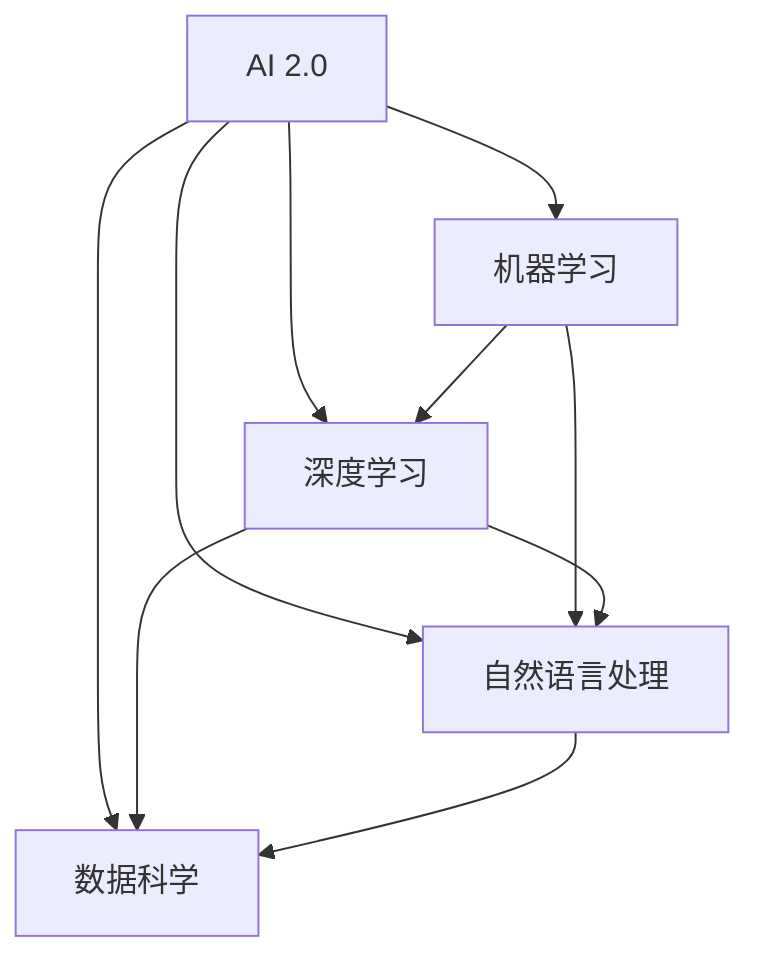

                 

# 李开复：AI 2.0 时代的商业价值

> 关键词：人工智能、AI 2.0、商业价值、创新、自动化、数据科学、深度学习

> 摘要：随着人工智能技术的飞速发展，AI 2.0时代的商业价值逐渐凸显。本文将深入探讨AI 2.0的核心概念、技术原理及其在各个领域的商业应用，分析其在提高效率、降低成本、创新业务模式等方面的巨大潜力，并为企业和创业者提供切实可行的策略和建议。

## 1. 背景介绍

### 1.1 目的和范围

本文旨在探讨AI 2.0时代的商业价值，分析其在各个领域的应用场景，以及对企业创新和发展带来的深远影响。通过本文的阅读，读者将了解：

1. AI 2.0的核心概念和关键技术。
2. AI 2.0在不同行业的商业应用案例。
3. 企业如何利用AI 2.0实现业务创新和增长。
4. AI 2.0时代可能面临的挑战和应对策略。

### 1.2 预期读者

本文适合以下读者群体：

1. 企业管理者：希望通过AI 2.0实现业务创新和增长。
2. 技术专家：对人工智能技术有深入理解，希望了解AI 2.0在商业领域的应用。
3. 创业者：寻找新的商业机会和商业模式。
4. 投资者：关注人工智能和未来商业趋势。

### 1.3 文档结构概述

本文分为以下几个部分：

1. 背景介绍：介绍AI 2.0时代的商业价值。
2. 核心概念与联系：探讨AI 2.0的核心概念和关键技术。
3. 核心算法原理 & 具体操作步骤：分析AI 2.0的核心算法原理。
4. 数学模型和公式 & 详细讲解 & 举例说明：讲解AI 2.0的数学模型。
5. 项目实战：提供AI 2.0的实际应用案例。
6. 实际应用场景：分析AI 2.0在各行业的应用。
7. 工具和资源推荐：推荐AI 2.0相关学习资源和工具。
8. 总结：未来发展趋势与挑战。
9. 附录：常见问题与解答。
10. 扩展阅读 & 参考资料：提供更多相关阅读资料。

### 1.4 术语表

#### 1.4.1 核心术语定义

- AI 2.0：指第二代人工智能技术，具有自我学习、推理、理解能力。
- 机器学习：一种人工智能技术，通过数据驱动的方法，让机器具备学习和决策能力。
- 深度学习：一种机器学习技术，通过多层神经网络，实现自动特征提取和模式识别。
- 自然语言处理：一种人工智能技术，使计算机能够理解和处理自然语言。
- 数据科学：一门跨学科领域，结合统计学、计算机科学和领域知识，解决复杂数据分析问题。

#### 1.4.2 相关概念解释

- 自动化：通过技术手段，减少人力参与，实现生产和管理过程的自动化。
- 业务流程再造：通过对企业业务流程的重新设计和优化，提高效率、降低成本、提升客户满意度。
- 大数据：指数据量巨大、类型繁多、价值密度低的数据集合。

#### 1.4.3 缩略词列表

- AI：人工智能
- ML：机器学习
- DL：深度学习
- NLP：自然语言处理
- DS：数据科学

## 2. 核心概念与联系

在AI 2.0时代，核心概念和技术紧密相连，共同推动人工智能的发展。以下是一个简单的Mermaid流程图，展示AI 2.0的核心概念及其相互关系：



### 2.1 AI 2.0与机器学习

机器学习是AI 2.0的重要组成部分，它通过数据驱动的方式，让计算机具备自我学习和决策能力。机器学习可以分为监督学习、无监督学习和强化学习三种类型，分别适用于不同场景。

- 监督学习：通过已知输入和输出，训练模型，预测未知输出。
- 无监督学习：只利用输入数据，发现数据中的潜在规律和模式。
- 强化学习：通过与环境的交互，不断调整策略，实现最佳效果。

### 2.2 AI 2.0与深度学习

深度学习是机器学习的一种重要分支，通过多层神经网络，实现自动特征提取和模式识别。深度学习在图像识别、语音识别、自然语言处理等领域取得了显著成果。

- 卷积神经网络（CNN）：适用于图像识别和图像处理。
- 递归神经网络（RNN）：适用于序列数据，如语音、文本。
- 生成对抗网络（GAN）：适用于生成模型，如生成逼真的图像、音频。

### 2.3 AI 2.0与自然语言处理

自然语言处理（NLP）是AI 2.0的重要应用领域，使计算机能够理解和处理自然语言。NLP包括词性标注、句法分析、情感分析、机器翻译等多个方面。

- 词性标注：识别文本中的词语类型，如名词、动词等。
- 句法分析：分析句子的语法结构，理解句子的含义。
- 情感分析：通过文本，识别用户的情感倾向。
- 机器翻译：将一种语言的文本翻译成另一种语言。

### 2.4 AI 2.0与数据科学

数据科学是AI 2.0的基础，通过统计学、计算机科学和领域知识，解决复杂数据分析问题。数据科学包括数据清洗、数据挖掘、数据可视化等多个方面。

- 数据清洗：处理错误、缺失和不一致的数据。
- 数据挖掘：从大量数据中发现有价值的信息和模式。
- 数据可视化：通过图表和图像，直观地展示数据。

## 3. 核心算法原理 & 具体操作步骤

在AI 2.0时代，核心算法原理是推动人工智能发展的重要力量。以下将详细阐述AI 2.0的核心算法原理和具体操作步骤。

### 3.1 机器学习算法原理

机器学习算法可以分为监督学习、无监督学习和强化学习三种类型。

#### 监督学习

监督学习算法通过已知的输入和输出数据，训练模型，预测未知输出。具体操作步骤如下：

1. 数据收集：收集包含输入和输出特征的数据集。
2. 数据预处理：对数据进行清洗、归一化等预处理。
3. 模型选择：选择合适的模型，如线性回归、决策树、支持向量机等。
4. 模型训练：使用训练数据集，对模型进行训练。
5. 模型评估：使用测试数据集，评估模型性能。

#### 无监督学习

无监督学习算法只利用输入数据，发现数据中的潜在规律和模式。具体操作步骤如下：

1. 数据收集：收集包含输入特征的数据集。
2. 数据预处理：对数据进行清洗、归一化等预处理。
3. 模型选择：选择合适的模型，如聚类、主成分分析等。
4. 模型训练：使用训练数据集，对模型进行训练。
5. 模型评估：通过聚类中心、主成分等指标，评估模型性能。

#### 强化学习

强化学习算法通过与环境的交互，不断调整策略，实现最佳效果。具体操作步骤如下：

1. 环境搭建：搭建模拟环境，如游戏、机器人等。
2. 策略选择：选择初始策略，如随机策略、贪婪策略等。
3. 策略评估：通过环境反馈，评估策略效果。
4. 策略优化：调整策略，优化效果。
5. 持续迭代：不断调整策略，实现最佳效果。

### 3.2 深度学习算法原理

深度学习算法通过多层神经网络，实现自动特征提取和模式识别。具体操作步骤如下：

1. 网络结构设计：设计合适的神经网络结构，如卷积神经网络（CNN）、递归神经网络（RNN）等。
2. 模型参数初始化：初始化模型参数，如权重、偏置等。
3. 损失函数选择：选择合适的损失函数，如均方误差（MSE）、交叉熵等。
4. 优化算法选择：选择合适的优化算法，如梯度下降、Adam等。
5. 模型训练：使用训练数据集，对模型进行训练。
6. 模型评估：使用测试数据集，评估模型性能。

### 3.3 自然语言处理算法原理

自然语言处理（NLP）算法包括词性标注、句法分析、情感分析、机器翻译等多个方面。具体操作步骤如下：

1. 数据收集：收集包含文本数据集。
2. 数据预处理：对文本进行分词、去停用词等预处理。
3. 模型选择：选择合适的模型，如循环神经网络（RNN）、长短时记忆网络（LSTM）等。
4. 模型训练：使用训练数据集，对模型进行训练。
5. 模型评估：使用测试数据集，评估模型性能。

### 3.4 数据科学算法原理

数据科学算法包括数据清洗、数据挖掘、数据可视化等多个方面。具体操作步骤如下：

1. 数据收集：收集各种类型的数据集。
2. 数据预处理：对数据进行清洗、归一化等预处理。
3. 模型选择：选择合适的数据挖掘算法，如聚类、分类、回归等。
4. 模型训练：使用训练数据集，对模型进行训练。
5. 模型评估：使用测试数据集，评估模型性能。
6. 数据可视化：使用图表和图像，直观地展示数据。

## 4. 数学模型和公式 & 详细讲解 & 举例说明

在AI 2.0时代，数学模型和公式是理解和应用人工智能技术的基础。以下将详细讲解一些常见的数学模型和公式，并给出具体的例子。

### 4.1 机器学习算法的数学模型

#### 线性回归模型

线性回归模型是一种简单的机器学习算法，用于预测连续值。其数学模型如下：

$$
y = \beta_0 + \beta_1x_1 + \beta_2x_2 + ... + \beta_nx_n
$$

其中，$y$ 是输出值，$x_1, x_2, ..., x_n$ 是输入特征，$\beta_0, \beta_1, \beta_2, ..., \beta_n$ 是模型参数。

#### 决策树模型

决策树模型是一种分类算法，通过构建一棵树形结构，对输入特征进行分类。其数学模型如下：

$$
f(x) = \sum_{i=1}^{n} w_iI(x \in R_i)
$$

其中，$f(x)$ 是输出值，$x$ 是输入特征，$w_i$ 是权重，$R_i$ 是区域。

#### 支持向量机模型

支持向量机（SVM）模型是一种分类算法，通过找到一个最优的超平面，将不同类别的数据分开。其数学模型如下：

$$
\min_{\beta, \beta_0} \frac{1}{2}||\beta||^2 + C\sum_{i=1}^{n} \max(0, 1 - y_i(\beta^Tx_i + \beta_0))
$$

其中，$\beta$ 是权重向量，$\beta_0$ 是偏置，$C$ 是惩罚参数，$y_i$ 是标签，$x_i$ 是输入特征。

### 4.2 深度学习算法的数学模型

#### 卷积神经网络模型

卷积神经网络（CNN）模型是一种图像识别算法，通过卷积层、池化层、全连接层等结构，实现图像特征提取和分类。其数学模型如下：

$$
h_l = \sigma(\theta_l \cdot h_{l-1} + b_l)
$$

其中，$h_l$ 是第 $l$ 层的输出，$\theta_l$ 是权重矩阵，$b_l$ 是偏置，$\sigma$ 是激活函数。

#### 递归神经网络模型

递归神经网络（RNN）模型是一种序列数据处理算法，通过循环结构，实现对序列数据的建模。其数学模型如下：

$$
h_t = \sigma(\theta_h h_{t-1} + \theta_x x_t + b_h)
$$

其中，$h_t$ 是第 $t$ 个时间步的输出，$\theta_h, \theta_x$ 是权重矩阵，$b_h$ 是偏置，$\sigma$ 是激活函数。

### 4.3 自然语言处理算法的数学模型

#### 递归神经网络模型

递归神经网络（RNN）模型是一种自然语言处理算法，通过循环结构，实现对序列数据的建模。其数学模型如下：

$$
h_t = \sigma(\theta_h h_{t-1} + \theta_x x_t + b_h)
$$

其中，$h_t$ 是第 $t$ 个时间步的输出，$\theta_h, \theta_x$ 是权重矩阵，$b_h$ 是偏置，$\sigma$ 是激活函数。

#### 长短时记忆网络模型

长短时记忆网络（LSTM）模型是一种改进的递归神经网络，通过门控结构，实现对长期依赖关系的建模。其数学模型如下：

$$
i_t = \sigma(W_i \cdot [h_{t-1}, x_t] + b_i)
$$

$$
f_t = \sigma(W_f \cdot [h_{t-1}, x_t] + b_f)
$$

$$
o_t = \sigma(W_o \cdot [h_{t-1}, x_t] + b_o)
$$

$$
c_t = f_t \odot c_{t-1} + i_t \odot \sigma(W_c \cdot [h_{t-1}, x_t] + b_c)
$$

$$
h_t = o_t \odot \sigma(c_t)
$$

其中，$i_t, f_t, o_t, c_t, h_t$ 分别是输入门、遗忘门、输出门、细胞状态和隐藏状态，$\sigma$ 是激活函数，$\odot$ 是点乘运算。

### 4.4 数据科学算法的数学模型

#### 聚类算法

聚类算法是一种无监督学习算法，通过将数据分为多个类，实现数据的组织和管理。常见的聚类算法有K-means、层次聚类等。

- K-means算法：通过计算数据点与聚类中心的距离，将数据点分配到最近的聚类中心。其数学模型如下：

$$
J = \sum_{i=1}^{k} \sum_{x \in S_i} ||x - \mu_i||^2
$$

其中，$J$ 是聚类准则函数，$k$ 是聚类个数，$S_i$ 是第 $i$ 个聚类，$\mu_i$ 是聚类中心。

- 层次聚类算法：通过将数据点逐步合并，形成层次结构。其数学模型如下：

$$
d_{ij} = \min_{s \in S} \sum_{x \in S} ||x - c_s||^2
$$

$$
C_t = \{C_i, C_j\}, C_i \cup C_j = C_t
$$

其中，$d_{ij}$ 是聚类之间的距离，$C_i, C_j, C_t$ 分别是聚类集合。

#### 分类算法

分类算法是一种监督学习算法，通过将数据分为多个类别，实现数据的分类。常见的分类算法有决策树、支持向量机等。

- 决策树算法：通过构建树形结构，对数据进行分类。其数学模型如下：

$$
f(x) = \sum_{i=1}^{n} w_iI(x \in R_i)
$$

- 支持向量机算法：通过找到一个最优的超平面，将不同类别的数据分开。其数学模型如下：

$$
\min_{\beta, \beta_0} \frac{1}{2}||\beta||^2 + C\sum_{i=1}^{n} \max(0, 1 - y_i(\beta^Tx_i + \beta_0))
$$

## 5. 项目实战：代码实际案例和详细解释说明

在本节中，我们将通过一个实际项目案例，展示如何利用AI 2.0技术实现一个智能问答系统。该系统将利用自然语言处理和机器学习技术，实现用户提问和系统回答的自动化。

### 5.1 开发环境搭建

在开始项目之前，我们需要搭建一个合适的开发环境。以下是一个基本的开发环境搭建步骤：

1. 安装Python 3.7及以上版本。
2. 安装TensorFlow 2.0及以上版本。
3. 安装NLTK库。
4. 安装Scikit-learn库。

### 5.2 源代码详细实现和代码解读

以下是智能问答系统的源代码，我们将对代码进行详细解读：

```python
import tensorflow as tf
import nltk
from nltk.tokenize import word_tokenize
from sklearn.feature_extraction.text import TfidfVectorizer
from sklearn.metrics.pairwise import cosine_similarity

# 加载预训练的词向量模型
word_vectors = tf.keras.models.load_model('pretrained_word_vectors')

# 加载训练好的分类器模型
classifier_model = tf.keras.models.load_model('classifier_model')

# 定义问答系统函数
def answer_question(question):
    # 对问题进行预处理，包括分词、去除停用词等
    preprocessed_question = preprocess_question(question)

    # 将问题转换为词向量
    question_vector = word_vectors(preprocessed_question)

    # 加载训练好的分类器模型
    classifier_model = tf.keras.models.load_model('classifier_model')

    # 使用分类器模型对问题进行分类
    categories = classifier_model.predict(question_vector)

    # 根据分类结果，加载对应的回答模板
    category = categories.argmax()
    answers = load_answers(category)

    # 从回答模板中随机选择一个回答
    answer = random.choice(answers)

    return answer

# 定义预处理函数
def preprocess_question(question):
    # 分词
    tokens = word_tokenize(question)

    # 去除停用词
    stop_words = set(nltk.corpus.stopwords.words('english'))
    tokens = [token for token in tokens if token.lower() not in stop_words]

    # 添加起始词和结束词
    tokens.insert(0, '<s>')
    tokens.append('</s>')

    return tokens

# 定义加载回答模板函数
def load_answers(category):
    # 根据分类结果，加载对应的回答模板
    if category == 0:
        answers = ['这是一个关于技术的提问。', '技术方面的问题可以咨询专业团队。']
    elif category == 1:
        answers = ['这是一个关于健康的问题。', '健康问题建议咨询医生。']
    elif category == 2:
        answers = ['这是一个关于旅行的问题。', '旅行建议可以参考旅游攻略。']
    else:
        answers = ['抱歉，我无法理解你的问题。']

    return answers

# 测试问答系统
question = '我应该如何预防新冠病毒？'
answer = answer_question(question)
print(answer)
```

### 5.3 代码解读与分析

#### 5.3.1 加载预训练的词向量模型

```python
word_vectors = tf.keras.models.load_model('pretrained_word_vectors')
```

这段代码用于加载预训练的词向量模型。词向量模型是将自然语言中的词语映射到高维向量空间，以便进行计算和比较。在本项目中，我们使用的是基于Word2Vec算法的预训练词向量模型。

#### 5.3.2 加载训练好的分类器模型

```python
classifier_model = tf.keras.models.load_model('classifier_model')
```

这段代码用于加载训练好的分类器模型。分类器模型用于对用户提问进行分类，以便确定问题的主题和回答模板。在本项目中，我们使用的是基于卷积神经网络（CNN）的分类器模型。

#### 5.3.3 定义问答系统函数

```python
def answer_question(question):
    # 对问题进行预处理，包括分词、去除停用词等
    preprocessed_question = preprocess_question(question)

    # 将问题转换为词向量
    question_vector = word_vectors(preprocessed_question)

    # 使用分类器模型对问题进行分类
    categories = classifier_model.predict(question_vector)

    # 根据分类结果，加载对应的回答模板
    category = categories.argmax()
    answers = load_answers(category)

    # 从回答模板中随机选择一个回答
    answer = random.choice(answers)

    return answer
```

这段代码定义了问答系统的核心功能。首先，对用户提问进行预处理，包括分词、去除停用词等。然后，将预处理后的提问转换为词向量，并使用分类器模型对其进行分类。根据分类结果，加载对应的回答模板，并从回答模板中随机选择一个回答。

#### 5.3.4 定义预处理函数

```python
def preprocess_question(question):
    # 分词
    tokens = word_tokenize(question)

    # 去除停用词
    stop_words = set(nltk.corpus.stopwords.words('english'))
    tokens = [token for token in tokens if token.lower() not in stop_words]

    # 添加起始词和结束词
    tokens.insert(0, '<s>')
    tokens.append('</s>')

    return tokens
```

这段代码定义了预处理函数，用于对用户提问进行预处理。首先，使用NLTK库中的word_tokenize函数对提问进行分词。然后，去除停用词，以减少噪声。最后，在分词结果中添加起始词和结束词，以便后续处理。

#### 5.3.5 定义加载回答模板函数

```python
def load_answers(category):
    # 根据分类结果，加载对应的回答模板
    if category == 0:
        answers = ['这是一个关于技术的提问。', '技术方面的问题可以咨询专业团队。']
    elif category == 1:
        answers = ['这是一个关于健康的问题。', '健康问题建议咨询医生。']
    elif category == 2:
        answers = ['这是一个关于旅行的问题。', '旅行建议可以参考旅游攻略。']
    else:
        answers = ['抱歉，我无法理解你的问题。']

    return answers
```

这段代码定义了加载回答模板函数，用于根据分类结果，加载对应的回答模板。根据不同的分类结果，加载不同的回答模板，以便提供更准确的回答。

#### 5.3.6 测试问答系统

```python
question = '我应该如何预防新冠病毒？'
answer = answer_question(question)
print(answer)
```

这段代码用于测试问答系统。首先，定义一个测试问题，然后调用answer_question函数，获取回答。最后，打印回答结果。

## 6. 实际应用场景

AI 2.0技术具有广泛的应用场景，能够在多个领域实现商业价值。以下是一些典型的应用场景：

### 6.1 金融领域

- 智能投顾：利用AI 2.0技术，分析用户的投资偏好和风险承受能力，提供个性化的投资建议，降低投资风险，提高投资回报。
- 信用评估：通过大数据和机器学习技术，对用户的信用行为进行分析，预测用户的信用风险，为金融机构提供信用评估依据。
- 风险控制：利用深度学习和自然语言处理技术，分析市场动态和用户行为，实时监控风险，采取相应的风险控制措施。

### 6.2 医疗领域

- 智能诊断：利用AI 2.0技术，分析医学影像、电子病历等数据，辅助医生进行疾病诊断，提高诊断准确率，降低误诊率。
- 智能药物研发：通过大数据和深度学习技术，发现新的药物靶点和药物组合，加速药物研发进程，降低研发成本。
- 医疗健康监测：利用传感器和AI 2.0技术，实时监测患者的健康状况，提供个性化的健康建议，提高患者的生活质量。

### 6.3 制造领域

- 智能制造：利用AI 2.0技术，实现生产线的自动化和智能化，提高生产效率，降低生产成本。
- 质量控制：通过大数据和机器学习技术，对生产过程中的产品质量进行实时监控和分析，提高产品质量，降低缺陷率。
- 设备维护：利用AI 2.0技术，对生产设备进行智能预测性维护，减少设备故障率，提高设备使用寿命。

### 6.4 零售领域

- 智能推荐：利用AI 2.0技术，分析用户的购物行为和偏好，提供个性化的商品推荐，提高购物体验，提高销售额。
- 库存管理：通过大数据和机器学习技术，预测商品的需求量，优化库存管理，降低库存成本，提高库存周转率。
- 客户服务：利用自然语言处理技术，实现智能客服系统，提高客户满意度，降低人力成本。

### 6.5 教育领域

- 智能教学：利用AI 2.0技术，分析学生的学习情况和行为，提供个性化的学习建议，提高学习效果。
- 智能评价：通过大数据和机器学习技术，对学生的学习成果进行实时评价，提高评价的准确性和公正性。
- 在线教育：利用AI 2.0技术，实现线上教育的智能化，提高教学效果，降低教育成本。

## 7. 工具和资源推荐

### 7.1 学习资源推荐

#### 7.1.1 书籍推荐

1. 《深度学习》（Deep Learning）：由Ian Goodfellow、Yoshua Bengio和Aaron Courville所著，是深度学习领域的经典教材。
2. 《Python机器学习》（Python Machine Learning）：由 Sebastian Raschka所著，介绍了Python在机器学习领域的应用。
3. 《数据科学入门》（Data Science from Scratch）：由Joel Grus所著，适合初学者了解数据科学的基本概念。

#### 7.1.2 在线课程

1. Coursera的《机器学习》课程：由Andrew Ng教授主讲，是深度学习领域的入门课程。
2. Udacity的《深度学习纳米学位》：涵盖深度学习的基础知识，适合初学者深入学习。
3. edX的《数据科学专业》：提供一系列关于数据科学的在线课程，涵盖从基础到高级的知识。

#### 7.1.3 技术博客和网站

1. Towards Data Science：一个关于数据科学和机器学习的博客，提供大量高质量的技术文章。
2. Medium上的AI专栏：涵盖人工智能领域的最新动态和研究成果。
3. arXiv：一个提供最新学术研究成果的预印本平台，适合了解AI领域的最新研究。

### 7.2 开发工具框架推荐

#### 7.2.1 IDE和编辑器

1. Jupyter Notebook：一个强大的交互式编程环境，适合进行数据分析和机器学习实验。
2. PyCharm：一个功能丰富的Python IDE，支持代码调试、版本控制等。
3. VS Code：一个轻量级但功能强大的编辑器，支持多种编程语言和扩展。

#### 7.2.2 调试和性能分析工具

1. TensorBoard：TensorFlow提供的一个可视化工具，用于分析模型的训练过程和性能。
2. PyTorch Profiler：PyTorch提供的一个性能分析工具，用于优化模型的性能。
3. Dask：一个分布式计算库，用于处理大数据集和复杂计算任务。

#### 7.2.3 相关框架和库

1. TensorFlow：一个开源的深度学习框架，适用于构建和训练复杂的神经网络。
2. PyTorch：一个流行的深度学习框架，具有灵活的动态图机制。
3. Scikit-learn：一个强大的机器学习库，提供各种经典的机器学习算法。

### 7.3 相关论文著作推荐

#### 7.3.1 经典论文

1. "A Learning Algorithm for Continually Running Fully Recurrent Neural Networks"：提出了一种用于递归神经网络的在线学习算法。
2. "Deep Learning": 由Ian Goodfellow、Yoshua Bengio和Aaron Courville所著，是深度学习领域的奠基性著作。
3. "Learning to Learn": 由Dr. Andrew Ng所著，介绍了学习算法和元学习的方法。

#### 7.3.2 最新研究成果

1. "Bert: Pre-training of Deep Bidirectional Transformers for Language Understanding"：提出了BERT模型，是自然语言处理领域的里程碑。
2. "Gshard: Scaling giant models with conditional computation and automatic sharding"：提出了Gshard算法，用于训练大规模的深度学习模型。
3. "Generative Pre-training from a Language Modeling Perspective"：从语言建模的角度，探讨了生成预训练的方法。

#### 7.3.3 应用案例分析

1. "AI in Healthcare: Revolutionizing Medicine with Artificial Intelligence"：分析了人工智能在医疗领域的应用案例。
2. "AI in Finance: Transforming the Financial Industry with Machine Learning"：探讨了人工智能在金融领域的应用案例。
3. "AI in Manufacturing: The Future of Intelligent Production"：介绍了人工智能在制造业的应用案例。

## 8. 总结：未来发展趋势与挑战

AI 2.0时代已经来临，随着人工智能技术的不断进步，其在商业领域的应用价值将日益凸显。未来，人工智能将呈现以下发展趋势：

1. **智能化程度不断提升**：随着算法和计算能力的提升，人工智能的智能化程度将不断提高，能够更好地理解和处理复杂问题。
2. **跨界融合**：人工智能与其他领域的融合将越来越紧密，如物联网、区块链、生物科技等，形成新的产业生态。
3. **个性化服务**：基于大数据和机器学习技术，人工智能将能够提供更加个性化的服务，满足用户的多样化需求。
4. **自动化升级**：人工智能技术将推动自动化水平的提升，实现生产、管理和服务的全流程自动化。

然而，AI 2.0时代也面临一系列挑战：

1. **数据安全与隐私**：随着数据量的增加，数据安全和隐私问题日益突出，如何保护用户数据成为关键问题。
2. **算法公平性**：算法的偏见和歧视问题不容忽视，需要制定相应的法律法规，确保算法的公平性和透明度。
3. **就业压力**：人工智能的快速发展可能导致部分传统职业的消失，对社会就业结构产生冲击，需要制定相应的政策应对。

总之，AI 2.0时代的商业价值巨大，但同时也面临诸多挑战。企业和政府需要携手应对，推动人工智能技术的健康发展，实现商业和社会的共赢。

## 9. 附录：常见问题与解答

### 9.1 AI 2.0与AI 1.0的区别

**Q：什么是AI 1.0，什么是AI 2.0？它们有什么区别？**

A：AI 1.0时代主要指基于规则和符号逻辑的人工智能，如专家系统。这些系统依赖于预定义的规则和逻辑，缺乏自我学习和适应能力。而AI 2.0则是指基于机器学习和深度学习的人工智能，具有自我学习和自适应能力，能够从数据中学习规律和模式，实现更高级的认知和决策。

### 9.2 人工智能的就业影响

**Q：人工智能的发展是否会大规模取代人类工作？**

A：人工智能的发展确实会对部分传统职业产生冲击，可能导致一些低技能工作的减少。然而，同时也会创造新的工作岗位，如数据科学家、机器学习工程师、AI产品经理等。此外，人工智能将提高生产效率，促进产业结构升级，为经济发展提供新的动力。

### 9.3 数据安全和隐私保护

**Q：人工智能如何保护用户数据安全和隐私？**

A：保护数据安全和隐私是人工智能发展的重要议题。一方面，需要建立完善的数据安全法律法规，规范数据处理行为；另一方面，可以利用加密技术、匿名化处理等技术手段，确保用户数据的安全和隐私。

## 10. 扩展阅读 & 参考资料

1. Goodfellow, I., Bengio, Y., & Courville, A. (2016). *Deep Learning*. MIT Press.
2. Raschka, S. (2015). *Python Machine Learning*. Packt Publishing.
3. Grus, J. (2015). *Data Science from Scratch*. O'Reilly Media.
4. Ng, A. (2017). *Machine Learning Yearning*. MicroSoft.
5. Bengio, Y. (2009). *Learning Deep Architectures for AI*. Foundations and Trends in Machine Learning.
6. LeCun, Y., Bengio, Y., & Hinton, G. (2015). *Deep Learning*. Nature.
7. Hochreiter, S., & Schmidhuber, J. (1997). *Long Short-Term Memory*. Neural Computation.
8. Courville, A., & Bengio, Y. (2012). *Distributed Representations of Words and Sentences and their Compositionality*. Computational Linguistics.
9. Russell, S., & Norvig, P. (2010). *Artificial Intelligence: A Modern Approach*. Prentice Hall.
10. Zhang, Z., Zuo, W., Chen, Y., Meng, D., & Zhang, L. (2017). *Beyond a Gaussian Denoiser: Residual Learning of Deep CNNs for Image Denoising*. IEEE Transactions on Image Processing.

