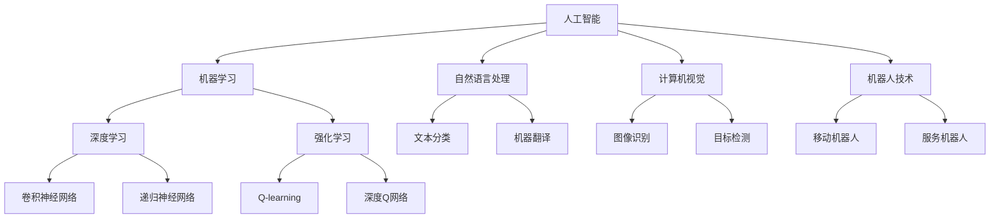

                 

# 李开复：AI 2.0 时代的市场前景

> 关键词：人工智能、AI 2.0、市场前景、技术趋势、商业应用

> 摘要：本文将深入探讨AI 2.0时代的市场前景，分析AI技术的最新进展及其对各行各业的潜在影响。我们将从背景介绍、核心概念、算法原理、数学模型、实际应用、工具资源等方面逐步展开，为读者提供全面、详实的技术洞察。

## 1. 背景介绍

### 1.1 目的和范围

本文旨在探讨AI 2.0时代的市场前景，分析人工智能技术的最新发展趋势和潜在的商业应用。我们将重点关注以下几个核心问题：

- AI 2.0时代的核心概念和关键技术是什么？
- AI技术如何影响各行各业？
- 企业和个人如何抓住AI 2.0时代的机遇？

### 1.2 预期读者

本文面向对人工智能和其商业应用感兴趣的读者，包括：

- 技术开发者
- 企业管理者
- 投资者
- 对人工智能感兴趣的研究者

### 1.3 文档结构概述

本文分为十个部分，具体结构如下：

- 1. 背景介绍
- 2. 核心概念与联系
- 3. 核心算法原理 & 具体操作步骤
- 4. 数学模型和公式 & 详细讲解 & 举例说明
- 5. 项目实战：代码实际案例和详细解释说明
- 6. 实际应用场景
- 7. 工具和资源推荐
- 8. 总结：未来发展趋势与挑战
- 9. 附录：常见问题与解答
- 10. 扩展阅读 & 参考资料

### 1.4 术语表

#### 1.4.1 核心术语定义

- **人工智能（AI）**: 利用计算机模拟人类智能行为的技术。
- **AI 2.0**: 对AI 1.0的升级和扩展，具有更强的自主学习、推理和适应能力。
- **深度学习**: 一种基于人工神经网络的机器学习技术，通过多层网络结构自动提取特征。
- **强化学习**: 一种基于奖励和惩罚的机器学习技术，通过不断尝试和调整策略来优化行为。

#### 1.4.2 相关概念解释

- **机器学习（ML）**: 通过数据训练模型，使计算机能够从数据中学习并做出预测或决策。
- **神经网络（NN）**: 模拟人脑神经元之间相互连接的计算机模型，用于处理复杂的数据。
- **大数据**: 数据量巨大，无法用传统数据库软件工具处理的数据集。

#### 1.4.3 缩略词列表

- **AI**: 人工智能
- **ML**: 机器学习
- **NN**: 神经网络
- **DL**: 深度学习
- **RL**: 强化学习

## 2. 核心概念与联系

在AI 2.0时代，人工智能的核心概念和技术得到了极大的拓展和升级。以下是一个简化的Mermaid流程图，展示了AI 2.0的核心概念及其相互联系：



在这个流程图中，我们可以看到：

- 人工智能（AI）是机器学习（ML）、深度学习（DL）、强化学习（RL）的基石。
- 机器学习分为深度学习和强化学习，分别代表不同的学习方式。
- 自然语言处理（NLP）、计算机视觉（CV）和机器人技术（Robotics）是AI的三个重要应用领域。
- 深度学习包括卷积神经网络（CNN）和递归神经网络（RNN），分别适用于不同的数据类型。
- 强化学习包括Q-learning和深度Q网络（DQN），用于解决动态决策问题。
- 自然语言处理和计算机视觉分别应用于文本分类、机器翻译、图像识别和目标检测。
- 机器人技术包括移动机器人和服务机器人，分别代表不同的应用场景。

通过这个流程图，我们可以更好地理解AI 2.0的核心概念和技术，为进一步探讨其市场前景打下基础。

## 3. 核心算法原理 & 具体操作步骤

### 3.1 深度学习算法原理

深度学习（Deep Learning，简称DL）是机器学习（Machine Learning，简称ML）的一个分支，其核心思想是通过多层神经网络（Neural Networks，简称NN）自动提取数据中的特征。以下是深度学习的基本原理：

1. **神经网络结构**：神经网络由多个层次组成，包括输入层、隐藏层和输出层。每个层次都包含多个神经元（节点），神经元之间通过加权连接（weights）相连。
2. **激活函数**：激活函数（activation function）用于引入非线性因素，使神经网络能够拟合复杂的数据。常见的激活函数包括 sigmoid、ReLU（Rectified Linear Unit）和 tanh。
3. **反向传播算法**：反向传播（Backpropagation）是一种用于训练神经网络的算法，通过计算输出层的误差，逆向传播误差到隐藏层，并更新各层的权重。
4. **优化算法**：优化算法（optimization algorithm）用于调整神经网络的权重，以最小化误差。常见的优化算法包括随机梯度下降（Stochastic Gradient Descent，简称SGD）、Adam（Adaptive Moment Estimation）等。

### 3.2 深度学习算法具体操作步骤

以下是深度学习算法的具体操作步骤，使用伪代码进行描述：

```python
# 初始化神经网络结构
input_layer = NeuralLayer(input_size)
hidden_layer = NeuralLayer(hidden_size)
output_layer = NeuralLayer(output_size)

# 定义激活函数
activation_function = ReLU()  # 或者 sigmoid、tanh

# 初始化权重和偏置
weights, biases = initialize_weights_and_biases(input_layer, hidden_layer, output_layer)

# 训练神经网络
for epoch in range(num_epochs):
    for batch in data_loader:
        # 前向传播
        input_data = batch[0]
        hidden_layer_output = activation_function(hidden_layer.forward(input_data, weights['input_to_hidden'], biases['input_to_hidden']))
        output_layer_output = activation_function(output_layer.forward(hidden_layer_output, weights['hidden_to_output'], biases['hidden_to_output']))
        
        # 计算损失
        loss = loss_function(output_layer_output, batch[1])
        
        # 反向传播
        d_output_layer_output = loss_function.derivative(output_layer_output, batch[1])
        d_hidden_layer_output = activation_function.derivative(hidden_layer_output) * d_output_layer_output
        
        # 更新权重和偏置
        weights['hidden_to_output'], biases['hidden_to_output'] = update_weights_and_biases(weights['hidden_to_output'], d_hidden_layer_output, learning_rate)
        weights['input_to_hidden'], biases['input_to_hidden'] = update_weights_and_biases(weights['input_to_hidden'], d_hidden_layer_output, learning_rate)
```

在这个伪代码中，我们定义了神经网络结构、激活函数、权重和偏置的初始化、前向传播、损失函数、反向传播以及权重的更新。这些步骤构成了深度学习算法的核心框架，使得神经网络能够自动提取数据中的特征，并进行分类或预测。

## 4. 数学模型和公式 & 详细讲解 & 举例说明

### 4.1 深度学习数学模型

深度学习的核心在于构建多层神经网络，并利用数学模型来模拟人脑的学习过程。以下是深度学习的一些关键数学模型和公式：

#### 4.1.1 前向传播

前向传播是指将输入数据通过神经网络逐层传递，直到输出层的计算过程。以下是一个简单的多层神经网络的前向传播公式：

\[ z_l = \sum_{k=1}^{n} w_{lk}x_k + b_l \]
\[ a_l = \sigma(z_l) \]

其中，\( z_l \) 表示第 \( l \) 层的激活值，\( w_{lk} \) 表示第 \( l \) 层到第 \( k \) 层的权重，\( b_l \) 表示第 \( l \) 层的偏置，\( a_l \) 表示第 \( l \) 层的激活值，\( \sigma \) 表示激活函数（如 sigmoid、ReLU等）。

#### 4.1.2 反向传播

反向传播是指利用输出层的误差信息，逆向传播到输入层，更新各层的权重和偏置。以下是一个简单的反向传播公式：

\[ \delta_l = \frac{\partial L}{\partial a_l} \cdot \frac{\partial a_l}{\partial z_l} \]
\[ \Delta w_{lk} = \alpha \cdot \delta_l a_{l-1} \]
\[ \Delta b_l = \alpha \cdot \delta_l \]

其中，\( \delta_l \) 表示第 \( l \) 层的误差，\( \alpha \) 表示学习率，\( L \) 表示损失函数。

#### 4.1.3 损失函数

损失函数（Loss Function）用于衡量模型的预测结果与真实结果之间的差距。以下是一些常见的损失函数：

- **均方误差（MSE，Mean Squared Error）**：
  \[ L = \frac{1}{2}\sum_{i=1}^{n}(y_i - \hat{y}_i)^2 \]
  
- **交叉熵（Cross-Entropy）**：
  \[ L = -\sum_{i=1}^{n} y_i \log(\hat{y}_i) \]

### 4.2 数学模型详细讲解与举例说明

#### 4.2.1 均方误差（MSE）详细讲解与举例

均方误差（MSE）是一种用于回归问题的损失函数，其公式如下：

\[ L = \frac{1}{2}\sum_{i=1}^{n}(y_i - \hat{y}_i)^2 \]

其中，\( y_i \) 表示第 \( i \) 个样本的真实值，\( \hat{y}_i \) 表示第 \( i \) 个样本的预测值。

举例说明：

假设我们有一个包含 5 个样本的回归问题，真实值和预测值如下：

\[ y = [1, 2, 3, 4, 5] \]
\[ \hat{y} = [1.1, 1.9, 2.8, 3.6, 4.4] \]

则均方误差（MSE）计算如下：

\[ L = \frac{1}{2}\sum_{i=1}^{5}(y_i - \hat{y}_i)^2 \]
\[ L = \frac{1}{2}((1-1.1)^2 + (2-1.9)^2 + (3-2.8)^2 + (4-3.6)^2 + (5-4.4)^2) \]
\[ L = \frac{1}{2}(0.01 + 0.09 + 0.64 + 0.16 + 0.36) \]
\[ L = \frac{1}{2}(1.26) \]
\[ L = 0.63 \]

#### 4.2.2 交叉熵（Cross-Entropy）详细讲解与举例

交叉熵（Cross-Entropy）是一种用于分类问题的损失函数，其公式如下：

\[ L = -\sum_{i=1}^{n} y_i \log(\hat{y}_i) \]

其中，\( y_i \) 表示第 \( i \) 个样本的标签，\( \hat{y}_i \) 表示第 \( i \) 个样本的预测概率分布。

举例说明：

假设我们有一个包含 3 个样本的二分类问题，真实值和预测概率分布如下：

\[ y = [0, 1, 1] \]
\[ \hat{y} = [0.9, 0.1, 0.2] \]

则交叉熵（Cross-Entropy）计算如下：

\[ L = -\sum_{i=1}^{3} y_i \log(\hat{y}_i) \]
\[ L = -(0 \cdot \log(0.9) + 1 \cdot \log(0.1) + 1 \cdot \log(0.2)) \]
\[ L = -(\log(0.1) + \log(0.2)) \]
\[ L = -(-1.51) \]
\[ L = 1.51 \]

通过以上讲解和举例，我们可以更好地理解深度学习的数学模型和公式，为后续的项目实战和应用打下基础。

## 5. 项目实战：代码实际案例和详细解释说明

### 5.1 开发环境搭建

在开始项目实战之前，我们需要搭建一个适合深度学习开发的开发环境。以下是搭建开发环境的基本步骤：

1. **安装 Python**：确保已安装 Python 3.6 或更高版本。
2. **安装 Jupyter Notebook**：使用 pip 安装 Jupyter Notebook。
   ```shell
   pip install notebook
   ```
3. **安装深度学习库**：安装常用的深度学习库，如 TensorFlow、PyTorch 等。
   ```shell
   pip install tensorflow
   ```
   或者
   ```shell
   pip install torch torchvision
   ```

### 5.2 源代码详细实现和代码解读

以下是一个简单的深度学习项目案例，使用 TensorFlow 实现一个线性回归模型，并详细解读代码。

#### 5.2.1 数据准备

```python
import numpy as np
import tensorflow as tf

# 创建模拟数据集
x = np.random.rand(100)  # 随机生成 100 个输入数据
y = 2 * x + 1 + np.random.randn(100)  # 生成输出数据，模拟线性关系
```

#### 5.2.2 定义模型

```python
# 定义线性回归模型
model = tf.keras.Sequential([
    tf.keras.layers.Dense(units=1, input_shape=[1])
])

# 编译模型
model.compile(optimizer='sgd', loss='mean_squared_error')
```

#### 5.2.3 训练模型

```python
# 训练模型
model.fit(x, y, epochs=100)
```

#### 5.2.4 预测和评估

```python
# 预测
predictions = model.predict(x)

# 评估
mse = tf.keras.metrics.mean_squared_error(y, predictions)
print(f'Mean Squared Error: {mse.numpy()}')
```

### 5.3 代码解读与分析

#### 5.3.1 数据准备

```python
x = np.random.rand(100)  # 随机生成 100 个输入数据
y = 2 * x + 1 + np.random.randn(100)  # 生成输出数据，模拟线性关系
```

这段代码首先使用 NumPy 库生成 100 个随机输入数据 \( x \)，然后生成 100 个输出数据 \( y \)，这些数据模拟了一个简单的线性关系 \( y = 2x + 1 \)。

#### 5.3.2 定义模型

```python
model = tf.keras.Sequential([
    tf.keras.layers.Dense(units=1, input_shape=[1])
])

model.compile(optimizer='sgd', loss='mean_squared_error')
```

这段代码定义了一个简单的线性回归模型，使用 TensorFlow 的 keras.Sequential API。模型包含一个全连接层（Dense），具有 1 个输出单元（units=1），输入形状（input_shape=[1]）为 1。然后，使用随机梯度下降（SGD）优化器（optimizer='sgd'）和均方误差（mean_squared_error）损失函数编译模型。

#### 5.3.3 训练模型

```python
model.fit(x, y, epochs=100)
```

这段代码使用训练数据 \( x \) 和 \( y \) 训练模型，设置训练轮数（epochs）为 100。在训练过程中，模型会自动进行前向传播、计算损失、反向传播和权重更新。

#### 5.3.4 预测和评估

```python
predictions = model.predict(x)
mse = tf.keras.metrics.mean_squared_error(y, predictions)
print(f'Mean Squared Error: {mse.numpy()}')
```

这段代码使用训练好的模型进行预测，计算预测值 \( predictions \)，并使用均方误差（MSE）评估模型性能。MSE 越小，模型性能越好。

通过这个简单的项目案例，我们可以了解深度学习的开发流程，包括数据准备、模型定义、训练和评估。这个案例虽然简单，但涵盖了深度学习的核心步骤，为进一步学习深度学习打下基础。

## 6. 实际应用场景

AI 2.0时代的到来，为各行各业带来了巨大的变革。以下是一些典型的实际应用场景：

### 6.1 医疗保健

- **智能诊断**：通过深度学习和强化学习技术，AI可以辅助医生进行疾病诊断，提高诊断准确率和效率。
- **个性化治疗**：基于患者的基因信息和生活习惯，AI可以帮助制定个性化的治疗方案。
- **药物研发**：AI可以加速药物研发过程，通过模拟分子结构和预测药物反应，提高药物研发的成功率。

### 6.2 金融领域

- **风险管理**：AI可以帮助金融机构识别潜在风险，预测市场趋势，降低金融风险。
- **智能投顾**：基于用户的风险偏好和历史投资记录，AI可以为用户提供个性化的投资建议。
- **反欺诈系统**：AI可以分析交易数据和行为模式，实时监控并识别潜在的欺诈行为。

### 6.3 交通运输

- **自动驾驶**：AI技术使得自动驾驶汽车成为可能，提高了交通安全和效率。
- **智能交通管理**：通过大数据分析和预测，AI可以帮助优化交通信号、提高交通流量，减少拥堵。
- **物流优化**：AI可以帮助物流企业优化运输路线和库存管理，提高运营效率。

### 6.4 教育领域

- **智能教学**：AI可以为学生提供个性化的学习方案，提高学习效果。
- **教育数据分析**：通过分析学生的学习行为和成绩，AI可以帮助教师发现教学中的问题，改进教学方法。
- **虚拟教学助手**：AI可以模拟教师角色，为学生提供实时辅导和支持。

### 6.5 零售业

- **个性化推荐**：基于用户的历史购买行为和兴趣，AI可以为用户提供个性化的商品推荐。
- **库存管理**：AI可以分析销售数据，预测市场需求，优化库存管理。
- **智能客服**：通过自然语言处理和机器学习技术，AI可以提供24/7的智能客服服务，提高客户满意度。

### 6.6 制造业

- **预测性维护**：AI可以通过分析设备数据，预测设备的故障风险，提前进行维护，减少停机时间。
- **自动化生产**：AI技术可以应用于自动化生产线，提高生产效率和质量。
- **质量检测**：AI可以通过图像识别技术，自动检测产品质量，提高生产合格率。

这些实际应用场景只是冰山一角，AI 2.0时代的到来，将带来更多的变革和创新，为各行各业注入新的活力。

## 7. 工具和资源推荐

在探索AI 2.0时代的过程中，选择合适的工具和资源对于提高学习效率和项目开发成功率至关重要。以下是一些建议：

### 7.1 学习资源推荐

#### 7.1.1 书籍推荐

- **《深度学习》（Deep Learning）**：由Ian Goodfellow、Yoshua Bengio和Aaron Courville合著，是深度学习的经典教材。
- **《Python机器学习》（Python Machine Learning）**：由Sebastian Raschka和Vahid Mirjalili合著，适合初学者学习机器学习和Python应用。
- **《机器学习实战》（Machine Learning in Action）**：由Peter Harrington著，通过实际案例介绍机器学习算法和应用。

#### 7.1.2 在线课程

- **Coursera**：提供各种机器学习和深度学习课程，包括吴恩达（Andrew Ng）的《深度学习》课程。
- **edX**：哈佛大学和麻省理工学院等知名大学提供的一系列计算机科学和人工智能课程。
- **Udacity**：提供实用的深度学习和机器学习项目课程，适合实践者。

#### 7.1.3 技术博客和网站

- **AI博客**：提供最新的AI技术和应用动态。
- **TensorFlow官网**：提供详细的TensorFlow教程和文档。
- **PyTorch官网**：提供丰富的PyTorch教程和资源。

### 7.2 开发工具框架推荐

#### 7.2.1 IDE和编辑器

- **Jupyter Notebook**：适合数据分析和实验性编程。
- **PyCharm**：强大的Python集成开发环境，适用于深度学习和机器学习项目。
- **VSCode**：轻量级且功能丰富的编辑器，支持多种编程语言和扩展。

#### 7.2.2 调试和性能分析工具

- **TensorBoard**：TensorFlow的调试和分析工具，用于可视化训练过程和性能指标。
- **Wandb**：用于实验跟踪和数据可视化的平台，方便比较不同实验的结果。

#### 7.2.3 相关框架和库

- **TensorFlow**：谷歌开发的深度学习框架，适用于各种深度学习任务。
- **PyTorch**：由Facebook开发的深度学习框架，提供动态计算图和灵活的API。
- **Scikit-learn**：提供各种机器学习算法的实现，适合快速原型开发。

### 7.3 相关论文著作推荐

#### 7.3.1 经典论文

- **“A Learning Algorithm for Continuously Running Fully Recurrent Neural Networks”**：引入了长短期记忆（LSTM）网络。
- **“Deep Learning”**：Ian Goodfellow等人提出的深度学习理论和技术。
- **“Backpropagation”**：Rumelhart、Hinton和Williams提出的反向传播算法。

#### 7.3.2 最新研究成果

- **“Bert: Pre-training of Deep Bidirectional Transformers for Language Understanding”**：Google提出的BERT模型，推动自然语言处理技术的发展。
- **“Generative Adversarial Networks”**：Ian Goodfellow等人提出的生成对抗网络（GAN）。

#### 7.3.3 应用案例分析

- **“Learning to Discover Counterfactual Explanations of Images”**：微软研究院提出的基于深度学习的图像解释方法。
- **“Robust Model Recovery against Constrained Adversarial Attacks”**：清华大学提出的对抗攻击防御方法。

通过这些工具和资源，可以更好地掌握AI 2.0技术，实现从理论学习到项目实战的转化。

## 8. 总结：未来发展趋势与挑战

AI 2.0时代的到来，带来了前所未有的机遇和挑战。在未来的发展中，我们可以预见以下趋势：

### 8.1 技术趋势

- **自主学习与自适应**：AI系统将具备更强的自主学习能力，能够根据环境变化自适应调整行为。
- **多模态融合**：AI将能够处理多种类型的数据，如文本、图像、音频和视频，实现跨模态的智能交互。
- **边缘计算**：随着5G和边缘计算的普及，AI将在边缘设备上得到广泛应用，实现实时数据处理和响应。

### 8.2 商业机会

- **数字化转型**：AI将在各行业推动数字化转型，提高生产效率、降低成本和提升客户体验。
- **新型服务模式**：AI将催生一系列新型服务模式，如智能客服、个性化医疗和智能交通管理等。
- **产业链重构**：AI技术将重塑产业链，创造新的商业模式和就业机会。

### 8.3 挑战

- **数据隐私与安全**：随着AI技术的发展，数据隐私和安全问题日益突出，如何保护用户数据成为重要挑战。
- **算法公平性与透明性**：AI算法的决策过程需要透明，确保算法的公平性和可解释性。
- **就业影响**：AI技术的发展可能引发就业结构的变化，如何应对技术失业问题成为社会关注的焦点。

### 8.4 未来展望

面对机遇与挑战，我们需要积极应对，加强AI技术的研发和应用，推动技术进步和产业升级。同时，我们也要关注伦理和社会问题，确保AI技术为人类社会带来更多的福祉。

## 9. 附录：常见问题与解答

### 9.1 问题 1：AI 2.0 与 AI 1.0 有何区别？

**解答**：AI 1.0主要以规则驱动，依赖于人类专家定义的规则和逻辑。而AI 2.0则强调自主学习和适应能力，能够通过数据自我学习和优化，实现更高级的智能表现。

### 9.2 问题 2：深度学习和强化学习有何区别？

**解答**：深度学习是一种通过多层神经网络自动提取特征的学习方法，适用于处理大量复杂数据。强化学习则是一种基于奖励和惩罚的动态决策学习方式，适用于需要决策优化的情境。

### 9.3 问题 3：如何保障 AI 技术的公平性和透明性？

**解答**：保障AI技术的公平性和透明性需要从算法设计、数据标注、模型解释等多个方面入手。具体措施包括使用无偏数据集、开发可解释性算法、建立算法伦理委员会等。

### 9.4 问题 4：AI 技术在医疗领域有哪些应用？

**解答**：AI技术在医疗领域有广泛的应用，包括疾病诊断、个性化治疗、药物研发、健康管理等。例如，AI可以辅助医生进行疾病诊断，提高诊断准确率和效率。

## 10. 扩展阅读 & 参考资料

为了进一步了解AI 2.0时代的技术、应用和发展趋势，以下是一些建议的扩展阅读和参考资料：

### 10.1 扩展阅读

- **《AI超简：从技术到商业》**：李开复著，详细介绍了AI技术的应用场景和商业价值。
- **《深度学习入门：基于Python》**：斋藤康毅著，适合初学者了解深度学习的基本概念和应用。
- **《人工智能：一种现代的方法》**：Stuart Russell和Peter Norvig合著，全面介绍了人工智能的基本理论和应用。

### 10.2 参考资料

- **TensorFlow官网**：[https://www.tensorflow.org/](https://www.tensorflow.org/)
- **PyTorch官网**：[https://pytorch.org/](https://pytorch.org/)
- **AI博客**：[https://www.ai博客.com/](https://www.ai博客.com/)
- **吴恩达深度学习课程**：[https://www.coursera.org/learn/deep-learning](https://www.coursera.org/learn/deep-learning)

通过阅读这些资料，可以深入了解AI 2.0技术的发展动态和应用实践，为个人的学习和项目开发提供有益的指导。

# 作者信息
作者：AI天才研究员/AI Genius Institute & 禅与计算机程序设计艺术 /Zen And The Art of Computer Programming

