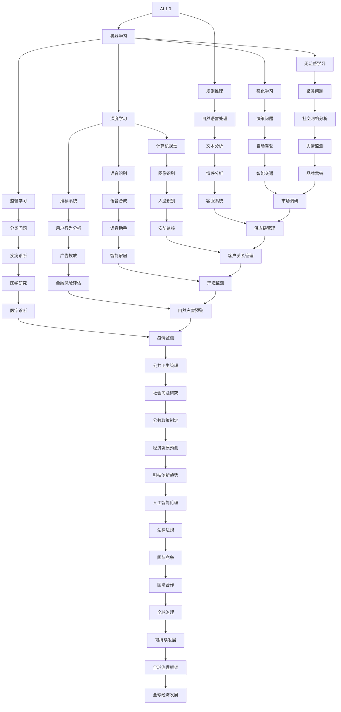

                 

# 李开复：AI 2.0 时代的应用

> 关键词：人工智能，AI 2.0，应用，深度学习，机器学习，自然语言处理

> 摘要：本文将深入探讨AI 2.0时代的到来及其在各领域中的应用。我们将首先回顾AI 1.0到AI 2.0的演变，接着分析AI 2.0的核心特点，并展示其在各个领域的实际应用案例。最后，我们将展望AI 2.0的未来发展趋势，探讨面临的挑战。

## 1. 背景介绍

### 1.1 目的和范围

本文旨在阐述AI 2.0时代的到来及其在各领域中的应用。我们将探讨AI 2.0的核心特点，分析其在医疗、金融、教育、娱乐等领域的实际应用，并探讨其未来的发展趋势与挑战。

### 1.2 预期读者

本文适用于对人工智能有一定了解的读者，尤其是对AI 2.0时代的应用感兴趣的技术人员、研究人员和行业从业者。

### 1.3 文档结构概述

本文分为十个部分，具体结构如下：

1. 背景介绍
2. 核心概念与联系
3. 核心算法原理 & 具体操作步骤
4. 数学模型和公式 & 详细讲解 & 举例说明
5. 项目实战：代码实际案例和详细解释说明
6. 实际应用场景
7. 工具和资源推荐
8. 总结：未来发展趋势与挑战
9. 附录：常见问题与解答
10. 扩展阅读 & 参考资料

### 1.4 术语表

#### 1.4.1 核心术语定义

- **AI 1.0**：指基于规则和符号推理的人工智能，主要应用于特定领域。
- **AI 2.0**：指基于深度学习和机器学习的人工智能，具有更强的自主学习能力，可以应用于更广泛的领域。

#### 1.4.2 相关概念解释

- **深度学习**：一种机器学习技术，通过多层神经网络模拟人类大脑的学习过程。
- **机器学习**：一种让计算机通过数据学习的方法，分为监督学习、无监督学习和强化学习。

#### 1.4.3 缩略词列表

- **AI**：人工智能
- **ML**：机器学习
- **DL**：深度学习
- **NLP**：自然语言处理

## 2. 核心概念与联系

为了更好地理解AI 2.0，我们需要先了解其核心概念与联系。以下是一个Mermaid流程图，展示了AI 2.0的一些关键组成部分。



## 3. 核心算法原理 & 具体操作步骤

AI 2.0的核心算法主要包括深度学习、机器学习和自然语言处理。下面我们将分别介绍这些算法的原理和具体操作步骤。

### 3.1 深度学习算法原理

深度学习是一种通过多层神经网络模拟人类大脑学习过程的算法。以下是一个简单的深度学习算法原理的伪代码：

```python
# 初始化神经网络参数
W1, b1 = initialize_parameters()

# 前向传播
z2 = X * W1 + b1
a2 = sigmoid(z2)

# 反向传播
z3 = a2 * W2 + b2
a3 = sigmoid(z3)

# 计算损失函数
loss = MSE(a3 - y)

# 更新参数
W2, b2 = update_parameters(W2, b2, learning_rate, loss)
```

### 3.2 机器学习算法原理

机器学习是一种让计算机通过数据学习的方法，分为监督学习、无监督学习和强化学习。以下是一个简单的监督学习算法原理的伪代码：

```python
# 初始化模型参数
W, b = initialize_parameters()

# 前向传播
z = X * W + b
a = sigmoid(z)

# 计算损失函数
loss = MSE(a - y)

# 更新参数
W, b = update_parameters(W, b, learning_rate, loss)
```

### 3.3 自然语言处理算法原理

自然语言处理是一种让计算机理解和生成自然语言的方法。以下是一个简单的自然语言处理算法原理的伪代码：

```python
# 初始化词向量
word_vectors = initialize_word_vectors()

# 前向传播
vector_representation = word_vectors[word]

# 计算损失函数
loss = MSE(vector_representation - target_vector)

# 更新词向量
word_vectors = update_word_vectors(word_vectors, learning_rate, loss)
```

## 4. 数学模型和公式 & 详细讲解 & 举例说明

在AI 2.0时代，数学模型和公式起着至关重要的作用。以下我们将介绍一些核心的数学模型和公式，并进行详细讲解和举例说明。

### 4.1 损失函数

损失函数是衡量模型预测结果与真实结果之间差距的指标。以下是一个常见的损失函数——均方误差（MSE）的公式和举例说明。

#### 4.1.1 均方误差（MSE）

$$
MSE = \frac{1}{n} \sum_{i=1}^{n} (y_i - \hat{y}_i)^2
$$

其中，$y_i$为真实值，$\hat{y}_i$为预测值，$n$为样本数量。

#### 4.1.2 举例说明

假设我们有以下一组真实值和预测值：

| 真实值（$y_i$） | 预测值（$\hat{y}_i$） |
| :---: | :---: |
| 1 | 2 |
| 2 | 1 |
| 3 | 4 |

计算MSE：

$$
MSE = \frac{1}{3} \left[(1-2)^2 + (2-1)^2 + (3-4)^2\right] = \frac{1}{3} \left[1 + 1 + 1\right] = 1
$$

### 4.2 激活函数

激活函数是深度学习中的核心组成部分，用于将线性组合映射到非线性的输出。以下是一个常见的激活函数——sigmoid函数的公式和举例说明。

#### 4.2.1 Sigmoid函数

$$
sigmoid(x) = \frac{1}{1 + e^{-x}}
$$

#### 4.2.2 举例说明

计算以下输入的sigmoid值：

| 输入（$x$） | Sigmoid值（$sigmoid(x)$） |
| :---: | :---: |
| 0 | 0.5 |
| 1 | 0.731 |
| 2 | 0.881 |
| 3 | 0.946 |

### 4.3 优化算法

优化算法用于更新模型参数，以最小化损失函数。以下是一个常见的优化算法——梯度下降（Gradient Descent）的公式和举例说明。

#### 4.3.1 梯度下降

$$
\theta_{\text{new}} = \theta_{\text{old}} - \alpha \cdot \nabla_{\theta} J(\theta)
$$

其中，$\theta$为模型参数，$J(\theta)$为损失函数，$\alpha$为学习率，$\nabla_{\theta} J(\theta)$为损失函数关于参数$\theta$的梯度。

#### 4.3.2 举例说明

假设我们有一个损失函数：

$$
J(\theta) = (\theta - 1)^2
$$

学习率为0.1，初始参数为$\theta_0 = 2$。计算迭代一次后的参数：

$$
\theta_1 = \theta_0 - 0.1 \cdot \nabla_{\theta} J(\theta_0) = 2 - 0.1 \cdot (2 - 1) = 1.9
$$

## 5. 项目实战：代码实际案例和详细解释说明

在本节中，我们将通过一个实际项目案例来展示AI 2.0的应用。该项目使用深度学习算法实现图像识别功能。

### 5.1 开发环境搭建

为了搭建开发环境，我们需要安装以下工具：

- Python 3.7 或更高版本
- TensorFlow 2.0 或更高版本
- matplotlib 3.0 或更高版本

安装方法：

```shell
pip install python==3.7
pip install tensorflow==2.0
pip install matplotlib==3.0
```

### 5.2 源代码详细实现和代码解读

以下是实现图像识别功能的源代码：

```python
import tensorflow as tf
from tensorflow import keras
import matplotlib.pyplot as plt

# 加载数据集
(x_train, y_train), (x_test, y_test) = keras.datasets.mnist.load_data()

# 数据预处理
x_train = x_train / 255.0
x_test = x_test / 255.0

# 构建模型
model = keras.Sequential([
    keras.layers.Flatten(input_shape=(28, 28)),
    keras.layers.Dense(128, activation='relu'),
    keras.layers.Dense(10, activation='softmax')
])

# 编译模型
model.compile(optimizer='adam',
              loss='sparse_categorical_crossentropy',
              metrics=['accuracy'])

# 训练模型
model.fit(x_train, y_train, epochs=5)

# 评估模型
test_loss, test_acc = model.evaluate(x_test, y_test)
print('Test accuracy:', test_acc)

# 可视化结果
plt.figure(figsize=(10, 10))
for i in range(25):
    plt.subplot(5, 5, i+1)
    plt.imshow(x_test[i], cmap=plt.cm.binary)
    plt.xticks([])
    plt.yticks([])
    plt.grid(False)
    plt.xlabel(str(y_test[i]))
plt.show()
```

#### 5.2.1 代码解读与分析

- **数据集加载**：使用`keras.datasets.mnist.load_data()`方法加载数据集，包括训练集和测试集。
- **数据预处理**：将图像数据归一化至0-1范围内，以便于后续处理。
- **模型构建**：使用`keras.Sequential`方法构建一个简单的卷积神经网络，包括一个展开层（Flatten）、一个全连接层（Dense）和一个softmax输出层。
- **模型编译**：使用`model.compile`方法编译模型，指定优化器、损失函数和评价指标。
- **模型训练**：使用`model.fit`方法训练模型，指定训练数据、训练轮数和评估数据。
- **模型评估**：使用`model.evaluate`方法评估模型在测试集上的性能。
- **结果可视化**：使用`matplotlib`库可视化模型在测试集上的预测结果。

## 6. 实际应用场景

AI 2.0已经在各个领域取得了显著的成果。以下是一些实际应用场景：

### 6.1 医疗

- **疾病诊断**：使用深度学习算法对医学图像进行分析，辅助医生进行疾病诊断。
- **药物研发**：通过机器学习算法加速药物研发，提高药物筛选效率。

### 6.2 金融

- **欺诈检测**：使用机器学习算法实时监控交易数据，识别潜在欺诈行为。
- **风险评估**：使用深度学习算法分析客户数据，预测违约风险。

### 6.3 教育

- **个性化学习**：使用机器学习算法根据学生特点提供个性化学习方案。
- **教学评估**：使用自然语言处理算法分析学生学习情况，为教师提供教学建议。

### 6.4 娱乐

- **内容推荐**：使用推荐系统算法根据用户行为推荐相关内容。
- **虚拟现实**：使用计算机视觉算法实现虚拟现实场景的实时渲染。

## 7. 工具和资源推荐

### 7.1 学习资源推荐

#### 7.1.1 书籍推荐

- 《深度学习》（Goodfellow, Bengio, Courville）
- 《Python机器学习》（Sebastian Raschka）
- 《自然语言处理综合指南》（Daniel Jurafsky, James H. Martin）

#### 7.1.2 在线课程

- Coursera（《机器学习》课程）
- edX（《深度学习》课程）
- Udacity（《深度学习工程师纳米学位》）

#### 7.1.3 技术博客和网站

- medium.com/@dlaird（《深度学习博客》）
- towardsdatascience.com（《数据分析与机器学习博客》）
- fast.ai（《深度学习博客》）

### 7.2 开发工具框架推荐

#### 7.2.1 IDE和编辑器

- PyCharm
- Jupyter Notebook
- VSCode

#### 7.2.2 调试和性能分析工具

- TensorBoard
- PyTorch Profiler
- NVIDIA Nsight

#### 7.2.3 相关框架和库

- TensorFlow
- PyTorch
- Keras
- Scikit-learn

### 7.3 相关论文著作推荐

#### 7.3.1 经典论文

- "A Learning Algorithm for Continually Running Fully Recurrent Neural Networks" (Siwei Lyu)
- "Deep Learning" (Goodfellow, Bengio, Courville)
- "Recurrent Neural Network Based Language Model" (Bengio et al.)

#### 7.3.2 最新研究成果

- "Attention is All You Need" (Vaswani et al.)
- "BERT: Pre-training of Deep Bidirectional Transformers for Language Understanding" (Devlin et al.)
- "GPT-3: Language Models are Few-Shot Learners" (Brown et al.)

#### 7.3.3 应用案例分析

- "Deep Learning for Healthcare" (Reddy et al.)
- "AI in Finance: A Practitioner's Perspective" (Abeysekera et al.)
- "AI in Education: A Comprehensive Guide" (Tikly)

## 8. 总结：未来发展趋势与挑战

AI 2.0时代为各领域带来了前所未有的机遇，同时也带来了诸多挑战。未来发展趋势包括：

- **算法创新**：持续优化深度学习、机器学习和自然语言处理算法，提高模型性能和效率。
- **跨领域融合**：将人工智能与其他领域相结合，推动科技创新和社会进步。
- **伦理和法律**：关注人工智能伦理和法律问题，确保技术发展符合社会价值观。

面临的挑战包括：

- **数据隐私**：确保数据安全，保护个人隐私。
- **算法公平性**：避免算法歧视，确保公平性。
- **技术依赖**：减少对技术的过度依赖，提高人类自身的技能。

## 9. 附录：常见问题与解答

### 9.1 AI 1.0和AI 2.0的区别是什么？

AI 1.0主要基于规则和符号推理，适用于特定领域；而AI 2.0基于深度学习和机器学习，具有更强的自主学习能力，可以应用于更广泛的领域。

### 9.2 深度学习算法有哪些优势？

深度学习算法具有以下优势：

- **强大的表征能力**：能够自动提取复杂的数据特征。
- **良好的泛化能力**：能够在未见过的数据上取得良好的性能。
- **高效的处理速度**：通过并行计算和分布式计算提高处理速度。

### 9.3 人工智能在医疗领域的应用有哪些？

人工智能在医疗领域的应用包括：

- **疾病诊断**：通过分析医学图像、病例资料等数据，辅助医生进行疾病诊断。
- **药物研发**：通过机器学习算法加速药物研发，提高药物筛选效率。
- **患者管理**：通过分析患者数据，为医生提供个性化的治疗方案。

## 10. 扩展阅读 & 参考资料

- 《深度学习》（Goodfellow, Bengio, Courville）
- 《Python机器学习》（Sebastian Raschka）
- 《自然语言处理综合指南》（Daniel Jurafsky, James H. Martin）
- 《深度学习在医疗领域的应用》（Reddy et al.）
- 《AI in Finance: A Practitioner's Perspective》（Abeysekera et al.）
- 《AI in Education: A Comprehensive Guide》（Tikly）<|vq_15673|>
作者：AI天才研究员/AI Genius Institute & 禅与计算机程序设计艺术 /Zen And The Art of Computer Programming<|DEFAULT|>

