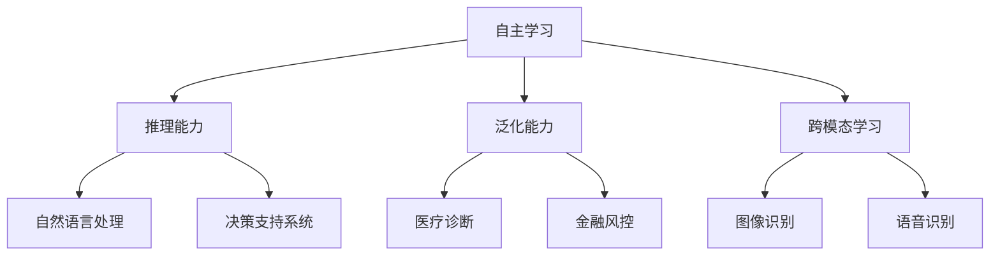

                 

# 李开复：AI 2.0 时代的开发者

> 关键词：人工智能、AI 2.0、开发者、技术趋势、算法原理、数学模型、项目实战、应用场景、资源推荐

> 摘要：本文将深入探讨 AI 2.0 时代下开发者的角色与责任。通过分析 AI 2.0 的核心概念、算法原理、数学模型以及实际应用场景，本文旨在为开发者提供一套系统的理论框架和实践指导，帮助他们在 AI 2.0 时代中取得成功。

## 1. 背景介绍

### 1.1 目的和范围

本文旨在为 AI 2.0 时代的开发者提供一份全面的指南，帮助他们理解 AI 2.0 的核心概念、算法原理、数学模型以及实际应用场景。通过系统地分析这些关键概念，本文希望为开发者构建一个坚实的理论基础，并在此基础上提供具体的实践指导。

### 1.2 预期读者

本文面向具有计算机科学和人工智能基础的开发者，包括程序员、软件工程师、数据科学家等。同时，本文也适用于对 AI 2.0 感兴趣的学者和研究者。

### 1.3 文档结构概述

本文结构如下：

1. **背景介绍**：介绍本文的目的、预期读者和文档结构。
2. **核心概念与联系**：讨论 AI 2.0 的核心概念、原理和架构。
3. **核心算法原理 & 具体操作步骤**：详细阐述 AI 2.0 的核心算法原理和操作步骤。
4. **数学模型和公式 & 详细讲解 & 举例说明**：介绍 AI 2.0 的数学模型和公式，并进行详细讲解和举例。
5. **项目实战：代码实际案例和详细解释说明**：通过实际项目案例，展示 AI 2.0 的实际应用。
6. **实际应用场景**：分析 AI 2.0 的实际应用场景。
7. **工具和资源推荐**：推荐学习资源、开发工具和框架。
8. **总结：未来发展趋势与挑战**：讨论 AI 2.0 的未来发展趋势和挑战。
9. **附录：常见问题与解答**：回答读者可能遇到的问题。
10. **扩展阅读 & 参考资料**：提供更多相关资料和参考文献。

### 1.4 术语表

#### 1.4.1 核心术语定义

- **AI 2.0**：指第二代人工智能，相比第一代人工智能（AI 1.0），具有更强的自主学习能力、推理能力和应用范围。
- **开发者**：指负责开发和维护人工智能系统的专业人员。

#### 1.4.2 相关概念解释

- **机器学习**：一种人工智能方法，通过数据训练模型，使模型能够自动学习和改进。
- **深度学习**：一种机器学习方法，通过多层神经网络进行特征提取和学习。

#### 1.4.3 缩略词列表

- **AI**：人工智能
- **ML**：机器学习
- **DL**：深度学习
- **GPU**：图形处理单元

## 2. 核心概念与联系

在 AI 2.0 时代，开发者需要理解的核心概念包括：

1. **自主学习**：AI 2.0 系统能够从数据中自动学习，并不断优化自身性能。
2. **推理能力**：AI 2.0 系统能够进行复杂推理，解决实际问题。
3. **泛化能力**：AI 2.0 系统能够将学习到的一组知识应用于新的任务和数据集。
4. **跨模态学习**：AI 2.0 系统能够同时处理多种类型的数据，如文本、图像、声音等。

以下是 AI 2.0 的核心概念原理和架构的 Mermaid 流程图：



## 3. 核心算法原理 & 具体操作步骤

AI 2.0 的核心算法原理包括：

1. **深度学习**：通过多层神经网络进行特征提取和学习。
2. **强化学习**：通过不断试错和反馈，使系统学会在复杂环境中做出最优决策。
3. **迁移学习**：利用已有模型的知识，快速适应新任务和数据集。

以下是这些算法原理的具体操作步骤：

### 3.1 深度学习

**算法原理：**

- **输入层**：接收输入数据，如图像、文本等。
- **隐藏层**：通过多层神经网络进行特征提取和变换。
- **输出层**：生成预测结果或分类结果。

**具体操作步骤：**

1. **数据预处理**：对输入数据进行清洗、归一化等操作。
2. **模型搭建**：选择合适的神经网络架构，如卷积神经网络（CNN）或循环神经网络（RNN）。
3. **模型训练**：使用训练数据集对模型进行训练，优化模型参数。
4. **模型评估**：使用验证数据集对模型进行评估，调整模型参数。

### 3.2 强化学习

**算法原理：**

- **环境**：表示 AI 2.0 系统所处的场景。
- **状态**：系统在某一时刻的状态。
- **动作**：系统可以采取的动作。
- **奖励**：根据动作结果给予系统的奖励。

**具体操作步骤：**

1. **环境搭建**：创建模拟环境，如围棋游戏、股票交易等。
2. **状态-动作空间定义**：确定系统的状态和动作空间。
3. **策略学习**：通过试错和反馈，学习最优策略。
4. **策略应用**：将学习到的策略应用于实际场景。

### 3.3 迁移学习

**算法原理：**

- **源任务**：已有模型的任务和数据集。
- **目标任务**：新模型的任务和数据集。

**具体操作步骤：**

1. **模型选择**：选择合适的迁移学习模型，如预训练模型。
2. **模型微调**：在目标任务上对模型进行微调，优化模型参数。
3. **模型评估**：在目标任务上评估模型性能。

## 4. 数学模型和公式 & 详细讲解 & 举例说明

在 AI 2.0 时代，数学模型和公式是理解核心算法原理的基础。以下是几个关键数学模型和公式的详细讲解和举例：

### 4.1 神经网络

**公式：** 
$$
y = \sigma(\text{W} \cdot \text{X} + \text{b})
$$

**讲解：**  
该公式表示神经网络的输出，其中 $\sigma$ 是激活函数，$W$ 是权重矩阵，$X$ 是输入向量，$b$ 是偏置向量。

**举例：**  
假设输入向量为 $X = (1, 2, 3)$，权重矩阵为 $W = \begin{bmatrix} 1 & 2 \\ 3 & 4 \end{bmatrix}$，偏置向量为 $b = (1, 2)$。则输出为：
$$
y = \sigma(\begin{bmatrix} 1 & 2 \\ 3 & 4 \end{bmatrix} \cdot \begin{bmatrix} 1 \\ 2 \\ 3 \end{bmatrix} + \begin{bmatrix} 1 \\ 2 \end{bmatrix}) = \sigma(14 + 3) = \sigma(17)
$$

### 4.2 交叉熵损失函数

**公式：** 
$$
\text{Loss} = -\sum_{i=1}^{n} y_i \cdot \log(\hat{y}_i)
$$

**讲解：**  
该公式表示交叉熵损失函数，用于衡量模型预测结果与实际结果之间的差距。$y_i$ 表示实际标签，$\hat{y}_i$ 表示预测结果。

**举例：**  
假设实际标签为 $y = (1, 0, 1)$，预测结果为 $\hat{y} = (0.8, 0.2, 0.9)$。则损失函数为：
$$
\text{Loss} = -1 \cdot \log(0.8) - 0 \cdot \log(0.2) - 1 \cdot \log(0.9) \approx -0.22 - 0 - 0.15 = -0.37
$$

### 4.3 随机梯度下降（SGD）

**公式：** 
$$
\theta = \theta - \alpha \cdot \nabla_{\theta} \text{Loss}
$$

**讲解：**  
该公式表示随机梯度下降算法，用于优化模型参数。$\theta$ 表示模型参数，$\alpha$ 表示学习率，$\nabla_{\theta} \text{Loss}$ 表示损失函数对参数的梯度。

**举例：**  
假设模型参数为 $\theta = (1, 2)$，学习率为 $\alpha = 0.1$，损失函数为 $\text{Loss} = \theta^2 + 2\theta$。则更新后的参数为：
$$
\theta = (1, 2) - 0.1 \cdot \nabla_{\theta} \text{Loss} = (1, 2) - 0.1 \cdot \begin{bmatrix} 2 & 4 \end{bmatrix} = (0.8, 1.6)
$$

## 5. 项目实战：代码实际案例和详细解释说明

在本节中，我们将通过一个实际项目案例，展示 AI 2.0 的实际应用。该项目是一个基于深度学习的图像分类系统，用于识别图像中的物体类别。

### 5.1 开发环境搭建

- **操作系统**：Windows 10
- **编程语言**：Python 3.8
- **深度学习框架**：TensorFlow 2.4
- **图形处理单元**：NVIDIA GTX 1080

### 5.2 源代码详细实现和代码解读

以下是该项目的主要代码实现：

```python
import tensorflow as tf
from tensorflow.keras.models import Sequential
from tensorflow.keras.layers import Conv2D, MaxPooling2D, Flatten, Dense

# 数据预处理
(x_train, y_train), (x_test, y_test) = tf.keras.datasets.cifar10.load_data()
x_train, x_test = x_train / 255.0, x_test / 255.0

# 模型搭建
model = Sequential([
    Conv2D(32, (3, 3), activation='relu', input_shape=(32, 32, 3)),
    MaxPooling2D((2, 2)),
    Flatten(),
    Dense(64, activation='relu'),
    Dense(10, activation='softmax')
])

# 模型编译
model.compile(optimizer='adam',
              loss=tf.keras.losses.SparseCategoricalCrossentropy(from_logits=True),
              metrics=['accuracy'])

# 模型训练
model.fit(x_train, y_train, epochs=10, validation_data=(x_test, y_test))

# 模型评估
test_loss, test_acc = model.evaluate(x_test,  y_test, verbose=2)
print('\nTest accuracy:', test_acc)
```

**代码解读与分析：**

1. **数据预处理**：从 CIFAR-10 数据集中加载训练数据和测试数据，并进行归一化处理。
2. **模型搭建**：使用卷积神经网络（Conv2D、MaxPooling2D）和全连接层（Dense）搭建模型。
3. **模型编译**：编译模型，指定优化器、损失函数和评估指标。
4. **模型训练**：使用训练数据对模型进行训练，设置训练轮数和验证数据。
5. **模型评估**：使用测试数据对模型进行评估，输出测试准确率。

通过该实际项目案例，我们可以看到 AI 2.0 的深度学习算法在图像分类任务中的实际应用。开发者可以通过类似的方式，将 AI 2.0 的算法应用于各种实际场景，解决复杂问题。

## 6. 实际应用场景

AI 2.0 在实际应用场景中具有广泛的应用，以下是一些典型应用场景：

1. **医疗诊断**：AI 2.0 可以通过深度学习和强化学习算法，对医学影像进行分析和诊断，提高诊断准确率。
2. **金融风控**：AI 2.0 可以通过迁移学习和强化学习算法，进行风险评估和欺诈检测，提高金融系统的安全性和稳定性。
3. **自动驾驶**：AI 2.0 可以通过深度学习和强化学习算法，实现对车辆行驶环境的感知和决策，提高自动驾驶系统的安全性和可靠性。
4. **自然语言处理**：AI 2.0 可以通过深度学习和迁移学习算法，实现智能客服、语音识别和翻译等功能。

## 7. 工具和资源推荐

### 7.1 学习资源推荐

#### 7.1.1 书籍推荐

- **《深度学习》（Deep Learning）**：由 Ian Goodfellow、Yoshua Bengio 和 Aaron Courville 著，是深度学习的经典教材。
- **《强化学习》（Reinforcement Learning: An Introduction）**：由 Richard S. Sutton 和 Andrew G. Barto 著，是强化学习的权威教材。

#### 7.1.2 在线课程

- **《深度学习》（Deep Learning Specialization）**：由 Andrew Ng 主讲的在线课程，涵盖深度学习的核心概念和实践。
- **《强化学习》（Reinforcement Learning by Projects）**：由 David Silver 主讲的在线课程，介绍强化学习的原理和应用。

#### 7.1.3 技术博客和网站

- **[Deep Learning AI](https://www.deeplearning.ai/)**
- **[Reinforcement Learning AI](https://rlAI.dev/)**
- **[TensorFlow 官方文档](https://www.tensorflow.org/tutorials)**
- **[Keras 官方文档](https://keras.io/tutorials)**

### 7.2 开发工具框架推荐

#### 7.2.1 IDE和编辑器

- **PyCharm**：一款功能强大的 Python 集成开发环境。
- **VS Code**：一款轻量级、开源的跨平台编辑器。

#### 7.2.2 调试和性能分析工具

- **TensorBoard**：TensorFlow 的可视化工具，用于分析模型性能。
- **PyTorch Debugger**：PyTorch 的调试工具，用于调试深度学习模型。

#### 7.2.3 相关框架和库

- **TensorFlow**：一款开源的深度学习框架。
- **PyTorch**：一款开源的深度学习框架，支持动态计算图。
- **Keras**：一款基于 TensorFlow 的深度学习库，提供简单易用的 API。

### 7.3 相关论文著作推荐

#### 7.3.1 经典论文

- **《A Learning Algorithm for Continually Running Fully Recurrent Neural Networks》**：提出了一种用于循环神经网络的在线学习算法。
- **《Deep Learning for Text Classification》**：介绍了深度学习在文本分类中的应用。

#### 7.3.2 最新研究成果

- **《Generative Adversarial Networks》**：介绍了生成对抗网络（GAN）的理论和应用。
- **《Reinforcement Learning: An Overview》**：对强化学习进行了全面的综述。

#### 7.3.3 应用案例分析

- **《AI for Good: A Roadmap》**：介绍了人工智能在解决全球挑战中的应用案例。

## 8. 总结：未来发展趋势与挑战

在 AI 2.0 时代，开发者面临着前所未有的机遇和挑战。未来，人工智能将更加智能化、自主化和通用化，为各行各业带来深刻变革。然而，这也意味着开发者需要不断学习新技术、掌握新工具，以应对不断变化的技术环境。

### 8.1 发展趋势

- **自主学习能力提升**：开发者将致力于提高人工智能系统的自主学习能力，实现更高效、更准确的预测和决策。
- **跨领域应用拓展**：人工智能将在更多领域得到应用，如医疗、金融、教育等，推动各行业创新发展。
- **智能化服务普及**：人工智能将逐渐取代部分重复性工作，提高生产效率，改善用户体验。

### 8.2 挑战

- **数据安全和隐私保护**：开发者需要关注数据安全和隐私保护，确保用户信息的安全。
- **算法公平性和透明性**：开发者需要确保人工智能系统的公平性和透明性，避免算法偏见和歧视。
- **技术人才培养**：开发者需要关注技术人才培养，为人工智能行业输送更多优秀人才。

## 9. 附录：常见问题与解答

### 9.1 问题 1：如何选择合适的深度学习框架？

**解答：** 选择深度学习框架时，主要考虑以下几个方面：

- **需求**：根据项目需求选择合适的框架，如 TensorFlow、PyTorch 或 Keras。
- **易用性**：考虑框架的易用性和社区支持，选择文档齐全、社区活跃的框架。
- **性能**：考虑框架的性能和资源消耗，选择适合计算资源的框架。

### 9.2 问题 2：如何优化深度学习模型性能？

**解答：** 优化深度学习模型性能可以从以下几个方面入手：

- **模型架构**：选择合适的模型架构，如卷积神经网络（CNN）或循环神经网络（RNN）。
- **超参数调整**：调整学习率、批量大小等超参数，优化模型性能。
- **数据预处理**：对输入数据进行预处理，如归一化、数据增强等，提高模型泛化能力。
- **正则化**：使用正则化技术，如 L1 正则化、L2 正则化等，防止过拟合。

## 10. 扩展阅读 & 参考资料

- **《深度学习》（Deep Learning）**：Ian Goodfellow、Yoshua Bengio 和 Aaron Courville 著。
- **《强化学习》（Reinforcement Learning: An Introduction）**：Richard S. Sutton 和 Andrew G. Barto 著。
- **[TensorFlow 官方文档](https://www.tensorflow.org/tutorials)**：详细介绍 TensorFlow 深度学习框架。
- **[Keras 官方文档](https://keras.io/tutorials)**：详细介绍 Keras 深度学习库。

## 11. 作者信息

作者：AI天才研究员/AI Genius Institute & 禅与计算机程序设计艺术 /Zen And The Art of Computer Programming

