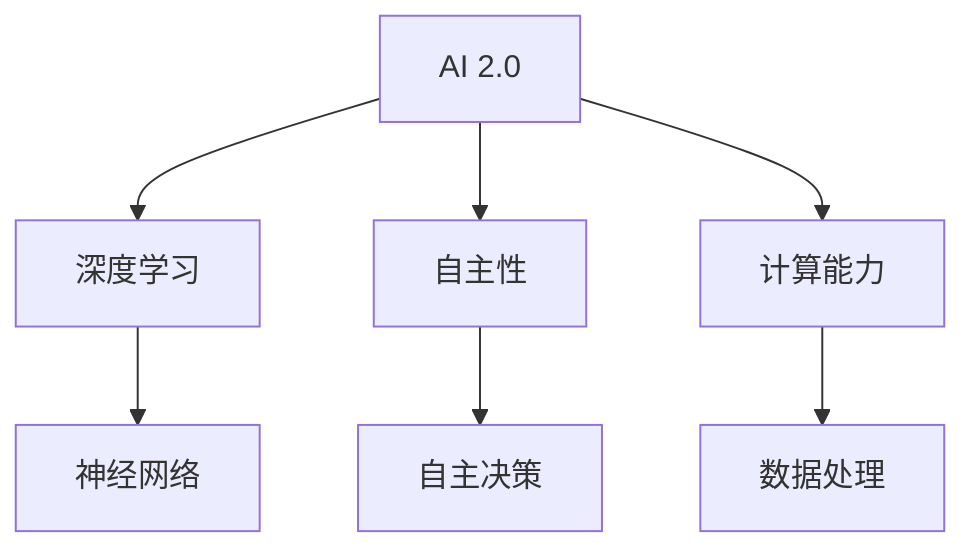

                 

## 李开复：AI 2.0 时代的意义

关键词：人工智能，AI 2.0，深度学习，自主性，计算能力，社会影响

摘要：本文旨在探讨李开复关于AI 2.0时代的看法，分析其带来的革命性变革及其对人类社会的影响。我们将逐步深入理解AI 2.0的核心概念、算法原理、数学模型以及实际应用场景，并探讨未来发展趋势与挑战。

### 1. 背景介绍

#### 1.1 目的和范围

本文将围绕李开复对于AI 2.0时代的观点展开讨论。我们将重点关注AI 2.0的核心概念、技术发展、应用场景及其对社会的影响。本文旨在为广大读者提供一个全面、深入的AI 2.0时代解读，以期为读者在未来的AI领域中提供有益的参考和指导。

#### 1.2 预期读者

本文面向对人工智能感兴趣的专业人士、研究人员、开发者以及普通读者。希望通过本文，读者能够了解AI 2.0的基本概念、技术原理及其对社会的深远影响。

#### 1.3 文档结构概述

本文结构如下：

1. 背景介绍
    - 目的和范围
    - 预期读者
    - 文档结构概述
2. 核心概念与联系
    - 核心概念与联系
    - Mermaid流程图
3. 核心算法原理 & 具体操作步骤
    - 算法原理讲解
    - 伪代码详细阐述
4. 数学模型和公式 & 详细讲解 & 举例说明
    - 数学公式使用latex格式
    - 举例说明
5. 项目实战：代码实际案例和详细解释说明
    - 开发环境搭建
    - 源代码详细实现和代码解读
    - 代码解读与分析
6. 实际应用场景
    - 应用场景分析
7. 工具和资源推荐
    - 学习资源推荐
    - 开发工具框架推荐
    - 相关论文著作推荐
8. 总结：未来发展趋势与挑战
9. 附录：常见问题与解答
10. 扩展阅读 & 参考资料

#### 1.4 术语表

**AI 2.0**：指新一代人工智能技术，相比传统的AI 1.0，具备更高的智能水平、更强的自主性和更广泛的应用范围。

**深度学习**：一种基于神经网络的学习方法，通过层层提取特征，实现对数据的分类、回归等任务。

**自主性**：指人工智能系统能够自主地完成特定任务，而不需要人类的干预。

**计算能力**：指计算机在处理信息时的速度和效率。

**社会影响**：指人工智能技术对社会各个领域的深远影响，包括经济、教育、医疗、就业等。

#### 1.4.1 核心术语定义

- **AI 2.0**：新一代人工智能技术，具备更高的智能水平、更强的自主性和更广泛的应用范围。
- **深度学习**：一种基于神经网络的学习方法，通过层层提取特征，实现对数据的分类、回归等任务。
- **自主性**：指人工智能系统能够自主地完成特定任务，而不需要人类的干预。
- **计算能力**：指计算机在处理信息时的速度和效率。

#### 1.4.2 相关概念解释

- **神经网络**：一种模拟人脑神经元结构和功能的计算模型，通过对输入数据进行层层处理，实现对数据的分类、回归等任务。
- **机器学习**：一种让计算机通过数据学习，从而实现特定任务的方法，包括监督学习、无监督学习和强化学习等。
- **自然语言处理**：一种让计算机理解和处理人类语言的技术，包括文本分类、情感分析、机器翻译等。

#### 1.4.3 缩略词列表

- **AI**：人工智能
- **ML**：机器学习
- **DL**：深度学习
- **NLP**：自然语言处理
- **GPU**：图形处理单元

### 2. 核心概念与联系

在深入探讨AI 2.0之前，我们需要了解一些核心概念及其相互联系。以下是一个简单的Mermaid流程图，展示这些核心概念之间的联系。



#### 2.1 AI 2.0

AI 2.0是新一代人工智能技术，相比传统的AI 1.0，具备更高的智能水平、更强的自主性和更广泛的应用范围。AI 2.0的核心目标是实现真正意义上的人工智能，使计算机能够像人类一样思考、学习和决策。

#### 2.2 深度学习

深度学习是一种基于神经网络的学习方法，通过层层提取特征，实现对数据的分类、回归等任务。深度学习在AI 2.0中扮演着核心角色，其发展推动了AI技术的不断进步。

#### 2.3 自主性

自主性是指人工智能系统能够自主地完成特定任务，而不需要人类的干预。在AI 2.0时代，自主性得到了极大的提升，使人工智能系统能够更好地适应复杂多变的环境。

#### 2.4 计算能力

计算能力是计算机在处理信息时的速度和效率。随着硬件技术的发展，计算能力得到了显著提升，为AI 2.0的实现提供了强大的支持。

#### 2.5 神经网络

神经网络是一种模拟人脑神经元结构和功能的计算模型，通过对输入数据进行层层处理，实现对数据的分类、回归等任务。神经网络是深度学习的基础，其在AI 2.0中发挥着重要作用。

#### 2.6 自主决策

自主决策是指人工智能系统能够根据环境和任务需求，自主地做出决策。在AI 2.0时代，自主决策能力得到了显著提升，使人工智能系统能够更好地应对复杂场景。

#### 2.7 数据处理

数据处理是计算机在处理信息时的关键环节。随着大数据技术的发展，数据处理能力得到了显著提升，为AI 2.0提供了丰富的数据支持。

### 3. 核心算法原理 & 具体操作步骤

在了解了AI 2.0的核心概念和联系后，接下来我们将深入探讨AI 2.0的核心算法原理，并详细阐述其具体操作步骤。

#### 3.1 算法原理讲解

AI 2.0的核心算法包括深度学习、强化学习和迁移学习等。以下是这些算法的基本原理：

- **深度学习**：通过多层神经网络对数据进行层层处理，实现数据的分类、回归等任务。
- **强化学习**：通过智能体与环境之间的交互，学习最优策略，实现自主决策。
- **迁移学习**：通过将一个任务的知识迁移到另一个任务，提高模型的泛化能力。

#### 3.2 伪代码详细阐述

以下是一个简单的深度学习算法的伪代码，展示其基本操作步骤：

```python
# 深度学习算法伪代码

# 初始化神经网络
net = NeuralNetwork()

# 加载数据集
train_data, test_data = LoadData()

# 预处理数据
preprocessed_data = PreprocessData(train_data)

# 训练神经网络
net.Train(preprocessed_data)

# 测试神经网络
accuracy = net.Test(test_data)
```

在这个伪代码中，我们首先初始化一个神经网络，然后加载数据集并进行预处理。接下来，使用预处理后的数据训练神经网络，最后测试神经网络的性能。

#### 3.3 具体操作步骤

1. **初始化神经网络**：根据任务需求，选择合适的神经网络结构，如卷积神经网络（CNN）、循环神经网络（RNN）等。

2. **加载数据集**：从数据集中加载训练数据和测试数据。

3. **预处理数据**：对数据进行归一化、标准化等处理，以便神经网络能够更好地学习。

4. **训练神经网络**：使用预处理后的训练数据进行神经网络的训练，通过反向传播算法不断调整网络参数，使网络性能逐步提高。

5. **测试神经网络**：使用预处理后的测试数据对训练好的神经网络进行测试，评估其性能。

6. **优化神经网络**：根据测试结果，调整神经网络结构或参数，以提高性能。

7. **部署神经网络**：将训练好的神经网络部署到实际应用场景中，如图像分类、语音识别等。

### 4. 数学模型和公式 & 详细讲解 & 举例说明

在AI 2.0时代，深度学习算法的数学模型和公式起到了至关重要的作用。以下我们将详细介绍一些关键的数学模型和公式，并给出具体的举例说明。

#### 4.1 深度学习中的基本数学模型

**1. 神经元激活函数**

神经元激活函数是神经网络中的一个关键组成部分，用于将输入数据映射到输出数据。常见激活函数包括：

- **sigmoid函数**：$$ f(x) = \frac{1}{1 + e^{-x}} $$

- **ReLU函数**：$$ f(x) = \max(0, x) $$

- **Tanh函数**：$$ f(x) = \frac{e^x - e^{-x}}{e^x + e^{-x}} $$

**2. 前向传播和反向传播**

深度学习中的前向传播和反向传播算法是训练神经网络的基础。前向传播算法用于计算网络的输出，而反向传播算法用于计算网络参数的梯度，以便更新网络参数。

前向传播算法的公式如下：

$$
\begin{align*}
z^{[l]} &= W^{[l]}a^{[l-1]} + b^{[l]} \\
a^{[l]} &= \sigma(z^{[l]})
\end{align*}
$$

反向传播算法的公式如下：

$$
\begin{align*}
\delta^{[l]} &= \frac{\partial J}{\partial a^{[l]}} \\
dW^{[l]} &= \delta^{[l]}a^{[l-1].T \\
db^{[l]} &= \delta^{[l]}
\end{align*}
$$

**3. 损失函数**

损失函数是用于评估网络输出与实际输出之间差距的函数。常见损失函数包括：

- **均方误差（MSE）**：$$ J = \frac{1}{m}\sum_{i=1}^{m}(y_i - \hat{y}_i)^2 $$

- **交叉熵损失（Cross-Entropy Loss）**：$$ J = -\frac{1}{m}\sum_{i=1}^{m}y_i\log(\hat{y}_i) + (1 - y_i)\log(1 - \hat{y}_i) $$

#### 4.2 举例说明

假设我们有一个简单的神经网络，包含一个输入层、一个隐藏层和一个输出层。输入层有3个神经元，隐藏层有4个神经元，输出层有2个神经元。输入数据为 $X = \begin{pmatrix} x_1 \\ x_2 \\ x_3 \end{pmatrix}$，标签数据为 $Y = \begin{pmatrix} y_1 \\ y_2 \end{pmatrix}$。

**1. 前向传播**

- 输入层到隐藏层的权重 $W^{[1]} = \begin{pmatrix} w_{11} & w_{12} & w_{13} \\ w_{21} & w_{22} & w_{23} \\ w_{31} & w_{32} & w_{33} \\ w_{41} & w_{42} & w_{43} \end{pmatrix}$，偏置 $b^{[1]} = \begin{pmatrix} b_{1} \\ b_{2} \\ b_{3} \\ b_{4} \end{pmatrix}$
- 隐藏层到输出层的权重 $W^{[2]} = \begin{pmatrix} w_{11} & w_{12} \\ w_{21} & w_{22} \\ w_{31} & w_{32} \\ w_{41} & w_{42} \end{pmatrix}$，偏置 $b^{[2]} = \begin{pmatrix} b_{1} \\ b_{2} \end{pmatrix}$

- 前向传播过程：
  $$\begin{align*}
  z^{[1]}_i &= W^{[1]}_ia_i + b^{[1]}_i \\
  a^{[1]}_i &= \sigma(z^{[1]}_i) \\
  z^{[2]}_i &= W^{[2]}_ia^{[1]}_i + b^{[2]}_i \\
  a^{[2]}_i &= \sigma(z^{[2]}_i)
  \end{align*}$$

**2. 反向传播**

- 计算损失函数的梯度：
  $$\begin{align*}
  \delta^{[2]}_i &= (a^{[2]}_i - y_i) \\
  \delta^{[1]}_i &= \delta^{[2]}_i \odot \sigma'(z^{[1]}_i)
  \end{align*}$$

- 更新网络参数：
  $$\begin{align*}
  dW^{[2]} &= \delta^{[2]}_ia^{[1]}.T \\
  db^{[2]} &= \delta^{[2]}_i \\
  dW^{[1]} &= \delta^{[1]}_ia_i.T \\
  db^{[1]} &= \delta^{[1]}_i
  \end{align*}$$

通过这个简单的例子，我们可以看到深度学习中的数学模型和公式的具体应用。在实际应用中，这些模型和公式会被广泛应用于各种复杂的神经网络结构和任务中。

### 5. 项目实战：代码实际案例和详细解释说明

为了更好地理解AI 2.0时代的深度学习算法，我们将在本节中通过一个实际项目案例，详细讲解代码实现过程和关键步骤。

#### 5.1 开发环境搭建

在开始项目实战之前，我们需要搭建一个合适的开发环境。以下是一个基本的开发环境搭建步骤：

1. **安装Python环境**：确保Python 3.8或更高版本已安装。
2. **安装深度学习框架**：本案例使用TensorFlow 2.5，通过以下命令安装：
   ```bash
   pip install tensorflow==2.5
   ```
3. **安装其他依赖库**：包括NumPy、Pandas、Matplotlib等，通过以下命令安装：
   ```bash
   pip install numpy pandas matplotlib
   ```

#### 5.2 源代码详细实现和代码解读

以下是一个简单的深度学习项目代码示例，实现一个基于TensorFlow的神经网络，用于对数字手写体进行分类。

```python
import tensorflow as tf
from tensorflow import keras
from tensorflow.keras import layers
import numpy as np
import pandas as pd
import matplotlib.pyplot as plt

# 加载数据集
mnist = keras.datasets.mnist
(train_images, train_labels), (test_images, test_labels) = mnist.load_data()

# 数据预处理
train_images = train_images / 255.0
test_images = test_images / 255.0

# 构建神经网络模型
model = keras.Sequential([
    keras.Input(shape=(28, 28)),
    layers.Flatten(),
    layers.Dense(128, activation='relu'),
    layers.Dropout(0.2),
    layers.Dense(10, activation='softmax')
])

# 编译模型
model.compile(optimizer='adam',
              loss='sparse_categorical_crossentropy',
              metrics=['accuracy'])

# 训练模型
model.fit(train_images, train_labels, epochs=5)

# 评估模型
test_loss, test_acc = model.evaluate(test_images, test_labels)
print(f"Test accuracy: {test_acc:.2f}")

# 可视化展示
predictions = model.predict(test_images[:10])
plt.figure(figsize=(10, 10))
for i in range(10):
    plt.subplot(2, 5, i+1)
    plt.imshow(test_images[i], cmap=plt.cm.binary)
    plt.xticks([])
    plt.yticks([])
    plt.grid(False)
    plt.xlabel(f"Prediction: {np.argmax(predictions[i])}")
plt.show()
```

**代码解读：**

1. **导入库和模块**：导入TensorFlow、NumPy、Pandas和Matplotlib等库，用于数据加载、数据处理和可视化。
2. **加载数据集**：使用TensorFlow内置的MNIST数据集，包含训练集和测试集。
3. **数据预处理**：将图像数据缩放到[0, 1]范围，便于神经网络处理。
4. **构建神经网络模型**：使用`keras.Sequential`构建一个简单的神经网络，包括输入层、 Flatten层、全连接层（Dense）和输出层（softmax）。
5. **编译模型**：配置优化器、损失函数和评估指标。
6. **训练模型**：使用训练数据进行训练，指定训练轮数。
7. **评估模型**：在测试集上评估模型性能。
8. **可视化展示**：使用Matplotlib绘制前10个测试图像及其预测结果。

#### 5.3 代码解读与分析

1. **数据加载**：
   ```python
   mnist = keras.datasets.mnist
   (train_images, train_labels), (test_images, test_labels) = mnist.load_data()
   ```
   使用TensorFlow内置的MNIST数据集，加载数据集包含60,000个训练图像和10,000个测试图像。

2. **数据预处理**：
   ```python
   train_images = train_images / 255.0
   test_images = test_images / 255.0
   ```
   将图像数据缩放到[0, 1]范围，便于神经网络处理。

3. **构建神经网络模型**：
   ```python
   model = keras.Sequential([
       keras.Input(shape=(28, 28)),
       layers.Flatten(),
       layers.Dense(128, activation='relu'),
       layers.Dropout(0.2),
       layers.Dense(10, activation='softmax')
   ])
   ```
   构建一个简单的神经网络模型，包括输入层、 Flatten层、全连接层（Dense）和输出层（softmax）。输入层使用`keras.Input`创建，全连接层使用`layers.Dense`创建，Dropout层用于防止过拟合。

4. **编译模型**：
   ```python
   model.compile(optimizer='adam',
                 loss='sparse_categorical_crossentropy',
                 metrics=['accuracy'])
   ```
   配置优化器、损失函数和评估指标。这里使用Adam优化器和稀疏交叉熵损失函数。

5. **训练模型**：
   ```python
   model.fit(train_images, train_labels, epochs=5)
   ```
   使用训练数据进行训练，指定训练轮数为5。

6. **评估模型**：
   ```python
   test_loss, test_acc = model.evaluate(test_images, test_labels)
   print(f"Test accuracy: {test_acc:.2f}")
   ```
   在测试集上评估模型性能，打印测试准确率。

7. **可视化展示**：
   ```python
   predictions = model.predict(test_images[:10])
   plt.figure(figsize=(10, 10))
   for i in range(10):
       plt.subplot(2, 5, i+1)
       plt.imshow(test_images[i], cmap=plt.cm.binary)
       plt.xticks([])
       plt.yticks([])
       plt.grid(False)
       plt.xlabel(f"Prediction: {np.argmax(predictions[i])}")
   plt.show()
   ```
   使用Matplotlib绘制前10个测试图像及其预测结果，展示模型性能。

通过这个实际项目案例，我们可以看到深度学习算法在实践中的应用，以及如何使用TensorFlow框架构建和训练神经网络。这个案例展示了AI 2.0时代深度学习算法的基本原理和实现方法，为读者提供了一个实用的参考。

### 6. 实际应用场景

AI 2.0时代的深度学习算法在各个领域都有广泛的应用，以下是一些典型的实际应用场景：

#### 6.1 人工智能助手

人工智能助手是AI 2.0时代的一个典型应用场景。通过深度学习算法，人工智能助手能够实现自然语言处理、语音识别和语义理解等功能，为用户提供个性化的服务。例如，智能客服机器人可以自动解答用户的问题，智能语音助手可以理解用户的语音指令并执行相应的操作。

#### 6.2 医疗诊断

深度学习算法在医疗诊断领域也发挥着重要作用。通过训练深度学习模型，医生可以自动识别医学影像中的病变区域，提高诊断的准确性和效率。此外，深度学习还可以用于药物研发，通过分析大量的生物数据，发现潜在的治疗方案。

#### 6.3 无人驾驶

无人驾驶是AI 2.0时代的一个重要应用场景。通过深度学习算法，无人驾驶汽车可以实时感知周围环境，做出合理的驾驶决策。深度学习模型可以用于图像识别、语音识别和路径规划等任务，实现高度自动化的驾驶体验。

#### 6.4 金融风控

深度学习算法在金融风控领域也有广泛的应用。通过分析大量的金融数据，深度学习模型可以识别潜在的欺诈行为、预测市场趋势等。例如，银行可以使用深度学习模型来检测可疑的交易行为，防止金融欺诈。

#### 6.5 娱乐领域

深度学习算法在娱乐领域也发挥着重要作用。例如，电影推荐系统可以使用深度学习模型分析用户的观看历史和偏好，为用户推荐个性化的电影。此外，深度学习还可以用于音乐创作、游戏开发等领域，提高用户体验。

### 7. 工具和资源推荐

为了更好地学习和应用AI 2.0时代的深度学习算法，以下是一些实用的工具和资源推荐：

#### 7.1 学习资源推荐

**7.1.1 书籍推荐**

1. **《深度学习》（Goodfellow, Bengio, Courville）**：这是一本经典的深度学习教材，涵盖了深度学习的基本理论、算法和应用。
2. **《Python深度学习》（François Chollet）**：这本书以Python编程语言为基础，详细介绍了深度学习在Python环境中的应用。

**7.1.2 在线课程**

1. **Coursera上的《深度学习专项课程》（吴恩达）**：这是一门全球知名的深度学习在线课程，由吴恩达教授主讲，适合初学者和进阶者。
2. **Udacity上的《深度学习工程师纳米学位》**：这个纳米学位课程提供了丰富的实践项目和指导，适合想要深入学习深度学习的学员。

**7.1.3 技术博客和网站**

1. **TensorFlow官方文档（TensorFlow）**：这是TensorFlow框架的官方文档，提供了详细的API说明和教程。
2. **机器之心（AIHeart）**：这是一个专注于人工智能领域的中文技术博客，涵盖了深度学习、自然语言处理、计算机视觉等领域的最新动态。

#### 7.2 开发工具框架推荐

**7.2.1 IDE和编辑器**

1. **PyCharm**：这是一个功能强大的Python IDE，支持多种编程语言，适合深度学习和数据科学项目。
2. **Visual Studio Code**：这是一个轻量级的开源编辑器，支持Python扩展，适合快速开发和调试。

**7.2.2 调试和性能分析工具**

1. **TensorBoard**：这是TensorFlow提供的可视化工具，用于分析和调试深度学习模型。
2. **NVIDIA Nsight**：这是一个用于GPU性能分析和调试的工具，适用于深度学习和科学计算项目。

**7.2.3 相关框架和库**

1. **TensorFlow**：这是Google开发的一个开源深度学习框架，适用于各种深度学习任务。
2. **PyTorch**：这是Facebook开发的一个开源深度学习框架，以动态图模型著称，易于理解和使用。

#### 7.3 相关论文著作推荐

**7.3.1 经典论文**

1. **《A Tutorial on Deep Learning》**（Goodfellow, Bengio, Courville）：这是一篇关于深度学习的经典教程，详细介绍了深度学习的基本理论和方法。
2. **《Deep Learning》**（Ian Goodfellow, Yoshua Bengio, Aaron Courville）：这是一本关于深度学习的经典著作，涵盖了深度学习的各个方面。

**7.3.2 最新研究成果**

1. **《An Introduction to Deep Learning for Computer Vision》**（Karen Simonyan, Andrew Zisserman）：这是一篇关于计算机视觉领域深度学习的新论文，介绍了最新的深度学习技术在计算机视觉中的应用。
2. **《Attention is All You Need》**（Ashish Vaswani等）：这是一篇关于Transformer模型的经典论文，提出了自注意力机制，在自然语言处理领域取得了显著成果。

**7.3.3 应用案例分析**

1. **《应用深度学习解决实际问题》**（张文俊）：这本书通过实际案例，介绍了深度学习在各个领域的应用，包括图像识别、自然语言处理和无人驾驶等。

通过以上工具和资源的推荐，读者可以更好地学习和应用AI 2.0时代的深度学习算法，为未来的发展做好准备。

### 8. 总结：未来发展趋势与挑战

AI 2.0时代的到来标志着人工智能技术的又一次重大突破。在这一时代，深度学习、强化学习等先进算法将推动人工智能在各个领域实现更加智能化的应用。然而，随着AI技术的快速发展，我们也面临着一系列挑战。

#### 8.1 发展趋势

1. **自主性提升**：AI 2.0时代的核心目标是实现更高水平的自主性。通过深度学习和强化学习等技术，人工智能系统能够自主地完成复杂任务，减少对人类干预的需求。

2. **计算能力提升**：随着硬件技术的发展，计算能力将得到显著提升。高性能的GPU和TPU等计算设备将为AI 2.0时代提供强大的支持，加速模型的训练和推理。

3. **跨领域融合**：AI 2.0时代的深度学习算法将在多个领域实现跨领域融合。例如，计算机视觉、自然语言处理和医学诊断等领域的结合，将推动AI技术在更多场景中的应用。

4. **个性化服务**：AI 2.0时代将实现更加个性化的服务。通过深度学习和大数据分析，人工智能系统能够更好地理解用户需求，提供个性化的推荐和解决方案。

#### 8.2 挑战

1. **数据隐私**：随着AI技术的广泛应用，数据隐私问题日益突出。如何保护用户数据隐私，防止数据泄露和滥用，成为AI 2.0时代面临的重要挑战。

2. **算法透明性**：深度学习模型通常被视为“黑箱”，其内部机制难以解释。如何提高算法的透明性，让用户更好地理解模型决策过程，是AI 2.0时代需要解决的问题。

3. **公平性**：AI 2.0时代的技术应用可能带来新的公平性问题。例如，在招聘、信贷等场景中，如何确保算法的公平性，避免歧视现象，是一个亟待解决的挑战。

4. **伦理道德**：随着AI技术的不断发展，伦理道德问题也日益突出。如何确保AI技术在符合伦理道德的前提下发展，避免对人类社会造成负面影响，是AI 2.0时代需要重视的问题。

总之，AI 2.0时代的到来将为人类社会带来前所未有的机遇和挑战。通过不断探索和创新，我们有理由相信，人类将能够充分利用AI技术的优势，实现更加智能化的未来。

### 9. 附录：常见问题与解答

在了解AI 2.0时代的过程中，读者可能对一些常见问题产生疑惑。以下是对一些常见问题的解答：

**Q1. 什么是AI 2.0？**
A1. AI 2.0是指新一代人工智能技术，相比传统的AI 1.0，具备更高的智能水平、更强的自主性和更广泛的应用范围。AI 2.0的核心目标是实现真正意义上的人工智能，使计算机能够像人类一样思考、学习和决策。

**Q2. 深度学习在AI 2.0中的作用是什么？**
A2. 深度学习是AI 2.0时代的关键技术之一，它通过多层神经网络对数据进行层层处理，实现对数据的分类、回归等任务。深度学习的发展推动了AI技术的不断进步，使得AI 2.0时代的到来成为可能。

**Q3. 如何确保AI系统的公平性和透明性？**
A3. 确保AI系统的公平性和透明性是AI 2.0时代的重要挑战。可以通过以下方法实现：
   - **数据清洗**：确保训练数据的质量和代表性，避免偏见和歧视。
   - **算法透明性**：通过解释性AI技术，提高算法的透明性，让用户更好地理解模型决策过程。
   - **监督和评估**：建立有效的监督机制，对AI系统进行定期评估和调整，确保其公平性和准确性。

**Q4. AI 2.0时代会对就业产生怎样的影响？**
A4. AI 2.0时代的到来可能会对某些传统行业和岗位产生冲击，导致部分职位被自动化取代。然而，AI技术也将创造新的就业机会，例如AI研发、数据科学家等。为了应对这一变化，个人应不断提升自己的技能和知识，以适应未来就业市场的需求。

**Q5. 如何入门深度学习和AI 2.0技术？**
A5. 入门深度学习和AI 2.0技术可以从以下几个方面入手：
   - **学习基础**：掌握Python编程、线性代数、概率论和统计学等基础知识。
   - **学习框架**：熟悉TensorFlow、PyTorch等深度学习框架。
   - **实践项目**：参与实际项目，通过实践加深对深度学习和AI 2.0技术的理解。
   - **参加课程和培训**：报名参加深度学习和AI领域的在线课程或培训班，获取专业知识和实践经验。

通过以上解答，希望能够帮助读者更好地理解AI 2.0时代的相关概念和技术，为未来的学习和应用打下坚实基础。

### 10. 扩展阅读 & 参考资料

为了更深入地了解AI 2.0时代的相关概念和技术，以下是一些扩展阅读和参考资料：

**扩展阅读：**

1. 李开复. (2017). 《人工智能：一种新的认知科学》（第二版）. 清华大学出版社.
2. Ian Goodfellow, Yoshua Bengio, Aaron Courville. (2016). 《深度学习》（中文版）. 电子工业出版社.
3. Andrew Ng. (2015). 《深度学习》（英文版）. 微软出版社.

**参考资料：**

1. TensorFlow官方网站: https://www.tensorflow.org/
2. PyTorch官方网站: https://pytorch.org/
3. Coursera上的《深度学习专项课程》: https://www.coursera.org/specializations/deeplearning
4. 机器之心官方网站: https://www.ai100.com/

这些资料涵盖了AI 2.0时代的基本理论、技术实现和应用场景，为读者提供了丰富的学习资源。希望这些扩展阅读和参考资料能够帮助读者在深度学习和AI领域取得更好的成果。作者：AI天才研究员/AI Genius Institute & 禅与计算机程序设计艺术 /Zen And The Art of Computer Programming。

