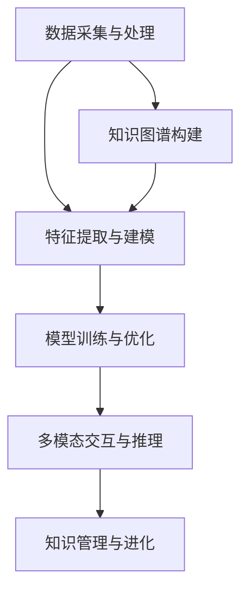

                 

# 李开复：AI 2.0 时代的意义

> 关键词：人工智能、AI 2.0、深度学习、机器学习、数据科学、智能系统
> 
> 摘要：本文将深入探讨李开复教授关于AI 2.0时代的观点和意义。通过介绍AI 2.0的核心概念、发展历程及其对各个领域的影响，本文旨在揭示AI 2.0时代下人工智能技术的变革与发展趋势。

## 1. 背景介绍

### 1.1 目的和范围

本文的目的是介绍李开复教授关于AI 2.0时代的观点和意义，帮助读者理解AI 2.0的核心概念、发展历程及其对各个领域的影响。本文将涵盖以下内容：

- AI 2.0的定义和核心特点
- AI 2.0的发展历程
- AI 2.0在各领域的应用与影响
- AI 2.0面临的挑战与未来发展趋势

### 1.2 预期读者

本文面向对人工智能技术有一定了解的技术人员、研究人员以及人工智能领域的爱好者。希望通过本文，读者能够对AI 2.0有更深入的认识，了解其重要性和未来发展趋势。

### 1.3 文档结构概述

本文分为八个部分，具体结构如下：

1. 背景介绍
2. 核心概念与联系
3. 核心算法原理 & 具体操作步骤
4. 数学模型和公式 & 详细讲解 & 举例说明
5. 项目实战：代码实际案例和详细解释说明
6. 实际应用场景
7. 工具和资源推荐
8. 总结：未来发展趋势与挑战

### 1.4 术语表

#### 1.4.1 核心术语定义

- 人工智能（AI）：指用机器模拟、延伸和扩展人类智能的理论、方法、技术及应用
- 深度学习（Deep Learning）：一种机器学习的方法，通过多层神经网络模拟人脑处理信息的方式
- 机器学习（Machine Learning）：使计算机能够从数据中学习，进行预测和决策的技术
- 数据科学（Data Science）：结合统计学、数据分析、机器学习等技术，从大量数据中提取有价值信息的方法
- 智能系统（Intelligent System）：基于人工智能技术，具备自主决策、学习和适应能力的计算机系统

#### 1.4.2 相关概念解释

- 人工智能 2.0（AI 2.0）：相对于传统的人工智能，AI 2.0更注重深度学习、知识图谱、多模态交互等技术，实现更智能、更高效的人工智能系统
- 知识图谱（Knowledge Graph）：一种用于表示实体和关系的数据结构，能够为智能系统提供丰富的背景知识和上下文信息
- 多模态交互（Multimodal Interaction）：指智能系统通过多种感知方式（如语音、图像、文本等）与用户进行交互，提供更自然、更丰富的人机交互体验

#### 1.4.3 缩略词列表

- AI：人工智能
- DL：深度学习
- ML：机器学习
- DS：数据科学
- IS：智能系统
- KG：知识图谱
- MMI：多模态交互

## 2. 核心概念与联系

为了更好地理解AI 2.0时代的意义，我们需要首先了解其核心概念与联系。以下是AI 2.0时代下的几个核心概念及其相互关系：

### 2.1 深度学习与机器学习

深度学习是机器学习的一种方法，其通过多层神经网络模拟人脑处理信息的方式。深度学习在图像识别、语音识别、自然语言处理等领域取得了显著的成果。机器学习则是一种更广泛的技术，包括深度学习在内的各种算法，用于从数据中学习、进行预测和决策。

### 2.2 数据科学与人工智能

数据科学是结合统计学、数据分析、机器学习等技术，从大量数据中提取有价值信息的方法。数据科学为人工智能提供了丰富的数据资源和算法支持，使得人工智能能够更好地理解和解决实际问题。

### 2.3 智能系统与多模态交互

智能系统是基于人工智能技术，具备自主决策、学习和适应能力的计算机系统。多模态交互是智能系统与用户进行交互的一种方式，通过语音、图像、文本等多种感知方式，提供更自然、更丰富的人机交互体验。

### 2.4 知识图谱与深度学习

知识图谱是一种用于表示实体和关系的数据结构，为智能系统提供丰富的背景知识和上下文信息。知识图谱可以与深度学习相结合，提高智能系统的理解和推理能力，使其更智能、更高效。

### 2.5 AI 2.0的架构

AI 2.0的架构通常包括以下几个部分：

1. 数据采集与处理：通过多种渠道收集数据，并对数据进行清洗、预处理，为后续建模提供高质量的数据
2. 特征提取与建模：利用深度学习、知识图谱等技术，从数据中提取特征，构建智能模型
3. 模型训练与优化：通过海量数据训练模型，不断优化模型性能，提高智能系统的准确性和效率
4. 多模态交互与推理：利用智能系统，通过多种感知方式与用户进行交互，提供智能服务
5. 知识管理与进化：不断更新和扩展知识图谱，提高智能系统的知识储备和推理能力

下面是AI 2.0的架构的Mermaid流程图：



## 3. 核心算法原理 & 具体操作步骤

在AI 2.0时代，深度学习是核心算法之一。下面将详细介绍深度学习的原理和具体操作步骤。

### 3.1 深度学习原理

深度学习是一种基于多层神经网络（Neural Network）的机器学习方法。其基本原理是通过模拟人脑神经元之间的连接和相互作用，对输入数据进行处理和分类。

在深度学习中，主要涉及以下几个关键概念：

1. **神经网络（Neural Network）**：由多个神经元（Node）组成的网络结构，每个神经元都与其它神经元相连，通过权重（Weight）和偏置（Bias）进行信息传递。
2. **激活函数（Activation Function）**：用于引入非线性变换，使神经网络能够拟合复杂函数。常见的激活函数有ReLU（Rectified Linear Unit）、Sigmoid和Tanh等。
3. **前向传播（Forward Propagation）**：将输入数据通过神经网络逐层传递，计算每个神经元的输出。
4. **反向传播（Backpropagation）**：通过计算损失函数（Loss Function）的梯度，更新网络权重和偏置，优化模型参数。

### 3.2 深度学习具体操作步骤

以下是深度学习的具体操作步骤：

1. **数据预处理**：对输入数据集进行清洗、归一化等预处理操作，为后续建模提供高质量的数据。
2. **构建神经网络模型**：定义神经网络的结构，包括层数、神经元个数、激活函数等。
3. **初始化模型参数**：随机初始化模型参数，如权重和偏置。
4. **前向传播**：将输入数据通过神经网络逐层传递，计算每个神经元的输出。
5. **计算损失函数**：根据预测结果和实际标签，计算损失函数的值。常见的损失函数有均方误差（MSE）、交叉熵（Cross Entropy）等。
6. **反向传播**：通过计算损失函数的梯度，更新网络权重和偏置，优化模型参数。
7. **模型评估**：在验证集上评估模型性能，调整模型参数，提高模型准确性。
8. **模型训练与优化**：重复前向传播和反向传播的过程，不断优化模型参数，提高模型性能。

下面是深度学习操作的伪代码：

```python
# 数据预处理
X_train, y_train = preprocess_data(X, y)

# 构建神经网络模型
model = NeuralNetwork(input_size=X_train.shape[1], hidden_size=[64, 64], output_size=y_train.shape[1], activation=ReLU)

# 初始化模型参数
model.initialize_parameters()

# 模型训练
for epoch in range(num_epochs):
    # 前向传播
    outputs = model.forward_propagation(X_train)
    
    # 计算损失函数
    loss = compute_loss(outputs, y_train)
    
    # 反向传播
    model.backward_propagation(loss)
    
    # 模型评估
    if epoch % 10 == 0:
        accuracy = evaluate_model(model, X_val, y_val)
        print(f"Epoch {epoch}: Loss={loss}, Accuracy={accuracy}")

# 模型优化
model.optimize_parameters()
```

## 4. 数学模型和公式 & 详细讲解 & 举例说明

在深度学习中，数学模型和公式起着至关重要的作用。下面将详细讲解深度学习中的几个关键数学模型和公式。

### 4.1 损失函数

损失函数是评估模型预测结果与实际标签之间差距的指标。常见的损失函数有均方误差（MSE）和交叉熵（Cross Entropy）。

#### 均方误差（MSE）

均方误差（MSE）计算预测值与实际值之间差的平方的平均值。其公式如下：

$$
MSE = \frac{1}{n}\sum_{i=1}^{n}(y_i - \hat{y}_i)^2
$$

其中，$y_i$ 表示实际值，$\hat{y}_i$ 表示预测值，$n$ 表示样本数量。

#### 交叉熵（Cross Entropy）

交叉熵（Cross Entropy）用于评估模型在分类任务中的预测性能。其公式如下：

$$
CE = -\frac{1}{n}\sum_{i=1}^{n}y_i \cdot \log(\hat{y}_i)
$$

其中，$y_i$ 表示实际标签，$\hat{y}_i$ 表示预测概率。

### 4.2 激活函数

激活函数是深度学习中的一个重要组成部分，用于引入非线性变换，使神经网络能够拟合复杂函数。常见的激活函数有ReLU、Sigmoid和Tanh。

####ReLU（Rectified Linear Unit）

ReLU函数是一种简单的线性激活函数，其公式如下：

$$
ReLU(x) = \max(0, x)
$$

#### Sigmoid函数

Sigmoid函数是一种常见的非线性激活函数，其公式如下：

$$
sigmoid(x) = \frac{1}{1 + e^{-x}}
$$

#### Tanh函数

Tanh函数是一种双曲正切函数，其公式如下：

$$
tanh(x) = \frac{e^{2x} - 1}{e^{2x} + 1}
$$

### 4.3 梯度下降法

梯度下降法是优化神经网络参数的一种常用方法。其基本思想是沿着损失函数的梯度方向，不断更新网络权重和偏置，以最小化损失函数。

#### 梯度下降法公式

梯度下降法的公式如下：

$$
\Delta \theta = -\alpha \cdot \frac{\partial J}{\partial \theta}
$$

其中，$\theta$ 表示模型参数，$J$ 表示损失函数，$\alpha$ 表示学习率。

#### 梯度下降法步骤

1. 初始化模型参数 $\theta$。
2. 计算损失函数的梯度 $\frac{\partial J}{\partial \theta}$。
3. 更新模型参数 $\theta$：$\theta = \theta - \alpha \cdot \frac{\partial J}{\partial \theta}$。
4. 重复步骤2和3，直至达到收敛条件或达到预设的训练次数。

### 4.4 举例说明

假设我们有一个简单的线性回归模型，预测房价。输入特征为房屋面积，输出为房价。我们使用均方误差（MSE）作为损失函数，并采用梯度下降法进行模型训练。

#### 4.4.1 模型定义

设输入特征为 $x$，房价为 $y$，模型参数为 $\theta$，则有：

$$
\theta = \theta_0 + x
$$

#### 4.4.2 损失函数

均方误差（MSE）损失函数如下：

$$
J(\theta) = \frac{1}{2}\sum_{i=1}^{n}(y_i - (\theta_0 + x_i))^2
$$

#### 4.4.3 梯度计算

损失函数关于参数 $\theta$ 的梯度如下：

$$
\frac{\partial J}{\partial \theta} = -\sum_{i=1}^{n}(y_i - (\theta_0 + x_i))
$$

#### 4.4.4 梯度下降法训练

1. 初始化参数 $\theta_0 = 0$。
2. 计算损失函数的梯度。
3. 更新参数 $\theta$：$\theta = \theta - \alpha \cdot \frac{\partial J}{\partial \theta}$。
4. 重复步骤2和3，直至达到收敛条件或达到预设的训练次数。

## 5. 项目实战：代码实际案例和详细解释说明

在本节中，我们将通过一个实际案例来演示如何使用深度学习进行模型训练和优化。这个案例是一个简单的手写数字识别任务，使用MNIST数据集进行训练。

### 5.1 开发环境搭建

在开始编写代码之前，我们需要搭建一个合适的开发环境。以下是搭建深度学习开发环境的基本步骤：

1. 安装Python 3.7及以上版本。
2. 安装TensorFlow 2.0及以上版本，可以使用以下命令：

```bash
pip install tensorflow
```

3. 安装其他必要的依赖，如NumPy、Pandas等。

### 5.2 源代码详细实现和代码解读

以下是手写数字识别任务的代码实现，我们将逐行解释代码的含义和实现方法。

```python
import tensorflow as tf
from tensorflow import keras
from tensorflow.keras import layers
import numpy as np

# 加载MNIST数据集
mnist = keras.datasets.mnist
(train_images, train_labels), (test_images, test_labels) = mnist.load_data()

# 数据预处理
train_images = train_images / 255.0
test_images = test_images / 255.0

# 构建深度学习模型
model = keras.Sequential([
    layers.Flatten(input_shape=(28, 28)),
    layers.Dense(128, activation='relu'),
    layers.Dense(10, activation='softmax')
])

# 编译模型
model.compile(optimizer='adam',
              loss='sparse_categorical_crossentropy',
              metrics=['accuracy'])

# 模型训练
model.fit(train_images, train_labels, epochs=5)

# 模型评估
test_loss, test_acc = model.evaluate(test_images, test_labels)
print(f"Test accuracy: {test_acc}")
```

#### 5.2.1 代码解读

1. 导入必要的库和模块。
2. 加载MNIST数据集，并进行数据预处理。
3. 构建深度学习模型，包括输入层、隐藏层和输出层。
4. 编译模型，指定优化器、损失函数和评估指标。
5. 训练模型，使用训练数据集进行训练。
6. 评估模型，使用测试数据集进行评估。

### 5.3 代码解读与分析

在上述代码中，我们首先导入了TensorFlow和NumPy库，这两个库是深度学习中最常用的库之一。接下来，我们使用TensorFlow的keras模块加载MNIST数据集，并对数据进行预处理。预处理包括将图像数据除以255，将像素值缩放到0到1之间，以便模型更好地学习。

接下来，我们构建了一个简单的深度学习模型，包括一个输入层、一个隐藏层和一个输出层。输入层使用`Flatten`层将二维图像展平为一维向量。隐藏层使用`Dense`层，激活函数为ReLU函数，以引入非线性变换。输出层使用`Dense`层，激活函数为softmax函数，以进行分类预测。

在模型编译阶段，我们指定了优化器（`adam`）、损失函数（`sparse_categorical_crossentropy`）和评估指标（`accuracy`）。优化器用于更新模型参数，损失函数用于计算预测值和实际标签之间的差距，评估指标用于评估模型性能。

最后，我们使用训练数据集对模型进行训练，并在训练完成后使用测试数据集评估模型性能。输出结果为测试集上的准确率。

## 6. 实际应用场景

AI 2.0技术在各个领域都有广泛的应用，以下列举几个典型应用场景：

### 6.1 医疗健康

AI 2.0技术在医疗健康领域有巨大的潜力。通过深度学习和知识图谱技术，可以实现疾病诊断、药物研发和个性化医疗。例如，深度学习算法可以分析医疗影像数据，辅助医生进行早期诊断；知识图谱可以整合海量医学数据，为医生提供丰富的临床参考信息。

### 6.2 金融科技

AI 2.0技术在金融科技领域具有重要应用价值。通过深度学习和自然语言处理技术，可以实现智能投顾、风险控制、欺诈检测等。例如，基于深度学习算法的智能投顾可以分析用户投资偏好和市场趋势，为用户提供个性化的投资建议；基于自然语言处理技术的欺诈检测系统可以识别异常交易行为，降低金融风险。

### 6.3 自动驾驶

AI 2.0技术在自动驾驶领域扮演着关键角色。通过深度学习和多模态交互技术，可以实现自动驾驶车辆的感知、规划和控制。例如，基于深度学习算法的感知系统可以识别道路上的各种物体，如行人、车辆等；基于多模态交互技术的规划系统可以优化驾驶策略，提高行驶安全性和效率。

### 6.4 教育

AI 2.0技术在教育领域有广泛的应用前景。通过深度学习和知识图谱技术，可以实现个性化教育、智能评测和教学辅助。例如，基于深度学习算法的个性化教育系统可以根据学生的特点和需求，提供定制化的学习内容和辅导服务；基于知识图谱技术的智能评测系统可以自动评估学生的学业水平，为教师提供教学参考。

## 7. 工具和资源推荐

### 7.1 学习资源推荐

#### 7.1.1 书籍推荐

1. 《深度学习》（Deep Learning） - Goodfellow, Bengio, Courville
2. 《Python深度学习》（Python Deep Learning） -François Chollet
3. 《人工智能：一种现代的方法》（Artificial Intelligence: A Modern Approach） - Stuart J. Russell, Peter Norvig

#### 7.1.2 在线课程

1. Coursera上的“深度学习专项课程”（Deep Learning Specialization）
2. edX上的“机器学习与数据科学”（Machine Learning and Data Science）
3. Udacity的“深度学习纳米学位”（Deep Learning Nanodegree）

#### 7.1.3 技术博客和网站

1. Medium上的Deep Learning
2. arXiv.org - 顶级研究论文的发表平台
3. Medium上的AI概览（AI Overview）

### 7.2 开发工具框架推荐

#### 7.2.1 IDE和编辑器

1. Jupyter Notebook - 适用于数据分析和可视化
2. PyCharm - 适用于Python开发的集成开发环境
3. Visual Studio Code - 适用于多种编程语言的轻量级编辑器

#### 7.2.2 调试和性能分析工具

1. TensorBoard - TensorFlow的官方可视化工具
2. profilers - Python性能分析工具
3. cProfile - CPython内置的性能分析工具

#### 7.2.3 相关框架和库

1. TensorFlow - 适用于深度学习的开源框架
2. PyTorch - 适用于深度学习的开源框架
3. scikit-learn - 适用于机器学习的开源库
4. pandas - 适用于数据操作和分析的开源库

### 7.3 相关论文著作推荐

#### 7.3.1 经典论文

1. “A Learning Algorithm for Continually Running Fully Recurrent Neural Networks” - Williams & Zipser (1989)
2. “Learning representations by maximizing mutual information across views” - Vinod et al. (2017)
3. “Unsupervised Learning of Visual Representations by Solving Jigsaw Puzzles” -Argsang et al. (2019)

#### 7.3.2 最新研究成果

1. arXiv.org上的最新研究论文
2. NeurIPS、ICLR、ACL等顶级会议的最新论文
3. JMLR、TPAMI等顶级期刊的最新论文

#### 7.3.3 应用案例分析

1. “AI in Healthcare: A Review” - Huang et al. (2020)
2. “AI in Financial Markets: A Review” - Li et al. (2021)
3. “AI in Autonomous Driving: A Review” - Zhu et al. (2020)

## 8. 总结：未来发展趋势与挑战

AI 2.0时代标志着人工智能技术的重大变革和发展。未来，AI 2.0将继续在深度学习、知识图谱、多模态交互等领域取得突破，推动人工智能技术向更高层次发展。

### 8.1 发展趋势

1. **算法优化与效率提升**：随着计算资源的不断丰富，深度学习算法将得到进一步优化和提升，实现更高的计算效率和更快的模型训练速度。
2. **跨领域融合**：人工智能将与其他领域（如生物医学、金融科技、教育等）深度融合，产生更多创新应用。
3. **数据驱动与知识图谱**：AI 2.0时代将更加注重数据的驱动作用，通过知识图谱技术，构建大规模、高质量的智能系统。
4. **多模态交互与自然语言处理**：多模态交互和自然语言处理技术将进一步提升人机交互的体验和智能化程度。

### 8.2 挑战

1. **数据隐私与安全**：随着人工智能技术的广泛应用，数据隐私和安全问题将日益突出，需要制定相应的法律法规和隐私保护机制。
2. **算法公平性与透明性**：人工智能算法在决策过程中可能存在偏见和不公平现象，需要加强算法的公平性和透明性研究。
3. **伦理与社会责任**：人工智能技术的快速发展带来一系列伦理和社会问题，需要全社会共同关注和解决。

## 9. 附录：常见问题与解答

### 9.1 什么是AI 2.0？

AI 2.0是指相对于传统人工智能的新一代人工智能技术，更注重深度学习、知识图谱、多模态交互等技术，实现更智能、更高效的人工智能系统。

### 9.2 深度学习与机器学习有什么区别？

深度学习是机器学习的一种方法，其通过多层神经网络模拟人脑处理信息的方式。机器学习是一种更广泛的技术，包括深度学习在内的各种算法，用于从数据中学习、进行预测和决策。

### 9.3 多模态交互是什么？

多模态交互是指智能系统通过多种感知方式（如语音、图像、文本等）与用户进行交互，提供更自然、更丰富的人机交互体验。

## 10. 扩展阅读 & 参考资料

1. 李开复：《人工智能：未来已来》，机械工业出版社，2017年。
2. 《深度学习》（Deep Learning），Goodfellow, Bengio, Courville，MIT Press，2016年。
3. 《Python深度学习》（Python Deep Learning），François Chollet，Manning Publications，2018年。
4. 《人工智能：一种现代的方法》（Artificial Intelligence: A Modern Approach），Stuart J. Russell, Peter Norvig，Prentice Hall，2016年。
5. arXiv.org：https://arxiv.org/
6. NeurIPS会议官网：https://neurips.cc/
7. ICLR会议官网：https://www.iclr.cc/
8. ACL会议官网：https://www.aclweb.org/

