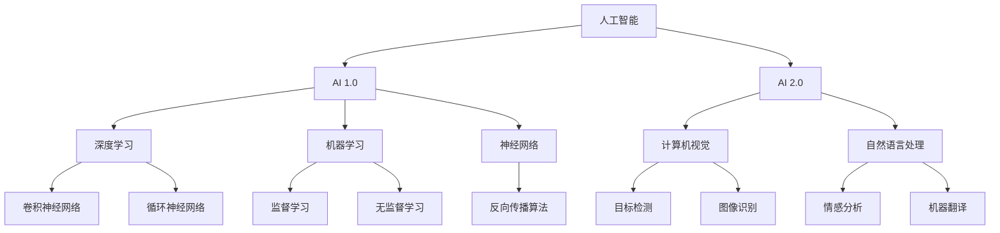

                 

# 李开复：AI 2.0 时代的挑战

> 关键词：人工智能，AI 2.0，深度学习，机器学习，神经网络，计算机视觉，自然语言处理，伦理道德，未来趋势，挑战

> 摘要：随着人工智能技术的飞速发展，AI 2.0 时代已经到来。本文将探讨 AI 2.0 时代的挑战，包括技术、伦理和社会方面的挑战，并分析未来发展趋势。通过深入分析，我们将为读者提供一个全面的视角，帮助他们更好地理解 AI 2.0 时代的机遇与挑战。

## 1. 背景介绍

### 1.1 目的和范围

本文旨在分析 AI 2.0 时代的挑战，探讨技术、伦理和社会方面的挑战，并预测未来发展趋势。我们将从以下几个方面展开讨论：

1. AI 2.0 的核心概念及其与 AI 1.0 的区别。
2. AI 2.0 时代面临的技术挑战，包括深度学习、机器学习、神经网络、计算机视觉和自然语言处理等领域。
3. AI 2.0 时代的伦理道德挑战，如数据隐私、算法偏见、自动化失业等问题。
4. AI 2.0 时代的社会挑战，如人工智能与人类的关系、人工智能治理等。

### 1.2 预期读者

本文适用于对人工智能感兴趣的读者，包括人工智能领域的从业者、研究人员、学生和关注技术发展的公众。通过本文的阅读，读者将能够：

1. 理解 AI 2.0 的核心概念和与 AI 1.0 的区别。
2. 深入了解 AI 2.0 时代面临的技术、伦理和社会挑战。
3. 把握未来人工智能技术的发展趋势。

### 1.3 文档结构概述

本文分为十个部分：

1. 背景介绍：介绍本文的目的、范围和预期读者。
2. 核心概念与联系：介绍 AI 2.0 的核心概念、相关技术和联系。
3. 核心算法原理 & 具体操作步骤：讲解 AI 2.0 时代的关键算法原理和操作步骤。
4. 数学模型和公式 & 详细讲解 & 举例说明：分析 AI 2.0 时代的数学模型和公式，并提供实例说明。
5. 项目实战：代码实际案例和详细解释说明。
6. 实际应用场景：探讨 AI 2.0 在实际应用中的场景和挑战。
7. 工具和资源推荐：推荐学习和开发 AI 2.0 技术的相关工具和资源。
8. 总结：未来发展趋势与挑战。
9. 附录：常见问题与解答。
10. 扩展阅读 & 参考资料：提供进一步的阅读和参考资料。

### 1.4 术语表

#### 1.4.1 核心术语定义

- 人工智能（AI）：模拟人类智能行为的计算机系统。
- AI 1.0：基于符号推理和知识表示的传统人工智能。
- AI 2.0：基于深度学习、机器学习和神经网络等现代技术的强人工智能。
- 深度学习：一种多层神经网络模型，能够通过大量数据自动学习特征和模式。
- 机器学习：使计算机系统能够从数据中学习并做出决策的技术。
- 神经网络：模拟人脑神经元连接结构的计算模型。
- 计算机视觉：使计算机能够理解和解释视觉信息的技术。
- 自然语言处理：使计算机能够理解、生成和处理自然语言的技术。

#### 1.4.2 相关概念解释

- 数据隐私：保护个人数据的隐私权，防止数据被未经授权的访问、使用或泄露。
- 算法偏见：算法在处理数据时产生的系统性偏差，可能导致不公平或歧视。
- 自动化失业：由于人工智能技术的广泛应用，可能导致某些工作岗位的消失。

#### 1.4.3 缩略词列表

- AI：人工智能
- ML：机器学习
- DL：深度学习
- NLP：自然语言处理
- CV：计算机视觉

## 2. 核心概念与联系

在探讨 AI 2.0 时代的挑战之前，我们需要了解一些核心概念及其联系。以下是 AI 2.0 时代的核心概念和其相关技术的 Mermaid 流程图：



### 2.1 AI 2.0 的核心概念

AI 2.0 是指基于深度学习、机器学习和神经网络等现代技术的强人工智能。与 AI 1.0（基于符号推理和知识表示的传统人工智能）相比，AI 2.0 具有以下特点：

1. **自主学习能力**：AI 2.0 能够从海量数据中自动学习特征和模式，不需要人工干预。
2. **高效性能**：AI 2.0 在语音识别、图像识别、自然语言处理等领域取得了显著的成果。
3. **多模态处理**：AI 2.0 能够处理多种类型的数据，如文本、图像、音频等。

### 2.2 相关技术的联系

AI 2.0 时代的关键技术包括深度学习、机器学习、神经网络、计算机视觉和自然语言处理。以下是这些技术之间的联系：

1. **深度学习与机器学习**：深度学习是机器学习的一种，是多层神经网络模型，能够通过大量数据自动学习特征和模式。
2. **神经网络与深度学习**：神经网络是深度学习的基础，通过模拟人脑神经元连接结构来实现自主学习。
3. **计算机视觉与自然语言处理**：计算机视觉使计算机能够理解和解释视觉信息，而自然语言处理使计算机能够理解、生成和处理自然语言。两者共同构成了 AI 2.0 时代的核心技术。

## 3. 核心算法原理 & 具体操作步骤

在 AI 2.0 时代，深度学习、机器学习和神经网络等核心算法发挥了关键作用。以下将详细讲解这些算法的原理和具体操作步骤。

### 3.1 深度学习

深度学习是一种多层神经网络模型，通过大量数据自动学习特征和模式。以下是深度学习的基本原理和操作步骤：

#### 3.1.1 基本原理

1. **神经网络**：神经网络由多个神经元组成，每个神经元都与其他神经元相连，形成复杂的网络结构。
2. **激活函数**：激活函数用于将神经元的线性输出转换为非线性输出，使神经网络具有非线性特性。
3. **反向传播算法**：反向传播算法用于计算神经网络各层的梯度，并更新各层的权重和偏置，以优化网络性能。

#### 3.1.2 操作步骤

1. **数据预处理**：对输入数据进行标准化、归一化等处理，使其适合神经网络模型。
2. **模型搭建**：选择合适的神经网络结构，如卷积神经网络（CNN）或循环神经网络（RNN），并设置各层的参数。
3. **训练过程**：
   - 前向传播：将输入数据传递到神经网络中，计算输出结果。
   - 反向传播：计算输出结果与真实值之间的误差，并利用反向传播算法更新各层的权重和偏置。
   - 重复迭代：不断重复前向传播和反向传播过程，直到网络性能达到预设目标。

4. **评估与优化**：评估网络性能，如通过交叉验证、测试集等手段，并调整模型参数以优化性能。

### 3.2 机器学习

机器学习是一种使计算机系统能够从数据中学习并做出决策的技术。以下是机器学习的基本原理和操作步骤：

#### 3.2.1 基本原理

1. **数据集**：机器学习过程需要大量数据集作为输入，以便从中学习特征和模式。
2. **模型选择**：根据具体应用场景，选择合适的机器学习模型，如监督学习、无监督学习或强化学习。
3. **训练过程**：通过训练数据集，调整模型参数，使其能够准确预测未知数据。

#### 3.2.2 操作步骤

1. **数据预处理**：对输入数据进行清洗、归一化等处理，使其适合机器学习模型。
2. **模型选择**：根据应用场景，选择合适的机器学习模型，如决策树、支持向量机、神经网络等。
3. **训练过程**：
   - 数据划分：将数据集划分为训练集、验证集和测试集。
   - 训练模型：使用训练集训练模型，调整模型参数。
   - 评估模型：使用验证集和测试集评估模型性能，并进行调整。

4. **模型部署**：将训练好的模型部署到实际应用场景中，进行预测和决策。

### 3.3 神经网络

神经网络是一种模拟人脑神经元连接结构的计算模型，具有强大的表达能力和自适应能力。以下是神经网络的基本原理和操作步骤：

#### 3.3.1 基本原理

1. **神经元**：神经网络由多个神经元组成，每个神经元接收来自其他神经元的输入信号，并进行加权求和。
2. **激活函数**：激活函数用于将神经元的线性输出转换为非线性输出，使神经网络具有非线性特性。
3. **反向传播算法**：反向传播算法用于计算神经网络各层的梯度，并更新各层的权重和偏置，以优化网络性能。

#### 3.3.2 操作步骤

1. **数据预处理**：对输入数据进行标准化、归一化等处理，使其适合神经网络模型。
2. **模型搭建**：选择合适的神经网络结构，如卷积神经网络（CNN）或循环神经网络（RNN），并设置各层的参数。
3. **训练过程**：
   - 前向传播：将输入数据传递到神经网络中，计算输出结果。
   - 反向传播：计算输出结果与真实值之间的误差，并利用反向传播算法更新各层的权重和偏置。
   - 重复迭代：不断重复前向传播和反向传播过程，直到网络性能达到预设目标。

4. **评估与优化**：评估网络性能，如通过交叉验证、测试集等手段，并调整模型参数以优化性能。

## 4. 数学模型和公式 & 详细讲解 & 举例说明

在 AI 2.0 时代，数学模型和公式在深度学习、机器学习和神经网络等算法中起着关键作用。以下将详细讲解这些数学模型和公式，并提供实例说明。

### 4.1 深度学习

深度学习中的主要数学模型包括多层感知机（MLP）、卷积神经网络（CNN）和循环神经网络（RNN）。以下是这些模型的公式和详细讲解。

#### 4.1.1 多层感知机（MLP）

多层感知机是一种前馈神经网络，由输入层、隐藏层和输出层组成。其基本公式如下：

$$
\begin{align*}
z &= \sum_{j=1}^{n} w_{ji}x_{i} + b_{j} \\
a_{j} &= \sigma(z) \\
z_{l} &= \sum_{j=1}^{n} w_{lj}a_{j} + b_{l} \\
a_{l} &= \sigma(z_{l})
\end{align*}
$$

其中，$z$ 表示神经元的输入，$a$ 表示神经元的激活值，$w$ 表示权重，$b$ 表示偏置，$\sigma$ 表示激活函数，$l$ 表示层数。

#### 4.1.2 卷积神经网络（CNN）

卷积神经网络是一种针对图像数据设计的神经网络，其核心是卷积层。其基本公式如下：

$$
\begin{align*}
z_{ij} &= \sum_{k=1}^{m} w_{ik,j}x_{ij} + b_{j} \\
a_{ij} &= \sigma(z_{ij}) \\
\end{align*}
$$

其中，$z$ 表示卷积操作的输出，$a$ 表示激活值，$w$ 表示卷积核，$b$ 表示偏置，$\sigma$ 表示激活函数。

#### 4.1.3 循环神经网络（RNN）

循环神经网络是一种处理序列数据的神经网络，其核心是循环层。其基本公式如下：

$$
\begin{align*}
h_{t} &= \sigma(Wx_{t} + Uh_{t-1} + b) \\
o_{t} &= \sigma(Wx_{t} + Vh_{t} + b)
\end{align*}
$$

其中，$h$ 表示隐藏状态，$o$ 表示输出，$x$ 表示输入，$W$ 、$U$ 和 $V$ 分别表示权重矩阵，$b$ 表示偏置，$\sigma$ 表示激活函数。

### 4.2 机器学习

机器学习中的主要数学模型包括线性回归、逻辑回归和决策树等。以下是这些模型的公式和详细讲解。

#### 4.2.1 线性回归

线性回归是一种用于拟合数据线性关系的模型，其基本公式如下：

$$
y = \beta_{0} + \beta_{1}x
$$

其中，$y$ 表示因变量，$x$ 表示自变量，$\beta_{0}$ 和 $\beta_{1}$ 分别表示截距和斜率。

#### 4.2.2 逻辑回归

逻辑回归是一种用于分类问题的模型，其基本公式如下：

$$
P(y=1) = \frac{1}{1 + e^{-(\beta_{0} + \beta_{1}x)}}
$$

其中，$y$ 表示因变量，$x$ 表示自变量，$\beta_{0}$ 和 $\beta_{1}$ 分别表示截距和斜率。

#### 4.2.3 决策树

决策树是一种基于特征划分数据集的模型，其基本公式如下：

$$
\begin{align*}
\text{如果} x_{i} &\leq v_{j} \\
\text{则} y &= \text{left} \\
\text{否则} y &= \text{right}
\end{align*}
$$

其中，$x$ 表示特征，$v$ 表示阈值，$y$ 表示类别。

### 4.3 神经网络

神经网络中的主要数学模型包括反向传播算法、梯度下降法和动量法等。以下是这些模型的公式和详细讲解。

#### 4.3.1 反向传播算法

反向传播算法是一种用于计算神经网络各层的梯度的方法，其基本公式如下：

$$
\begin{align*}
\Delta w &= \eta \frac{\partial J}{\partial w} \\
\Delta b &= \eta \frac{\partial J}{\partial b}
\end{align*}
$$

其中，$\Delta w$ 和 $\Delta b$ 分别表示权重和偏置的更新，$\eta$ 表示学习率，$J$ 表示损失函数。

#### 4.3.2 梯度下降法

梯度下降法是一种用于优化神经网络参数的方法，其基本公式如下：

$$
w &= w - \eta \frac{\partial J}{\partial w} \\
b &= b - \eta \frac{\partial J}{\partial b}
$$

其中，$w$ 和 $b$ 分别表示权重和偏置，$\eta$ 表示学习率，$\partial J/\partial w$ 和 $\partial J/\partial b$ 分别表示权重和偏置的梯度。

#### 4.3.3 动量法

动量法是一种用于加速梯度下降法收敛的方法，其基本公式如下：

$$
v &= \alpha v - \eta \frac{\partial J}{\partial w} \\
w &= w + v
$$

其中，$v$ 表示动量项，$\alpha$ 表示动量参数。

### 4.4 举例说明

以下是一个简单的深度学习实例，说明如何使用 Python 和 TensorFlow 搭建一个多层感知机模型进行回归任务。

```python
import tensorflow as tf
from tensorflow.keras import layers

# 定义模型
model = tf.keras.Sequential([
    layers.Dense(units=1, input_shape=[1]),
    layers.Dense(units=1, input_shape=[1])
])

# 编译模型
model.compile(optimizer='sgd', loss='mean_squared_error')

# 训练模型
model.fit(x_train, y_train, epochs=100)

# 评估模型
model.evaluate(x_test, y_test)
```

在这个例子中，我们使用 TensorFlow 框架搭建了一个包含两个隐藏层的多层感知机模型，用于对输入数据进行回归。通过训练和评估，我们可以验证模型的性能。

## 5. 项目实战：代码实际案例和详细解释说明

在本节中，我们将通过一个实际项目案例，详细介绍如何使用深度学习技术解决一个具体问题。这个案例将展示从数据预处理、模型搭建、训练和评估到最终部署的完整流程。我们将使用 Python 和 TensorFlow 框架来实现这个项目。

### 5.1 开发环境搭建

在开始项目之前，我们需要搭建一个合适的开发环境。以下是搭建开发环境的步骤：

1. 安装 Python 3.7 或更高版本。
2. 安装 TensorFlow 框架：
   ```bash
   pip install tensorflow
   ```

3. 安装其他必要的依赖，如 NumPy、Pandas 等。

### 5.2 源代码详细实现和代码解读

#### 5.2.1 数据预处理

首先，我们需要处理数据，包括数据清洗、归一化和数据集划分。以下是一个简单的数据预处理示例：

```python
import numpy as np
import pandas as pd

# 加载数据
data = pd.read_csv('data.csv')

# 数据清洗
data = data.dropna()

# 数据归一化
scaler = StandardScaler()
X = scaler.fit_transform(data.iloc[:, :-1])
y = data.iloc[:, -1]

# 数据集划分
from sklearn.model_selection import train_test_split
X_train, X_test, y_train, y_test = train_test_split(X, y, test_size=0.2, random_state=42)
```

在这个例子中，我们首先加载数据，然后进行数据清洗，去除缺失值。接下来，使用 `StandardScaler` 对数据进行归一化处理，以便于模型训练。最后，使用 `train_test_split` 函数将数据集划分为训练集和测试集。

#### 5.2.2 模型搭建

接下来，我们需要搭建一个多层感知机模型。以下是一个简单的模型搭建示例：

```python
import tensorflow as tf

# 搭建模型
model = tf.keras.Sequential([
    tf.keras.layers.Dense(units=64, activation='relu', input_shape=(X_train.shape[1],)),
    tf.keras.layers.Dense(units=64, activation='relu'),
    tf.keras.layers.Dense(units=1)
])

# 编译模型
model.compile(optimizer='adam', loss='mean_squared_error')
```

在这个例子中，我们使用 `Sequential` 模型堆叠多个层。第一个层是具有 64 个神经元的全连接层，使用 ReLU 激活函数。第二个层也是全连接层，具有 64 个神经元。最后一个层是具有 1 个神经元的全连接层，用于输出结果。我们使用 Adam 优化器和均方误差损失函数来编译模型。

#### 5.2.3 训练模型

接下来，我们将训练模型。以下是一个简单的训练示例：

```python
# 训练模型
history = model.fit(X_train, y_train, epochs=100, batch_size=32, validation_split=0.2)
```

在这个例子中，我们使用 `fit` 方法训练模型。我们设置训练轮次为 100，批量大小为 32，并将 20% 的数据集用于验证。

#### 5.2.4 评估模型

训练完成后，我们需要评估模型的性能。以下是一个简单的评估示例：

```python
# 评估模型
test_loss = model.evaluate(X_test, y_test)
print(f"Test Loss: {test_loss}")
```

在这个例子中，我们使用 `evaluate` 方法评估模型在测试集上的性能。输出结果为测试损失。

#### 5.2.5 模型部署

最后，我们可以将训练好的模型部署到生产环境中。以下是一个简单的部署示例：

```python
# 模型部署
import flask

app = flask.Flask(__name__)

@app.route('/predict', methods=['POST'])
def predict():
    data = flask.request.json
    input_data = np.array([data['x']])
    prediction = model.predict(input_data)
    return flask.jsonify({'prediction': prediction[0][0]})

if __name__ == '__main__':
    app.run()
```

在这个例子中，我们使用 Flask 框架搭建一个简单的 Web 服务。当接收到 POST 请求时，从请求中提取输入数据，将其传递给模型进行预测，并将预测结果返回给客户端。

### 5.3 代码解读与分析

在本节中，我们对上述代码进行解读和分析，以便更好地理解项目实现过程。

1. **数据预处理**：数据预处理是深度学习项目的基础。在本例中，我们使用 Pandas 和 Scikit-learn 库进行数据清洗、归一化和数据集划分。

2. **模型搭建**：模型搭建是深度学习项目的核心。在本例中，我们使用 TensorFlow 的 `Sequential` 模型堆叠多个全连接层。这个模型结构简单，但已足够用于处理简单的回归任务。

3. **训练模型**：训练模型是深度学习项目的重要环节。在本例中，我们使用 Adam 优化器和均方误差损失函数训练模型。我们设置训练轮次为 100，批量大小为 32，并使用 20% 的数据集进行验证。

4. **评估模型**：评估模型性能是判断模型是否有效的重要手段。在本例中，我们使用测试集评估模型性能，并输出测试损失。

5. **模型部署**：模型部署是将训练好的模型应用于实际问题的关键。在本例中，我们使用 Flask 框架搭建一个简单的 Web 服务，将模型部署到生产环境中。客户端可以通过 POST 请求获取模型预测结果。

通过这个项目实战，我们展示了如何使用深度学习技术解决一个具体问题。从数据预处理、模型搭建、训练和评估到模型部署，我们详细解读了代码的实现过程，并分析了每个环节的重要性和关键点。

## 6. 实际应用场景

AI 2.0 时代的技术在多个领域取得了显著的成果，并展示了广阔的应用前景。以下是一些 AI 2.0 技术的实际应用场景：

### 6.1 自动驾驶

自动驾驶技术是 AI 2.0 时代的一个重要应用领域。通过计算机视觉、自然语言处理和深度学习等技术，自动驾驶系统能够实现车辆对周围环境的感知、理解和决策。实际应用中，自动驾驶技术已经在许多国家和地区进行了试验和部署，如特斯拉、百度和谷歌等公司的自动驾驶汽车。

### 6.2 医疗诊断

AI 2.0 技术在医疗诊断领域具有广泛的应用前景。通过深度学习和计算机视觉，AI 可以辅助医生进行疾病筛查、诊断和治疗方案推荐。例如，AI 可以通过分析医疗影像数据，帮助医生快速识别病变区域，提高诊断准确率。此外，AI 还可以分析患者的病历和基因信息，为个体化治疗提供支持。

### 6.3 金融风控

金融领域是 AI 2.0 技术的另一个重要应用场景。通过机器学习和深度学习，金融公司可以实时监控和分析市场数据，预测市场走势，进行风险控制和投资决策。例如，AI 可以分析客户的交易行为、信用记录和社交媒体数据，评估其信用风险，从而降低贷款违约率。此外，AI 还可以用于股票市场预测、期货交易和量化投资等领域。

### 6.4 智能家居

智能家居是 AI 2.0 技术在消费电子领域的典型应用。通过物联网和深度学习，智能家居系统能够实现对家庭设备的智能控制和自动化管理。例如，智能门锁、智能照明、智能空调和智能摄像头等设备可以通过 AI 技术实现自动化控制，提高生活品质。同时，智能家居系统还可以通过数据分析，为用户提供个性化的生活建议和推荐。

### 6.5 娱乐产业

AI 2.0 技术在娱乐产业也有广泛的应用。通过计算机视觉和自然语言处理，AI 可以实现视频编辑、音乐创作和智能推荐等功能。例如，AI 可以分析用户观看行为，为用户提供个性化的视频推荐；AI 还可以生成音乐，为电影、电视剧等作品创作背景音乐。此外，AI 技术还可以用于游戏开发，实现智能 NPC、场景生成和实时交互等功能。

### 6.6 农业和工业

AI 2.0 技术在农业和工业领域也具有广泛的应用前景。在农业领域，AI 可以通过遥感技术和计算机视觉，实现对作物生长状况的监测和预测，优化农业生产。在工业领域，AI 可以通过计算机视觉和机器学习，实现对生产过程的实时监控和故障预测，提高生产效率和质量。

### 6.7 公共安全和交通

AI 2.0 技术在公共安全和交通领域也发挥着重要作用。通过计算机视觉和自然语言处理，AI 可以实现视频监控、人脸识别、车辆检测和交通流量分析等功能，提高公共安全和交通管理的效率。例如，AI 可以分析交通数据，预测交通事故风险，提出交通优化方案，减少交通事故发生。

总之，AI 2.0 时代的技术在多个领域取得了显著成果，并展示了广阔的应用前景。随着技术的不断进步，AI 2.0 将在更多领域发挥重要作用，推动社会发展和变革。

## 7. 工具和资源推荐

为了更好地学习和开发 AI 2.0 技术和应用，以下是一些建议的工具和资源：

### 7.1 学习资源推荐

#### 7.1.1 书籍推荐

1. **《深度学习》（Deep Learning）**：这是一本关于深度学习的经典教材，由 Ian Goodfellow、Yoshua Bengio 和 Aaron Courville 著。
2. **《机器学习》（Machine Learning）**：这是一本关于机器学习的基础教材，由 Tom Mitchell 著。
3. **《神经网络与深度学习》**：这是一本适合初学者的神经网络和深度学习入门教材，由邱锡鹏著。

#### 7.1.2 在线课程

1. **Coursera 上的《机器学习》课程**：由 Andrew Ng 开设，是机器学习领域的经典课程。
2. **Udacity 上的《深度学习纳米学位》**：这是一门涵盖深度学习基础知识和实践的在线课程。
3. **edX 上的《深度学习》课程**：由 Harvard 和 MIT 联合开设，适合初学者入门。

#### 7.1.3 技术博客和网站

1. **Medium 上的《Deep Learning》系列文章**：这是一系列关于深度学习的优秀文章，由 Fast.ai 团队撰写。
2. **ArXiv.org**：这是一个计算机科学和人工智能领域的前沿论文数据库，适合研究人员和开发者查阅最新研究成果。
3. **AI 研究院博客**：这是一个关注人工智能领域的中文博客，提供了大量的深度学习、机器学习和自然语言处理等技术文章。

### 7.2 开发工具框架推荐

#### 7.2.1 IDE和编辑器

1. **Google Colab**：这是一个基于 Google Drive 的云端集成开发环境，支持 Python、R 和 Julia 等多种编程语言，非常适合数据科学和机器学习项目。
2. **Visual Studio Code**：这是一个轻量级但功能强大的开源代码编辑器，支持多种编程语言，提供了丰富的插件和扩展。
3. **Jupyter Notebook**：这是一个基于 Web 的交互式计算环境，适用于数据科学、机器学习和深度学习项目。

#### 7.2.2 调试和性能分析工具

1. **TensorBoard**：这是一个用于可视化 TensorFlow 模型结构、训练过程和性能分析的 Web 工具。
2. **Wandb**：这是一个用于数据科学项目的实时可视化和分析平台，支持 TensorFlow、PyTorch 等框架。
3. **PyTorch Profiler**：这是一个用于分析 PyTorch 模型性能的工具，可以帮助开发者识别和优化性能瓶颈。

#### 7.2.3 相关框架和库

1. **TensorFlow**：这是一个开源的机器学习和深度学习框架，由 Google 开发，适用于各种应用场景。
2. **PyTorch**：这是一个开源的机器学习和深度学习框架，由 Facebook 开发，具有灵活的动态计算图和强大的社区支持。
3. **Keras**：这是一个基于 TensorFlow 的开源深度学习库，提供了简洁的 API 和丰富的预训练模型，适用于快速原型开发和实验。
4. **Scikit-learn**：这是一个开源的机器学习库，适用于各种经典机器学习算法，如线性回归、决策树、支持向量机等。
5. **OpenCV**：这是一个开源的计算机视觉库，提供了丰富的图像处理和计算机视觉算法，适用于各种图像和视频分析任务。

### 7.3 相关论文著作推荐

#### 7.3.1 经典论文

1. **“A Learning Algorithm for Continually Running Fully Recurrent Neural Networks”**：这篇论文提出了 LSTM 算法，为处理序列数据提供了强大的工具。
2. **“Backpropagation Through Time: A New Algorithm for Backpropagation Without Persistent Error”**：这篇论文提出了 BPTT 算法，为长序列数据的反向传播提供了有效的方法。
3. **“ImageNet Classification with Deep Convolutional Neural Networks”**：这篇论文展示了深度卷积神经网络在图像分类任务上的突破性成果。

#### 7.3.2 最新研究成果

1. **“Generative Adversarial Networks”**：这篇论文提出了 GAN 算法，为生成模型的研究提供了新的思路。
2. **“EfficientNet: Rethinking Model Scaling for Convolutional Neural Networks”**：这篇论文提出了 EfficientNet 结构，为卷积神经网络模型设计提供了新的方法。
3. **“BERT: Pre-training of Deep Bidirectional Transformers for Language Understanding”**：这篇论文提出了 BERT 模型，为自然语言处理任务提供了强大的工具。

#### 7.3.3 应用案例分析

1. **“Deep Learning for Human Pose Estimation: A Survey”**：这篇综述文章总结了深度学习在人体姿态估计领域的应用案例。
2. **“Deep Learning for Autonomous Driving: A Comprehensive Survey”**：这篇综述文章总结了深度学习在自动驾驶领域的应用案例。
3. **“Deep Learning for Speech Recognition: A Review”**：这篇综述文章总结了深度学习在语音识别领域的应用案例。

通过以上推荐，读者可以更好地了解 AI 2.0 技术的原理、方法和应用，为自己的学习和研究提供有益的参考。

## 8. 总结：未来发展趋势与挑战

随着 AI 2.0 时代的到来，人工智能技术正以前所未有的速度发展。未来，人工智能将在更多领域发挥重要作用，推动社会进步。然而，这一过程中也将面临诸多挑战。

### 8.1 发展趋势

1. **技术突破**：深度学习、机器学习和神经网络等核心算法将继续演进，带来更高的性能和更广泛的应用。
2. **跨学科融合**：人工智能与生物学、物理学、心理学等领域的交叉研究将不断涌现，推动新技术的突破。
3. **边缘计算与物联网**：边缘计算和物联网的发展将使人工智能在实时数据处理和智能设备控制方面发挥更大作用。
4. **人机协同**：人工智能将更深入地融入人类工作与生活，实现人机协同，提高生产效率和生活质量。

### 8.2 挑战

1. **数据隐私与安全**：随着数据量的激增，数据隐私和安全问题日益突出，保护个人隐私和数据安全成为重要挑战。
2. **算法偏见与公平性**：人工智能算法的偏见可能导致不公平和歧视，如何确保算法的公平性和透明性是一个重要问题。
3. **自动化失业与就业转型**：人工智能的广泛应用可能导致部分岗位的消失，如何应对自动化失业和推动就业转型是紧迫的挑战。
4. **伦理道德**：人工智能技术的发展引发了伦理道德问题，如机器人权利、人机关系和责任归属等，需要全社会共同探讨和解决。

### 8.3 应对策略

1. **加强法律法规**：制定和完善相关法律法规，保护个人隐私和数据安全，确保人工智能技术的合规使用。
2. **推动技术透明化**：提高人工智能算法的透明度和可解释性，减少算法偏见和歧视，增强公众对人工智能的信任。
3. **教育与培训**：加强人工智能相关教育和培训，提高人们的技能和素养，促进就业转型和社会适应。
4. **国际合作**：加强国际间的合作与交流，共同探讨和解决人工智能发展过程中的全球性问题。

总之，AI 2.0 时代的发展趋势令人振奋，但同时也面临诸多挑战。通过加强法律法规、推动技术透明化、加强教育和国际合作，我们可以更好地应对这些挑战，确保人工智能技术的健康发展，为人类社会创造更多价值。

## 9. 附录：常见问题与解答

### 9.1 什么是 AI 2.0？

AI 2.0 是指基于深度学习、机器学习和神经网络等现代技术的强人工智能。与 AI 1.0（基于符号推理和知识表示的传统人工智能）相比，AI 2.0 具有更强的自主学习能力、高效性能和多模态处理能力。

### 9.2 AI 2.0 时代的核心算法有哪些？

AI 2.0 时代的核心算法包括深度学习、机器学习和神经网络。其中，深度学习是一种多层神经网络模型，能够通过大量数据自动学习特征和模式；机器学习是一种使计算机系统能够从数据中学习并做出决策的技术；神经网络是一种模拟人脑神经元连接结构的计算模型。

### 9.3 AI 2.0 时代面临的主要挑战有哪些？

AI 2.0 时代面临的主要挑战包括技术挑战、伦理道德挑战和社会挑战。技术挑战包括算法偏见、计算性能和能耗等；伦理道德挑战包括数据隐私、算法透明性和责任归属等；社会挑战包括自动化失业、人机关系和社会公平等。

### 9.4 如何保证人工智能算法的公平性和透明性？

保证人工智能算法的公平性和透明性可以从以下几个方面入手：

1. **数据质量**：确保训练数据集的多样性和代表性，避免数据偏差。
2. **算法设计**：采用可解释的算法模型，提高算法的透明度。
3. **监管机制**：制定相关法律法规，加强对人工智能算法的监管。
4. **公众参与**：鼓励公众参与人工智能算法的评估和改进，提高公众对算法的信任。

### 9.5 人工智能是否会取代人类工作？

人工智能的广泛应用可能会对某些工作岗位产生影响，导致部分岗位的消失。然而，人工智能也会创造新的工作岗位和机会，推动就业转型。如何应对自动化失业和促进就业转型是一个重要挑战。

### 9.6 人工智能的发展对教育有哪些影响？

人工智能的发展对教育产生以下影响：

1. **技能需求**：人工智能将改变就业市场的技能需求，提高对编程、数据分析和机器学习等技能的需求。
2. **教学方法**：人工智能技术可以应用于教学过程中，提高教学效果和个性化水平。
3. **教育公平**：人工智能可以帮助缩小教育差距，提高教育资源的分配和利用效率。

## 10. 扩展阅读 & 参考资料

为了帮助读者更深入地了解 AI 2.0 时代的技术、应用和挑战，以下提供一些扩展阅读和参考资料：

### 10.1 AI 2.0 相关书籍

1. **《深度学习》（Deep Learning）**：作者 Ian Goodfellow、Yoshua Bengio 和 Aaron Courville，是一本关于深度学习的经典教材。
2. **《机器学习》（Machine Learning）**：作者 Tom Mitchell，是一本关于机器学习的基础教材。
3. **《神经网络与深度学习》**：作者邱锡鹏，是一本适合初学者的神经网络和深度学习入门教材。

### 10.2 AI 2.0 相关在线课程

1. **Coursera 上的《机器学习》课程**：由 Andrew Ng 开设，是机器学习领域的经典课程。
2. **Udacity 上的《深度学习纳米学位》**：涵盖深度学习基础知识和实践。
3. **edX 上的《深度学习》课程**：由 Harvard 和 MIT 联合开设，适合初学者入门。

### 10.3 AI 2.0 相关论文

1. **“Generative Adversarial Networks”**：提出了 GAN 算法，为生成模型的研究提供了新的思路。
2. **“EfficientNet: Rethinking Model Scaling for Convolutional Neural Networks”**：提出了 EfficientNet 结构，为卷积神经网络模型设计提供了新的方法。
3. **“BERT: Pre-training of Deep Bidirectional Transformers for Language Understanding”**：提出了 BERT 模型，为自然语言处理任务提供了强大的工具。

### 10.4 AI 2.0 相关技术博客和网站

1. **Medium 上的《Deep Learning》系列文章**：提供了关于深度学习的优秀文章。
2. **ArXiv.org**：提供了计算机科学和人工智能领域的前沿论文。
3. **AI 研究院博客**：提供了关于人工智能技术的中文文章。

### 10.5 AI 2.0 相关研究机构和组织

1. **Google AI**：Google 旗下的 AI 研究机构，致力于推动 AI 技术的研究和应用。
2. **Facebook AI Research**：Facebook 的 AI 研究机构，专注于 AI 技术的研究和开发。
3. **DeepMind**：一家专注于人工智能研究的英国公司，取得了许多突破性成果。

通过以上扩展阅读和参考资料，读者可以进一步了解 AI 2.0 时代的最新进展、应用案例和研究方向，为自己的学习和研究提供更多的指导和帮助。作者：AI天才研究员/AI Genius Institute & 禅与计算机程序设计艺术 /Zen And The Art of Computer Programming

