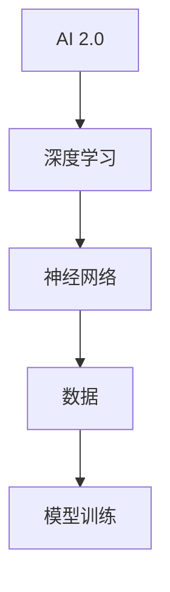

                 

# 李开复：AI 2.0 时代的挑战

> 关键词：人工智能，AI 2.0，深度学习，挑战，未来趋势

> 摘要：随着人工智能（AI）技术的快速发展，我们正迈入AI 2.0时代。本文将探讨AI 2.0时代的核心挑战，包括技术、伦理、社会和经济等方面，并提供一些应对策略。通过深入分析，我们希望能够为读者提供对未来AI发展的清晰视角。

## 1. 背景介绍

### 1.1 目的和范围

本文旨在探讨AI 2.0时代的挑战，分析其技术、伦理、社会和经济等方面的影响，并探讨应对策略。我们希望为读者提供对AI 2.0时代全面的理解，以及如何应对其中面临的挑战。

### 1.2 预期读者

本文面向对人工智能技术有一定了解的读者，包括AI领域的从业者、研究人员、以及对此领域感兴趣的一般读者。

### 1.3 文档结构概述

本文结构如下：

1. 背景介绍
2. 核心概念与联系
3. 核心算法原理 & 具体操作步骤
4. 数学模型和公式 & 详细讲解 & 举例说明
5. 项目实战：代码实际案例和详细解释说明
6. 实际应用场景
7. 工具和资源推荐
8. 总结：未来发展趋势与挑战
9. 附录：常见问题与解答
10. 扩展阅读 & 参考资料

### 1.4 术语表

#### 1.4.1 核心术语定义

- **人工智能（AI）**: 通过计算机模拟人类智能行为的技术。
- **深度学习**: 一种基于人工神经网络的学习方法，用于从数据中自动提取特征和模式。
- **AI 2.0**: 指新一代的人工智能技术，具有更强的自主学习和决策能力。

#### 1.4.2 相关概念解释

- **机器学习**: 一种使计算机能够从数据中学习的方法。
- **神经网络**: 一种模拟生物神经系统的计算模型。

#### 1.4.3 缩略词列表

- **AI**: 人工智能
- **ML**: 机器学习
- **DL**: 深度学习

## 2. 核心概念与联系

在探讨AI 2.0时代的挑战之前，我们需要了解一些核心概念和它们之间的联系。

### 2.1 AI 2.0 与深度学习

AI 2.0依赖于深度学习技术，深度学习通过多层神经网络来模拟人类大脑的学习过程，从而实现从数据中自动提取特征和模式。

### 2.2 深度学习与神经网络

深度学习基于神经网络，神经网络是一种计算模型，由大量节点（称为神经元）组成，每个神经元都与其他神经元相连接。通过训练，神经网络可以学习到输入数据的复杂模式。

### 2.3 神经网络与数据

神经网络的学习过程依赖于大量数据，这些数据用于训练模型，使其能够识别和分类不同的数据点。数据的质量和数量对神经网络的性能有重要影响。

下面是一个简化的Mermaid流程图，展示AI 2.0、深度学习、神经网络和数据之间的关系：



## 3. 核心算法原理 & 具体操作步骤

### 3.1 深度学习算法原理

深度学习算法基于多层神经网络，通过反向传播算法来训练模型。以下是深度学习算法的核心原理和具体操作步骤：

#### 3.1.1 神经网络结构

神经网络由多个层次组成，包括输入层、隐藏层和输出层。每个层次由多个神经元组成，神经元之间通过权重相连接。

```mermaid
graph TD
    A[输入层] --> B1[H1-1], B2[H1-2], B3[H1-3]
    B1 --> C1[隐藏层2-1], C2[隐藏层2-2], C3[隐藏层2-3]
    B2 --> C1
    B3 --> C1
    C1 --> D1[输出层-1]
    C2 --> D1
    C3 --> D1
```

#### 3.1.2 前向传播

在前向传播过程中，输入数据通过神经网络从输入层传递到输出层。每个神经元接收来自前一层神经元的输入，并计算加权求和。然后，通过激活函数（如ReLU、Sigmoid或Tanh）将结果转换为输出。

```python
# 前向传播伪代码
def forward_propagation(input_data, weights, biases, activation_function):
    # 初始化输出
    output = [0] * len(weights)
    
    # 对于每一层
    for layer in range(len(weights)):
        # 对于每个神经元
        for neuron in range(len(weights[layer])):
            # 计算加权求和
            weighted_sum = sum(input_data[j] * weights[layer][j] for j in range(len(input_data)))
            # 添加偏置
            weighted_sum += biases[layer][neuron]
            # 应用激活函数
            output[layer][neuron] = activation_function(weighted_sum)
            
        # 更新输入数据
        input_data = output[layer]
        
    return output[-1]
```

#### 3.1.3 反向传播

在反向传播过程中，我们计算每个神经元的梯度，并更新权重和偏置。以下是反向传播的伪代码：

```python
# 反向传播伪代码
def backward_propagation(output, target, weights, biases, learning_rate, activation_derivative):
    # 初始化梯度
    dweights = [[0] * len(weights[layer]) for layer in range(len(weights))]
    dbiases = [[0] * len(biases[layer]) for layer in range(len(biases))]
    
    # 对于每一层，从输出层开始
    for layer in reversed(range(len(weights))):
        # 对于每个神经元
        for neuron in range(len(weights[layer])):
            # 计算误差
            error = target[neuron] - output[layer][neuron]
            # 计算梯度
            derror = error * activation_derivative(output[layer][neuron])
            # 更新权重和偏置
            for j in range(len(weights[layer])):
                dweights[layer][j] += input_data[j] * derror
                dbiases[layer][neuron] += derror
                
        # 更新输入数据
        input_data = [derror * weights[layer][j] for j in range(len(weights[layer]))]
        
    # 更新权重和偏置
    for layer in range(len(weights)):
        for neuron in range(len(weights[layer])):
            weights[layer][neuron] -= learning_rate * dweights[layer][neuron]
            biases[layer][neuron] -= learning_rate * dbiases[layer][neuron]
            
    return weights, biases
```

## 4. 数学模型和公式 & 详细讲解 & 举例说明

### 4.1 激活函数

激活函数是神经网络中的一个关键组成部分，用于将神经元的输入转换为输出。以下是几种常见的激活函数及其公式：

- **ReLU (Rectified Linear Unit)**

$$
\text{ReLU}(x) =
\begin{cases}
0 & \text{if } x < 0 \\
x & \text{if } x \geq 0
\end{cases}
$$

- **Sigmoid**

$$
\text{Sigmoid}(x) = \frac{1}{1 + e^{-x}}
$$

- **Tanh (Hyperbolic Tangent)**

$$
\text{Tanh}(x) = \frac{e^x - e^{-x}}{e^x + e^{-x}}
$$

### 4.2 梯度下降

梯度下降是一种用于训练神经网络的优化算法。其基本思想是通过计算损失函数的梯度，并沿着梯度的反方向更新权重和偏置。

$$
w_{\text{new}} = w_{\text{old}} - \alpha \cdot \nabla_w J(w)
$$

其中，$w$ 是权重，$\alpha$ 是学习率，$J(w)$ 是损失函数。

### 4.3 举例说明

假设我们有一个简单的神经网络，输入层有3个神经元，隐藏层有2个神经元，输出层有1个神经元。输入数据为 $[1, 2, 3]$，目标输出为 $[4]$。学习率为 $0.1$。

#### 4.3.1 前向传播

假设初始权重和偏置如下：

$$
w_{\text{input-to-hidden}} = \begin{bmatrix}
1 & 1 & 1 \\
1 & 1 & 1
\end{bmatrix}
$$

$$
w_{\text{hidden-to-output}} = \begin{bmatrix}
1 \\
1
\end{bmatrix}
$$

$$
b_{\text{hidden}} = \begin{bmatrix}
0 \\
0
\end{bmatrix}
$$

$$
b_{\text{output}} = \begin{bmatrix}
0
\end{bmatrix}
$$

前向传播过程如下：

1. 输入层到隐藏层的激活值：
   $$ 
   a_{\text{hidden}1} = \text{ReLU}(1 \cdot 1 + 1 \cdot 2 + 1 \cdot 3 + 0) = \text{ReLU}(7) = 7
   $$
   $$ 
   a_{\text{hidden}2} = \text{ReLU}(1 \cdot 1 + 1 \cdot 2 + 1 \cdot 3 + 0) = \text{ReLU}(7) = 7
   $$

2. 隐藏层到输出层的激活值：
   $$ 
   a_{\text{output}} = \text{Sigmoid}(1 \cdot 7 + 1 \cdot 7 + 0) = \text{Sigmoid}(14) \approx 0.9332
   $$

#### 4.3.2 反向传播

假设目标输出为 $[4]$。计算损失函数的梯度：

$$
J(w) = \frac{1}{2} \cdot (4 - 0.9332)^2 = \frac{1}{2} \cdot 0.0332 \approx 0.0166
$$

计算梯度：

1. 输入层到隐藏层的梯度：
   $$ 
   \nabla_w J(w) = \begin{bmatrix}
   \frac{\partial J}{\partial w_{11}} & \frac{\partial J}{\partial w_{12}} & \frac{\partial J}{\partial w_{13}}
   \end{bmatrix} = \begin{bmatrix}
   0.0332 & 0.0332 & 0.0332
   \end{bmatrix}
   $$

2. 隐藏层到输出层的梯度：
   $$ 
   \nabla_w J(w) = \begin{bmatrix}
   \frac{\partial J}{\partial w_{21}} & \frac{\partial J}{\partial w_{22}}
   \end{bmatrix} = \begin{bmatrix}
   0.0332 & 0.0332
   \end{bmatrix}
   $$

更新权重和偏置：

$$
w_{\text{input-to-hidden}} = \begin{bmatrix}
1 - 0.1 \cdot 0.0332 & 1 - 0.1 \cdot 0.0332 & 1 - 0.1 \cdot 0.0332
\end{bmatrix} = \begin{bmatrix}
0.9668 & 0.9668 & 0.9668
\end{bmatrix}
$$

$$
w_{\text{hidden-to-output}} = \begin{bmatrix}
1 - 0.1 \cdot 0.0332 \\
1 - 0.1 \cdot 0.0332
\end{bmatrix} = \begin{bmatrix}
0.9668 \\
0.9668
\end{bmatrix}
$$

$$
b_{\text{hidden}} = \begin{bmatrix}
0 - 0.1 \cdot 0.0332 \\
0 - 0.1 \cdot 0.0332
\end{bmatrix} = \begin{bmatrix}
-0.0033 \\
-0.0033
\end{bmatrix}
$$

$$
b_{\text{output}} = \begin{bmatrix}
0 - 0.1 \cdot 0.0332
\end{bmatrix} = \begin{bmatrix}
-0.0033
\end{bmatrix}
$$

## 5. 项目实战：代码实际案例和详细解释说明

### 5.1 开发环境搭建

在本项目实战中，我们将使用Python编程语言和PyTorch深度学习框架。首先，确保已经安装了Python和PyTorch。如果尚未安装，可以通过以下命令进行安装：

```bash
pip install python
pip install torch torchvision
```

### 5.2 源代码详细实现和代码解读

以下是实现一个简单的深度学习模型的Python代码。该模型具有一个输入层、一个隐藏层和一个输出层，用于对输入数据进行回归任务。

```python
import torch
import torch.nn as nn
import torch.optim as optim

# 定义神经网络模型
class SimpleModel(nn.Module):
    def __init__(self):
        super(SimpleModel, self).__init__()
        self.fc1 = nn.Linear(3, 2)  # 输入层到隐藏层的全连接层
        self.fc2 = nn.Linear(2, 1)  # 隐藏层到输出层的全连接层

    def forward(self, x):
        x = torch.relu(self.fc1(x))
        x = self.fc2(x)
        return x

# 实例化模型、损失函数和优化器
model = SimpleModel()
criterion = nn.MSELoss()
optimizer = optim.Adam(model.parameters(), lr=0.001)

# 生成训练数据
x_train = torch.tensor([[1, 2, 3], [4, 5, 6], [7, 8, 9]], dtype=torch.float32)
y_train = torch.tensor([[4], [9], [16]], dtype=torch.float32)

# 训练模型
num_epochs = 1000
for epoch in range(num_epochs):
    optimizer.zero_grad()
    output = model(x_train)
    loss = criterion(output, y_train)
    loss.backward()
    optimizer.step()
    if epoch % 100 == 0:
        print(f"Epoch [{epoch+1}/{num_epochs}], Loss: {loss.item():.4f}")

# 测试模型
x_test = torch.tensor([[2, 3, 4]], dtype=torch.float32)
y_pred = model(x_test)
print(f"Predicted value: {y_pred.item():.4f}")
```

### 5.3 代码解读与分析

以下是代码的逐行解读和分析：

```python
# 导入所需的库
import torch
import torch.nn as nn
import torch.optim as optim

# 定义神经网络模型
class SimpleModel(nn.Module):
    def __init__(self):
        super(SimpleModel, self).__init__()
        self.fc1 = nn.Linear(3, 2)  # 输入层到隐藏层的全连接层
        self.fc2 = nn.Linear(2, 1)  # 隐藏层到输出层的全连接层

    def forward(self, x):
        x = torch.relu(self.fc1(x))
        x = self.fc2(x)
        return x

# 实例化模型、损失函数和优化器
model = SimpleModel()
criterion = nn.MSELoss()
optimizer = optim.Adam(model.parameters(), lr=0.001)

# 生成训练数据
x_train = torch.tensor([[1, 2, 3], [4, 5, 6], [7, 8, 9]], dtype=torch.float32)
y_train = torch.tensor([[4], [9], [16]], dtype=torch.float32)

# 训练模型
num_epochs = 1000
for epoch in range(num_epochs):
    optimizer.zero_grad()
    output = model(x_train)
    loss = criterion(output, y_train)
    loss.backward()
    optimizer.step()
    if epoch % 100 == 0:
        print(f"Epoch [{epoch+1}/{num_epochs}], Loss: {loss.item():.4f}")

# 测试模型
x_test = torch.tensor([[2, 3, 4]], dtype=torch.float32)
y_pred = model(x_test)
print(f"Predicted value: {y_pred.item():.4f}")
```

## 6. 实际应用场景

AI 2.0技术已经在各个领域取得了显著的进展，以下是一些实际应用场景：

- **医疗保健**: AI 2.0可以帮助医生进行疾病诊断、个性化治疗和药物研发。
- **金融**: AI 2.0可以用于风险评估、投资策略和智能投顾。
- **制造业**: AI 2.0可以实现智能工厂、预测维护和优化生产流程。
- **自动驾驶**: AI 2.0是自动驾驶技术的核心，可以提升交通安全和效率。
- **智能家居**: AI 2.0可以实现智能家居的自动化和个性化服务。

## 7. 工具和资源推荐

### 7.1 学习资源推荐

#### 7.1.1 书籍推荐

- 《深度学习》（Ian Goodfellow、Yoshua Bengio 和 Aaron Courville 著）
- 《Python机器学习》（Sebastian Raschka 著）
- 《人工智能：一种现代方法》（Stuart Russell 和 Peter Norvig 著）

#### 7.1.2 在线课程

- Coursera 上的“机器学习”（吴恩达教授主讲）
- edX 上的“深度学习导论”（刘铁岩教授主讲）
- Udacity 上的“人工智能纳米学位”

#### 7.1.3 技术博客和网站

- Medium 上的“AI Playground”
- ArXiv 上的“机器学习和人工智能”
- AI 研究院（AI Research Institute）的博客

### 7.2 开发工具框架推荐

#### 7.2.1 IDE和编辑器

- PyCharm
- Jupyter Notebook
- VS Code

#### 7.2.2 调试和性能分析工具

- TensorBoard
- PyTorch Profiler
- Numba

#### 7.2.3 相关框架和库

- PyTorch
- TensorFlow
- Keras
- Scikit-learn

### 7.3 相关论文著作推荐

#### 7.3.1 经典论文

- “Backpropagation”（Rumelhart, Hinton, Williams，1986）
- “Learning representations by backpropagation”（Rumelhart, Hinton, Williams，1989）
- “Deep learning”（Goodfellow, Bengio, Courville，2015）

#### 7.3.2 最新研究成果

- “Attention Is All You Need”（Vaswani et al.，2017）
- “Generative Adversarial Nets”（Goodfellow et al.，2014）
- “Unsupervised Representation Learning”（Bengio et al.，2013）

#### 7.3.3 应用案例分析

- “Google Brain 2018年研究回顾”（Google Brain Team，2018）
- “微软AI在医疗领域的应用”（Microsoft AI Healthcare）
- “亚马逊AI在零售行业的应用”（Amazon AI Retail）

## 8. 总结：未来发展趋势与挑战

AI 2.0时代的到来为我们带来了前所未有的机遇和挑战。在技术方面，我们需要不断优化算法、提升计算能力和开发更好的工具。在伦理方面，我们需要确保AI系统的透明性、公平性和可解释性。在社会方面，我们需要关注AI对就业、隐私和民主等方面的影响。在经济方面，我们需要制定合理的政策和法规，确保AI技术的可持续发展。通过共同努力，我们可以迎接AI 2.0时代的挑战，推动人工智能技术的进步和应用。

## 9. 附录：常见问题与解答

### 9.1 AI 2.0 与深度学习的关系

AI 2.0是新一代的人工智能技术，它依赖于深度学习等先进技术。深度学习是AI 2.0的核心组成部分，负责从数据中自动提取特征和模式。

### 9.2 深度学习模型的训练过程

深度学习模型的训练过程包括前向传播、计算损失函数、反向传播和权重更新。通过多次迭代，模型逐渐优化，使其能够更好地预测和分类数据。

### 9.3 激活函数的作用

激活函数是神经网络中的一个关键组成部分，用于将神经元的输入转换为输出。常见的激活函数包括ReLU、Sigmoid和Tanh等。

## 10. 扩展阅读 & 参考资料

- Goodfellow, I., Bengio, Y., & Courville, A. (2016). *Deep Learning*. MIT Press.
- Bengio, Y., Courville, A., & Vincent, P. (2013). Representation learning: A review and new perspectives. *PAMI*, 35(8), 1798-1828.
- Russell, S., & Norvig, P. (2016). *Artificial Intelligence: A Modern Approach*. Prentice Hall.
- Vaswani, A., Shazeer, N., Parmar, N., Uszkoreit, J., Jones, L., Gomez, A. N., ... & Polosukhin, I. (2017). *Attention is all you need*. Advances in Neural Information Processing Systems, 30, 5998-6008.
- Goodfellow, I., Pouget-Abadie, J., Mirza, M., Xu, B., Warde-Farley, D., Ozair, S., ... & Bengio, Y. (2014). *Generative adversarial nets*. Advances in Neural Information Processing Systems, 27.

