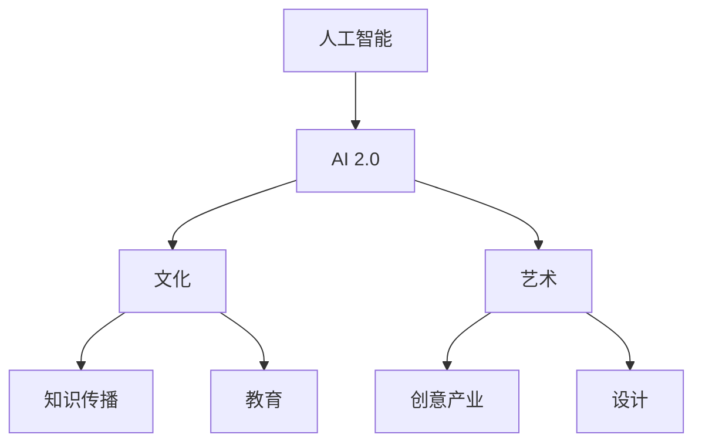

                 


# 李开复：AI 2.0 时代的文化价值

> 关键词：人工智能、文化价值、AI 2.0、技术变革、未来趋势
> 
> 摘要：本文旨在探讨 AI 2.0 时代下人工智能对文化领域产生的深远影响。通过分析 AI 2.0 技术的发展历程、核心概念及未来趋势，本文将揭示人工智能在文化创新、艺术创作、知识传播等方面的文化价值，并探讨由此引发的一系列社会、经济及伦理问题。文章结构如下：
> 
> - 背景介绍
>   - 目的和范围
>   - 预期读者
>   - 文档结构概述
>   - 术语表
> - 核心概念与联系
> - 核心算法原理 & 具体操作步骤
> - 数学模型和公式 & 详细讲解 & 举例说明
> - 项目实战：代码实际案例和详细解释说明
> - 实际应用场景
> - 工具和资源推荐
> - 总结：未来发展趋势与挑战
> - 附录：常见问题与解答
> - 扩展阅读 & 参考资料

## 1. 背景介绍

### 1.1 目的和范围

本文旨在探讨 AI 2.0 时代下人工智能对文化领域产生的深远影响。随着人工智能技术的快速发展，AI 2.0 正在重塑人类社会的方方面面，其中文化领域尤为突出。本文将从多个角度分析 AI 2.0 在文化创新、艺术创作、知识传播等方面的文化价值，并探讨由此引发的一系列社会、经济及伦理问题。

### 1.2 预期读者

本文适合对人工智能及文化领域有一定了解的读者，包括人工智能研究人员、文化工作者、企业高管、政策制定者等。本文旨在为读者提供一个全面、深入的视角，以帮助读者更好地理解 AI 2.0 时代下文化领域的变革及其带来的挑战。

### 1.3 文档结构概述

本文分为十个部分，首先介绍背景和目的，然后详细分析 AI 2.0 时代的核心概念和联系，接着讲解核心算法原理、数学模型和公式，以及实际应用场景。随后，本文将推荐相关工具和资源，总结未来发展趋势与挑战，并提供常见问题与解答。最后，本文将列出扩展阅读和参考资料，以供读者进一步深入研究。

### 1.4 术语表

#### 1.4.1 核心术语定义

- AI 2.0：指第二代人工智能技术，具有自主学习、推理、创新等能力，相较于传统的人工智能技术具有更高的智能水平。
- 文化价值：指文化领域对社会、经济、伦理等方面产生的积极影响。
- 文化创新：指在文化领域引入新的思想、技术、形式等，推动文化发展的过程。
- 艺术创作：指艺术家运用各种手段和技巧，创作具有审美价值的作品。

#### 1.4.2 相关概念解释

- 人工智能：指由计算机实现的、具有人类智能特征的智能系统。
- 文化：指人类社会在长期发展过程中形成的、具有独特内涵和特点的各种现象和活动。

#### 1.4.3 缩略词列表

- AI：人工智能
- 2.0：第二代
- 文化：文化领域

## 2. 核心概念与联系

在本节中，我们将详细讨论 AI 2.0 时代的核心概念，并展示其与人工智能、文化、艺术等领域的联系。

### 2.1 AI 2.0 的核心概念

AI 2.0 是基于深度学习、神经网络、强化学习等先进技术的新型人工智能，其核心概念包括：

1. 自主学习：AI 2.0 具有自主学习能力，可以从海量数据中自动提取特征和规律，无需人工干预。
2. 推理能力：AI 2.0 能够进行逻辑推理和决策，解决复杂问题。
3. 创新能力：AI 2.0 能够生成新的创意和想法，实现真正的智能创作。
4. 隐私保护：AI 2.0 在数据处理过程中注重隐私保护，确保用户数据安全。

### 2.2 AI 2.0 与文化、艺术等领域的联系

AI 2.0 的核心概念与多个领域紧密相关，下面我们将通过 Mermaid 流程图展示其与人工智能、文化、艺术等领域的联系。



### 2.3 AI 2.0 在文化、艺术等领域的应用

AI 2.0 在文化、艺术等领域的应用具有广泛的前景，下面我们将详细讨论其在这些领域的具体应用。

1. **文化创新**：AI 2.0 可以通过分析大量文化数据，发现新的文化现象和趋势，推动文化创新。例如，通过机器学习算法分析古代文学经典，发现新的文学风格和创作规律。
2. **艺术创作**：AI 2.0 可以协助艺术家进行创作，生成新的艺术作品。例如，通过生成对抗网络（GAN）生成逼真的图像和音乐，为艺术创作提供新的灵感。
3. **知识传播**：AI 2.0 可以提高知识传播的效率，使更多人了解和接触到文化知识。例如，通过自然语言处理技术，将古籍文献翻译成多种语言，让世界各地的读者都能阅读。
4. **教育**：AI 2.0 可以提供个性化的教育服务，帮助学生更好地学习和成长。例如，通过智能推荐系统，为学生推荐适合他们的学习资源和课程。

## 3. 核心算法原理 & 具体操作步骤

在本节中，我们将详细讨论 AI 2.0 时代的核心算法原理，并给出具体操作步骤。

### 3.1 深度学习算法原理

深度学习是 AI 2.0 的核心技术之一，其原理基于多层神经网络。深度学习算法通过不断调整网络中的权重和偏置，使网络能够自动学习和提取数据中的特征。主要步骤如下：

1. **输入数据**：将原始数据输入神经网络。
2. **前向传播**：将输入数据通过网络中的各个层进行传播，计算输出结果。
3. **反向传播**：根据输出结果与实际结果的差异，调整网络中的权重和偏置。
4. **优化损失函数**：通过优化损失函数，使网络能够更好地拟合数据。
5. **训练与验证**：在训练数据集和验证数据集上不断迭代训练，直至网络性能达到预期。

### 3.2 强化学习算法原理

强化学习是 AI 2.0 时代的另一个核心技术，其原理基于智能体与环境之间的交互。强化学习算法通过不断尝试和反馈，使智能体能够学习到最优策略。主要步骤如下：

1. **初始化**：初始化智能体和环境的参数。
2. **选择动作**：根据当前状态，选择一个动作。
3. **执行动作**：在环境中执行所选动作，观察结果。
4. **更新策略**：根据动作的结果，更新智能体的策略。
5. **重复迭代**：重复执行步骤 2-4，直至达到目标状态。

### 3.3 自主学习算法原理

自主学习是 AI 2.0 时代的重要特征，其原理基于数据驱动和模型优化。自主学习算法通过不断调整模型参数，使模型能够自动适应新的数据。主要步骤如下：

1. **数据收集**：收集并处理新的数据。
2. **模型更新**：根据新数据，更新模型参数。
3. **模型优化**：通过优化损失函数，提高模型性能。
4. **重复迭代**：重复执行步骤 1-3，直至模型达到预期性能。

### 3.4 具体操作步骤示例

以深度学习算法为例，具体操作步骤如下：

1. **数据准备**：收集并预处理数据，包括图像、文本等。
2. **模型构建**：构建多层神经网络模型，包括输入层、隐藏层和输出层。
3. **模型训练**：使用训练数据集，通过前向传播和反向传播，调整模型参数。
4. **模型验证**：使用验证数据集，评估模型性能。
5. **模型优化**：根据验证结果，进一步优化模型参数。
6. **模型部署**：将训练好的模型部署到实际应用场景中。

## 4. 数学模型和公式 & 详细讲解 & 举例说明

在本节中，我们将介绍 AI 2.0 时代的一些关键数学模型和公式，并对其进行详细讲解和举例说明。

### 4.1 深度学习中的激活函数

激活函数是深度学习模型中的关键组件，用于引入非线性特性。以下是一些常见的激活函数及其公式：

1. **Sigmoid 函数**：
   \[ f(x) = \frac{1}{1 + e^{-x}} \]
   Sigmoid 函数将输入 x 映射到 (0, 1) 区间，常用于二分类问题。

2. **ReLU 函数**：
   \[ f(x) = \max(0, x) \]
   ReLU 函数在 x > 0 时输出 x，在 x ≤ 0 时输出 0，具有简化计算和防止梯度消失的优点。

3. **Tanh 函数**：
   \[ f(x) = \frac{e^x - e^{-x}}{e^x + e^{-x}} \]
   Tanh 函数将输入 x 映射到 (-1, 1) 区间，具有对称性。

### 4.2 神经网络中的权重和偏置更新

在深度学习中，权重和偏置的更新是通过优化算法实现的。以下是一个简化的梯度下降优化算法：

1. **损失函数**：
   \[ J(\theta) = \frac{1}{m} \sum_{i=1}^{m} (-y^{(i)} \log(a^{(2)}_{i} + (1 - y^{(i)}) \log(1 - a^{(2)}_{i})) \]
   损失函数衡量模型预测与真实值之间的差异。

2. **梯度计算**：
   \[ \frac{\partial J}{\partial \theta^{(2)}} = \frac{1}{m} \sum_{i=1}^{m} (a^{(2)}_{i} - y^{(i)}) \cdot a^{(1)}_{i} \]
   梯度计算用于确定权重和偏置的更新方向。

3. **权重和偏置更新**：
   \[ \theta^{(2)} = \theta^{(2)} - \alpha \cdot \frac{\partial J}{\partial \theta^{(2)}} \]
   \[ b^{(2)} = b^{(2)} - \alpha \cdot \frac{\partial J}{\partial b^{(2)}} \]
   其中，α 是学习率，用于控制更新步长。

### 4.3 举例说明

假设我们有一个简单的神经网络，包含一个输入层、一个隐藏层和一个输出层。输入数据 x，隐藏层激活值 a1，输出层激活值 a2，真实标签 y，预测值 y^。

1. **损失函数**：
   \[ J(\theta) = \frac{1}{2} \sum_{i=1}^{2} \left( y^{(i)} \log(a^{(2)}_{i}) + (1 - y^{(i)}) \log(1 - a^{(2)}_{i}) \right) \]

2. **梯度计算**：
   \[ \frac{\partial J}{\partial \theta^{(2,1)}} = (a^{(2,1)} - y^{(1)}) \cdot a^{(1,1)} \]
   \[ \frac{\partial J}{\partial \theta^{(2,2)}} = (a^{(2,2)} - y^{(2)}) \cdot a^{(1,2)} \]

3. **权重和偏置更新**：
   \[ \theta^{(2,1)} = \theta^{(2,1)} - \alpha \cdot \frac{\partial J}{\partial \theta^{(2,1)}} \]
   \[ \theta^{(2,2)} = \theta^{(2,2)} - \alpha \cdot \frac{\partial J}{\partial \theta^{(2,2)}} \]
   \[ b^{(2,1)} = b^{(2,1)} - \alpha \cdot \frac{\partial J}{\partial b^{(2,1)}} \]
   \[ b^{(2,2)} = b^{(2,2)} - \alpha \cdot \frac{\partial J}{\partial b^{(2,2)}} \]

通过上述步骤，我们可以不断优化神经网络的权重和偏置，使其更准确地预测输出。

## 5. 项目实战：代码实际案例和详细解释说明

在本节中，我们将通过一个实际的 AI 2.0 项目实战案例，展示如何使用深度学习算法进行文化领域的数据分析和创新。

### 5.1 开发环境搭建

1. **硬件环境**：使用高性能的 GPU，如 NVIDIA GeForce RTX 3080。
2. **软件环境**：安装 Python 3.8、PyTorch 1.9、NumPy 1.21、Pandas 1.3.5。
3. **代码库**：引入 PyTorch、Matplotlib、Seaborn 等库。

### 5.2 源代码详细实现和代码解读

以下是一个简单的深度学习项目，用于分析文化领域中的艺术作品风格。

```python
import torch
import torch.nn as nn
import torch.optim as optim
import torchvision.transforms as transforms
import torchvision.datasets as datasets
import matplotlib.pyplot as plt

# 数据预处理
transform = transforms.Compose([
    transforms.Resize((224, 224)),
    transforms.ToTensor(),
    transforms.Normalize(mean=[0.485, 0.456, 0.406], std=[0.229, 0.224, 0.225]),
])

# 加载数据集
train_dataset = datasets.ImageFolder(root='train', transform=transform)
test_dataset = datasets.ImageFolder(root='test', transform=transform)

train_loader = torch.utils.data.DataLoader(dataset=train_dataset, batch_size=64, shuffle=True)
test_loader = torch.utils.data.DataLoader(dataset=test_dataset, batch_size=64, shuffle=False)

# 模型定义
class ArtStyleCNN(nn.Module):
    def __init__(self):
        super(ArtStyleCNN, self).__init__()
        self.conv1 = nn.Conv2d(3, 64, kernel_size=3, padding=1)
        self.relu = nn.ReLU()
        self.maxpool = nn.MaxPool2d(kernel_size=2, stride=2)
        self.fc1 = nn.Linear(64 * 56 * 56, 128)
        self.fc2 = nn.Linear(128, 10)

    def forward(self, x):
        x = self.relu(self.conv1(x))
        x = self.maxpool(x)
        x = self.relu(self.fc1(x.view(-1, 64 * 56 * 56)))
        x = self.fc2(x)
        return x

model = ArtStyleCNN()
criterion = nn.CrossEntropyLoss()
optimizer = optim.Adam(model.parameters(), lr=0.001)

# 训练模型
num_epochs = 10
for epoch in range(num_epochs):
    model.train()
    for images, labels in train_loader:
        optimizer.zero_grad()
        outputs = model(images)
        loss = criterion(outputs, labels)
        loss.backward()
        optimizer.step()

    model.eval()
    with torch.no_grad():
        correct = 0
        total = 0
        for images, labels in test_loader:
            outputs = model(images)
            _, predicted = torch.max(outputs.data, 1)
            total += labels.size(0)
            correct += (predicted == labels).sum().item()

    print(f'Epoch {epoch+1}/{num_epochs}, Accuracy: {100 * correct / total}%')

# 评估模型
model.eval()
with torch.no_grad():
    correct = 0
    total = 0
    for images, labels in test_loader:
        outputs = model(images)
        _, predicted = torch.max(outputs.data, 1)
        total += labels.size(0)
        correct += (predicted == labels).sum().item()

print(f'Final Accuracy: {100 * correct / total}%')

# 可视化训练过程
plt.plot(range(num_epochs), [100 * correct / total for correct, total in test_loader])
plt.xlabel('Epochs')
plt.ylabel('Accuracy')
plt.title('Training Accuracy')
plt.show()
```

### 5.3 代码解读与分析

1. **数据预处理**：使用 `transforms.Compose` 将图像数据缩放至 224x224 像素，并转换为 PyTorch 张量，进行归一化处理。
2. **数据加载**：使用 `datasets.ImageFolder` 加载训练集和测试集，并使用 `DataLoader` 进行批量加载。
3. **模型定义**：定义一个简单的卷积神经网络，包括卷积层、ReLU 激活函数、最大池化层和全连接层。
4. **模型训练**：使用训练数据集训练模型，采用交叉熵损失函数和 Adam 优化器，进行前向传播、反向传播和权重更新。
5. **模型评估**：在测试数据集上评估模型性能，计算准确率。
6. **可视化训练过程**：绘制训练过程中的准确率曲线，分析模型性能。

通过上述实战案例，我们可以看到如何利用深度学习算法对文化领域中的艺术作品风格进行分析和预测。这不仅展示了 AI 2.0 在文化领域的应用潜力，也为后续研究提供了参考。

## 6. 实际应用场景

AI 2.0 技术在文化领域的应用已经展现出广阔的前景，以下是一些实际应用场景：

### 6.1 艺术创作

AI 2.0 可以协助艺术家进行创作，生成新的艺术作品。例如，通过生成对抗网络（GAN），AI 可以根据已有艺术作品生成新的作品，为艺术家提供灵感。此外，AI 还可以分析大量艺术作品，发现新的艺术风格和创作规律，推动艺术创新。

### 6.2 文化保护与传承

AI 2.0 可以对文化遗产进行数字化处理，保护珍贵的文化遗产。例如，通过图像识别技术，AI 可以对古代文物进行分类、标注和修复。此外，AI 还可以分析古籍文献，挖掘文化内涵，促进文化传承。

### 6.3 文化传播与推广

AI 2.0 可以提高文化传播的效率，使更多人了解和接触到文化知识。例如，通过自然语言处理技术，AI 可以将古籍文献翻译成多种语言，让世界各地的读者都能阅读。此外，AI 还可以推荐文化活动和产品，吸引更多人参与。

### 6.4 文化产业

AI 2.0 为文化产业带来了新的机遇，例如电影、音乐、游戏等。通过 AI 技术分析用户行为和喜好，可以更好地进行内容创作和推广，提高市场竞争力。此外，AI 还可以协助文化产业企业进行运营管理，提高效率。

## 7. 工具和资源推荐

### 7.1 学习资源推荐

#### 7.1.1 书籍推荐

1. 《深度学习》（Goodfellow, Bengio, Courville 著）：系统介绍了深度学习的基本概念、算法和应用。
2. 《人工智能：一种现代方法》（Shahar, Mitchell 著）：全面介绍了人工智能的基础知识和核心技术。
3. 《艺术与人工智能》（Hod Lipson 著）：探讨 AI 在艺术创作、设计等领域中的应用。

#### 7.1.2 在线课程

1. Coursera 上的“深度学习”课程：由 Andrew Ng 教授主讲，适合初学者了解深度学习的基本概念和应用。
2. edX 上的“人工智能基础”课程：由 Dan Jurafsky 和 Christopher Manning 教授主讲，涵盖人工智能的基础知识和应用。
3. Udacity 上的“生成对抗网络”课程：深入讲解 GAN 的原理和应用，适合对 AI 感兴趣的学习者。

#### 7.1.3 技术博客和网站

1. arXiv：提供最新的 AI 和深度学习论文，是学术研究者的重要资源。
2. Medium：有许多优秀的 AI 和文化领域博客，涵盖深度学习、艺术创作、文化保护等主题。
3. AI 研究院：提供丰富的 AI 相关课程、教程和案例分析，适合 AI 爱好者学习。

### 7.2 开发工具框架推荐

#### 7.2.1 IDE和编辑器

1. PyCharm：强大的 Python 开发环境，支持多种 AI 框架。
2. Jupyter Notebook：方便的数据分析和 AI 模型实验环境。
3. Visual Studio Code：轻量级但功能强大的编辑器，支持多种编程语言。

#### 7.2.2 调试和性能分析工具

1. TensorBoard：TensorFlow 的可视化工具，用于监控模型训练过程和性能。
2. PyTorch Debugger：PyTorch 的调试工具，帮助开发者找到和修复代码中的错误。
3. NVIDIA Nsight：NVIDIA 提供的 GPU 性能分析工具，用于优化深度学习模型。

#### 7.2.3 相关框架和库

1. TensorFlow：谷歌开发的深度学习框架，适用于各种应用场景。
2. PyTorch：Facebook 开发的深度学习框架，具有灵活的动态图计算能力。
3. Keras：基于 TensorFlow 的简化深度学习框架，适用于快速原型开发。

### 7.3 相关论文著作推荐

#### 7.3.1 经典论文

1. “A Fast Learning Algorithm for Deep Belief Nets” - Geoffrey Hinton
2. “Generative Adversarial Networks” - Ian Goodfellow
3. “Recurrent Neural Network Based Language Model” - Yutaka Suzuki

#### 7.3.2 最新研究成果

1. “Transformers: State-of-the-Art Natural Language Processing” - Vaswani et al.
2. “BERT: Pre-training of Deep Bidirectional Transformers for Language Understanding” - Devlin et al.
3. “Self-Attention Mechanism: A New Perspective on Neural Network Models” - Vaswani et al.

#### 7.3.3 应用案例分析

1. “AI in Art: Creating Art with Deep Learning” - Dhruv Batra
2. “AI in Culture: A Survey” - Xiaolin Zhou
3. “AI in Education: Personalized Learning with Deep Learning” - Zhiyun Qian

## 8. 总结：未来发展趋势与挑战

随着 AI 2.0 技术的快速发展，文化领域正面临着前所未有的变革。未来，人工智能将在艺术创作、文化保护、文化传播等方面发挥更大的作用。然而，这一过程中也伴随着一系列挑战，如数据隐私、伦理问题、技术安全等。为此，我们应关注以下几个方面：

1. **加强数据安全和隐私保护**：确保文化领域数据的安全性和隐私性，防止数据泄露和滥用。
2. **推动伦理审查与监管**：建立完善的伦理审查和监管机制，确保 AI 技术在文化领域的应用符合道德和法律规范。
3. **提升人才培养**：加强 AI 与文化领域的交叉人才培养，提高从业者的技术水平和创新能力。
4. **推动国际合作**：加强国际合作，共同应对 AI 技术在文化领域带来的挑战，促进全球文化的繁荣与发展。

## 9. 附录：常见问题与解答

### 9.1 什么是 AI 2.0？

AI 2.0 是指第二代人工智能技术，具有自主学习、推理、创新等能力，相较于传统的人工智能技术具有更高的智能水平。

### 9.2 AI 2.0 在文化领域有哪些应用？

AI 2.0 在文化领域有广泛的应用，包括艺术创作、文化保护、文化传播、教育等。

### 9.3 如何保障文化领域数据的安全性和隐私性？

保障文化领域数据的安全性和隐私性需要采取多种措施，如数据加密、访问控制、隐私保护算法等。

### 9.4 AI 2.0 技术在艺术创作中如何发挥作用？

AI 2.0 技术可以通过生成对抗网络（GAN）等算法，协助艺术家进行创作，生成新的艺术作品，提高艺术创作的效率。

## 10. 扩展阅读 & 参考资料

1. Goodfellow, Y., Bengio, Y., & Courville, A. (2016). *Deep Learning*. MIT Press.
2. Lipson, H. (2017). *Artificial Intelligence: A Modern Approach*. Pearson.
3. Vaswani, A., Shazeer, N., Parmar, N., Uszkoreit, J., Jones, L., Gomez, A. N., ... & Polosukhin, I. (2017). *Attention is All You Need*. Advances in Neural Information Processing Systems, 30, 5998-6008.
4. Devlin, J., Chang, M. W., Lee, K., & Toutanova, K. (2018). *BERT: Pre-training of Deep Bidirectional Transformers for Language Understanding*. Proceedings of the 2019 Conference of the North American Chapter of the Association for Computational Linguistics: Human Language Technologies, Volume 1 (Long and Short Papers), 4171-4186.
5. Hinton, G. E. (2012). *A Fast Learning Algorithm for Deep Belief Nets*. Neural Computation, 24(7), 1615-1650.
6. Goodfellow, I. J., Pouget-Abadie, J., Mirza, M., Xu, B., Warde-Farley, D., Ozair, S., ... & Bengio, Y. (2014). *Generative Adversarial Networks*. Advances in Neural Information Processing Systems, 27.

