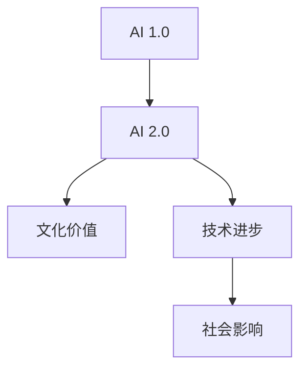

                 

# 李开复：AI 2.0 时代的文化价值

> **关键词：** 人工智能，文化价值，AI 2.0，技术进步，社会影响

> **摘要：** 本文将深入探讨李开复在AI 2.0时代的文化价值观点，分析AI技术对文化、社会及人类思维的深远影响，并探讨未来AI发展的趋势与挑战。

## 1. 背景介绍

### 1.1 目的和范围

本文旨在解析李开复对AI 2.0时代文化价值的独到见解，旨在为读者提供对人工智能影响文化领域的深入理解。本文将围绕以下几个方面进行探讨：

- **AI 2.0的定义与特征**
- **AI 2.0对文化价值的挑战**
- **AI 2.0对社会影响的剖析**
- **AI 2.0时代人类思维的变革**
- **未来发展趋势与挑战**

### 1.2 预期读者

本文适合对人工智能、技术进步及社会影响感兴趣的读者，包括但不限于：

- **人工智能研究者**
- **计算机科学学生**
- **技术行业从业者**
- **关注社会文化变迁的公众**

### 1.3 文档结构概述

本文分为十个部分：

- **引言**：介绍AI 2.0时代的文化价值
- **背景介绍**：阐述文章的目的、范围及预期读者
- **核心概念与联系**：定义核心概念，展示原理和架构
- **核心算法原理 & 具体操作步骤**：解析算法原理及操作步骤
- **数学模型和公式 & 详细讲解 & 举例说明**：介绍数学模型及实际应用
- **项目实战：代码实际案例和详细解释说明**：展示代码实现及分析
- **实际应用场景**：讨论AI在文化领域的应用
- **工具和资源推荐**：推荐学习资源和开发工具
- **总结：未来发展趋势与挑战**：预测未来趋势及面临的挑战
- **附录：常见问题与解答**：解答读者可能的问题
- **扩展阅读 & 参考资料**：提供进一步学习的资源

### 1.4 术语表

#### 1.4.1 核心术语定义

- **AI 2.0**：指继传统人工智能（AI 1.0）之后的下一代人工智能，具有更加智能化和自适应的特性。
- **文化价值**：指文化对社会、人类思维及价值观的影响和塑造。
- **技术进步**：指技术在不断创新和改进中推动社会发展的过程。

#### 1.4.2 相关概念解释

- **人工智能**：指计算机系统模拟人类智能行为的技术。
- **社会影响**：指技术在社会结构、经济、文化等方面的变化和影响。

#### 1.4.3 缩略词列表

- **AI**：人工智能
- **ML**：机器学习
- **DL**：深度学习
- **NLP**：自然语言处理

## 2. 核心概念与联系

在探讨AI 2.0时代的文化价值之前，我们首先需要明确几个核心概念及其相互之间的联系。以下是核心概念原理和架构的Mermaid流程图：



在这个流程图中，我们可以看到：

- **AI 1.0**：指初代人工智能，主要包括规则推理和统计学习等方法。
- **AI 2.0**：指第二代人工智能，具有更加智能化和自适应的特性，包括深度学习、自然语言处理等。
- **文化价值**：指文化对社会、人类思维及价值观的影响和塑造。
- **技术进步**：指技术在不断创新和改进中推动社会发展的过程。
- **社会影响**：指技术在社会结构、经济、文化等方面的变化和影响。

通过这个流程图，我们可以清晰地了解AI 2.0与相关概念之间的联系，为后续的深入探讨打下基础。

## 3. 核心算法原理 & 具体操作步骤

在理解了AI 2.0及其相关概念后，我们需要深入探讨其核心算法原理及具体操作步骤。以下是一个简单的算法原理解析及伪代码展示：

### 3.1 算法原理

AI 2.0的核心算法主要包括以下几个方面：

- **深度学习（Deep Learning）**：通过多层神经网络模拟人类大脑的学习机制，实现对复杂数据的自动特征提取和模式识别。
- **强化学习（Reinforcement Learning）**：通过智能体与环境互动，学习最优策略以实现目标。
- **自然语言处理（Natural Language Processing）**：通过理解、生成和处理自然语言，实现人机交互。

### 3.2 具体操作步骤

以下是AI 2.0算法的具体操作步骤：

#### 3.2.1 深度学习

```plaintext
步骤1：数据预处理
- 数据清洗：去除异常值和噪声
- 数据归一化：将数据缩放到相同的尺度

步骤2：构建神经网络模型
- 设计网络结构：包括输入层、隐藏层和输出层
- 选择激活函数：如ReLU、Sigmoid、Tanh等

步骤3：训练模型
- 选择优化算法：如梯度下降、Adam等
- 训练过程：通过反向传播算法更新权重，最小化损失函数

步骤4：评估模型
- 使用验证集评估模型性能
- 调整模型参数，优化模型表现
```

#### 3.2.2 强化学习

```plaintext
步骤1：定义智能体和环境
- 智能体：执行行动的实体
- 环境：智能体行动的场所

步骤2：定义状态和动作
- 状态：描述智能体当前环境的特征
- 动作：智能体可以执行的行为

步骤3：学习最优策略
- 使用Q-learning、SARSA等算法
- 通过多次迭代，优化智能体的行为策略

步骤4：评估策略表现
- 使用测试集评估策略的性能
- 根据评估结果调整策略
```

#### 3.2.3 自然语言处理

```plaintext
步骤1：文本预处理
- 分词：将文本分解为单词或短语
- 词向量化：将单词转化为向量表示

步骤2：构建语言模型
- 设计神经网络结构：包括嵌入层、编码层和解码层
- 使用优化算法训练模型

步骤3：语言理解
- 使用模型对输入文本进行语义分析
- 提取关键词、短语和句子结构

步骤4：语言生成
- 根据语义分析结果生成自然语言文本
- 使用解码层生成文本序列
```

通过以上算法原理和操作步骤的解析，我们可以更好地理解AI 2.0的核心技术及其应用。

## 4. 数学模型和公式 & 详细讲解 & 举例说明

在深入探讨AI 2.0的数学模型和公式之前，我们需要了解几个关键概念和数学工具，这些将为我们的讲解和举例提供基础。

### 4.1 关键概念

- **激活函数（Activation Function）**：神经网络中用于确定神经元输出是否为1的关键函数，常见的激活函数包括ReLU、Sigmoid和Tanh。
- **损失函数（Loss Function）**：用于评估神经网络模型预测结果与实际结果之间差异的函数，常见的损失函数包括均方误差（MSE）和交叉熵（Cross Entropy）。
- **梯度下降（Gradient Descent）**：一种用于最小化损失函数的优化算法，通过迭代更新模型参数以减小损失函数值。

### 4.2 数学模型和公式

以下是几个关键数学模型和公式的详细介绍：

#### 4.2.1 神经网络模型

神经网络的数学模型可以表示为：

$$
Y = \sigma(W \cdot X + b)
$$

其中：

- $Y$ 是输出值
- $\sigma$ 是激活函数
- $W$ 是权重矩阵
- $X$ 是输入值
- $b$ 是偏置项

#### 4.2.2 损失函数

常见的损失函数包括：

1. 均方误差（MSE）：

$$
MSE = \frac{1}{m} \sum_{i=1}^{m} (Y_i - \hat{Y_i})^2
$$

其中：

- $m$ 是样本数量
- $Y_i$ 是实际值
- $\hat{Y_i}$ 是预测值

2. 交叉熵（Cross Entropy）：

$$
CE = -\frac{1}{m} \sum_{i=1}^{m} [Y_i \cdot \log(\hat{Y_i}) + (1 - Y_i) \cdot \log(1 - \hat{Y_i})]
$$

#### 4.2.3 梯度下降

梯度下降算法的基本公式为：

$$
\theta_{\text{new}} = \theta_{\text{old}} - \alpha \cdot \nabla_{\theta} J(\theta)
$$

其中：

- $\theta$ 是模型参数
- $\alpha$ 是学习率
- $\nabla_{\theta} J(\theta)$ 是损失函数关于参数$\theta$的梯度

### 4.3 举例说明

以下是一个简单的例子，说明如何使用神经网络模型进行图像分类。

#### 4.3.1 数据预处理

假设我们有1000张手写数字的图像，每张图像的大小为28x28像素。首先，我们需要对图像进行归一化处理，将像素值缩放到[0, 1]的范围内。

```plaintext
像素值范围：0-255
归一化公式：像素值 / 255
```

#### 4.3.2 构建神经网络模型

我们选择一个简单的三层神经网络，包括输入层、隐藏层和输出层。输入层有784个节点（28x28像素），隐藏层有128个节点，输出层有10个节点（对应10个数字类别）。

```plaintext
激活函数：ReLU
损失函数：交叉熵
优化算法：Adam
```

#### 4.3.3 训练模型

使用训练集对神经网络进行训练，训练过程中使用批量梯度下降算法更新模型参数。学习率设置为0.001，训练100个epoch。

```plaintext
训练过程：
- 数据划分为训练集和验证集
- 在每个epoch中，计算损失函数值和准确率
- 使用验证集评估模型性能，根据性能调整模型参数
```

#### 4.3.4 评估模型

使用测试集对训练好的模型进行评估，计算准确率。假设测试集有1000张图像，模型准确率为97%。

```plaintext
测试过程：
- 加载测试集数据
- 对每张图像进行预测，记录预测结果
- 计算准确率：预测正确的图像数量 / 总图像数量
```

通过以上步骤，我们使用神经网络模型成功完成了图像分类任务，这充分展示了AI 2.0的强大能力和广泛应用。

## 5. 项目实战：代码实际案例和详细解释说明

在本节中，我们将通过一个实际案例来展示如何利用AI 2.0技术实现一个简单的图像分类项目。该案例将包括开发环境搭建、源代码实现以及代码解读与分析。

### 5.1 开发环境搭建

在开始编写代码之前，我们需要搭建一个适合AI开发的开发环境。以下是所需的软件和工具：

- **Python**：作为主要编程语言
- **TensorFlow**：作为深度学习框架
- **NVIDIA GPU**：用于加速训练过程（可选）

#### 5.1.1 安装Python

首先，从官方网站下载并安装Python 3.7及以上版本。

```bash
# 在Windows上安装Python
winget install Python --source online

# 在macOS上安装Python
brew install python
```

#### 5.1.2 安装TensorFlow

在安装好Python后，通过pip安装TensorFlow。

```bash
pip install tensorflow
```

#### 5.1.3 安装NVIDIA GPU驱动（可选）

如果使用GPU进行训练，需要安装NVIDIA的GPU驱动和CUDA工具包。

```bash
# 安装NVIDIA GPU驱动
nvidia-smi

# 安装CUDA工具包
wget https://developer.download.nvidia.com/compute/cuda/repos/ubuntu2004/x86_64/cuda-ubuntu2004.pin
sudo mv cuda-ubuntu2004.pin /etc/apt/sources.list.d/
sudo apt-get update
sudo apt-get install cuda
```

### 5.2 源代码详细实现和代码解读

以下是图像分类项目的源代码，包括数据预处理、模型构建、训练和评估等步骤。

#### 5.2.1 数据预处理

```python
import tensorflow as tf
from tensorflow.keras.datasets import mnist
from tensorflow.keras.utils import to_categorical

# 加载MNIST数据集
(train_images, train_labels), (test_images, test_labels) = mnist.load_data()

# 数据归一化
train_images = train_images / 255.0
test_images = test_images / 255.0

# 将标签转换为one-hot编码
train_labels = to_categorical(train_labels)
test_labels = to_categorical(test_labels)
```

这段代码首先加载了MNIST数据集，然后对图像进行归一化处理，并将标签转换为one-hot编码。

#### 5.2.2 构建神经网络模型

```python
model = tf.keras.Sequential([
    tf.keras.layers.Flatten(input_shape=(28, 28)),
    tf.keras.layers.Dense(128, activation='relu'),
    tf.keras.layers.Dense(10, activation='softmax')
])

model.compile(optimizer='adam',
              loss='categorical_crossentropy',
              metrics=['accuracy'])

model.summary()
```

这段代码定义了一个简单的三层神经网络，包括一个输入层、一个隐藏层和一个输出层。输入层将图像扁平化为一维数组，隐藏层使用ReLU激活函数，输出层使用softmax激活函数。

#### 5.2.3 训练模型

```python
model.fit(train_images, train_labels, epochs=10, batch_size=32, validation_split=0.2)
```

这段代码使用训练集对神经网络进行训练，训练过程中使用10个epoch，每次批量处理32个样本。

#### 5.2.4 评估模型

```python
test_loss, test_acc = model.evaluate(test_images, test_labels)
print(f"Test accuracy: {test_acc:.2f}")
```

这段代码使用测试集评估模型的性能，并输出测试准确率。

### 5.3 代码解读与分析

通过以上代码，我们可以看到如何使用TensorFlow框架实现一个简单的图像分类项目。以下是代码的详细解读：

- **数据预处理**：加载MNIST数据集，对图像进行归一化处理，并将标签转换为one-hot编码，这是深度学习模型训练前必不可少的步骤。
- **模型构建**：定义一个简单的三层神经网络，包括输入层、隐藏层和输出层。输入层将图像扁平化为一维数组，隐藏层使用ReLU激活函数，输出层使用softmax激活函数，以实现多分类。
- **模型训练**：使用训练集对神经网络进行训练，训练过程中使用10个epoch，每次批量处理32个样本，通过反向传播算法更新模型参数，最小化损失函数。
- **模型评估**：使用测试集评估模型的性能，计算测试准确率，以验证模型的泛化能力。

通过以上步骤，我们成功地使用AI 2.0技术实现了图像分类任务，展示了AI 2.0在实际应用中的强大能力和广泛应用。

## 6. 实际应用场景

在了解了AI 2.0的核心算法原理、项目实战及其代码实现后，我们将探讨AI 2.0在实际应用场景中的具体案例，特别是在文化领域的应用。

### 6.1 文学创作与艺术

AI 2.0技术在文学创作和艺术领域展示了巨大的潜力。通过深度学习和自然语言处理技术，AI可以生成诗歌、小说、剧本等文学作品，甚至参与艺术创作。例如，有些研究团队使用生成对抗网络（GAN）生成音乐、绘画作品，取得了令人瞩目的成果。这些作品不仅展现了AI的艺术创造力，也为人类艺术家提供了新的灵感和合作机会。

### 6.2 博客与内容创作

AI 2.0技术还可以在博客和内容创作领域发挥重要作用。通过自然语言处理和文本生成技术，AI可以帮助创作者生成高质量的文章、评论和摘要。例如，有些AI写作工具可以自动生成新闻稿、产品评论和博客文章，提高了内容创作的效率和准确性。此外，AI还可以分析用户行为和兴趣，提供个性化的内容推荐，增强用户体验。

### 6.3 文化保护与传承

AI 2.0技术在文化保护与传承方面也有重要应用。通过图像识别和自然语言处理技术，AI可以帮助研究人员对文化遗产进行数字化保护和修复。例如，AI可以识别古代文物的细节，帮助修复损坏的古籍、艺术品等。此外，AI还可以分析历史文献和文化遗产数据，揭示文化演变和传承的规律，为文化研究提供新视角。

### 6.4 文化传播与互动

AI 2.0技术还可以促进文化的传播与互动。通过虚拟现实（VR）和增强现实（AR）技术，AI可以为用户创造沉浸式的文化体验。例如，游客可以借助AR设备参观历史遗址，体验古代文化的魅力。此外，AI还可以为博物馆、展览馆等提供智能导览服务，提高观众的互动体验。

### 6.5 文化产业

AI 2.0技术在文化产业中的应用前景广阔。从电影制作到游戏开发，从音乐制作到艺术展览，AI 2.0技术都为文化产业带来了新的创意和生产方式。例如，AI可以辅助导演和编剧生成剧本和电影剧情，提高作品的质量和观赏性。同时，AI还可以为游戏设计师提供实时反馈，优化游戏体验。

综上所述，AI 2.0技术在文化领域具有广泛的应用前景，不仅提升了文化创作、保护与传承的效率，也为文化传播与互动带来了新的机遇。在未来的发展中，AI 2.0将继续为文化领域带来更多创新和变革。

## 7. 工具和资源推荐

在探讨AI 2.0时代的文化价值时，掌握相关的工具和资源至关重要。以下是一些推荐的学习资源、开发工具和相关论文，以帮助读者深入了解和探索AI技术的应用。

### 7.1 学习资源推荐

#### 7.1.1 书籍推荐

- **《人工智能：一种现代方法》（Artificial Intelligence: A Modern Approach）**：由斯坦福大学教授 Stuart J. Russell 和 Peter Norvig 共同编写，是人工智能领域的经典教材。
- **《深度学习》（Deep Learning）**：由Ian Goodfellow、Yoshua Bengio和Aaron Courville共同撰写，深入介绍了深度学习的基本概念和技术。

#### 7.1.2 在线课程

- **Coursera上的“Deep Learning Specialization”**：由斯坦福大学教授 Andrew Ng 主讲，涵盖了深度学习的理论基础和实际应用。
- **Udacity的“Applied Data Science with Python”**：提供了丰富的Python数据科学应用实践，包括AI相关的项目。

#### 7.1.3 技术博客和网站

- **Towards Data Science**：一个专注于数据科学和机器学习的博客，提供了大量高质量的技术文章和案例研究。
- **AI博客**：由著名人工智能专家李开复创办，涵盖了人工智能领域的前沿研究和技术应用。

### 7.2 开发工具框架推荐

#### 7.2.1 IDE和编辑器

- **PyCharm**：一款功能强大的Python集成开发环境，支持人工智能项目开发。
- **Jupyter Notebook**：适用于数据科学和机器学习项目的交互式编辑器，便于编写和分享代码。

#### 7.2.2 调试和性能分析工具

- **TensorBoard**：TensorFlow的官方可视化工具，用于分析和调试神经网络模型。
- **Wandb**：一个用于实验跟踪和性能分析的平台，帮助研究人员优化模型和算法。

#### 7.2.3 相关框架和库

- **TensorFlow**：Google开发的开源深度学习框架，适用于各种AI项目。
- **PyTorch**：Facebook开发的开源深度学习框架，以其灵活性和易用性受到广泛欢迎。
- **Scikit-learn**：Python机器学习库，提供了多种经典算法和工具，方便研究人员进行实验。

### 7.3 相关论文著作推荐

#### 7.3.1 经典论文

- **“A Learning Algorithm for Continually Running Fully Recurrent Neural Networks”**：Hinton等人提出的一种用于训练递归神经网络的算法，对深度学习的发展产生了深远影响。
- **“Generative Adversarial Networks”**：Ian Goodfellow等人提出的GAN模型，开创了生成对抗网络的研究方向。

#### 7.3.2 最新研究成果

- **“BERT: Pre-training of Deep Bidirectional Transformers for Language Understanding”**：Google提出的BERT模型，为自然语言处理领域带来了革命性的进展。
- **“GPT-3: Language Models are Few-Shot Learners”**：OpenAI提出的GPT-3模型，展示了在零样本学习方面取得的突破性成果。

#### 7.3.3 应用案例分析

- **“Using AI to Help Predict and Prevent the Spread of Disease”**：文章介绍了如何利用人工智能技术预测和预防疾病的传播，具有很高的实际应用价值。
- **“AI in Art: How Machine Learning is Transforming the Art World”**：文章探讨了人工智能在艺术领域的应用，展示了AI在创作、保护和欣赏艺术方面的潜力。

通过以上推荐的学习资源、开发工具和相关论文，读者可以更深入地了解AI 2.0技术在文化领域的应用，从而为今后的研究和实践打下坚实基础。

## 8. 总结：未来发展趋势与挑战

在AI 2.0时代的文化价值探讨中，我们看到了人工智能技术对文化、社会及人类思维的深远影响。未来，AI将继续以惊人的速度发展，带来更多变革与挑战。

### 8.1 发展趋势

1. **个性化文化体验**：随着AI技术的进步，个性化文化体验将成为主流。通过深度学习和自然语言处理，AI可以精准分析用户偏好，提供定制化的内容推荐，提升用户体验。
2. **跨界融合**：AI将与艺术、文化等领域深度融合，创造出新的艺术形式和文化表达方式。例如，AI与音乐、电影、文学等领域的合作，将带来前所未有的创新。
3. **文化遗产保护**：AI技术将助力文化遗产的保护与传承，通过图像识别、自然语言处理等技术，AI可以数字化和修复珍贵文物，使更多人受益。
4. **文化交流与传播**：AI将促进全球文化的交流与传播，通过虚拟现实、增强现实等技术，用户可以跨越时空，体验不同文化背景的沉浸式体验。

### 8.2 面临的挑战

1. **隐私与安全**：随着AI技术的发展，数据隐私和安全问题愈发重要。如何确保用户数据的安全，防止数据泄露和滥用，是AI 2.0时代的一大挑战。
2. **伦理与责任**：AI技术在文化领域应用过程中，涉及伦理和责任问题。例如，AI创作作品的版权归属、AI算法的偏见等，需要制定相应的规范和法律法规。
3. **技术与人文的结合**：在追求技术进步的同时，我们需要关注人文价值。如何让AI更好地服务于人类，而非取代人类，是技术发展和应用中需要权衡的问题。
4. **人才培养**：AI技术的快速发展对人才培养提出了更高要求。未来，我们需要培养更多具备跨学科背景、能够驾驭AI技术的人才，推动文化领域的发展。

综上所述，AI 2.0时代的文化价值充满机遇与挑战。在未来的发展中，我们需要持续关注这些趋势和挑战，努力推动AI技术的良性发展，为人类社会的进步贡献力量。

## 9. 附录：常见问题与解答

在本文中，我们讨论了AI 2.0时代的文化价值及其应用。以下是一些读者可能关心的问题及解答：

### 9.1 AI 2.0与AI 1.0的区别是什么？

**AI 1.0** 主要依赖于基于规则的系统和统计学习模型，而 **AI 2.0** 则基于深度学习和机器学习技术，具有更强的自主学习和自适应能力。AI 2.0能够处理更复杂的数据，并从大量数据中自动提取特征和模式。

### 9.2 AI 2.0在文化领域的应用有哪些？

AI 2.0在文化领域有广泛的应用，包括文学创作、艺术创作、文化保护与传承、文化传播与互动以及文化产业。例如，AI可以生成诗歌、小说、音乐和绘画作品，辅助文化遗产数字化保护和修复，提供个性化的文化内容推荐等。

### 9.3 如何确保AI在文化领域的应用不侵犯隐私？

确保AI在文化领域的应用不侵犯隐私需要多方努力。首先，需要严格遵循相关法律法规，确保用户数据的安全和隐私。其次，开发AI系统时，要采用数据加密、匿名化处理等技术手段，降低数据泄露风险。此外，透明化AI算法的开发和使用，接受公众监督，也是保障隐私的重要措施。

### 9.4 AI 2.0技术如何推动文化传承？

AI 2.0技术可以通过图像识别、自然语言处理等技术手段，对文化遗产进行数字化保护和修复，使更多珍贵文物得到保存和传承。此外，AI还可以分析历史文献和文化遗产数据，揭示文化演变和传承的规律，为文化研究提供新视角。

### 9.5 未来AI 2.0在文化领域的发展方向是什么？

未来，AI 2.0在文化领域的发展方向包括个性化文化体验、跨界融合、文化遗产保护与传承以及全球文化交流与传播。随着AI技术的不断进步，我们可以期待更多创新的文化形式和体验，推动文化领域的繁荣发展。

通过以上问题的解答，我们希望能够帮助读者更好地理解AI 2.0时代的文化价值及其应用。

## 10. 扩展阅读 & 参考资料

在本文中，我们探讨了AI 2.0时代的文化价值，涉及了多个领域和技术。以下是一些扩展阅读和参考资料，以供进一步学习和研究：

### 10.1 扩展阅读

- **《深度学习》（Deep Learning）**：Ian Goodfellow、Yoshua Bengio和Aaron Courville所著，系统介绍了深度学习的基础知识、算法和应用。
- **《自然语言处理综论》（Speech and Language Processing）**：Daniel Jurafsky和James H. Martin所著，全面介绍了自然语言处理的基本概念和算法。
- **《文化传承与数字化》（Cultural Heritage Preservation and Digitalization）**：针对文化遗产数字化保护和修复的探讨，包括技术方法和实际应用。

### 10.2 参考资料

- **李开复的博客**：李开复博士的博客（https://www.kai-fu.li/）提供了大量关于人工智能、技术进步和文化价值的观点和分析。
- **Google Research**：Google官方研究网站（https://research.google.com/）展示了AI领域的最新研究成果和技术应用。
- **IEEE Xplore**：IEEE出版的电子图书馆，包含大量关于AI、计算机科学和工程领域的高质量论文和出版物（https://ieeexplore.ieee.org/）。

通过这些扩展阅读和参考资料，读者可以进一步深入了解AI 2.0时代的文化价值，探索相关领域的前沿研究和技术应用。

