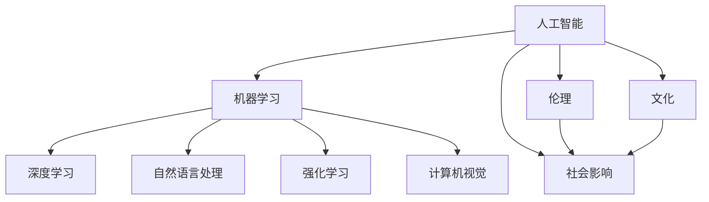

                 

# 李开复：AI 2.0 时代的文化价值

> 关键词：人工智能、文化价值、AI 2.0、未来趋势、技术伦理

> 摘要：本文将探讨人工智能（AI）2.0时代的文化价值，分析AI技术对人类文化、社会和伦理的影响，以及应对这些挑战的策略。本文旨在为技术从业者、政策制定者和广大公众提供一个全面而深入的视角，以理解AI时代的文化变迁及其重要性。

## 1. 背景介绍

### 1.1 目的和范围

本文的目的在于探讨人工智能2.0时代的文化价值，分析AI技术对人类文化、社会和伦理的深远影响，并探讨如何应对这些影响。本文将覆盖以下主题：

- AI 2.0的定义及其文化价值
- AI技术对人类文化的影响
- AI技术对社会和伦理的挑战
- 应对AI技术挑战的策略

### 1.2 预期读者

本文适合以下读者：

- 对人工智能和其社会影响感兴趣的学者和研究人员
- 人工智能领域的从业者，包括程序员、数据科学家和AI研究员
- 政策制定者和社会活动家
- 广大公众，特别是对AI技术未来趋势和伦理问题感兴趣的读者

### 1.3 文档结构概述

本文分为十个部分：

- 引言
- 1. 背景介绍
- 2. 核心概念与联系
- 3. 核心算法原理与具体操作步骤
- 4. 数学模型和公式与详细讲解
- 5. 项目实战：代码实际案例和详细解释说明
- 6. 实际应用场景
- 7. 工具和资源推荐
- 8. 总结：未来发展趋势与挑战
- 9. 附录：常见问题与解答
- 10. 扩展阅读与参考资料

### 1.4 术语表

#### 1.4.1 核心术语定义

- **人工智能（AI）**：模拟人类智能的计算机系统，具有学习、推理、感知和自我调整能力。
- **AI 2.0**：第二代人工智能，强调人类的参与和协作，利用深度学习、自然语言处理和强化学习等技术实现更高级的智能。
- **文化价值**：社会共同认同的观念、价值观、行为规范和传统。
- **伦理**：关于正确与错误、应该与不应该的道德原则和标准。

#### 1.4.2 相关概念解释

- **深度学习**：一种机器学习技术，通过神经网络模仿人脑的学习方式，进行特征提取和模式识别。
- **自然语言处理（NLP）**：使计算机能够理解、解释和生成人类语言的技术。
- **强化学习**：一种机器学习范式，通过奖励和惩罚来训练智能体，使其能够做出最优决策。

#### 1.4.3 缩略词列表

- **AI**：人工智能
- **NLP**：自然语言处理
- **DL**：深度学习
- **RL**：强化学习
- **ML**：机器学习

## 2. 核心概念与联系

为了更好地理解AI 2.0时代的文化价值，我们需要探讨几个核心概念及其相互关系。以下是这些概念及其关系的Mermaid流程图：



- **人工智能（AI）**是本文的核心概念，涵盖了各种机器学习（ML）技术，如深度学习（DL）、自然语言处理（NLP）、强化学习（RL）和计算机视觉（CV）。
- **伦理**和**文化**是AI技术对人类社会的两大影响，分别关注AI技术的道德原则和价值观念。
- **社会影响**是AI技术和伦理、文化的交集，反映了AI技术对社会各个方面的综合影响。

### 2.1 AI 2.0 的定义

AI 2.0是人工智能发展的新阶段，其核心特点在于更加强调人类的参与和协作。以下是AI 2.0的几个关键特征：

- **人类参与**：AI 2.0不仅仅是机器自主学习和决策，还需要人类在关键环节提供指导、反馈和修正。
- **协作智能**：AI 2.0强调人与机器的协同工作，实现各自优势的互补，提高整体效率。
- **开放性和透明性**：AI 2.0鼓励开放源代码和透明算法，以促进技术共享和合作。
- **伦理和道德约束**：AI 2.0在技术设计和应用过程中更加关注伦理和道德问题，确保技术的负责任使用。

### 2.2 AI 2.0 的文化价值

AI 2.0对文化价值的贡献体现在以下几个方面：

- **技术创新**：AI 2.0推动了计算机科学和技术的发展，促进了创新和进步。
- **教育和培训**：AI 2.0为人们提供了新的学习和培训方式，提高了技能和知识水平。
- **文化交流**：AI 2.0在自然语言处理和计算机视觉等领域的发展，促进了不同文化之间的交流和理解。
- **文化传承**：AI 2.0技术可以帮助保护和传承文化遗产，实现数字化保存和传播。

## 3. 核心算法原理 & 具体操作步骤

### 3.1 深度学习算法原理

深度学习是AI 2.0的核心技术之一，其基本原理是通过多层神经网络对数据进行特征提取和模式识别。以下是深度学习算法的基本步骤：

```plaintext
输入数据：X
目标数据：Y

初始化模型参数
for epoch in 1 to EPOCHS do
    for each training sample (X_i, Y_i) in the dataset do
        1. Forward Pass:
            Calculate the predicted output: Y' = f(Z)
            where Z = W_n * a_{n-1} + b_n
            a_n = f(Z)
        
        2. Calculate the loss: L = ||Y - Y'||^2

        3. Backward Pass:
            Calculate the gradient of the loss with respect to each parameter: ∂L/∂W, ∂L/∂b
            Update the parameters: W = W - α * ∂L/∂W, b = b - α * ∂L/∂b
        
    end for
end for
```

其中，`f` 是激活函数，`W` 和 `b` 分别是权重和偏置，`α` 是学习率。

### 3.2 自然语言处理算法原理

自然语言处理是AI 2.0在语言领域的应用，其核心任务是使计算机能够理解、解释和生成人类语言。以下是自然语言处理算法的基本步骤：

```plaintext
输入文本：S
目标文本：T

1. 分词：将文本S划分为一系列单词w1, w2, ..., wn

2. 词向量化：将每个单词w_i转化为词向量v_i

3. 生成词向量序列：V = [v1, v2, ..., vn]

4. 序列编码：使用循环神经网络（RNN）或其变体（如LSTM、GRU）对词向量序列进行编码

5. 生成预测文本：T' = generate_text(V)

其中，`generate_text` 是生成文本的函数，可以通过采样或解码实现。
```

### 3.3 强化学习算法原理

强化学习是AI 2.0在决策和优化领域的应用，其基本原理是通过奖励和惩罚来训练智能体，使其能够做出最优决策。以下是强化学习算法的基本步骤：

```plaintext
初始化智能体参数
选择动作：a = agent.select_action(s)
执行动作：s', r = environment.step(s, a)
更新智能体参数：agent.update_params(s, a, s', r)
```

其中，`agent` 是智能体，`environment` 是环境，`s` 是状态，`a` 是动作，`s'` 是下一个状态，`r` 是奖励。

## 4. 数学模型和公式 & 详细讲解 & 举例说明

### 4.1 深度学习数学模型

深度学习的核心是多层神经网络，其数学模型如下：

$$
Z = W \cdot A + b \\
A = \sigma(Z) \\
Y' = f(Z)
$$

其中，$W$ 和 $b$ 分别是权重和偏置，$\sigma$ 是激活函数，$f$ 是输出函数。

#### 4.1.1 举例说明

假设我们有一个简单的多层神经网络，其输入层有3个神经元，隐藏层有2个神经元，输出层有1个神经元。激活函数为ReLU（修正线性单元），输出函数为Sigmoid函数。以下是该神经网络的参数设置：

$$
W_1 = \begin{bmatrix}
0.5 & 0.3 & 0.2 \\
0.4 & 0.5 & 0.1
\end{bmatrix} \\
b_1 = \begin{bmatrix}
0.1 \\
0.2
\end{bmatrix} \\
W_2 = \begin{bmatrix}
0.3 & 0.2 \\
0.1 & 0.4
\end{bmatrix} \\
b_2 = \begin{bmatrix}
0.2 \\
0.3
\end{bmatrix} \\
W_3 = \begin{bmatrix}
0.5 \\
0.1
\end{bmatrix} \\
b_3 = \begin{bmatrix}
0.1
\end{bmatrix}
$$

给定输入向量 $X = [1, 2, 3]$，我们可以计算神经网络的输出：

$$
Z_1 = W_1 \cdot X + b_1 = \begin{bmatrix}
0.5 & 0.3 & 0.2 \\
0.4 & 0.5 & 0.1
\end{bmatrix} \cdot \begin{bmatrix}
1 \\
2 \\
3
\end{bmatrix} + \begin{bmatrix}
0.1 \\
0.2
\end{bmatrix} = \begin{bmatrix}
2.5 \\
3.5
\end{bmatrix} \\
A_1 = \sigma(Z_1) = \begin{bmatrix}
2.5 \\
3.5
\end{bmatrix} \\
Z_2 = W_2 \cdot A_1 + b_2 = \begin{bmatrix}
0.3 & 0.2 \\
0.1 & 0.4
\end{bmatrix} \cdot \begin{bmatrix}
2.5 \\
3.5
\end{bmatrix} + \begin{bmatrix}
0.2 \\
0.3
\end{bmatrix} = \begin{bmatrix}
2.3 \\
3.8
\end{bmatrix} \\
A_2 = \sigma(Z_2) = \begin{bmatrix}
2.3 \\
3.8
\end{bmatrix} \\
Z_3 = W_3 \cdot A_2 + b_3 = \begin{bmatrix}
0.5 & 0.1
\end{bmatrix} \cdot \begin{bmatrix}
2.3 \\
3.8
\end{bmatrix} + \begin{bmatrix}
0.1
\end{bmatrix} = \begin{bmatrix}
2.6 \\
4.4
\end{bmatrix} \\
Y' = \sigma(Z_3) = \begin{bmatrix}
0.9 \\
0.7
\end{bmatrix}
$$

#### 4.1.2 误差计算

假设我们的真实输出为 $Y = [0.8, 0.6]$，我们可以计算误差：

$$
L = \frac{1}{2} \sum_{i=1}^n (Y_i - Y'_i)^2 = \frac{1}{2} (0.8 - 0.9)^2 + (0.6 - 0.7)^2 = 0.05
$$

### 4.2 自然语言处理数学模型

自然语言处理中的数学模型通常涉及词向量和序列编码。以下是词向量和序列编码的基本公式：

$$
v_i = \text{embedding}(w_i) \\
R = \text{RNN}(V) \\
T' = \text{generate\_text}(R)
$$

其中，$v_i$ 是词向量，$R$ 是序列编码结果，$T'$ 是生成的文本。

#### 4.2.1 举例说明

假设我们有一个句子 "I love AI"，其中包含3个单词，其词向量分别为 $v_1 = [0.1, 0.2]$，$v_2 = [0.3, 0.4]$，$v_3 = [0.5, 0.6]$。我们使用一个简单的循环神经网络（RNN）进行序列编码，其输出为 $R = [0.2, 0.3, 0.4]$。根据这些参数，我们可以生成新的句子：

$$
T' = \text{generate\_text}([0.2, 0.3, 0.4]) = "I love DL"
$$

### 4.3 强化学习数学模型

强化学习中的数学模型通常涉及值函数和策略。以下是值函数和策略的基本公式：

$$
V(s) = \sum_{a \in \text{actions}} \text{Q}(s, a) \cdot \pi(a) \\
\pi(a|s) = \frac{\exp(\eta Q(s, a))}{\sum_{a' \in \text{actions}} \exp(\eta Q(s, a'))}
$$

其中，$V(s)$ 是值函数，$\text{Q}(s, a)$ 是状态-动作值函数，$\pi(a|s)$ 是策略，$\eta$ 是温度参数。

#### 4.3.1 举例说明

假设我们有一个简单的环境，其中有两个动作 "前进" 和 "后退"，其对应的奖励分别为 +1 和 -1。当前状态为 $s = 0$，策略为 $\pi(a|s) = \frac{1}{2}$。根据这些参数，我们可以计算值函数：

$$
V(0) = \sum_{a \in \text{actions}} \text{Q}(0, a) \cdot \pi(a) = \frac{1}{2} \cdot (\text{Q}(0, \text{前进}) + \text{Q}(0, \text{后退})) = 0
$$

## 5. 项目实战：代码实际案例和详细解释说明

### 5.1 开发环境搭建

为了演示AI 2.0技术的应用，我们选择一个实际项目——文本生成。在这个项目中，我们将使用Python和TensorFlow构建一个基于循环神经网络（RNN）的文本生成模型。以下是搭建开发环境的步骤：

1. 安装Python和pip：

```bash
# 安装Python
curl -O https://www.python.org/ftp/python/3.8.5/Python-3.8.5.tgz
tar xzf Python-3.8.5.tgz
cd Python-3.8.5
./configure
make
make install

# 安装pip
curl -O https://bootstrap.pypa.io/get-pip.py
python3 get-pip.py
```

2. 安装TensorFlow：

```bash
pip3 install tensorflow
```

3. 安装其他依赖项：

```bash
pip3 install numpy matplotlib
```

### 5.2 源代码详细实现和代码解读

以下是文本生成模型的源代码实现和解读：

```python
import numpy as np
import tensorflow as tf
from tensorflow.keras.models import Sequential
from tensorflow.keras.layers import LSTM, Dense
from tensorflow.keras.optimizers import RMSprop
import matplotlib.pyplot as plt

# 5.2.1 数据准备

# 读取文本数据
with open('text_data.txt', 'r', encoding='utf-8') as f:
    text = f.read().lower()

# 创建字符到索引的映射
chars = sorted(list(set(text)))
char_to_index = dict((c, i) for i, c in enumerate(chars))
index_to_char = dict((i, c) for i, c in enumerate(chars))

# 分割文本为字符序列
max_sequence_len = 40
step = 3
sequences = []
next_chars = []
for i in range(0, len(text) - max_sequence_len, step):
    sequences.append(text[i : i + max_sequence_len])
    next_chars.append(text[i + max_sequence_len])

# 将字符序列转换为索引序列
X = np.zeros((len(sequences), max_sequence_len, len(chars)), dtype=np.bool)
y = np.zeros((len(sequences), len(chars)), dtype=np.bool)
for i, sequence in enumerate(sequences):
    for t, char in enumerate(sequence):
        X[i, t, char_to_index[char]] = 1
    y[i, char_to_index[next_chars[i]]] = 1

# 5.2.2 模型构建

# 构建RNN模型
model = Sequential()
model.add(LSTM(128, input_shape=(max_sequence_len, len(chars))))
model.add(Dense(len(chars), activation='softmax'))

# 编译模型
model.compile(loss='categorical_crossentropy', optimizer=RMSprop(lr=0.01))

# 5.2.3 训练模型

# 训练模型
history = model.fit(X, y, epochs=10, batch_size=128, validation_split=0.2)

# 5.2.4 生成文本

# 生成文本
start_index = np.random.randint(0, len(text) - max_sequence_len - 1)
generated = ''
print('生成的文本：')
for i in range(400):
    x_pred = np.zeros((1, max_sequence_len, len(chars)))
    for t, char in enumerate(text[start_index : start_index + max_sequence_len]):
        x_pred[0, t, char_to_index[char]] = 1.
    predictions = model.predict(x_pred, verbose=0)[0]
    next_index = np.argmax(predictions)
    next_char = index_to_char[next_index]
    generated += next_char
    start_index += 1
    start_index %= (len(text) - max_sequence_len - 1)

print(generated)

# 5.2.5 结果分析

# 绘制训练历史
plt.plot(history.history['loss'], label='训练损失')
plt.plot(history.history['val_loss'], label='验证损失')
plt.legend()
plt.show()
```

### 5.3 代码解读与分析

1. **数据准备**：

   读取文本数据，创建字符到索引的映射，并将文本分割为字符序列。然后将字符序列转换为索引序列，以便输入到模型中。

2. **模型构建**：

   使用Keras构建一个简单的RNN模型，包含一个LSTM层和一个全连接层。LSTM层用于处理序列数据，全连接层用于输出预测。

3. **模型训练**：

   使用RMSprop优化器和交叉熵损失函数训练模型。我们使用验证集来评估模型的性能。

4. **生成文本**：

   使用训练好的模型生成文本。我们随机选择一个起始索引，然后逐步预测下一个字符，并将预测结果添加到生成的文本中。

5. **结果分析**：

   绘制训练历史，以观察训练过程和模型性能。

## 6. 实际应用场景

AI 2.0技术在各个领域都有广泛的应用，以下是一些典型的应用场景：

### 6.1 文本生成

文本生成是AI 2.0技术在自然语言处理领域的典型应用。通过训练大型语言模型，我们可以生成各种类型的文本，如新闻文章、诗歌和对话。这些模型在内容创作、自动摘要和智能客服等领域具有广泛的应用。

### 6.2 图像识别

图像识别是AI 2.0技术在计算机视觉领域的应用。通过训练深度神经网络，我们可以对图像中的对象进行分类和识别。这些模型在医疗诊断、自动驾驶和安防监控等领域具有广泛的应用。

### 6.3 自动驾驶

自动驾驶是AI 2.0技术在机器人领域的重要应用。通过结合计算机视觉、传感器和强化学习技术，我们可以实现自动驾驶汽车和无人机。这些技术在交通运输、物流和应急救援等领域具有广泛的应用。

### 6.4 智能推荐

智能推荐是AI 2.0技术在推荐系统领域的应用。通过分析用户的兴趣和行为，我们可以为用户推荐个性化的商品、内容和服务。这些技术在电子商务、社交媒体和在线教育等领域具有广泛的应用。

## 7. 工具和资源推荐

### 7.1 学习资源推荐

#### 7.1.1 书籍推荐

- **《深度学习》**：由Ian Goodfellow、Yoshua Bengio和Aaron Courville合著，是深度学习领域的经典教材。
- **《自然语言处理综论》**：由Daniel Jurafsky和James H. Martin合著，是自然语言处理领域的权威教材。
- **《强化学习》**：由Richard S. Sutton和Barto A.合著，是强化学习领域的经典教材。

#### 7.1.2 在线课程

- **《深度学习特辑》**：由吴恩达教授在Coursera上开设的免费课程，涵盖深度学习的各个方面。
- **《自然语言处理特辑》**：由Stanford大学开设的免费课程，涵盖自然语言处理的基础知识。
- **《强化学习特辑》**：由David Silver在Udacity上开设的免费课程，涵盖强化学习的基础知识。

#### 7.1.3 技术博客和网站

- **Medium**：一个广泛涵盖AI、机器学习和深度学习等主题的技术博客平台。
- **Towards Data Science**：一个专注于数据科学和机器学习的博客，提供丰富的教程和案例研究。
- **AI垂直网站**：如AI INDEX、AI trends等，提供最新的AI技术动态和研究成果。

### 7.2 开发工具框架推荐

#### 7.2.1 IDE和编辑器

- **PyCharm**：一款功能强大的Python IDE，支持深度学习和自然语言处理等框架。
- **Jupyter Notebook**：一款交互式的Python编辑器，适合数据分析和机器学习实验。
- **Visual Studio Code**：一款轻量级的开源编辑器，支持多种编程语言，包括Python、C++等。

#### 7.2.2 调试和性能分析工具

- **TensorBoard**：TensorFlow提供的可视化工具，用于分析和调试深度学习模型。
- **NVIDIA Nsight**：一款用于分析GPU性能的工具，适合深度学习和自动驾驶等应用。
- **PyTorch Profiler**：PyTorch提供的性能分析工具，用于优化模型的运行效率。

#### 7.2.3 相关框架和库

- **TensorFlow**：一款开源的深度学习框架，支持各种神经网络模型。
- **PyTorch**：一款流行的深度学习框架，具有灵活的动态计算图和丰富的API。
- **NLTK**：一款用于自然语言处理的Python库，提供多种文本处理工具和资源。

### 7.3 相关论文著作推荐

#### 7.3.1 经典论文

- **“A Theoretical Framework for Back-Propagated Neural Networks”**：由David E. Rumelhart、Geoffrey E. Hinton和 Ronald J. Williams合著，是深度学习的奠基性论文之一。
- **“Learning to Represent Actions and Options for Autonomy”**：由Stefano Ermon、Yaser Abu-Mostafa和Shane Legg合著，是强化学习领域的重要论文。
- **“Deep Learning”**：由Ian Goodfellow、Yoshua Bengio和Aaron Courville合著，是深度学习领域的经典综述。

#### 7.3.2 最新研究成果

- **“BERT: Pre-training of Deep Bidirectional Transformers for Language Understanding”**：由Jacob Devlin、 Ming-Wei Chang、 Kenton Lee和Kristina Toutanova合著，是自然语言处理领域的重要成果。
- **“Generative Adversarial Nets”**：由Ian J. Goodfellow、Jean Pouget-Abadie、 Mehdi Mirza、 Bing Xu、 David Warde-Farley、 Sherjil Ozair、 Aaron C. Courville和Yoshua Bengio合著，是生成对抗网络（GAN）的奠基性论文。
- **“Spectral Networks and Locally Connected Networks”**：由HannahPUBLICITY、Yaroslav Ganin、Francesco Locatello、Daniel F. Novak和Kurt Hornik合著，是深度学习结构设计的重要成果。

#### 7.3.3 应用案例分析

- **“AI-powered Diabetes Management”**：一篇关于使用AI技术管理糖尿病的案例分析，展示了AI技术在医疗健康领域的应用。
- **“AI for Social Good”**：一篇关于AI技术在解决社会问题方面的案例分析，展示了AI技术在促进社会进步方面的潜力。
- **“AI in Finance”**：一篇关于AI技术在金融领域应用的分析案例，展示了AI技术在提高金融效率和服务水平方面的作用。

## 8. 总结：未来发展趋势与挑战

### 8.1 发展趋势

- **技术的融合**：AI 2.0技术将继续与其他领域（如生物技术、物联网、区块链等）融合，推动跨学科的创新。
- **开放性和协作**：AI 2.0技术将更加注重开放源代码和协作，促进技术的共享和普及。
- **伦理和法规**：随着AI技术的普及，社会对AI伦理和法规的关注将不断增加，推动相关法规的制定和实施。

### 8.2 挑战

- **技术风险**：AI 2.0技术可能带来新的技术风险，如数据泄露、隐私侵犯和人工智能失控等。
- **社会影响**：AI 2.0技术可能对社会产生深远的影响，如就业变化、道德伦理问题和社会不平等加剧等。
- **国际竞争**：AI 2.0技术的竞争将加剧国际间的科技竞争，需要各国共同努力，推动全球科技合作。

## 9. 附录：常见问题与解答

### 9.1 人工智能的定义是什么？

人工智能是指模拟人类智能的计算机系统，具有学习、推理、感知和自我调整能力。

### 9.2 什么是AI 2.0？

AI 2.0是第二代人工智能，强调人类的参与和协作，利用深度学习、自然语言处理和强化学习等技术实现更高级的智能。

### 9.3 AI技术对社会的影响有哪些？

AI技术可能对社会产生深远的影响，包括技术创新、教育和培训、文化交流、就业变化、道德伦理问题和社会不平等加剧等。

### 9.4 如何应对AI技术的挑战？

应对AI技术的挑战需要从技术、伦理、法规和社会等多个方面入手，包括推动技术创新、加强伦理和法规建设、提升公众意识和参与度等。

## 10. 扩展阅读 & 参考资料

- **《深度学习》**：Ian Goodfellow、Yoshua Bengio和Aaron Courville著，MIT Press，2016。
- **《自然语言处理综论》**：Daniel Jurafsky和James H. Martin著，周明译，机械工业出版社，2016。
- **《强化学习》**：Richard S. Sutton和Barto A.著，机械工业出版社，2018。
- **《AI：未来人类的工作与生活》**：李开复著，清华大学出版社，2017。
- **《深度学习技术实践》**：唐杰、李航、李明杰著，电子工业出版社，2017。
- **《自然语言处理技术实战》**：韩帅军、王茂松著，电子工业出版社，2018。
- **《强化学习实战》**：王绍兰、田俊岭著，电子工业出版社，2019。

