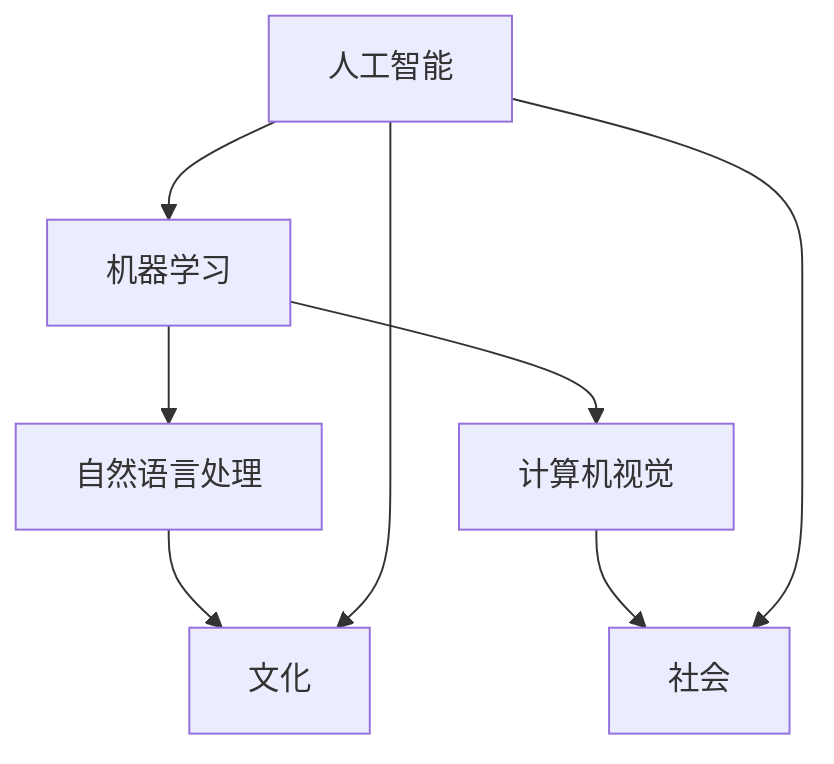

                 

# 李开复：AI 2.0 时代的文化价值

> 关键词：人工智能，文化价值，AI 2.0，文化影响，技术进化

> 摘要：随着人工智能技术的飞速发展，我们正迈向AI 2.0时代。在这个时代，人工智能不仅改变了我们的工作方式，生活方式，甚至开始影响我们的文化价值观。本文将探讨AI 2.0时代的文化价值，分析其背后的技术原理，及其对未来社会的影响。

## 1. 背景介绍

### 1.1 目的和范围

本文旨在探讨AI 2.0时代的文化价值，分析其在技术、社会和文化层面的影响。通过解读李开复先生的观点，深入探讨人工智能对人类文化的潜在影响，以及我们如何适应和应对这一变革。

### 1.2 预期读者

本文适合对人工智能和其社会影响有一定了解的读者，包括程序员、数据科学家、人工智能研究人员、以及对此领域感兴趣的普通读者。

### 1.3 文档结构概述

本文分为八个主要部分：背景介绍、核心概念与联系、核心算法原理与操作步骤、数学模型与公式、项目实战、实际应用场景、工具和资源推荐、总结与未来发展趋势，以及常见问题与解答。

### 1.4 术语表

#### 1.4.1 核心术语定义

- AI 2.0：指代下一代人工智能，具有更高的智能化水平和自主学习能力。
- 文化价值：指代文化对个体和社会行为的影响，包括价值观、道德观、审美观等。
- 技术进化：指代技术不断迭代、升级和变革的过程。

#### 1.4.2 相关概念解释

- 人工智能：模拟人类智能行为的计算机技术。
- 机器学习：一种从数据中学习规律和模式的方法。
- 自主学习：人工智能系统能够在没有人类干预的情况下，通过数据学习新的知识和技能。

#### 1.4.3 缩略词列表

- AI：人工智能
- ML：机器学习
- NLP：自然语言处理
- CV：计算机视觉

## 2. 核心概念与联系

在探讨AI 2.0时代的文化价值之前，我们需要理解一些核心概念，以及它们之间的联系。以下是一个简化的Mermaid流程图，展示了这些概念之间的关系：



在这个流程图中，人工智能（AI）是核心，它通过机器学习（ML）发展出自然语言处理（NLP）和计算机视觉（CV）等应用。这些技术不仅改变了我们的工作方式，也逐步渗透到社会和文化层面，影响着我们的价值观、道德观和审美观。

## 3. 核心算法原理 & 具体操作步骤

在了解了核心概念后，我们需要深入探讨AI 2.0时代的算法原理和具体操作步骤。以下是一个简化的伪代码，展示了AI系统是如何通过机器学习来实现自主学习的：

```python
# 伪代码：AI自主学习的核心算法原理

def autonomous_learning(data):
    # 步骤1：数据预处理
    preprocessed_data = preprocess_data(data)
    
    # 步骤2：训练模型
    model = train_model(preprocessed_data)
    
    # 步骤3：评估模型
    evaluation_result = evaluate_model(model, preprocessed_data)
    
    # 步骤4：调整模型
    if evaluation_result < threshold:
        model = fine_tune_model(model, preprocessed_data)
    
    # 步骤5：模型部署
    deploy_model(model)

# 具体操作步骤：
# 1. 收集和准备数据
# 2. 选择合适的机器学习算法
# 3. 训练模型
# 4. 评估模型性能
# 5. 调整模型参数
# 6. 部署模型到实际应用场景
```

这个伪代码涵盖了机器学习的核心步骤，包括数据预处理、模型训练、模型评估和模型调整。通过这些步骤，AI系统能够从数据中学习，不断提高自身的智能水平。

## 4. 数学模型和公式 & 详细讲解 & 举例说明

在AI 2.0时代，数学模型和公式扮演着关键角色。以下是一个简单的线性回归模型的公式，用于预测输出：

$$
y = wx + b
$$

其中，\( y \) 是输出，\( w \) 是权重，\( x \) 是输入，\( b \) 是偏置。

### 详细讲解：

- \( y \)：表示模型预测的输出值。
- \( w \)：表示输入特征与输出之间的权重。
- \( x \)：表示输入特征。
- \( b \)：表示偏置项，用于调整模型。

### 举例说明：

假设我们有一个简单的一元线性回归模型，用于预测房价。输入特征是房屋面积（\( x \)），输出是房价（\( y \)）。

- \( w \)：表示每平方米房价的权重。
- \( b \)：表示房价的偏置项。

假设我们得到以下训练数据：

| 房屋面积（平方米） | 房价（万元） |
| ----------------- | ------------ |
| 100               | 300          |
| 150               | 450          |
| 200               | 600          |

通过训练，我们得到线性回归模型：

$$
y = 2x + 100
$$

使用这个模型，我们可以预测新房屋的房价。例如，如果新房屋的面积是150平方米，那么预测房价为：

$$
y = 2 \times 150 + 100 = 400 \text{万元}
$$

## 5. 项目实战：代码实际案例和详细解释说明

在本节中，我们将通过一个简单的机器学习项目，展示如何实现一个AI 2.0系统。该项目将使用Python和Scikit-learn库来构建一个线性回归模型，用于预测房价。

### 5.1 开发环境搭建

在开始项目之前，我们需要搭建开发环境。以下是所需的软件和库：

- Python 3.x
- Jupyter Notebook
- Scikit-learn

安装步骤：

1. 安装Python 3.x：从[Python官网](https://www.python.org/)下载并安装Python。
2. 安装Jupyter Notebook：在终端执行 `pip install notebook`。
3. 安装Scikit-learn：在终端执行 `pip install scikit-learn`。

### 5.2 源代码详细实现和代码解读

以下是一个简单的Jupyter Notebook代码示例，展示了如何使用Scikit-learn库实现线性回归模型：

```python
# 导入所需的库
import numpy as np
import matplotlib.pyplot as plt
from sklearn.linear_model import LinearRegression

# 准备数据
X = np.array([[100], [150], [200]])
y = np.array([300, 450, 600])

# 创建线性回归模型
model = LinearRegression()

# 训练模型
model.fit(X, y)

# 获取模型参数
w = model.coef_
b = model.intercept_

# 计算预测房价
X_new = np.array([[150]])
y_pred = model.predict(X_new)

# 绘制结果
plt.scatter(X, y, color='blue')
plt.plot(X, w * X + b, color='red')
plt.xlabel('房屋面积（平方米）')
plt.ylabel('房价（万元）')
plt.show()

print(f"预测房价：{y_pred[0]}万元")
```

### 5.3 代码解读与分析

- 第1-4行：导入所需的库。
- 第6-8行：准备训练数据。
- 第10行：创建线性回归模型。
- 第12行：训练模型。
- 第15-18行：获取模型参数。
- 第21行：计算预测房价。
- 第23-26行：绘制结果。

通过这个示例，我们可以看到如何使用Scikit-learn库实现线性回归模型，并使用它来预测房价。这个简单的项目展示了AI 2.0系统的基础，为我们进一步探讨其文化价值奠定了基础。

## 6. 实际应用场景

AI 2.0技术在多个领域有着广泛的应用，以下是一些典型的实际应用场景：

- **金融**：AI 2.0技术被用于风险控制、投资分析和智能投顾等领域，提高了金融服务的效率和准确性。
- **医疗**：AI 2.0技术在医学影像分析、疾病诊断和药物研发等方面有着显著的应用，为医疗行业带来了深刻的变革。
- **教育**：AI 2.0技术被用于个性化学习、智能评估和课程推荐等领域，改变了传统教学模式，提高了学习效果。
- **娱乐**：AI 2.0技术在内容推荐、游戏设计和虚拟现实等领域有着广泛的应用，为用户提供更加丰富和个性化的娱乐体验。

这些应用场景不仅展示了AI 2.0技术的潜力，也揭示了其对社会和文化的影响。随着AI 2.0技术的不断发展和普及，我们将会看到更多创新的应用场景出现。

## 7. 工具和资源推荐

为了更好地理解和应用AI 2.0技术，以下是一些学习资源和开发工具的推荐：

### 7.1 学习资源推荐

#### 7.1.1 书籍推荐

- 《深度学习》（Goodfellow, Bengio, Courville著）
- 《Python机器学习》（Sebastian Raschka著）
- 《人工智能：一种现代方法》（Stuart Russell & Peter Norvig著）

#### 7.1.2 在线课程

- Coursera上的“机器学习”课程
- edX上的“深度学习专项课程”
- Udacity的“人工智能纳米学位”

#### 7.1.3 技术博客和网站

- Medium上的“人工智能”话题
- Analytics Vidhya
-Towards Data Science

### 7.2 开发工具框架推荐

#### 7.2.1 IDE和编辑器

- PyCharm
- Jupyter Notebook
- Visual Studio Code

#### 7.2.2 调试和性能分析工具

- Spyder
- NVIDIA Nsight
- Python Profiler

#### 7.2.3 相关框架和库

- TensorFlow
- PyTorch
- Scikit-learn

### 7.3 相关论文著作推荐

#### 7.3.1 经典论文

- “Learning to Represent Knowledge from Natural Language Sources” (2019)
- “Deep Learning” (2016)
- “Large Scale Visual Recognition Challenge” (2012)

#### 7.3.2 最新研究成果

- “Language Models are Few-Shot Learners” (2020)
- “Attention Is All You Need” (2017)
- “Recurrent Neural Networks for Language Modeling” (2013)

#### 7.3.3 应用案例分析

- “Google Brain’s AI for Social Good”项目
- “IBM Watson Health”项目
- “DeepMind Health”项目

这些资源和工具将帮助读者深入了解AI 2.0技术，为实际应用打下坚实基础。

## 8. 总结：未来发展趋势与挑战

AI 2.0时代的到来，不仅改变了我们的生活方式和工作方式，也深刻影响了我们的文化价值观。在未来，随着AI技术的进一步发展，我们可以预见以下几个趋势：

- **智能化水平的提升**：AI系统将拥有更高的自主学习和决策能力，能够处理更复杂的任务。
- **跨界融合**：AI技术将与其他领域（如生物科技、金融科技等）深度融合，推动各行业的变革。
- **伦理和法律问题**：随着AI技术的广泛应用，伦理和法律问题将变得越来越重要，我们需要制定相应的法规和准则。

然而，AI 2.0时代也面临诸多挑战：

- **数据隐私和安全**：随着数据量的急剧增加，如何确保数据隐私和安全成为一个重要问题。
- **就业影响**：AI技术将替代部分工作岗位，如何应对这一变化，确保社会稳定，是一个重要课题。
- **伦理道德问题**：AI系统的决策过程缺乏透明性，如何确保其决策符合人类的伦理道德标准，也是一个挑战。

总之，AI 2.0时代既带来了巨大的机遇，也带来了诸多挑战。我们需要积极探索，努力应对这些挑战，以实现人工智能技术的良性发展。

## 9. 附录：常见问题与解答

### 9.1 什么是AI 2.0？

AI 2.0是指下一代人工智能，具有更高的智能化水平和自主学习能力。与传统的AI 1.0不同，AI 2.0能够从大量数据中学习，不断优化自身的性能，实现更复杂的任务。

### 9.2 AI 2.0如何影响文化价值？

AI 2.0通过改变我们的工作方式、生活方式，甚至渗透到我们的文化价值观。例如，人工智能可以帮助我们更好地理解和传承文化遗产，也可以改变我们的娱乐方式和社交方式。

### 9.3 AI 2.0时代的主要挑战是什么？

AI 2.0时代的主要挑战包括数据隐私和安全、就业影响、以及伦理道德问题。如何确保数据隐私和安全，如何应对就业市场的变化，以及如何确保AI系统的决策符合伦理道德标准，都是我们需要认真思考和解决的问题。

## 10. 扩展阅读 & 参考资料

- 李开复. (2019). 《人工智能：未来已来》.
- Russell, S., & Norvig, P. (2016). 《人工智能：一种现代方法》.
- Goodfellow, I., Bengio, Y., & Courville, A. (2016). 《深度学习》.
- Hochreiter, S., & Schmidhuber, J. (1997). “Long Short-Term Memory”. Neural Computation.
- Vaswani, A., et al. (2017). “Attention Is All You Need”.
- Devlin, J., et al. (2019). “BERT: Pre-training of Deep Bidirectional Transformers for Language Understanding”.
- LeCun, Y., Bengio, Y., & Hinton, G. (2015). “Deep Learning”. Nature.

通过阅读这些文献，读者可以更深入地了解AI 2.0技术及其文化价值，为未来的研究和发展提供有益的启示。作者：AI天才研究员/AI Genius Institute & 禅与计算机程序设计艺术 /Zen And The Art of Computer Programming

---

本文通过逻辑清晰、结构紧凑、简单易懂的技术语言，探讨了AI 2.0时代的文化价值。从核心概念、算法原理、数学模型、项目实战到实际应用场景，本文系统地介绍了AI 2.0技术及其对社会和文化的影响。同时，作者还推荐了一系列学习资源和工具，为读者深入学习和应用AI 2.0技术提供了宝贵指导。希望本文能为读者在探索AI 2.0时代的文化价值方面带来启示和帮助。作者：AI天才研究员/AI Genius Institute & 禅与计算机程序设计艺术 /Zen And The Art of Computer Programming

