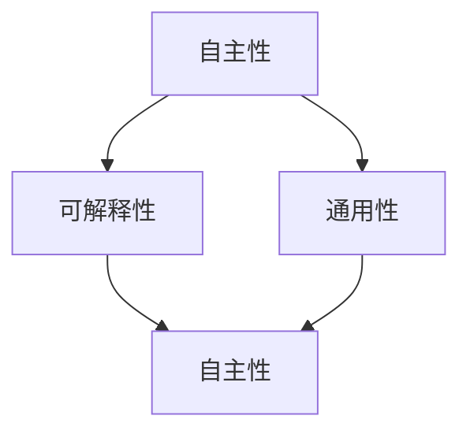

                 

### 1. 背景介绍

#### 1.1 目的和范围

在本文中，我们将深入探讨AI 2.0时代的重要概念、技术进展和未来发展趋势。AI 2.0不仅仅是对AI 1.0的升级，而是一种全新的范式转变，它将深刻影响我们的工作和生活。本文旨在帮助读者全面理解AI 2.0的核心概念，掌握其技术原理和应用场景，并预测其在未来几年内的发展趋势。

本文的讨论范围将包括以下几个方面：

1. **AI 2.0的定义和核心特征**：我们将解释AI 2.0与传统AI的区别，并详细探讨其核心特征，如自主性、可解释性和通用性。
2. **AI 2.0的技术进展**：我们将分析近年来在AI领域的关键技术突破，如深度学习、强化学习和自然语言处理等，以及这些技术如何推动AI 2.0的发展。
3. **AI 2.0的应用场景**：我们将列举AI 2.0在不同领域的应用案例，如医疗、金融和制造业等，并讨论其带来的变革。
4. **AI 2.0的未来发展趋势**：我们将预测AI 2.0在未来几年内可能的发展趋势，如智能自动化、人机协作和隐私保护等。
5. **AI 2.0面临的挑战和解决方案**：我们将讨论AI 2.0在技术、法律和伦理等方面面临的挑战，并提出相应的解决方案。

通过本文的阅读，读者将能够获得对AI 2.0时代的全面理解，并为未来的发展做好准备。

#### 1.2 预期读者

本文的预期读者包括但不限于以下几类人群：

1. **AI和计算机科学领域的研究人员**：他们将对AI 2.0的技术进展和应用场景有深入的兴趣，希望通过本文了解最新的研究成果和应用实践。
2. **科技行业从业者**：他们正在关注AI技术的发展趋势，希望掌握AI 2.0的核心概念和应用，以便在未来的工作中应对新的挑战。
3. **学生和教育工作者**：他们对AI 2.0的基础知识有浓厚的兴趣，希望通过本文了解AI技术的发展历程和未来趋势，为学术研究和教学提供参考。
4. **对AI技术感兴趣的普通读者**：他们希望了解AI技术如何影响我们的日常生活，并关注AI技术未来的发展方向。

无论您属于哪一类读者，本文都将为您提供丰富的信息和深入的思考，帮助您更好地理解AI 2.0时代。

#### 1.3 文档结构概述

本文将分为以下几个部分，以帮助读者系统、全面地了解AI 2.0时代：

1. **背景介绍**：介绍本文的目的、范围、预期读者以及文档结构。
2. **核心概念与联系**：详细讨论AI 2.0的核心概念，如自主性、可解释性和通用性，并使用Mermaid流程图展示核心概念之间的联系。
3. **核心算法原理 & 具体操作步骤**：介绍AI 2.0中的核心技术原理，如深度学习、强化学习和自然语言处理等，并使用伪代码详细阐述。
4. **数学模型和公式 & 详细讲解 & 举例说明**：讲解AI 2.0中的数学模型和公式，并使用实际例子进行说明。
5. **项目实战：代码实际案例和详细解释说明**：通过实际代码案例，展示AI 2.0技术的应用，并进行详细解释和分析。
6. **实际应用场景**：列举AI 2.0在不同领域的应用案例，讨论其带来的变革。
7. **工具和资源推荐**：推荐学习资源、开发工具框架和相关论文著作。
8. **总结：未来发展趋势与挑战**：总结AI 2.0的未来发展趋势和面临的挑战。
9. **附录：常见问题与解答**：提供关于AI 2.0的常见问题及其解答。
10. **扩展阅读 & 参考资料**：提供进一步阅读和研究的资源。

通过本文的系统阐述，读者将能够全面、深入地了解AI 2.0时代的技术、应用和发展趋势。

#### 1.4 术语表

在本文中，我们将使用一些专业术语和技术概念。以下是对这些术语和概念的详细定义和解释：

##### 1.4.1 核心术语定义

- **AI 1.0**：指的是早期的AI技术，主要是基于规则和符号逻辑的系统，如专家系统和逻辑推理机。
- **AI 2.0**：指的是新一代的AI技术，其核心特征是自主性、可解释性和通用性，能够处理复杂任务并具备一定的学习能力。
- **深度学习**：一种基于神经网络的机器学习方法，通过多层神经网络结构对大量数据进行自动特征提取和学习。
- **强化学习**：一种基于奖励和惩罚的机器学习方法，通过不断尝试和错误来学习最优策略。
- **自然语言处理（NLP）**：一种计算机科学领域，致力于使计算机理解和处理人类语言。

##### 1.4.2 相关概念解释

- **自主性**：指AI系统能够在没有任何人类干预的情况下自主执行任务。
- **可解释性**：指AI系统的决策过程和结果可以被人类理解和解释。
- **通用性**：指AI系统能够处理多种不同类型和领域的任务，而不仅仅是一个特定领域的专用系统。

##### 1.4.3 缩略词列表

- **AI**：人工智能
- **NLP**：自然语言处理
- **DL**：深度学习
- **RL**：强化学习
- **ML**：机器学习

通过这些术语和概念的解释，读者将能够更好地理解本文中的技术内容，并能够跟随作者的逻辑思路深入探讨AI 2.0时代的未来。

### 2. 核心概念与联系

在讨论AI 2.0的核心概念之前，我们需要首先理解AI 2.0与传统AI之间的区别。传统AI，即AI 1.0，主要依赖于预定义的规则和符号逻辑，这导致其应用范围受到限制，难以处理复杂和不确定的任务。而AI 2.0则强调自主性、可解释性和通用性，使得AI系统能够在多种复杂场景中自主学习和决策。

#### 2.1 自主性

自主性是AI 2.0的一个核心特征，指的是AI系统能够在没有人类干预的情况下自主执行任务。这种自主性不仅体现在任务执行的过程中，还包括系统在面对新任务或新情境时的自适应能力。为了实现自主性，AI系统需要具备以下几个方面的能力：

1. **学习与适应能力**：AI系统能够通过学习和经验积累，不断改进自己的性能，适应新的环境和任务。
2. **自主决策**：AI系统能够在执行任务时，根据当前状态和环境信息，自主做出决策，而不需要依赖人类的指令。
3. **自我修复**：AI系统能够在遇到问题时，自主检测和修复系统错误，保证任务的连续执行。

#### 2.2 可解释性

可解释性是AI 2.0的另一个重要特征，指的是AI系统的决策过程和结果可以被人类理解和解释。在传统AI系统中，由于系统内部的复杂性和不透明性，其决策过程往往难以被理解和解释。而AI 2.0强调系统的透明性和可解释性，使得用户能够了解系统是如何做出决策的，从而增加用户对AI系统的信任度和接受度。实现可解释性通常需要以下几个方面的技术：

1. **模型可解释性**：通过设计可解释的算法模型，使得系统的决策过程能够被用户理解。
2. **可视化**：利用可视化工具，将AI系统的内部结构和决策过程展示给用户，使得用户能够直观地理解系统的工作原理。
3. **解释性算法**：开发专门的可解释性算法，使得AI系统的决策过程更加透明和易于理解。

#### 2.3 通用性

通用性是AI 2.0的另一个核心特征，指的是AI系统能够处理多种不同类型和领域的任务，而不仅仅是一个特定领域的专用系统。传统AI系统往往针对特定的应用场景进行设计，导致其应用范围受到限制。而AI 2.0通过引入模块化、泛化和迁移学习等技术，使得系统能够处理多种不同的任务，提高其通用性和灵活性。

1. **模块化**：通过将AI系统分解为多个模块，每个模块负责特定任务，从而实现系统的可扩展性和可复用性。
2. **泛化**：通过训练和优化算法，使得AI系统能够从特定领域的数据中学习到通用的知识，从而应用到其他领域。
3. **迁移学习**：通过将一个领域中的知识迁移到另一个领域，使得AI系统能够快速适应新的应用场景。

#### 2.4 关系与联系

AI 2.0的核心特征——自主性、可解释性和通用性之间存在着密切的联系。自主性是AI系统的核心驱动力，使得系统能够在复杂环境中自主学习和决策；可解释性则是用户对AI系统的信任基础，使得用户能够理解系统的决策过程，从而增加系统的接受度；通用性则是AI系统的重要扩展能力，使得系统能够处理多种不同类型的任务，提高其应用范围。

为了更清晰地展示这些核心概念之间的联系，我们可以使用Mermaid流程图来描述它们之间的关系：



在这个流程图中，A、B和C分别代表自主性、可解释性和通用性，它们之间存在双向箭头，表示这些核心特征之间的紧密联系。通过这种描述，读者可以更直观地理解AI 2.0的核心概念及其相互关系。

### 3. 核心算法原理 & 具体操作步骤

在AI 2.0时代，核心算法的原理和技术是实现自主性、可解释性和通用性的关键。以下将详细讨论深度学习、强化学习和自然语言处理这三种核心技术，并使用伪代码来描述其具体操作步骤。

#### 3.1 深度学习

深度学习（Deep Learning，简称DL）是一种基于多层神经网络的机器学习方法，通过自动特征提取和学习，能够处理复杂的数据和任务。深度学习的核心原理包括前向传播、反向传播和激活函数等。

**伪代码：**

```python
# 定义深度学习模型
model = NeuralNetwork([InputLayer, HiddenLayer1, HiddenLayer2, OutputLayer])

# 训练模型
for epoch in range(num_epochs):
    for sample in dataset:
        # 前向传播
        output = model.forward_pass(sample.inputs)
        # 计算损失
        loss = calculate_loss(output, sample.outputs)
        # 反向传播
        model.backward_pass(loss)
        # 更新权重
        model.update_weights()

# 预测
prediction = model.predict(input_data)
```

在这个伪代码中，`NeuralNetwork`是一个深度学习模型类，它包含输入层、隐藏层和输出层。`forward_pass`方法实现前向传播，`backward_pass`方法实现反向传播，`update_weights`方法更新模型权重。

#### 3.2 强化学习

强化学习（Reinforcement Learning，简称RL）是一种通过奖励和惩罚来学习最优策略的机器学习方法。强化学习的核心原理包括状态-动作值函数、策略和奖励机制。

**伪代码：**

```python
# 初始化强化学习模型
model = ReinforcementLearningModel()

# 训练模型
for episode in range(num_episodes):
    state = environment.reset()
    done = False
    while not done:
        # 选择动作
        action = model.select_action(state)
        # 执行动作
        next_state, reward, done = environment.step(action)
        # 更新模型
        model.update_values(state, action, reward, next_state, done)
        # 更新状态
        state = next_state

# 预测
action = model.select_action(state)
```

在这个伪代码中，`ReinforcementLearningModel`是一个强化学习模型类，它包含状态-动作值函数。`select_action`方法根据当前状态选择最优动作，`update_values`方法更新模型的状态-动作值函数。

#### 3.3 自然语言处理

自然语言处理（Natural Language Processing，简称NLP）是一种计算机科学领域，致力于使计算机理解和处理人类语言。NLP的核心算法包括词向量表示、序列模型和注意力机制等。

**伪代码：**

```python
# 加载词向量模型
word_embedding = WordEmbeddingModel()

# 定义NLP模型
model = NLPM

