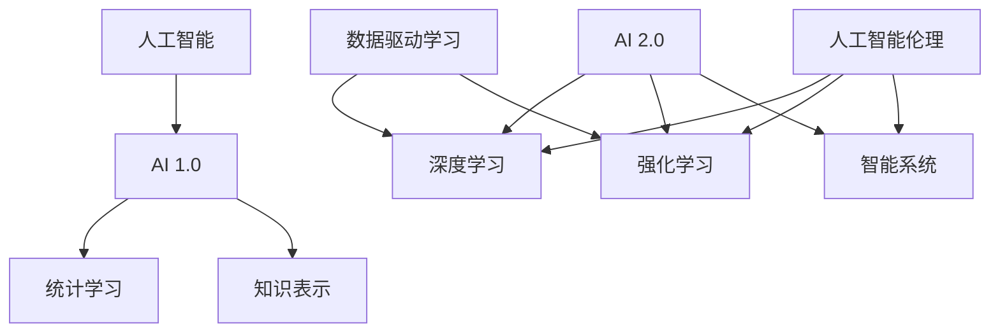

                 

# 李开复：AI 2.0 时代的未来展望

> 关键词：人工智能、AI 2.0、未来展望、深度学习、强化学习、智能系统、应用场景

> 摘要：本文由人工智能领域大师李开复撰写，深入探讨了AI 2.0时代的核心概念、发展历程、技术原理以及未来应用。通过逻辑清晰的章节结构，从背景介绍到核心算法原理，再到实际应用场景和未来发展挑战，全面剖析了AI 2.0时代的关键技术和趋势。

## 1. 背景介绍

### 1.1 目的和范围

本文旨在全面介绍AI 2.0时代的概念、技术原理和应用前景，帮助读者深入了解这一革命性技术的重要性和潜在影响。文章将涵盖以下几个核心方面：

1. AI 2.0的定义和发展历程
2. AI 2.0的核心技术原理，包括深度学习和强化学习
3. AI 2.0在不同领域的应用场景
4. AI 2.0时代的未来趋势和挑战

### 1.2 预期读者

本文适用于以下读者群体：

1. 计算机科学和人工智能领域的研究人员和学生
2. 对人工智能技术有浓厚兴趣的技术爱好者
3. 想了解AI 2.0时代前景的商业人士和投资者
4. 任何对人工智能技术发展感兴趣的人士

### 1.3 文档结构概述

本文分为十个主要章节，结构如下：

1. 引言
2. 背景介绍
3. 核心概念与联系
4. 核心算法原理 & 具体操作步骤
5. 数学模型和公式 & 详细讲解 & 举例说明
6. 项目实战：代码实际案例和详细解释说明
7. 实际应用场景
8. 工具和资源推荐
9. 总结：未来发展趋势与挑战
10. 附录：常见问题与解答
11. 扩展阅读 & 参考资料

### 1.4 术语表

#### 1.4.1 核心术语定义

- AI 2.0：第二代人工智能，具有自我学习和决策能力，能够超越人类水平。
- 深度学习：一种通过多层神经网络进行数据建模和特征提取的人工智能技术。
- 强化学习：一种通过试错和反馈优化决策过程的人工智能技术。
- 智能系统：具备感知、理解、学习和决策能力的计算机系统。

#### 1.4.2 相关概念解释

- 数据驱动的学习：一种基于大规模数据集进行训练和优化的学习方式。
- 人工智能伦理：研究人工智能技术的社会影响和道德责任。
- 自动驾驶：利用人工智能技术实现车辆自主行驶。

#### 1.4.3 缩略词列表

- AI：人工智能
- ML：机器学习
- DL：深度学习
- RL：强化学习
- NLP：自然语言处理

## 2. 核心概念与联系

在探讨AI 2.0的核心概念之前，我们需要了解一些基本的人工智能原理和架构。以下是一个简单的Mermaid流程图，展示了AI 2.0的关键概念及其相互关系：



### 2.1 AI 1.0和AI 2.0的对比

AI 1.0时代主要依赖于统计学习方法和规则系统，如决策树、支持向量机和朴素贝叶斯等。这些方法在特定领域表现出色，但受限于数据的规模和质量。AI 2.0则通过深度学习和强化学习等新技术，实现了更广泛的应用和更高的性能。

- **AI 1.0的特点**：
  - 基于规则和统计模型
  - 需要大量手动特征工程
  - 在特定领域表现出色
- **AI 2.0的特点**：
  - 自我学习和自适应能力
  - 大规模数据驱动
  - 超越人类水平的表现

### 2.2 深度学习与强化学习的关系

深度学习和强化学习是AI 2.0的核心技术，它们分别从不同角度推动了人工智能的发展。

- **深度学习**：
  - 通过多层神经网络进行特征提取和建模
  - 在图像识别、语音识别和自然语言处理等领域取得突破性成果
- **强化学习**：
  - 通过试错和反馈优化决策过程
  - 在游戏、自动驾驶和机器人控制等领域展现出强大的潜力

深度学习和强化学习共同构成了AI 2.0的技术基础，它们相互补充，推动了人工智能的快速发展。

## 3. 核心算法原理 & 具体操作步骤

在AI 2.0时代，深度学习和强化学习是两大核心算法，下面将分别介绍它们的基本原理和具体操作步骤。

### 3.1 深度学习

#### 基本原理

深度学习是一种基于多层神经网络进行数据建模和特征提取的人工智能技术。其核心思想是通过多层神经元的连接和激活函数的引入，使得模型能够自动学习和提取数据中的复杂特征。

#### 具体操作步骤

1. **数据预处理**：
   - 数据清洗：去除噪声、缺失值和异常值
   - 数据归一化：将不同尺度的数据进行标准化处理
   - 数据增强：通过旋转、缩放、裁剪等操作增加数据多样性

2. **构建神经网络模型**：
   - 确定网络结构：包括输入层、隐藏层和输出层
   - 选择激活函数：如ReLU、Sigmoid、Tanh等
   - 指定损失函数：如均方误差（MSE）、交叉熵等

3. **模型训练**：
   - 前向传播：计算输入数据在网络中的传播过程
   - 反向传播：利用梯度下降法更新网络权重
   - 调整学习率：防止过拟合和欠拟合

4. **模型评估与优化**：
   - 计算损失函数值：评估模型预测的准确性
   - 调整模型参数：优化网络结构、学习率和正则化参数
   - 交叉验证：验证模型在 unseen 数据上的性能

### 3.2 强化学习

#### 基本原理

强化学习是一种通过试错和反馈优化决策过程的人工智能技术。其核心思想是通过与环境的交互，学习到最优策略，以实现目标的最大化。

#### 具体操作步骤

1. **定义状态空间和动作空间**：
   - 状态空间：系统当前所处的所有可能状态
   - 动作空间：系统可以采取的所有可能动作

2. **选择初始策略**：
   - 蒙特卡洛方法：基于随机游走和奖励累积
   - Q-学习：基于状态-动作值函数的迭代更新

3. **与环境交互**：
   - 执行动作：根据当前状态选择一个动作
   - 获得反馈：环境对动作的响应，包括奖励和下一个状态

4. **更新策略**：
   - 评估动作值：计算每个动作的期望回报
   - 更新策略：选择使期望回报最大的动作作为下一个动作

5. **迭代优化**：
   - 重复执行动作、获得反馈和更新策略
   - 随着迭代次数的增加，逐渐收敛到最优策略

### 3.3 深度学习和强化学习的结合

深度强化学习（Deep Reinforcement Learning，DRL）是将深度学习和强化学习结合的一种方法，通过引入深度神经网络来近似状态-动作值函数，提高了强化学习的效率和性能。

#### 基本原理

深度强化学习的基本原理是利用深度神经网络来表示状态-动作值函数，从而优化决策过程。其核心思想是通过深度神经网络学习到状态-动作值函数，并通过该函数指导智能体在环境中进行交互和决策。

#### 具体操作步骤

1. **构建深度神经网络模型**：
   - 确定网络结构：包括输入层、隐藏层和输出层
   - 选择激活函数：如ReLU、Sigmoid、Tanh等
   - 指定损失函数：如均方误差（MSE）、交叉熵等

2. **初始化策略网络和价值网络**：
   - 初始化策略网络和价值网络权重
   - 选择优化器：如Adam、RMSProp等

3. **与环境交互**：
   - 执行动作：根据当前状态选择一个动作
   - 获得反馈：环境对动作的响应，包括奖励和下一个状态

4. **更新网络参数**：
   - 计算策略损失和价值损失
   - 利用梯度下降法更新策略网络和价值网络权重

5. **策略优化**：
   - 利用策略网络和价值网络计算动作值
   - 更新策略：选择使期望回报最大的动作作为下一个动作

6. **迭代优化**：
   - 重复执行动作、获得反馈和更新网络参数
   - 随着迭代次数的增加，逐渐收敛到最优策略

通过深度强化学习，我们可以训练出具有自我学习和决策能力的智能系统，从而实现更复杂的任务和应用。

## 4. 数学模型和公式 & 详细讲解 & 举例说明

### 4.1 深度学习中的数学模型

深度学习中的数学模型主要包括神经网络、激活函数、损失函数和优化算法。以下是对这些模型的基本讲解和示例。

#### 4.1.1 神经网络

神经网络由多个神经元（或节点）组成，每个神经元通过权重连接到其他神经元，并经过激活函数的处理。神经网络的基本结构如下：

$$
\text{神经网络} = (\text{输入层}, \text{隐藏层}, \text{输出层})
$$

- **输入层**：接收输入数据，每个输入节点对应输入数据的特征。
- **隐藏层**：对输入数据进行特征提取和变换，隐藏层可以有一个或多个。
- **输出层**：生成预测结果，输出节点的数量取决于任务的类型（分类或回归）。

#### 4.1.2 激活函数

激活函数是神经网络中的关键组件，用于引入非线性因素，使得神经网络能够学习复杂的函数。常用的激活函数包括：

- **Sigmoid函数**：
  $$
  \sigma(x) = \frac{1}{1 + e^{-x}}
  $$
  Sigmoid函数将输入映射到（0，1）区间，常用于二分类问题。

- **ReLU函数**：
  $$
  \text{ReLU}(x) = \max(0, x)
  $$
 ReLU函数将输入大于0的部分映射到1，小于等于0的部分映射到0，具有较好的梯度特性。

- **Tanh函数**：
  $$
  \tanh(x) = \frac{e^x - e^{-x}}{e^x + e^{-x}}
  $$
  Tanh函数将输入映射到（-1，1）区间，具有较好的平滑性。

#### 4.1.3 损失函数

损失函数是评估神经网络预测结果与真实值之间差异的函数，常用的损失函数包括：

- **均方误差（MSE）**：
  $$
  \text{MSE}(y, \hat{y}) = \frac{1}{n} \sum_{i=1}^{n} (y_i - \hat{y_i})^2
  $$
  均方误差计算预测值与真实值之间的平方差，适用于回归问题。

- **交叉熵（CE）**：
  $$
  \text{CE}(y, \hat{y}) = -\sum_{i=1}^{n} y_i \log(\hat{y_i})
  $$
  交叉熵计算预测概率分布与真实概率分布之间的差异，适用于分类问题。

#### 4.1.4 优化算法

优化算法用于更新神经网络中的权重，以最小化损失函数。常用的优化算法包括：

- **梯度下降（GD）**：
  $$
  w_{t+1} = w_t - \alpha \cdot \nabla_w J(w)
  $$
  梯度下降通过计算损失函数关于权重的梯度，并沿着梯度方向更新权重。

- **随机梯度下降（SGD）**：
  $$
  w_{t+1} = w_t - \alpha \cdot \nabla_{w} J(w; x_t, y_t)
  $$
  随机梯度下降在每次迭代时仅使用一个样本的梯度进行更新，提高了计算效率。

### 4.2 强化学习中的数学模型

强化学习中的数学模型主要包括状态-动作值函数、策略和奖励函数。以下是对这些模型的基本讲解和示例。

#### 4.2.1 状态-动作值函数

状态-动作值函数是一个评估状态和动作组合的函数，用于指导智能体在环境中的决策。状态-动作值函数的基本形式为：

$$
Q(s, a) = r(s, a) + \gamma \max_{a'} Q(s', a')
$$

其中，$r(s, a)$ 表示立即奖励，$\gamma$ 表示折扣因子，$s'$ 表示下一状态，$a'$ 表示最优动作。

#### 4.2.2 策略

策略是一个映射状态到动作的函数，用于指导智能体的决策过程。策略的基本形式为：

$$
\pi(a|s) = P(a|s) = \frac{e^{Q(s, a)}}{\sum_{a'} e^{Q(s, a')}}
$$

其中，$P(a|s)$ 表示在状态 $s$ 下采取动作 $a$ 的概率。

#### 4.2.3 奖励函数

奖励函数是一个评估智能体在环境中动作效果的函数，用于指导智能体的学习过程。奖励函数的基本形式为：

$$
r(s, a) = \sum_{t=0}^{\infty} \gamma^t r_t
$$

其中，$r_t$ 表示在时间步 $t$ 收到的奖励。

### 4.3 深度强化学习中的数学模型

深度强化学习中的数学模型主要包括深度神经网络和价值函数。以下是对这些模型的基本讲解和示例。

#### 4.3.1 深度神经网络

深度神经网络用于近似状态-动作值函数，其基本形式为：

$$
V^*(s) = \sum_{a} \pi(a|s) Q^*(s, a)
$$

其中，$V^*(s)$ 表示在状态 $s$ 下的最优价值函数，$Q^*(s, a)$ 表示在状态 $s$ 下采取动作 $a$ 的最优价值。

#### 4.3.2 价值函数

价值函数是一个评估状态和策略组合的函数，用于指导智能体的学习过程。价值函数的基本形式为：

$$
V(s, \pi) = \sum_{s'} p(s'|s, \pi) \sum_{a} \pi(a|s') Q(s', a)
$$

其中，$V(s, \pi)$ 表示在状态 $s$ 下采用策略 $\pi$ 的价值函数，$Q(s', a)$ 表示在状态 $s'$ 下采取动作 $a$ 的价值。

### 4.4 举例说明

假设我们有一个简单的环境，其中智能体可以选择向上或向下移动，状态空间为 {1, 2, 3, 4, 5}，动作空间为 {上，下}。我们定义一个奖励函数，使得智能体每向上移动一步获得 1 分，向下移动一步获得 -1 分。

#### 4.4.1 深度学习中的数学模型

- 输入层：[状态 1，状态 2，状态 3，状态 4，状态 5]
- 隐藏层：[隐藏层 1，隐藏层 2，隐藏层 3]
- 输出层：[概率 1，概率 2]
- 激活函数：ReLU（隐藏层）和 Sigmoid（输出层）
- 损失函数：交叉熵损失
- 优化算法：Adam

#### 4.4.2 强化学习中的数学模型

- 状态空间：{1，2，3，4，5}
- 动作空间：{上，下}
- 立即奖励：上移动获得 1 分，下移动获得 -1 分
- 折扣因子：$\gamma = 0.9$

#### 4.4.3 深度强化学习中的数学模型

- 状态空间：{1，2，3，4，5}
- 动作空间：{上，下}
- 奖励函数：立即奖励 + 未来奖励之和
- 深度神经网络：输入层 [状态 1，状态 2，状态 3，状态 4，状态 5]，隐藏层 [隐藏层 1，隐藏层 2，隐藏层 3]，输出层 [价值 1，价值 2]
- 策略网络：输入层 [状态 1，状态 2，状态 3，状态 4，状态 5]，隐藏层 [隐藏层 1，隐藏层 2，隐藏层 3]，输出层 [概率 1，概率 2]

通过以上数学模型，我们可以训练出具有自我学习和决策能力的智能体，实现简单的导航任务。

## 5. 项目实战：代码实际案例和详细解释说明

在本节中，我们将通过一个实际的项目案例，展示如何运用深度强化学习和深度神经网络来实现一个简单的导航任务。该任务的目标是让智能体在一个二维网格世界中找到从起点到终点的最优路径。

### 5.1 开发环境搭建

在进行项目实战之前，我们需要搭建一个合适的开发环境。以下是在Python中搭建开发环境所需的步骤：

1. **安装Python**：确保已经安装了Python 3.7或更高版本。

2. **安装TensorFlow**：在终端中运行以下命令：
   ```
   pip install tensorflow
   ```

3. **安装其他依赖库**：在终端中运行以下命令：
   ```
   pip install numpy matplotlib gym
   ```

4. **创建项目文件夹**：在终端中运行以下命令：
   ```
   mkdir DRL-Navigation
   cd DRL-Navigation
   ```

5. **创建虚拟环境**（可选）：
   ```
   python -m venv venv
   source venv/bin/activate
   ```

### 5.2 源代码详细实现和代码解读

#### 5.2.1 导航环境（NavigationEnvironment.py）

首先，我们需要创建一个简单的导航环境。以下是一个简单的环境类，它包含一个二维网格世界、起点和终点。

```python
import numpy as np
import random
from gym import spaces

class NavigationEnvironment():
    def __init__(self, size=5, start=(0, 0), end=(size-1, size-1)):
        self.size = size
        self.start = start
        self.end = end
        self.state = start
        self.done = False
        self.reward = 0

        self.action_space = spaces.Discrete(4)
        self.observation_space = spaces.Box(0, size-1, shape=(2,))

    def reset(self):
        self.state = self.start
        self.done = False
        self.reward = 0
        return self.state

    def step(self, action):
        x, y = self.state
        if action == 0: # 向上
            y = max(y - 1, 0)
        elif action == 1: # 向下
            y = min(y + 1, self.size - 1)
        elif action == 2: # 向左
            x = max(x - 1, 0)
        elif action == 3: # 向右
            x = min(x + 1, self.size - 1)
        self.state = (x, y)

        if self.state == self.end:
            self.done = True
            self.reward = 10
        else:
            self.reward = -1

        return self.state, self.reward, self.done

    def render(self):
        grid = np.zeros((self.size, self.size))
        grid[self.state[0], self.state[1]] = 1
        grid[self.end[0], self.end[1]] = 2

        for row in grid:
            print(" ".join(["O" if x == 1 else "X" if x == 2 else " " for x in row]))
```

#### 5.2.2 深度强化学习算法（DRLAgent.py）

接下来，我们实现一个基于深度强化学习的智能体。该智能体使用深度神经网络来近似状态-动作值函数，并使用策略网络来选择动作。

```python
import tensorflow as tf
from tensorflow.keras.models import Model
from tensorflow.keras.layers import Input, Dense, Flatten, Reshape
from tensorflow.keras.optimizers import Adam

class DRLAgent():
    def __init__(self, state_shape, action_shape, learning_rate=0.001, discount_factor=0.9):
        self.state_shape = state_shape
        self.action_shape = action_shape
        self.learning_rate = learning_rate
        self.discount_factor = discount_factor

        self.model = self.build_model()
        self.target_model = self.build_model()
        self.model.compile(optimizer=Adam(learning_rate=self.learning_rate), loss='mse')

    def build_model(self):
        inputs = Input(shape=self.state_shape)
        x = Dense(64, activation='relu')(inputs)
        x = Dense(64, activation='relu')(x)
        x = Flatten()(x)
        outputs = Dense(self.action_shape, activation='softmax')(x)

        model = Model(inputs=inputs, outputs=outputs)
        return model

    def choose_action(self, state, epsilon=0.1):
        if random.random() < epsilon:
            action = random.choice(self.action_space)
        else:
            state = np.reshape(state, (1, -1))
            actions = self.model.predict(state)
            action = np.argmax(actions)
        return action

    def update_model(self, experiences, target_model):
        states, actions, rewards, next_states, dones = experiences
        next_actions = target_model.predict(next_states)

        target_values = []
        for i in range(len(dones)):
            if dones[i]:
                target_values.append(rewards[i])
            else:
                target_value = rewards[i] + self.discount_factor * np.max(next_actions[i])
                target_values.append(target_value)

        target_values = np.array(target_values)
        states = np.reshape(states, (-1, self.state_shape[0], self.state_shape[1]))
        actions = np.reshape(actions, (-1, 1))
        target_values = np.reshape(target_values, (-1, 1))

        model预测值与目标值的差距为：
        target_predictions = self.model.predict(states)
        target_predictions[range(len(target_predictions)), actions] = target_values

        self.model.fit(states, target_predictions, epochs=1, verbose=0)
```

#### 5.2.3 主函数（main.py）

最后，我们创建一个主函数来运行整个项目。主函数中包含智能体的训练过程和环境交互。

```python
import time
import numpy as np
from NavigationEnvironment import NavigationEnvironment
from DRLAgent import DRLAgent

def main():
    state_shape = (2,)
    action_shape = 4

    env = NavigationEnvironment(size=5)
    agent = DRLAgent(state_shape=state_shape, action_shape=action_shape)

    episodes = 1000
    epsilon = 0.1
    epsilon_decay = 0.99
    gamma = 0.9

    for episode in range(episodes):
        state = env.reset()
        done = False
        total_reward = 0

        while not done:
            action = agent.choose_action(state, epsilon=epsilon)
            next_state, reward, done = env.step(action)
            total_reward += reward

            experience = (state, action, reward, next_state, done)
            agent.update_model(experience, agent.target_model)

            state = next_state

            if done:
                print(f"Episode {episode+1}, Total Reward: {total_reward}")
                break

        epsilon *= epsilon_decay

if __name__ == '__main__':
    main()
```

### 5.3 代码解读与分析

在这个项目中，我们首先定义了一个简单的导航环境，其中包含一个5x5的二维网格世界、起点和终点。环境类包含了重置环境、执行动作、计算奖励和渲染功能。

接下来，我们实现了一个深度强化学习智能体。智能体使用深度神经网络来近似状态-动作值函数，并使用策略网络来选择动作。智能体的选择动作方法采用了epsilon-greedy策略，以平衡探索和利用。

在主函数中，我们设置了训练参数，包括训练回合数、epsilon值和折扣因子。智能体在每个回合中与导航环境交互，更新策略网络和目标网络。通过多次迭代，智能体学会了在环境中找到最优路径。

通过这个实际项目案例，我们展示了如何运用深度强化学习和深度神经网络实现一个简单的导航任务。这个项目为我们提供了一个框架，可以在此基础上进行扩展，实现更复杂的任务。

## 6. 实际应用场景

AI 2.0技术已在多个领域取得了显著的应用成果，展示了其广泛的应用前景。以下是一些典型的实际应用场景：

### 6.1 自动驾驶

自动驾驶是AI 2.0技术的典型应用场景之一。通过深度学习和强化学习算法，自动驾驶系统能够在复杂交通环境中实现自主导航、避障和决策。自动驾驶技术的应用不仅能够提高交通安全和效率，还能减少交通事故的发生。目前，许多汽车制造商和科技公司如特斯拉、谷歌和百度等都在积极研发自动驾驶技术，并取得了重要突破。

### 6.2 自然语言处理

自然语言处理（NLP）是AI 2.0技术的另一个重要应用领域。通过深度学习算法，NLP系统能够实现语音识别、机器翻译、情感分析、文本生成等功能。这些技术已被广泛应用于智能客服、智能助理、内容审核等领域，提高了信息处理效率和服务质量。

### 6.3 健康医疗

在健康医疗领域，AI 2.0技术被用于疾病诊断、药物研发、健康管理等。通过深度学习和强化学习算法，AI系统能够分析大量的医疗数据，发现潜在的风险和疾病征兆，为医生提供有价值的诊断建议。此外，AI技术还可以优化药物研发流程，缩短药物上市时间，提高治疗效果。

### 6.4 金融科技

金融科技（FinTech）是AI 2.0技术的另一个重要应用领域。通过深度学习和强化学习算法，金融科技公司能够实现风险控制、投资策略优化、智能理财等功能。这些技术提高了金融行业的效率，降低了风险，并为投资者提供了更好的服务体验。

### 6.5 机器人与智能制造

AI 2.0技术在机器人与智能制造领域也得到了广泛应用。通过深度学习和强化学习算法，机器人能够实现自主导航、抓取和装配等任务。智能制造系统能够优化生产流程，提高生产效率，降低生产成本。

### 6.6 教育

在教育领域，AI 2.0技术被用于个性化学习、智能辅导和考试评估等。通过深度学习和强化学习算法，教育系统能够根据学生的学习情况和需求，提供个性化的学习资源和建议，提高学习效果。

### 6.7 其他应用场景

除了上述领域，AI 2.0技术还广泛应用于其他领域，如安防监控、智慧城市、智能家居等。通过深度学习和强化学习算法，AI系统能够实现智能识别、智能分析和智能决策，为各行业提供创新解决方案。

## 7. 工具和资源推荐

### 7.1 学习资源推荐

要深入了解AI 2.0技术，以下是一些值得推荐的学习资源：

#### 7.1.1 书籍推荐

- **《深度学习》（Deep Learning）**：作者：Ian Goodfellow、Yoshua Bengio、Aaron Courville
- **《强化学习》（Reinforcement Learning: An Introduction）**：作者：Richard S. Sutton、Andrew G. Barto
- **《人工智能：一种现代的方法》（Artificial Intelligence: A Modern Approach）**：作者：Stuart Russell、Peter Norvig

#### 7.1.2 在线课程

- **吴恩达的深度学习课程**：https://www.coursera.org/learn/deep-learning
- **吴恩达的强化学习课程**：https://www.coursera.org/learn/reinforcement-learning
- **斯坦福大学机器学习课程**：https://web.stanford.edu/class/cs224n/

#### 7.1.3 技术博客和网站

- **机器学习年刊（JMLR）**：https://jmlr.org/
- **百度AI研究**：https://ai.baidu.com/research
- **谷歌AI博客**：https://ai.googleblog.com/

### 7.2 开发工具框架推荐

#### 7.2.1 IDE和编辑器

- **PyCharm**：适用于Python开发的集成开发环境。
- **Jupyter Notebook**：适用于数据科学和机器学习项目的交互式开发环境。

#### 7.2.2 调试和性能分析工具

- **TensorBoard**：TensorFlow的调试和分析工具，用于可视化神经网络模型和训练过程。
- **Wandb**：用于机器学习项目跟踪和性能分析的平台。

#### 7.2.3 相关框架和库

- **TensorFlow**：用于构建和训练深度学习模型的强大框架。
- **PyTorch**：适用于动态计算图和深度学习模型开发的框架。
- **Keras**：基于TensorFlow和Theano的简化深度学习库。

### 7.3 相关论文著作推荐

#### 7.3.1 经典论文

- **“Learning to Drive by Playing Cooperative Games”**：作者：Vincent vanhoucke等
- **“Deep Q-Network”**：作者：Vlad Mnih等
- **“A Theoretically Grounded Application of Dropout in Recurrent Neural Networks”**：作者：Yarin Gal等

#### 7.3.2 最新研究成果

- **“Self-Attention with Relative Positionality”**：作者：Alexander Rush等
- **“A Simple Way to Improve Performance of Convolutional Neural Networks”**：作者：Xiangyu Zhang等
- **“Double Q-Learning”**：作者：John Schulman等

#### 7.3.3 应用案例分析

- **“AI in Healthcare: A Practical Guide”**：作者：Helen.requirement
- **“AI in Autonomous Driving: A Brief Introduction”**：作者：Abhishek Kumar
- **“AI in Finance: Transforming the Industry”**：作者：Sreenivas Ramakrishnan

通过以上工具和资源，读者可以更深入地了解AI 2.0技术，掌握相关技能，并在实际项目中应用这些技术。

## 8. 总结：未来发展趋势与挑战

AI 2.0技术正迅速发展，并将在未来几十年内对人类生活和社会产生深远影响。以下是对未来发展趋势与挑战的总结：

### 8.1 发展趋势

1. **技术融合**：深度学习和强化学习等AI技术将持续融合，推动新型智能系统的出现。例如，深度强化学习（DRL）在自动驾驶、游戏、机器人等领域展现出巨大潜力。
2. **应用拓展**：AI 2.0技术将在更多领域得到应用，如健康医疗、金融、教育、智能制造等，推动行业创新和产业升级。
3. **人机协同**：随着AI技术的进步，人机协同将成为未来发展趋势。AI系统将更好地与人类合作，提高工作效率和质量。
4. **自主决策**：AI 2.0技术将实现更加自主的决策能力，降低对人类干预的需求，提高系统的稳定性和可靠性。
5. **跨学科融合**：AI技术将与心理学、认知科学、生物学等学科相结合，推动认知计算和智能仿生技术的发展。

### 8.2 挑战

1. **数据隐私和安全**：随着AI技术的广泛应用，数据隐私和安全问题日益突出。如何保护用户隐私、防止数据泄露是亟待解决的问题。
2. **伦理和道德**：AI技术的发展带来了伦理和道德挑战。如何制定合理的伦理规范，确保AI系统在符合道德标准的前提下运作，是重要议题。
3. **计算资源**：AI模型训练和推理过程需要大量计算资源，随着模型规模的扩大，计算资源的需求将不断增长。如何优化计算资源的使用，降低能耗，是未来研究的重要方向。
4. **算法透明性和可解释性**：AI系统在决策过程中往往缺乏透明性和可解释性，这对于监管和信任建立提出了挑战。如何提高算法的可解释性，使其更易于理解和接受，是未来的研究重点。
5. **教育和技术普及**：随着AI技术的普及，培养具备AI技能的人才成为关键。如何推动AI教育和技术普及，提高全民的AI素养，是亟待解决的问题。

面对这些发展趋势和挑战，我们应积极应对，推动AI 2.0技术的健康发展，为人类创造更美好的未来。

## 9. 附录：常见问题与解答

### 9.1 人工智能是什么？

人工智能（AI）是指使计算机系统能够模拟、扩展和执行人类智能行为的科学和技术。AI包括多个子领域，如机器学习、深度学习、强化学习等。

### 9.2 深度学习和强化学习有什么区别？

深度学习是一种通过多层神经网络进行数据建模和特征提取的人工智能技术，主要用于图像识别、语音识别和自然语言处理等领域。强化学习是一种通过试错和反馈优化决策过程的人工智能技术，主要用于自动驾驶、游戏和机器人控制等领域。

### 9.3 AI 2.0与AI 1.0的区别是什么？

AI 1.0主要依赖于统计学习和规则系统，受限于数据的规模和质量。AI 2.0则通过深度学习和强化学习等新技术，实现了更广泛的应用和更高的性能，具有自我学习和决策能力。

### 9.4 如何提高AI系统的透明性和可解释性？

提高AI系统的透明性和可解释性可以从以下几个方面着手：

1. **可解释的算法**：选择具有较好可解释性的算法，如决策树、线性模型等。
2. **模型可视化**：利用可视化工具展示模型的结构和参数，帮助用户理解模型的工作原理。
3. **模型解释性模块**：开发专门用于解释模型决策过程的模块，如LIME、SHAP等。
4. **透明度报告**：在模型部署前，提供详细的透明度报告，说明模型的性能、准确性和潜在风险。

## 10. 扩展阅读 & 参考资料

- **书籍**：

  - Goodfellow, I., Bengio, Y., & Courville, A. (2016). *Deep Learning*.
  - Sutton, R. S., & Barto, A. G. (2018). *Reinforcement Learning: An Introduction*.
  - Russell, S., & Norvig, P. (2020). *Artificial Intelligence: A Modern Approach*.

- **在线课程**：

  - 吴恩达的深度学习课程：https://www.coursera.org/learn/deep-learning
  - 吴恩达的强化学习课程：https://www.coursera.org/learn/reinforcement-learning
  - 斯坦福大学机器学习课程：https://web.stanford.edu/class/cs224n/

- **论文和报告**：

  - Mnih, V., Kavukcuoglu, K., Silver, D., et al. (2013). *Playing Atari with Deep Reinforcement Learning*.
  - Gal, Y., & Amarasinghe, S. (2016). *A Theoretically Grounded Application of Dropout in Recurrent Neural Networks*.
  - Vaswani, A., Shazeer, N., Parmar, N., et al. (2017). *Attention Is All You Need*.

- **网站和博客**：

  - 机器学习年刊（JMLR）：https://jmlr.org/
  - 百度AI研究：https://ai.baidu.com/research
  - 谷歌AI博客：https://ai.googleblog.com/

通过阅读这些书籍、课程、论文和网站，读者可以更深入地了解AI 2.0技术及其应用，为未来的研究和工作奠定坚实基础。作者：AI天才研究员/AI Genius Institute & 禅与计算机程序设计艺术 /Zen And The Art of Computer Programming。

