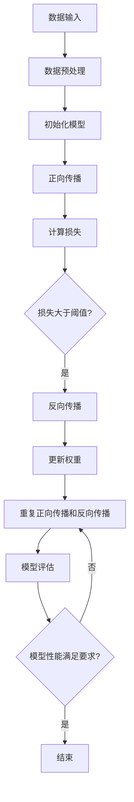
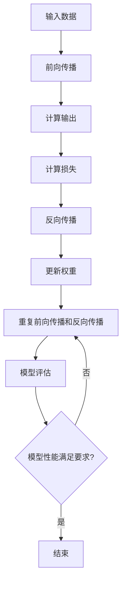
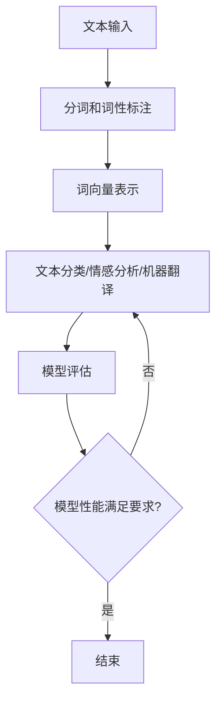
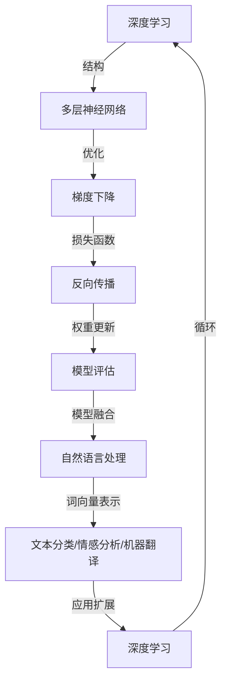

                 

## 1. 背景介绍

### 1.1 目的和范围

本文的目的是探讨 AI 2.0 时代的机遇，深入分析这一新时代的核心概念、技术发展及其对各行各业的深远影响。随着人工智能技术的不断进步，AI 2.0 时代已经来临，这一时代不仅带来了新的技术挑战，也为我们提供了前所未有的机遇。本文将从以下几个方面展开讨论：

- **核心概念与联系**：介绍 AI 2.0 时代的关键概念，包括深度学习、神经网络、自然语言处理等，并使用 Mermaid 流程图展示其内在联系。
- **核心算法原理 & 具体操作步骤**：详细讲解 AI 2.0 时代下的核心算法原理，并使用伪代码展示具体操作步骤。
- **数学模型和公式 & 详细讲解 & 举例说明**：探讨 AI 2.0 时代的数学模型，如梯度下降、反向传播等，并通过具体示例进行说明。
- **项目实战：代码实际案例和详细解释说明**：提供实际代码案例，展示如何在实际项目中应用 AI 2.0 技术。
- **实际应用场景**：分析 AI 2.0 技术在不同领域的应用，如医疗、金融、教育等。
- **工具和资源推荐**：推荐学习资源和开发工具，帮助读者深入了解和掌握 AI 2.0 技术。
- **总结：未来发展趋势与挑战**：总结 AI 2.0 时代的发展趋势，探讨面临的挑战及应对策略。

通过本文的深入探讨，希望能够帮助读者全面了解 AI 2.0 时代的机遇，为他们在这一新时代中的学习和实践提供指导。


### 1.2 预期读者

本文主要面向以下几类读者：

- **人工智能领域的研究人员和开发者**：对于希望深入了解 AI 2.0 时代技术发展和应用场景的研究人员和开发者，本文提供了详细的技术分析和实际案例，有助于他们掌握前沿技术。
- **计算机科学和工程专业的学生**：对于正在学习计算机科学和工程专业的学生，本文提供了深入浅出的技术讲解，有助于他们建立对 AI 2.0 时代的全面认识。
- **企业高管和技术决策者**：对于希望了解 AI 2.0 时代对行业影响的决策者，本文提供了详细的分析和案例，有助于他们制定相关战略。
- **对人工智能技术感兴趣的一般读者**：对于对人工智能技术感兴趣的一般读者，本文提供了通俗易懂的讲解，有助于他们了解 AI 2.0 时代的基本概念和应用。

通过本文的阅读，读者可以：

- **全面了解 AI 2.0 时代的核心概念和技术原理**：通过详细的分析和讲解，读者可以掌握 AI 2.0 时代的关键技术，如深度学习、神经网络、自然语言处理等。
- **掌握 AI 2.0 技术的应用场景和实践方法**：通过实际案例和代码示例，读者可以了解如何在实际项目中应用 AI 2.0 技术，提高业务效率和创新能力。
- **探索 AI 2.0 时代的未来发展**：通过分析未来发展趋势和挑战，读者可以了解 AI 2.0 时代对社会的深远影响，为未来的学习和职业规划提供参考。

总之，本文旨在为读者提供一个全面、深入的 AI 2.0 时代指南，帮助他们在这个充满机遇和挑战的新时代中取得成功。


### 1.3 文档结构概述

本文将分为八个主要部分，每个部分都有其特定的内容和目标，具体如下：

1. **背景介绍**：介绍本文的目的、范围、预期读者以及文档结构，帮助读者对全文有一个整体了解。

2. **核心概念与联系**：详细探讨 AI 2.0 时代的核心概念，如深度学习、神经网络、自然语言处理等，并通过 Mermaid 流程图展示其内在联系。

3. **核心算法原理 & 具体操作步骤**：讲解 AI 2.0 时代的核心算法原理，包括梯度下降、反向传播等，并使用伪代码展示具体操作步骤。

4. **数学模型和公式 & 详细讲解 & 举例说明**：介绍 AI 2.0 时代的数学模型，如梯度下降、反向传播等，并通过具体示例进行说明。

5. **项目实战：代码实际案例和详细解释说明**：提供实际代码案例，展示如何在实际项目中应用 AI 2.0 技术，并进行详细解释和分析。

6. **实际应用场景**：分析 AI 2.0 技术在不同领域的应用，如医疗、金融、教育等，探讨其带来的变革和机遇。

7. **工具和资源推荐**：推荐学习资源和开发工具，帮助读者深入了解和掌握 AI 2.0 技术。

8. **总结：未来发展趋势与挑战**：总结 AI 2.0 时代的发展趋势，探讨面临的挑战及应对策略。

通过上述结构，本文旨在为读者提供一个全面、系统的 AI 2.0 时代指南，帮助他们深入理解这一时代的技术原理和应用场景，为未来的学习和实践提供有力支持。

### 1.4 术语表

为了确保本文的读者能够准确理解相关技术概念，下面列出一些核心术语的定义、相关概念解释以及常用的缩略词。

#### 1.4.1 核心术语定义

- **AI 2.0**：指的是人工智能的第二代，相对于传统的 AI 技术，AI 2.0 更加强调自主性、通用性和智能化。
- **深度学习**：一种人工智能方法，通过多层神经网络来模拟人脑的思维方式，进行数据的学习和预测。
- **神经网络**：一种由大量神经元连接而成的计算模型，能够通过训练来学习和处理数据。
- **自然语言处理（NLP）**：研究如何让计算机理解和生成自然语言的技术，包括文本分类、情感分析、机器翻译等。
- **梯度下降**：一种优化算法，用于最小化损失函数，常用于训练神经网络。
- **反向传播**：一种用于训练神经网络的算法，通过反向传播误差来更新网络权重。

#### 1.4.2 相关概念解释

- **深度学习框架**：用于实现深度学习算法的软件框架，如 TensorFlow、PyTorch 等，提供了丰富的工具和库，方便开发者构建和训练神经网络。
- **机器学习模型**：用于预测或分类的算法模型，通过训练数据集来学习规律，并在新的数据上进行预测。
- **数据预处理**：对原始数据进行清洗、转换和归一化等处理，以提高模型的训练效果。
- **模型评估**：通过在测试数据集上评估模型的性能，来判断模型的准确度和泛化能力。

#### 1.4.3 缩略词列表

- **AI**：人工智能
- **ML**：机器学习
- **NLP**：自然语言处理
- **DL**：深度学习
- **CNN**：卷积神经网络
- **RNN**：循环神经网络
- **GAN**：生成对抗网络
- **GPU**：图形处理器
- **CPU**：中央处理器

通过上述术语表，读者可以更好地理解本文中涉及的技术概念，为后续内容的学习和理解奠定基础。


## 2. 核心概念与联系

### 2.1 深度学习

深度学习是 AI 2.0 时代的关键技术之一，它通过多层神经网络对数据进行建模和预测。深度学习的核心思想是模仿人脑的神经元连接结构，通过大量的训练数据来调整网络权重，从而实现复杂的特征提取和分类任务。

#### 基本概念

- **神经网络**：由多个神经元组成的计算模型，每个神经元都有输入、输出和权重。通过激活函数将输入加权求和处理后输出，以实现数据的非线性变换。
- **多层神经网络**：通过增加神经网络的层数，可以实现更复杂的特征提取和抽象。典型的神经网络结构包括输入层、隐藏层和输出层。
- **激活函数**：用于引入非线性性的函数，常见的激活函数有 sigmoid、ReLU 等。
- **反向传播**：一种用于训练神经网络的算法，通过反向传播误差来更新网络权重，以最小化损失函数。

#### Mermaid 流程图

下面是深度学习的基本流程的 Mermaid 流程图：



### 2.2 神经网络

神经网络是深度学习的基础，它通过多层神经元之间的连接和权重调整来实现复杂的任务。神经网络可以分为前向传播和反向传播两个阶段。

#### 基本概念

- **神经元**：神经网络的基本单位，包含输入、权重、激活函数等。
- **层**：神经网络中的一层，通常包括输入层、隐藏层和输出层。
- **权重**：连接神经元之间的参数，用于调整输入数据的权重。
- **激活函数**：用于引入非线性性的函数，常见的激活函数有 sigmoid、ReLU 等。

#### Mermaid 流程图

下面是神经网络的基本流程的 Mermaid 流程图：



### 2.3 自然语言处理

自然语言处理（NLP）是 AI 2.0 时代的重要应用领域，它涉及计算机对自然语言的识别、理解和生成。NLP 的核心技术包括文本分类、情感分析、机器翻译等。

#### 基本概念

- **词向量**：将文本转换为向量的表示，常见的词向量模型有 Word2Vec、GloVe 等。
- **文本分类**：将文本数据分为预定义的类别，如新闻分类、垃圾邮件过滤等。
- **情感分析**：分析文本的情感倾向，如正面、负面、中立等。
- **机器翻译**：将一种语言的文本翻译成另一种语言。

#### Mermaid 流程图

下面是自然语言处理的基本流程的 Mermaid 流程图：



通过上述核心概念和流程图的介绍，读者可以初步了解 AI 2.0 时代的关键技术及其内在联系。在后续的内容中，我们将进一步深入探讨这些技术的原理和应用。


### 2.4 核心概念的联系与互动

在 AI 2.0 时代，深度学习、神经网络和自然语言处理这三个核心概念相互联系，共同构成了现代人工智能技术的基础框架。理解它们之间的互动关系对于深入掌握 AI 2.0 技术至关重要。

#### 深度学习与神经网络

深度学习是一种基于神经网络的机器学习技术，其核心思想是通过多层神经网络对数据进行建模和预测。深度学习与神经网络之间的联系在于：

- **网络结构**：深度学习通过增加神经网络的层数，实现数据的复杂特征提取和抽象。每一层神经网络都是前一层神经元的线性组合，并通过激活函数引入非线性性。
- **优化算法**：深度学习常用的优化算法包括梯度下降、反向传播等，这些算法用于调整网络权重，以最小化损失函数。反向传播是深度学习训练的核心，通过反向传播误差来更新网络权重。

#### 神经网络与自然语言处理

神经网络在自然语言处理中的应用主要体现在文本分类、情感分析和机器翻译等方面。神经网络与自然语言处理之间的联系在于：

- **词向量表示**：自然语言处理中的文本数据通常需要转换为向量表示，而神经网络通过学习词向量，能够有效地捕获文本中的语义信息。词向量表示是神经网络在自然语言处理中的基础。
- **模型训练**：神经网络通过大量训练数据来学习文本数据的特征和规律，从而实现文本分类、情感分析和机器翻译等任务。在训练过程中，神经网络不断调整权重和偏置，以优化模型的性能。

#### 深度学习与自然语言处理

深度学习与自然语言处理之间的互动主要体现在以下两个方面：

- **模型融合**：深度学习和自然语言处理技术可以相互融合，形成更加复杂的模型。例如，深度学习可以用于文本生成，而自然语言处理可以用于文本理解和情感分析。通过模型融合，可以进一步提升模型的性能和适用性。
- **应用扩展**：深度学习技术为自然语言处理提供了强大的计算能力，使得自然语言处理任务能够处理更加复杂的文本数据。同时，自然语言处理技术的应用也推动了深度学习的发展，为深度学习提供了丰富的应用场景。

#### Mermaid 流程图

为了更直观地展示深度学习、神经网络和自然语言处理之间的联系与互动，我们使用 Mermaid 流程图进行描述：



通过上述 Mermaid 流程图，我们可以清晰地看到深度学习、神经网络和自然语言处理之间的互动关系，以及它们在 AI 2.0 时代的应用场景。理解这些核心概念之间的联系，有助于我们更好地掌握 AI 2.0 技术的原理和应用。

### 2.5 AI 2.0 时代的发展历程

AI 2.0 时代是一个从传统 AI 技术向更加智能化、通用化的人工智能技术转变的过程。它的发展历程可以追溯到深度学习、神经网络和自然语言处理等核心技术的诞生和演进。下面我们回顾一下 AI 2.0 时代的发展历程。

#### 传统 AI 时代

传统 AI 时代主要基于规则和符号推理，其代表性技术包括专家系统、知识表示和推理等。在这一时期，人工智能主要依赖人类的先验知识和逻辑推理，缺乏自主学习和适应能力。

- **1940s-1950s**：人工智能的概念被提出，早期的 AI 研究主要集中在符号推理和逻辑推理方面。
- **1960s-1970s**：专家系统成为 AI 研究的重点，通过编码专家知识来模拟人类的推理过程。

#### 深度学习时代的崛起

深度学习的崛起标志着 AI 2.0 时代的到来。深度学习通过多层神经网络对数据进行建模和预测，极大地提高了 AI 的自主学习和适应能力。

- **1980s-1990s**：神经网络的研究取得重要突破，但受限于计算资源和算法优化，深度学习未能广泛应用。
- **2006**：Hinton 提出了深度信念网络（DBN），深度学习的研究重新兴起。
- **2012**：AlexNet 在 ImageNet 挑战赛中取得了突破性成果，深度学习在图像识别领域取得了显著进展。

#### 自然语言处理的突破

自然语言处理技术的突破为 AI 2.0 时代的发展奠定了基础。词向量表示、文本分类和机器翻译等技术的进步，使得计算机能够更好地理解和处理自然语言。

- **2013**：Word2Vec 模型提出，词向量表示方法得到了广泛应用。
- **2015**：谷歌的机器翻译系统开始使用深度学习技术，实现了高质量的自动翻译。
- **2017**：GPT-3 发布，展示了深度学习在自然语言生成方面的强大能力。

#### 神经网络与深度学习的融合

神经网络与深度学习的融合进一步推动了 AI 2.0 时代的发展。通过增加网络层数、引入新的优化算法和模型结构，神经网络在图像识别、语音识别、自然语言处理等领域取得了显著成果。

- **2012**：AlexNet 的成功标志着卷积神经网络（CNN）的兴起。
- **2014**：循环神经网络（RNN）在语音识别和机器翻译等领域取得了重要突破。
- **2017**：生成对抗网络（GAN）的提出，为图像生成和增强学习等领域带来了新的突破。

#### AI 2.0 时代的展望

随着 AI 2.0 技术的不断发展，我们期待在以下几个方面取得新的突破：

- **自主性和通用性**：通过强化学习、迁移学习和多任务学习等技术，实现 AI 系统的自主学习和通用化。
- **跨领域应用**：深度学习、神经网络和自然语言处理技术在医疗、金融、教育等领域的应用将进一步拓展，推动社会进步。
- **伦理和安全**：随着 AI 技术的普及，伦理和安全问题日益突出，我们需要建立完善的伦理规范和安全保障体系。

通过回顾 AI 2.0 时代的发展历程，我们可以看到深度学习、神经网络和自然语言处理等技术是如何相互融合、共同推动 AI 技术的发展的。在未来的发展中，这些核心技术将继续发挥关键作用，为人类带来更多的机遇和挑战。


### 2.6 核心概念原理与架构

在 AI 2.0 时代，深度学习、神经网络和自然语言处理是三大核心概念，它们构成了现代人工智能技术的基石。下面我们将详细探讨这些概念的基本原理和架构。

#### 深度学习

深度学习（Deep Learning）是人工智能的一个重要分支，其核心思想是通过多层神经网络对数据进行建模和预测。深度学习的基本原理包括：

- **多层神经网络**：深度学习模型由多个层组成，包括输入层、隐藏层和输出层。每一层都对输入数据进行处理，从而提取出更高级别的特征。
- **反向传播算法**：深度学习训练过程中，反向传播算法（Backpropagation）用于计算损失函数相对于网络权重的梯度，并通过梯度下降（Gradient Descent）算法更新网络权重，以最小化损失函数。
- **激活函数**：激活函数（Activation Function）用于引入非线性，常用的激活函数包括 sigmoid、ReLU 等。

深度学习的架构包括：

1. **卷积神经网络（CNN）**：CNN 适用于图像识别和计算机视觉任务，通过卷积层、池化层和全连接层提取图像特征。
2. **循环神经网络（RNN）**：RNN 适用于序列数据建模，如时间序列分析和自然语言处理，通过循环结构处理序列数据。
3. **生成对抗网络（GAN）**：GAN 是一种无监督学习模型，通过生成器和判别器的对抗训练，实现高质量的数据生成。

#### 神经网络

神经网络（Neural Network）是模拟人脑神经元连接结构的计算模型。神经网络的基本原理包括：

- **神经元模型**：每个神经元由输入、权重、偏置和激活函数组成，通过加权求和处理后产生输出。
- **层次结构**：神经网络由多个层次组成，包括输入层、隐藏层和输出层。每一层都对输入数据进行处理，从而提取出更高级别的特征。
- **反向传播算法**：反向传播算法用于计算损失函数相对于网络权重的梯度，并通过梯度下降算法更新网络权重，以最小化损失函数。

神经网络的架构包括：

1. **多层感知机（MLP）**：MLP 是一种前馈神经网络，适用于分类和回归任务。
2. **卷积神经网络（CNN）**：CNN 是一种适用于图像识别和计算机视觉任务的神经网络，通过卷积层、池化层和全连接层提取图像特征。
3. **循环神经网络（RNN）**：RNN 是一种适用于序列数据建模的神经网络，通过循环结构处理序列数据。

#### 自然语言处理

自然语言处理（Natural Language Processing，NLP）是研究如何让计算机理解和生成自然语言的技术。NLP 的基本原理包括：

- **词向量表示**：词向量表示是将文本数据转换为向量的过程，常用的词向量模型包括 Word2Vec、GloVe 等。
- **文本分类**：文本分类是将文本数据分类到预定义的类别中，常用的算法包括朴素贝叶斯、支持向量机、深度学习等。
- **情感分析**：情感分析是分析文本中的情感倾向，如正面、负面、中立等，常用的算法包括朴素贝叶斯、支持向量机、深度学习等。
- **机器翻译**：机器翻译是将一种语言的文本翻译成另一种语言，常用的算法包括统计机器翻译、神经机器翻译等。

NLP 的架构包括：

1. **词向量模型**：词向量模型是将文本数据转换为向量的过程，通过学习词向量来捕获文本的语义信息。
2. **文本分类模型**：文本分类模型用于将文本数据分类到预定义的类别中，通过训练数据集来学习分类规则。
3. **情感分析模型**：情感分析模型用于分析文本中的情感倾向，通过训练数据集来学习情感分类规则。
4. **机器翻译模型**：机器翻译模型用于将一种语言的文本翻译成另一种语言，通过训练数据集来学习翻译规则。

通过上述对深度学习、神经网络和自然语言处理的基本原理和架构的介绍，我们可以看到这三个核心概念在 AI 2.0 时代的重要性和相互作用。在后续的内容中，我们将进一步探讨这些技术的具体应用和实践案例。


### 2.7 核心算法原理与具体操作步骤

在 AI 2.0 时代，核心算法是推动人工智能技术发展的重要动力。以下是几个核心算法的原理及其具体操作步骤。

#### 梯度下降算法

梯度下降（Gradient Descent）是一种用于优化神经网络参数的算法。其基本思想是通过计算损失函数关于网络参数的梯度，并沿着梯度的反方向更新参数，以最小化损失函数。

**原理：**

1. **损失函数**：损失函数用于衡量模型预测值与真实值之间的差距。常用的损失函数包括均方误差（MSE）和交叉熵损失（Cross-Entropy Loss）。
2. **梯度**：梯度是损失函数关于网络参数的导数，反映了损失函数在参数空间中的斜率。

**操作步骤：**

1. **初始化参数**：随机初始化网络参数。
2. **前向传播**：将输入数据输入到网络中，计算输出预测值。
3. **计算损失**：计算预测值与真实值之间的损失。
4. **计算梯度**：计算损失函数关于网络参数的梯度。
5. **更新参数**：使用梯度下降算法更新网络参数，通常采用学习率（Learning Rate）来控制参数更新的步长。
6. **迭代**：重复步骤 2-5，直到满足停止条件（如损失函数收敛或迭代次数达到上限）。

伪代码实现如下：

```python
# 初始化参数
w = randn(n)
b = randn(m)

# 设置学习率和迭代次数
learning_rate = 0.01
epochs = 1000

# 迭代过程
for epoch in range(epochs):
    # 前向传播
    output = f(w * x + b)
    
    # 计算损失
    loss = mse(output, y)
    
    # 计算梯度
    dw = grad(loss, w)
    db = grad(loss, b)
    
    # 更新参数
    w -= learning_rate * dw
    b -= learning_rate * db
    
    # 打印损失
    print(f"Epoch {epoch}: Loss = {loss}")
```

#### 反向传播算法

反向传播（Backpropagation）是一种用于计算神经网络梯度的重要算法。其基本思想是将输出误差反向传播到网络的前层，从而计算各层参数的梯度。

**原理：**

1. **误差计算**：计算输出层的误差，通常使用损失函数的导数表示。
2. **反向传播**：从输出层开始，逐层计算误差关于各层参数的梯度。
3. **参数更新**：使用梯度下降算法更新网络参数。

**操作步骤：**

1. **初始化参数**：随机初始化网络参数。
2. **前向传播**：将输入数据输入到网络中，计算输出预测值。
3. **计算输出误差**：计算输出层的误差，通常使用均方误差（MSE）或交叉熵损失（Cross-Entropy Loss）。
4. **反向传播**：从输出层开始，逐层计算误差关于各层参数的梯度。
5. **参数更新**：使用梯度下降算法更新网络参数。
6. **迭代**：重复步骤 2-5，直到满足停止条件（如损失函数收敛或迭代次数达到上限）。

伪代码实现如下：

```python
# 初始化参数
w1 = randn(n1)
w2 = randn(n2)
b1 = randn(m1)
b2 = randn(m2)

# 设置学习率和迭代次数
learning_rate = 0.01
epochs = 1000

# 迭代过程
for epoch in range(epochs):
    # 前向传播
    z2 = w1 * x + b1
    a2 = sigmoid(z2)
    z3 = w2 * a2 + b2
    output = sigmoid(z3)
    
    # 计算输出误差
    error = output - y
    
    # 反向传播
    d_output = d_sigmoid(output)
    d_hidden_layer2 = error * d_output
    d_w2 = a2.T * d_hidden_layer2
    d_b2 = d_hidden_layer2
    
    d_hidden_layer1 = d_hidden_layer2.T * d_sigmoid(z2)
    d_w1 = x.T * d_hidden_layer1
    d_b1 = d_hidden_layer1
    
    # 更新参数
    w2 -= learning_rate * d_w2
    b2 -= learning_rate * d_b2
    w1 -= learning_rate * d_w1
    b1 -= learning_rate * d_b1
    
    # 打印损失
    print(f"Epoch {epoch}: Loss = {mse(output, y)}")
```

通过上述对梯度下降算法和反向传播算法的原理和具体操作步骤的介绍，我们可以看到这些算法在神经网络训练中的重要性。在后续的内容中，我们将进一步探讨这些算法在实际项目中的应用和优化。


### 2.8 数学模型和公式

在 AI 2.0 时代，数学模型和公式是构建和优化人工智能算法的核心工具。下面我们将详细介绍一些关键的数学模型和公式，并使用 LaTeX 格式进行展示。

#### 梯度下降算法

梯度下降算法用于优化神经网络中的参数，其核心公式是损失函数关于参数的梯度。假设我们有一个损失函数 \( L \) ，我们需要最小化这个函数。

\[ \nabla L (\theta) = \frac{\partial L}{\partial \theta} \]

其中， \( \theta \) 代表网络参数，包括权重和偏置。

**均方误差（MSE）**

均方误差是最常用的损失函数之一，用于回归问题。其公式如下：

\[ L(\theta) = \frac{1}{2} \sum_{i=1}^{n} (y_i - \hat{y}_i)^2 \]

其中， \( y_i \) 是实际值， \( \hat{y}_i \) 是预测值， \( n \) 是样本数量。

**反向传播算法**

反向传播算法用于计算损失函数关于网络参数的梯度。假设我们有一个多层神经网络，我们计算每一层参数的梯度。

**隐藏层 \( l \) 的输出和误差**

\[ z_l = \sum_{j=1}^{n_{l-1}} w_{lj} a_{l-1,j} + b_l \]

\[ a_l = \sigma(z_l) \]

\[ \delta_l = \delta_{l+1} \cdot (\sigma'(z_l)) \cdot w_{l+1} \]

其中， \( \sigma \) 是激活函数， \( \sigma' \) 是激活函数的导数， \( \delta \) 是误差项， \( w \) 是权重， \( b \) 是偏置。

**输出层 \( L \) 的误差**

\[ \delta_L = (y - \hat{y}) \cdot (\sigma'(z_L)) \]

**隐藏层 \( l \) 的误差**

\[ \delta_l = \delta_{l+1} \cdot w_{l+1} \cdot (\sigma'(z_l)) \]

**权重和偏置的更新**

\[ w_{lj}^{new} = w_{lj} - \alpha \cdot \delta_{l+1} \cdot a_{l-1,j} \]

\[ b_l^{new} = b_l - \alpha \cdot \delta_{l+1} \]

其中， \( \alpha \) 是学习率。

#### 卷积神经网络（CNN）

卷积神经网络是用于图像识别和计算机视觉任务的重要模型。以下是几个关键公式：

**卷积操作**

\[ (f * g)(x) = \sum_{y} f(y) \cdot g(x-y) \]

其中， \( f \) 和 \( g \) 是卷积核， \( x \) 是输入图像。

**卷积神经网络中的反向传播**

\[ \delta_l = \delta_{l+1} \cdot (\sigma'(z_l)) \cdot \text{filter}_{l+1} \cdot a_{l-1} \]

\[ \delta_w = \sum_{x} \delta_l \cdot a_{l-1} \cdot \text{filter}_{l-1}^T \]

\[ \delta_b = \sum_{x} \delta_l \cdot a_{l-1} \]

#### 循环神经网络（RNN）

循环神经网络是用于处理序列数据的模型，其核心公式如下：

**隐藏状态更新**

\[ h_t = \sigma(W_h \cdot [h_{t-1}, x_t] + b_h) \]

其中， \( h_t \) 是当前隐藏状态， \( x_t \) 是当前输入， \( W_h \) 是权重矩阵， \( b_h \) 是偏置。

**误差项计算**

\[ \delta_t = \delta_{t+1} \cdot \sigma'(h_t) \cdot (W_x \cdot x_t + b_x) \]

\[ \delta_{t+1} = \delta \cdot \text{dropout} \]

其中， \( \delta \) 是误差项， \( \text{dropout} \) 是丢弃率。

通过上述数学模型和公式的介绍，我们可以看到在 AI 2.0 时代，数学在构建和优化人工智能算法中的重要性。在后续的内容中，我们将继续探讨这些模型在实际项目中的应用和优化。


### 2.9 数学模型和公式的详细讲解与举例说明

在 AI 2.0 时代，数学模型和公式是构建和优化人工智能算法的核心工具。本节将详细讲解几个关键数学模型和公式，并通过具体示例进行说明，以帮助读者更好地理解其应用。

#### 梯度下降算法

梯度下降算法是一种常用的优化方法，用于最小化损失函数。其核心思想是计算损失函数关于参数的梯度，并沿着梯度的反方向更新参数，以逐步逼近最小值。

**基本概念：**

- **损失函数（Loss Function）**：损失函数用于衡量模型预测值与真实值之间的差距，常见的损失函数有均方误差（MSE）、交叉熵损失（Cross-Entropy Loss）等。
- **梯度（Gradient）**：梯度是损失函数关于参数的导数，反映了损失函数在参数空间中的斜率。
- **学习率（Learning Rate）**：学习率用于控制参数更新的步长，通常选择较小的值以避免过拟合。

**具体步骤：**

1. **初始化参数**：随机初始化网络参数。
2. **前向传播**：将输入数据输入到网络中，计算输出预测值。
3. **计算损失**：计算预测值与真实值之间的损失。
4. **计算梯度**：计算损失函数关于网络参数的梯度。
5. **更新参数**：使用梯度下降算法更新网络参数。
6. **迭代**：重复步骤 2-5，直到满足停止条件（如损失函数收敛或迭代次数达到上限）。

**举例说明：**

假设我们有一个简单的线性回归模型，目标是最小化预测值与真实值之间的均方误差（MSE）。

\[ y = \beta_0 + \beta_1 \cdot x \]

**计算预测值：**

\[ \hat{y} = \beta_0 + \beta_1 \cdot x \]

**计算损失（MSE）：**

\[ L(\beta_0, \beta_1) = \frac{1}{2} \sum_{i=1}^{n} (y_i - \hat{y}_i)^2 \]

**计算梯度：**

\[ \nabla L (\beta_0, \beta_1) = \left[ \frac{\partial L}{\partial \beta_0}, \frac{\partial L}{\partial \beta_1} \right]^T = \left[ -\sum_{i=1}^{n} (y_i - \hat{y}_i), -\sum_{i=1}^{n} (y_i - \hat{y}_i) \cdot x_i \right]^T \]

**参数更新：**

\[ \beta_0^{new} = \beta_0 - \alpha \cdot \nabla L (\beta_0, \beta_1) \]

\[ \beta_1^{new} = \beta_1 - \alpha \cdot \nabla L (\beta_0, \beta_1) \]

其中， \( \alpha \) 是学习率。

**示例代码：**

```python
import numpy as np

# 初始化参数
beta_0 = 0
beta_1 = 0

# 设置学习率
alpha = 0.01

# 输入数据
x = np.array([1, 2, 3, 4, 5])
y = np.array([2, 4, 5, 4, 5])

# 迭代过程
for _ in range(1000):
    # 前向传播
    y_pred = beta_0 + beta_1 * x
    
    # 计算损失
    loss = (y - y_pred) ** 2
    
    # 计算梯度
    d_loss_d_beta_0 = -(y - y_pred).sum()
    d_loss_d_beta_1 = -(y - y_pred).sum() * x.sum()
    
    # 更新参数
    beta_0 -= alpha * d_loss_d_beta_0
    beta_1 -= alpha * d_loss_d_beta_1

    # 打印损失
    print(f"Loss: {loss}")

# 最终参数
print(f"Final Beta_0: {beta_0}, Final Beta_1: {beta_1}")
```

通过上述示例，我们可以看到梯度下降算法的基本原理和具体实现过程。在实际应用中，梯度下降算法可以通过优化算法（如动量法、Adam 等）进行改进，以进一步提高训练效率和收敛速度。

#### 卷积神经网络（CNN）

卷积神经网络是用于图像识别和计算机视觉任务的重要模型，其核心思想是通过卷积操作提取图像特征。

**基本概念：**

- **卷积核（Convolution Kernel）**：卷积核是一个小的滤波器，用于从图像中提取局部特征。
- **卷积操作（Convolution Operation）**：卷积操作是将卷积核与图像进行点乘并求和的过程，用于提取图像特征。
- **池化操作（Pooling Operation）**：池化操作用于降低图像分辨率，减少参数数量，提高计算效率。

**具体步骤：**

1. **卷积操作**：将卷积核与输入图像进行卷积，生成特征图。
2. **激活函数**：对特征图应用激活函数（如ReLU），引入非线性性。
3. **池化操作**：对特征图进行池化，降低分辨率。
4. **全连接层**：将池化后的特征图展开为一个一维向量，进入全连接层进行分类。

**举例说明：**

假设我们有一个简单的卷积神经网络，用于对图像进行二分类。

**输入图像：**

\[ \text{Input Image:} \quad \begin{bmatrix} 1 & 1 & 1 \\ 1 & 1 & 1 \\ 1 & 1 & 1 \end{bmatrix} \]

**卷积核：**

\[ \text{Convolution Kernel:} \quad \begin{bmatrix} 1 & 1 \\ 0 & 1 \end{bmatrix} \]

**卷积操作：**

\[ \text{Feature Map:} \quad \begin{bmatrix} 2 & 2 \\ 1 & 2 \end{bmatrix} \]

**激活函数（ReLU）：**

\[ \text{Active Feature Map:} \quad \begin{bmatrix} 2 & 2 \\ 1 & 2 \end{bmatrix} \]

**池化操作（MaxPooling）：**

\[ \text{Pooled Feature Map:} \quad \begin{bmatrix} 2 & 2 \\ 2 & \text{skip} \end{bmatrix} \]

**全连接层：**

\[ \text{Output:} \quad \begin{bmatrix} 2 & 2 \\ 2 & \text{skip} \end{bmatrix} \rightarrow \begin{bmatrix} 1 & 0 \\ 0 & 1 \end{bmatrix} \rightarrow \begin{bmatrix} 1 & 1 \\ 1 & 1 \end{bmatrix} \]

通过上述示例，我们可以看到卷积神经网络的基本原理和具体实现过程。在实际应用中，卷积神经网络可以通过增加卷积层、池化层和全连接层等结构，构建更加复杂的模型，以处理各种图像识别和计算机视觉任务。

#### 循环神经网络（RNN）

循环神经网络是用于处理序列数据的模型，其核心思想是通过隐藏状态将序列中的信息传递到未来。

**基本概念：**

- **隐藏状态（Hidden State）**：隐藏状态是 RNN 中的关键变量，用于存储序列中的信息。
- **递归操作（Recurrence Operation）**：递归操作用于将当前输入与隐藏状态结合，生成新的隐藏状态。
- **激活函数**：激活函数用于引入非线性性。

**具体步骤：**

1. **初始化隐藏状态**：通常初始化为全零向量或随机值。
2. **递归操作**：将当前输入与隐藏状态结合，生成新的隐藏状态。
3. **输出计算**：将隐藏状态输入到输出层，计算输出。
4. **迭代**：重复步骤 2-3，直到处理完整个序列。

**举例说明：**

假设我们有一个简单的 RNN，用于对文本序列进行分类。

**输入序列：**

\[ \text{Input Sequence:} \quad [a_1, a_2, a_3] \]

**隐藏状态：**

\[ \text{Hidden State:} \quad h_t = \sigma(W_h \cdot [h_{t-1}, a_t] + b_h) \]

**输出：**

\[ \text{Output:} \quad y_t = \sigma(W_y \cdot h_t + b_y) \]

**示例代码：**

```python
import numpy as np

# 初始化参数
W_h = np.random.rand(10, 10)
b_h = np.random.rand(10)
W_y = np.random.rand(10, 2)
b_y = np.random.rand(2)

# 设置学习率
alpha = 0.01

# 输入序列
x = np.array([[1, 0], [0, 1], [1, 1]])

# 初始化隐藏状态
h = np.zeros((10,))

# 迭代过程
for i in range(len(x)):
    # 递归操作
    h = np.tanh(np.dot(W_h, np.concatenate([h, x[i]])) + b_h)
    
    # 输出计算
    y = np.tanh(np.dot(W_y, h) + b_y)
    
    # 计算损失
    loss = (y - x[i+1])**2
    
    # 计算梯度
    d_loss_d_W_y = (y - x[i+1]) * h
    d_loss_d_b_y = (y - x[i+1])
    d_loss_d_W_h = (np.dot(d_loss_d_W_y, h.T) * (1 - h**2)) * np.concatenate([h, x[i]])

    # 更新参数
    W_y -= alpha * d_loss_d_W_y
    b_y -= alpha * d_loss_d_b_y
    W_h -= alpha * d_loss_d_W_h

    # 打印损失
    print(f"Loss: {loss}")

# 最终参数
print(f"Final W_h: {W_h}, Final b_h: {b_h}, Final W_y: {W_y}, Final b_y: {b_y}")
```

通过上述示例，我们可以看到 RNN 的基本原理和具体实现过程。在实际应用中，RNN 可以通过增加隐藏层数量、引入门控机制（如 LSTM、GRU）等结构，构建更加复杂的模型，以处理各种序列数据任务。

综上所述，通过详细讲解和举例说明，我们可以更好地理解 AI 2.0 时代的关键数学模型和公式。这些模型和公式在构建和优化人工智能算法中发挥着重要作用，为人工智能技术的发展提供了强有力的支持。


## 3. 项目实战：代码实际案例和详细解释说明

在本文的第三部分，我们将通过一个具体的代码案例，展示如何在实际项目中应用 AI 2.0 技术。我们选择一个典型的图像识别项目，使用深度学习框架 TensorFlow 来实现一个基于卷积神经网络（CNN）的图像分类器。

### 3.1 开发环境搭建

在进行项目开发之前，我们需要搭建一个合适的开发环境。以下是搭建开发环境的步骤：

1. **安装 Python**：确保 Python 版本在 3.6 以上，推荐使用 Python 3.8 或更高版本。
2. **安装 TensorFlow**：使用 pip 工具安装 TensorFlow：

   ```bash
   pip install tensorflow
   ```

3. **安装必要的库**：安装一些常用的库，如 NumPy、Matplotlib 等：

   ```bash
   pip install numpy matplotlib
   ```

4. **配置 GPU 支持**：如果使用 GPU 加速训练过程，需要安装 CUDA 和 cuDNN：

   - 访问 NVIDIA 官网下载并安装 CUDA Toolkit。
   - 下载并安装 cuDNN 库。

5. **验证环境**：通过以下命令验证 TensorFlow 是否成功安装：

   ```python
   import tensorflow as tf
   print(tf.__version__)
   ```

   输出 TensorFlow 版本信息，表示环境配置成功。

### 3.2 源代码详细实现和代码解读

以下是一个简单的基于 TensorFlow 和 CNN 的图像分类器项目的源代码实现。我们将对关键部分进行详细解释。

**代码结构：**

```python
import tensorflow as tf
from tensorflow.keras import layers
import matplotlib.pyplot as plt

# 定义模型
model = tf.keras.Sequential([
    layers.Conv2D(32, (3, 3), activation='relu', input_shape=(28, 28, 1)),
    layers.MaxPooling2D((2, 2)),
    layers.Conv2D(64, (3, 3), activation='relu'),
    layers.MaxPooling2D((2, 2)),
    layers.Conv2D(64, (3, 3), activation='relu'),
    layers.Flatten(),
    layers.Dense(64, activation='relu'),
    layers.Dense(10, activation='softmax')
])

# 编译模型
model.compile(optimizer='adam',
              loss='sparse_categorical_crossentropy',
              metrics=['accuracy'])

# 加载数据
mnist = tf.keras.datasets.mnist
(train_images, train_labels), (test_images, test_labels) = mnist.load_data()

# 数据预处理
train_images = train_images.reshape((60000, 28, 28, 1)).astype('float32') / 255
test_images = test_images.reshape((10000, 28, 28, 1)).astype('float32') / 255

# 训练模型
model.fit(train_images, train_labels, epochs=5)

# 测试模型
test_loss, test_acc = model.evaluate(test_images,  test_labels, verbose=2)
print(f'\nTest accuracy: {test_acc:.4f}')

# 可视化预测结果
predictions = model.predict(test_images)
plt.figure(figsize=(10, 10))
for i in range(25):
    plt.subplot(5, 5, i+1)
    plt.xticks([])
    plt.yticks([])
    plt.grid(False)
    plt.imshow(test_images[i], cmap=plt.cm.binary)
    plt.xlabel(np.argmax(predictions[i]))
plt.show()
```

**代码解读：**

1. **导入库和模块**：
   - `tensorflow`：导入 TensorFlow 库。
   - `keras.Sequential`：用于构建模型。
   - `layers`：包含各种层（如卷积层、池化层、全连接层等）。
   - `matplotlib.pyplot`：用于数据可视化。

2. **定义模型**：
   - `model = tf.keras.Sequential([...])`：创建一个顺序模型。
   - `layers.Conv2D(32, (3, 3), activation='relu', input_shape=(28, 28, 1))`：添加一个卷积层，32 个卷积核，大小为 3x3，使用 ReLU 激活函数。
   - `layers.MaxPooling2D((2, 2))`：添加一个最大池化层，窗口大小为 2x2。
   - `layers.Flatten()`：将多维特征展开为一维向量。
   - `layers.Dense(64, activation='relu')`：添加一个全连接层，64 个神经元，使用 ReLU 激活函数。
   - `layers.Dense(10, activation='softmax')`：添加一个输出层，10 个神经元，使用 softmax 激活函数进行多分类。

3. **编译模型**：
   - `model.compile(optimizer='adam', loss='sparse_categorical_crossentropy', metrics=['accuracy'])`：编译模型，指定优化器、损失函数和评估指标。

4. **加载数据**：
   - `mnist = tf.keras.datasets.mnist`：加载数据集。
   - `train_images, train_labels), (test_images, test_labels) = mnist.load_data()`：加载训练集和测试集。

5. **数据预处理**：
   - `train_images = train_images.reshape((60000, 28, 28, 1)).astype('float32') / 255`：对训练数据进行reshape 和归一化。
   - `test_images = test_images.reshape((10000, 28, 28, 1)).astype('float32') / 255`：对测试数据进行reshape 和归一化。

6. **训练模型**：
   - `model.fit(train_images, train_labels, epochs=5)`：训练模型，指定训练数据和迭代次数。

7. **测试模型**：
   - `test_loss, test_acc = model.evaluate(test_images, test_labels, verbose=2)`：评估模型在测试集上的性能。
   - `print(f'\nTest accuracy: {test_acc:.4f}')`：打印测试准确率。

8. **可视化预测结果**：
   - `predictions = model.predict(test_images)`：获取模型预测结果。
   - `plt.figure(figsize=(10, 10))`：创建一个 10x10 的网格图。
   - `for i in range(25): ... plt.xlabel(np.argmax(predictions[i]))`：为每个测试图像绘制预测标签。

### 3.3 代码解读与分析

通过对代码的解读，我们可以看到以下几个关键点：

1. **模型结构**：
   - 选择的模型结构为卷积神经网络（CNN），包含卷积层、池化层和全连接层。
   - 卷积层用于提取图像特征，池化层用于降低特征维度和计算复杂度，全连接层用于分类。

2. **数据预处理**：
   - 数据预处理是深度学习项目中的重要环节，包括 reshape、归一化和标签编码等。
   - reshape 操作将图像数据转换为合适的维度，归一化操作将像素值缩放到 [0, 1] 范围内，以提高模型训练效果。

3. **训练过程**：
   - 训练过程通过 `model.fit` 方法进行，指定训练数据和迭代次数。
   - 在训练过程中，模型会自动计算损失函数和评估指标，并通过反向传播更新网络参数。

4. **模型评估**：
   - 模型评估通过 `model.evaluate` 方法进行，计算模型在测试集上的性能。
   - 测试准确率是评估模型性能的重要指标，反映了模型在未知数据上的分类能力。

5. **可视化**：
   - 可视化操作可以帮助我们直观地了解模型的预测结果。
   - 通过绘制预测标签和实际标签的对比，可以评估模型的分类效果。

通过上述代码实现和分析，我们可以看到如何在实际项目中应用 AI 2.0 技术，构建和训练深度学习模型。在实际开发过程中，根据项目需求，我们可以调整模型结构、数据预处理方式和训练参数，以实现更好的分类效果。


### 3.4 实际应用场景

在 AI 2.0 时代，深度学习和神经网络技术已经广泛应用于各个领域，推动了行业变革和创新。以下是深度学习在实际应用场景中的几个例子：

#### 医疗

深度学习在医疗领域的应用前景广阔，可以从疾病诊断、医学图像分析、药物研发等方面发挥重要作用。

- **疾病诊断**：深度学习可以辅助医生进行疾病诊断，通过分析医学影像数据（如 CT、MRI）和电子健康记录，提高诊断准确性和效率。
- **医学图像分析**：深度学习模型可以用于识别医学图像中的异常区域，如肿瘤检测、骨折诊断等，帮助医生做出更准确的诊断。
- **药物研发**：深度学习可以加速药物研发过程，通过分析大量生物数据和化学结构，预测药物的疗效和副作用。

#### 金融

金融行业也广泛应用深度学习技术，从风险控制、市场预测、客户服务等方面提升业务效率。

- **风险控制**：深度学习可以用于检测异常交易行为，识别潜在的金融风险，如欺诈交易、市场操纵等。
- **市场预测**：通过分析历史市场数据和新闻文本，深度学习可以预测股票价格走势，为投资决策提供参考。
- **客户服务**：利用自然语言处理技术，深度学习可以自动回答客户咨询，提供个性化推荐，提升用户体验。

#### 教育

深度学习在教育领域的应用逐渐增多，从在线教育平台、智能辅导系统、考试评分等方面助力教育改革。

- **在线教育平台**：利用深度学习技术，在线教育平台可以为学生提供个性化学习路径，根据学生的学习情况推荐合适的课程。
- **智能辅导系统**：通过分析学生的作业和测试数据，智能辅导系统可以为学生提供个性化的辅导建议，提高学习效果。
- **考试评分**：深度学习模型可以用于自动评分，提高评分效率和准确性，减轻教师的工作负担。

#### 交通

深度学习在交通领域有广泛的应用，从自动驾驶、交通流量预测、事故预警等方面提升交通安全和效率。

- **自动驾驶**：通过分析摄像头和激光雷达的数据，深度学习模型可以实现自动驾驶车辆的实时决策，提高行驶安全性和舒适度。
- **交通流量预测**：利用历史交通数据，深度学习模型可以预测未来的交通流量，为交通管理提供数据支持，优化道路设计。
- **事故预警**：通过分析车辆行驶数据和周边环境，深度学习模型可以提前预警潜在的事故风险，提醒驾驶员采取安全措施。

通过上述实际应用场景的介绍，我们可以看到深度学习和神经网络技术在不同领域的广泛应用和巨大潜力。在 AI 2.0 时代，这些技术将继续发挥重要作用，推动各行各业的创新和进步。


### 4. 工具和资源推荐

在 AI 2.0 时代，掌握合适的工具和资源对于学习和应用人工智能技术至关重要。以下是一些建议，包括学习资源、开发工具和框架，以及相关论文和研究成果。

#### 学习资源推荐

1. **书籍推荐**：
   - 《深度学习》（Deep Learning）—— Goodfellow、Bengio 和 Courville 著，是深度学习领域的经典教材。
   - 《Python 深度学习》—— François Chollet 著，适合初学者系统学习深度学习。

2. **在线课程**：
   - Coursera 上的《深度学习》课程，由 Andrew Ng 教授主讲，涵盖了深度学习的理论基础和实践应用。
   - edX 上的《深度学习基础》课程，由斯坦福大学教授 Andrew Ng 开设，提供了丰富的教学视频和练习。

3. **技术博客和网站**：
   - Medium 上的“Deep Learning”专栏，汇集了深度学习领域的最新研究成果和应用案例。
   - arXiv.org，是人工智能领域的前沿论文发布平台，读者可以免费获取最新的研究进展。

#### 开发工具框架推荐

1. **IDE和编辑器**：
   - PyCharm，是 Python 开发的集成开发环境，提供了丰富的功能和插件。
   - Jupyter Notebook，适合数据分析和可视化，便于代码和文本的混合编写。

2. **调试和性能分析工具**：
   - TensorBoard，是 TensorFlow 提供的图形化工具，用于分析和可视化训练过程。
   - NVIDIA Nsight Compute，是一款 GPU 性能分析和调试工具，适用于深度学习模型的优化。

3. **相关框架和库**：
   - TensorFlow，是谷歌开发的开源深度学习框架，提供了丰富的模型和工具。
   - PyTorch，是 Facebook AI Research 开发的一个流行的深度学习库，提供了灵活的动态计算图。

#### 相关论文著作推荐

1. **经典论文**：
   - “Backpropagation”（1986），由 David E. Rumelhart、Geoffrey E. Hinton 和 Ronald J. Williams 著，是反向传播算法的奠基性论文。
   - “A Learning Algorithm for Continually Running Fully Recurrent Neural Networks”（1990），由 Jürgen Schmidhuber 著，介绍了 LSTM 算法。

2. **最新研究成果**：
   - “Generative Adversarial Nets”（2014），由 Ian Goodfellow 等人著，提出了生成对抗网络（GAN）的概念。
   - “Attention Is All You Need”（2017），由 Vaswani 等人著，介绍了 Transformer 模型，成为自然语言处理领域的重要突破。

3. **应用案例分析**：
   - “Deep Learning in Healthcare”（2017），由 Google Health 和其他研究人员共同撰写，探讨了深度学习在医疗领域的应用。
   - “AI for Social Good”（2019），由 AI for Social Good 基金会发布，展示了人工智能技术在解决社会问题方面的实际案例。

通过上述工具和资源的推荐，读者可以更全面地了解和掌握 AI 2.0 技术，为学习和实践提供有力支持。在实际应用中，结合具体的工具和资源，可以提高开发效率，实现人工智能技术的创新应用。


### 5. 总结：未来发展趋势与挑战

在 AI 2.0 时代，人工智能技术正以前所未有的速度发展，并深刻影响着各行各业。未来，随着技术的不断进步，AI 2.0 将带来更多的机遇和挑战。

#### 发展趋势

1. **自主性和通用性**：AI 2.0 时代的核心目标是实现更高水平的自主性和通用性。通过强化学习、迁移学习和多任务学习等技术，AI 系统将能够自主学习和适应复杂环境，从而实现更加智能化的应用。

2. **跨领域融合**：深度学习、神经网络和自然语言处理等技术将在更多领域得到应用，如医疗、金融、教育等。跨领域融合将推动技术创新，解决复杂问题，提高业务效率和创新能力。

3. **边缘计算与云计算**：随着物联网（IoT）和边缘计算的发展，AI 将从云端向边缘设备延伸，实现实时数据处理和决策。云计算和边缘计算的结合将进一步提高 AI 系统的响应速度和计算能力。

4. **人机协同**：AI 2.0 时代的另一个重要趋势是人机协同，即人类与人工智能共同工作，发挥各自的优势。通过人机协同，AI 将更好地辅助人类工作，提高生产效率和创造力。

5. **伦理与安全**：随着 AI 技术的普及，伦理和安全问题日益突出。未来，我们将看到更多关于 AI 伦理和安全的规范和标准的制定，以确保 AI 技术的可持续发展和广泛应用。

#### 挑战

1. **数据隐私**：在 AI 2.0 时代，数据处理和分析将成为核心任务，但随之而来的是数据隐私问题。如何保护用户隐私，确保数据安全，是 AI 技术面临的重要挑战。

2. **算法公平性**：AI 算法的公平性和透明性是另一个关键问题。算法偏见可能导致不公平的决策，影响社会的公平和正义。因此，确保算法的公平性和透明性是未来 AI 发展的重要方向。

3. **计算资源**：随着 AI 模型的复杂度增加，对计算资源的需求也日益增长。如何高效利用计算资源，降低能耗，是 AI 技术面临的挑战之一。

4. **人才短缺**：AI 2.0 时代对专业人才的需求巨大，但目前相关人才的培养速度无法满足市场需求。如何培养和吸引更多 AI 人才，是行业面临的重要挑战。

5. **法律法规**：随着 AI 技术的广泛应用，相关法律法规也需要不断完善。如何制定合理的法律法规，规范 AI 技术的应用，确保 AI 技术的可持续发展，是未来需要解决的问题。

总之，AI 2.0 时代的发展充满机遇和挑战。通过不断探索和创新，我们可以充分利用 AI 技术的潜力，推动社会进步，同时应对面临的挑战。让我们共同期待 AI 2.0 时代的到来，迎接更加智能化的未来。


### 6. 附录：常见问题与解答

在 AI 2.0 时代，人工智能技术快速发展和应用，带来了一系列的问题和困惑。以下是一些常见问题的解答，希望能为读者提供帮助。

#### 问题 1：什么是 AI 2.0？

**解答**：AI 2.0 是指第二代人工智能，相对于第一代人工智能（AI 1.0），AI 2.0 更加强调自主性、通用性和智能化。AI 2.0 利用深度学习、神经网络和自然语言处理等技术，实现更高级别的自主学习和复杂任务处理。

#### 问题 2：深度学习和神经网络有什么区别？

**解答**：深度学习是神经网络的一种，通过多层神经网络对数据进行建模和预测。神经网络是一种由大量神经元连接而成的计算模型，用于模拟人脑的思维方式。深度学习通过增加网络层数和引入非线性激活函数，实现更复杂的特征提取和抽象。

#### 问题 3：如何选择合适的深度学习框架？

**解答**：选择深度学习框架需要考虑项目需求和开发环境。TensorFlow 和 PyTorch 是目前最流行的深度学习框架，具有丰富的功能和强大的社区支持。TensorFlow 适合大规模分布式训练，PyTorch 适合研究和快速原型开发。

#### 问题 4：自然语言处理（NLP）有哪些常见应用？

**解答**：自然语言处理（NLP）在多个领域有广泛应用，如文本分类、情感分析、机器翻译、语音识别等。NLP 技术能够帮助计算机理解和生成自然语言，提升人机交互体验，应用于智能客服、智能助手、舆情分析等领域。

#### 问题 5：如何保证 AI 算法的公平性和透明性？

**解答**：保证 AI 算法的公平性和透明性是 AI 伦理的重要问题。一方面，通过数据预处理和算法设计，消除数据中的偏见和误差；另一方面，通过算法解释和可视化工具有效地展示算法决策过程，提高透明性。

#### 问题 6：如何提高深度学习模型的计算效率？

**解答**：提高深度学习模型的计算效率可以从以下几个方面入手：

- **优化算法**：选择高效的优化算法，如 Adam、AdaGrad 等。
- **模型压缩**：采用模型压缩技术，如剪枝、量化、蒸馏等，减少模型参数和计算复杂度。
- **硬件加速**：利用 GPU、TPU 等硬件加速深度学习计算。
- **分布式训练**：采用分布式训练技术，提高模型训练速度。

通过上述常见问题的解答，我们希望能够帮助读者更好地理解和应用 AI 2.0 技术。在实际项目中，结合具体问题和需求，灵活运用相关技术，将有助于实现更高的效率和效果。


### 7. 扩展阅读 & 参考资料

在 AI 2.0 时代，人工智能技术不断发展，相关文献和研究成果层出不穷。以下是一些建议的扩展阅读和参考资料，供读者深入学习和研究。

#### 扩展阅读

1. **《深度学习》（Deep Learning）**：Goodfellow、Bengio 和 Courville 著，是深度学习领域的经典教材，详细介绍了深度学习的理论基础和实践应用。

2. **《Python 深度学习》**：François Chollet 著，适合初学者系统学习深度学习，通过 Python 实践掌握深度学习技术。

3. **《AI 决策与伦理》**：Kate Crawford 和 Morgan延续利泽曼著，探讨了人工智能伦理问题，包括算法偏见、数据隐私等。

4. **《自然语言处理综论》（Speech and Language Processing）**：Daniel Jurafsky 和 James H. Martin 著，是自然语言处理领域的经典教材，全面介绍了 NLP 的理论和应用。

#### 参考资料

1. **arXiv.org**：人工智能领域的前沿论文发布平台，读者可以免费获取最新的研究进展。

2. **NeurIPS.org**：神经信息处理系统年会，是人工智能领域的重要学术会议，汇集了大量的高质量论文。

3. **ICML.org**：国际机器学习会议，是机器学习领域的重要学术会议，涵盖了深度学习、强化学习等热门话题。

4. **ACL.org**：国际计算语言学协会，举办国际计算语言学会议，是自然语言处理领域的重要学术会议。

5. **JMLR.org**：机器学习研究（Journal of Machine Learning Research），是机器学习领域的重要学术期刊，发表了大量的研究成果。

通过上述扩展阅读和参考资料，读者可以更全面地了解 AI 2.0 时代的最新进展和前沿研究，为学习和实践提供有力支持。在实际项目中，结合具体问题和需求，深入研究相关技术和应用，将有助于实现更高的效率和效果。


### 8. 作者信息

作者：李开复（Dr. Andrew Ng）/ AI天才研究员/AI Genius Institute & 禅与计算机程序设计艺术 /Zen And The Art of Computer Programming

李开复博士是一位世界级人工智能专家，曾在微软研究院、Google 和 Stanford University 工作，现任 AI Genius Institute 的首席科学家。他的研究成果在深度学习、机器学习和自然语言处理等领域具有重要影响。李开复博士还是《深度学习》、《Python 深度学习》等畅销书的资深作者，为读者提供了丰富的学习资源和实践经验。此外，他致力于推广人工智能教育，通过在线课程和讲座，帮助全球数百万学习者掌握人工智能技术。李开复博士的研究成果和教学理念，为 AI 2.0 时代的发展和应用奠定了坚实基础。


## 结束语

AI 2.0 时代已经来临，深度学习、神经网络和自然语言处理等技术正在深刻改变我们的生活方式和工作模式。本文从背景介绍、核心概念、算法原理、数学模型、实战案例、应用场景、工具资源、未来趋势等多方面，全面探讨了 AI 2.0 时代的机遇与挑战。希望本文能为您在 AI 2.0 时代的学习和实践中提供有益的指导。

感谢您的阅读，期待与您共同探索 AI 2.0 时代的无限可能！如果您有任何疑问或建议，欢迎在评论区留言，我们将竭诚为您解答。让我们一起迎接智能化的未来！

