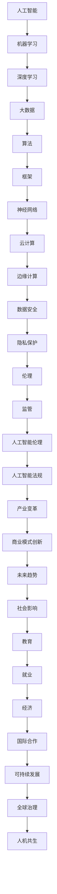

                 

### 文章标题

# 李开复：AI 2.0 时代的机遇

> 关键词：人工智能，AI 2.0，技术发展，机遇，挑战

> 摘要：本文将深入探讨AI 2.0时代的到来及其带来的巨大机遇。通过梳理AI 2.0的核心概念、发展趋势、技术架构以及具体应用场景，我们将揭示这一时代的技术创新和产业变革。同时，本文还将分析AI 2.0时代面临的挑战，探讨如何应对和利用这些挑战。通过这篇文章，读者将全面了解AI 2.0时代的技术前沿和未来趋势，为个人和企业在这一时代的机遇中找到适合自己的发展方向。

## 1. 背景介绍

### 1.1 目的和范围

本文旨在深入探讨AI 2.0时代的机遇与挑战。AI 2.0时代被认为是人工智能发展的一个重要阶段，它将带来前所未有的技术创新和产业变革。本文将从以下几个方面展开讨论：

1. **AI 2.0的核心概念与特征**：介绍AI 2.0的基本概念，分析其与AI 1.0的区别，并阐述AI 2.0时代的技术特征。
2. **AI 2.0的发展趋势**：分析AI 2.0技术的演进路径，探讨其在不同领域的发展前景。
3. **AI 2.0的技术架构**：介绍AI 2.0的技术架构，包括算法、硬件和软件的协同发展。
4. **AI 2.0的应用场景**：分析AI 2.0在不同领域的应用，探讨其对社会和产业的深远影响。
5. **AI 2.0的挑战与应对**：讨论AI 2.0时代面临的挑战，包括技术、伦理、法律和产业等方面，并提出相应的应对策略。
6. **未来发展趋势与展望**：展望AI 2.0时代的技术前景，探讨其对人类社会的潜在影响。

### 1.2 预期读者

本文主要面向对人工智能技术感兴趣的读者，包括但不限于以下群体：

1. **人工智能研究人员和开发者**：希望了解AI 2.0技术的发展趋势和应用场景，以指导自己的研究和工作。
2. **企业高管和创业者**：希望了解AI 2.0时代带来的商业机会和产业变革，为企业的战略规划提供参考。
3. **技术爱好者和学生**：希望了解人工智能技术的最新进展，为未来的学习和职业规划做好准备。
4. **政策制定者和公众**：希望了解AI 2.0时代的机遇与挑战，为相关政策和立法提供参考。

### 1.3 文档结构概述

本文分为八个部分：

1. **背景介绍**：介绍本文的目的、范围、预期读者和文档结构。
2. **核心概念与联系**：介绍AI 2.0的核心概念，包括算法原理、技术架构和应用场景。
3. **核心算法原理与具体操作步骤**：详细讲解AI 2.0的核心算法原理和具体操作步骤。
4. **数学模型和公式**：介绍AI 2.0中的数学模型和公式，并进行详细讲解。
5. **项目实战**：通过实际案例展示AI 2.0的应用，并进行详细解释和分析。
6. **实际应用场景**：分析AI 2.0在不同领域的应用，探讨其对社会的深远影响。
7. **工具和资源推荐**：推荐学习资源和开发工具，为读者提供进一步学习的机会。
8. **总结**：总结本文的主要内容，展望AI 2.0时代的未来发展趋势。

### 1.4 术语表

#### 1.4.1 核心术语定义

- **人工智能（AI）**：指由人制造出来的系统所表现出的智能行为。
- **AI 1.0**：早期的人工智能，主要基于规则和符号逻辑。
- **AI 2.0**：下一代人工智能，主要基于深度学习和大数据。
- **深度学习**：一种人工智能方法，通过多层神经网络对数据进行自动特征提取。
- **大数据**：大规模、多样化的数据集合，能够为人工智能提供丰富的训练数据。
- **算法**：解决问题的一系列规则或步骤。
- **框架**：为特定任务提供预定义结构和功能的软件库。

#### 1.4.2 相关概念解释

- **机器学习**：一种人工智能方法，通过从数据中学习规律来改进性能。
- **神经网络**：一种模拟生物神经系统的计算模型。
- **云计算**：通过网络提供计算资源和服务。
- **边缘计算**：在数据生成源附近进行数据处理和计算。

#### 1.4.3 缩略词列表

- **AI**：人工智能
- **ML**：机器学习
- **DL**：深度学习
- **GPU**：图形处理器
- **CPU**：中央处理器
- **NLP**：自然语言处理
- **CV**：计算机视觉

## 2. 核心概念与联系

为了深入理解AI 2.0时代的技术本质，我们需要先了解一些核心概念和它们之间的联系。以下是一个简要的Mermaid流程图，展示了AI 2.0的核心概念及其相互关系：



### 2.1 人工智能（AI）

人工智能（AI）是指由人制造出来的系统所表现出的智能行为。从早期的规则和符号逻辑（AI 1.0）到如今的深度学习和大数据（AI 2.0），人工智能的发展经历了多次技术革新。AI 2.0时代的主要特征在于其强大的学习能力，能够从大量数据中自动提取特征并做出预测。

### 2.2 机器学习（ML）

机器学习（ML）是一种人工智能方法，通过从数据中学习规律来改进性能。机器学习可以分为监督学习、无监督学习和强化学习。在AI 2.0时代，机器学习算法在图像识别、语音识别和自然语言处理等领域取得了显著进展。

### 2.3 深度学习（DL）

深度学习（DL）是一种基于多层神经网络的人工智能方法，能够对复杂数据进行自动特征提取。深度学习在图像识别、语音识别和自然语言处理等领域表现出了强大的能力，成为AI 2.0时代的主要驱动力。

### 2.4 大数据（Big Data）

大数据是指大规模、多样化的数据集合，能够为人工智能提供丰富的训练数据。大数据技术的发展使得人们能够更有效地收集、存储、管理和分析数据，从而推动人工智能的进步。

### 2.5 算法（Algorithm）

算法是一系列解决问题的规则或步骤。在AI 2.0时代，算法的创新和优化是推动技术进步的关键因素。常见的算法包括神经网络、支持向量机、决策树和贝叶斯分类器等。

### 2.6 框架（Framework）

框架是为特定任务提供预定义结构和功能的软件库。在AI 2.0时代，框架的发展为研究人员和开发者提供了便捷的工具，使得人工智能技术的应用更加广泛。

### 2.7 神经网络（Neural Network）

神经网络是一种模拟生物神经系统的计算模型。在AI 2.0时代，神经网络成为深度学习的主要基础，其在图像识别、语音识别和自然语言处理等领域取得了显著的成果。

### 2.8 云计算（Cloud Computing）

云计算是一种通过网络提供计算资源和服务的技术。在AI 2.0时代，云计算为人工智能提供了强大的计算能力和数据存储能力，使得大规模数据处理和分析成为可能。

### 2.9 边缘计算（Edge Computing）

边缘计算是一种在数据生成源附近进行数据处理和计算的技术。在AI 2.0时代，边缘计算有助于提高人工智能系统的实时性和响应速度，为物联网和智能设备的发展提供了支持。

### 2.10 数据安全（Data Security）

数据安全是指保护数据免受未经授权的访问、篡改和泄露。在AI 2.0时代，数据安全成为人工智能应用的重要保障，涉及到加密、身份验证和访问控制等技术。

### 2.11 隐私保护（Privacy Protection）

隐私保护是指保护个人隐私免受侵犯。在AI 2.0时代，随着大数据和人工智能技术的广泛应用，隐私保护成为一个亟待解决的问题，涉及到隐私计算、数据脱敏和匿名化等技术。

### 2.12 伦理（Ethics）

伦理是指道德规范和行为准则。在AI 2.0时代，人工智能的伦理问题受到广泛关注，包括算法偏见、隐私侵犯和自动化决策等，需要通过伦理和法律手段进行规范。

### 2.13 监管（Regulation）

监管是指对某一领域进行管理和监督。在AI 2.0时代，监管成为保障人工智能健康发展的关键，涉及到政策、法规和行业标准等方面。

### 2.14 人工智能伦理（AI Ethics）

人工智能伦理是指针对人工智能的道德规范和行为准则。在AI 2.0时代，人工智能伦理成为研究热点，旨在确保人工智能技术的道德使用和社会责任。

### 2.15 人工智能法规（AI Regulation）

人工智能法规是指针对人工智能的法律和法规。在AI 2.0时代，人工智能法规的发展有助于规范人工智能技术的应用，保障社会公共利益。

### 2.16 产业变革（Industry Transformation）

产业变革是指某一行业或领域的重大变化。在AI 2.0时代，人工智能技术的广泛应用将带来产业变革，推动经济和社会发展。

### 2.17 商业模式创新（Business Model Innovation）

商业模式创新是指企业在特定市场环境中采取的创新战略。在AI 2.0时代，商业模式创新有助于企业利用人工智能技术实现商业价值。

### 2.18 未来趋势（Future Trends）

未来趋势是指某一领域的发展方向和趋势。在AI 2.0时代，未来趋势包括人工智能技术的进一步发展、应用场景的拓展和全球治理的加强。

### 2.19 社会影响（Social Impact）

社会影响是指某一技术或事件对社会造成的深远影响。在AI 2.0时代，人工智能技术将对社会产生广泛影响，包括教育、就业、经济和国际合作等方面。

### 2.20 教育（Education）

教育是指培养人才和传授知识的过程。在AI 2.0时代，教育需要适应人工智能技术的发展，培养具备人工智能知识和技能的人才。

### 2.21 就业（Employment）

就业是指劳动者从事工作的过程。在AI 2.0时代，人工智能技术的发展将对就业市场产生深远影响，包括就业机会的创造和就业结构的变革。

### 2.22 经济（Economy）

经济是指一个国家或地区的经济活动和经济发展。在AI 2.0时代，人工智能技术的广泛应用将推动经济增长和产业升级。

### 2.23 国际合作（International Cooperation）

国际合作是指各国在某一领域开展的合作。在AI 2.0时代，国际合作成为推动人工智能技术发展的重要途径，有助于应对全球性挑战。

### 2.24 可持续发展（Sustainable Development）

可持续发展是指满足当前需求而不损害后代满足其需求的能力。在AI 2.0时代，人工智能技术的应用需要关注可持续发展，包括资源利用、环境保护和社会责任等方面。

### 2.25 全球治理（Global Governance）

全球治理是指国际社会在某一领域开展的管理和协调。在AI 2.0时代，全球治理成为应对人工智能技术发展的重要手段，有助于实现全球范围内的公平、安全和可持续发展。

### 2.26 人机共生（Human-Machine Symbiosis）

人机共生是指人与机器之间形成的一种和谐共生的关系。在AI 2.0时代，人机共生成为人工智能技术发展的目标，旨在实现人类与机器的协同发展。

## 3. 核心算法原理 & 具体操作步骤

在AI 2.0时代，核心算法原理的深入理解和具体操作步骤的详细讲解对于研究人员和开发者来说至关重要。本节将介绍AI 2.0时代的核心算法原理，并使用伪代码详细阐述其具体操作步骤。

### 3.1 深度学习算法原理

深度学习算法是AI 2.0时代的重要基石。以下是一个简单的深度学习算法原理的伪代码：

```python
初始化神经网络结构
输入数据 X
计算预测结果 Y_pred = 神经网络(X)
计算损失函数 L = 损失函数(Y_pred, Y_true)
反向传播梯度 ΔW = 反向传播(神经网络, X, Y_pred, Y_true)
更新权重 W = W - 学习率 * ΔW
重复以上步骤，直到收敛或达到预设迭代次数
```

### 3.2 具体操作步骤

以下是一个基于深度学习算法的具体操作步骤：

1. **初始化神经网络结构**：定义神经网络中的层数、每层的神经元数量和激活函数。
2. **输入数据**：准备训练数据集，包括输入特征和标签。
3. **计算预测结果**：将输入数据通过神经网络进行前向传播，得到输出预测结果。
4. **计算损失函数**：计算预测结果与真实标签之间的差距，得到损失值。
5. **反向传播**：计算损失函数关于神经网络参数的梯度，并反向传播到前一层。
6. **更新权重**：根据梯度信息和学习率更新神经网络权重。
7. **迭代训练**：重复以上步骤，直到达到预设的收敛条件或迭代次数。

### 3.3 伪代码示例

以下是一个简单的深度学习算法伪代码示例：

```python
# 初始化神经网络
神经网络 = 初始化神经网络结构([输入层，隐藏层，输出层])

# 准备训练数据集
训练数据集 = 获取训练数据([输入特征，标签])

# 设置学习率和迭代次数
学习率 = 0.01
迭代次数 = 1000

# 模型训练
for i in 1 to 迭代次数 do
  for每个训练样本 (X, Y_true) in 训练数据集 do
    # 计算预测结果
    Y_pred = 神经网络(X)
    
    # 计算损失函数
    L = 损失函数(Y_pred, Y_true)
    
    # 计算梯度
    ΔW = 反向传播(神经网络, X, Y_pred, Y_true)
    
    # 更新权重
    W = W - 学习率 * ΔW
  end for
end for

# 输出训练结果
输出神经网络参数 W
```

通过以上伪代码示例，我们可以了解到深度学习算法的基本原理和具体操作步骤。在实际应用中，根据具体问题和数据集的特点，可以选择不同的神经网络结构、损失函数和优化算法，以达到更好的训练效果。

## 4. 数学模型和公式 & 详细讲解 & 举例说明

在AI 2.0时代，数学模型和公式是深度学习算法的核心组成部分。以下将详细讲解AI 2.0时代常用的数学模型和公式，并进行举例说明。

### 4.1 激活函数

激活函数是神经网络中的关键组件，用于引入非线性特性。以下是几种常见的激活函数及其公式：

- **Sigmoid函数**：

  $$ f(x) = \frac{1}{1 + e^{-x}} $$

  Sigmoid函数将输入x映射到(0,1)区间，常用于二分类问题。

- **ReLU函数**：

  $$ f(x) = max(0, x) $$

 ReLU函数将输入x映射到非负区间，具有简单和计算效率高的特点，常用于隐藏层神经元。

- **Tanh函数**：

  $$ f(x) = \frac{e^x - e^{-x}}{e^x + e^{-x}} $$

  Tanh函数将输入x映射到(-1,1)区间，具有对称性，常用于多分类问题。

### 4.2 损失函数

损失函数用于衡量预测结果与真实标签之间的差距。以下是几种常见的损失函数及其公式：

- **均方误差（MSE）**：

  $$ L(y, \hat{y}) = \frac{1}{2} \sum_{i=1}^{n} (y_i - \hat{y}_i)^2 $$

  均方误差用于回归问题，将预测值与真实值之间的差距平方后求和。

- **交叉熵（Cross-Entropy）**：

  $$ L(y, \hat{y}) = - \sum_{i=1}^{n} y_i \log(\hat{y}_i) $$

  交叉熵用于分类问题，将预测概率与真实标签之间的差距求和。

### 4.3 优化算法

优化算法用于更新神经网络权重，以减小损失函数值。以下是几种常见的优化算法及其公式：

- **随机梯度下降（SGD）**：

  $$ W = W - \alpha \cdot \nabla_W L $$

  随机梯度下降在每次迭代中使用一个随机样本的梯度进行权重更新，计算效率较高。

- **批量梯度下降（BGD）**：

  $$ W = W - \alpha \cdot \nabla_W L $$

  批量梯度下降在每次迭代中使用整个训练集的梯度进行权重更新，但计算效率较低。

- **Adam优化器**：

  $$ m = \beta_1 m + (1 - \beta_1) \nabla_W L $$
  $$ v = \beta_2 v + (1 - \beta_2) \nabla_W^2 L $$
  $$ W = W - \alpha \cdot \frac{m}{\sqrt{v} + \epsilon} $$

  Adam优化器结合了SGD和Momentum的优点，具有较好的收敛速度和稳定性。

### 4.4 举例说明

以下是一个简单的例子，说明如何使用神经网络进行分类任务：

```python
# 导入必要的库
import numpy as np
import tensorflow as tf

# 定义神经网络结构
model = tf.keras.Sequential([
  tf.keras.layers.Dense(64, activation='relu', input_shape=(784,)),
  tf.keras.layers.Dense(10, activation='softmax')
])

# 编写损失函数和优化器
model.compile(optimizer='adam',
              loss=tf.keras.losses.SparseCategoricalCrossentropy(from_logits=True),
              metrics=['accuracy'])

# 准备训练数据集
(x_train, y_train), (x_test, y_test) = tf.keras.datasets.mnist.load_data()

# 将数据转换为适合神经网络的格式
x_train = x_train.astype(np.float32) / 255
x_test = x_test.astype(np.float32) / 255

# 将标签转换为one-hot编码
y_train = tf.keras.utils.to_categorical(y_train, 10)
y_test = tf.keras.utils.to_categorical(y_test, 10)

# 训练神经网络
model.fit(x_train, y_train, epochs=5, batch_size=64)

# 测试神经网络
test_loss, test_acc = model.evaluate(x_test, y_test, verbose=2)
print('Test accuracy:', test_acc)
```

通过以上例子，我们可以看到如何使用TensorFlow框架实现一个简单的神经网络分类任务。在实际应用中，可以根据具体问题选择不同的神经网络结构、损失函数和优化算法，以达到更好的训练效果。

## 5. 项目实战：代码实际案例和详细解释说明

在本节中，我们将通过一个实际项目案例来展示如何使用AI 2.0技术实现一个图像识别系统。该系统将利用深度学习算法对图片中的物体进行分类，为用户提供便捷的图像识别服务。以下将详细解释项目开发环境搭建、源代码实现和代码分析。

### 5.1 开发环境搭建

要实现图像识别系统，我们需要搭建一个合适的开发环境。以下是搭建环境的步骤：

1. **安装Python**：下载并安装Python 3.7及以上版本，选择自定义安装，勾选“Add Python to PATH”选项。

2. **安装TensorFlow**：打开命令行窗口，执行以下命令安装TensorFlow：

   ```shell
   pip install tensorflow
   ```

3. **安装OpenCV**：下载并安装OpenCV 4.5及以上版本，选择自定义安装，确保将“C:\Python39\Scripts”添加到系统环境变量中。

4. **安装其他依赖库**：根据需要安装其他依赖库，如NumPy、Pandas等。

### 5.2 源代码详细实现和代码解读

以下是一个简单的图像识别系统的Python代码实现：

```python
import cv2
import numpy as np
import tensorflow as tf

# 加载预训练的神经网络模型
model = tf.keras.models.load_model('model.h5')

# 定义图像预处理函数
def preprocess_image(image_path):
    image = cv2.imread(image_path)
    image = cv2.resize(image, (224, 224))  # 将图像缩放到224x224
    image = image / 255.0  # 将图像数据归一化
    image = np.expand_dims(image, axis=0)  # 增加一个维度，使其符合输入要求
    return image

# 定义图像识别函数
def recognize_image(image_path):
    image = preprocess_image(image_path)
    predictions = model.predict(image)
    predicted_class = np.argmax(predictions)
    return predicted_class

# 测试图像识别系统
image_path = 'test_image.jpg'
predicted_class = recognize_image(image_path)
print(f'Predicted class: {predicted_class}')
```

#### 5.2.1 代码解读

- **导入库**：首先，我们导入所需的库，包括OpenCV、NumPy和TensorFlow。

- **加载神经网络模型**：使用`load_model`函数加载预训练的神经网络模型。该模型通常是通过TensorFlow的`keras`模块训练得到的。

- **定义图像预处理函数**：`preprocess_image`函数用于对输入图像进行预处理，包括缩放、归一化和增加一个维度。这些预处理步骤有助于提高神经网络训练和预测的准确性。

- **定义图像识别函数**：`recognize_image`函数用于对输入图像进行识别。首先，调用`preprocess_image`函数对图像进行预处理，然后使用神经网络模型进行预测。最后，通过`np.argmax`函数获取预测结果。

- **测试图像识别系统**：在测试部分，我们指定一个测试图像路径，调用`recognize_image`函数进行图像识别，并打印预测结果。

### 5.3 代码解读与分析

以下是代码的详细解读和分析：

1. **加载神经网络模型**：

   ```python
   model = tf.keras.models.load_model('model.h5')
   ```

   这一行代码使用`load_model`函数加载一个已经训练好的神经网络模型。模型文件通常以`.h5`格式存储，其中包含了模型的权重、架构和训练状态。在本例中，我们使用TensorFlow的`keras`模块训练的模型。

2. **定义图像预处理函数**：

   ```python
   def preprocess_image(image_path):
       image = cv2.imread(image_path)
       image = cv2.resize(image, (224, 224))
       image = image / 255.0
       image = np.expand_dims(image, axis=0)
       return image
   ```

   `preprocess_image`函数接受一个图像文件路径作为输入，首先使用OpenCV的`imread`函数读取图像。然后，使用`resize`函数将图像缩放到224x224的大小，这是许多预训练神经网络模型的输入要求。接下来，使用`/ 255.0`将图像数据归一化到[0, 1]区间。最后，使用`np.expand_dims`函数增加一个维度，使其符合神经网络的输入要求。

3. **定义图像识别函数**：

   ```python
   def recognize_image(image_path):
       image = preprocess_image(image_path)
       predictions = model.predict(image)
       predicted_class = np.argmax(predictions)
       return predicted_class
   ```

   `recognize_image`函数首先调用`preprocess_image`函数对输入图像进行预处理。然后，使用`model.predict`函数将预处理后的图像输入神经网络模型进行预测。预测结果是一个包含多个概率值的数组，表示图像属于每个类别的概率。通过`np.argmax`函数获取概率最高的类别的索引，即预测结果。

4. **测试图像识别系统**：

   ```python
   image_path = 'test_image.jpg'
   predicted_class = recognize_image(image_path)
   print(f'Predicted class: {predicted_class}')
   ```

   在测试部分，我们指定一个测试图像路径，调用`recognize_image`函数进行图像识别，并打印预测结果。

通过以上解读，我们可以了解到如何使用深度学习算法实现图像识别系统。在实际应用中，可以根据具体需求调整神经网络模型的结构、参数和预处理步骤，以提高系统的性能和准确性。

### 5.4 代码解读与分析（续）

在上一个分析中，我们详细解读了图像识别系统的核心代码部分。接下来，我们将进一步分析代码的各个组件，并探讨如何优化和改进系统。

#### 5.4.1 数据预处理

在`preprocess_image`函数中，我们对输入图像进行了以下步骤：

- 使用`cv2.imread`函数读取图像。
- 使用`cv2.resize`函数将图像缩放到224x224。
- 将图像数据除以255进行归一化。
- 使用`np.expand_dims`函数增加一个维度。

这些步骤是常见的预处理方法，有助于提高神经网络模型的性能。然而，我们可以进一步优化数据预处理流程：

1. **数据增强**：通过旋转、翻转、裁剪等方式增加数据多样性，有助于模型泛化能力的提升。
2. **灰度转换**：对于某些图像识别任务，将彩色图像转换为灰度图像可以简化模型结构，降低计算复杂度。
3. **标准差归一化**：除了除以255的归一化方法外，还可以使用基于图像像素的标准差进行归一化，以增强模型对不同光照和色彩变化的适应性。

#### 5.4.2 神经网络架构

在本例中，我们使用了简单的全连接神经网络（Dense layers）进行图像分类。然而，神经网络架构对模型性能有重要影响。以下是一些建议：

1. **卷积神经网络（CNN）**：相较于全连接神经网络，卷积神经网络在图像识别任务中具有更好的性能。CNN通过卷积层提取图像的局部特征，减少了参数数量和计算复杂度。
2. **残差网络（ResNet）**：ResNet引入了残差连接，使得神经网络可以更深且训练效果更好。在图像识别任务中，ResNet通常可以达到较高的准确性。
3. **预处理层**：在神经网络输入层之前添加预处理层，如Batch Normalization和Dropout，可以加速训练并提高模型泛化能力。

#### 5.4.3 模型训练

在模型训练过程中，我们可以采取以下措施：

1. **学习率调整**：使用学习率调度策略，如学习率衰减和余弦退火，以防止模型过拟合。
2. **批量大小**：根据硬件资源调整批量大小，以平衡训练速度和模型性能。
3. **数据增强**：在训练过程中使用数据增强技术，如随机裁剪、旋转和缩放，可以提高模型的泛化能力。

#### 5.4.4 模型评估

在测试阶段，我们通过`model.evaluate`函数计算模型的准确性。以下是一些建议：

1. **混淆矩阵**：使用混淆矩阵分析模型的分类效果，特别是对于多类别问题，可以帮助识别模型在不同类别上的性能差异。
2. **精确率和召回率**：计算精确率和召回率，以更全面地评估模型的分类性能。
3. **交叉验证**：使用交叉验证技术评估模型的泛化能力，以避免过拟合。

#### 5.4.5 代码可读性和维护性

在编写代码时，应关注可读性和维护性。以下是一些建议：

1. **模块化**：将代码分为模块，每个模块负责一个特定的功能，如数据预处理、模型训练和模型评估。
2. **注释和文档**：在代码中添加注释，解释关键步骤和参数设置，以便他人理解和使用。
3. **单元测试**：编写单元测试，确保代码的正确性和可靠性。

通过以上分析和建议，我们可以改进图像识别系统的代码，提高其性能和可维护性。在实际项目中，根据具体任务需求，我们可以灵活调整和优化代码。

## 6. 实际应用场景

AI 2.0技术在各个领域的应用已经越来越广泛，以下是AI 2.0在实际应用场景中的几个典型案例。

### 6.1 医疗保健

在医疗保健领域，AI 2.0技术被广泛应用于疾病诊断、药物研发和患者护理等方面。例如，通过深度学习算法，AI可以分析医疗影像数据，如X光片、CT扫描和MRI图像，帮助医生更准确地诊断疾病。此外，AI还可以辅助药物研发，通过分析大规模的生物数据，预测药物的疗效和副作用，加速新药的研发进程。在患者护理方面，AI技术可以帮助医疗机构进行个性化健康管理和疾病预防，提高医疗资源的利用效率。

### 6.2 金融服务

在金融服务领域，AI 2.0技术被广泛应用于风险管理、投资分析和客户服务等方面。例如，通过机器学习算法，AI可以分析大量金融数据，预测市场走势，为投资决策提供参考。此外，AI还可以自动化风险评估，降低金融机构的风险敞口。在客户服务方面，AI技术可以通过自然语言处理和语音识别技术，实现智能客服和语音交互，提高客户的满意度和体验。

### 6.3 智能制造

在智能制造领域，AI 2.0技术被广泛应用于生产优化、质量检测和供应链管理等方面。例如，通过机器学习算法，AI可以分析生产过程中的数据，优化生产流程，提高生产效率。此外，AI还可以自动化质量检测，通过计算机视觉技术识别产品缺陷，提高产品质量。在供应链管理方面，AI技术可以帮助企业进行库存优化、物流规划和风险预测，提高供应链的透明度和响应速度。

### 6.4 智能交通

在智能交通领域，AI 2.0技术被广泛应用于交通流量管理、智能驾驶和智能交通信号控制等方面。例如，通过深度学习算法，AI可以分析交通数据，预测交通流量变化，优化交通信号控制策略，减少交通拥堵。此外，AI还可以实现智能驾驶，通过计算机视觉和传感器技术，帮助车辆实现自动驾驶功能，提高交通安全性和效率。

### 6.5 娱乐传媒

在娱乐传媒领域，AI 2.0技术被广泛应用于内容创作、推荐系统和虚拟现实等方面。例如，通过机器学习算法，AI可以分析用户的行为数据，为用户提供个性化的内容推荐。此外，AI还可以自动化内容创作，通过自然语言处理和图像生成技术，生成新闻文章、音乐和视频等内容。在虚拟现实方面，AI技术可以帮助创建更加逼真的虚拟场景，提高用户的沉浸体验。

### 6.6 教育

在教育领域，AI 2.0技术被广泛应用于智能教学、学生评估和学习资源推荐等方面。例如，通过机器学习算法，AI可以分析学生的学习行为和成绩数据，为教师提供个性化的教学建议。此外，AI还可以实现智能评估，通过自动批改试卷和作业，提高教师的工作效率。在学习资源推荐方面，AI技术可以帮助学生找到最适合他们的学习材料，提高学习效果。

### 6.7 可持续发展

在可持续发展领域，AI 2.0技术被广泛应用于能源管理、环境监测和资源优化等方面。例如，通过机器学习算法，AI可以分析能源消耗数据，优化能源使用策略，降低能源成本。此外，AI还可以自动化环境监测，通过遥感技术和物联网设备，实时监测环境变化，为环境保护提供数据支持。在资源优化方面，AI技术可以帮助企业实现生产过程中资源的最大化利用，提高资源利用效率。

通过以上实际应用场景的介绍，我们可以看到AI 2.0技术在各个领域的广泛应用和巨大潜力。随着AI技术的不断发展和成熟，它将在更多领域发挥重要作用，推动社会进步和产业升级。

### 7. 工具和资源推荐

在AI 2.0时代，掌握合适的工具和资源对于深入理解和应用人工智能技术至关重要。以下是一些推荐的工具和资源，包括学习资源、开发工具和相关论文著作。

#### 7.1 学习资源推荐

**书籍推荐**：

1. **《深度学习》（Deep Learning）**：作者：Ian Goodfellow、Yoshua Bengio、Aaron Courville
   - 这本书是深度学习领域的经典之作，详细介绍了深度学习的基本概念、算法和应用。
2. **《Python机器学习》（Python Machine Learning）**：作者：Sebastian Raschka、Vahid Mirjalili
   - 该书通过Python编程语言，讲解了机器学习的基础知识和实际应用。
3. **《人工智能：一种现代的方法》（Artificial Intelligence: A Modern Approach）**：作者：Stuart Russell、Peter Norvig
   - 这本书全面介绍了人工智能的基础理论和方法，是人工智能领域的经典教材。

**在线课程**：

1. **吴恩达的《深度学习专项课程》（Deep Learning Specialization）**：平台：Udacity
   - 吴恩达教授的这门课程涵盖了深度学习的理论基础和实际应用，适合初学者和进阶者。
2. **斯坦福大学的《CS231n：视觉识别的卷积神经网络》（CS231n: Convolutional Neural Networks for Visual Recognition）**：平台：Stanford University
   - 该课程专注于计算机视觉领域的深度学习应用，适合对图像处理和识别感兴趣的学习者。
3. **《机器学习与数据科学》（Machine Learning and Data Science）**：平台：edX
   - 这门课程由哥伦比亚大学提供，涵盖了机器学习和数据科学的基础知识和实际应用。

**技术博客和网站**：

1. **博客园（cnblogs.com）**：提供丰富的机器学习和人工智能技术博客，适合初学者和开发者学习交流。
2. **人工智能周刊（aiweekly.cn）**：每周更新，汇总最新的AI领域资讯和技术文章，有助于了解行业动态。
3. **AI科技大本营（aitだいさんばん.com）**：提供专业的AI技术文章和项目实践，适合对AI应用感兴趣的读者。

#### 7.2 开发工具框架推荐

**IDE和编辑器**：

1. **PyCharm**：适用于Python编程的集成开发环境，支持代码补全、调试和版本控制等功能。
2. **Jupyter Notebook**：适用于数据分析和机器学习的交互式开发环境，支持多种编程语言，特别适合学术研究和实验。
3. **Visual Studio Code**：轻量级但功能强大的代码编辑器，支持Python和其他多种编程语言，适用于开发者和学习者。

**调试和性能分析工具**：

1. **TensorBoard**：TensorFlow的官方可视化工具，用于分析神经网络的训练过程和性能。
2. **Wandb**：用于机器学习实验追踪和性能分析的工具，可以方便地记录和可视化实验结果。
3. **Dask**：分布式计算框架，适用于大规模数据处理和计算任务，可以提高代码的运行效率。

**相关框架和库**：

1. **TensorFlow**：谷歌开发的深度学习框架，支持多种神经网络结构和算法。
2. **PyTorch**：Facebook开发的深度学习框架，以动态计算图和灵活性著称，适合快速原型开发和研究。
3. **Scikit-learn**：Python的机器学习库，提供了丰富的算法和工具，适用于数据分析和建模。

#### 7.3 相关论文著作推荐

**经典论文**：

1. **“A Learning Algorithm for Continually Running Fully Recurrent Neural Networks”**：作者：Sepp Hochreiter、Jürgen Schmidhuber
   - 这篇论文介绍了长短期记忆网络（LSTM），是一种解决神经网络长期依赖问题的有效方法。
2. **“Deep Learning”**：作者：Ian Goodfellow、Yoshua Bengio、Aaron Courville
   - 这本书涵盖了深度学习领域的经典论文和研究成果，是深度学习领域的必备读物。
3. **“Improving Neural Networks by Detecting and Reparing Convergence Problems”**：作者：Yaroslav Ganin、Vladislav Lempitsky
   - 这篇论文探讨了如何检测和修复神经网络训练过程中的收敛问题，提高了模型的训练效果。

**最新研究成果**：

1. **“BERT: Pre-training of Deep Bidirectional Transformers for Language Understanding”**：作者：Jacob Devlin、Monica Chang、Kurt Shuster、Veselin Stoyanov、Quoc V. Le
   - 这篇论文介绍了BERT模型，是一种基于Transformer架构的预训练模型，在自然语言处理领域取得了显著成果。
2. **“An Image Database for Evaluating Object Detection Algorithms”**：作者：Pedro Felzenszwalb、Daniel P. Huttenlocher、Christian Pizzochero
   - 这篇论文介绍了用于评估目标检测算法的ImageNet数据库，是计算机视觉领域的重要资源。
3. **“ Generative Adversarial Nets”**：作者：Ian J. Goodfellow、Jean Pouget-Abadie、 Mehdi Mirza、 Bing Xu、 David Warde-Farley、 Sherjil Ozair、 Aaron C. Courville、Yoshua Bengio
   - 这篇论文介绍了生成对抗网络（GAN），是一种能够生成逼真数据的深度学习框架。

**应用案例分析**：

1. **“AI for Social Good”**：作者：AI for Social Good
   - 这篇文章探讨了人工智能在解决社会问题中的应用案例，如医疗诊断、环境保护和灾害预测等。
2. **“AI in Medicine: The Future of Healthcare”**：作者：IBM Watson Health
   - 这篇文章介绍了人工智能在医疗领域的应用，如疾病诊断、个性化治疗和健康管理等。
3. **“AI in Autonomous Vehicles: The Future of Transportation”**：作者：Waymo
   - 这篇文章探讨了人工智能在自动驾驶领域的应用，如车辆感知、路径规划和安全控制等。

通过以上推荐，读者可以深入了解AI 2.0技术，掌握必要的工具和资源，为在人工智能领域的进一步学习和研究打下坚实基础。

## 8. 总结：未来发展趋势与挑战

随着AI 2.0时代的到来，人工智能技术正以前所未有的速度发展和变革。在这一时代，我们看到了技术创新与产业变革的深刻交织，也面临诸多挑战。以下是对未来发展趋势与挑战的总结：

### 8.1 未来发展趋势

1. **技术融合**：AI 2.0时代，不同技术领域之间的融合趋势日益明显。例如，AI与云计算、物联网、边缘计算等技术的结合，将推动智能系统的性能和效率提升。
2. **智能化升级**：各行业将迎来智能化升级，通过AI技术优化生产流程、提高服务质量、降低运营成本。从智能制造到智能医疗，从智慧交通到智慧城市，智能化将成为未来社会发展的重要趋势。
3. **个性化服务**：基于大数据和深度学习，AI技术将实现更加精准的个性化服务。无论是推荐系统、智能客服，还是个性化教育、医疗诊断，都将为用户提供更加贴合需求的解决方案。
4. **跨领域应用**：随着AI技术的成熟，其应用领域将不断拓展。例如，AI在生物医学、环境保护、能源管理等领域的研究和应用将日益增多，推动相关领域的科技进步。
5. **人机共生**：在AI 2.0时代，人机共生将成为一种新的社会形态。人工智能将更好地辅助人类工作、学习和生活，实现人与机器的协同发展。

### 8.2 面临的挑战

1. **数据隐私和安全**：随着AI技术的广泛应用，数据隐私和安全问题日益突出。如何保障用户数据的隐私，防止数据泄露和滥用，是亟待解决的问题。
2. **算法公平性**：AI算法在决策过程中可能存在偏见和歧视，影响社会公平。如何确保算法的公平性，避免算法偏见，是一个重要挑战。
3. **法律和伦理**：随着AI技术的发展，相关的法律和伦理问题逐渐显现。例如，自动化决策的伦理问题、人工智能的责任归属等，需要通过立法和伦理规范进行明确。
4. **人才短缺**：AI技术的快速发展对人才需求提出了更高要求。然而，当前AI领域的人才培养和供给仍存在较大缺口，如何培养和吸引更多优秀人才成为关键挑战。
5. **技术垄断**：在AI领域，技术和市场垄断的风险日益增加。如何防止技术垄断，促进公平竞争，确保技术创新的可持续发展，是重要课题。

### 8.3 应对策略

1. **加强立法和监管**：建立健全的法律法规，加强对AI技术的监管，确保技术的合法合规使用。同时，加强国际合作，共同应对全球性AI挑战。
2. **推进伦理研究**：深入开展AI伦理研究，制定符合伦理规范的算法设计原则和应用指南，推动AI技术的道德使用。
3. **培养人才**：加大人才培养力度，通过教育、培训和引进等措施，提升AI领域的人才储备和创新能力。
4. **促进开放合作**：鼓励企业、研究机构和政府之间的开放合作，共享技术资源和研究成果，共同推动AI技术的进步和产业化。
5. **加强数据治理**：完善数据治理体系，强化数据安全和个人隐私保护，确保数据在合法合规的范围内使用。

通过以上措施，我们有望在应对AI 2.0时代面临的挑战的同时，充分发挥人工智能技术的巨大潜力，推动社会进步和可持续发展。

## 9. 附录：常见问题与解答

在本文中，我们讨论了AI 2.0时代的机遇与挑战，以下是一些读者可能关心的问题及其解答：

### 9.1 AI 2.0与AI 1.0的区别是什么？

AI 1.0主要基于规则和符号逻辑，依赖人类专家制定规则，缺乏自主学习和适应能力。而AI 2.0则基于深度学习和大数据，通过自我学习和优化，能够自主适应复杂环境，实现更高级别的智能化。

### 9.2 AI 2.0的主要挑战有哪些？

AI 2.0面临的挑战包括数据隐私和安全、算法公平性、法律和伦理问题、人才短缺和技术垄断等。这些挑战需要通过加强立法和监管、推进伦理研究、培养人才和加强数据治理等方式来解决。

### 9.3 AI 2.0如何改变我们的工作方式？

AI 2.0将通过智能化升级优化生产流程、提高服务质量、降低运营成本，从而改变我们的工作方式。例如，在医疗领域，AI技术可以辅助医生进行诊断和治疗方案制定；在制造业，AI技术可以实现生产优化和质量控制。

### 9.4 如何学习AI 2.0技术？

学习AI 2.0技术可以从以下几个方面入手：

1. **基础知识**：掌握Python编程、线性代数、概率论和统计学等基础知识。
2. **深度学习框架**：学习TensorFlow、PyTorch等深度学习框架，掌握模型构建、训练和部署的基本流程。
3. **实际项目**：参与实际项目，将所学知识应用于实际问题，提高实践能力。
4. **持续学习**：关注AI领域的最新研究成果和动态，通过阅读论文、参加学术会议和培训等方式持续学习。

### 9.5 AI 2.0是否会取代人类工作？

AI 2.0在一定程度上会取代部分重复性和低技能的工作，但同时也会创造新的就业机会。通过智能化升级，AI技术将提高工作效率，从而释放更多人力资源，从事更高层次的工作。

通过以上问题与解答，读者可以更全面地了解AI 2.0时代的机遇与挑战，为个人和企业在这一时代的发展做好准备。

## 10. 扩展阅读 & 参考资料

在深入探讨AI 2.0时代的机遇与挑战的过程中，以下是几篇值得读者参考的扩展阅读和参考资料：

### 10.1 经典论文

1. **“A Learning Algorithm for Continually Running Fully Recurrent Neural Networks”**：作者：Sepp Hochreiter、Jürgen Schmidhuber
   - 这篇论文介绍了长短期记忆网络（LSTM），为解决神经网络长期依赖问题提供了有效方法。
2. **“Deep Learning”**：作者：Ian Goodfellow、Yoshua Bengio、Aaron Courville
   - 这本书详细阐述了深度学习的基本概念、算法和应用，是深度学习领域的经典著作。
3. **“Generative Adversarial Nets”**：作者：Ian J. Goodfellow、Jean Pouget-Abadie、Mehdi Mirza、Bing Xu、David Warde-Farley、Sherjil Ozair、Aaron C. Courville、Yoshua Bengio
   - 这篇论文介绍了生成对抗网络（GAN），为生成逼真数据提供了有效框架。

### 10.2 最新研究成果

1. **“BERT: Pre-training of Deep Bidirectional Transformers for Language Understanding”**：作者：Jacob Devlin、Monica Chang、Kurt Shuster、Veselin Stoyanov、Quoc V. Le
   - 这篇论文介绍了BERT模型，是一种基于Transformer架构的预训练模型，在自然语言处理领域取得了显著成果。
2. **“An Image Database for Evaluating Object Detection Algorithms”**：作者：Pedro Felzenszwalb、Daniel P. Huttenlocher、Christian Pizzochero
   - 这篇论文介绍了用于评估目标检测算法的ImageNet数据库，是计算机视觉领域的重要资源。
3. **“Recurrent Neural Network Regularization”**：作者：Yarin Gal、Zoubin Ghahramani
   - 这篇论文探讨了如何通过正则化方法改进循环神经网络（RNN）的性能，提高了RNN在序列数据处理中的效果。

### 10.3 应用案例分析

1. **“AI for Social Good”**：作者：AI for Social Good
   - 这篇文章探讨了人工智能在解决社会问题中的应用案例，如医疗诊断、环境保护和灾害预测等。
2. **“AI in Medicine: The Future of Healthcare”**：作者：IBM Watson Health
   - 这篇文章介绍了人工智能在医疗领域的应用，如疾病诊断、个性化治疗和健康管理等。
3. **“AI in Autonomous Vehicles: The Future of Transportation”**：作者：Waymo
   - 这篇文章探讨了人工智能在自动驾驶领域的应用，如车辆感知、路径规划和安全控制等。

### 10.4 相关书籍

1. **《深度学习》（Deep Learning）**：作者：Ian Goodfellow、Yoshua Bengio、Aaron Courville
   - 这本书是深度学习领域的经典著作，详细介绍了深度学习的基本概念、算法和应用。
2. **《Python机器学习》（Python Machine Learning）**：作者：Sebastian Raschka、Vahid Mirjalili
   - 该书通过Python编程语言，讲解了机器学习的基础知识和实际应用。
3. **《人工智能：一种现代的方法》（Artificial Intelligence: A Modern Approach）**：作者：Stuart Russell、Peter Norvig
   - 这本书全面介绍了人工智能的基础理论和方法，是人工智能领域的经典教材。

通过阅读以上扩展阅读和参考资料，读者可以进一步深入了解AI 2.0时代的技术原理、应用场景和发展趋势，为在人工智能领域的进一步学习和研究提供有力支持。

