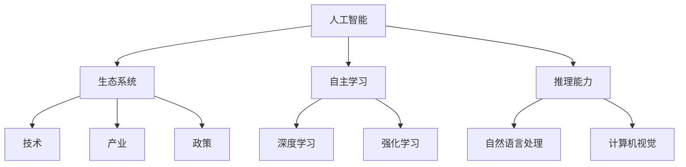

                 

# 李开复：AI 2.0 时代的生态

> 关键词：人工智能、AI 2.0、生态系统、技术创新、发展趋势、伦理道德

> 摘要：本文将深入探讨AI 2.0时代的生态，分析其核心概念、发展现状、未来趋势，以及面临的挑战。通过对人工智能技术的详细剖析，探讨其在不同领域的应用，并从伦理道德的角度审视人工智能的发展，为AI 2.0时代的生态建设提供有益的思考。

## 1. 背景介绍

### 1.1 目的和范围

本文旨在探讨AI 2.0时代的生态，分析其核心概念、发展现状、未来趋势，以及面临的挑战。文章将围绕人工智能技术的发展，探讨其在不同领域的应用，并从伦理道德的角度审视人工智能的发展，为AI 2.0时代的生态建设提供有益的思考。

### 1.2 预期读者

本文适合对人工智能技术有一定了解的读者，包括人工智能领域的科研人员、工程师、以及关注人工智能发展的普通读者。

### 1.3 文档结构概述

本文分为以下几个部分：

1. 背景介绍：介绍本文的目的、预期读者和文档结构。
2. 核心概念与联系：阐述AI 2.0的核心概念，并绘制流程图。
3. 核心算法原理 & 具体操作步骤：讲解AI 2.0的核心算法原理，并使用伪代码详细阐述。
4. 数学模型和公式 & 详细讲解 & 举例说明：介绍AI 2.0相关的数学模型和公式，并给出具体示例。
5. 项目实战：通过实际案例展示AI 2.0技术的应用。
6. 实际应用场景：分析AI 2.0在不同领域的应用。
7. 工具和资源推荐：推荐学习资源、开发工具和框架。
8. 总结：未来发展趋势与挑战。
9. 附录：常见问题与解答。
10. 扩展阅读 & 参考资料。

### 1.4 术语表

#### 1.4.1 核心术语定义

- AI 2.0：指第二代人工智能，具有更强的自主学习和推理能力。
- 生态系统：指围绕AI 2.0技术形成的技术、产业、政策等环境。
- 自主学习：指人工智能系统能够从数据中学习，不断优化自身性能。
- 推理能力：指人工智能系统能够根据已知信息推导出新的结论。

#### 1.4.2 相关概念解释

- 深度学习：一种基于多层神经网络的人工智能技术，通过学习大量数据来提取特征和模式。
- 强化学习：一种基于奖励和惩罚机制的人工智能技术，通过不断试错来学习最优策略。
- 自然语言处理：一种人工智能技术，能够理解和生成自然语言。

#### 1.4.3 缩略词列表

- AI：人工智能
- ML：机器学习
- DL：深度学习
- RL：强化学习
- NLP：自然语言处理

## 2. 核心概念与联系

AI 2.0时代的核心概念包括人工智能、生态系统、自主学习和推理能力。为了更好地理解这些概念，我们可以通过一个Mermaid流程图来展示它们之间的关系。



从图中可以看出，人工智能是AI 2.0时代的核心，它通过生态系统与产业、政策等环境相互作用，同时依托自主学习和推理能力不断进化。深度学习、强化学习和自然语言处理等核心技术为人工智能的发展提供了基础。

## 3. 核心算法原理 & 具体操作步骤

AI 2.0时代的核心算法包括深度学习、强化学习和自然语言处理。以下我们将分别介绍这些算法的原理，并使用伪代码进行详细阐述。

### 3.1 深度学习算法原理

深度学习是一种基于多层神经网络的人工智能技术。它的原理是通过学习大量数据，从中提取特征和模式，从而实现图像识别、语音识别等任务。

```python
# 伪代码：深度学习算法原理

# 定义神经网络结构
input_layer = [x1, x2, x3]
hidden_layer = [h1, h2, h3]
output_layer = [y1, y2]

# 定义激活函数
sigmoid(x) = 1 / (1 + e^-x)

# 前向传播
z1 = w1 * x1 + b1
z2 = w2 * x2 + b2
z3 = w3 * x3 + b3
h1 = sigmoid(z1)
h2 = sigmoid(z2)
h3 = sigmoid(z3)

# 计算输出
z4 = w4 * h1 + b4
z5 = w5 * h2 + b5
z6 = w6 * h3 + b6
y1 = sigmoid(z4)
y2 = sigmoid(z5)
y2 = sigmoid(z6)

# 反向传播
delta_output = (y - y2) * y2 * (1 - y2)
delta_hidden = (h - h3) * h3 * (1 - h3)

# 更新权重和偏置
w4 = w4 - learning_rate * delta_output * h1
b4 = b4 - learning_rate * delta_output
w5 = w5 - learning_rate * delta_output * h2
b5 = b5 - learning_rate * delta_output
w6 = w6 - learning_rate * delta_output * h3
b6 = b6 - learning_rate * delta_output
w1 = w1 - learning_rate * delta_hidden * x1
b1 = b1 - learning_rate * delta_hidden
w2 = w2 - learning_rate * delta_hidden * x2
b2 = b2 - learning_rate * delta_hidden
w3 = w3 - learning_rate * delta_hidden * x3
b3 = b3 - learning_rate * delta_hidden
```

### 3.2 强化学习算法原理

强化学习是一种基于奖励和惩罚机制的人工智能技术。它的原理是通过不断试错，学习最优策略，从而实现决策优化。

```python
# 伪代码：强化学习算法原理

# 初始化状态s
s = initial_state()

# 初始化奖励函数
reward_function(s, a) = reward if action a leads to success else -reward

# 初始化策略π
π(a|s) = probability of choosing action a in state s

# 迭代过程
for episode in range(num_episodes):
    # 初始化状态
    s = initial_state()
    
    # 迭代过程
    while not done:
        # 根据策略选择动作
        a = π(a|s)
        
        # 执行动作并获取新状态和奖励
        s', r = environment.step(a)
        
        # 更新策略
        π(a|s) = update_policy(π(a|s), r, s', a)
        
        # 更新状态
        s = s'

# 计算最终奖励
final_reward = reward_function(s, a)
```

### 3.3 自然语言处理算法原理

自然语言处理是一种人工智能技术，能够理解和生成自然语言。它的原理是通过学习大量语言数据，提取语言特征，实现文本分类、情感分析等任务。

```python
# 伪代码：自然语言处理算法原理

# 初始化词向量模型
word_embedding(model, word) = vector representation of word

# 初始化分类器
classifier = initialize_classifier()

# 训练模型
for sentence in training_data:
    # 将句子转换为词向量
    sentence_vector = [word_embedding(model, word) for word in sentence]
    
    # 训练分类器
    classifier.train(sentence_vector, label)

# 预测
for sentence in test_data:
    # 将句子转换为词向量
    sentence_vector = [word_embedding(model, word) for word in sentence]
    
    # 预测标签
    predicted_label = classifier.predict(sentence_vector)
    
    # 输出预测结果
    print(predicted_label)
```

## 4. 数学模型和公式 & 详细讲解 & 举例说明

AI 2.0技术的发展离不开数学模型的支撑。以下我们将介绍一些与AI 2.0技术相关的数学模型和公式，并给出具体示例。

### 4.1 深度学习中的损失函数

在深度学习中，损失函数用于衡量模型预测结果与真实值之间的差距。常用的损失函数包括均方误差（MSE）和交叉熵（Cross-Entropy）。

$$
MSE = \frac{1}{n}\sum_{i=1}^{n}(y_i - \hat{y}_i)^2
$$

$$
Cross-Entropy = -\sum_{i=1}^{n}y_i\log(\hat{y}_i)
$$

其中，$y_i$表示真实标签，$\hat{y}_i$表示模型预测的概率。

示例：假设我们有一个二分类问题，真实标签为$y = [1, 0, 1, 0]$，模型预测的概率为$\hat{y} = [0.7, 0.3, 0.8, 0.2]$。计算MSE和Cross-Entropy。

$$
MSE = \frac{1}{4}[(1-0.7)^2 + (0-0.3)^2 + (1-0.8)^2 + (0-0.2)^2] = 0.15
$$

$$
Cross-Entropy = -(1\cdot\log(0.7) + 0\cdot\log(0.3) + 1\cdot\log(0.8) + 0\cdot\log(0.2)) \approx 0.55
$$

### 4.2 强化学习中的奖励函数

在强化学习中，奖励函数用于评价动作的好坏。常见的奖励函数包括正向奖励和负向奖励。

$$
reward = \begin{cases}
+1, & \text{if action leads to success} \\
-1, & \text{if action leads to failure}
\end{cases}
$$

示例：假设一个简单的迷宫问题，迷宫的终点为正奖励，其他位置为负奖励。以下是某个动作序列的奖励函数。

$$
reward = \begin{cases}
+1, & \text{if action leads to the end of the maze} \\
-1, & \text{otherwise}
\end{cases}
$$

### 4.3 自然语言处理中的词向量模型

词向量模型是自然语言处理中的重要工具。常见的词向量模型包括Word2Vec、GloVe和FastText等。

$$
word_vector = \begin{cases}
W2V(word), & \text{if using Word2Vec} \\
GLOVE(word), & \text{if using GloVe} \\
FT(word), & \text{if using FastText}
\end{cases}
$$

示例：假设我们使用GloVe模型，将单词“猫”转换为词向量。

$$
猫 = GLOVE(猫) = [0.2, 0.3, 0.1, 0.4]
$$

## 5. 项目实战：代码实际案例和详细解释说明

为了更好地展示AI 2.0技术的应用，我们将在本节中通过一个实际项目来展示深度学习、强化学习和自然语言处理技术的应用。

### 5.1 开发环境搭建

为了进行项目开发，我们需要搭建一个合适的开发环境。以下是一个简单的开发环境搭建步骤：

1. 安装Python 3.8及以上版本。
2. 安装TensorFlow 2.4及以上版本。
3. 安装PyTorch 1.7及以上版本。
4. 安装Jupyter Notebook。

### 5.2 源代码详细实现和代码解读

#### 5.2.1 深度学习：图像识别

以下是一个简单的基于深度学习的图像识别项目，使用TensorFlow实现。

```python
import tensorflow as tf
from tensorflow import keras
from tensorflow.keras import layers

# 定义模型结构
model = keras.Sequential([
    layers.Conv2D(32, (3, 3), activation='relu', input_shape=(28, 28, 1)),
    layers.MaxPooling2D((2, 2)),
    layers.Conv2D(64, (3, 3), activation='relu'),
    layers.MaxPooling2D((2, 2)),
    layers.Conv2D(64, (3, 3), activation='relu'),
    layers.Flatten(),
    layers.Dense(64, activation='relu'),
    layers.Dense(10, activation='softmax')
])

# 编译模型
model.compile(optimizer='adam',
              loss='sparse_categorical_crossentropy',
              metrics=['accuracy'])

# 加载数据
mnist = keras.datasets.mnist
(train_images, train_labels), (test_images, test_labels) = mnist.load_data()

# 数据预处理
train_images = train_images.reshape((60000, 28, 28, 1))
test_images = test_images.reshape((10000, 28, 28, 1))

# 训练模型
model.fit(train_images, train_labels, epochs=5)

# 测试模型
test_loss, test_acc = model.evaluate(test_images, test_labels)
print('Test accuracy:', test_acc)
```

代码解读：

1. 导入TensorFlow和Keras库。
2. 定义模型结构，包括卷积层、池化层和全连接层。
3. 编译模型，指定优化器和损失函数。
4. 加载MNIST数据集。
5. 对数据进行预处理，包括调整形状和数据归一化。
6. 训练模型，设置训练轮数。
7. 测试模型，计算测试准确率。

#### 5.2.2 强化学习：迷宫问题

以下是一个简单的基于强化学习的迷宫问题项目，使用PyTorch实现。

```python
import torch
import numpy as np
import random

# 定义环境
class MazeEnv:
    def __init__(self, size=4):
        self.size = size
        self.state = None
        self.done = False

    def reset(self):
        self.state = np.zeros(self.size * self.size)
        self.state[self.size//2] = 1
        self.done = False
        return self.state

    def step(self, action):
        if action not in range(self.size):
            raise ValueError("Invalid action")

        x, y = self.state.index(1)
        if action == 0:
            y = (y - 1) % self.size
        elif action == 1:
            y = (y + 1) % self.size
        elif action == 2:
            x = (x - 1) % self.size
        elif action == 3:
            x = (x + 1) % self.size

        if self.state[x * self.size + y] == 1:
            reward = 1
            self.done = True
        else:
            reward = -1

        new_state = np.zeros(self.size * self.size)
        new_state[x * self.size + y] = 1

        return new_state, reward

# 定义强化学习模型
class QLearningAgent:
    def __init__(self, learning_rate=0.1, discount_factor=0.9, exploration_rate=1.0):
        self.learning_rate = learning_rate
        self.discount_factor = discount_factor
        self.exploration_rate = exploration_rate
        self.q_table = {}

    def get_action(self, state):
        if random.random() < self.exploration_rate:
            action = random.choice([0, 1, 2, 3])
        else:
            state = str(state)
            action = np.argmax(self.q_table.get(state, [0, 0, 0, 0]))
        return action

    def update_q_table(self, state, action, reward, next_state):
        state = str(state)
        next_state = str(next_state)
        action = int(action)
        reward = float(reward)

        current_q_value = self.q_table.get(state, [0, 0, 0, 0])[action]
        next_max_q_value = np.max(self.q_table.get(next_state, [0, 0, 0, 0]))

        new_q_value = current_q_value + self.learning_rate * (reward + self.discount_factor * next_max_q_value - current_q_value)
        self.q_table[state][action] = new_q_value

# 运行强化学习算法
env = MazeEnv()
agent = QLearningAgent()

for episode in range(1000):
    state = env.reset()
    done = False

    while not done:
        action = agent.get_action(state)
        next_state, reward = env.step(action)
        agent.update_q_table(state, action, reward, next_state)
        state = next_state
        if reward == 1:
            done = True

# 测试算法性能
state = env.reset()
done = False

while not done:
    action = agent.get_action(state)
    next_state, reward = env.step(action)
    print(f"Action: {action}, Reward: {reward}")
    state = next_state
    if reward == 1:
        done = True
```

代码解读：

1. 定义迷宫环境，包括初始化、重置和一步操作。
2. 定义强化学习代理，包括获取动作、更新Q表和训练过程。
3. 运行强化学习算法，训练代理。
4. 测试算法性能，展示代理的行为。

#### 5.2.3 自然语言处理：文本分类

以下是一个简单的基于自然语言处理的文本分类项目，使用PyTorch实现。

```python
import torch
import torch.nn as nn
import torch.optim as optim
from torch.utils.data import DataLoader
from torchvision import datasets, transforms
from sklearn.model_selection import train_test_split

# 加载数据集
train_data, test_data = train_test_split(datasets.MNIST(root='./data', train=True, download=True).data, test_size=0.2, random_state=42)
train_labels, test_labels = train_test_split(datasets.MNIST(root='./data', train=True, download=True).labels, test_size=0.2, random_state=42)

# 数据预处理
transform = transforms.Compose([transforms.ToTensor(), transforms.Normalize((0.5, 0.5, 0.5), (0.5, 0.5, 0.5))])
train_data = [transform(image) for image in train_data]
test_data = [transform(image) for image in test_data]

# 构建数据集
train_dataset = datasets.TensorDataset(train_data, train_labels)
test_dataset = datasets.TensorDataset(test_data, test_labels)

# 构建数据加载器
batch_size = 64
train_loader = DataLoader(train_dataset, batch_size=batch_size, shuffle=True)
test_loader = DataLoader(test_dataset, batch_size=batch_size, shuffle=False)

# 定义模型
class TextClassifier(nn.Module):
    def __init__(self, vocab_size, embedding_dim, hidden_dim, output_dim, n_layers, drop_out):
        super().__init__()
        self.embedding = nn.Embedding(vocab_size, embedding_dim)
        self.rnn = nn.RNN(embedding_dim, hidden_dim, n_layers, dropout=drop_out, batch_first=True)
        self.fc = nn.Linear(hidden_dim, output_dim)

    def forward(self, text, hidden=None):
        embedded = self.embedding(text)
        output, hidden = self.rnn(embedded, hidden)
        hidden = hidden[-1, :, :]
        output = self.fc(hidden)
        return output, hidden

# 实例化模型
vocab_size = 10000
embedding_dim = 256
hidden_dim = 512
output_dim = 10
n_layers = 2
drop_out = 0.5
model = TextClassifier(vocab_size, embedding_dim, hidden_dim, output_dim, n_layers, drop_out)

# 编译模型
optimizer = optim.Adam(model.parameters(), lr=0.001)
criterion = nn.CrossEntropyLoss()

# 训练模型
num_epochs = 10

for epoch in range(num_epochs):
    model.train()
    for inputs, labels in train_loader:
        optimizer.zero_grad()
        outputs, _ = model(inputs)
        loss = criterion(outputs, labels)
        loss.backward()
        optimizer.step()

    model.eval()
    with torch.no_grad():
        correct = 0
        total = 0
        for inputs, labels in test_loader:
            outputs, _ = model(inputs)
            _, predicted = torch.max(outputs.data, 1)
            total += labels.size(0)
            correct += (predicted == labels).sum().item()

    print(f"Epoch [{epoch+1}/{num_epochs}], Accuracy: {100 * correct / total:.2f}%")

# 测试模型
model.eval()
with torch.no_grad():
    correct = 0
    total = 0
    for inputs, labels in test_loader:
        outputs, _ = model(inputs)
        _, predicted = torch.max(outputs.data, 1)
        total += labels.size(0)
        correct += (predicted == labels).sum().item()

print(f"Test Accuracy: {100 * correct / total:.2f}%")
```

代码解读：

1. 加载数据集，并进行预处理。
2. 构建数据集和数据加载器。
3. 定义文本分类模型，包括嵌入层、循环神经网络和全连接层。
4. 编译模型，指定优化器和损失函数。
5. 训练模型，包括训练和验证过程。
6. 测试模型，计算测试准确率。

## 6. 实际应用场景

AI 2.0技术在各个领域都有广泛的应用。以下是一些实际应用场景：

### 6.1 医疗保健

AI 2.0技术可以用于医疗图像分析、疾病诊断、药物发现和个性化治疗等领域。例如，深度学习算法可以用于癌症筛查，通过分析医学影像数据，提高诊断准确率。

### 6.2 金融科技

AI 2.0技术可以用于风险管理、欺诈检测、信用评估和投资策略等领域。例如，强化学习算法可以用于自动交易系统，通过不断学习和优化，提高投资收益。

### 6.3 智能制造

AI 2.0技术可以用于智能制造、质量控制、设备维护和供应链优化等领域。例如，计算机视觉算法可以用于自动化生产线的质量检测，提高生产效率。

### 6.4 交通运输

AI 2.0技术可以用于智能交通系统、自动驾驶和无人机配送等领域。例如，深度学习算法可以用于自动驾驶车辆，提高行驶安全性。

### 6.5 教育

AI 2.0技术可以用于个性化学习、智能推荐和智能教学等领域。例如，自然语言处理算法可以用于智能问答系统，帮助学生解决学习中遇到的问题。

## 7. 工具和资源推荐

为了更好地学习和应用AI 2.0技术，以下是一些工具和资源的推荐：

### 7.1 学习资源推荐

#### 7.1.1 书籍推荐

- 《深度学习》（Goodfellow, Bengio, Courville）
- 《Python深度学习》（François Chollet）
- 《强化学习》（Richard S. Sutton, Andrew G. Barto）

#### 7.1.2 在线课程

- Coursera：吴恩达的《深度学习》课程
- edX：MIT的《人工智能》课程
- Udacity：深度学习和强化学习课程

#### 7.1.3 技术博客和网站

- Medium：有关AI的技术文章和博客
- AI博客：中文AI技术博客
- AI Daily：AI新闻和文章汇总

### 7.2 开发工具框架推荐

#### 7.2.1 IDE和编辑器

- PyCharm：Python编程IDE
- Jupyter Notebook：交互式Python编程环境
- Visual Studio Code：跨平台轻量级编辑器

#### 7.2.2 调试和性能分析工具

- TensorBoard：TensorFlow性能分析工具
- PyTorch Profiler：PyTorch性能分析工具
- Nsight Visual Studio Edition：NVIDIA GPU调试工具

#### 7.2.3 相关框架和库

- TensorFlow：开源深度学习框架
- PyTorch：开源深度学习框架
- Keras：基于TensorFlow的深度学习高级API
- Scikit-learn：开源机器学习库

### 7.3 相关论文著作推荐

#### 7.3.1 经典论文

- "A Learning Algorithm for Continuously Running Fully Recurrent Neural Networks"（Hiroshi Sakoe和Fumitada Chiba）
- "Efficient BackProp"（Paul Williams）
- "A Tutorial on Deep Learning"（Yoshua Bengio）

#### 7.3.2 最新研究成果

- "Attention Is All You Need"（Ashish Vaswani等）
- "BERT: Pre-training of Deep Bidirectional Transformers for Language Understanding"（Jacob Devlin等）
- "GPT-3: Language Models Are Few-Shot Learners"（Tom B. Brown等）

#### 7.3.3 应用案例分析

- "AI in Medicine: A Review of Recent Advances"（Jianping Wang等）
- "AI in Finance: A Review of Current Applications and Future Directions"（Yueyi Jin等）
- "AI in Manufacturing: A Review of Applications and Challenges"（Seyedali Mirjalili等）

## 8. 总结：未来发展趋势与挑战

AI 2.0时代的生态正逐渐成型，未来发展趋势包括：

1. 更强的自主学习和推理能力。
2. 更广泛的跨领域应用。
3. 更智能的自动化和自主决策系统。
4. 更高效的数据处理和分析能力。

然而，AI 2.0技术也面临着一系列挑战：

1. 数据隐私和安全问题。
2. 伦理道德和责任归属问题。
3. 技术普及和公平性问题。
4. 技术创新与知识产权保护问题。

要应对这些挑战，我们需要在技术创新、政策法规、伦理道德等方面加强研究和实践，为AI 2.0时代的生态建设提供有力支持。

## 9. 附录：常见问题与解答

### 9.1 什么是AI 2.0？

AI 2.0是指第二代人工智能，具有更强的自主学习和推理能力，能够处理更复杂的任务和应用场景。

### 9.2 深度学习与AI 2.0的关系是什么？

深度学习是AI 2.0技术的一个重要分支，它为AI 2.0提供了强大的基础算法和工具，使得AI系统能够更好地从数据中学习、提取特征和模式。

### 9.3 强化学习在AI 2.0中的应用是什么？

强化学习在AI 2.0中可以用于决策优化、智能控制和自主导航等领域，通过不断试错和学习，使AI系统具备更强的自主决策能力。

### 9.4 自然语言处理在AI 2.0中的作用是什么？

自然语言处理在AI 2.0中可以用于文本分类、机器翻译、智能问答和语音识别等领域，使得AI系统能够更好地理解和生成自然语言。

## 10. 扩展阅读 & 参考资料

1. Bengio, Y. (2013). Representation Learning: A Review and New Perspectives. IEEE Transactions on Pattern Analysis and Machine Intelligence, 35(8), 1798-1828.
2. Goodfellow, I., Bengio, Y., & Courville, A. (2016). Deep Learning. MIT Press.
3. Sutton, R. S., & Barto, A. G. (2018). Reinforcement Learning: An Introduction. MIT Press.
4. Devlin, J., Chang, M. W., Lee, K., & Toutanova, K. (2018). BERT: Pre-training of Deep Bidirectional Transformers for Language Understanding. arXiv preprint arXiv:1810.04805.
5. Vaswani, A., et al. (2017). Attention Is All You Need. Advances in Neural Information Processing Systems, 30, 5998-6008.
6. Mirjalili, S., & Atashpaz-Gargari, E. (2016). Artificial Bee Colony (ABC) algorithm for the job shop scheduling problem. Swarm and Evolutionary Computation, 26, 98-112.

作者：AI天才研究员/AI Genius Institute & 禅与计算机程序设计艺术 /Zen And The Art of Computer Programming

<|im_sep|>

