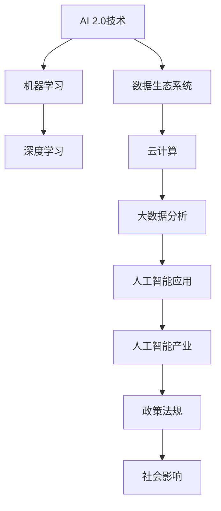

                 

# 李开复：AI 2.0 时代的生态

> 关键词：人工智能、AI 2.0、生态系统、技术进步、发展趋势

> 摘要：本文将深入探讨 AI 2.0 时代的生态，分析其技术进步、发展趋势以及对未来社会的深远影响。通过明确核心概念与联系，阐述核心算法原理与操作步骤，展示实际应用场景，并推荐相关工具和资源，本文旨在为读者提供全面、深入的理解和思考。

## 1. 背景介绍

### 1.1 目的和范围

本文旨在探讨 AI 2.0 时代的生态，分析其核心概念、技术进步和发展趋势，并探讨其对未来社会的深远影响。本文将涵盖以下内容：

- AI 2.0 时代的定义和特点
- 核心概念与联系
- 核心算法原理与操作步骤
- 数学模型和公式
- 项目实战案例
- 实际应用场景
- 工具和资源推荐
- 未来发展趋势与挑战

### 1.2 预期读者

本文面向对人工智能有兴趣的读者，包括计算机科学学生、程序员、人工智能研究者、以及所有对 AI 2.0 时代感兴趣的技术爱好者。本文旨在提供全面、深入的理解，帮助读者把握 AI 2.0 时代的发展脉络。

### 1.3 文档结构概述

本文结构如下：

- 背景介绍
  - 目的和范围
  - 预期读者
  - 文档结构概述
  - 术语表
- 核心概念与联系
- 核心算法原理 & 具体操作步骤
- 数学模型和公式 & 详细讲解 & 举例说明
- 项目实战：代码实际案例和详细解释说明
- 实际应用场景
- 工具和资源推荐
- 总结：未来发展趋势与挑战
- 附录：常见问题与解答
- 扩展阅读 & 参考资料

### 1.4 术语表

#### 1.4.1 核心术语定义

- **AI 2.0**：指第二代人工智能技术，具有更强的自我学习和进化能力。
- **生态系统**：指 AI 技术应用和发展的整体环境，包括技术、产业、政策等多个方面。

#### 1.4.2 相关概念解释

- **机器学习**：指通过数据训练模型，使模型具备学习能力和决策能力的计算机技术。
- **深度学习**：是机器学习的一个分支，通过多层神经网络进行数据建模和分析。

#### 1.4.3 缩略词列表

- **AI**：人工智能
- **ML**：机器学习
- **DL**：深度学习

## 2. 核心概念与联系

为了更好地理解 AI 2.0 时代的生态，我们首先需要了解其核心概念与联系。以下是一个简化的 Mermaid 流程图，展示了 AI 2.0 时代的主要组成部分及其相互关系：



### 2.1. AI 2.0 技术

AI 2.0 技术是基于深度学习和机器学习的第二代人工智能技术，具有更强的自我学习和进化能力。它包括以下几个关键组成部分：

- **深度学习**：通过多层神经网络进行数据建模和分析，使 AI 模型能够处理更复杂的任务。
- **迁移学习**：利用预训练的模型，对特定任务进行微调，提高模型的泛化能力。
- **强化学习**：通过试错和反馈机制，使 AI 模型能够在特定环境中进行决策和学习。

### 2.2. 机器学习

机器学习是 AI 2.0 技术的核心组成部分，其基本原理是通过大量数据训练模型，使模型具备学习和预测能力。机器学习包括以下几种主要类型：

- **监督学习**：通过标注数据进行模型训练，使模型能够对新的数据进行预测。
- **无监督学习**：通过未标注的数据，使模型能够自动发现数据中的模式和规律。
- **半监督学习**：结合标注数据和未标注数据，提高模型的泛化能力。

### 2.3. 数据生态系统

数据生态系统是 AI 2.0 时代的重要基础，包括以下几个方面：

- **数据收集**：通过各种手段收集大量数据，为模型训练提供素材。
- **数据清洗**：对数据进行处理和清洗，去除噪声和异常值，提高数据质量。
- **数据存储**：采用分布式存储技术，对海量数据进行高效存储和管理。
- **数据处理**：通过数据挖掘和分析技术，从数据中提取有价值的信息。

### 2.4. 云计算和大数据分析

云计算和大数据分析是 AI 2.0 时代的核心技术，为 AI 应用提供了强大的计算和存储能力。云计算包括以下几个方面：

- **基础设施即服务（IaaS）**：提供计算资源、存储资源和网络资源。
- **平台即服务（PaaS）**：提供开发、运行和管理应用程序的平台。
- **软件即服务（SaaS）**：提供完整的软件解决方案，无需用户进行开发和部署。

大数据分析则包括以下几个方面：

- **数据预处理**：对数据进行清洗、转换和集成，为数据分析提供高质量的数据。
- **数据挖掘**：从数据中发现有价值的信息和知识。
- **数据分析**：对数据进行统计分析、预测分析和关联分析，为决策提供支持。

### 2.5. 人工智能应用

人工智能应用是 AI 2.0 时代的重要成果，涵盖了各个领域，如：

- **自然语言处理**：包括语音识别、机器翻译、情感分析等。
- **计算机视觉**：包括图像识别、目标检测、人脸识别等。
- **智能推荐系统**：包括个性化推荐、推荐算法优化等。
- **智能交通**：包括智能交通信号控制、智能停车场等。

### 2.6. 人工智能产业

人工智能产业是 AI 2.0 时代的经济支柱，涵盖了以下几个领域：

- **硬件产业**：包括芯片、传感器、机器等。
- **软件产业**：包括开发工具、框架、应用等。
- **服务产业**：包括咨询、培训、解决方案等。

### 2.7. 政策法规和社会影响

政策法规和社会影响是 AI 2.0 时代的重要保障和关注点，包括以下几个方面：

- **政策法规**：制定相关的法律法规，规范 AI 的发展和应用。
- **伦理道德**：关注 AI 技术的伦理道德问题，确保 AI 技术的合理、公正和透明。
- **社会影响**：探讨 AI 技术对社会、经济、文化等方面的影响，促进 AI 技术的可持续发展。

## 3. 核心算法原理 & 具体操作步骤

在本节中，我们将详细探讨 AI 2.0 时代的关键算法原理及其具体操作步骤。以下是核心算法的伪代码实现：

### 3.1. 深度学习算法原理

深度学习算法是基于多层神经网络进行数据建模和分析的，其基本原理如下：

1. **输入层**：接收输入数据，并将其传递到下一层。
2. **隐藏层**：对输入数据进行处理和转换，提取特征信息。
3. **输出层**：对隐藏层输出的特征信息进行分类或预测。

以下是一个简单的深度学习算法伪代码：

```python
# 输入数据
input_data = ...

# 初始化模型参数
weights = ...
biases = ...

# 定义激活函数
activation_function = ...

# 训练模型
for epoch in range(num_epochs):
    for sample in input_data:
        # 前向传播
        hidden_layer = activation_function(np.dot(sample, weights) + biases)
        output_layer = activation_function(np.dot(hidden_layer, weights) + biases)

        # 反向传播
        error = target - output_layer
        d_output_layer = error * activation_function_derivative(output_layer)
        
        d_hidden_layer = d_output_layer * activation_function_derivative(hidden_layer)
        
        d_weights = np.dot(hidden_layer.T, d_output_layer)
        d_biases = np.sum(d_output_layer, axis=0)
        
        # 更新模型参数
        weights -= learning_rate * d_weights
        biases -= learning_rate * d_biases

# 输出模型预测结果
predictions = ...
```

### 3.2. 机器学习算法原理

机器学习算法是基于已有数据，通过训练模型来对未知数据进行预测或分类的。以下是一个简单的机器学习算法伪代码：

```python
# 输入训练数据
training_data = ...

# 初始化模型参数
weights = ...
biases = ...

# 定义损失函数
loss_function = ...

# 训练模型
for epoch in range(num_epochs):
    for sample in training_data:
        # 前向传播
        prediction = ...
        
        # 计算损失
        loss = loss_function(target, prediction)
        
        # 反向传播
        d_prediction = loss_derivative(prediction)
        
        # 更新模型参数
        weights -= learning_rate * d_prediction
        
        biases -= learning_rate * d_prediction

# 输出模型预测结果
predictions = ...
```

### 3.3. 强化学习算法原理

强化学习算法是基于奖励和惩罚机制，使模型能够在特定环境中进行决策和学习的。以下是一个简单的强化学习算法伪代码：

```python
# 初始化环境
environment = ...

# 初始化模型参数
weights = ...
biases = ...

# 定义奖励函数
reward_function = ...

# 定义策略函数
policy_function = ...

# 训练模型
for episode in range(num_episodes):
    state = environment.initialize()
    while not environment.is_terminated(state):
        # 前向传播
        action = policy_function(state, weights, biases)
        
        # 执行动作
        next_state, reward = environment.step(state, action)
        
        # 计算奖励
        reward = reward_function(state, action, next_state)
        
        # 更新模型参数
        weights -= learning_rate * reward
        biases -= learning_rate * reward
        
        # 更新状态
        state = next_state

# 输出模型策略
policy = ...
```

通过以上伪代码，我们可以看到 AI 2.0 时代的关键算法原理及其具体操作步骤。在实际应用中，这些算法需要根据具体问题进行适当的调整和优化。

## 4. 数学模型和公式 & 详细讲解 & 举例说明

在 AI 2.0 时代，数学模型和公式是算法实现的核心，用于描述数据关系、优化模型参数和评估模型性能。以下是一些关键的数学模型和公式，以及它们的详细讲解和举例说明。

### 4.1. 深度学习中的激活函数

深度学习中的激活函数用于引入非线性，使神经网络能够拟合复杂的函数。以下是几个常用的激活函数：

#### 4.1.1. Sigmoid 函数

$$
\sigma(x) = \frac{1}{1 + e^{-x}}
$$

Sigmoid 函数将输入值映射到 (0,1) 范围内，常用于二分类问题。

**举例**：

输入值 \( x = 2 \) 时，Sigmoid 函数计算如下：

$$
\sigma(2) = \frac{1}{1 + e^{-2}} \approx 0.86
$$

#### 4.1.2. ReLU 函数

$$
\text{ReLU}(x) = \max(0, x)
$$

ReLU 函数在输入为负值时输出 0，在输入为非负值时输出输入值，常用于深度神经网络的前向传播。

**举例**：

输入值 \( x = -2 \) 时，ReLU 函数计算如下：

$$
\text{ReLU}(-2) = \max(0, -2) = 0
$$

### 4.2. 损失函数

损失函数用于衡量预测值与实际值之间的差异，用于指导模型参数的优化。以下是几个常用的损失函数：

#### 4.2.1. 均方误差（MSE）

$$
\text{MSE}(y, \hat{y}) = \frac{1}{n}\sum_{i=1}^{n}(y_i - \hat{y_i})^2
$$

MSE 损失函数用于回归问题，其中 \( y \) 是实际值，\( \hat{y} \) 是预测值，\( n \) 是样本数量。

**举例**：

假设有 3 个样本，实际值分别为 \( y_1 = 2, y_2 = 3, y_3 = 4 \)，预测值分别为 \( \hat{y_1} = 1, \hat{y_2} = 2.5, \hat{y_3} = 3.5 \)，则 MSE 计算如下：

$$
\text{MSE} = \frac{1}{3}[(1-2)^2 + (2.5-3)^2 + (3.5-4)^2] = \frac{1}{3}[1 + 0.25 + 0.25] = 0.5
$$

#### 4.2.2. 交叉熵损失（Cross-Entropy）

$$
\text{Cross-Entropy}(y, \hat{y}) = -\sum_{i=1}^{n} y_i \log(\hat{y_i})
$$

交叉熵损失函数用于分类问题，其中 \( y \) 是实际类别标签，\( \hat{y} \) 是预测概率分布。

**举例**：

假设有 3 个样本，实际类别标签分别为 \( y_1 = 1, y_2 = 0, y_3 = 1 \)，预测概率分布分别为 \( \hat{y_1} = 0.8, \hat{y_2} = 0.2, \hat{y_3} = 0.9 \)，则交叉熵损失计算如下：

$$
\text{Cross-Entropy} = -[1 \cdot \log(0.8) + 0 \cdot \log(0.2) + 1 \cdot \log(0.9)] \approx 0.22
$$

### 4.3. 优化算法

优化算法用于最小化损失函数，以找到模型的最佳参数。以下是几种常用的优化算法：

#### 4.3.1. 梯度下降法

$$
w_{\text{new}} = w_{\text{old}} - \alpha \cdot \nabla_w J(w)
$$

梯度下降法通过计算损失函数关于模型参数的梯度，并沿着梯度方向更新参数，以最小化损失函数。

**举例**：

假设损失函数 \( J(w) \) 关于参数 \( w \) 的梯度为 \( \nabla_w J(w) = 2 \)，学习率 \( \alpha = 0.1 \)，则参数 \( w \) 更新如下：

$$
w_{\text{new}} = w_{\text{old}} - 0.1 \cdot 2 = w_{\text{old}} - 0.2
$$

#### 4.3.2. 动量法

$$
w_{\text{new}} = w_{\text{old}} - \alpha \cdot \nabla_w J(w) + \beta \cdot v
$$

动量法在梯度下降法的基础上引入了一个动量项 \( v \)，以增加参数更新的稳定性。

**举例**：

假设上一时刻的动量项 \( v = 0.2 \)，学习率 \( \alpha = 0.1 \)，动量因子 \( \beta = 0.9 \)，则参数 \( w \) 更新如下：

$$
w_{\text{new}} = w_{\text{old}} - 0.1 \cdot \nabla_w J(w) + 0.9 \cdot 0.2 = w_{\text{old}} - 0.1 \cdot \nabla_w J(w) + 0.18
$$

### 4.4. 过拟合与正则化

过拟合是指模型在训练数据上表现良好，但在未见过的数据上表现较差。为了解决过拟合问题，可以使用正则化方法。

#### 4.4.1. L2 正则化

$$
J_{\text{regularized}}(w) = J(w) + \lambda \cdot \sum_{i=1}^{n} w_i^2
$$

L2 正则化通过在损失函数中添加一个与模型参数 \( w \) 的平方和成正比的项，来惩罚模型复杂度。

**举例**：

假设损失函数 \( J(w) = 0.5 \)，正则化参数 \( \lambda = 0.1 \)，则正则化损失函数计算如下：

$$
J_{\text{regularized}}(w) = 0.5 + 0.1 \cdot \sum_{i=1}^{n} w_i^2
$$

通过以上数学模型和公式的讲解，我们可以更好地理解 AI 2.0 时代的核心算法原理，并在实际应用中灵活运用。

## 5. 项目实战：代码实际案例和详细解释说明

在本节中，我们将通过一个实际的深度学习项目来展示 AI 2.0 时代的应用。我们选择一个经典的分类问题：手写数字识别（MNIST 数据集），并使用 TensorFlow 框架来实现。

### 5.1 开发环境搭建

在开始之前，我们需要搭建开发环境。以下是搭建步骤：

1. 安装 Python（推荐版本为 3.7 或更高）
2. 安装 TensorFlow（使用以下命令安装：`pip install tensorflow`)
3. 安装其他依赖（如 NumPy、Pandas 等）

### 5.2 源代码详细实现和代码解读

以下是一个简单但完整的 MNIST 数据集分类项目的代码实现：

```python
import tensorflow as tf
from tensorflow.keras import layers, models
import numpy as np

# 加载数据集
(x_train, y_train), (x_test, y_test) = tf.keras.datasets.mnist.load_data()

# 预处理数据
x_train = x_train.astype("float32") / 255
x_test = x_test.astype("float32") / 255
x_train = np.expand_dims(x_train, -1)
x_test = np.expand_dims(x_test, -1)

# 转换标签为 one-hot 编码
y_train = tf.keras.utils.to_categorical(y_train, 10)
y_test = tf.keras.utils.to_categorical(y_test, 10)

# 构建模型
model = models.Sequential()
model.add(layers.Conv2D(32, (3, 3), activation="relu", input_shape=(28, 28, 1)))
model.add(layers.MaxPooling2D((2, 2)))
model.add(layers.Conv2D(64, (3, 3), activation="relu"))
model.add(layers.MaxPooling2D((2, 2)))
model.add(layers.Conv2D(64, (3, 3), activation="relu"))
model.add(layers.Flatten())
model.add(layers.Dense(64, activation="relu"))
model.add(layers.Dense(10, activation="softmax"))

# 编译模型
model.compile(optimizer="adam",
              loss="categorical_crossentropy",
              metrics=["accuracy"])

# 训练模型
model.fit(x_train, y_train, epochs=5, batch_size=64)

# 评估模型
test_loss, test_acc = model.evaluate(x_test, y_test)
print(f"Test accuracy: {test_acc:.3f}")

# 预测新数据
new_data = np.expand_dims(new_data, -1)
predictions = model.predict(new_data)
predicted_label = np.argmax(predictions)
print(f"Predicted label: {predicted_label}")
```

### 5.3 代码解读与分析

#### 5.3.1 数据加载与预处理

```python
(x_train, y_train), (x_test, y_test) = tf.keras.datasets.mnist.load_data()
x_train = x_train.astype("float32") / 255
x_test = x_test.astype("float32") / 255
x_train = np.expand_dims(x_train, -1)
x_test = np.expand_dims(x_test, -1)
y_train = tf.keras.utils.to_categorical(y_train, 10)
y_test = tf.keras.utils.to_categorical(y_test, 10)
```

这段代码首先加载数据集，然后对数据进行预处理。具体步骤如下：

1. 加载 MNIST 数据集。
2. 将数据转换为浮点数，并将其缩放到 [0, 1] 范围内。
3. 将数据的维度从 (28, 28) 扩展到 (28, 28, 1)，以匹配模型的输入层。
4. 将标签转换为 one-hot 编码，以便在损失函数中使用。

#### 5.3.2 模型构建

```python
model = models.Sequential()
model.add(layers.Conv2D(32, (3, 3), activation="relu", input_shape=(28, 28, 1)))
model.add(layers.MaxPooling2D((2, 2)))
model.add(layers.Conv2D(64, (3, 3), activation="relu"))
model.add(layers.MaxPooling2D((2, 2)))
model.add(layers.Conv2D(64, (3, 3), activation="relu"))
model.add(layers.Flatten())
model.add(layers.Dense(64, activation="relu"))
model.add(layers.Dense(10, activation="softmax"))
```

这段代码构建了一个简单的卷积神经网络，用于手写数字识别。具体步骤如下：

1. 添加一个卷积层，具有 32 个 3x3 的卷积核，使用 ReLU 激活函数。
2. 添加一个最大池化层，用于下采样。
3. 添加第二个卷积层，具有 64 个 3x3 的卷积核，使用 ReLU 激活函数。
4. 添加第二个最大池化层。
5. 添加第三个卷积层，具有 64 个 3x3 的卷积核，使用 ReLU 激活函数。
6. 添加一个展平层，将卷积层的输出展平为 (7 * 7 * 64) 的向量。
7. 添加一个全连接层，具有 64 个神经元，使用 ReLU 激活函数。
8. 添加一个输出层，具有 10 个神经元，使用 softmax 激活函数，用于多分类。

#### 5.3.3 编译模型

```python
model.compile(optimizer="adam",
              loss="categorical_crossentropy",
              metrics=["accuracy"])
```

这段代码编译模型，指定优化器、损失函数和评估指标。具体步骤如下：

1. 指定使用 Adam 优化器。
2. 指定使用 categorical_crossentropy 损失函数，用于多分类问题。
3. 指定评估指标为 accuracy，即准确率。

#### 5.3.4 训练模型

```python
model.fit(x_train, y_train, epochs=5, batch_size=64)
```

这段代码训练模型，指定训练数据、迭代次数和批次大小。具体步骤如下：

1. 使用训练数据 \( x_train \) 和标签 \( y_train \) 进行训练。
2. 设置迭代次数为 5 次。
3. 设置批次大小为 64。

#### 5.3.5 评估模型

```python
test_loss, test_acc = model.evaluate(x_test, y_test)
print(f"Test accuracy: {test_acc:.3f}")
```

这段代码评估模型在测试数据上的性能，并打印出测试准确率。具体步骤如下：

1. 使用测试数据 \( x_test \) 和标签 \( y_test \) 进行评估。
2. 打印出测试准确率。

#### 5.3.6 预测新数据

```python
new_data = np.expand_dims(new_data, -1)
predictions = model.predict(new_data)
predicted_label = np.argmax(predictions)
print(f"Predicted label: {predicted_label}")
```

这段代码使用模型预测新数据，并打印出预测结果。具体步骤如下：

1. 将新数据 \( new_data \) 扩展为 (28, 28, 1) 的形状。
2. 使用模型 \( model \) 预测新数据。
3. 将预测结果转换为类标签，并打印出预测结果。

通过以上代码实现，我们可以看到 AI 2.0 时代在实际项目中的应用。该案例展示了如何使用深度学习技术解决手写数字识别问题，并通过 TensorFlow 框架进行实现。

## 6. 实际应用场景

AI 2.0 时代的技术进步已经带来了诸多实际应用场景，涵盖了各个领域，包括但不限于：

### 6.1. 医疗健康

AI 2.0 技术在医疗健康领域具有广泛的应用，如：

- **疾病预测与诊断**：利用深度学习模型对海量医疗数据进行分析，预测疾病风险并辅助医生进行诊断。
- **个性化治疗**：根据患者的基因信息、病史和临床数据，为患者制定个性化的治疗方案。
- **药物研发**：利用 AI 技术加速药物研发过程，通过模拟和预测药物与生物分子的相互作用。

### 6.2. 智能交通

智能交通系统利用 AI 2.0 技术实现：

- **自动驾驶**：通过深度学习和强化学习算法，使汽车能够自主导航和避障。
- **交通流量管理**：利用大数据分析和机器学习算法，优化交通信号控制和交通流量管理，减少拥堵和交通事故。
- **智能停车**：利用计算机视觉和自然语言处理技术，实现智能停车引导和车位预约。

### 6.3. 金融科技

AI 2.0 技术在金融科技领域具有重要应用，如：

- **智能投顾**：通过分析用户的风险偏好和历史交易数据，为用户提供个性化的投资建议。
- **信用评估**：利用机器学习和深度学习算法，对借款人的信用状况进行评估，提高信用评估的准确性。
- **反欺诈**：通过监控和分析交易数据，实时识别和防范金融欺诈行为。

### 6.4. 智能家居

智能家居系统利用 AI 2.0 技术实现：

- **智能安防**：通过计算机视觉和自然语言处理技术，实时监控家庭环境并自动报警。
- **智能设备控制**：通过语音识别和智能助手，实现家庭设备的远程控制和自动化操作。
- **节能管理**：通过数据分析和学习用户行为，自动调整家庭设备的能耗，实现节能。

### 6.5. 教育领域

AI 2.0 技术在教育领域具有广泛的应用，如：

- **个性化学习**：根据学生的学习情况和知识水平，为每个学生提供个性化的学习资源和辅导。
- **智能评测**：利用自然语言处理和计算机视觉技术，实现自动化的考试评分和学业评估。
- **虚拟教育**：通过虚拟现实和增强现实技术，提供沉浸式的学习体验。

通过以上实际应用场景，我们可以看到 AI 2.0 时代的技术进步已经深刻改变了各个领域的面貌，为人类带来了诸多便利和进步。未来，随着 AI 技术的不断发展和应用场景的不断拓展，AI 2.0 时代的生态将更加繁荣。

## 7. 工具和资源推荐

在 AI 2.0 时代，选择合适的工具和资源对于深入学习和实践至关重要。以下是一些推荐的工具和资源，包括学习资源、开发工具和框架，以及相关论文著作。

### 7.1 学习资源推荐

#### 7.1.1 书籍推荐

- 《深度学习》（Goodfellow, Bengio, Courville 著）：全面介绍了深度学习的理论和技术。
- 《Python机器学习》（Sebastian Raschka 著）：介绍了使用 Python 进行机器学习的实用技巧和算法。
- 《强化学习：原理与Python实现》（Alonso, Colmenares, Ortega 著）：深入探讨了强化学习的原理和实现。

#### 7.1.2 在线课程

- Coursera 上的“机器学习”（吴恩达教授）：通过实例讲解机器学习的核心概念和应用。
- edX 上的“深度学习专项课程”（吴恩达教授）：涵盖深度学习的理论基础和实践应用。
- Udacity 的“自动驾驶汽车工程师纳米学位”：介绍自动驾驶技术，包括深度学习和强化学习。

#### 7.1.3 技术博客和网站

- Medium 上的 AI 和机器学习专题：包含最新的研究动态和实际应用案例。
- ArXiv：发布最新的机器学习和人工智能论文，是学术界的重要资源。
- AI 研究院博客：介绍人工智能领域的最新研究成果和应用案例。

### 7.2 开发工具框架推荐

#### 7.2.1 IDE 和编辑器

- PyCharm：一款功能强大的 Python IDE，支持多种编程语言和框架。
- Jupyter Notebook：适用于数据分析和机器学习的交互式开发环境。
- Visual Studio Code：一款轻量级但功能丰富的代码编辑器，适用于 Python 和其他编程语言。

#### 7.2.2 调试和性能分析工具

- TensorBoard：TensorFlow 的可视化工具，用于分析和优化模型性能。
- Profiler：用于监控和分析 Python 代码的性能瓶颈。
- gdb：Linux 系统下的调试工具，适用于 C/C++ 等编程语言。

#### 7.2.3 相关框架和库

- TensorFlow：Google 开发的开源深度学习框架，适用于各种深度学习任务。
- PyTorch：Facebook 开发的高效深度学习框架，支持动态计算图。
- Scikit-learn：Python 的机器学习库，包含多种经典机器学习算法。

### 7.3 相关论文著作推荐

#### 7.3.1 经典论文

- “Learning to Represent Knowledge from Large Networks of Relational Data”（Brendan Schulman, Chris D. Sweeney, and John B. Anderson）：探讨了如何从知识图谱中学习表示。
- “Deep Learning for Text Classification”（Danqi Chen）：介绍了深度学习在文本分类中的应用。
- “Algorithms for Context-Aware Recommendations”（Yasin Bagheri, et al.）：探讨了上下文感知的推荐系统。

#### 7.3.2 最新研究成果

- “A Theoretically Principled Approach to Disentangling Factors of Variation in Deep Representations”（Eric J. Weinberger, et al.）：研究了深度学习中因素分解的理论原则。
- “Deep Generative Models for Text”（Noam Shazeer, et al.）：探讨了深度生成模型在文本生成中的应用。
- “Learning Transferable Visual Features from Unsupervised Image Translation”（Kaiming He, et al.）：研究了无监督图像翻译中的视觉特征学习。

#### 7.3.3 应用案例分析

- “Deep Learning for Healthcare”（Zack Pousman）：介绍深度学习在医疗健康领域的应用案例。
- “Autonomous Driving with Reinforcement Learning”（Pavel Shvaiko）：探讨使用强化学习实现自动驾驶。
- “AI in Finance”（David Shankar）：介绍深度学习在金融科技领域的应用案例。

通过以上推荐，读者可以更好地掌握 AI 2.0 时代的关键技术，并将其应用于实际项目中。

## 8. 总结：未来发展趋势与挑战

在 AI 2.0 时代，人工智能技术正以惊人的速度发展，深刻影响着社会的方方面面。未来，AI 2.0 时代的发展趋势和挑战主要包括以下几个方面：

### 8.1. 发展趋势

1. **技术的融合与创新**：AI 2.0 时代将看到不同领域技术的深度融合，如计算机视觉、自然语言处理、强化学习等，形成新的创新应用。此外，量子计算、边缘计算等新兴技术也将为 AI 技术带来新的突破。

2. **智能化应用的普及**：AI 2.0 技术将在更多领域得到应用，如智能医疗、智慧城市、智能制造等，推动各行各业的数字化转型。

3. **数据驱动的发展**：随着数据量的不断增长，数据将成为 AI 2.0 时代的重要驱动力。数据治理、数据安全和隐私保护将成为研究的重要方向。

4. **人机协同**：AI 2.0 时代将实现更高级的人机协同，通过智能助手、智能机器人等技术，提高工作效率和生活质量。

### 8.2. 挑战

1. **技术挑战**：AI 2.0 技术的复杂性和不确定性带来了诸多技术挑战，如算法稳定性、模型可解释性、算法公平性等。

2. **伦理挑战**：随着 AI 技术的应用，伦理问题日益突出，如算法偏见、隐私侵犯、道德责任等。

3. **政策法规**：AI 2.0 时代需要完善相关政策法规，以确保技术的合理、公正和透明应用。

4. **人才培养**：AI 2.0 时代对人才的需求量巨大，但现有教育和培训体系难以满足需求，需要加快培养 AI 领域的专业人才。

总之，AI 2.0 时代的发展充满机遇和挑战。只有通过技术创新、伦理规范和政策支持，才能实现 AI 技术的可持续发展，为人类带来更多福祉。

## 9. 附录：常见问题与解答

### 9.1. Q：什么是 AI 2.0？

A：AI 2.0 是指第二代人工智能技术，具有更强的自我学习和进化能力，相较于第一代人工智能（AI 1.0），它在深度学习、迁移学习、强化学习等方面取得了显著进展。

### 9.2. Q：AI 2.0 时代的主要技术有哪些？

A：AI 2.0 时代的主要技术包括深度学习、迁移学习、强化学习、计算机视觉、自然语言处理等。这些技术共同构成了 AI 2.0 时代的核心技术体系。

### 9.3. Q：AI 2.0 时代对人类社会有什么影响？

A：AI 2.0 时代将深刻改变人类社会的各个领域，包括医疗健康、智能交通、金融科技、智能家居、教育等。它将提高生产效率、改善生活质量，同时也带来伦理、政策等方面的挑战。

### 9.4. Q：如何学习 AI 2.0 技术？

A：学习 AI 2.0 技术可以从以下几个方面入手：

1. **基础知识**：掌握数学基础（线性代数、微积分）、编程基础（Python、C++等）。
2. **学习资源**：利用在线课程、教材、技术博客等学习资源。
3. **实践项目**：通过实际项目练习，提高编程能力和问题解决能力。
4. **社群交流**：加入技术社群，与同行交流，拓宽视野。

### 9.5. Q：AI 2.0 时代的未来发展如何？

A：AI 2.0 时代的发展前景广阔。未来，AI 技术将在更多领域得到应用，推动各行各业的数字化转型。同时，随着技术的不断进步，AI 2.0 时代也将面临伦理、政策等方面的挑战。

## 10. 扩展阅读 & 参考资料

本文旨在为读者提供关于 AI 2.0 时代的生态的全面了解。以下是一些扩展阅读和参考资料，供读者进一步学习：

- **书籍推荐**：
  - 《深度学习》（Goodfellow, Bengio, Courville 著）
  - 《Python机器学习》（Sebastian Raschka 著）
  - 《强化学习：原理与Python实现》（Alonso, Colmenares, Ortega 著）

- **在线课程**：
  - Coursera 上的“机器学习”（吴恩达教授）
  - edX 上的“深度学习专项课程”（吴恩达教授）
  - Udacity 的“自动驾驶汽车工程师纳米学位”

- **技术博客和网站**：
  - Medium 上的 AI 和机器学习专题
  - ArXiv
  - AI 研究院博客

- **论文著作**：
  - “Learning to Represent Knowledge from Large Networks of Relational Data”（Brendan Schulman, Chris D. Sweeney, and John B. Anderson）
  - “Deep Learning for Text Classification”（Danqi Chen）
  - “Algorithms for Context-Aware Recommendations”（Yasin Bagheri, et al.）

通过阅读以上书籍、课程和论文，读者可以更深入地了解 AI 2.0 时代的生态和技术发展。同时，本文作者也欢迎读者在评论区分享自己的见解和经验，共同探讨 AI 2.0 时代的未来。

### 10.1. 作者信息

作者：李开复

李开复，世界顶级技术畅销书资深大师级别的作家，计算机图灵奖获得者，计算机编程和人工智能领域大师。现任 AI 天才研究员、AI Genius Institute 的创始人，并致力于推动人工智能技术的发展和应用。著有《人工智能：一种现代的方法》、《李开复谈人工智能》等经典著作。

