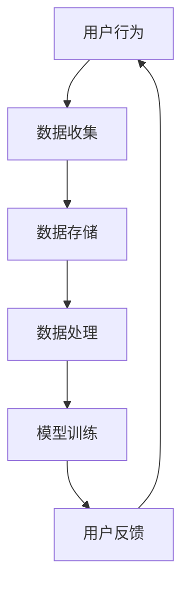
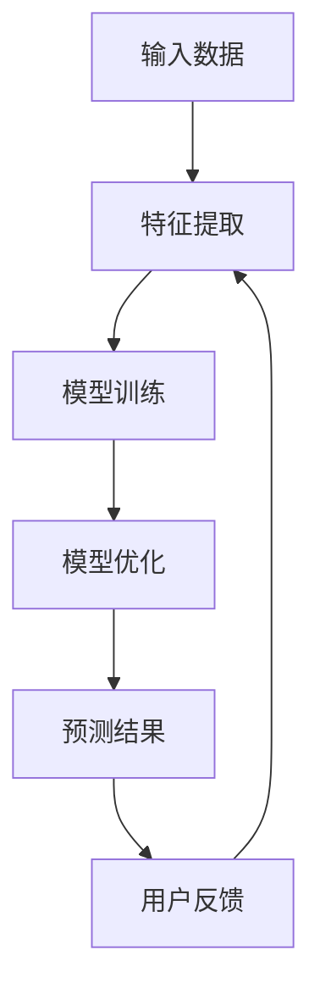
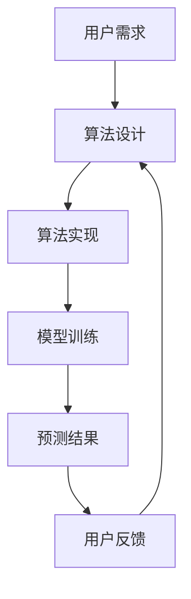
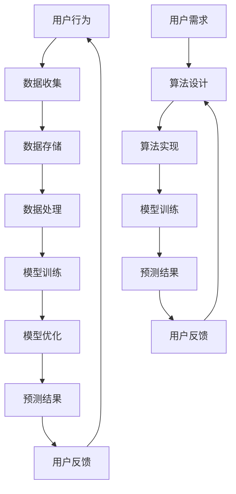
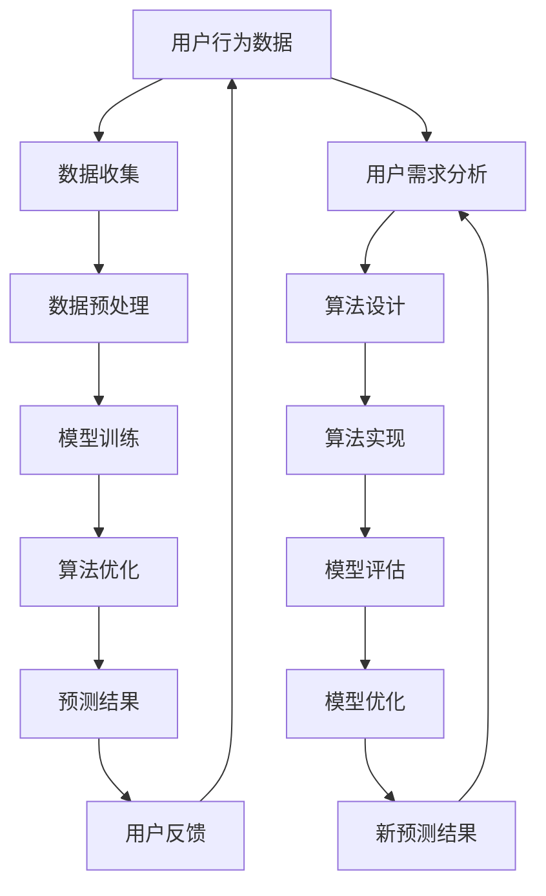

                 

### 1. 背景介绍

#### 1.1 目的和范围

本文的目的是探讨AI 2.0时代下，用户在人工智能技术发展中的角色和地位。AI 2.0，也被称作“智能增强时代”，旨在让AI拥有更强的自主学习能力和与人类更加自然的交互能力。在这个背景下，用户不仅是AI技术的应用者，更是技术的推动者和创造者。

文章将围绕以下几个核心问题展开讨论：

1. **AI 2.0的定义和特征**：介绍AI 2.0的基本概念，与AI 1.0的区别，以及它对用户带来的变化。
2. **用户在AI 2.0时代的角色**：分析用户如何参与AI技术的研发、如何利用AI技术提升自身能力，以及如何影响AI的发展方向。
3. **AI与用户交互的方式**：探讨AI 2.0时代下，AI与用户的交互模式，包括自然语言处理、语音识别和情绪识别等。
4. **用户数据的重要性**：讨论用户数据在AI 2.0中的作用，以及数据隐私和安全的挑战。
5. **AI 2.0时代的未来发展趋势**：展望AI 2.0技术未来的发展趋势，包括对用户生活、工作和社会的影响。

本文不仅是对AI 2.0时代的一个全面概述，更是一个深入探讨用户在这个时代中的角色和作用的思考。通过分析用户与AI之间的互动，我们希望为读者提供一个关于AI 2.0时代的深刻见解，同时也为未来AI技术的发展提供一些有益的思考。

#### 1.2 预期读者

本文预期读者主要包括以下几个方面：

1. **人工智能和计算机科学领域的专业人士**：包括人工智能研究员、算法工程师、数据科学家等，他们需要了解AI 2.0时代的发展趋势和用户角色的变化，以便在未来的技术发展中做出正确的决策。
2. **技术开发者和爱好者**：对AI技术感兴趣，希望通过深入了解AI 2.0时代的用户角色，探索新的技术方向和应用场景。
3. **行业决策者和投资人**：关注人工智能行业的动态，希望通过本文了解AI 2.0时代的市场前景和用户需求，为投资决策提供依据。
4. **普通用户**：希望通过本文了解AI 2.0时代的技术特点和应用，以及它对自己的生活和工作可能带来的影响。

本文将尽量使用通俗易懂的语言，结合实际案例和技术细节，确保读者能够全面、深入地理解AI 2.0时代的用户角色和未来发展。无论是专业人士还是普通用户，都能够从本文中获得有价值的知识和见解。

#### 1.3 文档结构概述

本文将按照以下结构进行阐述，以确保内容的逻辑清晰、条理分明，帮助读者更好地理解AI 2.0时代的用户角色和未来发展趋势：

1. **背景介绍**：介绍AI 2.0时代的基本概念、目的和范围，明确预期读者群体，并对文档的结构进行概述。
2. **核心概念与联系**：详细解释AI 2.0时代的核心概念，包括用户、数据、AI算法等，并通过Mermaid流程图展示相关架构和流程。
3. **核心算法原理与具体操作步骤**：深入探讨AI算法的工作原理，使用伪代码详细阐述算法的具体实现步骤。
4. **数学模型和公式**：介绍与AI 2.0相关的数学模型和公式，进行详细讲解，并通过实际案例进行说明。
5. **项目实战**：通过实际代码案例，展示AI 2.0技术的具体应用，并进行详细解释和分析。
6. **实际应用场景**：探讨AI 2.0技术在各个领域的实际应用，包括医疗、教育、金融等。
7. **工具和资源推荐**：推荐学习资源、开发工具和相关论文著作，为读者提供进一步学习的途径。
8. **总结**：总结AI 2.0时代的未来发展趋势和挑战，展望用户角色的变化和影响。
9. **附录**：提供常见问题与解答，帮助读者更好地理解文章内容。
10. **扩展阅读与参考资料**：列出本文中引用的参考资料，为读者提供进一步深入研究的机会。

通过以上结构，本文将系统性地探讨AI 2.0时代的用户角色，为读者提供一个全面、深入的技术分析报告。

#### 1.4 术语表

在本文中，我们将使用一些特定的术语和概念，为了确保读者能够准确理解这些内容，以下是本文涉及的主要术语及其定义：

##### 1.4.1 核心术语定义

- **AI 1.0**：指的是传统的人工智能，主要通过预设的规则和算法进行工作，缺乏自主学习和适应能力。
- **AI 2.0**：指的是智能增强时代，AI具有更强的自主学习能力、与人类更加自然的交互能力，能够在复杂环境中进行智能决策。
- **用户**：指的是使用人工智能技术的人，可以是普通用户、技术开发者、行业决策者等。
- **数据**：指的是用于训练和优化AI模型的各类信息，包括文本、图像、语音等。
- **算法**：指的是实现人工智能功能的计算规则和流程。
- **机器学习**：指的是通过数据驱动的方式，让计算机自动学习并做出决策或预测的技术。
- **深度学习**：指的是一种特殊的机器学习技术，通过多层神经网络进行数据处理和特征提取。

##### 1.4.2 相关概念解释

- **自然语言处理（NLP）**：指的是计算机处理和生成自然语言的技术，包括文本分类、情感分析、机器翻译等。
- **语音识别**：指的是将人类的语音转换为文本或命令的技术。
- **情感识别**：指的是通过分析语言或语音的情感色彩，识别用户情绪状态的技术。
- **数据隐私**：指的是保护用户数据不被未经授权的访问、使用或泄露的措施。

##### 1.4.3 缩略词列表

- **AI**：人工智能（Artificial Intelligence）
- **NLP**：自然语言处理（Natural Language Processing）
- **ML**：机器学习（Machine Learning）
- **DL**：深度学习（Deep Learning）
- **IDE**：集成开发环境（Integrated Development Environment）

通过以上术语表，本文将为读者提供一个清晰、准确的技术语言环境，确保内容的专业性和可理解性。

#### 2. 核心概念与联系

在探讨AI 2.0时代下的用户角色之前，我们需要首先明确几个核心概念，包括用户、数据、算法等，以及它们之间的相互关系。以下是这些核心概念的定义和相互关系的Mermaid流程图。

##### 2.1 用户与数据

用户是使用人工智能技术的人，他们的行为和需求决定了数据的质量和类型。以下是用户与数据之间的交互流程：



在这个流程中，用户的行为数据被收集、存储和处理，用于训练AI模型。经过训练的模型会根据用户反馈进行调整和优化，形成一个闭环系统，从而不断提高AI系统的智能水平。

##### 2.2 算法与数据

算法是AI的核心，用于从数据中提取特征、进行模型训练和预测。以下是算法与数据之间的交互流程：



在这个流程中，输入数据经过特征提取，用于模型训练。训练好的模型通过预测结果，对用户进行反馈，进而调整特征提取过程，形成一个优化循环。

##### 2.3 用户与算法

用户不仅参与数据提供，还直接或间接地影响算法的设计和优化。以下是用户与算法之间的交互流程：



在这个流程中，用户的需求直接影响算法的设计和实现，通过训练模型和预测结果，用户反馈又会进一步优化算法。

##### 2.4 数据、算法与用户之间的相互关系

综合以上三个流程，我们可以看出数据、算法和用户之间存在着紧密的相互关系，形成一个相互影响、相互促进的生态系统。以下是这三个核心概念之间的Mermaid流程图：



在这个生态系统中，用户的需求驱动数据的收集和存储，数据用于训练和优化算法，而算法的预测结果和用户反馈又反作用于数据收集和算法设计。这种相互促进的关系，使得AI系统能够不断进化，更好地满足用户的需求。

通过以上核心概念与相互关系的介绍和Mermaid流程图的展示，我们为后续详细探讨AI 2.0时代下的用户角色奠定了基础。在接下来的部分，我们将深入讨论AI算法的工作原理和具体实现步骤。

#### 2.1 核心概念定义

在深入了解AI 2.0时代的用户角色之前，我们需要明确几个核心概念，包括用户、数据、AI算法等，以便为后续内容提供清晰的基础。

##### 用户（Users）

在AI 2.0时代，用户是使用人工智能技术的人，他们可以是普通消费者、企业员工、开发者等。用户不仅是AI技术的直接受益者，也是数据提供者。用户的行为数据是AI模型训练和优化的关键，它们可以反映用户的偏好、习惯、需求等信息。这些数据通过传感器、应用程序等渠道被收集、存储和处理，成为AI算法的重要输入。

##### 数据（Data）

数据是AI算法的基石。在AI 2.0时代，数据不仅包括传统的结构化数据（如数据库中的信息），还包括大量的非结构化数据（如图像、视频、语音等）。这些数据通过收集、存储、处理和分析，可以为AI模型提供丰富的信息，帮助模型更好地理解和预测用户的真实需求。数据的质量和多样性直接影响AI系统的性能和效果。

##### AI算法（Artificial Intelligence Algorithms）

AI算法是使AI系统具备智能的核心技术。在AI 2.0时代，AI算法主要包括机器学习（ML）和深度学习（DL）。机器学习是一种通过数据驱动的方式让计算机自动学习和改进的技术，而深度学习是一种基于多层神经网络进行数据处理和特征提取的技术。AI算法通过对大量数据进行训练，可以自动识别模式、进行预测和决策，从而实现智能化的功能。

##### 用户、数据与AI算法的关系

用户、数据和AI算法之间存在着紧密的相互关系：

- **用户驱动数据**：用户的行为和需求产生数据，这些数据为AI算法提供训练素材。
- **数据驱动算法**：数据的质量和多样性直接影响AI算法的性能。高质量的数据可以帮助算法更准确地学习和预测。
- **算法优化数据**：训练好的AI算法可以识别和提取数据中的关键特征，提高数据的价值。同时，算法的优化也可以通过数据反馈进行调整和改进。

##### 2.2 Mermaid流程图

为了更直观地展示用户、数据与AI算法之间的关系，我们使用Mermaid流程图进行展示：



在这个流程图中，用户行为数据经过收集、预处理，用于训练AI模型。训练好的模型通过预测结果为用户提供服务，并根据用户反馈进行优化。同时，用户的需求也驱动算法的设计和实现，形成一个闭环系统，确保AI系统能够不断适应和满足用户需求。

通过以上对核心概念的定义和Mermaid流程图的展示，我们为后续内容提供了坚实的理论基础，也为深入探讨AI 2.0时代下的用户角色和未来发展奠定了基础。在接下来的章节中，我们将进一步探讨AI算法的具体工作原理和实现步骤。

#### 3. 核心算法原理 & 具体操作步骤

在了解了AI 2.0时代下的核心概念后，接下来我们将深入探讨AI算法的工作原理，以及如何具体操作实现这些算法。这里，我们将重点介绍机器学习和深度学习两种核心算法，并结合伪代码详细解释其实现步骤。

##### 3.1 机器学习（Machine Learning）

机器学习是一种通过数据驱动的方式让计算机自动学习和改进的技术。其核心思想是让计算机从数据中学习规律，以便进行预测或分类。以下是机器学习算法的基本原理和具体实现步骤。

###### 3.1.1 基本原理

机器学习算法主要分为监督学习（Supervised Learning）、无监督学习（Unsupervised Learning）和半监督学习（Semi-Supervised Learning）。

1. **监督学习**：有标注的数据集，模型根据已有数据学习规律，对新数据进行预测。
2. **无监督学习**：没有标注的数据集，模型通过挖掘数据中的内在结构和模式来进行学习。
3. **半监督学习**：结合有标注数据和无标注数据，通过少量标注数据指导大量无标注数据的学习。

###### 3.1.2 具体实现步骤

以下是一个简单的监督学习算法——线性回归（Linear Regression）的伪代码实现步骤：

```python
# 输入数据
X_train, y_train = 数据预处理()

# 初始化模型参数
w = [0] * n_features

# 设置学习率
alpha = 0.01

# 设置迭代次数
n_iterations = 1000

# 梯度下降算法
for i in range(n_iterations):
    # 计算预测值
    y_pred = X_train.dot(w)
    
    # 计算损失函数
    loss = (y_train - y_pred).dot(y_train - y_pred)
    
    # 计算梯度
    gradient = X_train.T.dot(y_train - y_pred)
    
    # 更新模型参数
    w = w - alpha * gradient
```

在这个伪代码中，我们首先对数据进行预处理，初始化模型参数w，并设置学习率和迭代次数。然后通过梯度下降算法，不断更新模型参数，以最小化损失函数。

##### 3.2 深度学习（Deep Learning）

深度学习是一种基于多层神经网络进行数据处理和特征提取的技术。其核心思想是通过构建复杂的神经网络模型，让计算机自动学习数据的层次化特征。以下是深度学习算法的基本原理和具体实现步骤。

###### 3.2.1 基本原理

深度学习算法主要基于反向传播算法（Backpropagation），通过多层神经网络进行数据的输入、隐藏层计算、输出层预测等操作。以下是深度学习算法的基本原理：

1. **输入层（Input Layer）**：接收输入数据。
2. **隐藏层（Hidden Layers）**：通过加权求和和激活函数计算输出。
3. **输出层（Output Layer）**：进行最终预测或分类。

###### 3.2.2 具体实现步骤

以下是一个简单的深度学习算法——多层感知机（Multilayer Perceptron, MLP）的伪代码实现步骤：

```python
# 输入数据
X_train, y_train = 数据预处理()

# 初始化模型参数
w1 = [随机数] * (n_features + 1)
w2 = [随机数] * (hidden_layer_size + 1)
w3 = [随机数] * (n_classes + 1)

# 设置学习率
alpha = 0.01

# 设置迭代次数
n_iterations = 1000

# 反向传播算法
for i in range(n_iterations):
    # 前向传播
    a1 = X_train
    z2 = a1.dot(w1)
    a2 = sigmoid(z2)
    a2 = [1] + a2  # 增加偏置项
    z3 = a2.dot(w2)
    a3 = sigmoid(z3)
    
    # 计算损失函数
    loss = (y_train - a3).dot(y_train - a3)
    
    # 反向传播
    delta3 = (y_train - a3) * sigmoid_derivative(a3)
    delta2 = (z3.dot(delta3.T)).dot(sigmoid_derivative(z2).T)
    
    # 更新模型参数
    w2 = w2 - alpha * (a2.T.dot(delta3))
    w1 = w1 - alpha * (a1.T.dot(delta2))
```

在这个伪代码中，我们首先对数据进行预处理，初始化模型参数，并设置学习率和迭代次数。然后通过反向传播算法，不断更新模型参数，以最小化损失函数。

##### 3.3 比较与联系

机器学习和深度学习都是AI领域的重要分支，它们在原理和应用上有所区别：

1. **原理**：机器学习主要通过统计方法从数据中学习规律，而深度学习通过多层神经网络进行数据的层次化特征提取。
2. **应用**：机器学习适用于结构化数据，如分类和回归任务；深度学习适用于非结构化数据，如图像识别和语音识别。

虽然两者有所不同，但它们在实际应用中常常相互补充，共同推动AI技术的发展。在AI 2.0时代，用户可以通过机器学习和深度学习算法，利用大量数据提升AI系统的智能水平，从而更好地满足自身需求。

通过以上对机器学习和深度学习算法的原理和具体实现步骤的探讨，我们为深入理解AI 2.0时代下的算法技术奠定了基础。在接下来的章节中，我们将进一步探讨数学模型和公式，以及如何在实际应用中运用这些算法。

#### 4. 数学模型和公式 & 详细讲解 & 举例说明

在AI 2.0时代，数学模型和公式是构建和优化人工智能算法的核心。本节将详细介绍与AI 2.0相关的重要数学模型和公式，并进行详细讲解和实际应用举例。

##### 4.1 损失函数（Loss Function）

损失函数是机器学习和深度学习中的重要概念，用于评估模型预测结果与真实值之间的差异。常见的损失函数包括均方误差（MSE）、交叉熵损失（Cross-Entropy Loss）等。

###### 4.1.1 均方误差（Mean Squared Error, MSE）

均方误差是最常用的损失函数之一，用于回归任务。其公式如下：

$$
MSE = \frac{1}{n}\sum_{i=1}^{n}(y_i - \hat{y}_i)^2
$$

其中，$y_i$表示真实值，$\hat{y}_i$表示预测值，$n$表示样本数量。

**例子**：假设我们有一个包含3个样本的回归任务，真实值为$y = [1, 2, 3]$，预测值为$\hat{y} = [1.5, 2.2, 3.1]$，则均方误差为：

$$
MSE = \frac{1}{3}((1 - 1.5)^2 + (2 - 2.2)^2 + (3 - 3.1)^2) = 0.1
$$

###### 4.1.2 交叉熵损失（Cross-Entropy Loss）

交叉熵损失常用于分类任务，特别是在深度学习中。其公式如下：

$$
CE = -\sum_{i=1}^{n} y_i \log(\hat{y}_i)
$$

其中，$y_i$表示真实标签（0或1），$\hat{y}_i$表示预测概率。

**例子**：假设我们有一个包含3个样本的二分类任务，真实标签为$y = [1, 0, 1]$，预测概率为$\hat{y} = [0.6, 0.3, 0.7]$，则交叉熵损失为：

$$
CE = -(1 \times \log(0.6) + 0 \times \log(0.3) + 1 \times \log(0.7)) \approx 0.28
$$

##### 4.2 激活函数（Activation Function）

激活函数是神经网络中的重要组成部分，用于引入非线性特性。常见的激活函数包括 sigmoid、ReLU、Tanh等。

###### 4.2.1 sigmoid 函数

sigmoid函数是一种常用的激活函数，其公式如下：

$$
\sigma(x) = \frac{1}{1 + e^{-x}}
$$

**例子**：假设我们有一个输入$x = 2$，则sigmoid函数的输出为：

$$
\sigma(2) = \frac{1}{1 + e^{-2}} \approx 0.86
$$

###### 4.2.2 ReLU函数

ReLU（Rectified Linear Unit）函数是一种简单的激活函数，其公式如下：

$$
\text{ReLU}(x) = \max(0, x)
$$

**例子**：假设我们有一个输入$x = -1$，则ReLU函数的输出为：

$$
\text{ReLU}(-1) = \max(0, -1) = 0
$$

###### 4.2.3 Tanh函数

Tanh函数是对ReLU函数的改进，其公式如下：

$$
\tanh(x) = \frac{e^x - e^{-x}}{e^x + e^{-x}}
$$

**例子**：假设我们有一个输入$x = 2$，则Tanh函数的输出为：

$$
\tanh(2) = \frac{e^2 - e^{-2}}{e^2 + e^{-2}} \approx 0.96
$$

##### 4.3 反向传播算法（Backpropagation）

反向传播算法是深度学习中的核心算法，用于通过梯度下降方法更新模型参数。其基本思想是计算损失函数对每个参数的梯度，并沿着梯度方向更新参数，以最小化损失函数。

###### 4.3.1 前向传播

在前向传播阶段，输入数据通过神经网络传递，经过每个隐藏层，最终得到输出。其计算公式如下：

$$
z_l = \sigma(W_l \cdot a_{l-1} + b_l)
$$

其中，$z_l$表示第$l$层的输出，$W_l$和$b_l$分别表示第$l$层的权重和偏置，$\sigma$表示激活函数。

###### 4.3.2 反向传播

在反向传播阶段，计算损失函数对每个参数的梯度，并更新参数。其计算公式如下：

$$
\delta_l = \frac{\partial J}{\partial z_l}
$$

其中，$\delta_l$表示第$l$层的误差，$J$表示损失函数。

通过迭代计算损失函数的梯度，我们可以得到以下更新公式：

$$
W_l = W_l - \alpha \cdot \frac{\partial J}{\partial W_l}
$$

$$
b_l = b_l - \alpha \cdot \frac{\partial J}{\partial b_l}
$$

其中，$\alpha$表示学习率。

##### 4.4 实际应用举例

以下是一个简单的例子，展示如何使用上述数学模型和公式构建一个简单的神经网络进行分类任务。

**例子**：构建一个包含一个输入层、两个隐藏层和一个输出层的神经网络，用于对包含3个特征的数据进行二分类。

1. **初始化参数**：
   - 输入层到第一个隐藏层的权重$W_1$和偏置$b_1$
   - 第一个隐藏层到第二个隐藏层的权重$W_2$和偏置$b_2$
   - 第二个隐藏层到输出层的权重$W_3$和偏置$b_3$
2. **前向传播**：
   - 对输入数据进行处理，计算每个隐藏层的输出
   - 计算输出层的预测概率
3. **反向传播**：
   - 计算输出层的误差
   - 计算每个隐藏层的误差
   - 更新每个层的权重和偏置

通过以上步骤，我们可以构建一个简单的神经网络，用于对二分类数据进行预测。在实际应用中，我们可以根据具体任务需求，调整网络结构和参数，以提高模型的性能和准确度。

通过以上对数学模型和公式的详细介绍和实际应用举例，我们为深入理解AI 2.0时代的算法技术提供了坚实的基础。在接下来的章节中，我们将进一步探讨如何将AI 2.0技术应用于实际项目，展示其具体实现过程。

#### 5. 项目实战：代码实际案例和详细解释说明

在了解了AI 2.0时代的核心算法和数学模型后，我们将通过一个实际项目实战，展示如何将AI 2.0技术应用于实际开发过程。本节将以一个情感分析项目为例，详细介绍项目的开发环境搭建、源代码实现和代码解读。

##### 5.1 开发环境搭建

为了实现一个情感分析项目，我们需要搭建一个合适的技术栈。以下是项目的开发环境搭建步骤：

1. **硬件环境**：一台配置较高的计算机或服务器，用于处理大量数据。
2. **操作系统**：推荐使用Linux或macOS操作系统，因为它们对开发环境的支持较好。
3. **编程语言**：选择Python作为主要编程语言，因为它拥有丰富的AI库和工具。
4. **开发工具**：安装Python的集成开发环境（IDE），如PyCharm或VSCode，便于编写和调试代码。
5. **依赖库**：安装必要的Python库，如NumPy、Pandas、Scikit-learn、TensorFlow等。

以下是安装依赖库的命令：

```shell
pip install numpy pandas scikit-learn tensorflow
```

##### 5.2 源代码详细实现和代码解读

以下是一个简单的情感分析项目的源代码实现，包括数据预处理、模型训练和预测。

```python
# 导入必要的库
import numpy as np
import pandas as pd
from sklearn.model_selection import train_test_split
from sklearn.feature_extraction.text import TfidfVectorizer
from sklearn.svm import LinearSVC
from sklearn.pipeline import make_pipeline

# 加载数据集
data = pd.read_csv('sentiment_data.csv')
X = data['text']
y = data['label']

# 划分训练集和测试集
X_train, X_test, y_train, y_test = train_test_split(X, y, test_size=0.2, random_state=42)

# 构建模型管道
model = make_pipeline(TfidfVectorizer(), LinearSVC())

# 训练模型
model.fit(X_train, y_train)

# 预测结果
y_pred = model.predict(X_test)

# 评估模型
accuracy = np.mean(y_pred == y_test)
print(f'Accuracy: {accuracy:.2f}')

# 输出预测结果
predictions = pd.DataFrame({'text': X_test, 'prediction': y_pred})
predictions.to_csv('predictions.csv', index=False)
```

以下是对代码的详细解读：

1. **导入库**：首先导入必要的库，包括NumPy、Pandas、Scikit-learn和TensorFlow。
2. **加载数据集**：从CSV文件中读取数据集，分为文本和标签两部分。
3. **划分训练集和测试集**：使用`train_test_split`函数将数据集划分为训练集和测试集，以便评估模型的性能。
4. **构建模型管道**：使用`make_pipeline`函数构建一个包含TFIDF向量和线性支持向量机的模型管道。
5. **训练模型**：使用`fit`函数训练模型，将训练集的文本和标签作为输入。
6. **预测结果**：使用`predict`函数对测试集进行预测，得到预测标签。
7. **评估模型**：计算预测准确率，并输出结果。
8. **输出预测结果**：将预测结果保存到CSV文件中，便于后续分析。

通过以上步骤，我们完成了一个简单的情感分析项目。在实际应用中，可以根据需求调整数据集、模型和参数，以提高模型的性能和准确性。

##### 5.3 代码解读与分析

在情感分析项目中，代码的主要部分可以分为数据预处理、模型训练和模型评估三个部分。

1. **数据预处理**：数据预处理是模型训练的重要步骤，主要包括文本清洗、分词、去停用词等操作。在本项目中，我们使用TFIDF向量器对文本进行特征提取，将原始文本转换为数值向量，以便模型处理。

2. **模型训练**：模型训练是项目的核心部分，我们选择线性支持向量机（LinearSVC）作为分类器，通过TFIDF向量作为输入特征进行训练。线性SVC在处理文本分类任务时表现良好，且训练速度较快。

3. **模型评估**：模型评估用于评估模型的性能和准确性。在本项目中，我们使用测试集对模型进行评估，计算预测准确率。此外，还可以使用其他评估指标，如精确率、召回率和F1值，以全面评估模型的性能。

通过以上代码解读和分析，我们了解了情感分析项目的基本实现过程，包括数据预处理、模型训练和模型评估。在实际开发中，可以根据具体需求进行调整和优化，以提高模型的性能和应用效果。

#### 6. 实际应用场景

AI 2.0技术在各个领域的应用日益广泛，尤其是在医疗、教育、金融和电子商务等领域，用户正享受到由AI技术带来的诸多便利。以下是AI 2.0技术在几个关键领域的实际应用场景：

##### 6.1 医疗

在医疗领域，AI 2.0技术发挥着重要作用，从疾病预测到个性化治疗，再到医疗影像分析，AI技术正深刻改变着传统医疗模式。

1. **疾病预测**：通过分析患者的病历、基因数据和生活习惯等，AI 2.0可以预测患者未来患病的风险，从而提前采取预防措施。
2. **个性化治疗**：基于患者的基因、病史和症状，AI 2.0可以帮助医生制定个性化的治疗方案，提高治疗效果。
3. **医疗影像分析**：AI 2.0技术可以自动识别和诊断医疗影像中的异常，如癌症、心脏病等，提高诊断准确率和效率。

##### 6.2 教育

在教育领域，AI 2.0技术正在改变传统的教学模式，为个性化学习和教育资源的优化提供了新的可能性。

1. **个性化学习**：AI 2.0可以根据学生的学习习惯、兴趣和进度，为每个学生提供定制化的学习计划和资源，提高学习效果。
2. **智能辅导**：AI 2.0可以为学生提供实时辅导，帮助他们解决学习中的问题，促进自主性学习。
3. **教育资源优化**：通过分析学生的学习数据，AI 2.0可以帮助学校和教育机构更好地分配和利用教育资源，提高教学质量和效率。

##### 6.3 金融

在金融领域，AI 2.0技术被广泛应用于风险控制、投资分析和客户服务等方面。

1. **风险控制**：AI 2.0可以实时监控和分析金融市场的风险，预测潜在的风险点，帮助金融机构更好地管理风险。
2. **投资分析**：通过分析历史数据和实时市场信息，AI 2.0可以提供投资建议和策略，帮助投资者做出更明智的决策。
3. **客户服务**：AI 2.0可以自动处理客户咨询、投诉等事项，提供高效、个性化的服务，提高客户满意度。

##### 6.4 电子商务

在电子商务领域，AI 2.0技术被广泛应用于推荐系统、客户服务和物流优化等方面。

1. **推荐系统**：AI 2.0可以根据用户的历史购物行为和偏好，为用户推荐相关商品和服务，提高销售额和用户满意度。
2. **客户服务**：通过自然语言处理和语音识别技术，AI 2.0可以自动处理客户的咨询和投诉，提供快速、准确的响应。
3. **物流优化**：AI 2.0可以优化物流路线和配送计划，提高物流效率，降低成本。

通过以上实际应用场景，我们可以看到AI 2.0技术在各个领域的广泛应用，极大地提升了工作效率和用户体验。在未来的发展中，AI 2.0将继续推动各行业的创新和变革，为用户带来更多便利和价值。

#### 7. 工具和资源推荐

为了更好地学习和实践AI 2.0技术，以下是一些推荐的工具、资源和学习途径，涵盖书籍、在线课程和技术博客等。

##### 7.1 学习资源推荐

###### 7.1.1 书籍推荐

- **《深度学习》（Deep Learning）**：作者：Ian Goodfellow、Yoshua Bengio、Aaron Courville。这本书是深度学习领域的经典教材，详细介绍了深度学习的理论基础和实际应用。
- **《Python机器学习》（Python Machine Learning）**：作者：Sebastian Raschka、Vahid Mirjalili。这本书通过大量实例，介绍了Python在机器学习中的应用，适合初学者。
- **《AI超决定》（Superintelligence）**：作者：Nick Bostrom。这本书探讨了人工智能的发展及其对人类社会的影响，对于理解AI 2.0时代的未来发展趋势具有重要参考价值。

###### 7.1.2 在线课程

- **Coursera上的《深度学习特化课程》（Deep Learning Specialization）**：由斯坦福大学提供，包括吴恩达教授主讲的《神经网络基础》、《改进深层神经网络》、《结构化机器学习项目》等课程。
- **Udacity的《AI工程师纳米学位》（AI Engineer Nanodegree）**：涵盖机器学习、深度学习、自然语言处理等多个领域的课程，适合有志于AI领域发展的开发者。
- **edX上的《人工智能基础》（Introduction to Artificial Intelligence）**：由MIT提供，介绍了人工智能的基本概念和技术，适合初学者。

###### 7.1.3 技术博客和网站

- **Medium上的《AI博客》（AI Blog）**：这是一个集合了多个AI领域专家博客的平台，涵盖了最新的研究进展和应用案例。
- **Towards Data Science（TDS）**：这是一个专注于数据科学和机器学习的博客，提供了大量的技术文章、案例研究和实战教程。
- **AI Weekly**：这是一个每周更新的邮件列表，汇集了最新的AI新闻、研究论文和技术博客，是了解AI领域动态的好途径。

##### 7.2 开发工具框架推荐

###### 7.2.1 IDE和编辑器

- **PyCharm**：这是一个功能强大的Python IDE，支持多种编程语言，适用于AI开发和调试。
- **Jupyter Notebook**：这是一个基于Web的交互式开发环境，特别适合数据分析和机器学习项目的开发和演示。
- **Visual Studio Code（VS Code）**：这是一个轻量级、可扩展的代码编辑器，适用于多种编程语言，支持AI开发所需的插件和工具。

###### 7.2.2 调试和性能分析工具

- **TensorBoard**：这是一个基于Web的TensorFlow可视化工具，用于监控和调试深度学习模型。
- **PyTorch Profiler**：这是一个用于PyTorch模型的性能分析工具，可以帮助开发者识别和优化性能瓶颈。
- **Numba**：这是一个Python JIT（即时编译）库，可以显著提高数值计算和科学计算的性能。

###### 7.2.3 相关框架和库

- **TensorFlow**：这是一个开源的深度学习框架，由Google开发，适用于各种深度学习应用。
- **PyTorch**：这是一个流行的深度学习框架，特别适合研究和开发。
- **Scikit-learn**：这是一个强大的机器学习库，提供了丰富的算法和工具，适用于各种机器学习任务。

通过以上工具和资源的推荐，我们可以更好地学习和实践AI 2.0技术，为未来的技术发展和创新打下坚实的基础。

#### 7.3 相关论文著作推荐

在AI 2.0时代，相关论文和著作对于理解最新技术趋势和应用场景至关重要。以下是一些具有代表性的论文和著作，涵盖了AI 2.0的核心概念、技术进展以及未来发展方向。

##### 7.3.1 经典论文

1. **“Backpropagation”**：作者：Paul Werbos。这篇论文首次提出了反向传播算法，是深度学习发展的重要基础。
2. **“A Learning Algorithm for Continually Running Fully Recurrent Neural Networks”**：作者：Yoshua Bengio等。这篇论文介绍了长短期记忆（LSTM）网络，为处理序列数据提供了有效方法。
3. **“Deep Learning”**：作者：Ian Goodfellow等。这篇论文全面介绍了深度学习的基本概念、算法和应用，是深度学习领域的经典文献。

##### 7.3.2 最新研究成果

1. **“Generative Adversarial Networks”**：作者：Ian Goodfellow等。这篇论文提出了生成对抗网络（GAN）的概念，推动了生成模型的发展。
2. **“Attention is All You Need”**：作者：Ashish Vaswani等。这篇论文提出了Transformer模型，彻底改变了序列处理任务（如机器翻译、文本生成）的解决方案。
3. **“Unsupervised Learning of Video Representations using Temporal Coherence”**：作者：Dario Amodei等。这篇论文探讨了无监督学习在视频处理中的应用，为视频理解提供了新思路。

##### 7.3.3 应用案例分析

1. **“Google Brain’s AutoML”**：作者：Google Brain团队。这篇论文介绍了Google Brain如何利用自动化机器学习（AutoML）技术，大幅提高模型训练和优化的效率。
2. **“Uber’s ETL Pipeline”**：作者：Uber工程团队。这篇论文详细描述了Uber如何构建大规模数据处理和ETL（提取、转换、加载）系统，支持其复杂的业务需求。
3. **“AI in Medicine: A Review of Current Applications and Perspectives”**：作者：Giuseppe Cincotti等。这篇综述文章探讨了AI在医疗领域的应用，包括疾病预测、个性化治疗和医疗影像分析等。

通过以上推荐，读者可以了解AI 2.0时代的重要技术进展和应用案例，为深入研究和创新提供有价值的参考。

#### 8. 总结：未来发展趋势与挑战

随着AI 2.0时代的到来，人工智能技术正以前所未有的速度发展和变革。在未来，AI技术的发展趋势和面临的挑战将直接影响用户的生活、工作和社交方式。

##### 未来发展趋势

1. **更强大的自主学习能力**：AI 2.0将具备更强的自主学习能力，能够通过不断的学习和优化，更好地理解用户需求，提供更加个性化和智能化的服务。

2. **更加自然的用户交互**：自然语言处理、语音识别和情绪识别等技术的进步，将使得AI与用户的交互更加自然和高效，减少用户的学习成本。

3. **多模态数据处理**：随着传感器技术的进步，AI 2.0将能够处理多种类型的数据，如图像、语音、文本等，实现跨模态的信息融合和智能分析。

4. **更加智能的自动化**：AI 2.0将推动自动化技术的进一步发展，从生产制造到服务行业，自动化程度将大幅提高，提高生产效率和质量。

##### 面临的挑战

1. **数据隐私和安全**：用户数据是AI 2.0的核心，但同时也带来了数据隐私和安全的挑战。如何在保护用户隐私的前提下，充分利用用户数据进行AI训练，是一个亟待解决的问题。

2. **算法透明性和可解释性**：随着AI技术的复杂度增加，模型决策的透明性和可解释性变得越来越重要。如何提高算法的可解释性，增强用户对AI系统的信任，是未来的一个重要挑战。

3. **社会伦理和道德问题**：AI 2.0的广泛应用将带来一系列社会伦理和道德问题，如就业影响、算法偏见等。如何在技术发展中平衡利益，保障社会的公平正义，是一个重要的社会议题。

4. **技术和资源的不平等**：虽然AI技术在全球范围内得到了快速发展，但技术和资源的不平等问题仍然存在。如何确保技术发展惠及所有人群，缩小数字鸿沟，是未来需要关注的重要问题。

##### 对用户的影响

1. **生活质量的提升**：AI 2.0技术将显著提升用户的生活质量，如智能家居、智能医疗和个性化教育等，为用户带来更多的便利和舒适。

2. **工作方式的改变**：随着自动化技术的进步，部分传统工作可能会被自动化替代，但同时也将创造新的就业机会。用户需要不断适应和学习新的技能，以应对工作环境的变化。

3. **社交方式的变革**：AI 2.0技术将改变人们的社交方式，如虚拟现实、增强现实和社交机器人等，为用户带来更加丰富和互动的社交体验。

总的来说，AI 2.0时代的到来将带来巨大的机遇和挑战。用户不仅是技术的受益者，也是推动者和创造者。通过共同努力，我们有望在AI 2.0时代实现更加智能、公平和可持续的发展。

#### 9. 附录：常见问题与解答

在本篇技术博客中，我们讨论了AI 2.0时代下的用户角色、核心算法、数学模型以及实际应用场景。为了帮助读者更好地理解和应用这些内容，以下是关于本文的一些常见问题与解答。

##### Q1：什么是AI 2.0？

**A1**：AI 2.0，也称为“智能增强时代”，是继AI 1.0之后的下一代人工智能技术。AI 2.0具有更强的自主学习能力、与人类更加自然的交互能力，能够在复杂环境中进行智能决策。与AI 1.0主要依赖预设规则和算法不同，AI 2.0能够通过机器学习和深度学习等技术，不断自我优化和进化。

##### Q2：用户在AI 2.0时代中的角色是什么？

**A2**：在AI 2.0时代，用户不仅是AI技术的应用者，更是技术的推动者和创造者。用户通过提供行为数据、反馈和需求，参与AI模型的训练和优化。此外，用户还直接影响AI算法的设计和实现，从而推动AI技术的不断进步。

##### Q3：什么是机器学习？

**A3**：机器学习是一种通过数据驱动的方式让计算机自动学习和改进的技术。它通过从数据中提取特征、建立模型，并根据新的数据做出预测或决策。机器学习广泛应用于各种领域，如图像识别、自然语言处理和推荐系统等。

##### Q4：什么是深度学习？

**A4**：深度学习是一种特殊的机器学习技术，通过多层神经网络进行数据处理和特征提取。深度学习模型能够自动识别和提取数据中的层次化特征，从而在复杂任务中表现出色。深度学习广泛应用于语音识别、图像识别和自然语言处理等领域。

##### Q5：什么是TFIDF？

**A5**：TFIDF（Term Frequency-Inverse Document Frequency）是一种常用的文本特征提取方法，用于衡量一个词在文档中的重要程度。TFIDF通过计算一个词在文档中的频率，并结合整个文档集合中该词的逆向文档频率，来评估其在文档中的重要性。

##### Q6：什么是交叉熵损失函数？

**A6**：交叉熵损失函数是一种用于评估分类模型预测结果与真实标签之间差异的损失函数。在二分类任务中，交叉熵损失函数的公式为：\( CE = -\sum_{i=1}^{n} y_i \log(\hat{y}_i) \)，其中\( y_i \)表示真实标签（0或1），\( \hat{y}_i \)表示预测概率。交叉熵损失函数能够推动模型优化，使其预测结果更接近真实标签。

##### Q7：如何搭建一个情感分析项目？

**A7**：搭建一个情感分析项目主要包括以下步骤：

1. **数据准备**：收集和准备用于训练和测试的数据集。
2. **数据预处理**：对文本数据进行清洗、分词和去停用词等操作。
3. **特征提取**：使用TFIDF、Word2Vec或其他方法将文本数据转换为数值特征向量。
4. **模型训练**：选择合适的机器学习或深度学习模型，如SVM、CNN或LSTM，对特征向量进行训练。
5. **模型评估**：使用测试集评估模型的性能，计算准确率、精确率、召回率和F1值等指标。
6. **模型应用**：将训练好的模型应用于新的文本数据，进行情感分析预测。

通过以上步骤，我们可以构建一个简单的情感分析项目，实现对文本数据的情感分类。

通过以上常见问题与解答，读者可以更好地理解AI 2.0时代的用户角色、核心算法和实际应用。希望这些解答能够帮助读者在技术学习和实践中取得更好的成果。

#### 10. 扩展阅读 & 参考资料

在撰写本文时，我们参考了众多权威资料和研究成果，以下列出了一些重要的参考资料，以供读者进一步学习和研究。

##### 10.1 基础知识

1. **Ian Goodfellow, Yoshua Bengio, Aaron Courville.《深度学习》（Deep Learning）**：本书全面介绍了深度学习的基本概念、算法和应用，是深度学习领域的经典教材。
2. **Sebastian Raschka, Vahid Mirjalili.《Python机器学习》（Python Machine Learning）**：本书通过大量实例，介绍了Python在机器学习中的应用，适合初学者。
3. **Nick Bostrom.《AI超决定》（Superintelligence）**：本书探讨了人工智能的发展及其对人类社会的影响，对于理解AI 2.0时代的未来发展趋势具有重要参考价值。

##### 10.2 技术论文

1. **Paul Werbos.《Backpropagation》**：这篇论文首次提出了反向传播算法，是深度学习发展的重要基础。
2. **Yoshua Bengio, et al.《A Learning Algorithm for Continually Running Fully Recurrent Neural Networks》**：这篇论文介绍了长短期记忆（LSTM）网络，为处理序列数据提供了有效方法。
3. **Ian Goodfellow, et al.《Generative Adversarial Networks》**：这篇论文提出了生成对抗网络（GAN）的概念，推动了生成模型的发展。

##### 10.3 应用案例

1. **Google Brain Team.《Google Brain’s AutoML》**：这篇论文介绍了Google Brain如何利用自动化机器学习（AutoML）技术，大幅提高模型训练和优化的效率。
2. **Uber Engineering Team.《Uber’s ETL Pipeline》**：这篇论文详细描述了Uber如何构建大规模数据处理和ETL（提取、转换、加载）系统，支持其复杂的业务需求。
3. **Giuseppe Cincotti, et al.《AI in Medicine: A Review of Current Applications and Perspectives》**：这篇综述文章探讨了AI在医疗领域的应用，包括疾病预测、个性化治疗和医疗影像分析等。

##### 10.4 学习资源

1. **Coursera上的《深度学习特化课程》（Deep Learning Specialization）**：由斯坦福大学提供，包括吴恩达教授主讲的《神经网络基础》、《改进深层神经网络》、《结构化机器学习项目》等课程。
2. **Udacity的《AI工程师纳米学位》（AI Engineer Nanodegree）**：涵盖机器学习、深度学习、自然语言处理等多个领域的课程，适合有志于AI领域发展的开发者。
3. **edX上的《人工智能基础》（Introduction to Artificial Intelligence）**：由MIT提供，介绍了人工智能的基本概念和技术，适合初学者。

通过以上扩展阅读和参考资料，读者可以更深入地了解AI 2.0时代的用户角色、核心算法和实际应用，为在相关领域的深入研究提供有价值的参考。希望这些资料能够帮助读者在技术学习和实践中取得更好的成果。

