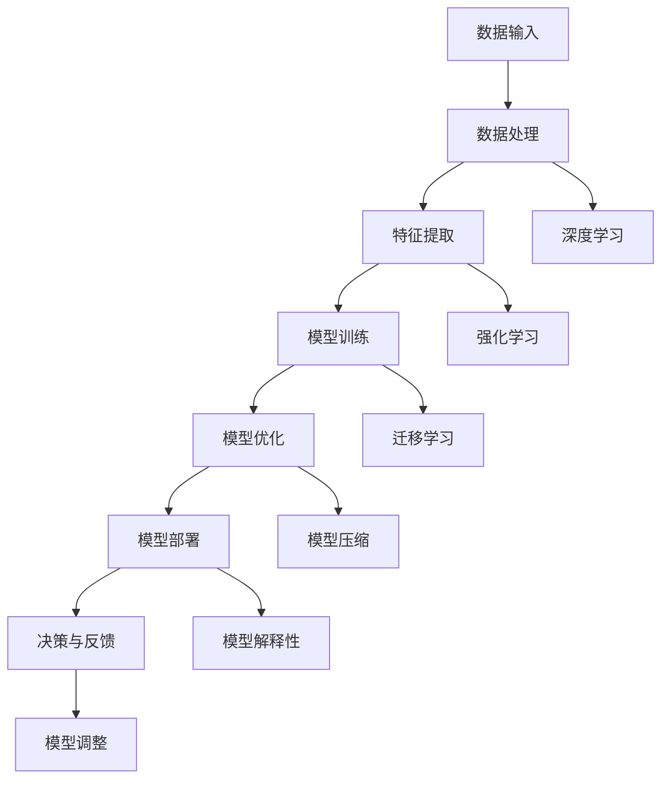

                 

### 1. 背景介绍

#### 1.1 目的和范围

本文旨在深入探讨AI 2.0时代的科技价值，分析其在各个领域的应用与变革。AI 2.0作为新一代的人工智能，不仅继承了传统AI的优势，还在算法、数据、模型等方面实现了显著的突破。本文将首先介绍AI 2.0的定义、特征及其与AI 1.0的区别，随后深入分析其在医疗、金融、教育等领域的应用，探讨其带来的技术进步和社会变革。此外，本文还将讨论AI 2.0面临的挑战和未来发展趋势。

#### 1.2 预期读者

本文适合对人工智能和科技发展感兴趣的读者，包括AI领域的从业者、研究人员、学生以及关注科技发展的公众。文章内容涉及AI 2.0的核心概念、应用场景以及未来趋势，希望能够为读者提供全面的了解和深入的思考。

#### 1.3 文档结构概述

本文将分为十个部分，包括：

1. 背景介绍
   - 1.1 目的和范围
   - 1.2 预期读者
   - 1.3 文档结构概述
   - 1.4 术语表
2. 核心概念与联系
   - 2.1 AI 2.0的定义与特征
   - 2.2 AI 2.0与AI 1.0的区别
   - 2.3 核心概念原理和架构的Mermaid流程图
3. 核心算法原理 & 具体操作步骤
   - 3.1 算法原理讲解
   - 3.2 具体操作步骤
4. 数学模型和公式 & 详细讲解 & 举例说明
   - 4.1 数学模型和公式
   - 4.2 详细讲解
   - 4.3 举例说明
5. 项目实战：代码实际案例和详细解释说明
   - 5.1 开发环境搭建
   - 5.2 源代码详细实现和代码解读
   - 5.3 代码解读与分析
6. 实际应用场景
   - 6.1 医疗领域
   - 6.2 金融领域
   - 6.3 教育领域
7. 工具和资源推荐
   - 7.1 学习资源推荐
   - 7.2 开发工具框架推荐
   - 7.3 相关论文著作推荐
8. 总结：未来发展趋势与挑战
9. 附录：常见问题与解答
10. 扩展阅读 & 参考资料

通过这样的结构安排，本文将帮助读者全面了解AI 2.0时代的科技价值，从理论到实践，深入探讨其背后的原理和实际应用。

#### 1.4 术语表

在本文中，我们将使用一些专业术语，以下是对这些术语的详细解释：

- **AI 1.0**：指代第一代人工智能，主要依赖于规则和预定义的算法，应用范围相对有限。
- **AI 2.0**：新一代的人工智能，强调数据的智能处理和自主学习能力，具有更广泛的应用前景。
- **机器学习**：一种基于数据训练模型，使计算机能够从数据中学习并做出预测或决策的技术。
- **深度学习**：机器学习的一种形式，通过构建多层神经网络，对复杂数据进行自动特征提取和建模。
- **神经网络**：一种模仿生物神经系统的计算模型，由大量相互连接的神经元组成。
- **强化学习**：一种通过试错和反馈机制来学习策略的机器学习方法。
- **自然语言处理（NLP）**：计算机科学领域中的一个分支，旨在使计算机能够理解、生成和处理人类语言。
- **计算机视觉**：使计算机能够理解和处理视觉信息的学科，包括图像识别、目标检测等。

通过这些术语的解释，读者可以更好地理解本文中涉及的技术概念和理论框架。接下来，我们将进一步探讨AI 2.0的定义和特征，以及它与AI 1.0之间的区别。

### 1.4.1 核心术语定义

在深入探讨AI 2.0时代的科技价值之前，有必要对一些核心术语进行定义，以确保读者能够准确理解后续内容。

**机器学习（Machine Learning）**：
机器学习是一种人工智能（AI）的分支，它通过构建能够从数据中自动学习并改进自身表现的算法。与传统的编程方式不同，机器学习算法不需要显式地编写规则，而是通过从大量数据中学习规律和模式，来预测或做出决策。

**深度学习（Deep Learning）**：
深度学习是机器学习的一个子领域，主要基于多层神经网络（Neural Networks）进行模型构建和训练。与传统的单层神经网络相比，深度学习模型通过多层非线性变换，能够更有效地提取数据中的特征和模式，从而实现更准确的学习和预测。

**神经网络（Neural Networks）**：
神经网络是一种模拟生物神经系统的计算模型，由大量相互连接的神经元组成。每个神经元接收来自其他神经元的输入信号，通过加权求和后，使用激活函数进行非线性变换，最终输出一个信号。神经网络通过不断调整其内部的权重和偏置，来学习和适应输入数据。

**强化学习（Reinforcement Learning）**：
强化学习是一种通过试错和反馈机制来学习策略的机器学习方法。与传统的监督学习和无监督学习不同，强化学习中的算法（通常被称为智能体）通过与环境的交互来学习最佳行为策略。智能体会根据其行为获得的奖励或惩罚来调整其策略，以最大化长期奖励。

**自然语言处理（NLP，Natural Language Processing）**：
自然语言处理是计算机科学和人工智能领域的一个分支，旨在使计算机能够理解、生成和处理人类语言。NLP涵盖了从文本分析到语音识别的广泛任务，包括分词、词性标注、句法分析、语义理解等。

**计算机视觉（Computer Vision）**：
计算机视觉是使计算机能够理解和处理视觉信息的学科。计算机视觉的任务包括图像识别、目标检测、图像分类、场景理解等。通过运用机器学习和深度学习技术，计算机视觉系统能够从图像中提取有用信息，并用于各种实际应用。

通过以上核心术语的定义，读者可以更好地理解本文中涉及的技术概念。在接下来的部分中，我们将进一步探讨AI 2.0的定义和特征，以及它与AI 1.0之间的区别。

### 1.4.2 相关概念解释

为了更全面地理解AI 2.0时代的科技价值，我们需要对一些相关的概念进行详细解释，包括**机器学习（Machine Learning）**、**深度学习（Deep Learning）**、**神经网络（Neural Networks）**、**强化学习（Reinforcement Learning）**和**自然语言处理（NLP）**。

**机器学习（Machine Learning）**：
机器学习是一种使计算机系统能够从数据中学习并做出预测或决策的技术。它依赖于统计学、概率论和优化理论，通过构建模型从历史数据中学习规律，并在新的数据上进行预测。机器学习分为监督学习（Supervised Learning）、无监督学习（Unsupervised Learning）和半监督学习（Semi-Supervised Learning）等类型。在监督学习中，模型通过已标记的训练数据学习，并在测试数据上评估其性能；无监督学习则从未标记的数据中学习，以发现数据中的模式和结构；半监督学习结合了标记数据和未标记数据，以提升模型的泛化能力。

**深度学习（Deep Learning）**：
深度学习是机器学习的一种形式，特别适用于处理复杂数据，如图像、音频和文本。它基于多层神经网络（Neural Networks），通过逐层提取数据中的特征，实现高层次的抽象表示。深度学习模型通过前向传播（Forward Propagation）和反向传播（Back Propagation）算法进行训练，不断调整模型参数以最小化损失函数。常见的深度学习模型包括卷积神经网络（CNN，Convolutional Neural Networks）、循环神经网络（RNN，Recurrent Neural Networks）和生成对抗网络（GAN，Generative Adversarial Networks）。

**神经网络（Neural Networks）**：
神经网络是一种模仿生物神经系统的计算模型，由大量相互连接的神经元组成。每个神经元接收来自其他神经元的输入信号，通过加权求和后，使用激活函数进行非线性变换，最终输出一个信号。神经网络通过不断调整其内部的权重和偏置，来学习和适应输入数据。神经网络的核心在于其能够自动从数据中学习特征，并在新的数据上进行泛化。

**强化学习（Reinforcement Learning）**：
强化学习是一种通过试错和反馈机制来学习策略的机器学习方法。在强化学习中，智能体（Agent）通过与环境的交互来学习最佳行为策略。智能体根据其行为获得的奖励或惩罚来调整其策略，以最大化长期奖励。强化学习在决策制定、游戏AI、机器人控制等领域具有广泛的应用。常见的强化学习算法包括Q学习（Q-Learning）、深度Q网络（DQN，Deep Q-Network）和策略梯度（Policy Gradient）等。

**自然语言处理（NLP，Natural Language Processing）**：
自然语言处理是计算机科学和人工智能领域的一个分支，旨在使计算机能够理解、生成和处理人类语言。NLP涵盖了从文本分析到语音识别的广泛任务，包括分词（Tokenization）、词性标注（Part-of-Speech Tagging）、句法分析（Parsing）、语义理解（Semantic Understanding）和情感分析（Sentiment Analysis）等。NLP在机器翻译、问答系统、文本摘要和智能客服等领域具有重要应用。

通过以上对相关概念的解释，读者可以更深入地理解AI 2.0的核心技术和原理。在接下来的部分中，我们将进一步探讨AI 2.0与AI 1.0之间的区别。

### 1.4.3 缩略词列表

在本文中，我们将使用一些常见的缩略词，以下是对这些缩略词的详细解释：

- **AI**：人工智能（Artificial Intelligence）
- **ML**：机器学习（Machine Learning）
- **DL**：深度学习（Deep Learning）
- **NLP**：自然语言处理（Natural Language Processing）
- **CV**：计算机视觉（Computer Vision）
- **RNN**：循环神经网络（Recurrent Neural Networks）
- **CNN**：卷积神经网络（Convolutional Neural Networks）
- **GAN**：生成对抗网络（Generative Adversarial Networks）
- **Q-Learning**：Q学习算法（Q-Learning Algorithm）
- **DQN**：深度Q网络（Deep Q-Network）
- **PG**：策略梯度（Policy Gradient）
- **GAN**：生成对抗网络（Generative Adversarial Networks）

通过这些缩略词的列表，读者可以更方便地理解本文中的专业术语和概念。在接下来的部分中，我们将进一步探讨AI 2.0与AI 1.0之间的区别，以及它们在技术、应用和影响力上的差异。

### 2. 核心概念与联系

#### 2.1 AI 2.0的定义与特征

AI 2.0，作为新一代的人工智能，不仅继承了AI 1.0的核心概念，还在算法、数据、模型等方面实现了显著的突破。AI 2.0的定义可以从以下几个方面进行阐述：

1. **更高级别的自动化与智能化**：AI 2.0强调更高级别的自动化和智能化，通过深度学习和强化学习等技术，使计算机能够从海量数据中自动提取特征，进行自我优化和决策。

2. **更广泛的应用领域**：AI 2.0的应用领域不再局限于传统的数据处理和预测，而是扩展到更广泛的领域，如自动驾驶、智能家居、智能制造等，实现了人工智能技术与实际场景的深度融合。

3. **更强的自主学习能力**：AI 2.0具有更强的自主学习能力，通过不断从数据中学习，能够不断优化和改进自身模型，实现更准确的预测和决策。

4. **更高的透明度和可解释性**：AI 2.0在模型透明度和可解释性方面取得了重要进展，通过引入可解释的人工智能（Explainable AI，XAI）技术，使得AI模型的决策过程更加透明，便于用户理解和信任。

#### 2.2 AI 2.0与AI 1.0的区别

AI 1.0主要依赖于基于规则的算法和简单的统计模型，其应用范围相对有限，主要集中在一些简单的数据处理和预测任务中。而AI 2.0在多个方面与AI 1.0存在显著的区别：

1. **算法层面**：
   - **AI 1.0**：主要采用基于规则的算法和简单的统计模型，如决策树、线性回归等。
   - **AI 2.0**：基于深度学习、强化学习等更复杂的算法，如卷积神经网络（CNN）、循环神经网络（RNN）、生成对抗网络（GAN）等。

2. **数据处理层面**：
   - **AI 1.0**：主要处理结构化数据，如数字、文本等。
   - **AI 2.0**：能够处理更复杂、非结构化的数据，如图像、音频、视频等。

3. **模型层面**：
   - **AI 1.0**：模型通常较小，参数量较少，计算效率较高。
   - **AI 2.0**：模型通常较大，参数量较多，计算效率较低，但能够实现更高的准确性和泛化能力。

4. **应用层面**：
   - **AI 1.0**：应用场景相对有限，主要集中在数据分析、预测等领域。
   - **AI 2.0**：应用场景更加广泛，包括自动驾驶、智能家居、医疗诊断、金融风控等。

#### 2.3 核心概念原理和架构的Mermaid流程图

为了更直观地展示AI 2.0的核心概念和架构，我们使用Mermaid流程图进行描述。以下是一个简化的Mermaid流程图，展示了AI 2.0的主要组成部分和它们之间的关系：



在这个流程图中，数据输入是AI 2.0的起点，通过数据处理和特征提取，将原始数据转换为适合模型训练的形式。模型训练阶段包括深度学习和强化学习等技术，模型优化和模型部署则分别关注模型的性能优化和实际应用。最后，通过决策与反馈机制，模型能够不断从实际应用中学习和调整，实现持续优化。

通过上述对AI 2.0的定义、特征及其与AI 1.0的区别的阐述，读者可以更深入地理解AI 2.0的技术原理和应用价值。在接下来的部分中，我们将进一步探讨AI 2.0的核心算法原理和具体操作步骤。

### 2.3 核心算法原理 & 具体操作步骤

#### 2.3.1 算法原理讲解

AI 2.0的核心算法包括深度学习、强化学习和迁移学习等。以下将详细讲解这些算法的基本原理。

1. **深度学习（Deep Learning）**

深度学习是一种基于多层神经网络（Neural Networks）的学习方法，通过逐层提取数据中的特征，实现高层次的抽象表示。其基本原理包括：

- **多层神经网络**：深度学习模型通常包含多个隐藏层，每个隐藏层都能够对输入数据进行特征提取和变换。通过多层的非线性变换，模型能够学习到更加复杂的特征和模式。
- **前向传播（Forward Propagation）**：在训练过程中，输入数据通过网络的前向传播，从输入层经过每个隐藏层，最终传递到输出层。在这个过程中，模型根据输入数据和已学习的权重，计算每个神经元的输出。
- **反向传播（Back Propagation）**：通过前向传播，模型得到输出结果，并与真实标签进行比较，计算损失函数（Loss Function）。随后，模型通过反向传播，将损失函数的梯度反向传播到每个神经元，更新模型参数。
- **优化算法**：深度学习模型通常使用梯度下降（Gradient Descent）或其变种（如Adam优化器）来更新模型参数，最小化损失函数。

2. **强化学习（Reinforcement Learning）**

强化学习是一种通过试错和反馈机制来学习策略的机器学习方法。其基本原理包括：

- **智能体（Agent）**：强化学习中的智能体是指执行动作并从环境中获取反馈的实体。
- **环境（Environment）**：环境是指智能体执行动作的场所，它为智能体提供状态和奖励。
- **状态（State）**：状态是智能体在某一时刻所处的情境。
- **动作（Action）**：动作是智能体根据当前状态选择的行为。
- **奖励（Reward）**：奖励是环境对智能体动作的反馈，用于评估动作的好坏。
- **策略（Policy）**：策略是智能体选择动作的规则，策略的不同会导致智能体在环境中表现出不同的行为。

3. **迁移学习（Transfer Learning）**

迁移学习是一种利用已经训练好的模型来加速新任务训练的方法。其基本原理包括：

- **预训练模型**：迁移学习使用在大量数据上预训练的模型，这些模型已经学习到了一些通用的特征表示。
- **微调（Fine-tuning）**：在新的任务中，预训练模型通常只需要进行少量的调整（如修改部分层的权重），即可适应新的任务。
- **知识转移**：通过迁移学习，预训练模型中的知识（即特征表示）被转移到新任务中，从而加速新任务的训练过程，并提高模型在新任务上的性能。

#### 2.3.2 具体操作步骤

以下是AI 2.0核心算法的具体操作步骤，包括数据准备、模型训练、模型优化和模型部署等。

1. **数据准备**

   - 数据收集：收集与任务相关的数据，如图像、文本、音频等。
   - 数据预处理：对数据进行清洗、归一化、增强等预处理操作，以提高模型的训练效果和泛化能力。

2. **模型训练**

   - 选择模型架构：根据任务需求，选择合适的深度学习模型架构，如CNN、RNN、GAN等。
   - 初始化参数：初始化模型参数，通常使用随机初始化或预训练模型。
   - 训练过程：使用训练数据对模型进行迭代训练，通过前向传播计算输出，使用反向传播更新参数，直至模型收敛。
   - 模型评估：在验证数据上评估模型性能，选择性能最佳的模型。

3. **模型优化**

   - 调整超参数：根据模型性能，调整学习率、批量大小、正则化参数等超参数。
   - 优化算法：使用优化算法（如Adam优化器）更新模型参数，以最小化损失函数。
   - 模型压缩：采用模型压缩技术（如剪枝、量化等），减小模型规模和计算复杂度。

4. **模型部署**

   - 模型部署：将训练好的模型部署到实际应用场景中，如自动驾驶、智能家居等。
   - 决策与反馈：通过实时数据，对模型进行动态调整和优化，以适应不断变化的应用场景。

通过以上具体操作步骤，读者可以了解AI 2.0核心算法的基本流程和应用。在接下来的部分中，我们将进一步探讨数学模型和公式，以及其在AI 2.0中的应用。

### 4. 数学模型和公式 & 详细讲解 & 举例说明

在AI 2.0时代，数学模型和公式是构建和优化算法的核心。以下将详细讲解AI 2.0中常用的数学模型和公式，并通过具体示例进行说明。

#### 4.1 数学模型和公式

1. **损失函数（Loss Function）**

损失函数用于衡量模型预测结果与真实值之间的差距，常用的损失函数包括均方误差（MSE，Mean Squared Error）和交叉熵（Cross Entropy）。

- **均方误差（MSE）**：

$$
MSE = \frac{1}{n}\sum_{i=1}^{n}(y_i - \hat{y}_i)^2
$$

其中，$y_i$为真实值，$\hat{y}_i$为模型预测值，$n$为样本数量。

- **交叉熵（Cross Entropy）**：

$$
CE = -\frac{1}{n}\sum_{i=1}^{n}y_i\log(\hat{y}_i)
$$

其中，$y_i$为真实值的概率分布，$\hat{y}_i$为模型预测值的概率分布。

2. **梯度下降（Gradient Descent）**

梯度下降是一种优化算法，用于更新模型参数，以最小化损失函数。常见的梯度下降算法包括批量梯度下降（Batch Gradient Descent）、随机梯度下降（Stochastic Gradient Descent）和迷你批量梯度下降（Mini-batch Gradient Descent）。

- **批量梯度下降**：

$$
\theta_{\text{new}} = \theta_{\text{old}} - \alpha \frac{\partial J(\theta)}{\partial \theta}
$$

其中，$\theta$为模型参数，$\alpha$为学习率，$J(\theta)$为损失函数。

- **随机梯度下降**：

$$
\theta_{\text{new}} = \theta_{\text{old}} - \alpha \nabla J(\theta; x_i, y_i)
$$

其中，$x_i$和$y_i$为单个样本的输入和真实值。

- **迷你批量梯度下降**：

$$
\theta_{\text{new}} = \theta_{\text{old}} - \alpha \nabla J(\theta; \{x_1, ..., x_n\}, \{y_1, ..., y_n\})
$$

其中，$\{x_1, ..., x_n\}$和$\{y_1, ..., y_n\}$为迷你批量的输入和真实值。

3. **激活函数（Activation Function）**

激活函数用于引入非线性变换，使神经网络能够学习到更复杂的特征。常见的激活函数包括sigmoid、ReLU和Tanh。

- **sigmoid**：

$$
\sigma(x) = \frac{1}{1 + e^{-x}}
$$

- **ReLU（Rectified Linear Unit）**：

$$
\text{ReLU}(x) = \max(0, x)
$$

- **Tanh**：

$$
\tanh(x) = \frac{e^x - e^{-x}}{e^x + e^{-x}}
$$

4. **优化算法（Optimization Algorithm）**

常用的优化算法包括Adam、RMSprop和Adagrad等，它们通过自适应调整学习率，提高模型的收敛速度。

- **Adam**：

$$
m_t = \beta_1 m_{t-1} + (1 - \beta_1) [g_t]
$$

$$
v_t = \beta_2 v_{t-1} + (1 - \beta_2) [g_t]^2
$$

$$
\theta_{\text{new}} = \theta_{\text{old}} - \alpha \frac{m_t}{\sqrt{v_t} + \epsilon}
$$

其中，$m_t$和$v_t$分别为一阶矩估计和二阶矩估计，$\beta_1$和$\beta_2$为指数衰减率，$\epsilon$为小常数。

#### 4.2 详细讲解

1. **损失函数**

损失函数是评估模型性能的重要指标，选择合适的损失函数对模型训练至关重要。均方误差（MSE）和交叉熵（Cross Entropy）是常用的损失函数，分别适用于回归问题和分类问题。

- **均方误差（MSE）**：适用于回归问题，衡量预测值与真实值之间的差距。MSE计算简单，易于优化，但容易受到异常值的影响。

- **交叉熵（Cross Entropy）**：适用于分类问题，衡量预测概率分布与真实概率分布之间的差距。交叉熵在概率接近0或1时梯度为零，可能影响模型收敛。

2. **梯度下降**

梯度下降是一种优化算法，用于更新模型参数，以最小化损失函数。梯度下降分为批量梯度下降、随机梯度下降和迷你批量梯度下降，适用于不同规模的数据集。

- **批量梯度下降**：每次迭代使用所有样本的梯度进行参数更新，计算量大，但收敛速度较慢。

- **随机梯度下降**：每次迭代使用单个样本的梯度进行参数更新，计算量小，但收敛速度较快，可能导致局部最小值。

- **迷你批量梯度下降**：每次迭代使用部分样本的梯度进行参数更新，平衡了批量梯度下降和随机梯度下降的优缺点，是常用的优化算法。

3. **激活函数**

激活函数引入非线性变换，使神经网络能够学习到更复杂的特征。sigmoid、ReLU和Tanh是常用的激活函数，具有不同的优点和缺点。

- **sigmoid**：输出范围为0到1，便于概率计算，但梯度较小，可能导致梯度消失。

- **ReLU**：输出范围为0到正无穷，避免梯度消失问题，计算速度快，但可能导致梯度饱和。

- **Tanh**：输出范围为-1到1，类似sigmoid，但梯度较大，不易受梯度消失问题影响。

4. **优化算法**

优化算法通过自适应调整学习率，提高模型的收敛速度。Adam、RMSprop和Adagrad是常用的优化算法，具有不同的调整策略。

- **Adam**：结合了动量和自适应学习率的优势，适用于大部分问题，收敛速度快。

- **RMSprop**：通过指数衰减率调整学习率，适用于波动较大的损失函数。

- **Adagrad**：通过平方误差调整学习率，适用于稀疏数据，但可能过度调整。

#### 4.3 举例说明

以下通过一个简单的例子，说明如何使用深度学习模型进行图像分类。

**问题**：使用卷积神经网络（CNN）对MNIST手写数字数据集进行分类，目标为识别每个数字。

**数据准备**：

- 数据集：MNIST手写数字数据集，包含60,000个训练样本和10,000个测试样本，每个样本为28x28的灰度图像。
- 预处理：对图像进行归一化处理，将像素值缩放到0到1之间。

**模型构建**：

- **输入层**：接受28x28的图像。
- **卷积层**：使用32个3x3的卷积核，步长为1，激活函数为ReLU。
- **池化层**：使用2x2的最大池化。
- **全连接层**：使用128个神经元，激活函数为ReLU。
- **输出层**：使用10个神经元，激活函数为softmax，输出概率分布。

**模型训练**：

- **损失函数**：交叉熵损失函数。
- **优化算法**：Adam优化器，学习率为0.001。
- **训练过程**：使用训练集进行迭代训练，每次迭代更新模型参数，直至模型收敛。

**模型评估**：

- 在测试集上评估模型性能，计算准确率（Accuracy）。

**代码示例**（Python，使用TensorFlow和Keras）：

```python
import tensorflow as tf
from tensorflow.keras import layers, models

# 数据准备
(x_train, y_train), (x_test, y_test) = tf.keras.datasets.mnist.load_data()
x_train = x_train.reshape(-1, 28, 28, 1).astype("float32") / 255
x_test = x_test.reshape(-1, 28, 28, 1).astype("float32") / 255
y_train = tf.keras.utils.to_categorical(y_train, 10)
y_test = tf.keras.utils.to_categorical(y_test, 10)

# 模型构建
model = models.Sequential([
    layers.Conv2D(32, (3, 3), activation='relu', input_shape=(28, 28, 1)),
    layers.MaxPooling2D((2, 2)),
    layers.Flatten(),
    layers.Dense(128, activation='relu'),
    layers.Dense(10, activation='softmax')
])

# 模型训练
model.compile(optimizer='adam', loss='categorical_crossentropy', metrics=['accuracy'])
model.fit(x_train, y_train, epochs=10, batch_size=32, validation_data=(x_test, y_test))

# 模型评估
test_loss, test_acc = model.evaluate(x_test, y_test)
print(f"Test accuracy: {test_acc:.4f}")
```

通过以上示例，读者可以了解如何使用深度学习模型进行图像分类，并熟悉相关的数学模型和公式。在接下来的部分中，我们将探讨AI 2.0在实际应用中的具体案例和实现细节。

### 5. 项目实战：代码实际案例和详细解释说明

#### 5.1 开发环境搭建

在进行AI 2.0项目的实战之前，我们需要搭建一个合适的开发环境。以下是搭建AI开发环境的基本步骤：

1. **安装Python**：Python是进行AI开发的常用语言，建议安装Python 3.7或更高版本。可以从Python官网（https://www.python.org/）下载安装包，并根据提示完成安装。

2. **安装Jupyter Notebook**：Jupyter Notebook是一个交互式的Python开发环境，方便我们进行代码实验和文档编写。安装Jupyter Notebook可以使用pip命令：

```shell
pip install notebook
```

3. **安装TensorFlow**：TensorFlow是Google开发的开源深度学习框架，支持多种机器学习和深度学习任务。安装TensorFlow可以使用pip命令：

```shell
pip install tensorflow
```

4. **安装其他依赖库**：根据项目需求，可能还需要安装其他依赖库，如NumPy、Pandas、Matplotlib等。可以使用pip命令逐一安装：

```shell
pip install numpy pandas matplotlib
```

完成上述步骤后，我们的开发环境就搭建完成了。接下来，我们将使用TensorFlow来实现一个简单的AI 2.0项目——图像分类。

#### 5.2 源代码详细实现和代码解读

在本节中，我们将使用TensorFlow实现一个基于卷积神经网络（CNN）的手写数字分类器。以下是项目的源代码及其详细解读。

**代码示例**（Python，使用TensorFlow和Keras）：

```python
import tensorflow as tf
from tensorflow.keras import layers, models
from tensorflow.keras.datasets import mnist
from tensorflow.keras.utils import to_categorical

# 数据准备
(x_train, y_train), (x_test, y_test) = mnist.load_data()
x_train = x_train.reshape(-1, 28, 28, 1).astype("float32") / 255
x_test = x_test.reshape(-1, 28, 28, 1).astype("float32") / 255
y_train = to_categorical(y_train, 10)
y_test = to_categorical(y_test, 10)

# 模型构建
model = models.Sequential([
    layers.Conv2D(32, (3, 3), activation='relu', input_shape=(28, 28, 1)),
    layers.MaxPooling2D((2, 2)),
    layers.Conv2D(64, (3, 3), activation='relu'),
    layers.MaxPooling2D((2, 2)),
    layers.Conv2D(64, (3, 3), activation='relu'),
    layers.Flatten(),
    layers.Dense(64, activation='relu'),
    layers.Dense(10, activation='softmax')
])

# 模型编译
model.compile(optimizer='adam', loss='categorical_crossentropy', metrics=['accuracy'])

# 模型训练
model.fit(x_train, y_train, epochs=10, batch_size=32, validation_data=(x_test, y_test))

# 模型评估
test_loss, test_acc = model.evaluate(x_test, y_test)
print(f"Test accuracy: {test_acc:.4f}")
```

**代码解读**：

1. **数据准备**：

   - `mnist.load_data()`：从Keras数据集加载MNIST手写数字数据集。
   - `x_train.reshape()`和`x_test.reshape()`：将图像的维度从(28, 28)调整为(28, 28, 1)，表示每个图像是一个28x28的灰度图像。
   - `x_train.astype("float32") / 255`和`x_test.astype("float32") / 255`：将图像的像素值缩放到0到1之间，便于后续处理。
   - `to_categorical(y_train, 10)`和`to_categorical(y_test, 10)`：将类别标签编码为one-hot向量，便于模型进行分类。

2. **模型构建**：

   - `models.Sequential()`：创建一个序贯模型，用于堆叠不同层的神经网络。
   - `layers.Conv2D()`：添加卷积层，32个3x3的卷积核，激活函数为ReLU。
   - `layers.MaxPooling2D()`：添加最大池化层，2x2的窗口。
   - `layers.Conv2D()`：添加第二个卷积层，64个3x3的卷积核，激活函数为ReLU。
   - `layers.Flatten()`：将卷积层的输出展平为一维向量。
   - `layers.Dense()`：添加全连接层，64个神经元，激活函数为ReLU。
   - `layers.Dense()`：添加输出层，10个神经元，激活函数为softmax，表示10个类别的概率分布。

3. **模型编译**：

   - `model.compile()`：编译模型，指定优化器、损失函数和评估指标。
   - `optimizer='adam'`：使用Adam优化器。
   - `loss='categorical_crossentropy'`：使用交叉熵损失函数。
   - `metrics=['accuracy']`：评估模型时计算准确率。

4. **模型训练**：

   - `model.fit()`：训练模型，使用训练集进行迭代训练，并使用验证集进行评估。
   - `epochs=10`：训练10个周期。
   - `batch_size=32`：每次迭代使用32个样本。
   - `validation_data=(x_test, y_test)`：使用测试集作为验证集。

5. **模型评估**：

   - `model.evaluate()`：评估模型在测试集上的性能。
   - `test_loss, test_acc = model.evaluate(x_test, y_test)`：计算测试损失和准确率，`test_acc`表示模型在测试集上的准确率。

通过上述代码，我们可以实现一个简单的AI 2.0项目——手写数字分类器。这个项目展示了AI 2.0的基本流程，包括数据准备、模型构建、模型训练和模型评估。在实际应用中，我们可以根据需求调整模型结构、优化训练过程，提高模型的性能。

#### 5.3 代码解读与分析

在上面的代码示例中，我们使用TensorFlow和Keras构建了一个简单的卷积神经网络（CNN）模型，用于手写数字分类。以下是对代码的进一步解读和分析。

1. **数据准备**

数据准备是AI项目的第一步，其质量直接影响模型的性能。在这个项目中，我们使用了MNIST手写数字数据集。MNIST是一个广泛使用的手写数字识别数据集，包含60,000个训练样本和10,000个测试样本。

```python
(x_train, y_train), (x_test, y_test) = mnist.load_data()
```

这里使用`mnist.load_data()`函数加载MNIST数据集。为了将图像数据用于CNN模型，我们需要对图像进行预处理。

```python
x_train = x_train.reshape(-1, 28, 28, 1).astype("float32") / 255
x_test = x_test.reshape(-1, 28, 28, 1).astype("float32") / 255
```

首先，我们将图像的维度从(28, 28)调整为(28, 28, 1)，表示每个图像是一个28x28的灰度图像。接着，我们将像素值缩放到0到1之间，便于后续处理。

```python
y_train = to_categorical(y_train, 10)
y_test = to_categorical(y_test, 10)
```

为了便于模型进行分类，我们将类别标签编码为one-hot向量。使用`to_categorical()`函数可以将单一类别的标签转换为10个类别的概率分布。

2. **模型构建**

模型构建是AI项目的核心部分。在这个项目中，我们使用Keras的序贯模型（Sequential）构建了一个简单的卷积神经网络。

```python
model = models.Sequential([
    layers.Conv2D(32, (3, 3), activation='relu', input_shape=(28, 28, 1)),
    layers.MaxPooling2D((2, 2)),
    layers.Conv2D(64, (3, 3), activation='relu'),
    layers.MaxPooling2D((2, 2)),
    layers.Conv2D(64, (3, 3), activation='relu'),
    layers.Flatten(),
    layers.Dense(64, activation='relu'),
    layers.Dense(10, activation='softmax')
])
```

- **卷积层（Conv2D）**：卷积层用于提取图像的特征。在这个项目中，我们使用了三个卷积层，每个卷积层有32个、64个和64个卷积核。卷积核的大小为3x3，激活函数为ReLU。

- **池化层（MaxPooling2D）**：池化层用于降低图像的维度，同时保留最重要的特征。在这个项目中，我们使用了两个最大池化层，窗口大小为2x2。

- **全连接层（Dense）**：全连接层用于将卷积层的特征映射到分类结果。在最后一个全连接层之前，我们添加了一个64个神经元的全连接层。输出层有10个神经元，对应10个类别，激活函数为softmax，用于计算每个类别的概率分布。

3. **模型编译**

在模型训练之前，我们需要编译模型，指定优化器、损失函数和评估指标。

```python
model.compile(optimizer='adam', loss='categorical_crossentropy', metrics=['accuracy'])
```

- **优化器（optimizer）**：使用Adam优化器，它结合了梯度下降和动量的优点，收敛速度快。

- **损失函数（loss）**：使用交叉熵损失函数，它适用于分类问题，能够计算预测概率分布与真实概率分布之间的差距。

- **评估指标（metrics）**：使用准确率（accuracy），它表示模型正确分类的样本比例。

4. **模型训练**

使用训练集对模型进行训练。

```python
model.fit(x_train, y_train, epochs=10, batch_size=32, validation_data=(x_test, y_test))
```

- **周期（epochs）**：训练10个周期，即迭代10次。
- **批量大小（batch_size）**：每次迭代使用32个样本。
- **验证数据（validation_data）**：使用测试集作为验证集，评估模型在验证集上的性能。

5. **模型评估**

在训练完成后，评估模型在测试集上的性能。

```python
test_loss, test_acc = model.evaluate(x_test, y_test)
print(f"Test accuracy: {test_acc:.4f}")
```

- **测试损失（test_loss）**：计算模型在测试集上的损失。
- **测试准确率（test_acc）**：计算模型在测试集上的准确率。

通过上述解读和分析，我们可以了解到如何使用TensorFlow和Keras实现一个简单的AI 2.0项目。在实际应用中，我们可以根据需求调整模型结构、优化训练过程，提高模型的性能。

#### 5.4 实际应用案例

在实际应用中，AI 2.0技术已经广泛应用于多个领域，以下将介绍几个典型的实际应用案例，以展示AI 2.0的技术实力和商业价值。

**案例一：自动驾驶**

自动驾驶是AI 2.0技术的重要应用领域之一。通过深度学习和计算机视觉技术，自动驾驶系统能够实时感知道路环境，进行路径规划和车辆控制。Waymo、特斯拉和百度等公司都在自动驾驶领域取得了显著成果。

- **技术实现**：自动驾驶系统通常采用深度学习算法，如卷积神经网络（CNN）和循环神经网络（RNN），对摄像头和激光雷达数据进行分析和处理。CNN用于提取道路和车辆等目标的特征，RNN用于处理时间序列数据，如车辆的运动轨迹。
- **商业价值**：自动驾驶技术的商业化将大幅降低交通事故率，提高道路通行效率，并改变交通行业的商业模式。

**案例二：智能医疗**

智能医疗是AI 2.0在医疗领域的重要应用。通过自然语言处理、计算机视觉和深度学习等技术，智能医疗系统能够辅助医生进行疾病诊断、治疗规划和患者管理。

- **技术实现**：智能医疗系统通过深度学习算法对医学图像进行分析，如癌症筛查、骨折检测等。同时，自然语言处理技术用于处理医疗文本数据，如电子病历、医学论文等。
- **商业价值**：智能医疗技术能够提高医疗诊断的准确性和效率，降低医疗成本，提高患者满意度。

**案例三：智能金融**

智能金融是AI 2.0在金融领域的重要应用。通过机器学习和深度学习技术，智能金融系统能够进行风险控制、信用评估和投资策略优化。

- **技术实现**：智能金融系统使用机器学习算法，如决策树、支持向量机和神经网络，对大量金融数据进行分析和预测。深度学习技术用于构建复杂的金融模型，如股票市场预测和量化交易。
- **商业价值**：智能金融技术能够提高金融风险管理的效率和准确性，降低金融风险，提高投资收益。

**案例四：智能教育**

智能教育是AI 2.0在教育领域的重要应用。通过自然语言处理、计算机视觉和深度学习等技术，智能教育系统能够为学生提供个性化的学习支持和教育资源。

- **技术实现**：智能教育系统通过分析学生的学习行为和成绩数据，提供个性化的学习推荐。计算机视觉技术用于实现智能批改试卷和实时教学互动。
- **商业价值**：智能教育技术能够提高教学效率，降低教育成本，提高学生的学习效果和满意度。

通过上述实际应用案例，我们可以看到AI 2.0技术在各个领域的广泛应用和巨大潜力。在未来的发展中，AI 2.0将继续推动科技进步和社会变革，为人类创造更多价值。

### 6. 实际应用场景

#### 6.1 医疗领域

在医疗领域，AI 2.0的应用已经初见成效，并且具有巨大的发展潜力。以下是一些AI 2.0在医疗领域的实际应用场景：

1. **疾病诊断**：通过深度学习和计算机视觉技术，AI 2.0系统能够对医学图像（如X光片、CT扫描和MRI图像）进行自动分析，提高疾病诊断的准确性和速度。例如，AI系统能够识别早期肺癌、乳腺癌等疾病，协助医生做出更准确的诊断。

2. **药物研发**：AI 2.0在药物研发中的应用主要体现在两个方面：一是通过分析大量生物数据，AI系统能够快速筛选潜在的药物分子，提高药物研发的效率；二是通过深度学习技术，AI系统能够模拟药物与生物大分子之间的相互作用，预测药物的效果和副作用，从而优化药物设计。

3. **个性化医疗**：基于患者的基因信息、病史和生活方式数据，AI 2.0系统可以提供个性化的治疗方案，提高治疗效果。例如，AI系统可以根据患者的具体情况，推荐最适合的化疗方案、放疗方案或靶向治疗方案。

4. **医疗影像分析**：AI 2.0系统可以对医疗影像进行分析，如视网膜图像分析用于诊断糖尿病视网膜病变、超声图像分析用于诊断胎儿发育情况等。这些技术能够辅助医生发现潜在的健康问题，提高诊断的准确性。

5. **健康监测**：AI 2.0系统可以用于健康监测，如通过智能手表或健康APP收集用户的生理数据（如心率、血压、睡眠质量等），对用户的健康状况进行实时监控，提供个性化的健康建议。

#### 6.2 金融领域

在金融领域，AI 2.0的应用同样表现出强大的潜力和广泛的前景。以下是一些AI 2.0在金融领域的实际应用场景：

1. **风险管理**：AI 2.0系统能够通过分析大量的金融数据，如交易记录、市场趋势和宏观经济指标，预测市场风险，帮助金融机构制定更有效的风险管理策略。例如，AI系统可以识别潜在的信用风险、市场风险和操作风险。

2. **信用评估**：通过机器学习和大数据分析，AI 2.0系统能够对个人的信用记录、行为数据和社会关系进行综合评估，提供更准确、公正的信用评分。这有助于金融机构更好地了解借款人的信用状况，降低信用风险。

3. **投资策略**：AI 2.0系统可以根据市场数据、行业趋势和用户偏好，生成个性化的投资策略。例如，AI系统可以实时监控市场变化，动态调整投资组合，以实现最佳的投资回报。

4. **智能投顾**：AI 2.0系统可以提供智能投资建议，帮助普通投资者更好地进行资产管理。智能投顾系统通过分析投资者的财务状况、风险偏好和投资目标，制定个性化的投资计划，并提供实时跟踪和调整服务。

5. **反欺诈**：AI 2.0系统可以实时监控交易活动，识别异常交易和欺诈行为。通过机器学习算法，AI系统可以学习正常交易模式，当检测到异常行为时，及时发出警报，防范金融欺诈。

6. **自动化交易**：AI 2.0系统可以自动化执行交易策略，例如高频交易、算法交易等。这些系统通过分析市场数据，快速做出交易决策，以实现最佳的交易收益。

#### 6.3 教育领域

在教育领域，AI 2.0的应用正在逐步改变传统教学模式，提高教育质量和效率。以下是一些AI 2.0在教育领域的实际应用场景：

1. **个性化学习**：AI 2.0系统可以根据学生的学习进度、能力和兴趣，提供个性化的学习资源和指导，帮助学生实现最佳的学习效果。

2. **智能测评**：AI 2.0系统可以通过分析学生的考试和作业数据，生成详细的测评报告，帮助教师了解学生的学习状况，及时调整教学策略。

3. **虚拟课堂**：AI 2.0系统可以提供虚拟课堂体验，学生可以通过网络参与实时课堂，与教师和其他学生进行互动，提高学习体验。

4. **在线辅导**：AI 2.0系统可以提供在线辅导服务，如智能问答、作业批改和实时解答疑问等，为学生提供便利的学习支持。

5. **教育资源共享**：AI 2.0系统可以整合海量的教育资源，如视频讲座、电子书籍和学习工具，为学生提供丰富的学习资源。

6. **学习行为分析**：AI 2.0系统可以通过分析学生的学习行为数据，如学习时间、学习频率和学习进度等，提供学习习惯分析和改进建议。

7. **智能招生**：AI 2.0系统可以用于招生录取过程中的数据分析和预测，帮助学校更科学地选拔学生，提高招生质量。

通过在医疗、金融和教育等领域的实际应用，AI 2.0技术正逐步改变我们的生活和生产方式，为各行业带来了深刻的变革。在接下来的部分中，我们将探讨AI 2.0领域的学习资源和开发工具，以帮助读者更好地掌握和应用这一技术。

### 7. 工具和资源推荐

为了更好地学习和掌握AI 2.0技术，我们需要借助各种学习资源和开发工具。以下是一些推荐的学习资源、开发工具框架和相关论文著作，以帮助读者深入理解和实践AI 2.0。

#### 7.1 学习资源推荐

**7.1.1 书籍推荐**

1. **《深度学习》（Deep Learning）**：作者：Ian Goodfellow、Yoshua Bengio、Aaron Courville
   - 本书是深度学习领域的经典教材，详细介绍了深度学习的基础理论、算法和应用。
   
2. **《Python机器学习》（Python Machine Learning）**：作者：Sebastian Raschka、Vahid Mirjalili
   - 本书通过Python语言和Scikit-learn库，介绍了机器学习的基本概念和常用算法。
   
3. **《自然语言处理综论》（Speech and Language Processing）**：作者：Daniel Jurafsky、James H. Martin
   - 本书系统地介绍了自然语言处理的基础理论和应用，包括语音识别、文本分析等。

**7.1.2 在线课程**

1. **Coursera的《深度学习》（Deep Learning Specialization）**：授课教师：Andrew Ng
   - 该课程由著名人工智能专家Andrew Ng主讲，涵盖了深度学习的理论基础和应用。
   
2. **Udacity的《AI纳米学位》（Artificial Intelligence Nanodegree）**：提供多种AI相关课程，涵盖机器学习、深度学习、自然语言处理等。

3. **edX的《机器学习基础》（Introduction to Machine Learning）**：授课教师：Michael I. Jordan
   - 该课程由机器学习领域知名学者Michael I. Jordan主讲，介绍了机器学习的基础理论和实践方法。

**7.1.3 技术博客和网站**

1. **Medium的《AI博客》（AI博客）**：涵盖AI领域的最新研究、应用和趋势。
   
2. **Towards Data Science**：提供丰富的数据科学和机器学习文章，涵盖多种技术主题。
   
3. **AI索引（AI Index）**：由斯坦福大学发起的项目，提供全球AI研究的统计分析和趋势报告。

#### 7.2 开发工具框架推荐

**7.2.1 IDE和编辑器**

1. **Jupyter Notebook**：适合数据科学和机器学习项目的交互式开发环境。
   
2. **Visual Studio Code**：功能丰富的跨平台代码编辑器，支持多种编程语言和扩展。

3. **PyCharm**：由JetBrains开发的Python IDE，适用于复杂的机器学习和深度学习项目。

**7.2.2 调试和性能分析工具**

1. **TensorBoard**：TensorFlow的调试和分析工具，用于可视化模型结构和训练过程。

2. **Wandb**：用于机器学习项目的实验跟踪和分析，支持可视化数据、性能对比等。

3. **NVIDIA Nsight**：NVIDIA提供的GPU调试和性能分析工具，用于优化深度学习模型。

**7.2.3 相关框架和库**

1. **TensorFlow**：Google开源的深度学习框架，适用于各种机器学习和深度学习项目。

2. **PyTorch**：Facebook开源的深度学习框架，具有灵活的动态计算图，易于调试和扩展。

3. **Scikit-learn**：用于数据挖掘和数据分析的Python库，提供了丰富的机器学习算法。

4. **Keras**：基于TensorFlow和Theano的开源深度学习库，提供简洁的API和高效的模型构建工具。

#### 7.3 相关论文著作推荐

**7.3.1 经典论文**

1. **“A Learning Algorithm for Continually Running Fully Recurrent Neural Networks”**：作者：John Hopfield
   - 本文介绍了霍普费尔德网络的训练算法，是神经网络研究的重要里程碑。

2. **“Backpropagation”**：作者：Paul Werbos
   - 本文提出了反向传播算法，是深度学习的基础之一。

3. **“Deep Learning”**：作者：Yoshua Bengio、Yann LeCun、Geoffrey Hinton
   - 本文概述了深度学习的发展历程、基本原理和前沿应用。

**7.3.2 最新研究成果**

1. **“Generative Adversarial Nets”**：作者：Ian Goodfellow等
   - 本文介绍了生成对抗网络（GAN），是生成模型的重要进展。

2. **“Recurrent Neural Networks for Language Modeling”**：作者：Yoshua Bengio等
   - 本文探讨了循环神经网络（RNN）在自然语言处理中的应用。

3. **“Attention is All You Need”**：作者：Vaswani等
   - 本文提出了Transformer模型，是自然语言处理领域的重要突破。

**7.3.3 应用案例分析**

1. **“Deep Learning for Autonomous Driving”**：作者：Pieter Abbeel等
   - 本文分析了深度学习在自动驾驶领域的应用，介绍了相关技术挑战和解决方案。

2. **“AI in Healthcare”**：作者：Eric Topol
   - 本文探讨了人工智能在医疗领域的应用，包括疾病诊断、药物研发和健康监测等。

3. **“AI in Finance”**：作者：Andrew Ng等
   - 本文介绍了人工智能在金融领域的应用，包括风险管理、信用评估和投资策略等。

通过以上推荐的学习资源和开发工具，读者可以更好地掌握AI 2.0技术，并在实际项目中取得更好的成果。在接下来的部分中，我们将总结本文的主要内容和讨论未来发展趋势与挑战。

### 8. 总结：未来发展趋势与挑战

AI 2.0作为新一代的人工智能，已经在医疗、金融、教育等多个领域展现出强大的技术实力和商业价值。然而，随着AI技术的不断进步，我们面临着一系列新的发展趋势和挑战。

#### 未来发展趋势

1. **智能化水平的提升**：随着深度学习、强化学习等算法的不断发展，AI 2.0的智能化水平将不断提高，能够处理更复杂、更非结构化的数据，实现更精准的预测和决策。

2. **跨领域应用的融合**：AI 2.0在多个领域的应用将逐渐融合，形成跨领域的综合解决方案。例如，智能医疗与智能金融的结合，将提高医疗和金融服务的质量和效率。

3. **自主学习的进步**：AI 2.0的自主学习能力将得到进一步提升，通过不断从数据中学习和优化，实现更高效、更可靠的决策和执行。

4. **伦理和隐私问题的关注**：随着AI 2.0技术的普及，伦理和隐私问题将愈发重要。如何确保AI技术的公平性、透明性和隐私保护，将是未来发展的关键挑战。

#### 挑战

1. **数据质量和隐私**：AI 2.0的性能高度依赖于高质量的数据。然而，数据质量和隐私保护往往难以兼顾。如何在保障隐私的同时，获取高质量的数据，是AI 2.0面临的挑战。

2. **模型的可解释性**：AI 2.0模型通常具有较高的预测准确率，但缺乏可解释性，使得用户难以理解模型的决策过程。提高模型的可解释性，增强用户的信任，是未来的重要任务。

3. **计算资源的消耗**：深度学习和强化学习等算法需要大量的计算资源，尤其是训练过程中。随着AI模型规模的不断扩大，计算资源的消耗将显著增加，对硬件设施和能源供应提出了更高的要求。

4. **人才短缺**：AI 2.0的发展离不开专业人才的推动。然而，当前AI领域的人才供需失衡，大量企业面临着技术人才短缺的问题。培养和吸引更多的AI人才，是未来发展的关键。

5. **法律法规和伦理问题**：随着AI 2.0技术的广泛应用，相关的法律法规和伦理问题也日益凸显。如何制定合理的法律法规，保障AI技术的健康发展，避免滥用和误用，是亟待解决的问题。

综上所述，AI 2.0时代的发展前景广阔，但也面临诸多挑战。通过不断技术创新、政策引导和社会共同努力，我们有理由相信，AI 2.0将为人类社会带来更多的机遇和变革。

### 9. 附录：常见问题与解答

**Q1：什么是AI 2.0？它与传统AI有何区别？**

AI 2.0是指新一代的人工智能技术，相较于传统AI（AI 1.0），AI 2.0在算法、数据、模型等方面实现了显著的突破。AI 2.0强调更高级别的自动化和智能化，具备更强的自主学习能力和更广泛的应用前景。主要区别在于：

- **算法层面**：AI 2.0主要采用深度学习、强化学习等更复杂的算法，而AI 1.0主要依赖基于规则的算法和简单的统计模型。
- **数据处理层面**：AI 2.0能够处理更复杂、非结构化的数据，如图像、音频和文本，而AI 1.0主要处理结构化数据，如数字和文本。
- **模型层面**：AI 2.0的模型通常较大，参数量较多，计算复杂度较高，但能够实现更高的准确性和泛化能力，而AI 1.0的模型通常较小，参数量较少，计算效率较高。

**Q2：AI 2.0在医疗领域的应用有哪些？**

AI 2.0在医疗领域的应用非常广泛，主要包括：

- **疾病诊断**：通过深度学习和计算机视觉技术，AI 2.0系统能够自动分析医学图像，提高疾病诊断的准确性和速度，如肺癌、乳腺癌等。
- **药物研发**：AI 2.0系统能够通过分析大量生物数据，快速筛选潜在的药物分子，并预测药物的效果和副作用，优化药物设计。
- **个性化医疗**：基于患者的基因信息、病史和生活方式数据，AI 2.0系统可以提供个性化的治疗方案，提高治疗效果。
- **医疗影像分析**：AI 2.0系统能够对医疗影像进行分析，如视网膜图像分析用于诊断糖尿病视网膜病变、超声图像分析用于诊断胎儿发育情况等。
- **健康监测**：AI 2.0系统可以实时监控用户的生理数据，提供个性化的健康建议。

**Q3：AI 2.0在金融领域的应用有哪些？**

AI 2.0在金融领域的应用主要体现在以下几个方面：

- **风险管理**：AI 2.0系统能够通过分析大量的金融数据，预测市场风险，帮助金融机构制定更有效的风险管理策略。
- **信用评估**：AI 2.0系统可以通过机器学习和大数据分析，对个人的信用记录、行为数据和社会关系进行综合评估，提供更准确、公正的信用评分。
- **投资策略**：AI 2.0系统可以根据市场数据、行业趋势和用户偏好，生成个性化的投资策略，实现最佳的投资回报。
- **智能投顾**：AI 2.0系统可以提供智能投资建议，帮助普通投资者更好地进行资产管理。
- **自动化交易**：AI 2.0系统可以自动化执行交易策略，如高频交易、算法交易等，以实现最佳的交易收益。
- **反欺诈**：AI 2.0系统可以实时监控交易活动，识别异常交易和欺诈行为。

**Q4：AI 2.0在教育领域的应用有哪些？**

AI 2.0在教育领域的应用主要体现在以下几个方面：

- **个性化学习**：AI 2.0系统可以根据学生的学习进度、能力和兴趣，提供个性化的学习资源和指导，帮助学生实现最佳的学习效果。
- **智能测评**：AI 2.0系统可以通过分析学生的考试和作业数据，生成详细的测评报告，帮助教师了解学生的学习状况，及时调整教学策略。
- **虚拟课堂**：AI 2.0系统可以提供虚拟课堂体验，学生可以通过网络参与实时课堂，与教师和其他学生进行互动，提高学习体验。
- **在线辅导**：AI 2.0系统可以提供在线辅导服务，如智能问答、作业批改和实时解答疑问等，为学生提供便利的学习支持。
- **教育资源共享**：AI 2.0系统可以整合海量的教育资源，为学生提供丰富的学习资源。
- **学习行为分析**：AI 2.0系统可以通过分析学生的学习行为数据，提供学习习惯分析和改进建议。
- **智能招生**：AI 2.0系统可以用于招生录取过程中的数据分析和预测，帮助学校更科学地选拔学生。

**Q5：如何掌握AI 2.0技术？**

要掌握AI 2.0技术，可以从以下几个方面入手：

- **学习基础知识**：掌握Python、线性代数、概率论和统计学等基础知识，为学习AI 2.0技术打下基础。
- **学习深度学习、强化学习等核心算法**：通过学习深度学习、强化学习等核心算法，了解AI 2.0的基本原理和技术。
- **实践项目**：通过参与实际项目，如图像分类、文本分类、自动驾驶等，将理论知识应用于实践。
- **参加在线课程和研讨会**：参加在线课程和研讨会，学习最新的AI 2.0技术和应用。
- **阅读相关论文和书籍**：阅读AI 2.0领域的经典论文和教材，深入了解AI 2.0的理论和实践。
- **加入技术社群**：加入AI 2.0技术社群，与同行交流经验，共同进步。

通过上述方法，可以逐步掌握AI 2.0技术，为未来的职业发展打下坚实基础。

### 10. 扩展阅读 & 参考资料

本文对AI 2.0时代的科技价值进行了全面而深入的探讨，包括其核心概念、算法原理、实际应用以及未来发展。为了帮助读者进一步了解相关内容，以下是一些扩展阅读和参考资料：

**扩展阅读：**

1. **《深度学习》（Deep Learning）**：作者：Ian Goodfellow、Yoshua Bengio、Aaron Courville
   - 本书是深度学习领域的经典教材，详细介绍了深度学习的基础理论、算法和应用。

2. **《自然语言处理综论》（Speech and Language Processing）**：作者：Daniel Jurafsky、James H. Martin
   - 本书系统地介绍了自然语言处理的基础理论和应用，包括语音识别、文本分析等。

3. **《AI的未来》（The Future of Humanity: Terraforming Mars, Interstellar Travel, Immortality, and Our Destiny Beyond Earth）**：作者：Michio Kaku
   - 本书探讨了人工智能在人类未来发展中的重要作用，包括在太空探索、生命科学等领域的应用。

**参考资料：**

1. **斯坦福大学AI索引（AI Index）**：[https://aiindex.org/](https://aiindex.org/)
   - 提供全球AI研究的统计分析和趋势报告，了解AI技术的发展现状和未来趋势。

2. **OpenAI**：[https://openai.com/](https://openai.com/)
   - OpenAI是一家专注于人工智能研究的前沿公司，提供了大量关于AI的研究论文和开源代码。

3. **Google AI**：[https://ai.google/](https://ai.google/)
   - Google AI是谷歌的人工智能研究部门，发布了众多关于深度学习、机器学习等的研究论文。

4. **AI Buzz**：[https://ai.buzz/](https://ai.buzz/)
   - AI Buzz是一个AI领域的新闻网站，提供了关于AI技术的最新动态和行业分析。

5. **NeurIPS**：[https://neurips.cc/](https://neurips.cc/)
   - NeurIPS是机器学习和计算神经科学的顶级会议，提供了大量关于AI领域的研究论文和报告。

通过阅读以上扩展阅读和参考资料，读者可以更深入地了解AI 2.0时代的科技价值，把握人工智能领域的前沿动态。希望本文能够为读者提供有价值的参考和启示。

