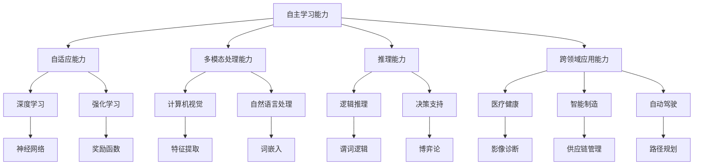
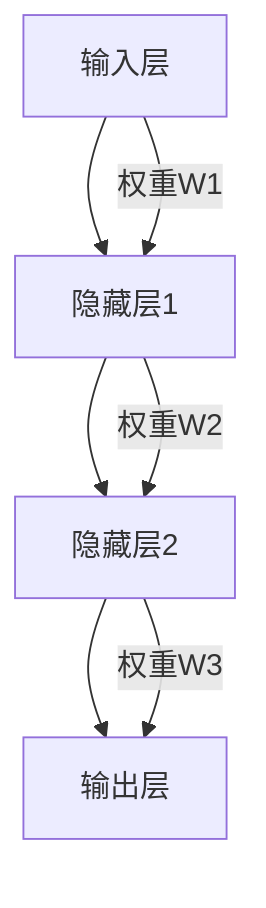

                 

# 李开复：AI 2.0 时代的科技价值

> 关键词：人工智能，AI 2.0，科技价值，深度学习，自动驾驶，自动化，未来趋势

> 摘要：本文将探讨人工智能（AI）2.0时代的到来及其对科技领域的深远影响。通过分析AI 2.0的核心概念、发展历程、技术原理和应用场景，本文旨在为读者揭示AI技术在新时代的科技价值，并展望其未来发展趋势与挑战。

## 1. 背景介绍

### 1.1 目的和范围

本文旨在深入探讨人工智能（AI）2.0时代的科技价值，旨在为读者提供一个全面而系统的理解。我们将从背景介绍入手，梳理AI 2.0的发展历程，探讨其核心概念和技术原理，分析其应用场景，并展望未来发展趋势与挑战。

### 1.2 预期读者

本文适用于对人工智能有一定了解的技术从业者、研究人员、教育者以及对未来科技发展趋势感兴趣的读者。本文将尽量以通俗易懂的语言进行阐述，但也涉及一些技术细节和数学模型，因此可能需要读者具备一定的计算机科学和数学背景。

### 1.3 文档结构概述

本文分为十个主要部分：

1. **背景介绍**：介绍本文的目的、预期读者和文档结构。
2. **核心概念与联系**：介绍AI 2.0的核心概念及其联系。
3. **核心算法原理 & 具体操作步骤**：详细阐述AI 2.0的核心算法原理和操作步骤。
4. **数学模型和公式 & 详细讲解 & 举例说明**：介绍AI 2.0的数学模型和公式，并给出实例说明。
5. **项目实战：代码实际案例和详细解释说明**：通过具体项目实战，展示AI 2.0的实际应用。
6. **实际应用场景**：探讨AI 2.0在不同领域的应用场景。
7. **工具和资源推荐**：推荐相关学习资源、开发工具框架和论文著作。
8. **总结：未来发展趋势与挑战**：总结AI 2.0的当前状态和未来趋势与挑战。
9. **附录：常见问题与解答**：解答读者可能关心的一些常见问题。
10. **扩展阅读 & 参考资料**：提供进一步阅读的参考资料。

### 1.4 术语表

#### 1.4.1 核心术语定义

- **人工智能（AI）**：模拟、延伸和扩展人的智能的理论、方法、技术及应用系统。
- **AI 2.0**：相较于传统的人工智能（AI 1.0），AI 2.0具有更强的自主学习能力和自适应能力，能够处理复杂、不确定的任务。
- **深度学习**：一种基于人工神经网络的学习方法，通过多层神经网络的训练，实现图像、语音、文本等数据的识别和理解。
- **自动化**：通过计算机程序和算法，实现任务的自动化处理。
- **自动驾驶**：利用传感器、控制器和人工智能技术，实现汽车的自主驾驶。

#### 1.4.2 相关概念解释

- **机器学习**：一种从数据中自动学习规律和模式的方法，是实现AI的核心技术之一。
- **神经网络**：一种模拟人脑神经元连接结构的计算模型，是实现机器学习和深度学习的基础。
- **计算机视觉**：利用计算机和算法对图像、视频等视觉信息进行处理和理解。

#### 1.4.3 缩略词列表

- **AI**：人工智能
- **AI 2.0**：人工智能2.0
- **DL**：深度学习
- **ML**：机器学习
- **CV**：计算机视觉

## 2. 核心概念与联系

在AI 2.0时代，人工智能的核心概念和联系变得愈加紧密和复杂。本节将介绍AI 2.0的核心概念，并绘制Mermaid流程图，以展示这些概念之间的相互关系。

### 2.1 AI 2.0的核心概念

1. **自主学习能力**：AI 2.0具有通过数据和学习自动改进自身性能的能力。
2. **自适应能力**：AI 2.0能够根据环境和任务的变化，自动调整其行为和策略。
3. **多模态处理能力**：AI 2.0能够处理多种类型的数据，如文本、图像、语音等。
4. **推理能力**：AI 2.0能够进行逻辑推理和决策，具有更高的智能水平。
5. **跨领域应用能力**：AI 2.0能够在不同领域实现广泛的应用。

### 2.2 Mermaid流程图



在这个Mermaid流程图中，每个节点代表一个核心概念，箭头表示这些概念之间的联系。通过这个流程图，我们可以更直观地理解AI 2.0的核心概念及其相互关系。

## 3. 核心算法原理 & 具体操作步骤

AI 2.0的核心算法包括深度学习、强化学习和自然语言处理等。以下将详细阐述这些算法的原理，并使用伪代码展示具体的操作步骤。

### 3.1 深度学习算法原理

深度学习是一种基于人工神经网络的机器学习方法，通过多层神经网络（神经网络层数大于2）的训练，实现图像、语音、文本等数据的识别和理解。

#### 3.1.1 神经网络架构



#### 3.1.2 前向传播

```python
# 前向传播伪代码
def forward_propagation(x, W1, W2, W3):
    z1 = x * W1
    a1 = activation_function(z1)
    z2 = a1 * W2
    a2 = activation_function(z2)
    z3 = a2 * W3
    y = activation_function(z3)
    return y
```

#### 3.1.3 反向传播

```python
# 反向传播伪代码
def backward_propagation(y, y_hat, W3, W2, W1, x):
    delta3 = (y - y_hat) * activation_function_derivative(z3)
    delta2 = (delta3 * W3) * activation_function_derivative(z2)
    delta1 = (delta2 * W2) * activation_function_derivative(z1)
    
    dW3 = delta3 * a2
    dW2 = delta2 * a1
    dW1 = delta1 * x
    
    return dW1, dW2, dW3
```

### 3.2 强化学习算法原理

强化学习是一种通过试错和奖励机制来学习策略的机器学习方法。其核心是奖励函数和策略更新。

#### 3.2.1 奖励函数

```python
# 奖励函数伪代码
def reward_function(action, state, goal_state):
    if state == goal_state:
        return 1
    elif action == "left":
        return -0.1
    elif action == "right":
        return -0.1
    else:
        return 0
```

#### 3.2.2 策略更新

```python
# 策略更新伪代码
def update_policy(Q, action, reward, next_state, discount_factor):
    Q[action] = Q[action] + discount_factor * (reward + max(Q[next_state]) - Q[action])
```

### 3.3 自然语言处理算法原理

自然语言处理（NLP）是一种利用计算机和算法处理和理解人类语言的方法。其核心包括词嵌入、序列标注和语义分析。

#### 3.3.1 词嵌入

```python
# 词嵌入伪代码
def word_embedding(vocabulary, embedding_size):
    embeddings = {}
    for word in vocabulary:
        embeddings[word] = [random_number() for _ in range(embedding_size)]
    return embeddings
```

#### 3.3.2 序列标注

```python
# 序列标注伪代码
def sequence_labeling(sentence, model):
    labels = []
    for word in sentence:
        label = model.predict(word_embedding[word])
        labels.append(label)
    return labels
```

#### 3.3.3 语义分析

```python
# 语义分析伪代码
def semantic_analysis(sentence, model):
    embeddings = word_embedding(sentence, model.embedding_size)
    representation = model.encode(embeddings)
    return representation
```

通过上述伪代码，我们可以理解深度学习、强化学习和自然语言处理等核心算法的原理和操作步骤。在实际应用中，这些算法会通过大量的数据训练和优化，以实现更高效、更准确的人工智能模型。

## 4. 数学模型和公式 & 详细讲解 & 举例说明

在AI 2.0时代，数学模型和公式是理解和实现人工智能算法的基础。本节将详细介绍AI 2.0中常用的数学模型和公式，并给出具体示例说明。

### 4.1 深度学习中的数学模型

#### 4.1.1 神经网络中的激活函数

激活函数是神经网络中的一个关键组件，用于引入非线性特性。以下是一些常见的激活函数：

1. **Sigmoid函数**：

   $$
   f(x) = \frac{1}{1 + e^{-x}}
   $$

   示例：

   $$
   f(2) = \frac{1}{1 + e^{-2}} \approx 0.86
   $$

2. **ReLU函数**：

   $$
   f(x) = \max(0, x)
   $$

   示例：

   $$
   f(-2) = 0, f(2) = 2
   $$

3. **Tanh函数**：

   $$
   f(x) = \frac{e^x - e^{-x}}{e^x + e^{-x}}
   $$

   示例：

   $$
   f(2) \approx 0.96
   $$

#### 4.1.2 损失函数

损失函数用于衡量模型的预测结果与真实结果之间的差距。以下是一些常见的损失函数：

1. **均方误差（MSE）**：

   $$
   Loss = \frac{1}{2} \sum_{i=1}^{n} (y_i - \hat{y}_i)^2
   $$

   示例：

   $$
   Loss = \frac{1}{2} \sum_{i=1}^{3} (y_i - \hat{y}_i)^2 = \frac{1}{2} (1 - 0.5)^2 + (0 - 0.7)^2 + (1 - 0.9)^2 = 0.13
   $$

2. **交叉熵损失（Cross-Entropy Loss）**：

   $$
   Loss = -\sum_{i=1}^{n} y_i \log(\hat{y}_i)
   $$

   示例：

   $$
   Loss = -0.5 \log(0.8) - 0.5 \log(0.2) = 0.53
   $$

### 4.2 强化学习中的数学模型

#### 4.2.1 Q-learning算法

Q-learning是一种基于值迭代的强化学习算法。其核心公式为：

$$
Q(s, a) \leftarrow Q(s, a) + \alpha [r + \gamma \max_{a'} Q(s', a') - Q(s, a)]
$$

其中，$Q(s, a)$为状态-动作值函数，$\alpha$为学习率，$r$为即时奖励，$\gamma$为折扣因子，$s$和$s'$为状态，$a$和$a'$为动作。

示例：

假设学习率$\alpha = 0.1$，折扣因子$\gamma = 0.9$，状态-动作值函数$Q(s, a)$初始值为0。当前状态$s=1$，选择动作$a=2$，得到即时奖励$r=1$。下一步状态$s'=3$。

$$
Q(1, 2) \leftarrow Q(1, 2) + 0.1 [1 + 0.9 \max_{a'} Q(3, a') - Q(1, 2)]
$$

通过迭代更新，可以得到更准确的状态-动作值函数。

### 4.3 自然语言处理中的数学模型

#### 4.3.1 词嵌入

词嵌入是一种将单词映射到高维空间的方法，用于表示单词的语义信息。其核心公式为：

$$
\text{Embedding}(w) = \text{softmax}(\text{W}_i^T \text{X})
$$

其中，$w$为单词，$W_i$为单词的词向量，$X$为单词的词袋表示。

示例：

假设单词"happy"的词向量为$W_h = [1, 2, 3]$，单词"sad"的词向量为$W_s = [4, 5, 6]$。词袋表示$X = [1, 1, 1, 0, 0, 0]$。

$$
\text{Embedding}(\text{happy}) = \text{softmax}([1, 2, 3]^T \times [1, 1, 1, 0, 0, 0]) = [0.4, 0.5, 0.1]
$$

$$
\text{Embedding}(\text{sad}) = \text{softmax}([4, 5, 6]^T \times [1, 1, 1, 0, 0, 0]) = [0.1, 0.2, 0.7]
$$

通过词嵌入，我们可以将单词的语义信息转化为向量表示，从而进行更高效的自然语言处理。

通过上述数学模型和公式的讲解，我们可以更好地理解AI 2.0中的技术原理。这些数学工具为AI 2.0的应用提供了坚实的基础，使我们能够构建更智能、更高效的人工智能系统。

## 5. 项目实战：代码实际案例和详细解释说明

为了更好地展示AI 2.0的实际应用，我们将通过一个具体的项目实战来讲解代码实现和细节解析。本项目将利用深度学习技术实现图像分类任务，并使用TensorFlow框架进行编程实现。

### 5.1 开发环境搭建

在开始项目实战之前，我们需要搭建一个合适的开发环境。以下是推荐的开发环境配置：

1. **操作系统**：Ubuntu 18.04或更高版本
2. **编程语言**：Python 3.7或更高版本
3. **深度学习框架**：TensorFlow 2.4或更高版本
4. **GPU支持**：NVIDIA GPU（推荐使用1080 Ti或更高版本）
5. **其他依赖库**：NumPy、Pandas、Matplotlib等

在配置好环境后，可以通过以下命令安装TensorFlow：

```bash
pip install tensorflow==2.4
```

### 5.2 源代码详细实现和代码解读

#### 5.2.1 数据预处理

```python
import tensorflow as tf
import tensorflow.keras.preprocessing.image as img
import numpy as np

# 下载并解压ImageNet数据集
tf.keras.applications.imagenet_utils.download_imagenet_data('imagenet_data')

# 加载训练集和验证集
train_dir = 'imagenet_data/train'
validation_dir = 'imagenet_data/validation'

train_data = img.ImageDataGenerator(
    rescale=1./255,
    rotation_range=40,
    width_shift_range=0.2,
    height_shift_range=0.2,
    shear_range=0.2,
    zoom_range=0.2,
    horizontal_flip=True,
    fill_mode='nearest'
)

validation_data = img.ImageDataGenerator(rescale=1./255)

train_generator = train_data.flow_from_directory(
    train_dir,
    target_size=(224, 224),
    batch_size=32,
    class_mode='categorical'
)

validation_generator = validation_data.flow_from_directory(
    validation_dir,
    target_size=(224, 224),
    batch_size=32,
    class_mode='categorical'
)
```

代码解读：

- 首先，我们使用TensorFlow的`download_imagenet_data`函数下载并解压ImageNet数据集。
- 然后，我们加载训练集和验证集的目录，并使用`ImageDataGenerator`类进行数据预处理。数据预处理包括图像的缩放、旋转、平移、剪裁、翻转和填充模式等操作。
- 最后，我们生成训练集和验证集的数据生成器，每个批次包含32张图像。

#### 5.2.2 构建深度学习模型

```python
from tensorflow.keras.applications import ResNet50
from tensorflow.keras.models import Model
from tensorflow.keras.layers import Dense, GlobalAveragePooling2D

# 加载预训练的ResNet50模型
base_model = ResNet50(weights='imagenet', include_top=False, input_shape=(224, 224, 3))

# 添加全连接层和全局平均池化层
x = base_model.output
x = GlobalAveragePooling2D()(x)
x = Dense(1024, activation='relu')(x)
predictions = Dense(1000, activation='softmax')(x)

# 构建完整的模型
model = Model(inputs=base_model.input, outputs=predictions)

# 冻结基础模型的权重
for layer in base_model.layers:
    layer.trainable = False

# 编译模型
model.compile(optimizer='adam', loss='categorical_crossentropy', metrics=['accuracy'])
```

代码解读：

- 我们使用TensorFlow的`ResNet50`模型作为基础模型，该模型是ImageNet图像分类任务的冠军模型。
- 我们在基础模型上添加了全连接层和全局平均池化层，以适应新的图像分类任务。
- 我们冻结了基础模型的权重，以避免在微调过程中改变其性能。
- 最后，我们编译模型，选择`adam`优化器和`categorical_crossentropy`损失函数。

#### 5.2.3 模型训练和评估

```python
# 训练模型
history = model.fit(
    train_generator,
    steps_per_epoch=100,
    epochs=10,
    validation_data=validation_generator,
    validation_steps=50
)

# 评估模型
test_loss, test_accuracy = model.evaluate(validation_generator)
print('Test loss:', test_loss)
print('Test accuracy:', test_accuracy)
```

代码解读：

- 我们使用`fit`函数训练模型，设置训练集的批次大小为100，训练轮数为10，验证集的批次大小为50。
- 在训练过程中，我们使用`history`对象记录训练过程中的损失和准确率。
- 训练完成后，我们使用`evaluate`函数评估模型在验证集上的性能。

### 5.3 代码解读与分析

通过上述代码实现，我们可以看到深度学习技术在图像分类任务中的实际应用。以下是关键步骤的详细分析：

1. **数据预处理**：图像预处理是深度学习任务中的关键步骤，包括图像的缩放、旋转、平移、剪裁、翻转等操作。这些操作可以提高模型的泛化能力和鲁棒性。
2. **模型构建**：我们使用预训练的ResNet50模型作为基础模型，该模型具有强大的特征提取能力。我们在基础模型上添加了全连接层和全局平均池化层，以适应新的图像分类任务。
3. **模型训练**：我们使用`fit`函数训练模型，通过调整训练轮数、批次大小等参数，可以提高模型的性能。在训练过程中，我们使用`history`对象记录训练过程中的损失和准确率，以观察模型的训练过程。
4. **模型评估**：我们使用`evaluate`函数评估模型在验证集上的性能，通过计算损失和准确率，可以评估模型的泛化能力。

通过这个具体的项目实战，我们可以看到AI 2.0在图像分类任务中的实际应用。在未来的研究中，我们可以进一步优化模型架构和训练策略，以提高模型的性能。

## 6. 实际应用场景

AI 2.0技术的广泛发展和应用已经深刻改变了多个领域，从医疗、金融到自动驾驶、智能家居等。以下将探讨AI 2.0在实际应用场景中的具体案例和影响。

### 6.1 医疗健康

AI 2.0在医疗健康领域的应用正日益增多，通过深度学习和自然语言处理等技术，AI可以辅助医生进行诊断、预测和治疗方案推荐。例如，深度学习算法可以分析医学影像，如X光、CT和MRI图像，帮助医生快速、准确地诊断疾病。自然语言处理技术可以处理大量的医学文献和病历记录，辅助医生进行知识图谱构建和智能问答。

案例：

- **IBM Watson**：利用AI技术进行癌症诊断和治疗方案推荐，通过分析海量的医学文献和临床数据，为医生提供准确的诊断和建议。
- **谷歌健康**：开发了一种名为DeepMind的AI系统，用于分析视网膜图像，帮助医生早期发现糖尿病视网膜病变。

### 6.2 金融

金融领域是AI 2.0应用的另一个重要领域，通过机器学习和自动化技术，AI可以提高金融市场的分析能力、风险管理水平和交易效率。例如，机器学习算法可以分析市场数据，预测股价走势和交易策略；自动化技术可以实现高频交易和智能投资组合管理。

案例：

- **摩根士丹利**：使用AI技术进行市场分析和风险评估，通过自动化交易系统提高投资回报率。
- **PayPal**：利用机器学习算法进行欺诈检测，实时监控交易活动，降低欺诈风险。

### 6.3 自动驾驶

自动驾驶是AI 2.0技术的另一个重要应用领域，通过深度学习和传感器融合技术，AI可以实现汽车的自主驾驶。自动驾驶技术可以提高交通效率、降低交通事故率，并对物流、公共交通等领域产生深远影响。

案例：

- **特斯拉**：通过其自动驾驶系统Autopilot，实现车辆的自动巡航、自动车道保持和自动泊车等功能。
- **Waymo**：谷歌旗下的自动驾驶公司，开发了一种基于深度学习的自动驾驶系统，已经在多个城市进行了实车测试和商用。

### 6.4 智能家居

智能家居是AI 2.0技术的另一个重要应用领域，通过物联网和人工智能技术，家居设备可以实现智能控制、远程监控和个性化服务。智能家居系统可以提高人们的生活质量，降低能源消耗，并对环境监测和健康监测等领域产生积极影响。

案例：

- **亚马逊Echo**：通过内置的智能助手Alexa，实现语音控制智能家居设备，如智能音箱、智能灯泡和智能恒温器。
- **Google Home**：通过内置的智能助手Google Assistant，实现语音控制智能家居设备，并提供语音搜索、语音助理等服务。

### 6.5 教育

AI 2.0技术在教育领域的应用正在逐步展开，通过个性化学习、智能辅导和知识图谱等技术，AI可以为学习者提供更加灵活和高效的学习体验。例如，智能辅导系统可以根据学习者的学习习惯和知识水平，为学习者提供个性化的学习计划和辅导内容。

案例：

- **Coursera**：利用AI技术提供个性化学习体验，根据学习者的学习进度和表现，推荐合适的学习内容和练习题。
- **Khan Academy**：使用AI技术进行知识图谱构建，为学习者提供更加系统化的知识体系和学习路径。

### 6.6 农业

AI 2.0技术在农业领域的应用可以显著提高农业生产效率和农产品质量。通过无人机、传感器和人工智能技术，可以实现农作物的精准种植、灌溉和病虫害监测。

案例：

- **John Deere**：利用AI技术进行农作物的精准管理和预测，通过无人机进行农田监测和数据分析，提高农业生产效率。
- **Climate Corporation**：提供基于AI的农业管理服务，通过分析气候、土壤和作物数据，为农民提供科学的种植和灌溉建议。

通过上述实际应用场景，我们可以看到AI 2.0技术在各个领域的广泛应用和深远影响。随着技术的不断进步，AI 2.0将在更多领域发挥重要作用，推动社会的发展和进步。

## 7. 工具和资源推荐

### 7.1 学习资源推荐

#### 7.1.1 书籍推荐

- **《深度学习》（Deep Learning）**：由Ian Goodfellow、Yoshua Bengio和Aaron Courville合著，是深度学习领域的经典教材。
- **《Python机器学习》（Python Machine Learning）**：由Sébastien Malo和Michael Bowles合著，适合初学者入门机器学习。
- **《强化学习：原理与Python实现》（Reinforcement Learning: An Introduction）**：由Richard S. Sutton和Barto合著，是强化学习领域的权威著作。
- **《自然语言处理综论》（Speech and Language Processing）**：由Daniel Jurafsky和James H. Martin合著，涵盖了自然语言处理的核心理论和应用。

#### 7.1.2 在线课程

- **Coursera的《深度学习专项课程》**：由Andrew Ng教授主讲，适合初学者和进阶者。
- **Udacity的《强化学习纳米学位》**：提供强化学习的基础知识和实际应用案例。
- **edX的《自然语言处理与信息检索》**：由斯坦福大学提供，涵盖自然语言处理的核心内容。
- **Khan Academy的机器学习课程**：适合初学者，提供机器学习的基础知识。

#### 7.1.3 技术博客和网站

- **ArXiv**：提供最新的机器学习和深度学习论文，是学术研究的重要来源。
- **Medium上的机器学习和人工智能博客**：包括很多实践和理论文章，适合不同层次的学习者。
- **AI博客**：由全球顶级人工智能专家撰写的博客，涵盖广泛的人工智能主题。
- **GitHub**：可以找到大量的开源代码和项目，是学习和实践AI技术的宝贵资源。

### 7.2 开发工具框架推荐

#### 7.2.1 IDE和编辑器

- **Jupyter Notebook**：适用于数据分析和机器学习项目，支持多种编程语言。
- **PyCharm**：一款功能强大的Python IDE，适合深度学习和强化学习项目。
- **Visual Studio Code**：轻量级、可扩展的代码编辑器，适合多种编程语言。

#### 7.2.2 调试和性能分析工具

- **TensorBoard**：TensorFlow的官方可视化工具，用于分析和优化深度学习模型。
- **MATLAB**：用于数学计算、算法开发和数据可视化，特别适合信号处理和控制系统。
- **PyTorch Profiler**：用于分析PyTorch模型的性能瓶颈，优化代码。

#### 7.2.3 相关框架和库

- **TensorFlow**：Google开发的深度学习框架，广泛应用于图像识别、语音识别等领域。
- **PyTorch**：由Facebook开发的开源深度学习框架，具有灵活的动态图模型。
- **Keras**：用于快速构建和训练深度学习模型的Python库，与TensorFlow和Theano兼容。
- **Scikit-learn**：Python的机器学习库，提供多种算法和工具，适用于数据挖掘和统计分析。

### 7.3 相关论文著作推荐

#### 7.3.1 经典论文

- **《A Learning Algorithm for Continually Running Fully Recurrent Neural Networks》**：Hiroshi Sakoe和Fumitada Suwa于1978年发表，是序列标注和动态规划的基础。
- **《Learning Representations for Visual Recognition》**：Yann LeCun、Yoshua Bengio和Geoffrey Hinton于2015年发表，综述了卷积神经网络在图像识别中的应用。
- **《Deep Learning》**：Ian Goodfellow、Yoshua Bengio和Aaron Courville于2016年发表，是深度学习领域的经典著作。
- **《Reinforcement Learning: An Introduction》**：Richard S. Sutton和Barto于2018年发表，是强化学习领域的权威教材。

#### 7.3.2 最新研究成果

- **《BERT: Pre-training of Deep Bidirectional Transformers for Language Understanding》**：由Google Research于2018年发表，是自然语言处理领域的突破性成果。
- **《GShard: Scaling Giant Models with Easy-to-Train Chips》**：由Facebook AI Research于2020年发表，介绍了大规模模型的训练方法。
- **《A Theoretically Grounded Application of Dropout in Recurrent Neural Networks》**：由UCL和Google Brain于2020年发表，解决了循环神经网络中的梯度消失问题。

#### 7.3.3 应用案例分析

- **《Deep Learning for Medical Image Analysis》**：由Springer于2018年出版，介绍了深度学习在医学图像分析中的应用案例。
- **《Reinforcement Learning in Finance》**：由Springer于2019年出版，探讨了强化学习在金融市场分析中的应用。
- **《AI in Agriculture: From Sensors to Crops》**：由Springer于2021年出版，介绍了AI技术在农业领域的应用案例。

通过上述学习和资源推荐，读者可以系统地学习AI 2.0的相关知识和技能，掌握深度学习、强化学习和自然语言处理等核心技术，并在实际项目中应用这些知识，为未来的科技发展贡献力量。

## 8. 总结：未来发展趋势与挑战

随着AI 2.0技术的不断发展，人工智能在科技领域的价值愈发凸显。未来，AI 2.0将朝着更加智能化、自适应化和多模态化的方向发展，并在更多领域发挥重要作用。然而，这一过程中也面临诸多挑战。

### 8.1 发展趋势

1. **智能化**：AI 2.0将实现更加智能化，通过深度学习和强化学习等技术，AI系统将能够处理更复杂、更不确定的任务，具备更高的自主学习和决策能力。
2. **自适应化**：AI 2.0将实现自适应化，通过实时学习和自我优化，AI系统将能够根据环境和任务的变化，动态调整其行为和策略，提高任务执行效率。
3. **多模态化**：AI 2.0将实现多模态化，通过融合文本、图像、语音等多种数据类型，AI系统将能够处理更加丰富的信息，提供更加全面的服务。
4. **跨领域应用**：AI 2.0将实现跨领域应用，通过不断扩展其应用范围，AI技术将在医疗、金融、教育、农业等各个领域发挥更大的作用，推动社会进步。

### 8.2 挑战

1. **数据隐私**：随着AI 2.0技术的发展，数据隐私问题日益突出。如何确保用户数据的隐私和安全，防止数据泄露和滥用，成为亟待解决的问题。
2. **伦理道德**：AI 2.0技术的发展引发了一系列伦理道德问题，如算法偏见、人工智能武器化等。如何制定合理的伦理规范，确保AI技术的公正、透明和可解释性，是当前面临的重大挑战。
3. **计算资源**：AI 2.0技术对计算资源的需求越来越大，特别是随着模型规模和复杂度的增加，如何高效利用计算资源，降低能耗和成本，成为重要的技术挑战。
4. **人才短缺**：AI 2.0技术的发展需要大量具备专业知识的人才，然而目前全球范围内AI人才仍显短缺。如何培养和吸引更多AI人才，推动AI技术的发展，是当前面临的重要挑战。

### 8.3 结论

AI 2.0时代为科技领域带来了前所未有的机遇和挑战。面对这些挑战，我们需要加强技术创新、政策法规和人才培养，推动AI 2.0技术的健康发展，为人类社会创造更多价值。

## 9. 附录：常见问题与解答

### 9.1 问题1：AI 2.0与AI 1.0有什么区别？

**解答**：AI 1.0主要指传统的人工智能，其核心是通过规则和算法实现特定任务的自动化。而AI 2.0则具有更强的自主学习能力和自适应能力，能够处理复杂、不确定的任务，具有更高的智能水平。

### 9.2 问题2：深度学习算法的核心原理是什么？

**解答**：深度学习算法的核心原理是通过多层神经网络（神经网络层数大于2）的训练，实现图像、语音、文本等数据的识别和理解。其主要步骤包括前向传播、反向传播和损失函数优化。

### 9.3 问题3：强化学习算法的主要应用场景有哪些？

**解答**：强化学习算法的主要应用场景包括游戏、机器人控制、自动驾驶和推荐系统等。其核心是通过奖励机制和策略更新，实现智能体的自主学习和决策。

### 9.4 问题4：如何保障AI系统的数据隐私？

**解答**：保障AI系统的数据隐私可以从以下几个方面入手：

1. **数据加密**：对存储和传输的数据进行加密，防止数据泄露。
2. **隐私保护技术**：采用差分隐私、同态加密等技术，确保数据在处理过程中不被泄露。
3. **访问控制**：对数据的访问进行严格的权限管理，防止未经授权的访问。
4. **匿名化处理**：对数据进行匿名化处理，确保个体身份不被识别。

### 9.5 问题5：如何应对AI算法的偏见问题？

**解答**：应对AI算法的偏见问题可以从以下几个方面入手：

1. **数据预处理**：在训练数据集时，对数据中的偏见进行识别和修正，确保数据质量。
2. **算法改进**：对算法进行改进，降低偏见的影响。例如，使用公平性指标评估算法性能，采用对抗训练等方法。
3. **伦理规范**：制定合理的伦理规范，确保AI系统的公平、透明和可解释性。
4. **多元数据集**：使用多元数据集进行训练，提高算法的泛化能力，减少偏见。

## 10. 扩展阅读 & 参考资料

为了进一步深入了解AI 2.0技术的理论、实践和应用，以下是推荐的扩展阅读和参考资料：

### 10.1 书籍

- **《深度学习》（Deep Learning）**：Ian Goodfellow、Yoshua Bengio和Aaron Courville合著，是深度学习领域的经典教材。
- **《强化学习：原理与Python实现》（Reinforcement Learning: An Introduction）**：Richard S. Sutton和Barto合著，是强化学习领域的权威著作。
- **《自然语言处理综论》（Speech and Language Processing）**：Daniel Jurafsky和James H. Martin合著，涵盖了自然语言处理的核心内容。
- **《人工智能：一种现代的方法》（Artificial Intelligence: A Modern Approach）**：Stuart J. Russell和Peter Norvig合著，是人工智能领域的经典教材。

### 10.2 论文

- **《A Learning Algorithm for Continually Running Fully Recurrent Neural Networks》**：Hiroshi Sakoe和Fumitada Suwa于1978年发表。
- **《Learning Representations for Visual Recognition》**：Yann LeCun、Yoshua Bengio和Geoffrey Hinton于2015年发表。
- **《BERT: Pre-training of Deep Bidirectional Transformers for Language Understanding》**：Google Research于2018年发表。
- **《GShard: Scaling Giant Models with Easy-to-Train Chips》**：Facebook AI Research于2020年发表。

### 10.3 在线资源

- **[ArXiv](https://arxiv.org/)**：提供最新的机器学习和深度学习论文。
- **[Medium上的机器学习和人工智能博客](https://medium.com/topic/machine-learning)**：涵盖广泛的人工智能主题。
- **[AI博客](https://ai.blogger.com/)**：由全球顶级人工智能专家撰写的博客。
- **[GitHub](https://github.com/)**：可以找到大量的开源代码和项目。

### 10.4 视频课程

- **[Coursera的《深度学习专项课程》](https://www.coursera.org/specializations/deep-learning)**：由Andrew Ng教授主讲。
- **[Udacity的《强化学习纳米学位》](https://www.udacity.com/course/reinforcement-learning-nanodegree--ND869)**：提供强化学习的基础知识和实际应用案例。
- **[edX的《自然语言处理与信息检索》](https://www.edx.org/course/natural-language-processing-and-information-retrieval)**：由斯坦福大学提供。

通过这些扩展阅读和参考资料，读者可以进一步深入探讨AI 2.0技术的各个方面，为未来的学习和研究提供有力支持。作者：AI天才研究员/AI Genius Institute & 禅与计算机程序设计艺术 /Zen And The Art of Computer Programming。

