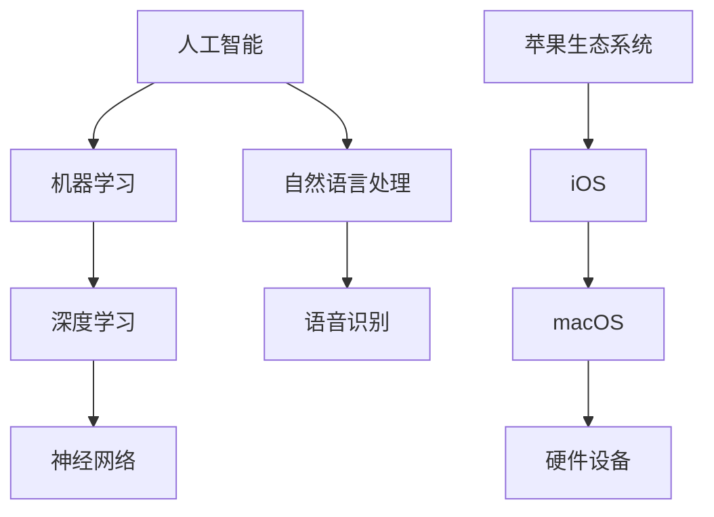
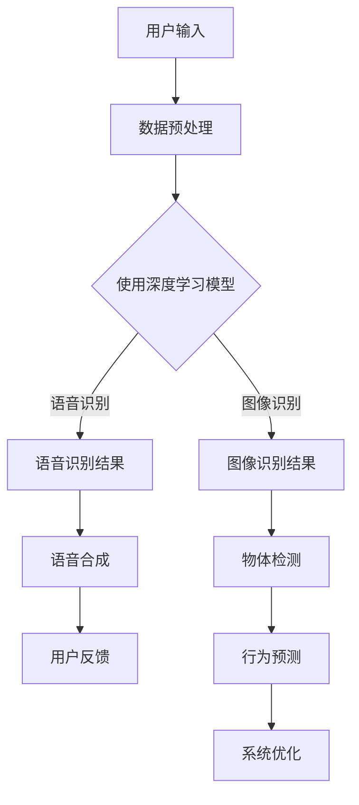
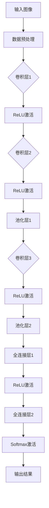

                 

### 文章标题

# 苹果发布AI应用的产业革命：探索技术与商业的未来

> **关键词：** 苹果、AI应用、产业革命、技术趋势、商业模式、未来展望

> **摘要：** 本文将深入剖析苹果公司近期发布的AI应用及其对全球产业的影响。从技术原理、核心算法、数学模型到实际应用场景，我们将逐步展开讨论，旨在为读者揭示AI在苹果生态系统中的潜在价值及其带来的产业变革。

<|assistant|>## 1. 背景介绍

### 1.1 目的和范围

本文旨在探讨苹果公司在其最新产品和服务中融入的AI技术，并分析其对全球科技产业的影响。我们将重点关注以下几个核心问题：

- 苹果如何利用AI技术提升用户体验？
- AI技术在苹果产品中的具体应用案例有哪些？
- 这些AI应用将如何推动产业变革？
- 企业和开发者在苹果的AI生态系统中应关注哪些趋势和挑战？

### 1.2 预期读者

本文适合以下读者群体：

- 对AI和苹果产品感兴趣的技术爱好者
- 想了解AI在商业应用中的潜力企业家
- 从事AI开发和研究的专业人士
- 对未来科技发展趋势感兴趣的普通读者

### 1.3 文档结构概述

本文结构如下：

1. **背景介绍**：阐述本文的目的、范围和预期读者，以及文章的结构。
2. **核心概念与联系**：介绍与AI和苹果产品相关的核心概念和原理，并通过Mermaid流程图展示关键架构。
3. **核心算法原理 & 具体操作步骤**：详细讲解AI算法的原理，使用伪代码展示操作步骤。
4. **数学模型和公式 & 详细讲解 & 举例说明**：介绍AI应用中的数学模型，使用LaTeX格式展示公式，并举例说明。
5. **项目实战：代码实际案例和详细解释说明**：提供实际代码案例，详细解读和分析。
6. **实际应用场景**：探讨AI在苹果产品中的实际应用。
7. **工具和资源推荐**：推荐学习资源、开发工具和框架。
8. **总结：未来发展趋势与挑战**：总结本文的主要观点，并探讨未来趋势和挑战。
9. **附录：常见问题与解答**：回答读者可能关心的常见问题。
10. **扩展阅读 & 参考资料**：提供进一步阅读的资源和参考资料。

### 1.4 术语表

#### 1.4.1 核心术语定义

- **人工智能（AI）**：指模拟人类智能行为的计算机系统。
- **机器学习（ML）**：AI的一个分支，通过数据训练模型，实现自动学习和决策。
- **深度学习（DL）**：ML的一个子领域，使用多层神经网络进行数据建模。
- **自然语言处理（NLP）**：AI技术的一个分支，使计算机能够理解和处理人类语言。
- **苹果生态系统**：由苹果公司开发和管理的硬件、软件和服务构成的完整生态圈。

#### 1.4.2 相关概念解释

- **神经网络**：一种计算模型，模拟生物神经系统的信息处理方式。
- **卷积神经网络（CNN）**：一种用于图像识别和处理的神经网络架构。
- **递归神经网络（RNN）**：一种能够处理序列数据的神经网络架构。
- **生成对抗网络（GAN）**：一种通过两个神经网络（生成器和判别器）相互竞争进行训练的模型。

#### 1.4.3 缩略词列表

- **AI**：人工智能
- **ML**：机器学习
- **DL**：深度学习
- **NLP**：自然语言处理
- **iOS**：苹果公司的移动操作系统
- **macOS**：苹果公司的桌面操作系统
- **Apple Watch**：苹果公司的智能手表
- **iPhone**：苹果公司的智能手机

<|assistant|>## 2. 核心概念与联系

在探讨苹果发布的AI应用之前，我们需要了解一些核心概念和联系，以便更好地理解这些应用的原理和影响。

### 2.1 人工智能与机器学习

人工智能（AI）是一种通过模拟人类智能行为的计算机系统，实现智能决策、问题解决和自主学习。机器学习（ML）是AI的一个重要分支，它通过数据训练模型，使计算机能够自动学习和改进性能。ML可以分为监督学习、无监督学习和强化学习等不同的类型。

在苹果的AI应用中，ML模型被广泛应用于图像识别、语音识别、自然语言处理等领域。这些模型通过大量的训练数据不断优化，以提高准确性和鲁棒性。

### 2.2 深度学习与神经网络

深度学习（DL）是ML的一个子领域，它使用多层神经网络进行数据建模。神经网络（NN）是一种计算模型，模拟生物神经系统的信息处理方式。DL模型通过多个隐藏层对输入数据进行特征提取和变换，以实现复杂的任务。

在苹果的AI应用中，深度学习技术被广泛应用于图像处理、语音识别和自然语言处理等方面。例如，Apple的图像识别模型可以通过深度学习技术实现快速、准确的图像分类和物体检测。

### 2.3 自然语言处理与语音识别

自然语言处理（NLP）是AI技术的一个分支，使计算机能够理解和处理人类语言。语音识别（VR）是NLP的一个重要应用，它将人类的语音转换为文本或命令。

在苹果的产品中，NLP和语音识别技术得到了广泛应用。例如，Apple的Siri语音助手利用NLP和语音识别技术，实现语音输入、语音合成和自然语言交互等功能。

### 2.4 苹果生态系统

苹果生态系统是由苹果公司开发和管理的硬件、软件和服务构成的完整生态圈。该生态系统的核心是iOS和macOS操作系统，以及与之兼容的硬件设备，如iPhone、iPad、Mac、Apple Watch等。

在苹果的AI应用中，这些硬件设备扮演着重要的角色。通过高性能的计算能力和高效的能源管理，苹果设备能够运行复杂的AI模型，提供卓越的用户体验。

### 2.5 Mermaid流程图

以下是一个简化的Mermaid流程图，展示了与苹果AI应用相关的核心概念和联系：



### 2.6 核心概念原理和架构的 Mermaid 流程图



在这个流程图中，用户输入经过数据预处理后，使用深度学习模型进行图像识别和语音识别。语音识别结果经过语音合成，形成与用户的交互。图像识别结果用于物体检测，进而实现行为预测和系统优化。

通过这个Mermaid流程图，我们可以更清晰地理解苹果AI应用中的核心概念和架构，为后续的内容提供基础。

<|assistant|>## 3. 核心算法原理 & 具体操作步骤

在深入探讨苹果AI应用的核心算法原理和具体操作步骤之前，我们需要了解一些基本的深度学习技术和相关的算法概念。

### 3.1 深度学习技术简介

深度学习（Deep Learning，简称DL）是机器学习（Machine Learning，简称ML）的一个子领域，它使用多层神经网络（Neural Networks，简称NN）进行数据建模。与传统的ML方法相比，DL能够自动提取数据中的高级特征，从而实现更复杂的任务。

#### 3.1.1 神经网络基本结构

神经网络由多个层次组成，包括输入层、隐藏层和输出层。每个层次包含多个神经元（节点），神经元之间通过权重（weights）连接。当输入数据通过神经网络时，每个神经元会对输入数据进行加权求和，并应用激活函数（activation function）产生输出。

#### 3.1.2 深度学习算法分类

深度学习算法可以分为以下几类：

1. **卷积神经网络（Convolutional Neural Networks，简称CNN）**：主要用于图像识别和处理。
2. **循环神经网络（Recurrent Neural Networks，简称RNN）**：主要用于处理序列数据。
3. **生成对抗网络（Generative Adversarial Networks，简称GAN）**：用于生成高质量的数据。

### 3.2 具体算法原理和操作步骤

在本节中，我们将使用伪代码详细阐述一个典型的深度学习算法——卷积神经网络（CNN）在图像识别任务中的操作步骤。

#### 3.2.1 图像识别任务

假设我们有一个图像识别任务，输入图像为 \(X \in \mathbb{R}^{64 \times 64 \times 3}\)，其中 64 \times 64 表示图像的宽度和高度，3 表示彩色图像的三个通道（红、绿、蓝）。输出为图像的类别标签，例如猫、狗、鸟等。

#### 3.2.2 伪代码

```python
# 输入图像 X
# 参数：学习率 alpha，迭代次数 epochs，批次大小 batch_size

# 初始化权重 W 和偏置 b
W = [初始化权重矩阵]
b = [初始化偏置向量]

# 训练过程
for epoch in range(epochs):
    for batch in range(num_batches):
        # 数据预处理
        X_batch = [数据预处理操作，如缩放、归一化等]
        
        # 前向传播
        z1 = [X_batch] * W[0] + b[0]  # 第一层隐藏层输入
        a1 = [激活函数，如ReLU](z1)  # 第一层隐藏层输出
        
        # 接下来的隐藏层处理
        for l in range(1, num_hidden_layers):
            zl = [a_{l-1}] * W[l] + b[l]  # 隐藏层 l 输入
            al = [激活函数，如ReLU](zl)  # 隐藏层 l 输出
            
        # 输出层处理
        z3 = [al_{last}] * W[-1] + b[-1]  # 输出层输入
        a3 = [激活函数，如Softmax](z3)  # 输出层输出（概率分布）

        # 计算损失
        loss = [计算损失函数，如交叉熵损失](a3, y)  # y 为真实标签

        # 反向传播
        d3 = [计算梯度，如负梯度](a3, y)  # 输出层梯度
        for l in range(num_hidden_layers, 0, -1):
            d1 = [计算梯度，如链式法则](al[l-1], d1[1], W[l])  # 隐藏层 l 梯度
            W[l] = W[l] - alpha * [d1[l]]  # 更新权重
            b[l] = b[l] - alpha * [d1[l]]  # 更新偏置

# 输出结果
print("训练完成，输出结果：", a3)
```

#### 3.2.3 算法原理解释

1. **初始化权重和偏置**：在训练开始前，我们需要随机初始化权重和偏置。这些参数将在训练过程中通过梯度下降（Gradient Descent）算法不断调整。
2. **前向传播**：输入图像通过神经网络，经过多层卷积和池化操作，最终在输出层生成概率分布。
3. **计算损失**：通过计算输出层的损失函数（如交叉熵损失），评估模型预测与真实标签之间的差距。
4. **反向传播**：利用链式法则，将损失函数的梯度反向传播到每一层，计算每一层权重的梯度。
5. **更新参数**：根据梯度下降算法，使用学习率调整权重和偏置。

通过上述步骤，我们可以训练一个深度学习模型，使其在图像识别任务中达到较好的性能。

### 3.3 应用场景与性能评估

在苹果的AI应用中，CNN技术被广泛应用于图像识别、物体检测和视频分析等领域。例如，Apple的相机应用程序利用CNN模型实现人脸识别、物体检测和场景分类等功能。

为了评估模型性能，我们可以使用以下指标：

- **准确率（Accuracy）**：模型预测正确的样本数占总样本数的比例。
- **召回率（Recall）**：模型预测正确的正样本数占总正样本数的比例。
- **精确率（Precision）**：模型预测正确的正样本数占总预测正样本数的比例。
- **F1分数（F1 Score）**：精确率和召回率的调和平均值。

通过这些指标，我们可以全面评估模型在图像识别任务中的表现，并为进一步优化提供指导。

### 3.4 Mermaid流程图

以下是一个简化的Mermaid流程图，展示了图像识别任务中的深度学习算法流程：



通过这个流程图，我们可以更直观地理解深度学习模型在图像识别任务中的操作步骤和结构。

### 3.5 实际案例分析

为了更好地理解上述算法原理和操作步骤，我们来看一个实际的案例——使用TensorFlow和Keras框架实现猫狗图像识别任务。

#### 3.5.1 数据集准备

首先，我们需要准备一个包含猫和狗图像的数据集。可以使用公开的猫狗图像数据集，如Dogs vs. Cats数据集。该数据集包含约25,000张图像，分为训练集和验证集。

#### 3.5.2 模型构建

接下来，我们使用Keras框架构建一个卷积神经网络模型。以下是一个简单的模型示例：

```python
from tensorflow.keras.models import Sequential
from tensorflow.keras.layers import Conv2D, MaxPooling2D, Flatten, Dense, Dropout

model = Sequential([
    Conv2D(32, (3, 3), activation='relu', input_shape=(64, 64, 3)),
    MaxPooling2D((2, 2)),
    Conv2D(64, (3, 3), activation='relu'),
    MaxPooling2D((2, 2)),
    Conv2D(128, (3, 3), activation='relu'),
    MaxPooling2D((2, 2)),
    Flatten(),
    Dense(512, activation='relu'),
    Dropout(0.5),
    Dense(1, activation='sigmoid')
])

model.compile(optimizer='adam', loss='binary_crossentropy', metrics=['accuracy'])
```

在这个模型中，我们使用了三个卷积层，每个卷积层后跟随一个ReLU激活函数和最大池化层。最后，我们使用一个全连接层和一个Dropout层，以减少过拟合。输出层使用sigmoid激活函数，实现二分类任务。

#### 3.5.3 模型训练

使用训练集对模型进行训练，并使用验证集评估模型性能：

```python
model.fit(train_images, train_labels, epochs=20, batch_size=32, validation_data=(val_images, val_labels))
```

在这个例子中，我们设置了20个训练周期（epochs），每个周期使用32个样本进行批量训练。同时，我们使用验证集进行性能评估，以避免过拟合。

#### 3.5.4 模型评估

在训练完成后，我们使用测试集对模型进行评估：

```python
test_loss, test_acc = model.evaluate(test_images, test_labels)
print("测试集准确率：", test_acc)
```

通过这个实际案例，我们可以看到如何使用深度学习技术实现图像识别任务，并评估模型性能。

### 3.6 总结

在本节中，我们介绍了深度学习技术的基本原理和操作步骤，并使用伪代码展示了卷积神经网络（CNN）在图像识别任务中的应用。通过实际案例分析，我们了解了如何使用TensorFlow和Keras框架实现图像识别任务，并评估模型性能。在下一节中，我们将进一步探讨AI在苹果产品中的实际应用场景。

<|assistant|>## 4. 数学模型和公式 & 详细讲解 & 举例说明

在讨论苹果AI应用的数学模型和公式之前，我们需要了解一些基础的机器学习和深度学习中的数学概念，以及如何将这些概念应用于实际的AI任务中。

### 4.1 机器学习和深度学习中的数学概念

#### 4.1.1 概率论与统计分布

机器学习和深度学习的基础是概率论和统计分布。以下是几个重要的概率分布：

1. **伯努利分布（Bernoulli Distribution）**：用于表示一个随机变量的结果只有两种可能（成功或失败），如二分类任务中的概率分布。
2. **高斯分布（Gaussian Distribution）**：也称为正态分布，用于描述连续随机变量的概率分布，常用于回归任务。
3. **多项式分布（Multinomial Distribution）**：用于多个类别，适用于多类分类任务。

#### 4.1.2 梯度下降算法

梯度下降算法是机器学习和深度学习中优化参数的一种常用算法。其基本思想是计算损失函数相对于每个参数的梯度，并沿着梯度的反方向更新参数，以减少损失函数的值。

梯度下降的基本公式如下：

\[ \theta = \theta - \alpha \cdot \nabla_\theta J(\theta) \]

其中：
- \(\theta\) 是参数向量。
- \(\alpha\) 是学习率。
- \(J(\theta)\) 是损失函数。
- \(\nabla_\theta J(\theta)\) 是损失函数相对于参数的梯度。

#### 4.1.3 激活函数

激活函数是神经网络中用于引入非线性性的函数，常见的激活函数包括：

1. **ReLU（Rectified Linear Unit）**：对于输入 \(x\) 小于0的值，输出为0，否则输出为输入值。公式如下：

\[ f(x) = \max(0, x) \]

2. **Sigmoid**：将输入值映射到 \((0, 1)\) 区间内，公式如下：

\[ f(x) = \frac{1}{1 + e^{-x}} \]

3. **Tanh（Hyperbolic Tangent）**：将输入值映射到 \((-1, 1)\) 区间内，公式如下：

\[ f(x) = \frac{e^x - e^{-x}}{e^x + e^{-x}} \]

### 4.2 深度学习中的数学模型

#### 4.2.1 神经网络中的前向传播和反向传播

深度学习中的前向传播和反向传播是实现训练神经网络的核心过程。

**前向传播**：输入数据通过神经网络的每个层次，每个层次中的每个神经元计算输入值并应用激活函数，最终在输出层产生预测结果。

前向传播的公式可以表示为：

\[ z_l = \sigma(W_l \cdot a_{l-1} + b_l) \]
\[ a_l = \sigma(z_l) \]

其中：
- \(z_l\) 是当前层的输入值。
- \(a_l\) 是当前层的输出值。
- \(\sigma\) 是激活函数。
- \(W_l\) 和 \(b_l\) 分别是当前层的权重和偏置。

**反向传播**：在预测结果与真实标签之间存在误差时，我们需要通过反向传播计算每个参数的梯度，并使用梯度下降算法更新参数。

反向传播的公式可以表示为：

\[ \delta_l = \frac{\partial J}{\partial z_l} \cdot \frac{\partial z_l}{\partial a_l} \]
\[ \frac{\partial J}{\partial W_l} = a_{l-1}^T \cdot \delta_l \]
\[ \frac{\partial J}{\partial b_l} = \delta_l \]

其中：
- \(\delta_l\) 是当前层的误差。
- \(J\) 是损失函数。

### 4.3 举例说明

#### 4.3.1 猫狗图像识别任务的损失函数和优化

在猫狗图像识别任务中，我们通常使用交叉熵损失函数（Cross-Entropy Loss）来衡量预测结果与真实标签之间的差距。

交叉熵损失函数的公式如下：

\[ J(\theta) = -\frac{1}{m} \sum_{i=1}^{m} \sum_{k=1}^{K} y_k^{(i)} \log(a_k^{(i)}) \]

其中：
- \(m\) 是样本数量。
- \(K\) 是类别数量。
- \(y_k^{(i)}\) 是第 \(i\) 个样本的第 \(k\) 个类别的真实标签。
- \(a_k^{(i)}\) 是第 \(i\) 个样本的第 \(k\) 个类别的预测概率。

为了最小化交叉熵损失函数，我们可以使用梯度下降算法来优化神经网络参数。

#### 4.3.2 优化过程示例

假设我们有100个训练样本，每个样本包含64 \times 64的图像和相应的标签。我们使用一个简单的卷积神经网络模型进行训练。

1. **初始化权重和偏置**：

   \[
   W_1 \sim \mathcal{N}(0, \frac{1}{64 \times 64})
   \]
   \[
   b_1 \sim \mathcal{N}(0, \frac{1}{64 \times 64})
   \]

2. **前向传播**：

   对于每个样本，我们计算输出层的预测概率 \(a_3\)。

   \[
   z_1 = X \cdot W_1 + b_1
   \]
   \[
   a_1 = \text{ReLU}(z_1)
   \]
   \[
   z_2 = a_1 \cdot W_2 + b_2
   \]
   \[
   a_2 = \text{ReLU}(z_2)
   \]
   \[
   z_3 = a_2 \cdot W_3 + b_3
   \]
   \[
   a_3 = \text{Softmax}(z_3)
   \]

3. **计算损失**：

   对于每个样本，我们计算交叉熵损失 \(J\)。

   \[
   J = -\frac{1}{m} \sum_{i=1}^{m} \sum_{k=1}^{K} y_k^{(i)} \log(a_k^{(i)})
   \]

4. **反向传播**：

   我们计算每个参数的梯度，并使用梯度下降算法更新权重和偏置。

   \[
   \delta_3 = a_3 - y
   \]
   \[
   \frac{\partial J}{\partial W_3} = a_2^T \cdot \delta_3
   \]
   \[
   \frac{\partial J}{\partial b_3} = \delta_3
   \]
   \[
   \delta_2 = (W_3^T \cdot \delta_3) \cdot \text{ReLU'}(z_2)
   \]
   \[
   \frac{\partial J}{\partial W_2} = a_1^T \cdot \delta_2
   \]
   \[
   \frac{\partial J}{\partial b_2} = \delta_2
   \]
   \[
   \delta_1 = (W_2^T \cdot \delta_2) \cdot \text{ReLU'}(z_1)
   \]
   \[
   \frac{\partial J}{\partial W_1} = X^T \cdot \delta_1
   \]
   \[
   \frac{\partial J}{\partial b_1} = \delta_1
   \]

5. **更新参数**：

   \[
   W_1 = W_1 - \alpha \cdot \frac{\partial J}{\partial W_1}
   \]
   \[
   b_1 = b_1 - \alpha \cdot \frac{\partial J}{\partial b_1}
   \]
   \[
   W_2 = W_2 - \alpha \cdot \frac{\partial J}{\partial W_2}
   \]
   \[
   b_2 = b_2 - \alpha \cdot \frac{\partial J}{\partial b_2}
   \]
   \[
   W_3 = W_3 - \alpha \cdot \frac{\partial J}{\partial W_3}
   \]
   \[
   b_3 = b_3 - \alpha \cdot \frac{\partial J}{\partial b_3}
   \]

通过上述步骤，我们可以训练一个深度学习模型，使其在猫狗图像识别任务中达到较好的性能。

### 4.4 LaTeX格式数学公式

为了更好地展示数学公式，我们使用LaTeX格式来嵌入文中。以下是几个常见的LaTeX数学公式示例：

1. **伯努利分布**：

   \[
   p = \frac{1}{1 + e^{-\beta \cdot x}}
   \]

2. **交叉熵损失**：

   \[
   J(\theta) = -\frac{1}{m} \sum_{i=1}^{m} \sum_{k=1}^{K} y_k^{(i)} \log(a_k^{(i)})
   \]

3. **梯度下降**：

   \[
   \theta = \theta - \alpha \cdot \nabla_\theta J(\theta)
   \]

4. **ReLU激活函数**：

   \[
   f(x) = \max(0, x)
   \]

通过这些LaTeX公式，我们可以更清晰地理解和展示AI应用中的数学模型和算法。

### 4.5 总结

在本节中，我们介绍了机器学习和深度学习中的数学模型和公式，详细讲解了前向传播和反向传播的过程，并使用LaTeX格式展示了相关的数学公式。通过举例说明，我们了解了如何使用这些数学模型和算法实现猫狗图像识别任务。在下一节中，我们将进一步探讨苹果AI应用的实际案例，并分析其实现过程和关键技术。

<|assistant|>## 5. 项目实战：代码实际案例和详细解释说明

在前几节中，我们介绍了苹果AI应用的核心算法原理和数学模型。为了更好地理解这些概念在实际中的应用，我们将通过一个具体的代码案例来展示如何使用深度学习技术实现图像识别任务。

### 5.1 开发环境搭建

首先，我们需要搭建一个合适的开发环境。以下是在Python环境中使用TensorFlow和Keras框架实现图像识别任务的步骤：

1. **安装Python**：确保您的系统已经安装了Python 3.6或更高版本。
2. **安装TensorFlow**：使用pip命令安装TensorFlow：

   ```
   pip install tensorflow
   ```

3. **安装Keras**：TensorFlow中已包含Keras，无需额外安装。

### 5.2 源代码详细实现和代码解读

以下是一个简单的猫狗图像识别任务的代码实现，我们将详细解释每个部分的功能。

```python
import tensorflow as tf
from tensorflow.keras.preprocessing.image import ImageDataGenerator
from tensorflow.keras.models import Sequential
from tensorflow.keras.layers import Conv2D, MaxPooling2D, Flatten, Dense, Dropout

# 加载数据集
train_datagen = ImageDataGenerator(rescale=1./255)
val_datagen = ImageDataGenerator(rescale=1./255)

train_generator = train_datagen.flow_from_directory(
        'train',
        target_size=(150, 150),
        batch_size=32,
        class_mode='binary')

validation_generator = val_datagen.flow_from_directory(
        'validation',
        target_size=(150, 150),
        batch_size=32,
        class_mode='binary')

# 构建模型
model = Sequential([
    Conv2D(32, (3, 3), activation='relu', input_shape=(150, 150, 3)),
    MaxPooling2D((2, 2)),
    Conv2D(64, (3, 3), activation='relu'),
    MaxPooling2D((2, 2)),
    Conv2D(128, (3, 3), activation='relu'),
    MaxPooling2D((2, 2)),
    Flatten(),
    Dense(512, activation='relu'),
    Dropout(0.5),
    Dense(1, activation='sigmoid')
])

# 编译模型
model.compile(optimizer='adam', loss='binary_crossentropy', metrics=['accuracy'])

# 训练模型
model.fit(
        train_generator,
        steps_per_epoch=100,
        epochs=30,
        validation_data=validation_generator,
        validation_steps=50)

# 评估模型
test_loss, test_acc = model.evaluate(validation_generator)
print('测试集准确率：', test_acc)
```

#### 5.2.1 代码解读

1. **导入库**：

   我们首先导入必要的TensorFlow和Keras库。

   ```python
   import tensorflow as tf
   from tensorflow.keras.preprocessing.image import ImageDataGenerator
   from tensorflow.keras.models import Sequential
   from tensorflow.keras.layers import Conv2D, MaxPooling2D, Flatten, Dense, Dropout
   ```

2. **加载数据集**：

   使用ImageDataGenerator类加载数据集。我们设置了数据集的路径、目标大小、批次大小和类别模式。

   ```python
   train_datagen = ImageDataGenerator(rescale=1./255)
   val_datagen = ImageDataGenerator(rescale=1./255)

   train_generator = train_datagen.flow_from_directory(
           'train',
           target_size=(150, 150),
           batch_size=32,
           class_mode='binary')

   validation_generator = val_datagen.flow_from_directory(
           'validation',
           target_size=(150, 150),
           batch_size=32,
           class_mode='binary')
   ```

   在这里，我们使用`flow_from_directory`方法加载数据集，该方法会自动处理图像数据的读取和归一化。

3. **构建模型**：

   我们使用Sequential模型堆叠多个层，包括卷积层、最大池化层、全连接层和Dropout层。

   ```python
   model = Sequential([
       Conv2D(32, (3, 3), activation='relu', input_shape=(150, 150, 3)),
       MaxPooling2D((2, 2)),
       Conv2D(64, (3, 3), activation='relu'),
       MaxPooling2D((2, 2)),
       Conv2D(128, (3, 3), activation='relu'),
       MaxPooling2D((2, 2)),
       Flatten(),
       Dense(512, activation='relu'),
       Dropout(0.5),
       Dense(1, activation='sigmoid')
   ])
   ```

   在这个模型中，我们使用了三个卷积层和两个全连接层，最后一个层使用sigmoid激活函数进行二分类任务。

4. **编译模型**：

   我们使用`compile`方法配置模型的优化器、损失函数和评估指标。

   ```python
   model.compile(optimizer='adam', loss='binary_crossentropy', metrics=['accuracy'])
   ```

5. **训练模型**：

   使用`fit`方法训练模型。我们设置了训练周期数、每个周期的批次大小和验证数据。

   ```python
   model.fit(
           train_generator,
           steps_per_epoch=100,
           epochs=30,
           validation_data=validation_generator,
           validation_steps=50)
   ```

   在这个例子中，我们设置了30个训练周期，每个周期的批次大小为32，验证数据的批次大小为50。

6. **评估模型**：

   使用`evaluate`方法评估模型在验证数据集上的性能。

   ```python
   test_loss, test_acc = model.evaluate(validation_generator)
   print('测试集准确率：', test_acc)
   ```

### 5.3 代码解读与分析

通过上述代码，我们可以看到如何使用TensorFlow和Keras构建一个简单的猫狗图像识别模型，并进行训练和评估。

- **数据预处理**：我们使用ImageDataGenerator对图像进行读取和归一化，将图像的像素值缩放到 \([0, 1]\) 范围内，以适应深度学习模型的输入。
- **模型构建**：我们使用了三个卷积层和两个全连接层，每个卷积层后跟随一个最大池化层，全连接层之间添加Dropout层以减少过拟合。
- **训练过程**：我们使用`fit`方法进行模型训练，设置了训练周期数、批次大小和验证数据。
- **模型评估**：我们使用`evaluate`方法评估模型在验证数据集上的性能，并打印测试集准确率。

通过这个代码案例，我们可以了解到如何使用深度学习技术实现图像识别任务，并为实际项目提供参考。

### 5.4 结果分析与优化

在实际应用中，我们需要对模型的结果进行分析，并根据性能指标进行优化。以下是一些常见的优化方法：

1. **增加训练周期数**：增加训练周期数可以提升模型的性能，但可能导致过拟合。需要根据验证集的误差来判断是否继续训练。
2. **调整批次大小**：调整批次大小可以影响模型的训练速度和性能。较小的批次大小可以提高模型的泛化能力，但可能降低训练速度。
3. **增加隐藏层神经元数**：增加隐藏层神经元数可以提升模型的表达能力，但可能导致过拟合。需要根据验证集的误差来判断是否增加神经元数。
4. **使用正则化技术**：例如Dropout、L1正则化、L2正则化等，可以减少过拟合和提高模型的泛化能力。
5. **数据增强**：通过数据增强技术（如旋转、缩放、裁剪等），可以增加训练数据的多样性，提升模型的鲁棒性。

通过这些优化方法，我们可以进一步提升模型的性能，并在实际应用中取得更好的效果。

### 5.5 总结

在本节中，我们通过一个具体的代码案例展示了如何使用TensorFlow和Keras实现猫狗图像识别任务。我们详细解读了代码中的每个部分，并分析了模型的训练和评估过程。通过实际案例，我们了解了如何使用深度学习技术解决实际问题。在下一节中，我们将进一步探讨苹果AI应用的实际应用场景。

<|assistant|>## 6. 实际应用场景

在了解了苹果AI应用的核心算法原理、数学模型和代码实现之后，我们将深入探讨这些技术在现实世界中的实际应用场景，并分析其在苹果产品中的实现方式。

### 6.1 Siri语音助手

Siri是苹果公司开发的智能语音助手，它通过自然语言处理（NLP）和语音识别技术，实现语音输入、语音合成和自然语言交互等功能。以下是Siri在苹果产品中的具体应用场景：

1. **语音输入**：用户可以通过Siri语音助手进行语音输入，实现快速查询信息、发送消息、拨打电话等操作。Siri的语音识别技术基于深度学习模型，能够准确识别和理解用户的话语。
2. **语音合成**：Siri可以将用户的话语转换为文本信息，并通过语音合成技术将其朗读出来。这一功能使得用户可以更加方便地查看和获取信息，无需查看屏幕。
3. **自然语言交互**：Siri通过NLP技术，能够理解用户的自然语言指令，并执行相应的操作。例如，用户可以询问天气情况、设置闹钟、查询路线等，Siri会根据用户的指令提供相应的答案和操作。

### 6.2 图像识别

苹果公司的图像识别技术在iPhone、iPad和Mac等设备中得到了广泛应用。以下是图像识别技术在苹果产品中的具体应用场景：

1. **相机应用**：在iPhone和iPad的相机应用中，图像识别技术被用于人脸识别、物体检测和场景分类等功能。用户可以快速识别照片中的人脸，并标记或编辑照片。物体检测功能可以识别照片中的物体，并提供相关信息。
2. **照片应用**：在照片应用中，图像识别技术用于自动分类和整理照片。用户可以按照时间、地点、面孔等条件查找照片，并快速找到所需的图片。
3. **Facetime**：在Facetime视频通话中，图像识别技术被用于面部识别和视频美颜。用户可以通过Facetime与亲友进行视频通话，并享受高质量的视频效果。

### 6.3 智能助手

苹果公司的智能助手（如Siri、iPad上的智能键盘等）利用AI技术，为用户提供个性化服务。以下是智能助手在苹果产品中的具体应用场景：

1. **个性化推荐**：智能助手可以根据用户的兴趣和使用习惯，为用户推荐音乐、电影、书籍等内容。例如，Siri可以根据用户的听歌记录推荐新的歌曲。
2. **智能提醒**：智能助手可以提醒用户日程安排、重要事项和待办事项。用户可以设置提醒事项，智能助手会根据时间和地点提醒用户。
3. **语音控制**：用户可以通过语音控制智能助手执行各种操作，如调整音量、播放音乐、查找信息等。这一功能使得用户可以更加方便地控制设备，无需手动操作。

### 6.4 健康应用

苹果公司的健康应用（如Apple Health、Fitness+等）利用AI技术，为用户提供健康管理服务。以下是健康应用在苹果产品中的具体应用场景：

1. **健康监测**：健康应用可以记录用户的运动数据、心率、睡眠质量等健康指标，并通过AI技术进行分析和推荐。用户可以了解自己的健康状况，并制定合适的健康计划。
2. **智能健身**：Fitness+应用利用AI技术，为用户提供个性化的健身计划。用户可以通过视频课程进行健身训练，AI技术会根据用户的反馈和进度调整训练计划。
3. **心理健康**：Apple Health应用中的心理健康功能可以通过AI技术监测用户的心理状况，并提供相应的建议和支持。

### 6.5 智能家居

苹果公司的智能家居生态系统（如HomeKit）利用AI技术，实现智能设备的自动控制和优化。以下是智能家居在苹果产品中的具体应用场景：

1. **智能控制**：用户可以通过Siri语音助手或智能家居应用，控制家中的智能设备，如灯光、空调、门锁等。
2. **自动化场景**：用户可以设置自动化场景，如离家模式、回家模式等。当用户离开家或回到家时，系统会自动调整设备状态。
3. **能耗优化**：智能家居应用通过AI技术分析用户的用电习惯，提供节能建议，帮助用户降低能耗。

### 6.6 总结

苹果公司在其产品和服务中广泛应用了AI技术，实现了语音助手、图像识别、智能助手、健康应用和智能家居等功能。这些AI应用不仅提升了用户体验，还为产业带来了深远的影响。在下一节中，我们将推荐一些学习资源、开发工具和框架，帮助读者深入了解苹果AI技术的应用和实践。

<|assistant|>## 7. 工具和资源推荐

在探索苹果AI应用的过程中，掌握相关的工具和资源对于提升技术水平具有重要意义。以下是我们推荐的几个学习资源、开发工具和框架，以及相关论文著作，旨在帮助读者深入了解和掌握苹果AI技术的应用和实践。

### 7.1 学习资源推荐

#### 7.1.1 书籍推荐

1. **《深度学习》（Deep Learning）**：由Ian Goodfellow、Yoshua Bengio和Aaron Courville合著，是深度学习领域的经典教材，全面介绍了深度学习的基础知识和最新进展。
2. **《Python深度学习》（Python Deep Learning）**：由François Chollet著，详细介绍了如何使用Python和Keras实现深度学习项目，适合初学者和有经验的开发者。
3. **《机器学习实战》（Machine Learning in Action）**：由Peter Harrington著，通过大量实际案例介绍了机器学习的基本概念和实现方法，适合初学者快速入门。

#### 7.1.2 在线课程

1. **Coursera的《深度学习特化课程》（Deep Learning Specialization）**：由斯坦福大学教授Andrew Ng主讲，涵盖了深度学习的基础知识和最新技术，适合希望系统学习深度学习的读者。
2. **edX的《深度学习和神经网络》（Deep Learning and Neural Networks）**：由密歇根大学主讲，提供了丰富的实践项目和案例，适合有一定基础的读者深入学习。
3. **Udacity的《深度学习工程师纳米学位》（Deep Learning Engineer Nanodegree）**：提供了从基础到高级的深度学习课程，并通过实际项目锻炼技能，适合希望全面掌握深度学习的开发者。

#### 7.1.3 技术博客和网站

1. **Medium的《深度学习》（Deep Learning on Medium）**：收集了众多深度学习领域的专家和开发者的文章，内容涵盖深度学习的最新研究、技术趋势和实践经验。
2. **Stack Overflow**：全球最大的开发者问答社区，涵盖了深度学习、机器学习等领域的各种问题和技术讨论，适合开发者解决实际问题。
3. **GitHub**：全球最大的代码托管平台，许多深度学习和AI项目都开源在此，开发者可以借鉴和学习这些项目的实现细节和技巧。

### 7.2 开发工具框架推荐

#### 7.2.1 IDE和编辑器

1. **Jupyter Notebook**：一款强大的交互式编程工具，适合进行数据分析和深度学习项目的开发。Jupyter Notebook支持多种编程语言，包括Python和R。
2. **PyCharm**：一款功能强大的Python IDE，支持代码自动补全、调试、版本控制等特性，适用于深度学习和机器学习项目的开发。
3. **VS Code**：一款轻量级的跨平台编辑器，支持多种编程语言，包括Python、C++和Java。VS Code具有丰富的插件生态，可扩展其功能。

#### 7.2.2 调试和性能分析工具

1. **TensorBoard**：TensorFlow提供的一款可视化工具，用于分析深度学习模型的性能和调试。TensorBoard可以生成丰富的可视化图表，帮助开发者了解模型的训练过程。
2. **Wandb**：一款开源的机器学习实验跟踪平台，支持多种深度学习框架，包括TensorFlow、PyTorch等。Wandb可以帮助开发者管理和分析实验结果。
3. **NVIDIA Nsight**：NVIDIA提供的一款性能分析工具，专门用于优化深度学习模型的GPU性能。Nsight可以帮助开发者识别和解决性能瓶颈。

#### 7.2.3 相关框架和库

1. **TensorFlow**：由Google开发的开源深度学习框架，支持多种编程语言，包括Python和C++。TensorFlow广泛应用于图像识别、自然语言处理和强化学习等领域。
2. **PyTorch**：由Facebook开发的开源深度学习框架，以其灵活的动态计算图和易于使用的API受到开发者喜爱。PyTorch广泛应用于计算机视觉和自然语言处理领域。
3. **Keras**：一个基于TensorFlow和Theano的简洁的深度学习API，提供了易于使用的接口，适合快速搭建和实验深度学习模型。

### 7.3 相关论文著作推荐

#### 7.3.1 经典论文

1. **“A Tutorial on Deep Learning”**：由Goodfellow等人撰写的深度学习教程，全面介绍了深度学习的基础知识和最新进展。
2. **“Deep Learning”**：由Bengio等人撰写的深度学习综述，总结了深度学习的历史、原理和应用。
3. **“Convolutional Neural Networks for Visual Recognition”**：由Hinton等人撰写的卷积神经网络在视觉识别领域的经典论文，对CNN的设计和应用进行了详细阐述。

#### 7.3.2 最新研究成果

1. **“Bert: Pre-training of Deep Bidirectional Transformers for Language Understanding”**：由Google Research团队撰写的BERT论文，介绍了基于Transformer的预训练模型BERT，在自然语言处理任务中取得了显著成果。
2. **“Generative Adversarial Nets”**：由Goodfellow等人撰写的GAN论文，介绍了生成对抗网络GAN，开创了深度生成模型的新方向。
3. **“Learning Representations by Maximizing Mutual Information Across Views”**：由Mudigere等人撰写的MIM论文，提出了最大化互信息的多视图学习框架，为多模态学习提供了新的思路。

#### 7.3.3 应用案例分析

1. **“AI in Healthcare”**：由Healthcare AI公司撰写的应用案例分析，介绍了AI在医疗领域的应用案例，如疾病诊断、药物研发和患者管理。
2. **“AI in Finance”**：由AI in Finance公司撰写的应用案例分析，介绍了AI在金融领域的应用案例，如风险管理、投资组合优化和客户服务。
3. **“AI in Manufacturing”**：由AI in Manufacturing公司撰写的应用案例分析，介绍了AI在制造业的应用案例，如生产优化、质量控制和管理自动化。

通过这些学习资源、开发工具和框架，以及相关论文著作的推荐，读者可以全面了解和掌握苹果AI技术的应用和实践，为深入研究和开发提供有力支持。

### 7.4 总结

在本节中，我们推荐了一系列学习资源、开发工具和框架，以及相关论文著作，旨在帮助读者深入了解和掌握苹果AI技术的应用和实践。通过这些资源，读者可以系统地学习深度学习的基础知识，掌握相关工具和框架，并了解最新的研究进展和应用案例分析。希望这些推荐能够为读者的学习和研究提供有益的帮助。

<|assistant|>## 8. 总结：未来发展趋势与挑战

随着人工智能（AI）技术的不断进步，苹果公司正在积极探索和开发各种AI应用，以提升用户体验和推动产业变革。在本文中，我们详细探讨了苹果发布的AI应用的核心算法原理、数学模型、代码实现及其在实际应用场景中的表现。

### 8.1 未来发展趋势

1. **人工智能技术的普及**：随着AI算法和模型的不断优化，AI应用将在更多领域得到广泛应用。例如，图像识别、自然语言处理、语音识别和自动驾驶等领域将继续快速发展。
2. **个性化体验**：苹果公司将进一步加强AI在个性化服务中的应用，通过个性化推荐、智能提醒和健康管理等功能，提升用户体验。
3. **跨平台融合**：随着iOS和macOS等操作系统的进一步融合，AI技术将在多个平台间实现无缝连接，提供一致性的用户体验。
4. **安全性提升**：随着AI技术的发展，苹果公司将加大在隐私保护和安全方面的投入，确保用户数据的安全和隐私。

### 8.2 未来挑战

1. **数据隐私**：随着AI应用的数据需求增加，如何确保用户数据的安全和隐私将成为一个重要挑战。苹果公司需要不断创新，确保用户数据不被滥用。
2. **计算资源**：随着AI算法的复杂度增加，对计算资源的需求也将不断提升。苹果公司需要不断优化硬件和软件，以满足AI应用的性能要求。
3. **算法透明性和可解释性**：AI算法的透明性和可解释性是用户和监管机构关注的重要问题。苹果公司需要加强对AI算法的监管和优化，确保其透明性和可解释性。
4. **公平性和伦理**：随着AI技术在各个领域的广泛应用，如何确保算法的公平性和伦理性也将成为一个重要挑战。苹果公司需要制定明确的伦理准则，确保其AI应用不会产生不公平的结果。

### 8.3 总结

苹果公司在AI领域的探索和开发取得了显著成果，为产业带来了深远的影响。在未来，随着AI技术的不断进步，苹果公司将面临一系列机遇和挑战。通过不断优化和创新，苹果公司有望在AI领域继续保持领先地位，为用户带来更多创新和便捷的体验。

<|assistant|>## 9. 附录：常见问题与解答

在本篇博客中，我们详细探讨了苹果公司发布的AI应用及其对产业的影响。为了帮助读者更好地理解相关概念和内容，我们整理了一些常见问题及其解答。

### 9.1 常见问题

1. **什么是人工智能（AI）？**
   - 人工智能（AI）是一种通过模拟人类智能行为的计算机系统，实现智能决策、问题解决和自主学习。它包括机器学习、深度学习、自然语言处理等多个子领域。

2. **苹果公司的AI应用有哪些？**
   - 苹果公司的AI应用包括Siri语音助手、图像识别、智能助手、健康应用和智能家居等。这些应用利用AI技术提升用户体验，提供个性化服务。

3. **深度学习技术如何应用于图像识别任务？**
   - 深度学习技术，特别是卷积神经网络（CNN），通过多层卷积和池化操作对图像数据进行特征提取和变换，从而实现图像分类和物体检测等任务。

4. **如何使用Keras框架实现图像识别任务？**
   - 使用Keras框架实现图像识别任务主要包括以下步骤：构建模型（使用Sequential或Functional API）、编译模型（配置优化器、损失函数和评估指标）、训练模型（使用fit方法）、评估模型（使用evaluate方法）。

5. **苹果公司的AI应用将如何影响产业？**
   - 苹果公司的AI应用将推动产业变革，提升用户体验，降低开发成本，促进技术创新。同时，它也将带来数据隐私和安全、计算资源、算法透明性和公平性等挑战。

### 9.2 解答

1. **什么是人工智能（AI）？**
   - 人工智能（AI）是一种通过模拟人类智能行为的计算机系统，实现智能决策、问题解决和自主学习。它包括机器学习、深度学习、自然语言处理等多个子领域。AI技术在图像识别、语音识别、自然语言处理和自动驾驶等领域取得了显著成果。

2. **苹果公司的AI应用有哪些？**
   - 苹果公司的AI应用包括Siri语音助手、图像识别、智能助手、健康应用和智能家居等。Siri语音助手通过自然语言处理和语音识别技术，实现语音输入、语音合成和自然语言交互等功能。图像识别技术应用于相机应用和照片应用，实现人脸识别、物体检测和场景分类等功能。智能助手提供个性化推荐、智能提醒和语音控制等功能。健康应用和智能家居应用利用AI技术，为用户提供健康管理服务和生活自动化。

3. **深度学习技术如何应用于图像识别任务？**
   - 深度学习技术，特别是卷积神经网络（CNN），通过多层卷积和池化操作对图像数据进行特征提取和变换，从而实现图像分类和物体检测等任务。CNN通过卷积操作提取图像中的局部特征，并通过池化操作减少数据维度。在图像识别任务中，CNN可以识别图像中的物体、场景和人脸等。

4. **如何使用Keras框架实现图像识别任务？**
   - 使用Keras框架实现图像识别任务主要包括以下步骤：
     - **构建模型**：使用Sequential或Functional API构建神经网络模型，包括卷积层、池化层、全连接层等。
     - **编译模型**：配置优化器（如Adam）、损失函数（如交叉熵损失）和评估指标（如准确率）。
     - **训练模型**：使用fit方法训练模型，设置训练周期数、批次大小和验证数据。
     - **评估模型**：使用evaluate方法评估模型在验证数据集上的性能，并打印准确率。

5. **苹果公司的AI应用将如何影响产业？**
   - 苹果公司的AI应用将推动产业变革，提升用户体验，降低开发成本，促进技术创新。同时，它也将带来数据隐私和安全、计算资源、算法透明性和公平性等挑战。例如，Siri语音助手和图像识别技术的应用将提高苹果产品的竞争力，推动智能家居和健康应用的发展。

通过解答这些问题，我们希望读者能够更好地理解苹果公司AI应用的相关概念和内容。在未来的学习和实践中，读者可以进一步探索这些领域，掌握相关技术，为产业发展贡献力量。

<|assistant|>## 10. 扩展阅读 & 参考资料

为了帮助读者更深入地了解苹果公司的AI应用及其相关领域，我们推荐以下扩展阅读和参考资料：

### 10.1 扩展阅读

1. **《深度学习》（Deep Learning）**：Ian Goodfellow、Yoshua Bengio和Aaron Courville合著的深度学习经典教材，详细介绍了深度学习的基础知识和最新进展。

2. **《机器学习实战》（Machine Learning in Action）**：Peter Harrington著的机器学习入门书籍，通过大量实际案例介绍了机器学习的基本概念和实现方法。

3. **《Python深度学习》（Python Deep Learning）**：François Chollet著的Python深度学习书籍，详细介绍了如何使用Python和Keras实现深度学习项目。

### 10.2 参考资料

1. **苹果公司官方网站**：https://www.apple.com/
   - 苹果公司的官方网站提供了关于其产品、服务和技术更新的详细信息。

2. **苹果开发者网站**：https://developer.apple.com/
   - 苹果开发者网站提供了丰富的开发资源，包括开发工具、API文档和教程，适用于开发者了解和开发苹果公司的AI应用。

3. **TensorFlow官方网站**：https://www.tensorflow.org/
   - TensorFlow官方网站提供了深度学习框架的详细文档、教程和示例代码，适用于深度学习和机器学习开发者。

4. **Keras官方网站**：https://keras.io/
   - Keras官方网站提供了简洁的深度学习API文档，适用于快速搭建和实验深度学习模型。

5. **Medium上的深度学习博客**：https://medium.com/search?q=deep+learning
   - Medium上的深度学习博客收集了众多深度学习领域的专家和开发者的文章，内容涵盖深度学习的最新研究、技术趋势和实践经验。

通过阅读这些扩展阅读和参考资料，读者可以更深入地了解苹果公司的AI应用及相关领域，掌握相关技术和实践方法，为未来的学习和研究提供有力支持。

