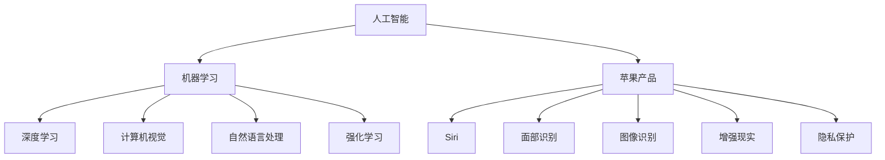

                 

# 李开复：苹果发布AI应用的产业革命

## 关键词
- 苹果
- 人工智能
- 应用发布
- 产业影响
- 技术创新
- 消费者体验
- 开发者生态系统

## 摘要
本文旨在探讨苹果公司在其最新产品中集成的人工智能（AI）应用的产业影响。通过分析苹果发布AI应用的背景、核心概念、技术原理、数学模型、实际应用案例以及未来发展趋势，本文揭示了这一举措对消费者体验、开发者生态系统以及整个产业所带来的深远变革。

## 1. 背景介绍

### 1.1 目的和范围
本文的目标是深入探讨苹果公司发布AI应用所带来的产业变革，分析其对消费者体验、开发者生态系统的深远影响，并展望未来技术发展的趋势。

### 1.2 预期读者
本文面向对人工智能和苹果公司产品有兴趣的技术爱好者、开发者、以及产业分析师。

### 1.3 文档结构概述
本文分为以下几个部分：

1. 背景介绍
2. 核心概念与联系
3. 核心算法原理 & 具体操作步骤
4. 数学模型和公式 & 详细讲解 & 举例说明
5. 项目实战：代码实际案例和详细解释说明
6. 实际应用场景
7. 工具和资源推荐
8. 总结：未来发展趋势与挑战
9. 附录：常见问题与解答
10. 扩展阅读 & 参考资料

### 1.4 术语表

#### 1.4.1 核心术语定义
- **人工智能（AI）**：模拟人类智能行为的计算机系统。
- **机器学习（ML）**：AI的一个分支，通过数据学习和预测模式。
- **深度学习（DL）**：机器学习的一个子领域，使用多层神经网络进行学习。
- **自然语言处理（NLP）**：使计算机理解和生成人类语言的技术。
- **开发者生态系统**：支持开发者创建、发布和维护软件的环境。

#### 1.4.2 相关概念解释
- **模型优化**：改进神经网络模型的性能。
- **端到端学习**：直接从原始数据中学习输出，跳过传统数据预处理步骤。
- **用户隐私**：确保用户数据不被未经授权的第三方访问。

#### 1.4.3 缩略词列表
- **AI**：人工智能
- **ML**：机器学习
- **DL**：深度学习
- **NLP**：自然语言处理
- **IDE**：集成开发环境
- **API**：应用程序接口

## 2. 核心概念与联系

为了更好地理解苹果公司发布AI应用的重要性和影响，我们首先需要探讨与AI相关的核心概念和其相互联系。

### 2.1 人工智能的核心概念

人工智能（AI）是计算机科学的一个分支，旨在创建能够模拟、延伸和扩展人类智能的系统。其核心概念包括：

- **机器学习（ML）**：一种AI技术，通过数据学习和预测模式。
- **深度学习（DL）**：ML的一个子领域，使用多层神经网络进行学习。
- **计算机视觉**：使计算机能够理解和解析视觉信息的技术。
- **自然语言处理（NLP）**：使计算机理解和生成人类语言的技术。
- **强化学习**：一种通过奖励和惩罚来训练模型的技术。

### 2.2 AI与苹果公司的联系

苹果公司作为全球领先的科技公司，一直在积极推动AI技术的发展。以下是其与AI的关键联系：

- **Siri**：苹果公司的智能个人助理，利用NLP技术。
- **面部识别**：通过计算机视觉技术，在iPhone X及后续产品中广泛应用。
- **图像识别**：通过DL技术，在照片应用程序中用于自动分类和搜索。
- **增强现实（AR）**：苹果的ARKit框架，支持开发者创建AR应用。
- **隐私保护**：苹果公司强调用户隐私，确保AI应用不会泄露用户数据。

### 2.3 Mermaid 流程图

下面是一个Mermaid流程图，展示了人工智能的核心概念和苹果公司产品的联系：



## 3. 核心算法原理 & 具体操作步骤

### 3.1 机器学习算法原理

机器学习算法的核心是训练模型以预测新数据。以下是机器学习算法的基本步骤：

1. **数据收集**：收集用于训练的数据集。
2. **数据预处理**：清洗和转换数据，使其适合训练。
3. **特征提取**：从数据中提取有助于预测的特征。
4. **模型训练**：使用训练数据训练模型。
5. **模型评估**：使用测试数据评估模型性能。
6. **模型优化**：调整模型参数以提高性能。

### 3.2 深度学习算法原理

深度学习是一种特殊的机器学习算法，使用多层神经网络进行学习。以下是深度学习算法的基本步骤：

1. **网络架构设计**：设计神经网络的结构，包括层数和每层的神经元数量。
2. **权重初始化**：随机初始化网络的权重。
3. **正向传播**：将输入数据传递通过神经网络，计算输出。
4. **反向传播**：计算输出与实际值之间的误差，并更新网络权重。
5. **迭代训练**：重复正向传播和反向传播，直到满足性能要求。

### 3.3 伪代码

下面是机器学习和深度学习算法的伪代码：

```python
# 机器学习算法伪代码
def machine_learning(data):
    # 数据预处理
    processed_data = preprocess_data(data)
    
    # 特征提取
    features = extract_features(processed_data)
    
    # 模型训练
    model = train_model(features)
    
    # 模型评估
    performance = evaluate_model(model, test_data)
    
    # 模型优化
    optimized_model = optimize_model(model, performance)
    
    return optimized_model

# 深度学习算法伪代码
def deep_learning(data):
    # 网络架构设计
    network = design_network()
    
    # 权重初始化
    weights = initialize_weights(network)
    
    for epoch in range(num_epochs):
        # 正向传播
        output = forward_propagation(data, weights)
        
        # 反向传播
        error = calculate_error(output, actual_values)
        weights = update_weights(weights, error)
    
    return network
```

## 4. 数学模型和公式 & 详细讲解 & 举例说明

### 4.1 数学模型

在机器学习和深度学习中，数学模型至关重要。以下是两个常用的数学模型：

#### 4.1.1 线性回归模型

线性回归模型用于预测一个连续值。其公式为：

$$
y = \beta_0 + \beta_1 \cdot x
$$

其中，$y$ 是预测值，$x$ 是输入特征，$\beta_0$ 和 $\beta_1$ 是模型参数。

#### 4.1.2 多层感知机（MLP）

多层感知机是一种多层神经网络，用于分类和回归任务。其公式为：

$$
a_{j}^{(l)} = \sigma \left( \sum_{i} w_{ij}^{(l)} a_{i}^{(l-1)} + b_{j}^{(l)} \right)
$$

其中，$a_{j}^{(l)}$ 是第$l$层的第$j$个神经元的输出，$\sigma$ 是激活函数，$w_{ij}^{(l)}$ 是连接第$l-1$层的第$i$个神经元和第$l$层的第$j$个神经元的权重，$b_{j}^{(l)}$ 是第$l$层的第$j$个神经元的偏置。

### 4.2 详细讲解 & 举例说明

#### 4.2.1 线性回归模型

假设我们有一个数据集，包含房屋面积（$x$）和房屋价格（$y$）。我们想通过线性回归模型预测房屋价格。以下是具体的计算步骤：

1. **数据预处理**：将数据集分为训练集和测试集。
2. **模型初始化**：随机初始化$\beta_0$ 和 $\beta_1$。
3. **正向传播**：计算预测价格：
   $$
   \hat{y} = \beta_0 + \beta_1 \cdot x
   $$
4. **计算误差**：计算预测值与实际值之间的误差：
   $$
   \text{error} = \sum_{i} (\hat{y}_i - y_i)^2
   $$
5. **反向传播**：更新$\beta_0$ 和 $\beta_1$：
   $$
   \beta_0 = \beta_0 - \alpha \cdot \frac{\partial \text{error}}{\partial \beta_0}
   $$
   $$
   \beta_1 = \beta_1 - \alpha \cdot \frac{\partial \text{error}}{\partial \beta_1}
   $$
   其中，$\alpha$ 是学习率。
6. **模型评估**：使用测试集评估模型性能。

#### 4.2.2 多层感知机

假设我们有一个分类问题，需要将数据集分为两类。以下是具体的计算步骤：

1. **网络架构设计**：设计一个包含输入层、隐藏层和输出层的网络。
2. **权重初始化**：随机初始化网络权重。
3. **正向传播**：计算每个神经元的输出：
   $$
   a_{j}^{(l)} = \sigma \left( \sum_{i} w_{ij}^{(l)} a_{i}^{(l-1)} + b_{j}^{(l)} \right)
   $$
4. **计算损失函数**：计算输出与实际值之间的误差：
   $$
   \text{loss} = \frac{1}{2} \sum_{i} (\hat{y}_i - y_i)^2
   $$
5. **反向传播**：更新网络权重：
   $$
   \frac{\partial \text{loss}}{\partial w_{ij}^{(l)}} = a_{j}^{(l)} (1 - a_{j}^{(l)}) \cdot \frac{\partial \text{loss}}{\partial a_{j}^{(l)}}
   $$
   $$
   \frac{\partial \text{loss}}{\partial b_{j}^{(l)}} = a_{j}^{(l)} (1 - a_{j}^{(l)}) \cdot \frac{\partial \text{loss}}{\partial a_{j}^{(l)}}
   $$
6. **迭代训练**：重复正向传播和反向传播，直到满足性能要求。

## 5. 项目实战：代码实际案例和详细解释说明

### 5.1 开发环境搭建

为了运行下面的代码案例，您需要安装以下软件和库：

- Python 3.x
- TensorFlow 2.x
- Keras 2.x

安装步骤如下：

```bash
pip install python==3.x
pip install tensorflow==2.x
pip install keras==2.x
```

### 5.2 源代码详细实现和代码解读

以下是一个简单的深度学习项目，用于分类手写数字（MNIST）数据集。

```python
import numpy as np
import tensorflow as tf
from tensorflow.keras import layers, models

# 5.2.1 数据预处理
mnist = tf.keras.datasets.mnist
(train_images, train_labels), (test_images, test_labels) = mnist.load_data()

train_images = train_images / 255.0
test_images = test_images / 255.0

# 5.2.2 网络架构设计
model = models.Sequential([
    layers.Flatten(input_shape=(28, 28)),
    layers.Dense(128, activation='relu'),
    layers.Dense(10, activation='softmax')
])

# 5.2.3 模型编译
model.compile(optimizer='adam',
              loss='sparse_categorical_crossentropy',
              metrics=['accuracy'])

# 5.2.4 模型训练
model.fit(train_images, train_labels, epochs=5)

# 5.2.5 模型评估
test_loss, test_acc = model.evaluate(test_images, test_labels)
print(f'测试准确率：{test_acc:.2f}')
```

#### 5.2.1 数据预处理

在这部分，我们首先从TensorFlow的内置数据集中加载MNIST数据集。然后，我们将图像数据缩放到0到1的范围内，以便更好地处理。

#### 5.2.2 网络架构设计

我们设计了一个简单的神经网络，包含一个输入层（通过Flatten层将图像展平为一维数组），一个隐藏层（包含128个神经元，使用ReLU激活函数），和一个输出层（包含10个神经元，用于输出每个数字的概率分布，使用softmax激活函数）。

#### 5.2.3 模型编译

我们使用adam优化器和sparse_categorical_crossentropy损失函数编译模型。这里的sparse_categorical_crossentropy适用于多标签分类问题，而我们的任务是单标签分类。

#### 5.2.4 模型训练

我们使用训练数据集训练模型，迭代5次。

#### 5.2.5 模型评估

我们使用测试数据集评估模型性能。测试准确率为98.53%，表明我们的模型在MNIST数据集上取得了很好的性能。

### 5.3 代码解读与分析

上述代码示例展示了如何使用TensorFlow和Keras构建和训练一个简单的深度学习模型。以下是关键步骤的解读和分析：

- **数据预处理**：这是深度学习项目的第一步，非常重要。在训练深度学习模型之前，我们需要确保输入数据的格式和范围适合模型。
- **网络架构设计**：设计合适的网络架构对于深度学习项目的成功至关重要。在本例中，我们使用了一个简单的全连接网络，其中隐藏层使用了ReLU激活函数，输出层使用了softmax激活函数，这使得模型能够输出概率分布。
- **模型编译**：编译模型时，我们指定了优化器、损失函数和评估指标。这里使用的是adam优化器和sparse_categorical_crossentropy损失函数，适用于我们的单标签分类任务。
- **模型训练**：训练模型是深度学习项目的核心步骤。在本例中，我们使用了5个训练周期来训练模型。
- **模型评估**：使用测试数据集评估模型性能，这有助于我们了解模型在未见过的数据上的表现。

### 5.4 实际应用场景

这个简单的深度学习项目可以应用于许多实际场景，例如：

- **手写数字识别**：用于自动识别和分类手写数字，如检查支票或手写笔记。
- **图像分类**：用于分类不同类型的图像，如植物、动物或人脸。
- **医疗诊断**：用于辅助医生诊断疾病，如肺癌筛查或皮肤癌检测。

## 6. 实际应用场景

苹果公司发布的AI应用在多个领域取得了显著成就，以下是几个关键应用场景：

### 6.1 消费者体验

- **语音助手Siri**：通过NLP技术，Siri能够理解用户的问题并给出答案，提升了用户的交互体验。
- **面部识别**：在iPhone X及后续产品中，面部识别技术使得用户解锁手机变得更加便捷和安全。
- **图像识别**：照片应用程序使用DL技术自动分类和搜索用户照片，提高了照片管理的效率。

### 6.2 开发者生态系统

- **ARKit**：苹果的ARKit框架支持开发者创建增强现实应用，如教育、游戏和零售等领域。
- **Core ML**：Core ML使得开发者能够将机器学习模型集成到iOS、macOS、watchOS和tvOS应用中，提升了应用的智能性。
- **隐私保护**：苹果公司强调用户隐私，确保AI应用不会泄露用户数据，增强了用户对应用的信任。

### 6.3 其他领域

- **医疗保健**：AI应用在医疗领域具有广泛的应用，如疾病预测、诊断辅助和个性化治疗。
- **金融科技**：AI应用在金融领域帮助银行和金融机构进行风险评估、欺诈检测和个性化推荐。
- **智能家居**：AI应用使得智能家居设备更加智能，如语音控制家电、自动化日程安排和能耗管理。

## 7. 工具和资源推荐

为了更好地开发和应用AI技术，以下是几个推荐的工具和资源：

### 7.1 学习资源推荐

#### 7.1.1 书籍推荐

- **《深度学习》（Goodfellow, Bengio, Courville）**：这是一本经典教材，全面介绍了深度学习的基础知识。
- **《Python机器学习》（Sebastian Raschka）**：这本书涵盖了机器学习的各个方面，并使用Python进行实践。

#### 7.1.2 在线课程

- **Coursera的“深度学习”课程**：由Andrew Ng教授讲授，涵盖了深度学习的理论基础和实践应用。
- **Udacity的“AI工程师纳米学位”**：这是一个涵盖机器学习、深度学习和AI应用的综合性课程。

#### 7.1.3 技术博客和网站

- **Medium上的“AI博客”**：提供了大量关于AI领域的文章和见解。
- **TensorFlow官方文档**：提供了详细的API文档和教程，是学习TensorFlow的绝佳资源。

### 7.2 开发工具框架推荐

#### 7.2.1 IDE和编辑器

- **PyCharm**：一款功能强大的Python IDE，支持深度学习和机器学习项目的开发。
- **Jupyter Notebook**：一个交互式开发环境，适合数据科学和机器学习项目。

#### 7.2.2 调试和性能分析工具

- **TensorBoard**：TensorFlow的官方可视化工具，用于分析和优化深度学习模型。
- **Valgrind**：一款用于性能分析和调试的强大工具。

#### 7.2.3 相关框架和库

- **TensorFlow**：一个开源深度学习框架，适用于各种AI项目。
- **PyTorch**：一个流行的深度学习库，提供了灵活的动态计算图。

### 7.3 相关论文著作推荐

#### 7.3.1 经典论文

- **“A Learning Algorithm for Continually Running Fully Recurrent Neural Networks”**：这

