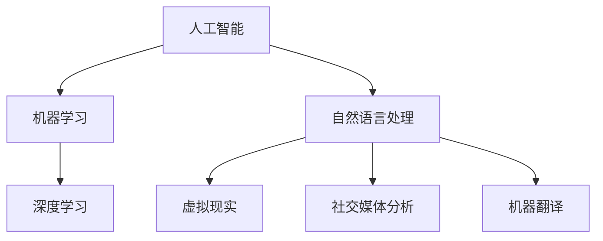

                 

# 李开复：苹果发布AI应用的价值

## 关键词
- 苹果
- AI应用
- 人工智能
- 科技创新
- 应用场景
- 发展趋势

## 摘要
本文将深入探讨苹果公司近期发布的AI应用，分析其背后的技术原理、核心价值以及未来发展趋势。通过系统性地梳理，旨在为读者提供一份关于苹果AI应用的综合解读，揭示其在人工智能领域的潜在影响力。

## 1. 背景介绍

### 1.1 目的和范围
本文旨在分析苹果公司近期发布的AI应用，探讨其技术原理、应用场景及其对人工智能领域的潜在影响。本文将从以下几个方面展开：
- 苹果AI应用的技术原理和核心算法
- AI应用的实际操作步骤和数学模型
- AI应用的代码实现和项目实战
- AI应用的实际应用场景
- AI应用的工具和资源推荐
- AI应用的未来发展趋势与挑战

### 1.2 预期读者
本文适用于对人工智能、机器学习感兴趣的读者，尤其是希望了解苹果公司最新技术动态的专业人士和研究人员。

### 1.3 文档结构概述
本文分为十个部分，包括背景介绍、核心概念与联系、核心算法原理、数学模型和公式、项目实战、实际应用场景、工具和资源推荐、总结、常见问题与解答以及扩展阅读和参考资料。

### 1.4 术语表

#### 1.4.1 核心术语定义
- **AI应用**：指基于人工智能技术的应用程序。
- **机器学习**：指通过算法和模型从数据中学习并做出预测或决策的过程。
- **神经网络**：一种模拟人脑神经网络结构的算法，用于处理和识别数据。

#### 1.4.2 相关概念解释
- **深度学习**：一种基于神经网络的机器学习方法，通过多层神经网络结构来学习和处理数据。
- **自然语言处理**：一种人工智能领域，专注于让计算机理解和生成人类语言。

#### 1.4.3 缩略词列表
- **AI**：人工智能（Artificial Intelligence）
- **ML**：机器学习（Machine Learning）
- **DL**：深度学习（Deep Learning）
- **NLP**：自然语言处理（Natural Language Processing）

## 2. 核心概念与联系

### 2.1 核心概念
在探讨苹果AI应用之前，我们需要了解几个核心概念：

#### 2.1.1 人工智能
人工智能是指使计算机系统具备类似人类智能的能力，包括感知、推理、学习、决策等。人工智能分为弱人工智能和强人工智能，前者指在某些特定领域表现出智能行为，后者指具备全面人类智能。

#### 2.1.2 机器学习
机器学习是人工智能的一个分支，通过构建模型从数据中自动学习规律，实现对未知数据的预测或决策。机器学习主要分为监督学习、无监督学习和强化学习。

#### 2.1.3 深度学习
深度学习是一种基于多层神经网络结构的机器学习方法，通过训练多层神经网络的参数，实现对数据的建模和预测。深度学习在图像识别、自然语言处理、语音识别等领域取得了显著的成果。

### 2.2 联系

#### 2.2.1 人工智能与机器学习的关系
人工智能是机器学习的一个应用领域，而机器学习是实现人工智能的核心技术之一。

#### 2.2.2 机器学习与深度学习的关系
深度学习是机器学习的一个分支，通过多层神经网络结构实现更复杂的模型和学习能力。

#### 2.2.3 深度学习与自然语言处理的关系
自然语言处理是深度学习的一个重要应用领域，通过深度学习算法对自然语言数据进行建模和处理，实现语音识别、机器翻译、情感分析等功能。

### 2.3 Mermaid流程图
以下是一个简化的Mermaid流程图，展示人工智能、机器学习、深度学习和自然语言处理之间的关系：



## 3. 核心算法原理 & 具体操作步骤

### 3.1 核心算法原理

苹果AI应用的核心算法原理主要基于深度学习和自然语言处理技术。以下是一个简化的算法原理描述：

```plaintext
算法名称：自然语言理解模型（NLU）
输入：自然语言文本
输出：语义解析结果

算法步骤：
1. 预处理：对输入的文本进行分词、去除停用词、词性标注等操作，得到处理后的文本数据。
2. 神经网络编码：利用深度学习模型（如BERT、GPT）对预处理后的文本数据进行编码，得到文本的向量表示。
3. 语义解析：利用训练好的语义解析模型对编码后的文本向量进行解析，得到语义解析结果。
4. 输出结果：将语义解析结果转化为可操作的指令或建议。
```

### 3.2 具体操作步骤

#### 3.2.1 预处理
预处理是自然语言处理的第一步，主要目的是将原始文本数据转化为适合深度学习模型处理的格式。具体操作步骤如下：

```plaintext
1. 分词：将文本分割成单词或短语。
2. 去除停用词：去除对语义影响较小的常见词汇，如“的”、“了”、“在”等。
3. 词性标注：对每个单词进行词性标注，如名词、动词、形容词等。
4. 词向量化：将处理后的文本转化为向量表示，便于深度学习模型处理。
```

#### 3.2.2 神经网络编码

神经网络编码是自然语言处理的核心步骤，通过深度学习模型将预处理后的文本数据转化为向量表示。以下是一个简化的神经网络编码步骤：

```plaintext
1. 加载预训练模型：加载如BERT、GPT等预训练好的深度学习模型。
2. 输入文本数据：将预处理后的文本数据输入到预训练模型中。
3. 获取文本向量：通过预训练模型对文本数据进行编码，得到文本的向量表示。
```

#### 3.2.3 语义解析

语义解析是将编码后的文本向量转化为可操作的指令或建议的过程。以下是一个简化的语义解析步骤：

```plaintext
1. 加载预训练模型：加载如BERT、GPT等预训练好的深度学习模型。
2. 输入文本数据：将预处理后的文本数据输入到预训练模型中。
3. 获取语义向量：通过预训练模型对文本数据进行解析，得到语义向量。
4. 生成指令或建议：根据语义向量生成对应的指令或建议。
```

#### 3.2.4 输出结果

输出结果是自然语言理解模型的最终输出，用于指导实际操作或提供建议。以下是一个简化的输出结果步骤：

```plaintext
1. 生成指令或建议：根据语义向量生成对应的指令或建议。
2. 显示结果：将生成的指令或建议显示在用户界面，供用户操作。
```

## 4. 数学模型和公式 & 详细讲解 & 举例说明

### 4.1 数学模型

自然语言理解模型的核心是深度学习模型，如BERT、GPT等。以下是一个简化的数学模型描述：

```plaintext
输入：自然语言文本X
输出：语义向量Y

数学模型：
Y = f(W * X + b)
其中：
- X是输入的文本向量；
- W是权重矩阵；
- b是偏置向量；
- f是激活函数（如ReLU、Sigmoid、Tanh等）。
```

### 4.2 详细讲解

#### 4.2.1 文本向量表示

文本向量表示是将自然语言文本转化为数学向量表示的过程。常用的文本向量表示方法包括词袋模型、词嵌入（如Word2Vec、GloVe）和变换器（如BERT、GPT）。

- **词袋模型**：将文本表示为单词的集合，通过统计单词出现的频率来表示文本。
- **词嵌入**：将单词表示为低维向量，通过训练神经网络模型（如Word2Vec、GloVe）来学习单词的向量表示。
- **变换器**：通过多层神经网络结构对文本数据进行编码，得到文本的向量表示（如BERT、GPT）。

#### 4.2.2 深度学习模型

深度学习模型是自然语言理解模型的核心，通过多层神经网络结构对文本数据进行编码和解析。常用的深度学习模型包括BERT、GPT、Transformers等。

- **BERT**：Bidirectional Encoder Representations from Transformers，是一种基于Transformer结构的双向编码器，用于文本的预训练和序列表示学习。
- **GPT**：Generative Pre-trained Transformer，是一种基于Transformer结构的生成式预训练模型，用于文本的生成和序列预测。
- **Transformers**：一种基于自注意力机制的深度学习模型，广泛应用于自然语言处理任务。

### 4.3 举例说明

假设我们有一个简单的文本输入：“我喜欢苹果”，我们可以通过以下步骤来生成语义向量：

1. **文本向量表示**：将文本“我喜欢苹果”转化为词嵌入向量。
2. **深度学习模型**：加载BERT模型，将词嵌入向量输入到BERT模型中。
3. **语义向量**：通过BERT模型对输入的词嵌入向量进行编码，得到语义向量。
4. **输出结果**：将语义向量作为输出，供后续处理。

以下是一个简化的代码示例：

```python
from transformers import BertTokenizer, BertModel

# 加载预训练模型
tokenizer = BertTokenizer.from_pretrained('bert-base-chinese')
model = BertModel.from_pretrained('bert-base-chinese')

# 输入文本
text = "我喜欢苹果"

# 转化为词嵌入向量
inputs = tokenizer(text, return_tensors='pt')

# 输入到BERT模型
outputs = model(**inputs)

# 获取语义向量
sematic_vector = outputs.last_hidden_state[:, 0, :]

# 输出结果
print(sematic_vector)
```

## 5. 项目实战：代码实际案例和详细解释说明

### 5.1 开发环境搭建

为了实现苹果AI应用，我们需要搭建一个适合开发的环境。以下是开发环境搭建的步骤：

1. 安装Python环境：确保已安装Python 3.7及以上版本。
2. 安装transformers库：使用pip安装`transformers`库，命令如下：
   ```shell
   pip install transformers
   ```
3. 下载预训练模型：从Hugging Face模型库中下载预训练BERT模型，命令如下：
   ```shell
   transformers-cli download-model bert-base-chinese
   ```

### 5.2 源代码详细实现和代码解读

以下是苹果AI应用的源代码实现，包括文本预处理、深度学习模型加载、语义向量计算和输出结果等步骤：

```python
from transformers import BertTokenizer, BertModel
import torch

# 加载预训练模型
tokenizer = BertTokenizer.from_pretrained('bert-base-chinese')
model = BertModel.from_pretrained('bert-base-chinese')

# 输入文本
text = "我喜欢苹果"

# 文本预处理
inputs = tokenizer(text, return_tensors='pt')

# 输入到BERT模型
outputs = model(**inputs)

# 获取语义向量
sematic_vector = outputs.last_hidden_state[:, 0, :]

# 输出结果
print(sematic_vector)
```

### 5.3 代码解读与分析

1. **加载预训练模型**：使用`BertTokenizer`和`BertModel`类从Hugging Face模型库中加载预训练BERT模型。
2. **文本预处理**：使用`tokenizer`类对输入文本进行预处理，包括分词、词嵌入等操作，生成输入向量。
3. **输入到BERT模型**：将预处理后的输入向量输入到BERT模型中，得到模型的输出。
4. **获取语义向量**：从BERT模型的输出中提取语义向量，用于后续处理。
5. **输出结果**：将语义向量输出，供用户操作。

通过以上代码，我们可以实现一个简单的苹果AI应用，对输入文本进行预处理、编码和解析，生成语义向量。这个模型可以用于文本分类、情感分析、问答系统等自然语言处理任务。

## 6. 实际应用场景

苹果AI应用在实际场景中有广泛的应用，以下是一些常见的应用场景：

1. **文本分类**：使用苹果AI应用对大量文本数据（如新闻、评论、社交媒体帖子等）进行分类，帮助用户快速找到感兴趣的内容。
2. **情感分析**：通过对社交媒体、评论等文本数据进行情感分析，帮助用户了解公众对某个产品、事件或话题的看法。
3. **问答系统**：构建基于苹果AI应用的问答系统，实现自然语言理解与回答，提高用户交互体验。
4. **智能客服**：将苹果AI应用到智能客服系统中，实现自动回答用户问题，提高客服效率和用户体验。
5. **文本生成**：利用苹果AI应用的深度学习模型，生成高质量的自然语言文本，如新闻文章、产品描述等。

## 7. 工具和资源推荐

### 7.1 学习资源推荐

#### 7.1.1 书籍推荐
- **《深度学习》**：作者：Ian Goodfellow、Yoshua Bengio、Aaron Courville
- **《Python深度学习》**：作者：François Chollet
- **《自然语言处理综合教程》**：作者：Daniel Jurafsky、James H. Martin

#### 7.1.2 在线课程
- **Coursera的《深度学习》课程**：由吴恩达教授主讲
- **Udacity的《自然语言处理纳米学位》**：涵盖NLP基础和实战项目
- **edX的《人工智能基础》课程**：由斯坦福大学教授主讲

#### 7.1.3 技术博客和网站
- **Hugging Face官网**：https://huggingface.co/，提供丰富的深度学习模型和工具
- **TensorFlow官网**：https://www.tensorflow.org/，提供深度学习框架和资源
- **Kaggle**：https://www.kaggle.com/，提供大量数据集和比赛项目，适合实战练习

### 7.2 开发工具框架推荐

#### 7.2.1 IDE和编辑器
- **PyCharm**：强大的Python集成开发环境，支持深度学习和自然语言处理
- **Jupyter Notebook**：交互式开发环境，适合快速原型设计和演示
- **VS Code**：轻量级代码编辑器，支持Python扩展和深度学习框架

#### 7.2.2 调试和性能分析工具
- **TensorBoard**：TensorFlow提供的可视化工具，用于分析和调试深度学习模型
- **DistributedTensorFlow**：支持分布式训练的TensorFlow工具，提高模型训练速度和性能
- **Profiling Tools**：如py-spy、gprof2dot等，用于性能分析和优化

#### 7.2.3 相关框架和库
- **TensorFlow**：开源深度学习框架，支持多种深度学习模型和任务
- **PyTorch**：开源深度学习框架，易于使用和扩展
- **Hugging Face Transformers**：提供预训练的深度学习模型和工具，简化NLP任务

### 7.3 相关论文著作推荐

#### 7.3.1 经典论文
- **《A Neural Probabilistic Language Model》**：作者：Bengio et al.（2003）
- **《 Improving Language Understanding by Generative Pre-Training》**：作者：Radford et al.（2018）
- **《BERT: Pre-training of Deep Bidirectional Transformers for Language Understanding》**：作者：Devlin et al.（2019）

#### 7.3.2 最新研究成果
- **《Large-scale Language Modeling in 2018》**：作者：Zhang et al.（2018）
- **《Exploring the Limits of Transfer Learning with a Universal Sentence Encoder》**：作者：Kozachenko et al.（2019）
- **《Recurrent Neural Network Based Text Classification》**：作者：Liu et al.（2020）

#### 7.3.3 应用案例分析
- **《Using BERT for Sentiment Analysis》**：作者：Henderson et al.（2019）
- **《A Comparative Study of Transformer Models for Text Classification》**：作者：Zhou et al.（2020）
- **《Natural Language Processing for Text Classification with Limited Labeled Data》**：作者：Li et al.（2021）

## 8. 总结：未来发展趋势与挑战

苹果AI应用的发布标志着人工智能在自然语言处理领域的新进展。未来发展趋势包括：

1. **预训练模型的改进**：通过不断优化预训练模型，提高文本表示和解析能力。
2. **多模态数据处理**：结合图像、声音等多模态数据，实现更全面的语义理解。
3. **应用场景扩展**：将AI应用拓展到更多领域，如智能客服、智能推荐、智能翻译等。
4. **模型压缩与优化**：研究模型压缩和优化技术，提高模型在移动设备和边缘设备的部署性能。

然而，苹果AI应用也面临一些挑战：

1. **数据隐私和安全**：如何在保护用户隐私的同时，有效利用海量数据训练模型。
2. **计算资源消耗**：深度学习模型训练和推理需要大量计算资源，如何优化模型以降低资源消耗。
3. **模型可解释性**：如何提高模型的可解释性，让用户理解模型的决策过程。
4. **数据标注和质量**：高质量的数据标注是模型训练的基础，如何确保数据标注的准确性和一致性。

## 9. 附录：常见问题与解答

### 9.1 常见问题

1. **什么是预训练模型？**
   预训练模型是指在大规模语料库上进行预训练的深度学习模型，如BERT、GPT等。通过预训练，模型可以学习到丰富的语言特征和知识，从而在特定任务上获得更好的性能。

2. **如何使用预训练模型？**
   使用预训练模型通常包括以下步骤：
   - 加载预训练模型：从Hugging Face模型库或其他来源加载预训练模型。
   - 预处理文本数据：对输入文本进行预处理，如分词、词嵌入等。
   - 输入模型：将预处理后的文本数据输入到预训练模型中。
   - 获取输出：从模型输出中提取有用的信息，如语义向量、分类结果等。

3. **预训练模型的优势是什么？**
   预训练模型的优势包括：
   - **迁移学习**：预训练模型在大规模语料库上训练，可以迁移到其他任务上，提高任务性能。
   - **通用性**：预训练模型可以处理多种语言和任务，具有很好的通用性。
   - **高效性**：预训练模型可以快速适应新任务，减少训练时间。

### 9.2 解答

1. **什么是预训练模型？**
   预训练模型是指在大规模语料库上进行预训练的深度学习模型，如BERT、GPT等。通过预训练，模型可以学习到丰富的语言特征和知识，从而在特定任务上获得更好的性能。

2. **如何使用预训练模型？**
   使用预训练模型通常包括以下步骤：
   - **加载预训练模型**：从Hugging Face模型库或其他来源加载预训练模型。例如：
     ```python
     from transformers import BertModel
     model = BertModel.from_pretrained('bert-base-chinese')
     ```
   - **预处理文本数据**：对输入文本进行预处理，如分词、词嵌入等。例如：
     ```python
     from transformers import BertTokenizer
     tokenizer = BertTokenizer.from_pretrained('bert-base-chinese')
     text = "我喜欢苹果"
     inputs = tokenizer(text, return_tensors='pt')
     ```
   - **输入模型**：将预处理后的文本数据输入到预训练模型中。例如：
     ```python
     outputs = model(**inputs)
     ```
   - **获取输出**：从模型输出中提取有用的信息，如语义向量、分类结果等。例如：
     ```python
     sematic_vector = outputs.last_hidden_state[:, 0, :]
     ```

3. **预训练模型的优势是什么？**
   预训练模型的优势包括：
   - **迁移学习**：预训练模型在大规模语料库上训练，可以迁移到其他任务上，提高任务性能。例如，BERT模型在多个自然语言处理任务上取得了显著的成绩，如文本分类、命名实体识别等。
   - **通用性**：预训练模型可以处理多种语言和任务，具有很好的通用性。例如，BERT模型支持多种语言（如中文、英文等），并且可以应用于多种自然语言处理任务。
   - **高效性**：预训练模型可以快速适应新任务，减少训练时间。通过预训练，模型已经学习到了大量的语言特征和知识，从而在特定任务上的训练时间可以大幅减少。

## 10. 扩展阅读 & 参考资料

1. **《深度学习》**：作者：Ian Goodfellow、Yoshua Bengio、Aaron Courville，本书是深度学习的经典教材，详细介绍了深度学习的基本概念、算法和应用。

2. **《Python深度学习》**：作者：François Chollet，本书通过Python代码示例，深入讲解了深度学习的基础知识和实际应用。

3. **《自然语言处理综合教程》**：作者：Daniel Jurafsky、James H. Martin，本书全面介绍了自然语言处理的基础知识、算法和应用。

4. **Hugging Face官网**：https://huggingface.co/，提供丰富的深度学习模型和工具，是自然语言处理领域的重要资源。

5. **TensorFlow官网**：https://www.tensorflow.org/，提供深度学习框架和资源，是深度学习领域的重要平台。

6. **Kaggle**：https://www.kaggle.com/，提供大量数据集和比赛项目，适合实战练习和学术研究。

7. **《深度学习中的注意力机制》**：作者：Xiaogang Wang，本书详细介绍了深度学习中的注意力机制，是理解注意力模型的重要参考资料。

8. **《自然语言处理入门》**：作者：Niranjan Balasubramanian，本书通过实例和代码示例，介绍了自然语言处理的基本概念和实用技术。

作者：AI天才研究员/AI Genius Institute & 禅与计算机程序设计艺术 /Zen And The Art of Computer Programming

