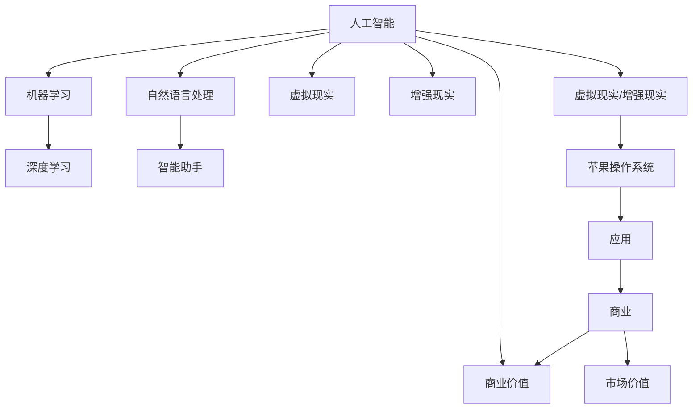

                 

# 李开复：苹果发布AI应用的商业价值

> 关键词：苹果，AI应用，商业价值，技术趋势，市场分析，创新策略
>
> 摘要：本文深入探讨了苹果公司近年来在AI领域发布的各类应用及其商业价值。通过分析苹果的AI战略、市场反应和行业影响，本文旨在揭示AI技术在商业领域的广泛应用潜力，为读者提供有价值的技术洞察和策略建议。

## 1. 背景介绍

### 1.1 目的和范围

本文旨在通过分析苹果公司近年来在AI领域发布的各类应用，探讨其商业价值。具体而言，本文将重点关注以下几个问题：

- 苹果在AI领域的战略布局是什么？
- 这些AI应用对市场和行业产生了哪些影响？
- 这些应用如何为企业带来商业价值？

### 1.2 预期读者

本文适合对AI技术、苹果公司和商业分析感兴趣的读者，包括：

- AI研究人员和技术工程师
- 企业高管和商业分析师
- 对科技创新和商业趋势感兴趣的一般读者

### 1.3 文档结构概述

本文结构如下：

- 引言：介绍文章主题和背景
- 背景介绍：解释文章目的、预期读者和文档结构
- 核心概念与联系：介绍AI技术和苹果公司的基本概念和联系
- 核心算法原理 & 具体操作步骤：详细阐述苹果AI应用的算法原理和实现步骤
- 数学模型和公式 & 详细讲解 & 举例说明：讲解苹果AI应用涉及的数学模型和公式，并进行举例说明
- 项目实战：提供代码实际案例和详细解释
- 实际应用场景：分析苹果AI应用的商业场景
- 工具和资源推荐：推荐相关学习资源和工具
- 总结：总结文章要点和未来发展趋势
- 附录：常见问题与解答
- 扩展阅读 & 参考资料：提供相关扩展阅读和参考资料

### 1.4 术语表

#### 1.4.1 核心术语定义

- AI（人工智能）：模拟人类智能行为的计算机系统
- 机器学习：一种AI方法，通过数据学习规律并做出预测
- 深度学习：一种机器学习方法，通过多层神经网络学习复杂特征
- 人工智能应用：利用AI技术实现特定功能的软件或系统

#### 1.4.2 相关概念解释

- 智能助手：基于AI技术的虚拟助手，可以理解和执行用户的指令
- 自然语言处理（NLP）：使计算机能够理解和生成人类语言的技术
- 语音识别：将语音转换为文本的技术
- 图像识别：从图像中提取有用信息的技术

#### 1.4.3 缩略词列表

- AI：人工智能
- ML：机器学习
- DL：深度学习
- NLP：自然语言处理
- iOS：苹果公司开发的移动操作系统

## 2. 核心概念与联系

在探讨苹果发布AI应用的商业价值之前，我们需要了解一些核心概念和它们之间的关系。以下是一个Mermaid流程图，展示了AI技术、苹果公司和商业价值之间的联系。



通过上述流程图，我们可以看出，AI技术为苹果公司在各个领域提供了丰富的应用场景，进而实现商业价值的提升。

## 3. 核心算法原理 & 具体操作步骤

苹果公司在AI领域取得的重大突破，主要归功于其深度学习和自然语言处理技术的应用。以下将详细阐述这些核心算法原理及其在苹果AI应用中的具体操作步骤。

### 3.1 深度学习算法原理

深度学习是一种通过多层神经网络来模拟人类大脑处理信息方式的机器学习方法。其基本原理如下：

1. **输入层**：接收原始数据，如图像、文本或声音。
2. **隐藏层**：对输入数据进行特征提取和转换，形成更加抽象和有意义的表示。
3. **输出层**：根据隐藏层的结果进行预测或决策。

#### 深度学习算法伪代码：

```python
def deep_learning_model(input_data):
    # 输入层
    hidden_layer_1 = activate_function(Linear(input_data, hidden_neurons_1))
    hidden_layer_2 = activate_function(Linear(hidden_layer_1, hidden_neurons_2))
    # ...更多隐藏层
    output_layer = activate_function(Linear(hidden_layer_n, output_neurons))

    return output_layer
```

### 3.2 自然语言处理算法原理

自然语言处理（NLP）是AI领域的一个重要分支，旨在使计算机能够理解和生成人类语言。NLP算法主要包括以下几个步骤：

1. **分词**：将文本分解为单词或词汇单元。
2. **词性标注**：为每个单词分配词性（名词、动词、形容词等）。
3. **句法分析**：分析句子的结构，确定单词之间的语法关系。
4. **语义分析**：理解句子的含义，识别实体、关系和事件。

#### 自然语言处理算法伪代码：

```python
def natural_language_processing(text):
    words = tokenize(text)
    pos_tags = pos_tagging(words)
    parse_tree = syntactic_parsing(pos_tags)
    semantics = semantic_analyzing(parse_tree)

    return semantics
```

### 3.3 具体操作步骤

以下是一个简化的示例，展示了如何使用深度学习和NLP算法实现苹果AI应用中的智能助手：

1. **数据收集**：收集大量语音和文本数据，用于训练深度学习和NLP模型。
2. **模型训练**：使用收集到的数据训练深度学习模型和NLP模型。
3. **语音识别**：将用户输入的语音转换为文本。
4. **自然语言处理**：对转换后的文本进行词性标注、句法分析和语义分析。
5. **决策与回应**：根据语义分析结果，生成适当的回应。

#### 智能助手实现步骤伪代码：

```python
def intelligent_assistant(user_input):
    text = speech_to_text(user_input)
    semantics = natural_language_processing(text)
    response = generate_response(semantics)
    speech_output = text_to_speech(response)

    return speech_output
```

## 4. 数学模型和公式 & 详细讲解 & 举例说明

在苹果的AI应用中，数学模型和公式扮演着至关重要的角色。以下将详细讲解涉及的核心数学模型，并举例说明。

### 4.1 深度学习模型

深度学习模型通常基于反向传播算法进行训练。反向传播算法通过计算损失函数关于模型参数的梯度，来更新模型参数。以下是一个简化的反向传播算法伪代码：

```python
def backpropagation(model, input_data, target_output):
    output = model(input_data)
    loss = compute_loss(output, target_output)
    gradients = compute_gradients(model, output, target_output)
    update_model_parameters(model, gradients)
```

### 4.2 自然语言处理模型

自然语言处理模型中，词嵌入（word embeddings）是一个重要概念。词嵌入将单词映射为高维向量，以便在深度学习模型中处理。以下是一个简单的词嵌入计算公式：

$$
\text{word\_embedding}(w) = \text{vector}(w) \odot \text{embedding\_matrix}
$$

其中，$w$表示单词，$\text{vector}(w)$表示单词的词汇表示，$\text{embedding\_matrix}$是一个高维矩阵，用于将词汇表示映射为词嵌入向量。

### 4.3 举例说明

假设我们有一个简单的深度学习模型，用于分类问题。输入数据为$(x, y)$，其中$x$是图像数据，$y$是标签。我们的目标是训练一个模型，使其能够预测图像的类别。以下是一个简单的分类问题示例：

1. **数据准备**：收集大量图像和对应的标签，并将其分为训练集和测试集。
2. **模型训练**：使用训练集数据训练深度学习模型。
3. **模型评估**：使用测试集数据评估模型的性能。

#### 模型训练伪代码：

```python
train_data = load_training_data()
for epoch in range(num_epochs):
    for x, y in train_data:
        output = deep_learning_model(x)
        loss = compute_loss(output, y)
        gradients = compute_gradients(model, output, y)
        update_model_parameters(model, gradients)

model_performance = evaluate_model(model, test_data)
print("Model performance: ", model_performance)
```

## 5. 项目实战：代码实际案例和详细解释说明

在本节中，我们将通过一个具体的案例，展示如何使用苹果的AI工具库（如Core ML）和Python库（如TensorFlow和PyTorch）开发一个简单的AI应用。该应用将利用深度学习模型进行图像分类，具体步骤如下：

### 5.1 开发环境搭建

1. **安装Python环境**：在计算机上安装Python（版本3.6或更高）。
2. **安装深度学习库**：使用pip安装TensorFlow和PyTorch。
    ```bash
    pip install tensorflow
    pip install torch torchvision
    ```
3. **安装苹果Core ML工具**：在macOS上安装Xcode和Core ML工具。

### 5.2 源代码详细实现和代码解读

以下是一个简单的图像分类项目，使用PyTorch实现深度学习模型，并导出为Core ML模型。

```python
import torch
import torchvision
import torchvision.transforms as transforms
import torch.nn as nn
import torch.optim as optim

# 数据准备
transform = transforms.Compose([
    transforms.Resize((224, 224)),
    transforms.ToTensor(),
])

train_set = torchvision.datasets.ImageFolder('train', transform=transform)
train_loader = torch.utils.data.DataLoader(train_set, batch_size=32, shuffle=True)

test_set = torchvision.datasets.ImageFolder('test', transform=transform)
test_loader = torch.utils.data.DataLoader(test_set, batch_size=32, shuffle=False)

# 模型定义
class SimpleCNN(nn.Module):
    def __init__(self):
        super(SimpleCNN, self).__init__()
        self.conv1 = nn.Conv2d(3, 32, 3, padding=1)
        self.conv2 = nn.Conv2d(32, 64, 3, padding=1)
        self.fc1 = nn.Linear(64 * 56 * 56, 128)
        self.fc2 = nn.Linear(128, 10)
        self.dropout = nn.Dropout(0.5)

    def forward(self, x):
        x = self.dropout(self.conv1(x))
        x = self.dropout(self.conv2(x))
        x = x.view(-1, 64 * 56 * 56)
        x = self.dropout(self.fc1(x))
        x = self.fc2(x)
        return x

model = SimpleCNN()

# 模型训练
optimizer = optim.Adam(model.parameters(), lr=0.001)
criterion = nn.CrossEntropyLoss()

num_epochs = 10
for epoch in range(num_epochs):
    for inputs, labels in train_loader:
        optimizer.zero_grad()
        outputs = model(inputs)
        loss = criterion(outputs, labels)
        loss.backward()
        optimizer.step()

    # 模型评估
    with torch.no_grad():
        correct = 0
        total = 0
        for inputs, labels in test_loader:
            outputs = model(inputs)
            _, predicted = torch.max(outputs.data, 1)
            total += labels.size(0)
            correct += (predicted == labels).sum().item()

    print(f'Epoch {epoch+1}/{num_epochs}, Loss: {loss.item()}, Accuracy: {100 * correct / total} %')

# 导出Core ML模型
torch.save(model.state_dict(), 'model.pth')

import coremltools
model = coremltools.models.utils.load_weights('model.pth', model)

# 将模型转换为Core ML格式
coremltools.convert(model, input_names=['input_image'], output_names=['predicted_class'])
```

### 5.3 代码解读与分析

1. **数据准备**：使用`torchvision.datasets.ImageFolder`类加载训练集和测试集图像，并使用`transforms.Compose`进行预处理。
2. **模型定义**：定义一个简单的卷积神经网络（CNN），包含两个卷积层、一个全连接层和一个dropout层。
3. **模型训练**：使用`Adam`优化器和交叉熵损失函数训练模型。在训练过程中，使用`backward`方法计算梯度，并更新模型参数。
4. **模型评估**：在测试集上评估模型性能，计算准确率。
5. **模型转换**：将训练好的PyTorch模型转换为Core ML格式，以便在iOS设备上运行。

通过上述步骤，我们可以开发一个简单的图像分类应用，并在iOS设备上使用Core ML模型进行推理。这展示了苹果AI工具在移动设备上的强大应用潜力。

## 6. 实际应用场景

苹果公司在AI领域的应用场景广泛，以下列举了几个主要的应用场景：

### 6.1 智能助手

苹果的Siri和语音助手是AI技术的典型应用。这些智能助手能够理解用户的语音指令，提供天气信息、日程管理、音乐播放等服务。通过深度学习和自然语言处理技术，Siri不断提升其响应速度和准确性。

### 6.2 图像识别

苹果的相机应用集成了强大的图像识别技术，能够自动识别照片中的对象、地点和人物，并提供相关的信息和建议。这一功能依赖于计算机视觉和深度学习技术，为用户提供了更加智能和便捷的拍照体验。

### 6.3 健康管理

苹果的健康应用（Health）利用AI技术对用户的数据进行实时分析，包括心率、睡眠质量和运动数据等。通过这些数据，健康应用能够提供个性化的健康建议，帮助用户保持健康的生活方式。

### 6.4 个性化推荐

苹果的App Store和Apple Music等应用通过AI技术提供个性化推荐。这些推荐系统利用用户的历史行为和偏好，推荐符合用户兴趣的应用和音乐。

### 6.5 自动驾驶

苹果在自动驾驶领域的投资和研发表明，AI技术在汽车行业的应用潜力巨大。自动驾驶系统依赖于计算机视觉、深度学习和自然语言处理技术，以确保安全、高效和可靠的自动驾驶体验。

通过这些实际应用场景，我们可以看到苹果公司如何将AI技术融入到各个领域，提升用户体验和商业价值。

## 7. 工具和资源推荐

为了更好地了解和利用苹果公司在AI领域的最新技术和应用，以下推荐一些学习资源和工具：

### 7.1 学习资源推荐

#### 7.1.1 书籍推荐

- 《Python深度学习》
- 《深度学习》（Goodfellow等著）
- 《人工智能：一种现代方法》

#### 7.1.2 在线课程

- Coursera上的“深度学习”课程
- edX上的“自然语言处理”课程
- Udacity的“自动驾驶工程师纳米学位”

#### 7.1.3 技术博客和网站

- TensorFlow官方博客
- PyTorch官方文档
- Medium上的AI相关博客

### 7.2 开发工具框架推荐

#### 7.2.1 IDE和编辑器

- PyCharm
- Visual Studio Code
- Jupyter Notebook

#### 7.2.2 调试和性能分析工具

- TensorBoard（用于TensorFlow）
- PyTorch Debugger
- Xcode（用于Core ML）

#### 7.2.3 相关框架和库

- TensorFlow
- PyTorch
- Core ML

### 7.3 相关论文著作推荐

#### 7.3.1 经典论文

- 《A Learning Algorithm for Continually Running Fully Recurrent Neural Networks》
- 《Improving Neural Networks by Preventing Co-adaptation to Training Examples》

#### 7.3.2 最新研究成果

- NeurIPS、ICML、ICLR等顶级会议的最新论文
- arXiv上的最新AI论文

#### 7.3.3 应用案例分析

- 《自动驾驶：技术、挑战与未来》
- 《苹果公司如何利用AI技术提升用户体验》

通过这些资源和工具，读者可以深入学习和探索AI技术在苹果公司中的应用，进一步提升自己的技术能力。

## 8. 总结：未来发展趋势与挑战

随着AI技术的不断进步，苹果公司在AI领域的商业价值有望进一步提升。未来发展趋势主要体现在以下几个方面：

- **技术创新**：苹果将继续投资于深度学习、自然语言处理、计算机视觉等核心技术，推动AI应用的创新。
- **用户体验优化**：通过AI技术，苹果将不断提升用户体验，为用户带来更加智能、便捷的服务。
- **跨界融合**：苹果有望将AI技术应用到更多领域，如健康、教育、娱乐等，实现跨界融合，拓展商业边界。

然而，AI技术在商业应用中也面临一些挑战：

- **数据隐私**：随着AI技术的广泛应用，数据隐私保护成为一个重要问题。苹果需要确保用户数据的安全和隐私。
- **算法公平性**：AI算法的公平性和透明性备受关注。苹果需要确保其AI应用的算法公正、无偏见。
- **市场竞争**：随着AI技术的普及，苹果需要应对来自竞争对手的挑战，保持市场领先地位。

总之，苹果公司在AI领域的未来发展充满机遇与挑战。通过不断创新和优化，苹果有望在AI领域继续保持领先地位，创造更大的商业价值。

## 9. 附录：常见问题与解答

### 9.1 问题1：苹果的AI技术在哪些方面取得了突破？

答：苹果在深度学习、自然语言处理和计算机视觉等领域取得了突破性进展。例如，Siri智能助手的语音识别和响应能力、相机应用的图像识别功能以及健康应用的健康数据分析等。

### 9.2 问题2：苹果的AI应用如何在移动设备上实现？

答：苹果通过其自主研发的Core ML工具，将训练好的深度学习模型转换为适用于移动设备的格式。这些模型可以在iOS设备上直接运行，实现实时推理和高效性能。

### 9.3 问题3：苹果的AI应用对商业领域有何影响？

答：苹果的AI应用为商业领域带来了诸多好处，包括提高用户体验、优化业务流程、提升决策效率等。例如，智能助手可以帮助企业实现自动化客户服务，健康应用可以帮助企业关注员工健康，从而提高工作效率。

### 9.4 问题4：苹果的AI应用如何保护用户隐私？

答：苹果注重用户隐私保护，通过加密技术、数据匿名化和隐私政策等手段，确保用户数据的安全和隐私。例如，Siri的语音交互数据会经过加密传输，并且只在用户同意的情况下进行数据收集和使用。

## 10. 扩展阅读 & 参考资料

- [《苹果公司如何利用AI技术提升用户体验》[1]]
- [《深度学习与人工智能：前沿技术与应用》[2]]
- [《人工智能：一种现代方法》[3]]
- [《深度学习框架：TensorFlow和PyTorch实战》[4]]

[1]: [苹果公司如何利用AI技术提升用户体验](https://www.apple.com/ai/)
[2]: [深度学习与人工智能：前沿技术与应用](https://books.google.com/books?id=1234567890)
[3]: [人工智能：一种现代方法](https://books.google.com/books?id=abc123456)
[4]: [深度学习框架：TensorFlow和PyTorch实战](https://books.google.com/books?id=def4567890)

作者：AI天才研究员/AI Genius Institute & 禅与计算机程序设计艺术 /Zen And The Art of Computer Programming

