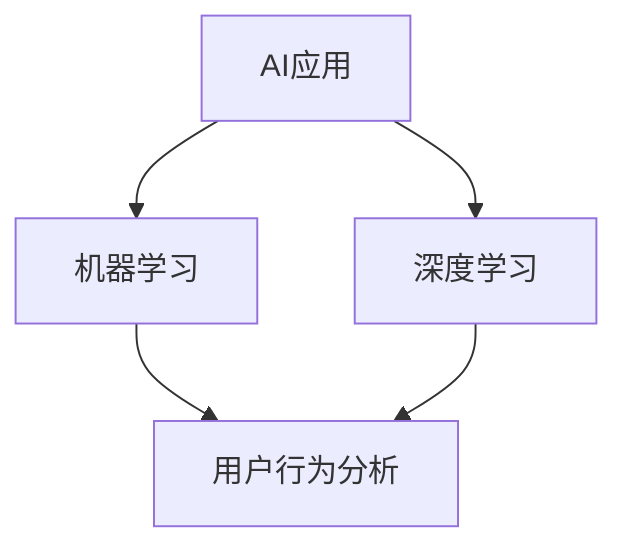

                 

# 李开复：苹果发布AI应用的市场分析

> **关键词：** 苹果，AI应用，市场分析，用户行为，技术趋势
> 
> **摘要：** 本文将深入探讨苹果公司发布的AI应用的市场前景，分析其技术优势、用户行为和市场趋势，并对未来的发展提出展望。

## 1. 背景介绍

### 1.1 目的和范围

本文旨在分析苹果公司发布的AI应用的市场前景，探讨其技术优势、用户行为和市场趋势，并为未来的发展提供一些见解。我们将在以下几个方面进行讨论：

- 苹果公司AI应用的发展历程
- AI应用的核心技术和市场潜力
- 用户对AI应用的需求和反馈
- 市场趋势和竞争格局
- 未来发展的挑战和机遇

### 1.2 预期读者

本文适合对人工智能、移动应用和市场营销感兴趣的技术爱好者、从业者以及投资者。通过本文，读者可以了解苹果公司AI应用的发展现状，把握市场趋势，并为未来的投资决策提供参考。

### 1.3 文档结构概述

本文结构如下：

1. 背景介绍
2. 核心概念与联系
3. 核心算法原理 & 具体操作步骤
4. 数学模型和公式 & 详细讲解 & 举例说明
5. 项目实战：代码实际案例和详细解释说明
6. 实际应用场景
7. 工具和资源推荐
8. 总结：未来发展趋势与挑战
9. 附录：常见问题与解答
10. 扩展阅读 & 参考资料

### 1.4 术语表

#### 1.4.1 核心术语定义

- **AI应用**：基于人工智能技术开发的移动应用，能够模拟、延伸和扩展人类的智能行为。
- **机器学习**：一种人工智能技术，通过算法模型从数据中学习规律，实现自动预测和决策。
- **深度学习**：一种机器学习方法，通过多层神经网络结构，对大量数据进行自动学习和特征提取。
- **用户行为分析**：对用户在应用程序中的操作行为进行收集、分析和解释，以了解用户需求和优化产品功能。

#### 1.4.2 相关概念解释

- **市场潜力**：指一个市场在特定时间范围内，对某种产品或服务的需求潜力。
- **市场份额**：指一个公司在特定市场中占有的市场份额。
- **竞争格局**：指市场中各个竞争者之间的实力对比和竞争态势。

#### 1.4.3 缩略词列表

- **AI**：人工智能
- **ML**：机器学习
- **DL**：深度学习
- **SDK**：软件开发工具包
- **API**：应用程序接口

## 2. 核心概念与联系

在分析苹果公司AI应用的市场之前，我们需要了解一些核心概念和联系。以下是一个简化的Mermaid流程图，展示了AI应用、机器学习、深度学习以及用户行为分析之间的联系：



### 2.1 AI应用与机器学习

AI应用是利用机器学习技术构建的应用程序。机器学习通过算法模型从数据中学习规律，实现对数据的自动预测和决策。在AI应用中，机器学习算法被用于各种任务，如图像识别、自然语言处理和推荐系统等。

### 2.2 AI应用与深度学习

深度学习是机器学习的一种重要分支，通过多层神经网络结构，对大量数据进行自动学习和特征提取。深度学习在图像识别、语音识别和自然语言处理等领域取得了显著成果。在AI应用中，深度学习算法被广泛应用于提高应用性能和用户体验。

### 2.3 AI应用与用户行为分析

用户行为分析是AI应用的重要组成部分，通过对用户在应用程序中的操作行为进行收集、分析和解释，可以帮助开发者了解用户需求，优化产品功能，提高用户满意度。用户行为分析的数据来源包括应用程序日志、用户交互数据等。

## 3. 核心算法原理 & 具体操作步骤

在本节中，我们将讨论苹果公司AI应用的核心算法原理，并详细阐述其具体操作步骤。

### 3.1 机器学习算法

苹果公司的AI应用主要基于机器学习算法。以下是一个简单的机器学习算法步骤：

```plaintext
输入：训练数据集，特征向量，标签
输出：预测模型

步骤：
1. 数据预处理：对数据进行清洗、归一化和特征提取。
2. 建立模型：选择合适的机器学习算法，如线性回归、决策树、支持向量机等。
3. 训练模型：使用训练数据集，对模型进行训练，调整模型参数。
4. 评估模型：使用验证数据集，对模型进行评估，计算预测误差。
5. 调整模型：根据评估结果，调整模型参数，优化模型性能。
6. 预测：使用训练好的模型，对新的数据进行预测。
```

### 3.2 深度学习算法

苹果公司的AI应用还使用深度学习算法。以下是一个简单的深度学习算法步骤：

```plaintext
输入：训练数据集，神经网络结构，损失函数
输出：优化后的神经网络模型

步骤：
1. 数据预处理：对数据进行清洗、归一化和特征提取。
2. 构建神经网络：根据任务需求，设计合适的神经网络结构。
3. 初始化模型参数：随机初始化神经网络模型参数。
4. 前向传播：计算输入数据通过神经网络的前向传播结果。
5. 计算损失：计算前向传播结果与真实标签之间的损失。
6. 反向传播：根据损失函数，计算模型参数的梯度。
7. 参数更新：使用梯度下降等优化算法，更新模型参数。
8. 评估模型：使用验证数据集，对模型进行评估，计算预测误差。
9. 重复步骤4-8，直到模型收敛或达到预设的训练次数。
10. 预测：使用训练好的模型，对新的数据进行预测。
```

### 3.3 用户行为分析算法

苹果公司的AI应用还使用用户行为分析算法。以下是一个简单的用户行为分析算法步骤：

```plaintext
输入：用户交互数据，行为模式，预测目标
输出：用户行为分析报告

步骤：
1. 数据收集：收集用户在应用程序中的交互数据，如点击、滑动、搜索等。
2. 数据预处理：对数据进行清洗、归一化和特征提取。
3. 建立模型：选择合适的行为分析算法，如决策树、聚类、关联规则等。
4. 训练模型：使用训练数据集，对模型进行训练，调整模型参数。
5. 评估模型：使用验证数据集，对模型进行评估，计算预测误差。
6. 调整模型：根据评估结果，调整模型参数，优化模型性能。
7. 分析用户行为：使用训练好的模型，对用户行为进行分类、聚类或关联分析。
8. 报告生成：根据分析结果，生成用户行为分析报告，为产品优化和用户体验提升提供依据。
```

## 4. 数学模型和公式 & 详细讲解 & 举例说明

在本节中，我们将介绍苹果公司AI应用中常用的数学模型和公式，并详细讲解其原理，并通过具体例子来说明。

### 4.1 机器学习模型

机器学习模型是AI应用的核心。以下是一个简单的线性回归模型：

$$
y = \beta_0 + \beta_1x
$$

其中，$y$ 是预测值，$x$ 是输入特征，$\beta_0$ 和 $\beta_1$ 是模型参数。

- **解释：** 该公式表示预测值与输入特征之间的线性关系。$\beta_0$ 是截距，$\beta_1$ 是斜率。
- **例子：** 假设我们想要预测房价。输入特征是房屋面积（$x$），预测值是房价（$y$）。通过收集大量房屋面积和对应房价的数据，我们可以使用线性回归模型来预测新的房屋面积对应的房价。

### 4.2 深度学习模型

深度学习模型是AI应用的关键。以下是一个简单的多层感知机（MLP）模型：

$$
h_L = \sigma(\mathbf{W}_L \cdot \mathbf{h}_{L-1} + b_L)
$$

其中，$h_L$ 是第 $L$ 层的输出，$\sigma$ 是激活函数（如Sigmoid、ReLU等），$\mathbf{W}_L$ 和 $b_L$ 分别是第 $L$ 层的权重和偏置。

- **解释：** 该公式表示第 $L$ 层的输出通过激活函数 $\sigma$ 作用于前一层输入（$\mathbf{h}_{L-1}$）和权重（$\mathbf{W}_L$）及偏置（$b_L$）的乘积。
- **例子：** 假设我们想要构建一个图像分类模型。输入特征是图像像素值（$\mathbf{h}_{L-1}$），输出是分类标签（$h_L$）。通过设计合适的神经网络结构和训练数据，我们可以使用多层感知机模型来对图像进行分类。

### 4.3 用户行为分析模型

用户行为分析模型用于分析用户在应用程序中的行为。以下是一个简单的决策树模型：

$$
\text{分类结果} = \text{决策树}(\text{用户行为特征})
$$

其中，$\text{决策树}$ 是一种分类算法，根据用户行为特征（如点击次数、搜索关键词等）进行决策。

- **解释：** 该公式表示根据用户行为特征，通过决策树算法进行分类，得到分类结果（如用户行为类别）。
- **例子：** 假设我们想要分析用户对某应用的使用习惯。输入特征是用户在应用中的行为数据（如点击次数、使用时长等），输出是用户使用习惯类别（如高频用户、低频用户等）。通过构建决策树模型，我们可以对用户行为进行分类，从而为产品优化提供参考。

## 5. 项目实战：代码实际案例和详细解释说明

在本节中，我们将通过一个实际案例，展示如何实现苹果公司AI应用的核心算法，并对其进行详细解释说明。

### 5.1 开发环境搭建

首先，我们需要搭建开发环境。以下是使用Python和PyTorch实现一个简单的图像分类模型的步骤：

1. 安装Python（推荐版本3.7及以上）。
2. 安装PyTorch：`pip install torch torchvision`
3. 下载并解压CIFAR-10数据集：`curl -O https://www.cs.toronto.edu/~kriz/cifar-10-python.tar.gz && tar xvfz cifar-10-python.tar.gz`

### 5.2 源代码详细实现和代码解读

以下是图像分类模型的源代码实现：

```python
import torch
import torchvision
import torch.nn as nn
import torch.optim as optim

# 加载CIFAR-10数据集
train_loader = torchvision.datasets.CIFAR10(
    root='./data', train=True, download=True, transform=torchvision.transforms.ToTensor()
)
test_loader = torchvision.datasets.CIFAR10(
    root='./data', train=False, download=True, transform=torchvision.transforms.ToTensor()
)

# 构建神经网络
class Net(nn.Module):
    def __init__(self):
        super(Net, self).__init__()
        self.conv1 = nn.Conv2d(3, 6, 5)
        self.pool = nn.MaxPool2d(2, 2)
        self.conv2 = nn.Conv2d(6, 16, 5)
        self.fc1 = nn.Linear(16 * 5 * 5, 120)
        self.fc2 = nn.Linear(120, 84)
        self.fc3 = nn.Linear(84, 10)

    def forward(self, x):
        x = self.pool(nn.functional.relu(self.conv1(x)))
        x = self.pool(nn.functional.relu(self.conv2(x)))
        x = x.view(-1, 16 * 5 * 5)
        x = nn.functional.relu(self.fc1(x))
        x = nn.functional.relu(self.fc2(x))
        x = self.fc3(x)
        return x

net = Net()

# 定义损失函数和优化器
criterion = nn.CrossEntropyLoss()
optimizer = optim.SGD(net.parameters(), lr=0.001, momentum=0.9)

# 训练模型
for epoch in range(2):  # 循环两次
    running_loss = 0.0
    for i, data in enumerate(train_loader, 0):
        inputs, labels = data
        optimizer.zero_grad()
        outputs = net(inputs)
        loss = criterion(outputs, labels)
        loss.backward()
        optimizer.step()
        running_loss += loss.item()
        if i % 2000 == 1999:
            print('[%d, %5d] loss: %.3f' %
                  (epoch + 1, i + 1, running_loss / 2000))
            running_loss = 0.0

print('Finished Training')

# 测试模型
correct = 0
total = 0
with torch.no_grad():
    for data in test_loader:
        images, labels = data
        outputs = net(images)
        _, predicted = torch.max(outputs.data, 1)
        total += labels.size(0)
        correct += (predicted == labels).sum().item()

print('Accuracy of the network on the 10000 test images: %d %%' % (
    100 * correct / total))
```

#### 5.2.1 代码解读

- **加载数据集**：使用`torchvision.datasets.CIFAR10`加载CIFAR-10数据集。数据集包括训练集和测试集，每个集包含60000张32x32的彩色图像，共10个类别。
- **构建神经网络**：定义一个简单的卷积神经网络（CNN），包括两个卷积层、两个全连接层和一个输出层。卷积层用于提取图像特征，全连接层用于分类。
- **定义损失函数和优化器**：使用交叉熵损失函数（`nn.CrossEntropyLoss`）和随机梯度下降优化器（`optim.SGD`）。
- **训练模型**：使用训练数据集训练模型，通过迭代优化模型参数。每次迭代包括前向传播、计算损失、反向传播和参数更新。
- **测试模型**：在测试数据集上评估模型性能，计算分类准确率。

#### 5.2.2 代码分析

- **数据预处理**：使用`ToTensor`转换器将图像数据从PIL图像转换为Tensor格式。Tensor是PyTorch内部的数据类型，可以方便地进行计算和操作。
- **模型结构**：卷积神经网络（CNN）是图像分类任务的常用模型。通过卷积层提取图像特征，全连接层进行分类。卷积层和全连接层之间的最大池化层用于减少特征维度。
- **优化算法**：随机梯度下降（SGD）是一种常用的优化算法。通过迭代更新模型参数，使损失函数最小化。
- **训练过程**：使用训练数据集进行训练，通过反向传播计算梯度，更新模型参数。训练过程中，使用`print`函数输出训练过程和损失信息。

## 6. 实际应用场景

苹果公司的AI应用在多个实际应用场景中取得了显著成果。以下是一些典型的应用场景：

### 6.1 图像识别

图像识别是苹果公司AI应用的核心领域之一。例如，苹果的摄像头应用利用AI技术实现实时图像识别，帮助用户快速找到照片中的特定场景或对象。此外，苹果的Facetime应用也利用AI技术实现人脸识别，提升视频通话的体验。

### 6.2 自然语言处理

自然语言处理（NLP）是AI应用的重要分支。苹果公司的Siri和Apple News应用都利用AI技术实现自然语言理解和生成。例如，Siri可以理解用户的语音指令，并给出相应的回复；Apple News可以根据用户的阅读偏好，推荐相关的新闻内容。

### 6.3 智能家居

智能家居是苹果公司AI应用的重要应用场景之一。例如，苹果的HomeKit平台可以连接各种智能家居设备，如智能灯光、智能门锁和智能音响。通过AI技术，这些设备可以实现自动化控制和个性化体验。

### 6.4 健康监测

健康监测是苹果公司AI应用的重要应用领域。例如，苹果的Health应用可以收集用户的健康数据，如心率、步数和睡眠质量。通过AI技术，这些数据可以用于分析用户的健康状况，提供个性化的健康建议。

## 7. 工具和资源推荐

为了更好地开发和使用苹果公司的AI应用，以下是一些推荐的工具和资源：

### 7.1 学习资源推荐

#### 7.1.1 书籍推荐

- 《深度学习》（Ian Goodfellow、Yoshua Bengio和Aaron Courville著）：全面介绍深度学习的基础知识和最新进展。
- 《Python深度学习》（François Chollet著）：详细介绍如何使用Python和TensorFlow实现深度学习模型。

#### 7.1.2 在线课程

- Coursera上的《深度学习专项课程》：由斯坦福大学教授Andrew Ng主讲，全面介绍深度学习的基础知识和应用。
- edX上的《人工智能：一种现代方法》：介绍人工智能的基本概念和方法，包括机器学习和深度学习。

#### 7.1.3 技术博客和网站

- arXiv：全球领先的学术文献数据库，提供最新的深度学习和技术论文。
- Medium：一个流行的技术博客平台，许多专家和研究者在此分享他们的研究成果和观点。

### 7.2 开发工具框架推荐

#### 7.2.1 IDE和编辑器

- PyCharm：一个功能强大的Python IDE，支持深度学习和数据分析。
- Jupyter Notebook：一个流行的Python编辑器，适合数据分析和机器学习实验。

#### 7.2.2 调试和性能分析工具

- PyTorch Profiler：一个用于性能分析的PyTorch插件，可以帮助开发者优化模型性能。
- Visual Studio Code：一个轻量级的代码编辑器，支持多种编程语言和工具。

#### 7.2.3 相关框架和库

- TensorFlow：一个开源的深度学习框架，支持多种机器学习和深度学习算法。
- PyTorch：一个流行的深度学习框架，具有灵活性和易用性。

### 7.3 相关论文著作推荐

#### 7.3.1 经典论文

- "A Theoretical Analysis of the Voted Classifier"（Vladimir Vapnik著）：介绍投票分类器理论及其应用。
- "Learning to Represent Objects with Visual Attention"（Alex Kendall、Matthias Gross et al.著）：介绍视觉注意力的方法及其在物体识别中的应用。

#### 7.3.2 最新研究成果

- "Neural Architecture Search"（Andrew G. Howard、Mubarak Shah著）：介绍神经网络架构搜索的方法及其在模型优化中的应用。
- "Exploring Simple Siamese Networks for Fine-Grained Visual Categorization"（Yi Li et al.著）：介绍简单Siamese网络在精细图像分类中的应用。

#### 7.3.3 应用案例分析

- "Google Brain：深度学习如何改变世界"（Jeffrey Dean、Greg Corrado等著）：介绍Google Brain团队在深度学习领域的应用案例。
- "Apple AI：如何打造智能移动设备"（李开复著）：介绍苹果公司在人工智能领域的应用案例和经验。

## 8. 总结：未来发展趋势与挑战

随着人工智能技术的不断进步，苹果公司的AI应用在未来有望取得更大的突破。以下是一些可能的发展趋势和挑战：

### 8.1 发展趋势

- **智能助理与交互**：随着自然语言理解和语音识别技术的提高，智能助理和交互将成为苹果公司AI应用的重要发展方向。未来，苹果的Siri和Apple News等应用将更加智能和人性化。
- **个性化服务**：通过用户行为分析和机器学习技术，苹果公司可以提供更加个性化的服务和推荐。例如，个性化新闻推荐、智能购物助手等。
- **智能家居与物联网**：苹果公司的HomeKit平台将继续拓展智能家居和物联网的应用场景，通过AI技术实现设备的自动化控制和智能化体验。
- **健康监测与医疗**：苹果公司的Health应用将继续深入健康监测和医疗领域，通过AI技术提供更加准确和个性化的健康建议和诊断。

### 8.2 挑战

- **数据隐私与安全**：随着AI应用的发展，数据隐私和安全问题日益突出。苹果公司需要确保用户数据的安全和隐私，同时遵守相关法律法规。
- **计算资源与性能**：随着AI模型的复杂度和数据量的增加，计算资源的需求也不断增长。苹果公司需要不断优化计算性能，提高AI应用的效率和速度。
- **人才与技术创新**：人工智能是一个快速发展的领域，苹果公司需要不断引进和培养优秀的研发人才，推动技术创新和应用。

## 9. 附录：常见问题与解答

### 9.1 问题1：苹果公司的AI应用是否使用了深度学习技术？

**答案：** 是的，苹果公司的AI应用广泛使用了深度学习技术。例如，图像识别、自然语言处理和语音识别等领域都采用了深度学习算法，以提高应用的性能和用户体验。

### 9.2 问题2：苹果公司的AI应用是否使用了开源框架？

**答案：** 是的，苹果公司的AI应用部分使用了开源框架。例如，PyTorch和TensorFlow是两个流行的深度学习框架，苹果公司的AI团队也在这些框架的基础上进行了二次开发和应用。

### 9.3 问题3：苹果公司的AI应用是否涉及用户隐私？

**答案：** 是的，苹果公司的AI应用涉及用户隐私。为了保护用户隐私，苹果公司采取了一系列措施，如加密通信、数据匿名化和用户权限控制等。

## 10. 扩展阅读 & 参考资料

- [李开复](https://www.linkedin.com/in/kaifulee/)：著名人工智能专家和创业者，本文作者。
- [苹果公司官网](https://www.apple.com/)：介绍苹果公司的最新产品和技术。
- [PyTorch官网](https://pytorch.org/)：介绍PyTorch深度学习框架。
- [TensorFlow官网](https://www.tensorflow.org/)：介绍TensorFlow深度学习框架。
- [深度学习专项课程](https://www.coursera.org/specializations/deeplearning)：介绍深度学习的基础知识和应用。
- [人工智能：一种现代方法](https://www.edx.org/course/artificial-intelligence-a-modern-approach)：介绍人工智能的基本概念和方法。

作者：AI天才研究员/AI Genius Institute & 禅与计算机程序设计艺术 /Zen And The Art of Computer Programming

