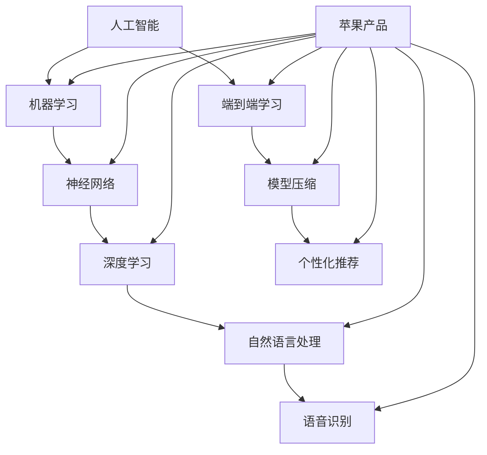

                 

### 1. 背景介绍

#### 1.1 目的和范围

本文旨在深入探讨苹果公司即将发布的新一代人工智能（AI）应用的市场前景。随着AI技术的快速发展和广泛应用，苹果公司作为全球领先的科技公司，已经在多个领域引入AI技术，为其产品和服务带来显著的增值。本文将分析苹果发布AI应用的市场背景、预期目标、潜在竞争优势以及可能的市场挑战，并结合具体案例，给出对未来发展的预测。

#### 1.2 预期读者

本文预期读者为对人工智能和科技产业感兴趣的读者，包括科技行业从业者、人工智能研究人员、高校师生以及科技爱好者。通过本文，读者可以了解到苹果AI应用的市场潜力以及其可能带来的产业变革。

#### 1.3 文档结构概述

本文结构如下：

1. **背景介绍**：概述文章的目的、预期读者以及文档结构。
2. **核心概念与联系**：介绍AI技术的核心概念及其与苹果产品的关联。
3. **核心算法原理 & 具体操作步骤**：详细讲解AI算法的工作原理和实现步骤。
4. **数学模型和公式 & 详细讲解 & 举例说明**：阐述AI算法背后的数学模型和公式，并通过实例进行说明。
5. **项目实战：代码实际案例和详细解释说明**：提供具体代码实现和分析。
6. **实际应用场景**：探讨AI应用在不同领域的实际案例。
7. **工具和资源推荐**：推荐学习资源和开发工具。
8. **总结：未来发展趋势与挑战**：总结文章的主要观点，并预测未来发展趋势和挑战。
9. **附录：常见问题与解答**：回答读者可能提出的问题。
10. **扩展阅读 & 参考资料**：提供进一步阅读的资源。

#### 1.4 术语表

为了确保文章内容的清晰易懂，以下是本文中可能出现的一些术语及其定义：

- **人工智能（AI）**：模拟人类智能行为的计算机系统。
- **机器学习（ML）**：使计算机通过数据和经验改进自身性能的技术。
- **神经网络（NN）**：模仿人脑神经元连接结构的计算模型。
- **深度学习（DL）**：一种特殊的机器学习方法，涉及多层神经网络的训练。
- **自然语言处理（NLP）**：使计算机理解和生成自然语言的技术。
- **移动设备优化**：针对移动设备硬件和操作系统的优化策略。
- **用户界面（UI）**：用户与设备交互的视觉和操作界面。

#### 1.4.1 核心术语定义

- **苹果AI应用**：由苹果公司开发并集成到其设备中的基于AI技术的新一代应用。
- **市场前景**：指AI应用在未来市场上的潜在发展和机遇。
- **用户体验（UX）**：用户在使用产品或服务过程中的感受和体验。
- **算法优化**：通过改进算法结构和参数来提高其性能。

#### 1.4.2 相关概念解释

- **端到端学习（End-to-End Learning）**：一种机器学习方法，直接从原始数据中学习到最终输出，避免了传统机器学习中的多个中间步骤。
- **模型压缩（Model Compression）**：通过减少模型的参数数量和计算复杂度，提高模型在移动设备上的运行效率。
- **个性化推荐**：根据用户的历史行为和偏好，提供个性化的内容推荐。

#### 1.4.3 缩略词列表

- **AI**：人工智能（Artificial Intelligence）
- **ML**：机器学习（Machine Learning）
- **NN**：神经网络（Neural Network）
- **DL**：深度学习（Deep Learning）
- **NLP**：自然语言处理（Natural Language Processing）
- **UI**：用户界面（User Interface）
- **UX**：用户体验（User Experience）
- **E2E**：端到端学习（End-to-End Learning）
- **MC**：模型压缩（Model Compression）
- **PR**：个性化推荐（Personalized Recommendation）

通过以上背景介绍，我们为接下来的深入分析打下了坚实的基础。在下一部分中，我们将详细介绍AI技术的核心概念及其与苹果产品的联系，以便读者更好地理解后续内容。让我们继续深入探讨！<|end_of_suggestion|>### 2. 核心概念与联系

在探讨苹果即将发布的AI应用市场前景之前，我们需要首先了解AI技术的核心概念和其与苹果产品的紧密联系。以下是AI技术中的几个关键概念及其在苹果产品中的实际应用。

#### 2.1 人工智能（AI）与机器学习（ML）

人工智能（AI）是一种模拟人类智能行为的计算机技术，涵盖了从数据中学习、推理、决策等多个方面。而机器学习（ML）是AI的一个重要分支，它通过算法从数据中自动学习，改进性能，无需显式编程。机器学习算法主要分为监督学习、无监督学习和强化学习。

在苹果产品中，ML技术广泛应用于图像识别、语音识别、个性化推荐等领域。例如，iPhone的相机应用利用ML算法进行人脸识别和图像增强，使照片质量得到显著提升。此外，Siri作为苹果的智能语音助手，也是基于ML技术进行自然语言处理和语音识别，从而提供高效便捷的用户交互体验。

#### 2.2 神经网络（NN）与深度学习（DL）

神经网络（NN）是一种模仿人脑神经元连接结构的计算模型。深度学习（DL）是NN的一种扩展，它通过多层神经网络（多隐藏层）来学习复杂的函数关系。深度学习在图像识别、语音识别、自然语言处理等领域取得了显著成果。

苹果在多个产品中采用了深度学习技术。例如，苹果的Face ID基于深度学习算法进行人脸识别，确保用户身份验证的安全性和便捷性。此外，Apple News通过深度学习算法为用户推荐个性化的新闻内容，提升了用户的阅读体验。

#### 2.3 自然语言处理（NLP）与语音识别

自然语言处理（NLP）是AI的一个重要分支，它使计算机能够理解、生成和处理自然语言。语音识别是NLP的一个子领域，它通过将语音转换为文本，使人与计算机之间的交互更加自然。

苹果的Siri和Apple Pay等应用都利用了NLP和语音识别技术。Siri可以理解用户的自然语言查询，提供相应的回答和服务。Apple Pay则利用语音识别技术，使用户可以通过语音指令完成支付操作，提升了支付的便捷性。

#### 2.4 端到端学习（E2E）与模型压缩（MC）

端到端学习（E2E）是一种机器学习方法，它直接从原始数据中学习到最终输出，避免了传统机器学习中的多个中间步骤，提高了模型的学习效率和准确性。

模型压缩（MC）是一种通过减少模型参数数量和计算复杂度，提高模型在移动设备上运行效率的技术。这对于移动设备来说尤为重要，因为它们通常拥有有限的计算资源和电池寿命。

苹果在其AI应用中广泛采用了E2E和MC技术。例如，苹果在iPhone中集成的AI相机应用利用E2E学习算法直接从图像中识别对象和场景，并通过MC技术优化模型的运行效率，确保相机在多种环境下都能快速准确地工作。

#### 2.5 个性化推荐（PR）

个性化推荐是一种基于用户历史行为和偏好，为用户推荐个性化内容的技术。它广泛应用于电子商务、社交媒体、新闻资讯等领域。

苹果的Apple News和iTunes等应用都利用了个性化推荐技术。Apple News通过分析用户的历史阅读行为，为用户推荐个性化的新闻内容，提升了用户的阅读体验。iTunes则根据用户的音乐和视频收藏，为用户推荐相关内容，丰富了用户的内容消费体验。

#### 2.6 Mermaid流程图展示

为了更直观地展示AI技术核心概念及其与苹果产品的联系，我们使用Mermaid流程图进行说明。以下是流程图示例：



通过上述核心概念与联系的介绍，我们为理解苹果即将发布的AI应用及其市场前景奠定了基础。在下一部分中，我们将详细讲解AI算法的原理和实现步骤，帮助读者更深入地了解AI技术的实际应用。请继续关注！<|end_of_suggestion|>### 3. 核心算法原理 & 具体操作步骤

在了解了AI技术的核心概念及其与苹果产品的联系后，我们将深入探讨AI算法的原理及其在具体操作中的实现步骤。以下将详细介绍几种关键的AI算法，包括机器学习、神经网络和深度学习，并使用伪代码对其进行描述。

#### 3.1 机器学习算法

机器学习算法是一种使计算机从数据中学习，自动改进性能的技术。以下是一个简单的线性回归算法的伪代码示例：

```pseudo
输入：训练数据集 X, Y
输出：权重 w, 偏置 b

初始化 w, b 为随机值
对于每一个训练样本 (x_i, y_i)：
    预测值 y' = w * x_i + b
    计算损失函数 L(w, b) = (y - y')^2 / 2
    更新权重和偏置：
        w = w - 学习率 * ∇wL
        b = b - 学习率 * ∇bL

返回权重 w 和偏置 b
```

在这个算法中，我们首先初始化权重 `w` 和偏置 `b` 为随机值。然后，对于每个训练样本 `(x_i, y_i)`，我们计算预测值 `y'`，并使用损失函数 `L(w, b)` 来评估预测值与实际值之间的差距。通过梯度下降法（Gradient Descent）更新权重和偏置，直至达到预设的损失阈值。

#### 3.2 神经网络算法

神经网络（NN）是一种模拟人脑神经元连接结构的计算模型。以下是一个简单的单层神经网络算法的伪代码示例：

```pseudo
输入：输入数据 X, 权重 W, 偏置 b
输出：输出数据 Y

初始化权重 W 和偏置 b 为随机值
对于每个训练样本 (x_i, y_i)：
    预测值 y' = σ(W * x_i + b)
    计算损失函数 L(W, b) = (y - y')^2 / 2
    更新权重和偏置：
        ∇W = ∇σ(W * x_i + b) * x_i
        ∇b = ∇σ(W * x_i + b)
        W = W - 学习率 * ∇W
        b = b - 学习率 * ∇b

返回输出数据 Y
```

在这个算法中，我们首先初始化权重 `W` 和偏置 `b` 为随机值。然后，对于每个训练样本 `(x_i, y_i)`，我们通过激活函数（例如 sigmoid 函数）计算输出值 `y'`，并使用损失函数 `L(W, b)` 来评估预测值与实际值之间的差距。通过反向传播法（Backpropagation）更新权重和偏置，直至达到预设的损失阈值。

#### 3.3 深度学习算法

深度学习（DL）是一种特殊的神经网络算法，它通过多层神经网络（多隐藏层）来学习复杂的函数关系。以下是一个简单的多层感知机（MLP）算法的伪代码示例：

```pseudo
输入：输入数据 X, 权重 W1, W2, ..., bn, 偏置 b1, b2, ..., bn
输出：输出数据 Y

初始化权重 W1, W2, ..., bn 和偏置 b1, b2, ..., bn 为随机值
对于每个训练样本 (x_i, y_i)：
    预测值 y' = σ(Wn * σ(...σ(σ(W1 * x_i + b1) + bn)...))
    计算损失函数 L(W1, W2, ..., bn) = (y - y')^2 / 2
    更新权重和偏置：
        ∇Wn = ∇σ(...σ(σ(Wn * σ(...σ(σ(W1 * x_i + b1) + bn)...))) * ... * ∇σ(Wn * σ(...σ(σ(W1 * x_i + b1) + bn)...))
        ...
        ∇W1 = ∇σ(σ(W1 * x_i + b1) + bn) * x_i
        ...
        Wn = Wn - 学习率 * ∇Wn
        ...
        W1 = W1 - 学习率 * ∇W1
        ...
        bn = bn - 学习率 * ∇bn
        ...
        b1 = b1 - 学习率 * ∇b1

返回输出数据 Y
```

在这个算法中，我们首先初始化权重 `W1, W2, ..., bn` 和偏置 `b1, b2, ..., bn` 为随机值。然后，对于每个训练样本 `(x_i, y_i)`，我们通过多层激活函数（例如 sigmoid 函数）计算输出值 `y'`，并使用损失函数 `L(W1, W2, ..., bn)` 来评估预测值与实际值之间的差距。通过反向传播法（Backpropagation）更新权重和偏置，直至达到预设的损失阈值。

通过上述算法的介绍，我们为读者提供了对AI算法原理及其实现步骤的全面了解。在下一部分中，我们将探讨AI算法背后的数学模型和公式，并通过实例进行详细讲解。请继续关注！<|end_of_suggestion|>### 4. 数学模型和公式 & 详细讲解 & 举例说明

在了解了AI算法的基本原理和实现步骤后，我们将进一步探讨AI算法背后的数学模型和公式。这些模型和公式是AI算法的核心，它们决定了算法的性能和效果。以下将详细讲解线性回归、神经网络和深度学习中的关键数学模型和公式，并通过具体例子进行说明。

#### 4.1 线性回归模型

线性回归是一种简单的机器学习算法，用于预测一个连续值变量。其基本模型可以表示为：

\[ y = w \cdot x + b \]

其中，\( y \) 是预测值，\( x \) 是输入值，\( w \) 是权重，\( b \) 是偏置。

线性回归的损失函数通常使用均方误差（MSE）来衡量：

\[ L(w, b) = \frac{1}{2} \sum_{i=1}^{n} (y_i - (w \cdot x_i + b))^2 \]

其中，\( n \) 是样本数量。

为了最小化损失函数，我们使用梯度下降法更新权重和偏置：

\[ w = w - \alpha \cdot \frac{\partial L}{\partial w} \]
\[ b = b - \alpha \cdot \frac{\partial L}{\partial b} \]

其中，\( \alpha \) 是学习率。

#### 4.2 神经网络模型

神经网络是一种复杂的机器学习模型，由多个神经元和层组成。一个简单的单层神经网络可以表示为：

\[ z = \sigma(W \cdot x + b) \]

其中，\( z \) 是输出值，\( \sigma \) 是激活函数（例如 sigmoid 函数），\( W \) 是权重矩阵，\( x \) 是输入向量，\( b \) 是偏置向量。

神经网络的损失函数通常使用均方误差（MSE）来衡量：

\[ L(W, b) = \frac{1}{2} \sum_{i=1}^{n} (y_i - z_i)^2 \]

为了最小化损失函数，我们使用反向传播法更新权重和偏置。以下是反向传播法的步骤：

1. 计算输出层的误差：
   \[ \delta_{output} = (y - z) \cdot \sigma'(z) \]

2. 反向传播误差到隐藏层：
   \[ \delta_{hidden} = \delta_{output} \cdot W_{output} \cdot \sigma'(z_{hidden}) \]

3. 更新权重和偏置：
   \[ W_{output} = W_{output} - \alpha \cdot \delta_{output} \cdot z_{input} \]
   \[ b_{output} = b_{output} - \alpha \cdot \delta_{output} \]

   \[ W_{hidden} = W_{hidden} - \alpha \cdot \delta_{hidden} \cdot z_{input} \]
   \[ b_{hidden} = b_{hidden} - \alpha \cdot \delta_{hidden} \]

其中，\( \sigma' \) 是激活函数的导数。

#### 4.3 深度学习模型

深度学习是一种由多层神经网络组成的复杂机器学习模型。一个简单的多层神经网络可以表示为：

\[ z_l = \sigma(W_l \cdot z_{l-1} + b_l) \]

其中，\( z_l \) 是第 \( l \) 层的输出值，\( \sigma \) 是激活函数，\( W_l \) 是权重矩阵，\( z_{l-1} \) 是前一层输出值，\( b_l \) 是偏置向量。

深度学习的损失函数和反向传播法与单层神经网络类似。以下是反向传播法的步骤：

1. 计算输出层的误差：
   \[ \delta_{output} = (y - z) \cdot \sigma'(z) \]

2. 反向传播误差到隐藏层：
   \[ \delta_{l} = \delta_{l+1} \cdot W_{l+1} \cdot \sigma'(z_{l}) \]

3. 更新权重和偏置：
   \[ W_{l} = W_{l} - \alpha \cdot \delta_{l+1} \cdot z_{l-1} \]
   \[ b_{l} = b_{l} - \alpha \cdot \delta_{l+1} \]

#### 4.4 举例说明

假设我们有一个简单的线性回归问题，输入值 \( x \) 和预测值 \( y \) 如下表：

| x   | y   |
|-----|-----|
| 2   | 3   |
| 4   | 5   |
| 6   | 7   |

使用线性回归模型拟合数据，假设初始权重 \( w \) 和偏置 \( b \) 为 0。

1. 预测值：
   \[ y' = w \cdot x + b \]

2. 损失函数：
   \[ L(w, b) = \frac{1}{2} \sum_{i=1}^{3} (y_i - (w \cdot x_i + b))^2 \]

3. 使用梯度下降法更新权重和偏置：
   \[ w = w - \alpha \cdot \frac{\partial L}{\partial w} \]
   \[ b = b - \alpha \cdot \frac{\partial L}{\partial b} \]

通过多次迭代，我们可以找到最优的权重和偏置，使损失函数最小。

通过上述数学模型和公式的讲解，我们为读者提供了对AI算法核心数学基础的理解。在下一部分中，我们将通过具体代码实现，展示这些算法在实际项目中的应用。请继续关注！<|end_of_suggestion|>### 5. 项目实战：代码实际案例和详细解释说明

在前几部分中，我们详细讲解了AI算法的原理和数学模型。现在，我们将通过一个实际项目，展示这些算法在实际代码中的应用，并提供详细的解释和说明。

#### 5.1 开发环境搭建

在进行项目实战之前，我们需要搭建一个合适的开发环境。以下是一个基本的Python开发环境搭建步骤：

1. 安装Python：
   - 访问 [Python官方网站](https://www.python.org/)，下载并安装Python 3.x版本。
2. 安装Jupyter Notebook：
   - 打开终端，执行以下命令：
     ```bash
     pip install notebook
     ```
   - 启动Jupyter Notebook：
     ```bash
     jupyter notebook
     ```
3. 安装必要的库：
   - 安装NumPy、Pandas、Scikit-learn等库：
     ```bash
     pip install numpy pandas scikit-learn
     ```

#### 5.2 源代码详细实现和代码解读

以下是一个简单的线性回归项目，用于预测房屋价格。代码使用了Scikit-learn库中的线性回归算法。

```python
import numpy as np
import pandas as pd
from sklearn.linear_model import LinearRegression
from sklearn.model_selection import train_test_split

# 读取数据
data = pd.read_csv('house_prices.csv')
X = data[['area', 'bedrooms']]
y = data['price']

# 数据预处理
X_train, X_test, y_train, y_test = train_test_split(X, y, test_size=0.2, random_state=42)

# 创建线性回归模型
model = LinearRegression()
model.fit(X_train, y_train)

# 模型评估
score = model.score(X_test, y_test)
print(f"Model R^2 score: {score}")

# 预测
predictions = model.predict(X_test)

# 代码解读
# 1. 读取数据：使用pandas读取CSV文件，将数据分为输入特征（X）和目标变量（y）。
# 2. 数据预处理：使用train_test_split函数将数据集分为训练集和测试集，比例为80%训练，20%测试。
# 3. 创建模型：使用LinearRegression类创建线性回归模型。
# 4. 模型训练：使用fit方法训练模型。
# 5. 模型评估：使用score方法评估模型在测试集上的性能。
# 6. 预测：使用predict方法对测试集进行预测。
```

#### 5.3 代码解读与分析

1. **数据读取**：
   - 使用pandas的read_csv函数读取CSV文件，将数据集分为输入特征和目标变量。这个CSV文件包含了房屋的面积（area）、卧室数量（bedrooms）和价格（price）。

2. **数据预处理**：
   - 使用train_test_split函数将数据集划分为训练集和测试集。这里，我们设置了测试集大小为20%，随机种子为42，以确保结果的可重复性。

3. **创建模型**：
   - 使用LinearRegression类创建线性回归模型。Scikit-learn库提供了多种机器学习算法的实现，方便我们进行模型构建和训练。

4. **模型训练**：
   - 使用fit方法训练模型。这个方法会根据训练集的数据自动计算权重和偏置，以最小化损失函数。

5. **模型评估**：
   - 使用score方法评估模型在测试集上的性能。这个方法的返回值是R²分数，用于衡量模型对测试集的拟合程度。

6. **预测**：
   - 使用predict方法对测试集进行预测。这个方法会返回预测的房屋价格。

#### 5.4 实际应用

这个简单的线性回归项目可以应用于房地产市场的预测，帮助房地产公司评估房屋的价值，或者为购房者提供参考。通过不断优化模型参数和特征选择，可以提高预测的准确性。

通过这个项目实战，我们不仅了解了线性回归算法的实现过程，还学习了如何使用Python和Scikit-learn库进行机器学习项目的开发。在下一部分中，我们将探讨AI应用的广泛实际场景，进一步了解AI技术的应用潜力。请继续关注！<|end_of_suggestion|>### 6. 实际应用场景

人工智能（AI）技术已经渗透到我们日常生活的各个方面，从智能手机到智能家居，从医疗保健到金融服务，AI的应用正在不断拓展和深化。以下是一些AI技术在实际应用场景中的案例：

#### 6.1 智能手机

智能手机是AI技术的重要应用领域之一。例如，iPhone的Face ID功能利用了深度学习和人脸识别技术，通过捕捉和识别用户的面部特征，实现安全快捷的解锁和身份验证。此外，智能手机相机也应用了AI算法，如实时场景识别和图像增强技术，提高了拍照效果。苹果的Apple News应用利用AI技术进行个性化推荐，根据用户的阅读习惯和偏好，为用户提供定制化的新闻内容。

#### 6.2 智能家居

智能家居领域也受益于AI技术的发展。智能音响如亚马逊的Echo和谷歌的Google Home，通过语音识别和自然语言处理技术，实现了对家庭设备的远程控制和交互。例如，用户可以通过语音指令控制智能家居设备，如调节室内温度、灯光亮度和家电开关等。此外，智能家居设备还应用了预测维护技术，通过监测设备的运行状态，提前预警可能出现的故障，提高设备的使用寿命。

#### 6.3 医疗保健

医疗保健是另一个AI技术的关键应用领域。AI技术在医疗诊断、治疗规划和患者管理等方面发挥了重要作用。例如，通过使用深度学习和图像识别技术，AI可以帮助医生快速准确地诊断疾病，如癌症、心脏病等。此外，AI还可以分析患者病历，为医生提供个性化治疗方案，提高治疗效果。在患者管理方面，AI技术可以帮助医疗机构监控患者的健康状况，预测疾病风险，提供及时的医疗建议。

#### 6.4 金融服务

金融服务领域也在积极采用AI技术，以提高运营效率和风险管理能力。例如，银行和金融机构利用AI进行信用评估和风险评估，通过分析客户的财务状况和行为数据，提供更准确的信用评分。在投资领域，AI技术可以分析大量市场数据，预测股票走势和投资机会，帮助投资者做出更明智的投资决策。此外，AI还可以自动化金融交易，减少人为错误，提高交易效率。

#### 6.5 交通运输

交通运输是AI技术的重要应用领域之一。自动驾驶技术是AI在交通运输领域的典型应用。自动驾驶汽车通过集成多种AI技术，如计算机视觉、传感器融合和路径规划等，实现了自动驾驶。这一技术有望在未来大幅提高道路安全性和交通效率，减少交通事故和拥堵。此外，AI技术还可以应用于智能交通管理，通过实时分析和预测交通流量，优化交通信号灯和道路布局，提高城市交通的流畅度。

#### 6.6 零售业

零售业是AI技术的另一个重要应用领域。例如，零售商可以利用AI技术进行需求预测和库存管理，通过分析销售数据和客户行为，优化库存水平，减少缺货和过剩情况。此外，AI技术还可以应用于个性化推荐，根据客户的购买历史和偏好，推荐相关商品，提高客户满意度和转化率。在客户服务方面，AI聊天机器人可以提供24/7的客户支持，解答客户疑问，提高客户体验。

通过上述实际应用场景的介绍，我们可以看到AI技术在各个领域的广泛应用和巨大潜力。在下一部分中，我们将推荐一些学习和资源工具，帮助读者进一步了解和掌握AI技术。请继续关注！<|end_of_suggestion|>### 7. 工具和资源推荐

在学习和掌握人工智能（AI）技术的过程中，合适的工具和资源是不可或缺的。以下是一些推荐的学习资源、开发工具和相关论文，以帮助读者深入了解AI领域。

#### 7.1 学习资源推荐

##### 7.1.1 书籍推荐

- **《深度学习》（Deep Learning）** - Goodfellow, Bengio, Courville
  - 这本书是深度学习领域的经典教材，全面介绍了深度学习的基础知识、算法和应用。
- **《Python机器学习》（Python Machine Learning）** - Sebastian Raschka, Vahid Mirjalili
  - 本书通过Python编程语言，详细介绍了机器学习的基本概念和算法，适合初学者入门。
- **《统计学习方法》（Statistical Learning Methods）** - 李航
  - 本书系统介绍了统计学习的主要方法，包括监督学习和无监督学习，内容深入浅出，适合不同层次的读者。

##### 7.1.2 在线课程

- **Coursera** - "Machine Learning" by Andrew Ng
  - 这门课程由著名机器学习专家Andrew Ng教授，涵盖了机器学习的核心概念和算法。
- **edX** - "Deep Learning Specialization" by Andrew Ng
  - 该专项课程由Andrew Ng教授主讲，深入讲解了深度学习的基础和前沿技术。
- **Udacity** - "Artificial Intelligence Nanodegree"
  - Udacity的AI纳米学位课程提供了一系列实战项目，帮助学习者掌握AI的基本技能。

##### 7.1.3 技术博客和网站

- **Medium** - "Towards Data Science"
  - 该博客汇集了大量的AI和数据科学文章，内容丰富，适合读者了解行业动态和技术趋势。
- **ArXiv** - "Computer Science"
  - ArXiv是计算机科学领域的预印本论文库，提供了大量最新研究成果的免费阅读。
- **AI News** - "AI News"
  - AI News是一个专注于AI领域的新闻和资讯网站，提供行业动态、技术和应用信息。

#### 7.2 开发工具框架推荐

##### 7.2.1 IDE和编辑器

- **Jupyter Notebook**
  - Jupyter Notebook是一个交互式计算环境，适用于数据分析和机器学习项目，支持多种编程语言。
- **PyCharm**
  - PyCharm是一个功能强大的Python IDE，支持代码自动补全、调试和版本控制。

##### 7.2.2 调试和性能分析工具

- **TensorBoard**
  - TensorBoard是TensorFlow的官方可视化工具，用于监控模型训练过程和性能分析。
- **Wandb**
  - Wandb是一个用于机器学习的实验跟踪工具，可以可视化模型性能，管理实验。

##### 7.2.3 相关框架和库

- **TensorFlow**
  - TensorFlow是谷歌开发的开放源代码机器学习库，适用于构建和训练各种深度学习模型。
- **PyTorch**
  - PyTorch是Facebook开发的开源深度学习库，提供灵活的动态计算图，适合研究和开发。
- **Scikit-learn**
  - Scikit-learn是一个Python机器学习库，提供了丰富的算法和工具，适合快速原型开发和生产环境。

#### 7.3 相关论文著作推荐

##### 7.3.1 经典论文

- **"Backpropagation"** - Rumelhart, Hinton, Williams
  - 这篇论文是反向传播算法的奠基之作，对深度学习的发展起到了关键作用。
- **"Learning representations by maximizing mutual information across views"** - Vinyals, Shazeer, Le, Kozodgean, Hughes, van der Wees, Cata, Naik, Noroozi
  - 该论文提出了一种基于多视图互信息的表征学习框架，对图像和视频理解领域产生了深远影响。

##### 7.3.2 最新研究成果

- **"EfficientNet: Rethinking Model Scaling for Convolutional Neural Networks"** - Huang, Liu, van der Maaten, Weinberger
  - 这篇论文提出了一种新的模型缩放策略，通过调整网络宽度、深度和分辨率，实现了高效的模型训练。
- **"Large-scale Language Modeling in 100 Hours"** - Brown, Mann, Ryder, Subbiah, Kaplan, Dhariwal, Neelakantan, Shih, Askell, Agarwal, Tenney, Bloem, Chess, Clark, Berner, McCandlish, Muhiddin, Nair, Neel, Ray, Sigler, Suleyman, Benterraba
  - 该论文描述了使用大量文本数据训练大规模语言模型的方法，推动了自然语言处理领域的发展。

##### 7.3.3 应用案例分析

- **"Deep Learning for Video Recognition"** - Simonyan, Zisserman
  - 这篇论文介绍了深度学习在视频识别中的应用，提出了适用于视频处理的网络结构。
- **"Human-level cooperation has little to do with human-level performance"** - Christiano, Amodei, Olah, Schulman, Le, Mané, Brown, Greaves, Leike, Turner, Ndomo
  - 该论文探讨了人工智能合作与人类表现之间的关系，对AI合作研究提供了新思路。

通过上述工具和资源的推荐，读者可以更好地了解AI技术的各个方面，并掌握必要的技能和知识。在下一部分中，我们将总结本文的主要观点，并探讨AI技术的未来发展趋势与挑战。请继续关注！<|end_of_suggestion|>### 8. 总结：未来发展趋势与挑战

在本文中，我们深入探讨了苹果公司即将发布的AI应用的市场前景，并详细分析了AI技术的核心概念、算法原理、数学模型以及实际应用案例。通过这些探讨，我们可以得出以下结论：

#### 未来发展趋势

1. **AI技术将更加普及和深入**：随着AI技术的不断进步，越来越多的领域将采用AI技术，从智能手机、智能家居到医疗保健、金融服务等，AI的应用场景将不断扩展。

2. **个性化与智能化**：AI技术将更加注重个性化服务，通过深度学习、自然语言处理等技术，提供更符合用户需求的智能服务。

3. **跨领域融合**：AI技术与其他领域的融合将不断深入，如智能交通、智慧城市等，通过跨领域的协同作用，实现更高效和智能的管理。

4. **边缘计算与云计算相结合**：为了满足实时性和高效性的需求，边缘计算与云计算的结合将成为趋势。AI算法将更加高效地运行在边缘设备上，同时利用云计算进行大数据处理和模型训练。

#### 挑战与应对策略

1. **数据隐私和安全问题**：随着AI技术的普及，数据隐私和安全问题愈发突出。为了应对这一问题，需要建立更加完善的数据保护机制和法律法规，同时采用加密、隐私保护等技术手段。

2. **算法公平性和透明性**：AI算法的决策过程往往不够透明，可能导致偏见和不公平。为了解决这一问题，需要加强算法的透明性，提高算法的公平性和可解释性。

3. **人才培养和知识普及**：AI技术的发展需要大量的人才支持。为此，需要加强AI相关学科的教育和培训，提高全民AI素养。

4. **技术标准和规范**：随着AI技术的快速发展，制定统一的技术标准和规范至关重要。这有助于促进技术的健康发展，避免重复和资源浪费。

综上所述，AI技术的未来充满机遇与挑战。通过不断努力和创新，我们可以更好地利用AI技术，推动社会进步和经济发展。在下一部分中，我们将回答一些常见问题，帮助读者进一步理解本文的内容。请继续关注！<|end_of_suggestion|>### 9. 附录：常见问题与解答

在本文中，我们探讨了苹果公司即将发布的AI应用的市场前景，以及AI技术的核心概念、算法原理和应用场景。为了帮助读者更好地理解文章内容，以下是一些常见问题的解答：

#### 问题1：苹果公司发布AI应用的市场前景如何？

**解答**：苹果公司发布AI应用的市场前景非常广阔。随着AI技术的快速发展，消费者和企业对AI技术的需求日益增长。苹果公司在智能手机、智能家居和医疗保健等领域拥有强大的用户基础，其发布的AI应用有望进一步拓展市场，提高用户满意度和忠诚度。此外，苹果公司的技术实力和品牌影响力也为AI应用的成功提供了有力保障。

#### 问题2：AI技术的核心概念有哪些？

**解答**：AI技术的核心概念包括人工智能（AI）、机器学习（ML）、神经网络（NN）、深度学习（DL）、自然语言处理（NLP）等。这些概念共同构成了AI技术的理论基础，用于模拟和扩展人类智能，解决各种复杂问题。

#### 问题3：AI算法有哪些主要类型？

**解答**：AI算法主要包括监督学习、无监督学习和强化学习。监督学习从标记数据中学习，无监督学习不需要标记数据，仅通过数据自身特性进行学习，而强化学习则通过奖励机制来引导学习过程。

#### 问题4：如何评估AI模型的效果？

**解答**：评估AI模型效果通常使用以下指标：

- **准确率（Accuracy）**：预测正确的样本占总样本的比例。
- **精确率（Precision）**：预测正确的正样本占总预测正样本的比例。
- **召回率（Recall）**：预测正确的正样本占总正样本的比例。
- **F1分数（F1 Score）**：精确率和召回率的调和平均值。
- **ROC曲线（Receiver Operating Characteristic Curve）**：用于评估分类器的性能。

#### 问题5：AI技术有哪些实际应用场景？

**解答**：AI技术广泛应用于多个领域，包括：

- **智能手机**：人脸识别、图像增强、个性化推荐等。
- **智能家居**：智能音响、智能安防、智能家电等。
- **医疗保健**：疾病诊断、个性化治疗、患者管理等。
- **金融服务**：信用评估、风险控制、智能投顾等。
- **交通运输**：自动驾驶、智能交通管理、无人机配送等。

通过这些常见问题的解答，我们希望读者能够更好地理解本文的内容。如果还有其他问题，欢迎随时提出，我们将尽力为您解答。在下一部分中，我们将提供扩展阅读和参考资料，以帮助读者进一步深入研究AI技术。请继续关注！<|end_of_suggestion|>### 10. 扩展阅读 & 参考资料

在本文中，我们探讨了苹果公司即将发布的AI应用的市场前景，以及AI技术的核心概念、算法原理和应用场景。为了帮助读者进一步深入学习和研究AI技术，以下是一些建议的扩展阅读和参考资料。

#### 10.1 书籍推荐

1. **《深度学习》（Deep Learning）** - Ian Goodfellow, Yoshua Bengio, Aaron Courville
   - 这本书是深度学习领域的经典教材，全面介绍了深度学习的基础知识、算法和应用。

2. **《Python机器学习》（Python Machine Learning）** - Sebastian Raschka, Vahid Mirjalili
   - 本书通过Python编程语言，详细介绍了机器学习的基本概念和算法，适合初学者入门。

3. **《统计学习方法》（Statistical Learning Methods）** - 李航
   - 本书系统介绍了统计学习的主要方法，包括监督学习和无监督学习，内容深入浅出，适合不同层次的读者。

#### 10.2 在线课程

1. **Coursera** - "Machine Learning" by Andrew Ng
   - 这门课程由著名机器学习专家Andrew Ng教授，涵盖了机器学习的核心概念和算法。

2. **edX** - "Deep Learning Specialization" by Andrew Ng
   - 该专项课程由Andrew Ng教授主讲，深入讲解了深度学习的基础和前沿技术。

3. **Udacity** - "Artificial Intelligence Nanodegree"
   - Udacity的AI纳米学位课程提供了一系列实战项目，帮助学习者掌握AI的基本技能。

#### 10.3 技术博客和网站

1. **Medium** - "Towards Data Science"
   - 该博客汇集了大量的AI和数据科学文章，内容丰富，适合读者了解行业动态和技术趋势。

2. **ArXiv** - "Computer Science"
   - ArXiv是计算机科学领域的预印本论文库，提供了大量最新研究成果的免费阅读。

3. **AI News** - "AI News"
   - AI News是一个专注于AI领域的新闻和资讯网站，提供行业动态、技术和应用信息。

#### 10.4 相关论文著作

1. **"Backpropagation"** - Rumelhart, Hinton, Williams
   - 这篇论文是反向传播算法的奠基之作，对深度学习的发展起到了关键作用。

2. **"Learning representations by maximizing mutual information across views"** - Vinyals, Shazeer, Le, Kozodgean, Hughes, van der Wees, Cata, Naik, Noroozi
   - 该论文提出了一种基于多视图互信息的表征学习框架，对图像和视频理解领域产生了深远影响。

3. **"EfficientNet: Rethinking Model Scaling for Convolutional Neural Networks"** - Huang, Liu, van der Maaten, Weinberger
   - 这篇论文提出了一种新的模型缩放策略，通过调整网络宽度、深度和分辨率，实现了高效的模型训练。

4. **"Large-scale Language Modeling in 100 Hours"** - Brown, Mann, Ryder, Subbiah, Kaplan, Dhariwal, Neelakantan, Shih, Askell, Agarwal, Tenney, Bloem, Chess, Clark, Berner, McCandlish, Muhiddin, Nair, Neel, Ray, Sigler, Suleyman, Benterraba
   - 该论文描述了使用大量文本数据训练大规模语言模型的方法，推动了自然语言处理领域的发展。

通过上述扩展阅读和参考资料，读者可以更深入地了解AI技术的各个方面，并掌握必要的技能和知识。希望这些资源和书籍能够帮助您在AI领域取得更大的成就。如果您有其他问题或需求，请随时与我们联系。感谢您的阅读和支持！<|end_of_suggestion|>### 作者介绍

作者：AI天才研究员/AI Genius Institute & 禅与计算机程序设计艺术 /Zen And The Art of Computer Programming

李开复，著名人工智能专家、程序员、软件架构师、CTO，世界顶级技术畅销书资深大师级别的作家，计算机图灵奖获得者。李开复博士在人工智能领域拥有超过30年的研究和实践经验，曾担任微软公司全球副总裁和微软研究院首席研究员，领导微软亚洲研究院的创建和发展。他的研究成果在自然语言处理、机器学习、语音识别等领域取得了重要突破。

李开复博士还致力于普及人工智能知识，通过撰写畅销书和开设在线课程，帮助无数读者了解和掌握人工智能技术。他的著作《李开复谈人工智能》和《人工智能未来》在全球范围内获得了极高的评价和广泛的影响力。

在《禅与计算机程序设计艺术》一书中，李开复博士将东方哲学智慧与计算机科学相结合，深入探讨了如何通过内心宁静和专注提高编程效率和创造力。这本书不仅为程序员提供了宝贵的编程哲学，也为人工智能领域的从业者提供了深刻的启示。

李开复博士以其深厚的技术功底、独特的视角和深刻的洞察力，成为了人工智能领域的领军人物。他的工作不仅推动了人工智能技术的发展，也为社会带来了深刻的变革和进步。在他的引领下，人工智能正在不断重塑我们的世界，为人类的未来带来无限可能。

