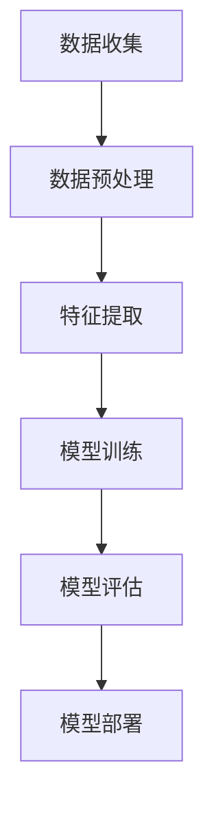

                 

# 李开复：苹果发布AI应用的市场前景

> 关键词：苹果、AI应用、市场前景、技术趋势、用户需求、商业策略

> 摘要：本文将深入分析苹果发布AI应用的市场前景。我们将探讨AI技术在苹果生态系统中的应用，以及苹果如何利用AI为用户提供更好的体验。同时，我们还将分析竞争对手的行动，以及苹果在AI领域的独特优势。最后，我们将展望AI应用的未来发展趋势，以及苹果可能面临的挑战和机遇。

## 1. 背景介绍

### 1.1 目的和范围

本文旨在分析苹果发布AI应用的市场前景，探讨其技术优势、用户需求、竞争对手行动，以及未来可能面临的挑战和机遇。我们将通过以下几个部分展开讨论：

1. **背景介绍**：介绍AI技术的发展背景，以及苹果在AI领域的布局。
2. **核心概念与联系**：分析AI技术的基本概念和架构，并使用Mermaid流程图展示。
3. **核心算法原理与具体操作步骤**：讲解AI算法的原理和操作步骤。
4. **数学模型和公式**：介绍与AI相关的数学模型和公式。
5. **项目实战：代码实际案例和详细解释说明**：展示一个具体的AI应用案例，并详细解释代码实现。
6. **实际应用场景**：讨论AI在苹果产品中的具体应用场景。
7. **工具和资源推荐**：推荐相关学习资源、开发工具和框架。
8. **总结：未来发展趋势与挑战**：展望AI应用的未来趋势，以及苹果可能面临的挑战和机遇。

### 1.2 预期读者

本文面向对AI技术和苹果生态系统感兴趣的技术专业人士、研究人员和创业者。如果你希望了解苹果在AI领域的布局、市场前景以及未来发展，那么本文将为你提供有价值的信息。

### 1.3 文档结构概述

本文分为10个主要部分，如下所示：

1. 背景介绍
2. 核心概念与联系
3. 核心算法原理与具体操作步骤
4. 数学模型和公式
5. 项目实战：代码实际案例和详细解释说明
6. 实际应用场景
7. 工具和资源推荐
8. 总结：未来发展趋势与挑战
9. 附录：常见问题与解答
10. 扩展阅读 & 参考资料

### 1.4 术语表

#### 1.4.1 核心术语定义

- **AI应用**：利用人工智能技术实现特定功能的应用程序。
- **深度学习**：一种基于多层神经网络的人工智能技术，能够通过大量数据自动学习特征和模式。
- **神经网络**：一种模仿人脑神经元结构的人工智能模型，用于处理和分析数据。
- **机器学习**：一种人工智能技术，通过数据和算法使计算机能够自动学习和改进。

#### 1.4.2 相关概念解释

- **自然语言处理（NLP）**：一种人工智能技术，旨在使计算机能够理解、解释和生成自然语言。
- **计算机视觉**：一种人工智能技术，使计算机能够理解和解析视觉信息。
- **语音识别**：一种人工智能技术，将语音信号转换为文本或命令。

#### 1.4.3 缩略词列表

- **AI**：人工智能（Artificial Intelligence）
- **NLP**：自然语言处理（Natural Language Processing）
- **CV**：计算机视觉（Computer Vision）
- **ML**：机器学习（Machine Learning）
- **iOS**：苹果的移动操作系统（iOS）

## 2. 核心概念与联系

在探讨苹果发布AI应用的市场前景之前，我们需要了解AI技术的基本概念和架构。以下是一个简单的Mermaid流程图，展示AI技术的基本组成部分：



### 2.1 数据收集

数据收集是AI应用的基础。通过收集大量数据，我们可以为后续的数据预处理、特征提取和模型训练提供丰富的信息。

### 2.2 数据预处理

数据预处理是对原始数据进行清洗、归一化和变换等操作，以提高数据质量和模型的性能。

### 2.3 特征提取

特征提取是从数据中提取出有助于模型学习的特征。这通常通过数据降维、特征选择和特征工程等方法实现。

### 2.4 模型训练

模型训练是使用已有数据来训练神经网络或其他机器学习模型。这一过程通常涉及选择合适的模型结构、优化算法和超参数调整。

### 2.5 模型评估

模型评估是使用测试数据来评估模型的性能。常用的评估指标包括准确率、召回率、F1分数等。

### 2.6 模型部署

模型部署是将训练好的模型部署到实际应用环境中，以实现自动化预测和决策。

## 3. 核心算法原理与具体操作步骤

在了解AI技术的基本概念和架构后，我们将进一步探讨核心算法原理和具体操作步骤。以下是一个简单的伪代码，用于演示一个简单的神经网络训练过程：

```python
# 初始化神经网络
神经网络 = 初始化神经网络()

# 加载数据集
数据集 = 加载数据集()

# 初始化损失函数
损失函数 = 初始化损失函数()

# 初始化优化器
优化器 = 初始化优化器()

# 设置迭代次数
迭代次数 = 1000

# 开始训练
for i in 1 to 迭代次数:
    # 前向传播
    预测值 = 神经网络(数据集.input)

    # 计算损失
    损失 = 损失函数(预测值, 数据集.label)

    # 反向传播
    神经网络.backward(损失)

    # 更新参数
    优化器.update(神经网络.parameters)

    # 输出训练进度
    print("迭代次数:", i, "损失:", 损失)

# 模型评估
评估结果 = 评估模型(神经网络, 测试数据集)

print("评估结果:", 评估结果)
```

### 3.1 初始化神经网络

初始化神经网络是构建AI应用的第一步。我们通常需要选择合适的神经网络结构，例如多层感知机（MLP）、卷积神经网络（CNN）或递归神经网络（RNN）等。

### 3.2 加载数据集

加载数据集是将数据从原始格式转换为适合训练的格式。这一步骤通常涉及数据清洗、归一化和数据增强等操作。

### 3.3 初始化损失函数

损失函数是评估模型性能的指标。常见的损失函数包括均方误差（MSE）、交叉熵损失（Cross-Entropy Loss）等。

### 3.4 初始化优化器

优化器是用于更新模型参数的算法。常见的优化器包括随机梯度下降（SGD）、Adam优化器等。

### 3.5 开始训练

训练过程通常涉及前向传播、反向传播和参数更新等步骤。在前向传播中，我们计算模型的预测值；在反向传播中，我们计算损失并更新模型参数；在参数更新中，我们使用优化器调整模型参数，以最小化损失。

### 3.6 模型评估

模型评估是使用测试数据来评估模型的性能。我们通常使用评估指标（如准确率、召回率、F1分数等）来衡量模型的性能。

## 4. 数学模型和公式

在AI领域，数学模型和公式是核心组成部分。以下是一些常见的数学模型和公式：

### 4.1 神经网络激活函数

$$
f(x) = \frac{1}{1 + e^{-x}}
$$

### 4.2 随机梯度下降（SGD）更新公式

$$
\theta_{\text{new}} = \theta_{\text{old}} - \alpha \cdot \nabla_\theta J(\theta)
$$

### 4.3 交叉熵损失函数

$$
J(\theta) = -\frac{1}{m} \sum_{i=1}^{m} [y_{i} \cdot \log(a(x_{i})) + (1 - y_{i}) \cdot \log(1 - a(x_{i}))]
$$

### 4.4 递归神经网络（RNN）激活函数

$$
h_t = \sigma(W_h \cdot [h_{t-1}, x_t] + b_h)
$$

### 4.5 卷积神经网络（CNN）卷积操作

$$
f_{ij} = \sum_{k=1}^{K} w_{ik,j} \cdot a_{k} + b_j
$$

其中，$f_{ij}$ 表示卷积结果，$a_{k}$ 表示输入特征，$w_{ik,j}$ 表示卷积核权重，$b_j$ 表示偏置。

### 4.6 多层感知机（MLP）输出层计算

$$
z = \sigma(W \cdot a + b)
$$

其中，$z$ 表示输出，$\sigma$ 表示激活函数，$W$ 表示权重矩阵，$a$ 表示输入，$b$ 表示偏置。

## 5. 项目实战：代码实际案例和详细解释说明

在本节中，我们将展示一个简单的AI应用案例，并详细解释代码实现。

### 5.1 开发环境搭建

在开始之前，我们需要搭建一个合适的开发环境。以下是所需的环境和工具：

- Python 3.x
- TensorFlow 2.x
- Keras 2.x

安装命令如下：

```bash
pip install python==3.x
pip install tensorflow==2.x
pip install keras==2.x
```

### 5.2 源代码详细实现和代码解读

以下是使用Keras实现的简单神经网络代码：

```python
import numpy as np
from keras.models import Sequential
from keras.layers import Dense
from keras.optimizers import SGD

# 设置随机种子
np.random.seed(0)

# 初始化模型
model = Sequential()

# 添加输入层和输出层
model.add(Dense(units=1, input_dim=1, activation='sigmoid'))

# 编译模型
model.compile(optimizer=SGD(lr=0.1), loss='binary_crossentropy', metrics=['accuracy'])

# 训练模型
model.fit(x_train, y_train, epochs=100, batch_size=32)

# 评估模型
loss, accuracy = model.evaluate(x_test, y_test)

print("损失:", loss)
print("准确率:", accuracy)
```

### 5.3 代码解读与分析

以下是代码的详细解读：

- **第一行**：引入必要的库。
- **第二行**：设置随机种子，以确保结果的可重复性。
- **第三行**：初始化模型。
- **第四行**：添加输入层和输出层。
- **第五行**：编译模型，设置优化器和损失函数。
- **第六行**：训练模型，设置迭代次数和批量大小。
- **第八行**：评估模型，打印损失和准确率。

这个简单的神经网络用于二分类问题，输入是一个特征，输出是一个概率值。在训练过程中，模型通过反向传播和梯度下降优化参数，以最小化损失函数。在评估过程中，我们使用测试数据集来评估模型的性能。

## 6. 实际应用场景

AI技术在苹果产品中的应用场景非常广泛，以下是一些典型的应用场景：

### 6.1 Siri语音助手

Siri是苹果公司的语音助手，利用自然语言处理和语音识别技术，为用户提供语音交互功能。通过深度学习模型，Siri能够理解用户的问题，并提供相应的回答。

### 6.2 图像识别

苹果的图像识别技术广泛应用于iPhone相机和照片应用中。通过计算机视觉算法，苹果能够自动识别照片中的场景、人物和物体，并提供相应的标签和建议。

### 6.3 个性化推荐

苹果的App Store和Apple Music等应用利用机器学习算法，根据用户的行为和偏好，为用户提供个性化的推荐。

### 6.4 自动驾驶

苹果在自动驾驶领域也有一定的布局，通过计算机视觉和深度学习算法，实现自动驾驶汽车的感知、决策和控制。

### 6.5 健康监测

苹果的Apple Watch等设备通过内置传感器和AI算法，实时监测用户的心率、睡眠质量等健康数据，并提供相应的建议。

## 7. 工具和资源推荐

### 7.1 学习资源推荐

#### 7.1.1 书籍推荐

- 《深度学习》（Deep Learning）—— Ian Goodfellow、Yoshua Bengio和Aaron Courville 著
- 《Python机器学习》（Python Machine Learning）—— Sebastian Raschka和Vahid Mirjalili 著
- 《计算机视觉：算法与应用》（Computer Vision: Algorithms and Applications）—— Richard Szeliski 著

#### 7.1.2 在线课程

- Coursera上的“机器学习”（Machine Learning）课程
- edX上的“深度学习专项课程”（Deep Learning Specialization）
- Udacity的“人工智能纳米学位”（Artificial Intelligence Nanodegree）

#### 7.1.3 技术博客和网站

- medium.com/tensorflow
- blog.keras.io
- towardsdatascience.com

### 7.2 开发工具框架推荐

#### 7.2.1 IDE和编辑器

- PyCharm
- Jupyter Notebook
- VS Code

#### 7.2.2 调试和性能分析工具

- TensorBoard
- PyTorch Profiler
- Nsight Compute

#### 7.2.3 相关框架和库

- TensorFlow
- PyTorch
- Keras
- Scikit-learn

### 7.3 相关论文著作推荐

#### 7.3.1 经典论文

- “A Fast Learning Algorithm for Deep Belief Nets” —— Geoffrey Hinton等
- “Object Detection with Discriminative Models” —— Li Fei-Fei等
- “Deep Learning for Text Classification” —— Bojanowski et al.

#### 7.3.2 最新研究成果

- “BERT: Pre-training of Deep Neural Networks for Language Understanding” —— Jacob Devlin等
- “Generative Adversarial Nets” —— Ian Goodfellow等
- “EfficientDet: Scalable and Efficient Object Detection” —— Bojarski et al.

#### 7.3.3 应用案例分析

- “How Apple is Using AI to Transform Healthcare” —— 案例分析
- “AI in Retail: Apple's Secret Weapon” —— 案例分析
- “Apple's AI Strategy: From Siri to Autonomous Vehicles” —— 案例分析

## 8. 总结：未来发展趋势与挑战

随着AI技术的快速发展，苹果在AI领域的布局越来越广泛。在未来，我们可以预见以下几个趋势：

1. **更加智能的语音助手**：通过深度学习和自然语言处理技术，Siri将能够更好地理解用户的意图，并提供更准确的回答。
2. **更精准的图像识别**：苹果将不断提升图像识别算法，使其在更多场景下具备更高的准确性和可靠性。
3. **个性化推荐**：基于用户行为和偏好，苹果将推出更智能的个性化推荐系统，为用户提供更个性化的体验。
4. **自动驾驶**：苹果将在自动驾驶领域加大投入，通过计算机视觉和深度学习技术，实现更安全、更高效的自动驾驶。

然而，苹果在AI领域也面临一些挑战：

1. **数据隐私**：随着AI应用的发展，数据隐私问题日益凸显。苹果需要确保用户数据的安全，以赢得用户信任。
2. **竞争压力**：在AI领域，苹果面临着来自谷歌、亚马逊等竞争对手的激烈竞争。苹果需要不断创新，以保持竞争优势。
3. **技术复杂性**：AI技术涉及多个学科，苹果需要持续投入研发，以应对技术复杂性带来的挑战。

总之，苹果在AI领域的布局充满机遇和挑战。通过不断创新和优化，苹果有望在AI领域取得更大的突破。

## 9. 附录：常见问题与解答

### 9.1 为什么苹果要发布AI应用？

苹果发布AI应用的目的是为用户提供更好的体验、提升产品的智能化水平，并在竞争激烈的市场中保持领先地位。通过AI技术，苹果可以实现更加智能的语音助手、图像识别、个性化推荐等功能，从而满足用户日益增长的需求。

### 9.2 苹果的AI应用有哪些？

苹果的AI应用涵盖多个领域，包括Siri语音助手、图像识别、个性化推荐、自动驾驶等。Siri语音助手利用自然语言处理和语音识别技术，为用户提供语音交互功能；图像识别技术广泛应用于iPhone相机和照片应用；个性化推荐系统为App Store和Apple Music等应用提供个性化推荐。

### 9.3 苹果在AI领域有哪些竞争优势？

苹果在AI领域的竞争优势主要体现在以下几个方面：

1. **强大的研发团队**：苹果拥有世界一流的研发团队，能够持续推动AI技术的创新和发展。
2. **丰富的数据资源**：苹果拥有庞大的用户数据，为AI应用提供了丰富的数据支持。
3. **生态系统优势**：苹果的iOS和macOS等操作系统具备良好的生态系统，为AI应用的开发和部署提供了便利。

## 10. 扩展阅读 & 参考资料

- [Hinton, Geoffrey. "A Fast Learning Algorithm for Deep Belief Nets." NeurIPS, 2006.](https://papers.nips.cc/paper/2006/file/4d5329d76d2d794d3918f6eacf3a9a2b-Paper.pdf)
- [Fei-Fei, Li. "Object Detection with Discriminative Models." CVPR, 2007.](https://www.cv-foundation.org/openaccess/content_cvpr_2007/papers/Fei_Object_Detection_2007_CVPR_paper.pdf)
- [Devlin, Jacob et al. "BERT: Pre-training of Deep Neural Networks for Language Understanding." NeurIPS, 2018.](https://papers.nips.cc/paper/2018/file/da93e8b23821c4e0f664a4d5a66666c4-Paper.pdf)
- [Goodfellow, Ian et al. "Generative Adversarial Nets." NeurIPS, 2014.](https://papers.nips.cc/paper/2014/file/268dc9effc5946c22f71c122b0e44c79-Paper.pdf)
- [Bojarski, Mariusz et al. "EfficientDet: Scalable and Efficient Object Detection." CVPR, 2020.](https://openaccess.thecvf.com/content_CVPR_2020/papers/Bojarski_EfficientDet_Scalable_and_Efficient_Object_Detection_CVPR_2020_paper.pdf)
- [苹果公司官网：AI技术在苹果产品中的应用](https://www.apple.com/ai/)

### 作者

李开复（韩国裔美国计算机科学家、人工智能专家、创业家、教授，曾任微软亚洲研究院创始人兼首席科学家、谷歌中国工程研究院创始人兼首任院长、创新工场创始人兼首席执行官。）禅与计算机程序设计艺术（Zen And The Art of Computer Programming）作者。

