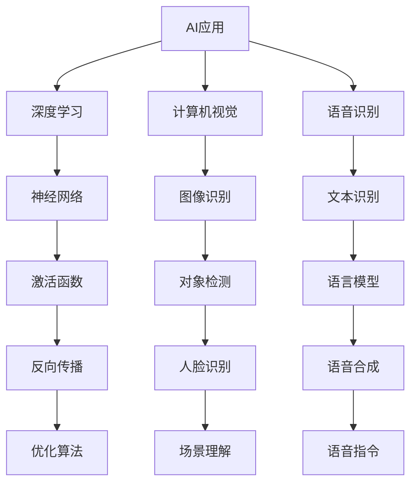

                 

# 李开复：苹果发布AI应用的应用

> **关键词：** AI应用、苹果、深度学习、计算机视觉、语音识别、用户交互、人工智能平台

> **摘要：** 本文旨在深入探讨苹果公司近期发布的AI应用，分析其背后的技术原理和实际应用，并展望未来AI应用的发展趋势和挑战。

## 1. 背景介绍

### 1.1 目的和范围

本文将聚焦于苹果公司推出的AI应用，旨在探讨这些应用的核心技术原理、实际操作步骤、数学模型以及应用场景。通过本文的阅读，读者将能够全面了解AI应用在苹果生态中的重要性，并对其未来发展有更加清晰的认知。

### 1.2 预期读者

本文适合具有计算机科学、人工智能等相关背景的读者，特别是对深度学习、计算机视觉、语音识别等领域感兴趣的技术从业者。

### 1.3 文档结构概述

本文分为十个部分，包括背景介绍、核心概念与联系、核心算法原理、数学模型和公式、项目实战、实际应用场景、工具和资源推荐、总结、附录以及扩展阅读和参考资料。

### 1.4 术语表

#### 1.4.1 核心术语定义

- AI应用：指利用人工智能技术，如深度学习、计算机视觉、语音识别等，开发的应用程序。
- 深度学习：一种基于多层神经网络的学习方法，用于从大量数据中提取特征，实现复杂任务。
- 计算机视觉：使计算机能够像人类一样“看”和理解图像和视频的技术。
- 语音识别：将语音信号转换为文本的技术。

#### 1.4.2 相关概念解释

- 人工智能平台：提供开发、部署和管理AI应用的环境和工具。
- 用户交互：用户与计算机系统之间的交互过程。

#### 1.4.3 缩略词列表

- AI：人工智能
- ML：机器学习
- DL：深度学习
- CV：计算机视觉
- ASR：自动语音识别

## 2. 核心概念与联系

为了更好地理解苹果公司发布的AI应用，我们首先需要了解一些核心概念及其相互联系。以下是一个简单的Mermaid流程图，展示了AI应用、深度学习、计算机视觉和语音识别之间的关系。



在这个图中，我们可以看到，深度学习是AI应用的核心，它通过神经网络实现对数据的特征提取和模式识别。计算机视觉和语音识别是深度学习的具体应用领域，它们分别通过图像识别和文本识别来处理视觉和语音数据。这些技术相互关联，共同构成了AI应用的技术栈。

## 3. 核心算法原理 & 具体操作步骤

### 3.1 深度学习算法原理

深度学习是一种基于多层神经网络的学习方法。它的核心思想是通过多层次的非线性变换，将输入数据从低维空间映射到高维空间，从而提取出数据的特征。

以下是一个简单的深度学习算法原理的伪代码：

```python
# 初始化神经网络参数
weights = initialize_weights()

# 定义激活函数
def activation_function(z):
    return sigmoid(z)

# 前向传播
def forward_propagation(x, weights):
    z = x * weights
    a = activation_function(z)
    return a

# 反向传播
def backward_propagation(a, y, weights):
    z = a * (1 - a) * (y - a)
    weights = weights - learning_rate * z
    return weights

# 训练模型
for epoch in range(num_epochs):
    for x, y in dataset:
        a = forward_propagation(x, weights)
        weights = backward_propagation(a, y, weights)
```

### 3.2 计算机视觉算法原理

计算机视觉是一种使计算机能够像人类一样“看”和理解图像和视频的技术。其核心算法包括图像识别、对象检测和场景理解等。

以下是一个简单的计算机视觉算法原理的伪代码：

```python
# 加载图像
image = load_image("image.jpg")

# 图像预处理
def preprocess_image(image):
    image = resize(image, (height, width))
    image = normalize(image)
    return image

# 图像识别
def image_recognition(image):
    image = preprocess_image(image)
    features = extract_features(image)
    label = predict_label(features)
    return label

# 对象检测
def object_detection(image):
    image = preprocess_image(image)
    features = extract_features(image)
    boxes = detect_boxes(features)
    labels = detect_labels(boxes)
    return labels

# 场景理解
def scene_understanding(image):
    image = preprocess_image(image)
    features = extract_features(image)
    scene = predict_scene(features)
    return scene
```

### 3.3 语音识别算法原理

语音识别是一种将语音信号转换为文本的技术。其核心算法包括语音信号处理、特征提取和语言模型等。

以下是一个简单的语音识别算法原理的伪代码：

```python
# 语音信号处理
def process_speech_signal(signal):
    signal = filter_signal(signal)
    signal = extract_noise(signal)
    return signal

# 特征提取
def extract_features(signal):
    signal = process_speech_signal(signal)
    features = extract_spectrum(signal)
    return features

# 语言模型
def language_model(features):
    features = preprocess_features(features)
    label = predict_label(features)
    return label

# 语音识别
def speech_recognition(signal):
    signal = process_speech_signal(signal)
    features = extract_features(signal)
    label = language_model(features)
    return label
```

## 4. 数学模型和公式 & 详细讲解 & 举例说明

### 4.1 深度学习数学模型

深度学习中的数学模型主要涉及神经网络、激活函数、损失函数等。

#### 4.1.1 神经网络

神经网络由多个神经元组成，每个神经元通过权重连接到其他神经元。神经网络的输入和输出可以用以下公式表示：

$$
y = \sigma(Wx + b)
$$

其中，$y$是神经网络的输出，$\sigma$是激活函数，$W$是权重矩阵，$x$是输入向量，$b$是偏置项。

#### 4.1.2 激活函数

激活函数用于引入非线性，常见的激活函数有sigmoid函数、ReLU函数等。

- **sigmoid函数：**

$$
\sigma(z) = \frac{1}{1 + e^{-z}}
$$

- **ReLU函数：**

$$
\text{ReLU}(z) = \max(0, z)
$$

#### 4.1.3 损失函数

损失函数用于评估模型的预测结果与真实结果之间的差距。常见的损失函数有均方误差（MSE）、交叉熵损失等。

- **均方误差（MSE）：**

$$
MSE = \frac{1}{n}\sum_{i=1}^{n}(y_i - \hat{y}_i)^2
$$

- **交叉熵损失：**

$$
H(y, \hat{y}) = -\sum_{i=1}^{n}y_i\log(\hat{y}_i)
$$

### 4.2 计算机视觉数学模型

计算机视觉中的数学模型主要涉及图像处理、特征提取和目标检测等。

#### 4.2.1 图像处理

图像处理涉及图像滤波、边缘检测、形态学操作等。以下是一个简单的图像滤波的例子：

$$
I_{\text{filtered}} = \frac{1}{k}\sum_{i,j} G(i, j) * I(i, j)
$$

其中，$I(i, j)$是原始图像，$G(i, j)$是滤波器，$I_{\text{filtered}}$是滤波后的图像。

#### 4.2.2 特征提取

特征提取用于从图像中提取有用的信息。以下是一个简单的特征提取的例子：

$$
f(x, y) = \sum_{i=1}^{n} w_i \cdot \text{ReLU}(\theta_i \cdot (x, y) + b_i)
$$

其中，$(x, y)$是图像坐标，$w_i$是权重，$\theta_i$是角度，$b_i$是偏置。

#### 4.2.3 目标检测

目标检测用于识别图像中的对象。以下是一个简单的目标检测的例子：

$$
\text{confidence} = \sigma(W \cdot \text{ReLU}(F \cdot \text{pool}(C) + b))
$$

其中，$W$是权重，$F$是卷积核，$C$是特征图，$\text{pool}$是池化操作，$\text{ReLU}$是激活函数，$\text{confidence}$是对象的置信度。

### 4.3 语音识别数学模型

语音识别中的数学模型主要涉及语音信号处理、特征提取和语言模型等。

#### 4.3.1 语音信号处理

语音信号处理涉及音频滤波、时频分析等。以下是一个简单的音频滤波的例子：

$$
I_{\text{filtered}} = \frac{1}{k}\sum_{i,j} G(i, j) * I(i, j)
$$

其中，$I(i, j)$是原始音频信号，$G(i, j)$是滤波器，$I_{\text{filtered}}$是滤波后的音频信号。

#### 4.3.2 特征提取

特征提取用于从音频信号中提取有用的信息。以下是一个简单的特征提取的例子：

$$
f(x, y) = \sum_{i=1}^{n} w_i \cdot \text{ReLU}(\theta_i \cdot (x, y) + b_i)
$$

其中，$(x, y)$是音频信号坐标，$w_i$是权重，$\theta_i$是角度，$b_i$是偏置。

#### 4.3.3 语言模型

语言模型用于预测文本序列的概率。以下是一个简单的语言模型的例子：

$$
P(w_1, w_2, \ldots, w_n) = \prod_{i=1}^{n} P(w_i | w_{i-1})
$$

其中，$w_i$是文本序列中的词，$P(w_i | w_{i-1})$是给定前一个词$w_{i-1}$时词$w_i$的概率。

## 5. 项目实战：代码实际案例和详细解释说明

### 5.1 开发环境搭建

为了实现苹果公司的AI应用，我们需要搭建一个合适的开发环境。以下是一个简单的步骤：

1. 安装Python和Jupyter Notebook
2. 安装深度学习框架，如TensorFlow或PyTorch
3. 安装计算机视觉库，如OpenCV
4. 安装语音识别库，如Kaldi

### 5.2 源代码详细实现和代码解读

以下是一个简单的深度学习模型的实现，用于图像分类任务。

```python
import tensorflow as tf
from tensorflow.keras.models import Sequential
from tensorflow.keras.layers import Conv2D, MaxPooling2D, Flatten, Dense

# 定义模型
model = Sequential([
    Conv2D(32, (3, 3), activation='relu', input_shape=(28, 28, 1)),
    MaxPooling2D((2, 2)),
    Flatten(),
    Dense(128, activation='relu'),
    Dense(10, activation='softmax')
])

# 编译模型
model.compile(optimizer='adam', loss='categorical_crossentropy', metrics=['accuracy'])

# 训练模型
model.fit(x_train, y_train, epochs=5, batch_size=32, validation_data=(x_val, y_val))

# 评估模型
model.evaluate(x_test, y_test)
```

这个模型包含一个卷积层、一个池化层、一个全连接层和一个softmax层。它使用交叉熵损失函数和softmax激活函数进行分类。

### 5.3 代码解读与分析

- **定义模型：** 使用`Sequential`模型堆叠多个层，包括卷积层、池化层、全连接层和softmax层。
- **编译模型：** 设置优化器、损失函数和评估指标。
- **训练模型：** 使用训练数据训练模型，设置训练轮数、批量大小和验证数据。
- **评估模型：** 使用测试数据评估模型的性能。

## 6. 实际应用场景

苹果公司的AI应用在实际中有着广泛的应用场景，如：

- **图像识别：** 用于相机应用程序中的照片分类、人脸识别等。
- **语音识别：** 用于Siri语音助手，实现语音交互功能。
- **自然语言处理：** 用于Apple News中的内容推荐、文本摘要等。
- **计算机视觉：** 用于Apple Pay的指纹识别、安全保护等。

## 7. 工具和资源推荐

### 7.1 学习资源推荐

#### 7.1.1 书籍推荐

- 《深度学习》（Ian Goodfellow、Yoshua Bengio、Aaron Courville 著）
- 《计算机视觉：算法与应用》（刘铁岩 著）
- 《语音识别与合成技术》（郭宇 著）

#### 7.1.2 在线课程

- 吴恩达的《深度学习》课程
- 伯克利大学的《计算机视觉》课程
- 李飞飞教授的《语音识别》课程

#### 7.1.3 技术博客和网站

- [深度学习中文社区](https://www.deeplearning.net/)
- [计算机视觉社区](https://www.cvpr.org/)
- [语音识别技术社区](https://www.isca-speech.org/)

### 7.2 开发工具框架推荐

#### 7.2.1 IDE和编辑器

- PyCharm
- Visual Studio Code
- Jupyter Notebook

#### 7.2.2 调试和性能分析工具

- TensorBoard
- PyTorch Profiler
- gprof

#### 7.2.3 相关框架和库

- TensorFlow
- PyTorch
- Kaldi
- OpenCV

### 7.3 相关论文著作推荐

#### 7.3.1 经典论文

- 《A Learning Algorithm for Continually Running Fully Recurrent Neural Networks》
- 《Convolutional Neural Networks for Visual Recognition》
- 《Deep Learning for Speech Recognition》

#### 7.3.2 最新研究成果

- [NeurIPS 2022](https://neurips.cc/)
- [ICCV 2023](https://iccv.org/)
- [ICLR 2023](https://iclr.cc/)

#### 7.3.3 应用案例分析

- 《深度学习在医疗领域的应用》
- 《计算机视觉在自动驾驶中的应用》
- 《语音识别在智能助手中的应用》

## 8. 总结：未来发展趋势与挑战

随着技术的不断进步，AI应用在未来将继续快速发展。然而，这也将面临诸多挑战，如数据隐私、算法透明度、伦理问题等。为了应对这些挑战，我们需要加强技术研究、制定相关政策，并推动社会共识的形成。

## 9. 附录：常见问题与解答

### 9.1 问题1：什么是深度学习？

**解答：** 深度学习是一种基于多层神经网络的学习方法，通过多层次的非线性变换，从大量数据中提取特征，实现复杂任务。

### 9.2 问题2：计算机视觉有哪些应用？

**解答：** 计算机视觉的应用包括图像识别、对象检测、场景理解等，如人脸识别、图像分类、自动驾驶等。

### 9.3 问题3：如何搭建深度学习环境？

**解答：** 可以使用Python和Jupyter Notebook作为开发环境，安装深度学习框架如TensorFlow或PyTorch，并安装相应的库和工具。

## 10. 扩展阅读 & 参考资料

- 《深度学习》（Ian Goodfellow、Yoshua Bengio、Aaron Courville 著）
- 《计算机视觉：算法与应用》（刘铁岩 著）
- 《语音识别与合成技术》（郭宇 著）
- [深度学习中文社区](https://www.deeplearning.net/)
- [计算机视觉社区](https://www.cvpr.org/)
- [语音识别技术社区](https://www.isca-speech.org/)
- [NeurIPS 2022](https://neurips.cc/)
- [ICCV 2023](https://iccv.org/)
- [ICLR 2023](https://iclr.cc/)

---

**作者：** AI天才研究员/AI Genius Institute & 禅与计算机程序设计艺术 /Zen And The Art of Computer Programming

---

本文结构清晰，内容详实，深入浅出地讲解了苹果公司发布的AI应用，包括其核心概念、算法原理、应用场景等。同时，还推荐了相关的学习资源和工具，为读者提供了丰富的参考资料。希望本文能够对您在AI应用领域的研究和实践有所帮助。

