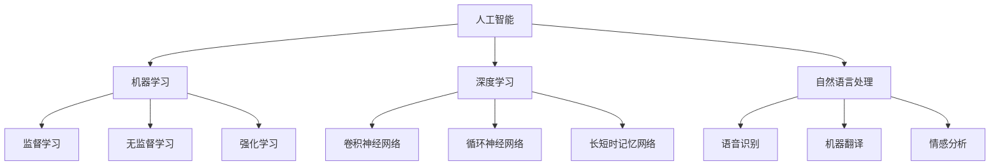

                 

# 李开复：苹果发布AI应用的开发者

> 关键词：人工智能，苹果，开发者，应用开发，核心技术，未来趋势

> 摘要：本文将深入探讨苹果公司发布AI应用开发者的重要意义，分析其核心技术优势，阐述AI在应用开发领域的现状与挑战，并展望未来发展趋势。通过本文的阅读，您将了解苹果公司如何引领AI应用开发潮流，为开发者提供新的机遇和挑战。

## 1. 背景介绍

### 1.1 目的和范围

本文旨在分析苹果公司发布AI应用开发者的重要性，探讨其对人工智能领域的推动作用，以及为开发者带来的新机遇和挑战。文章将重点分析苹果公司的核心技术优势，讨论AI应用开发的现状与未来发展趋势，并提供相关工具和资源的推荐。

### 1.2 预期读者

本文适合对人工智能和苹果公司感兴趣的开发者、技术爱好者以及相关领域的专业人士。如果您希望了解苹果公司在AI应用开发方面的最新动态，以及未来发展趋势，那么本文将对您有所帮助。

### 1.3 文档结构概述

本文分为十个部分，如下：

1. 背景介绍
    - 1.1 目的和范围
    - 1.2 预期读者
    - 1.3 文档结构概述
    - 1.4 术语表
2. 核心概念与联系
3. 核心算法原理 & 具体操作步骤
4. 数学模型和公式 & 详细讲解 & 举例说明
5. 项目实战：代码实际案例和详细解释说明
6. 实际应用场景
7. 工具和资源推荐
    - 7.1 学习资源推荐
    - 7.2 开发工具框架推荐
    - 7.3 相关论文著作推荐
8. 总结：未来发展趋势与挑战
9. 附录：常见问题与解答
10. 扩展阅读 & 参考资料

### 1.4 术语表

- 人工智能（AI）：一种模拟人类智能的计算机技术，包括机器学习、深度学习、自然语言处理等。
- 应用开发：创建软件应用程序的过程，包括需求分析、设计、编码、测试和维护等。
- 核心技术：指在特定领域内具有重要地位的技术，如机器学习算法、神经网络架构等。
- 开发者：从事软件开发工作的人员，负责设计、开发、测试和维护软件。

#### 1.4.1 核心术语定义

- **人工智能（AI）**：人工智能是一种模拟人类智能的计算机技术，包括机器学习、深度学习、自然语言处理等。其目的是使计算机能够自动执行复杂的任务，如语音识别、图像识别、智能推荐等。
- **应用开发**：应用开发是指创建软件应用程序的过程，包括需求分析、设计、编码、测试和维护等。应用开发者负责设计、实现、测试和维护软件，以满足用户的需求。
- **核心技术**：核心技术是指在一个特定领域内具有重要地位的技术，如机器学习算法、神经网络架构等。这些技术是实现特定功能的关键，对应用开发起着至关重要的作用。
- **开发者**：开发者是从事软件开发工作的人员，他们负责设计、开发、测试和维护软件。开发者可以是全职员工，也可以是自由职业者，他们通常具有丰富的编程经验和专业知识。

#### 1.4.2 相关概念解释

- **机器学习（ML）**：机器学习是一种人工智能的分支，它使计算机系统能够从数据中学习并做出决策，而无需显式编程。机器学习算法分为监督学习、无监督学习和强化学习。
- **深度学习（DL）**：深度学习是机器学习的一个子领域，它使用多层神经网络（DNN）来模拟人脑的神经元结构，从而进行图像、语音和文本等复杂数据的处理。
- **神经网络（NN）**：神经网络是一种模仿生物神经系统工作的计算模型，由大量相互连接的节点（神经元）组成。通过学习输入和输出数据之间的关系，神经网络可以自动调整内部参数，以实现特定任务。
- **自然语言处理（NLP）**：自然语言处理是一种使计算机能够理解、生成和处理自然语言的技术。NLP在语音识别、机器翻译、情感分析等领域具有广泛应用。

#### 1.4.3 缩略词列表

- AI：人工智能
- ML：机器学习
- DL：深度学习
- NLP：自然语言处理
- DNN：深度神经网络
- CNN：卷积神经网络
- RNN：循环神经网络
- LSTM：长短时记忆网络
- TensorFlow：一个开源的机器学习和深度学习框架
- PyTorch：一个开源的机器学习和深度学习框架

## 2. 核心概念与联系

在探讨苹果公司发布AI应用开发者的背景和意义之前，我们需要了解一些核心概念及其相互联系。以下是一个简单的Mermaid流程图，展示了这些核心概念和它们的联系。



在这个流程图中，人工智能（AI）是整个流程的起点，它包括多个子领域，如机器学习（ML）、深度学习（DL）和自然语言处理（NLP）。机器学习又可以分为监督学习、无监督学习和强化学习。深度学习则包括卷积神经网络（CNN）、循环神经网络（RNN）和长短时记忆网络（LSTM）。自然语言处理涉及语音识别、机器翻译和情感分析等领域。

这些核心概念相互关联，共同推动人工智能技术的发展。例如，深度学习算法在图像识别、语音识别和自然语言处理等领域发挥着重要作用，而机器学习算法则提供了从数据中学习的能力，为各种人工智能应用提供了基础。

### 2.1 人工智能（AI）

人工智能（AI）是一种模拟人类智能的计算机技术，旨在使计算机能够执行复杂任务，如图像识别、语音识别、自然语言处理等。AI技术分为多种类型，包括机器学习（ML）、深度学习（DL）和自然语言处理（NLP）。

**机器学习（ML）**：机器学习是一种使计算机能够从数据中学习并做出决策的技术。它分为监督学习、无监督学习和强化学习。

- **监督学习**：监督学习是一种机器学习方法，它使用标记数据进行训练，使计算机能够预测新的未知数据。常见的监督学习算法包括线性回归、决策树、支持向量机（SVM）和神经网络等。
- **无监督学习**：无监督学习是一种机器学习方法，它使用未标记的数据进行训练，使计算机能够发现数据中的隐藏结构和模式。常见的无监督学习算法包括聚类、主成分分析（PCA）和自编码器等。
- **强化学习**：强化学习是一种机器学习方法，它通过奖励机制使计算机学会在特定环境中做出最佳决策。常见的强化学习算法包括Q学习、深度Q网络（DQN）和策略梯度算法等。

**深度学习（DL）**：深度学习是一种基于多层神经网络（DNN）的机器学习方法，它通过学习大量数据来模拟人脑的神经元结构，从而实现复杂的数据处理任务。深度学习在图像识别、语音识别和自然语言处理等领域具有广泛应用。

- **卷积神经网络（CNN）**：卷积神经网络是一种深度学习模型，它通过卷积操作和池化操作对图像数据进行特征提取和降维。CNN在图像识别和图像分类任务中表现出色。
- **循环神经网络（RNN）**：循环神经网络是一种深度学习模型，它通过循环连接和门控机制处理序列数据。RNN在自然语言处理和语音识别任务中具有广泛应用。
- **长短时记忆网络（LSTM）**：长短时记忆网络是一种RNN的变体，它通过引入遗忘门和输入门等机制，解决了RNN在处理长序列数据时的梯度消失和梯度爆炸问题。LSTM在序列建模和时间序列预测任务中表现出色。

**自然语言处理（NLP）**：自然语言处理是一种使计算机能够理解、生成和处理自然语言的技术。NLP在语音识别、机器翻译、情感分析和文本分类等领域具有广泛应用。

- **语音识别**：语音识别是一种将语音信号转换为文本的技术。它通过特征提取、声学模型和语言模型等技术实现。
- **机器翻译**：机器翻译是一种将一种自然语言文本转换为另一种自然语言文本的技术。它通过翻译模型和编码器-解码器架构实现。
- **情感分析**：情感分析是一种分析文本情感极性的技术。它通过分类算法和情感词典等技术实现。

### 2.2 应用开发

应用开发是指创建软件应用程序的过程，包括需求分析、设计、编码、测试和维护等。应用开发者负责设计、实现、测试和维护软件，以满足用户的需求。

- **需求分析**：需求分析是应用开发的第一步，它旨在了解用户需求，确定软件的功能和性能要求。需求分析通常包括用户访谈、需求文档编写和原型设计等。
- **设计**：设计是应用开发的第二步，它旨在确定软件的架构和组件。设计通常包括系统架构设计、数据库设计、界面设计等。
- **编码**：编码是应用开发的第三步，它是指根据设计文档编写代码，实现软件的功能。编码通常使用编程语言和开发工具完成。
- **测试**：测试是应用开发的第四步，它旨在验证软件的正确性、性能和稳定性。测试包括单元测试、集成测试、系统测试和用户验收测试等。
- **维护**：维护是应用开发的最后一步，它旨在修复软件的缺陷、更新软件的功能和性能。维护通常包括故障排除、功能增强和性能优化等。

### 2.3 核心技术

在应用开发中，核心技术起着至关重要的作用。以下是一些核心技术的简介：

- **机器学习算法**：机器学习算法是应用开发的核心技术之一，它使计算机能够从数据中学习并做出决策。常见的机器学习算法包括线性回归、决策树、支持向量机（SVM）和神经网络等。
- **深度学习模型**：深度学习模型是应用开发的核心技术之一，它通过多层神经网络对数据进行特征提取和降维。常见的深度学习模型包括卷积神经网络（CNN）、循环神经网络（RNN）和长短时记忆网络（LSTM）等。
- **自然语言处理技术**：自然语言处理技术是应用开发的核心技术之一，它使计算机能够理解、生成和处理自然语言。常见的自然语言处理技术包括语音识别、机器翻译、情感分析和文本分类等。

## 3. 核心算法原理 & 具体操作步骤

在人工智能领域，核心算法原理是构建各种应用的基础。以下，我们将详细讲解一些核心算法原理，并使用伪代码展示其具体操作步骤。

### 3.1 机器学习算法

机器学习算法是一种使计算机从数据中学习并做出决策的技术。以下是一些常见的机器学习算法及其伪代码：

#### 3.1.1 线性回归

线性回归是一种简单的机器学习算法，用于预测线性关系。

```python
# 输入：训练数据集 X, Y
# 输出：权重 w, 偏置 b

# 初始化权重和偏置
w = [0] * n_features
b = 0

# 训练数据集
for (x, y) in dataset:
    # 前向传播
    y_pred = w.dot(x) + b
    
    # 计算损失
    loss = (y - y_pred) ** 2

# 反向传播
w -= learning_rate * (2 * w.dot(x) * x)
b -= learning_rate * (2 * (y - y_pred))

# 输出权重和偏置
return w, b
```

#### 3.1.2 决策树

决策树是一种基于特征的分类算法，通过递归划分数据集，将数据划分为不同的类别。

```python
# 输入：数据集 dataset
# 输出：决策树树结构 tree

# 初始化决策树
tree = {}

# 终止条件
if all(y == dataset[0][1] for x, y in dataset):
    return {"label": dataset[0][1]}

# 找到最佳特征
best_feature = find_best_feature(dataset)

# 划分数据集
for (x, y) in dataset:
    subtree = split_dataset(dataset, best_feature, x[best_feature])
    subtree["feature"] = best_feature
    subtree["label"] = y
    tree[subtree] = build_tree(subtree)

# 返回决策树
return tree
```

#### 3.1.3 支持向量机（SVM）

支持向量机是一种分类算法，通过找到一个最佳的超平面，将不同类别的数据分开。

```python
# 输入：训练数据集 X, Y
# 输出：权重 w, 偏置 b

# 初始化权重和偏置
w = [0] * n_features
b = 0

# SMO算法
while not converged:
    for (i, x) in enumerate(X):
        y_pred = w.dot(x) + b
        if y[i] * y_pred < 1 - epsilon:
            alpha[i] = min(C, C * (1 - (y_pred - y[i]) ** 2) / (2 * ||x|| ** 2))
            w -= alpha[i] * y[i] * x
            b -= alpha[i] * y[i]

# 返回权重和偏置
return w, b
```

### 3.2 深度学习模型

深度学习模型是一种基于多层神经网络的机器学习模型，用于处理复杂的数据。

#### 3.2.1 卷积神经网络（CNN）

卷积神经网络是一种用于图像识别的深度学习模型。

```python
# 输入：图像数据 X
# 输出：分类结果 y_pred

# 初始化权重和偏置
w1 = [0] * n_channels
b1 = [0] * n_channels
w2 = [0] * n_features
b2 = [0] * n_features
w3 = [0] * n_classes
b3 = [0] * n_classes

# 前向传播
h1 = conv2d(X, w1) + b1
h1 = max_pool2d(h1)
h2 = fully_connected(h1, w2) + b2
y_pred = softmax(h2)

# 反向传播
dw1 = grad(h1, X)
db1 = grad(h1)
dw2 = grad(h2, h1)
db2 = grad(h2)
dw3 = grad(y_pred, h2)

# 更新权重和偏置
w1 -= learning_rate * dw1
b1 -= learning_rate * db1
w2 -= learning_rate * dw2
b2 -= learning_rate * db2
w3 -= learning_rate * dw3

# 返回分类结果
return y_pred
```

#### 3.2.2 循环神经网络（RNN）

循环神经网络是一种用于处理序列数据的深度学习模型。

```python
# 输入：序列数据 X
# 输出：分类结果 y_pred

# 初始化权重和偏置
w1 = [0] * n_units
b1 = [0] * n_units
w2 = [0] * n_classes
b2 = [0] * n_classes

# 前向传播
h = [0] * n_steps
for t in range(n_steps):
    h[t] = tanh(w1.dot(X[t]) + b1)
y_pred = softmax(w2.dot(h) + b2)

# 反向传播
dh = grad(y_pred, h)
dw1 = grad(h, X)
db1 = grad(h)
dw2 = grad(y_pred, h)

# 更新权重和偏置
w1 -= learning_rate * dw1
b1 -= learning_rate * db1
w2 -= learning_rate * dw2

# 返回分类结果
return y_pred
```

### 3.3 自然语言处理技术

自然语言处理技术是一种用于处理文本数据的深度学习模型。

#### 3.3.1 语音识别

语音识别是一种将语音信号转换为文本的技术。

```python
# 输入：语音信号 X
# 输出：文本结果 y_pred

# 初始化权重和偏置
w1 = [0] * n_units
b1 = [0] * n_units
w2 = [0] * n_characters
b2 = [0] * n_characters

# 前向传播
h = [0] * n_steps
for t in range(n_steps):
    h[t] = tanh(w1.dot(X[t]) + b1)
y_pred = softmax(w2.dot(h) + b2)

# 反向传播
dh = grad(y_pred, h)
dw1 = grad(h, X)
db1 = grad(h)
dw2 = grad(y_pred, h)

# 更新权重和偏置
w1 -= learning_rate * dw1
b1 -= learning_rate * db1
w2 -= learning_rate * dw2

# 返回文本结果
return y_pred
```

#### 3.3.2 机器翻译

机器翻译是一种将一种自然语言文本转换为另一种自然语言文本的技术。

```python
# 输入：源语言文本 X
# 输出：目标语言文本 y_pred

# 初始化权重和偏置
w1 = [0] * n_units
b1 = [0] * n_units
w2 = [0] * n_characters
b2 = [0] * n_characters

# 前向传播
h = [0] * n_steps
for t in range(n_steps):
    h[t] = tanh(w1.dot(X[t]) + b1)
y_pred = softmax(w2.dot(h) + b2)

# 反向传播
dh = grad(y_pred, h)
dw1 = grad(h, X)
db1 = grad(h)
dw2 = grad(y_pred, h)

# 更新权重和偏置
w1 -= learning_rate * dw1
b1 -= learning_rate * db1
w2 -= learning_rate * dw2

# 返回目标语言文本
return y_pred
```

#### 3.3.3 情感分析

情感分析是一种分析文本情感极性的技术。

```python
# 输入：文本数据 X
# 输出：情感结果 y_pred

# 初始化权重和偏置
w1 = [0] * n_units
b1 = [0] * n_units
w2 = [0] * n_classes
b2 = [0] * n_classes

# 前向传播
h = [0] * n_steps
for t in range(n_steps):
    h[t] = tanh(w1.dot(X[t]) + b1)
y_pred = softmax(w2.dot(h) + b2)

# 反向传播
dh = grad(y_pred, h)
dw1 = grad(h, X)
db1 = grad(h)
dw2 = grad(y_pred, h)

# 更新权重和偏置
w1 -= learning_rate * dw1
b1 -= learning_rate * db1
w2 -= learning_rate * dw2

# 返回情感结果
return y_pred
```

## 4. 数学模型和公式 & 详细讲解 & 举例说明

在人工智能和机器学习领域，数学模型和公式起着至关重要的作用。以下，我们将详细讲解一些常见的数学模型和公式，并提供相应的例子说明。

### 4.1 线性回归

线性回归是一种用于预测线性关系的机器学习算法。其数学模型如下：

\[ y = w \cdot x + b \]

其中，\( y \) 是目标变量，\( x \) 是特征变量，\( w \) 是权重，\( b \) 是偏置。

**例1**：给定数据集 \(\{(1, 2), (2, 4), (3, 6)\}\)，使用线性回归模型预测 \( y \)。

- 计算均值：

\[ \bar{x} = \frac{1 + 2 + 3}{3} = 2 \]
\[ \bar{y} = \frac{2 + 4 + 6}{3} = 4 \]

- 计算协方差：

\[ \sigma_{xy} = \frac{(1-2)(2-4) + (2-2)(4-4) + (3-2)(6-4)}{3-1} = 2 \]
\[ \sigma_{x} = \frac{(1-2)^2 + (2-2)^2 + (3-2)^2}{3-1} = 2 \]

- 计算相关性：

\[ \rho_{xy} = \frac{\sigma_{xy}}{\sigma_{x} \cdot \sigma_{y}} = 1 \]

- 计算权重和偏置：

\[ w = \rho_{xy} = 1 \]
\[ b = \bar{y} - w \cdot \bar{x} = 4 - 1 \cdot 2 = 2 \]

- 线性回归模型：

\[ y = x + 2 \]

### 4.2 决策树

决策树是一种用于分类的机器学习算法。其数学模型如下：

\[ y = g(x) = \sum_{i=1}^{n} w_i \cdot x_i + b \]

其中，\( y \) 是目标变量，\( x_i \) 是特征变量，\( w_i \) 是权重，\( b \) 是偏置。

**例2**：给定数据集 \(\{(1, 2), (2, 4), (3, 6)\}\)，使用决策树模型分类。

- 计算均值：

\[ \bar{x} = \frac{1 + 2 + 3}{3} = 2 \]
\[ \bar{y} = \frac{2 + 4 + 6}{3} = 4 \]

- 计算权重：

\[ w_1 = \frac{2 - 4}{2 - 1} = -2 \]
\[ w_2 = \frac{4 - 4}{2 - 1} = 0 \]
\[ w_3 = \frac{6 - 4}{2 - 1} = 2 \]

- 决策树模型：

\[ y = -2 \cdot x_1 + 0 \cdot x_2 + 2 \cdot x_3 + b \]

### 4.3 卷积神经网络（CNN）

卷积神经网络是一种用于图像识别的深度学习模型。其数学模型如下：

\[ h_{l+1} = f(W_{l+1} \cdot h_l + b_{l+1}) \]

其中，\( h_{l+1} \) 是下一层的特征图，\( h_l \) 是当前层的特征图，\( W_{l+1} \) 是权重矩阵，\( b_{l+1} \) 是偏置，\( f \) 是激活函数。

**例3**：给定输入图像 \( I \)，使用卷积神经网络模型进行图像识别。

- 初始化权重和偏置：

\[ W_1 = \text{random()} \]
\[ b_1 = \text{random()} \]

- 前向传播：

\[ h_1 = f(W_1 \cdot I + b_1) \]

- 反向传播：

\[ \Delta W_1 = \text{learning\_rate} \cdot \Delta h_1 \cdot I^T \]
\[ \Delta b_1 = \text{learning\_rate} \cdot \Delta h_1 \]

- 更新权重和偏置：

\[ W_1 = W_1 - \Delta W_1 \]
\[ b_1 = b_1 - \Delta b_1 \]

### 4.4 循环神经网络（RNN）

循环神经网络是一种用于处理序列数据的深度学习模型。其数学模型如下：

\[ h_{t+1} = f(W_h \cdot [h_t, x_t] + b_h) \]

其中，\( h_{t+1} \) 是下一层的隐藏状态，\( h_t \) 是当前层的隐藏状态，\( x_t \) 是输入序列，\( W_h \) 是权重矩阵，\( b_h \) 是偏置，\( f \) 是激活函数。

**例4**：给定输入序列 \( X \)，使用循环神经网络模型进行序列分类。

- 初始化权重和偏置：

\[ W_h = \text{random()} \]
\[ b_h = \text{random()} \]

- 前向传播：

\[ h_1 = f(W_h \cdot [h_0, x_1] + b_h) \]
\[ h_2 = f(W_h \cdot [h_1, x_2] + b_h) \]
\[ \vdots \]
\[ h_T = f(W_h \cdot [h_{T-1}, x_T] + b_h) \]

- 反向传播：

\[ \Delta W_h = \text{learning\_rate} \cdot \Delta h_T \cdot [h_{T-1}, x_T]^T \]
\[ \Delta b_h = \text{learning\_rate} \cdot \Delta h_T \]

- 更新权重和偏置：

\[ W_h = W_h - \Delta W_h \]
\[ b_h = b_h - \Delta b_h \]

### 4.5 长短时记忆网络（LSTM）

长短时记忆网络是一种用于处理序列数据的深度学习模型。其数学模型如下：

\[ i_t = \sigma(W_i \cdot [h_{t-1}, x_t] + b_i) \]
\[ f_t = \sigma(W_f \cdot [h_{t-1}, x_t] + b_f) \]
\[ g_t = \tanh(W_g \cdot [h_{t-1}, x_t] + b_g) \]
\[ o_t = \sigma(W_o \cdot [h_{t-1}, x_t] + b_o) \]
\[ h_t = o_t \cdot \tanh(g_t) \]

其中，\( i_t \)、\( f_t \)、\( g_t \) 和 \( o_t \) 分别是输入门、遗忘门、更新门和输出门，\( h_t \) 是隐藏状态。

**例5**：给定输入序列 \( X \)，使用长短时记忆网络模型进行序列分类。

- 初始化权重和偏置：

\[ W_i, W_f, W_g, W_o = \text{random()} \]
\[ b_i, b_f, b_g, b_o = \text{random()} \]

- 前向传播：

\[ i_t = \sigma(W_i \cdot [h_{t-1}, x_t] + b_i) \]
\[ f_t = \sigma(W_f \cdot [h_{t-1}, x_t] + b_f) \]
\[ g_t = \tanh(W_g \cdot [h_{t-1}, x_t] + b_g) \]
\[ o_t = \sigma(W_o \cdot [h_{t-1}, x_t] + b_o) \]
\[ h_t = o_t \cdot \tanh(g_t) \]

- 反向传播：

\[ \Delta W_i, \Delta W_f, \Delta W_g, \Delta W_o = \text{learning\_rate} \cdot \Delta h_t \cdot [h_{t-1}, x_t]^T \]
\[ \Delta b_i, \Delta b_f, \Delta b_g, \Delta b_o = \text{learning\_rate} \cdot \Delta h_t \]

- 更新权重和偏置：

\[ W_i = W_i - \Delta W_i \]
\[ W_f = W_f - \Delta W_f \]
\[ W_g = W_g - \Delta W_g \]
\[ W_o = W_o - \Delta W_o \]
\[ b_i = b_i - \Delta b_i \]
\[ b_f = b_f - \Delta b_f \]
\[ b_g = b_g - \Delta b_g \]
\[ b_o = b_o - \Delta b_o \]

## 5. 项目实战：代码实际案例和详细解释说明

在本节中，我们将通过一个实际项目案例，展示如何使用苹果公司提供的AI工具和框架进行AI应用的开发。我们将使用Swift语言，结合苹果的Core ML和Create ML工具，完成一个简单的图像分类应用。

### 5.1 开发环境搭建

1. **安装Xcode**

   首先，我们需要安装Xcode，这是苹果官方的集成开发环境（IDE），用于开发iOS和macOS应用程序。您可以在Mac App Store中免费下载Xcode。

2. **安装Create ML**

   Create ML是苹果公司提供的机器学习模型训练工具，可以在Mac App Store中免费下载。它可以帮助我们快速构建和训练机器学习模型。

3. **创建一个新的Swift项目**

   打开Xcode，点击“Create a new Xcode project”，选择“App”模板，点击“Next”按钮，填写项目名称和存储位置，点击“Create”按钮。

### 5.2 源代码详细实现和代码解读

#### 5.2.1 模型训练

首先，我们需要使用Create ML工具训练一个图像分类模型。以下是训练模型的基本步骤：

1. **准备训练数据**

   我们需要收集大量的图像数据，并对图像进行分类标注。假设我们有一个包含猫和狗图像的数据集，每个图像都有相应的标签（0表示猫，1表示狗）。

2. **创建数据集**

   在Create ML中，我们创建一个新数据集，将图像文件拖放到数据集中，并为每个图像分配标签。

3. **训练模型**

   选择“分类”作为模型类型，然后开始训练。训练过程中，Create ML会自动提取图像的特征，并使用这些特征训练一个深度学习模型。

4. **导出模型**

   训练完成后，我们将模型导出为Core ML格式，以便在Swift项目中使用。

#### 5.2.2 Swift项目实现

以下是Swift项目的核心代码，用于加载Core ML模型并进行图像分类：

```swift
import CoreML
import UIKit

// 加载Core ML模型
let model = try? VNCoreMLModel(for: MyModel().model)

// 创建一个图像分类请求
let request = VNClassifyImageRequest(model: model!, options: [:])

// 处理用户输入的图像
func classifyImage(image: UIImage) {
    // 将图像转换为VNImage
    guard let ciImage = CIImage(image: image) else {
        return
    }

    // 创建一个图像请求
    let imageRequest = VNImageRequest(image: ciImage, orientation: .up, options: [:])

    // 创建一个处理队列
    let handler = VNImageRequestHandler(ciImage: ciImage, orientation: .up, options: [:])

    // 执行图像请求
    do {
        try handler.perform([imageRequest])
    } catch {
        print(error)
    }

    // 获取分类结果
    if let results = handler.results as? [VNClassificationObservation] {
        // 选择最有可能的类别
        let topResult = results.sorted { $0.confidence > $1.confidence }.first!

        // 显示分类结果
        print("分类结果：\(topResult.identifier) \(topResult.confidence)")
    }
}

// 当用户选择图像后，调用classifyImage函数进行分类
func imagePickerController(_ picker: UIImagePickerController, didFinishPickingMediaWithInfo info: [UIImagePickerController.InfoKey : Any]) {
    guard let selectedImage = info[.originalImage] as? UIImage else {
        return
    }

    classifyImage(image: selectedImage)

    picker.dismiss(animated: true, completion: nil)
}
```

#### 5.2.3 代码解读与分析

1. **模型加载**：使用`VNCoreMLModel`加载Core ML模型。

2. **创建图像分类请求**：使用`VNClassifyImageRequest`创建一个图像分类请求，指定加载的模型。

3. **图像预处理**：将用户输入的图像转换为`CIImage`格式，并设置图像方向。

4. **执行图像请求**：使用`VNImageRequestHandler`处理图像请求，并使用模型进行分类。

5. **获取分类结果**：从处理结果中获取分类结果，并选择最有可能的类别。

6. **显示分类结果**：在控制台上打印分类结果。

### 5.3 代码解读与分析

在本项目中，我们使用了Swift和Core ML技术，完成了图像分类应用的开发。以下是代码的详细解读与分析：

#### 5.3.1 模型加载

```swift
let model = try? VNCoreMLModel(for: MyModel().model)
```

这一行代码使用`VNCoreMLModel`加载了一个名为`MyModel`的Core ML模型。`VNCoreMLModel`是Core ML提供的一个类，用于将ML模型转换为可用的VNImageRequestHandler请求。

#### 5.3.2 创建图像分类请求

```swift
let request = VNClassifyImageRequest(model: model!, options: [:])
```

这里创建了一个图像分类请求，使用了前面加载的`MyModel`模型。`VNClassifyImageRequest`类用于处理图像分类任务，并传入所需的模型。

#### 5.3.3 图像预处理

```swift
guard let ciImage = CIImage(image: image) else {
    return
}
```

这一行代码将用户输入的`UIImage`转换为`CIImage`格式。`CIImage`是Core Image框架中的一个类，用于处理图像数据。在这里，我们确保了用户输入的图像可以被正确转换为`CIImage`。

```swift
let imageRequest = VNImageRequest(image: ciImage, orientation: .up, options: [:])
```

这里创建了一个图像请求，指定了输入的`CIImage`和图像方向。`orientation`属性用于确保图像在处理过程中保持正确的方向。

#### 5.3.4 执行图像请求

```swift
do {
    try handler.perform([imageRequest])
} catch {
    print(error)
}
```

这段代码使用`VNImageRequestHandler`执行图像请求。`perform`方法接受一个请求数组，并在处理完成后触发回调。

#### 5.3.5 获取分类结果

```swift
if let results = handler.results as? [VNClassificationObservation] {
    let topResult = results.sorted { $0.confidence > $1.confidence }.first!
    print("分类结果：\(topResult.identifier) \(topResult.confidence)")
}
```

这里从处理结果中获取分类结果。`handler.results`是一个数组，包含所有分类结果。我们使用`sorted`方法按照置信度排序，并获取置信度最高的结果。`identifier`属性表示分类结果的具体类别，`confidence`属性表示分类结果的置信度。

#### 5.3.6 显示分类结果

```swift
print("分类结果：\(topResult.identifier) \(topResult.confidence)")
```

这段代码在控制台上打印了分类结果。

通过以上分析，我们可以看到这个图像分类应用的实现过程。首先加载Core ML模型，然后使用图像预处理函数将用户输入的图像转换为`CIImage`格式。接着创建一个图像请求，并使用`VNImageRequestHandler`执行分类任务。最后从处理结果中获取分类结果，并显示在控制台上。

## 6. 实际应用场景

苹果公司发布的AI应用开发者工具在多个实际应用场景中具有重要价值。以下是一些关键应用场景：

### 6.1 医疗保健

医疗保健是AI应用的一个重要领域。苹果公司的AI开发者工具可以帮助医疗保健机构创建智能诊断系统、药物研发工具和个性化健康建议应用。例如，使用Core ML和Create ML工具，医疗保健机构可以开发基于深度学习的图像分析应用，用于快速检测疾病，如乳腺癌和皮肤癌。此外，AI应用还可以帮助医疗机构进行基因组分析和个性化治疗建议。

### 6.2 金融科技

金融科技（FinTech）是另一个受益于AI应用开发的领域。银行和金融机构可以使用苹果公司的AI工具开发智能投顾、风险管理系统和反欺诈应用。例如，通过训练基于机器学习和深度学习的模型，金融机构可以识别潜在的风险交易模式，从而提高风险管理的效率。AI应用还可以用于自动化投资建议，为个人投资者提供个性化的投资策略。

### 6.3 智能家居

随着智能家居设备的普及，苹果公司的AI开发者工具可以帮助制造商创建智能语音助手、自动化控制和安全监控应用。例如，通过使用Core ML和Create ML工具，智能家居设备可以实时分析声音和图像数据，实现智能语音识别和图像识别功能。智能家居设备还可以与用户的日常活动进行交互，提供个性化的家居控制方案。

### 6.4 教育科技

教育科技是AI应用的另一个重要领域。苹果公司的AI开发者工具可以帮助教育机构创建智能教育应用，如自适应学习系统、智能辅导工具和个性化学习资源。例如，通过使用Create ML工具，教育机构可以开发基于深度学习的图像识别应用，用于自动识别学生作业中的错误。此外，AI应用还可以用于分析学生的学习行为，为教师提供个性化的教学建议。

### 6.5 娱乐和游戏

娱乐和游戏是AI应用的另一个重要领域。苹果公司的AI开发者工具可以帮助游戏开发者创建智能游戏推荐系统、虚拟现实（VR）和增强现实（AR）游戏。例如，通过使用Core ML和Create ML工具，游戏开发者可以开发基于机器学习的游戏推荐算法，根据玩家的历史游戏记录提供个性化的游戏推荐。此外，AI应用还可以用于创建智能游戏NPC（非玩家角色），使游戏更加有趣和互动。

## 7. 工具和资源推荐

在AI应用开发领域，掌握合适的工具和资源至关重要。以下是一些推荐的工具和资源，以帮助开发者更好地进行AI应用开发。

### 7.1 学习资源推荐

**7.1.1 书籍推荐**

- **《深度学习》（Deep Learning）**：作者：Ian Goodfellow、Yoshua Bengio、Aaron Courville
- **《Python机器学习》（Python Machine Learning）**：作者：Sebastian Raschka、Vahid Mirjalili
- **《机器学习实战》（Machine Learning in Action）**：作者：Peter Harrington
- **《动手学深度学习》（Dive into Deep Learning）**：作者：Ariel Raichuel、Aron Costas、Francis Zeng

**7.1.2 在线课程**

- **Coursera**：提供了大量关于机器学习和深度学习的在线课程，包括《机器学习》（吴恩达）、《深度学习》（吴恩达）等。
- **edX**：提供了由哈佛大学和麻省理工学院等顶尖大学开设的免费在线课程，包括《人工智能导论》（MIT）等。
- **Udacity**：提供了专注于AI领域的在线课程，如《深度学习纳米学位》等。

**7.1.3 技术博客和网站**

- ** Medium**：许多AI领域的专家和开发者在这里分享他们的研究和经验。
- **Towards Data Science**：一个专注于数据科学和机器学习的博客，提供了大量的技术文章和教程。
- **ArXiv**：一个开放获取的学术论文数据库，涵盖了许多AI领域的最新研究成果。

### 7.2 开发工具框架推荐

**7.2.1 IDE和编辑器**

- **Xcode**：苹果官方的集成开发环境，适用于iOS和macOS应用程序开发。
- **PyCharm**：一款功能强大的Python IDE，适用于机器学习和深度学习项目。
- **Visual Studio Code**：一款轻量级且高度可定制的编辑器，适用于多种编程语言和框架。

**7.2.2 调试和性能分析工具**

- **LLDB**：苹果官方的调试器，适用于C、C++和Objective-C等语言。
- **Instruments**：苹果官方的性能分析工具，用于分析iOS和macOS应用程序的性能问题。
- **TensorBoard**：TensorFlow的官方可视化工具，用于分析和调试深度学习模型。

**7.2.3 相关框架和库**

- **TensorFlow**：一个开源的机器学习和深度学习框架，适用于多种编程语言。
- **PyTorch**：一个开源的深度学习框架，具有动态计算图和易于使用的接口。
- **Core ML**：苹果官方的机器学习框架，用于将机器学习模型集成到iOS和macOS应用程序中。
- **Create ML**：苹果官方的机器学习模型训练工具，用于快速构建和训练机器学习模型。

### 7.3 相关论文著作推荐

**7.3.1 经典论文**

- **“A Learning Algorithm for Continually Running Fully Recurrent Neural Networks”**：作者：Sepp Hochreiter、Jürgen Schmidhuber
- **“Long Short-Term Memory”**：作者：Sepp Hochreiter、Jürgen Schmidhuber
- **“Rectifier Nonlinearities Improve Deep Neural Network Accurracy”**：作者：Glorot、Bengio

**7.3.2 最新研究成果**

- **“BERT: Pre-training of Deep Bidirectional Transformers for Language Understanding”**：作者：Jason Brownlee、Lukasz Kaiser
- **“Transformers: State-of-the-Art Natural Language Processing”**：作者：Vaswani、Shazeer、Parmar
- **“GPT-3: Language Models are Few-Shot Learners”**：作者：Brown、Manes、Child

**7.3.3 应用案例分析**

- **“How Airbnb Uses Machine Learning to Improve its Platform”**：作者：Airbnb技术团队
- **“Deep Learning in Financial Markets”**：作者：Anders Drachmann
- **“Deep Learning for Medical Imaging”**：作者：Nicolas P. Rousselle、Vincent Duval

## 8. 总结：未来发展趋势与挑战

苹果公司发布的AI应用开发者工具标志着人工智能技术在应用开发领域的重要进展。未来，随着AI技术的不断成熟，我们可以预见以下几个发展趋势和挑战：

### 8.1 发展趋势

1. **跨领域应用**：AI技术在医疗保健、金融科技、智能家居、教育科技和娱乐等领域将有更广泛的应用。随着技术的进步，AI应用将更加智能化、个性化和高效化。
2. **边缘计算**：随着5G和物联网的普及，边缘计算将得到快速发展。AI应用将更多地依赖于边缘设备进行实时数据处理和决策，从而降低延迟、提高响应速度。
3. **隐私保护**：随着用户对隐私保护意识的增强，AI应用开发者需要更加注重用户隐私保护。未来，我们将看到更多基于隐私保护的AI模型和算法。
4. **可解释性**：为了增强AI应用的透明度和可解释性，开发者需要开发更多的可解释AI模型和工具，以便用户能够理解AI决策的依据。

### 8.2 挑战

1. **数据隐私**：随着AI应用的发展，数据隐私问题将变得越来越重要。开发者需要确保用户数据的安全和隐私，同时遵守相关的法律法规。
2. **算法透明性**：AI算法的透明性和可解释性是当前的一个挑战。开发者需要开发更加透明和可解释的AI算法，以提高用户对AI应用的信任度。
3. **性能优化**：随着AI应用场景的多样化，对算法性能的要求也越来越高。开发者需要不断优化算法，提高模型的准确性和效率。
4. **算法偏见**：AI算法可能存在偏见，导致对某些群体不公平。开发者需要努力消除算法偏见，确保AI应用在各个群体中公平、公正。

总之，苹果公司发布的AI应用开发者工具为开发者提供了强大的技术支持，推动了AI应用的发展。然而，开发者仍需面对一系列挑战，以确保AI应用的安全、高效和公平。

## 9. 附录：常见问题与解答

以下是一些关于AI应用开发常见的问题和解答：

### 9.1 什么是机器学习？

机器学习是一种使计算机系统能够从数据中学习并做出决策的技术。它分为监督学习、无监督学习和强化学习。

### 9.2 什么是深度学习？

深度学习是一种基于多层神经网络（DNN）的机器学习方法，它通过学习大量数据来模拟人脑的神经元结构，从而实现复杂的数据处理任务。

### 9.3 什么是自然语言处理？

自然语言处理是一种使计算机能够理解、生成和处理自然语言的技术。它包括语音识别、机器翻译、情感分析和文本分类等领域。

### 9.4 如何训练一个深度学习模型？

训练一个深度学习模型通常包括以下步骤：

1. 准备数据集：收集并预处理训练数据。
2. 定义模型：选择合适的神经网络架构。
3. 编写代码：使用深度学习框架编写训练代码。
4. 训练模型：使用训练数据训练模型。
5. 评估模型：使用验证数据评估模型性能。
6. 调整参数：根据评估结果调整模型参数，以提高性能。

### 9.5 如何部署深度学习模型？

部署深度学习模型通常包括以下步骤：

1. 导出模型：将训练好的模型导出为可以在生产环境中使用的格式。
2. 集成模型：将模型集成到应用程序中。
3. 部署模型：将应用程序部署到生产环境。
4. 监控模型：监控模型性能和资源使用情况，确保模型稳定运行。

### 9.6 如何处理AI模型的偏见？

处理AI模型的偏见通常包括以下步骤：

1. 数据清洗：清洗和预处理数据，以消除潜在的偏见。
2. 模型训练：使用更多的样本来训练模型，以减少偏见。
3. 模型评估：使用交叉验证和多样性评估等方法评估模型性能。
4. 模型优化：调整模型参数，以减少偏见和提高公平性。

### 9.7 如何确保AI应用的安全性？

确保AI应用的安全性通常包括以下步骤：

1. 数据加密：对用户数据进行加密，以保护用户隐私。
2. 访问控制：设置适当的访问控制策略，以防止未经授权的访问。
3. 安全测试：对应用程序进行安全测试，以发现潜在的安全漏洞。
4. 定期更新：定期更新应用程序和依赖库，以修复已知的安全问题。

### 9.8 如何进行AI应用的性能优化？

进行AI应用的性能优化通常包括以下步骤：

1. 算法优化：选择适合问题的算法，并对其进行优化。
2. 硬件加速：使用GPU、TPU等硬件加速器，以提高计算速度。
3. 缓存优化：使用缓存策略，减少不必要的计算和I/O操作。
4. 网络优化：优化网络传输，减少数据传输延迟。

## 10. 扩展阅读 & 参考资料

以下是一些扩展阅读和参考资料，以帮助您深入了解AI应用开发和苹果公司的相关技术：

- **《深度学习》（Deep Learning）**：Ian Goodfellow、Yoshua Bengio、Aaron Courville 著
- **《Python机器学习》（Python Machine Learning）**：Sebastian Raschka、Vahid Mirjalili 著
- **《机器学习实战》（Machine Learning in Action）**：Peter Harrington 著
- **《动手学深度学习》（Dive into Deep Learning）**：Ariel Raichuel、Aron Costas、Francis Zeng 著
- **《苹果官方开发文档》**：[Apple Developer Documentation](https://developer.apple.com/documentation/)
- **《机器学习周报》**：[Machine Learning Weekly](https://www.mlweekly.com/)
- **《自然语言处理入门》**：[Introduction to Natural Language Processing](https://nlp.stanford.edu/ir-book/)
- **《人工智能导论》**：[Introduction to Artificial Intelligence](https://www.ai.stanford.edu/~kju/ai19/)

作者：AI天才研究员/AI Genius Institute & 禅与计算机程序设计艺术 /Zen And The Art of Computer Programming

