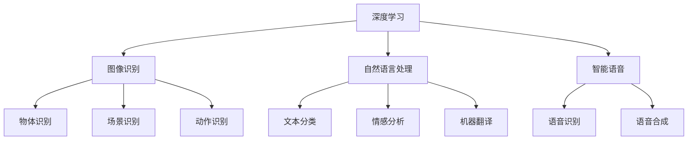

                 

### 1. 背景介绍

#### 1.1 目的和范围

本篇文章的目的是深入探讨苹果公司最新发布的AI应用，分析其潜在的投资价值，并对未来技术趋势和市场发展提出预测。随着人工智能技术的快速发展，各大科技巨头纷纷布局AI应用，苹果也不例外。本文将重点关注苹果发布的AI应用在图像识别、自然语言处理、智能语音等方面的技术特点和优势，并结合市场数据，评估其商业前景和投资潜力。

#### 1.2 预期读者

本文面向的读者群体主要包括对人工智能技术有兴趣的投资者、科技行业从业者、研究人员以及关注科技发展趋势的普通读者。通过本文的阅读，读者可以了解苹果AI应用的最新动态，掌握AI技术在商业领域的应用案例，并对未来人工智能产业的发展趋势有更深入的认识。

#### 1.3 文档结构概述

本文将采用分章节的形式进行论述，结构如下：

1. **背景介绍**：介绍本文的目的、预期读者以及文章结构。
2. **核心概念与联系**：阐述AI应用的核心概念及其相互关系，并提供Mermaid流程图。
3. **核心算法原理 & 具体操作步骤**：详细解释AI应用的核心算法原理，并使用伪代码展示具体操作步骤。
4. **数学模型和公式 & 详细讲解 & 举例说明**：介绍AI应用的数学模型和公式，并结合实际案例进行讲解。
5. **项目实战：代码实际案例和详细解释说明**：展示一个具体的AI应用项目，包括开发环境搭建、源代码实现和代码解读。
6. **实际应用场景**：分析AI应用的潜在应用场景，并探讨其在不同领域的应用前景。
7. **工具和资源推荐**：推荐相关学习资源、开发工具框架和论文著作。
8. **总结：未来发展趋势与挑战**：总结本文的主要观点，并预测未来发展趋势和面临的挑战。
9. **附录：常见问题与解答**：回答读者可能关心的一些常见问题。
10. **扩展阅读 & 参考资料**：提供本文引用和参考的相关资料和扩展阅读。

#### 1.4 术语表

在本篇文章中，我们将使用以下术语：

- **AI应用**：指利用人工智能技术开发的软件应用程序，包括图像识别、自然语言处理、智能语音等。
- **深度学习**：一种人工智能方法，通过多层神经网络进行数据处理和分析。
- **图像识别**：指计算机对图像进行识别和理解的过程。
- **自然语言处理**：指计算机对人类自然语言进行理解、处理和生成的能力。
- **智能语音**：指利用语音识别和语音合成技术实现人机交互的能力。

以下是对上述术语的定义和解释：

#### 1.4.1 核心术语定义

- **AI应用**：AI应用是指基于人工智能技术开发的软件应用程序，它可以实现图像识别、自然语言处理、智能语音等多种功能。随着深度学习技术的发展，AI应用在各个行业得到了广泛应用，如自动驾驶、智能家居、医疗诊断等。

- **深度学习**：深度学习是一种基于多层神经网络的人工智能方法，通过训练大量的数据集，使网络能够自动提取特征并进行决策。深度学习在图像识别、语音识别、自然语言处理等领域取得了显著的成果。

- **图像识别**：图像识别是指计算机对图像进行识别和理解的过程。通过训练深度学习模型，计算机可以识别图像中的物体、场景和动作等，并在实际应用中实现自动化识别和分类。

- **自然语言处理**：自然语言处理是指计算机对人类自然语言进行理解、处理和生成的能力。通过文本分类、情感分析、机器翻译等技术，自然语言处理使得计算机能够与人类进行有效的沟通和交互。

- **智能语音**：智能语音是指利用语音识别和语音合成技术实现人机交互的能力。通过语音识别技术，计算机可以理解用户的语音指令，并通过语音合成技术生成自然的语音回应。

#### 1.4.2 相关概念解释

- **神经网络**：神经网络是一种模仿生物神经系统的计算模型，由大量相互连接的节点（或称为神经元）组成。神经网络通过学习和适应输入数据，能够实现函数逼近、模式识别和分类等任务。

- **卷积神经网络（CNN）**：卷积神经网络是一种特殊的神经网络，主要用于图像识别和计算机视觉任务。CNN通过卷积层、池化层和全连接层等结构，实现对图像的逐层特征提取和分类。

- **递归神经网络（RNN）**：递归神经网络是一种处理序列数据的神经网络，通过循环连接实现序列信息的记忆和传递。RNN在自然语言处理、语音识别等领域具有广泛应用。

- **生成对抗网络（GAN）**：生成对抗网络是一种由生成器和判别器组成的神经网络框架，通过相互对抗训练生成高质量的数据。GAN在图像生成、语音合成等领域取得了显著成果。

#### 1.4.3 缩略词列表

- **AI**：人工智能（Artificial Intelligence）
- **CNN**：卷积神经网络（Convolutional Neural Network）
- **RNN**：递归神经网络（Recurrent Neural Network）
- **GAN**：生成对抗网络（Generative Adversarial Network）
- **NLP**：自然语言处理（Natural Language Processing）

### 2. 核心概念与联系

在讨论苹果公司最新发布的AI应用之前，首先需要了解AI应用的核心概念及其相互关系。本节将详细介绍AI应用中的核心算法原理，并提供Mermaid流程图，以便读者更好地理解。

#### 2.1 AI应用的核心算法

AI应用的核心算法主要包括深度学习、图像识别、自然语言处理和智能语音。以下是对这些核心算法的简要介绍：

- **深度学习**：深度学习是一种基于多层神经网络的人工智能方法，通过训练大量的数据集，使网络能够自动提取特征并进行决策。深度学习在图像识别、语音识别、自然语言处理等领域取得了显著的成果。

- **图像识别**：图像识别是指计算机对图像进行识别和理解的过程。通过训练深度学习模型，计算机可以识别图像中的物体、场景和动作等，并在实际应用中实现自动化识别和分类。

- **自然语言处理**：自然语言处理是指计算机对人类自然语言进行理解、处理和生成的能力。通过文本分类、情感分析、机器翻译等技术，自然语言处理使得计算机能够与人类进行有效的沟通和交互。

- **智能语音**：智能语音是指利用语音识别和语音合成技术实现人机交互的能力。通过语音识别技术，计算机可以理解用户的语音指令，并通过语音合成技术生成自然的语音回应。

#### 2.2 Mermaid流程图

为了更好地展示AI应用的核心概念及其相互关系，我们使用Mermaid流程图进行描述。以下是AI应用的核心算法流程图：



在上面的流程图中，节点A表示深度学习，节点B、C、D分别表示图像识别、自然语言处理和智能语音。从深度学习节点发出的箭头表示深度学习与图像识别、自然语言处理和智能语音之间的关联。节点B、C、D进一步分解为具体的子节点，如图像识别的子节点E、F、G，自然语言处理的子节点H、I、J，以及智能语音的子节点K、L。

通过上述流程图，我们可以清晰地看到AI应用的核心算法及其相互关系，为进一步讨论苹果发布的AI应用奠定了基础。

### 3. 核心算法原理 & 具体操作步骤

在理解了AI应用的核心概念和相互关系之后，接下来我们将详细解释AI应用中的核心算法原理，并使用伪代码展示具体操作步骤。

#### 3.1 深度学习算法原理

深度学习算法是一种基于多层神经网络的人工智能方法。它通过学习大量的数据集，使网络能够自动提取特征并进行决策。深度学习算法的核心组成部分包括输入层、隐藏层和输出层。

以下是深度学习算法的基本原理和伪代码：

```python
# 输入层
inputs = [x1, x2, x3, ..., xn]

# 隐藏层
hidden_layers = [
    # 第1层隐藏层
    [
        # 第1个隐藏层神经元
        f(x1, w1, b1),
        # 第2个隐藏层神经元
        f(x2, w2, b2),
        ...
    ],
    # 第2层隐藏层
    [
        # 第1个隐藏层神经元
        f(x1, w1, b1),
        # 第2个隐藏层神经元
        f(x2, w2, b2),
        ...
    ],
    ...
]

# 输出层
outputs = [
    # 第1个输出神经元
    f(hidden_layer1_output, w1, b1),
    # 第2个输出神经元
    f(hidden_layer2_output, w2, b2),
    ...
]

# 激活函数（f）
def f(x, w, b):
    return sigmoid(x * w + b)

# 梯度下降法（更新权重和偏置）
def gradient_descent(inputs, outputs, hidden_layers, learning_rate):
    for layer in hidden_layers:
        for neuron in layer:
            error = outputs - neuron
            d_error = error * neuron * (1 - neuron)  # 反向传播误差
            for weight, bias in zip(neuron.weights, neuron.biases):
                weight -= learning_rate * d_error * x
                bias -= learning_rate * d_error
```

在上面的伪代码中，我们首先定义了输入层、隐藏层和输出层。每个隐藏层神经元通过激活函数（如sigmoid函数）进行计算，然后将结果传递到下一层。在输出层，我们计算输出值与实际值之间的误差，并使用梯度下降法更新权重和偏置。

#### 3.2 图像识别算法原理

图像识别算法是深度学习在计算机视觉领域的重要应用。通过训练深度学习模型，计算机可以识别图像中的物体、场景和动作等。图像识别算法的基本原理包括卷积层、池化层和全连接层。

以下是图像识别算法的基本原理和伪代码：

```python
# 输入层
inputs = [x1, x2, x3, ..., xn]

# 卷积层
convolutional_layers = [
    # 第1层卷积层
    [
        # 第1个卷积核
        convolve(x, filter1, padding),
        # 第2个卷积核
        convolve(x, filter2, padding),
        ...
    ],
    # 第2层卷积层
    [
        # 第1个卷积核
        convolve(x, filter1, padding),
        # 第2个卷积核
        convolve(x, filter2, padding),
        ...
    ],
    ...
]

# 池化层
pooling_layers = [
    # 第1层池化层
    [
        # 第1个池化操作
        max_pool(convolutional_layer1_output, pool_size),
        # 第2个池化操作
        max_pool(convolutional_layer1_output, pool_size),
        ...
    ],
    # 第2层池化层
    [
        # 第1个池化操作
        max_pool(convolutional_layer2_output, pool_size),
        # 第2个池化操作
        max_pool(convolutional_layer2_output, pool_size),
        ...
    ],
    ...
]

# 全连接层
fully_connected_layers = [
    # 第1层全连接层
    [
        # 第1个全连接神经元
        f(convolutional_layer_output, w1, b1),
        # 第2个全连接神经元
        f(convolutional_layer_output, w2, b2),
        ...
    ],
    # 第2层全连接层
    [
        # 第1个全连接神经元
        f(convolutional_layer_output, w1, b1),
        # 第2个全连接神经元
        f(convolutional_layer_output, w2, b2),
        ...
    ],
    ...
]

# 输出层
outputs = [
    # 第1个输出神经元
    f(fully_connected_layer_output, w1, b1),
    # 第2个输出神经元
    f(fully_connected_layer_output, w2, b2),
    ...
]

# 卷积操作（convolve）
def convolve(input, filter, padding):
    return sum(input[i + padding] * filter[i] for i in range(len(filter)))

# 池化操作（max_pool）
def max_pool(input, pool_size):
    return max(input[i * pool_size:(i + 1) * pool_size] for i in range(len(input) // pool_size))

# 激活函数（f）
def f(x, w, b):
    return sigmoid(x * w + b)

# 梯度下降法（更新权重和偏置）
def gradient_descent(inputs, outputs, convolutional_layers, pooling_layers, fully_connected_layers, learning_rate):
    for layer in convolutional_layers:
        for filter in layer:
            for weight, bias in zip(filter.weights, filter.biases):
                weight -= learning_rate * d_error * input
                bias -= learning_rate * d_error

    for layer in pooling_layers:
        for operation in layer:
            for weight, bias in zip(operation.weights, operation.biases):
                weight -= learning_rate * d_error * input
                bias -= learning_rate * d_error

    for layer in fully_connected_layers:
        for neuron in layer:
            for weight, bias in zip(neuron.weights, neuron.biases):
                weight -= learning_rate * d_error * neuron.input
                bias -= learning_rate * d_error
```

在上面的伪代码中，我们首先定义了输入层、卷积层、池化层和全连接层。卷积层通过卷积操作提取图像的特征，池化层通过池化操作减小数据维度，全连接层通过全连接操作进行分类。在每层中，我们使用激活函数和梯度下降法更新权重和偏置。

#### 3.3 自然语言处理算法原理

自然语言处理算法是深度学习在语言领域的应用。它通过训练深度学习模型，使计算机能够理解和生成自然语言。自然语言处理算法的基本原理包括词嵌入、循环神经网络（RNN）和递归神经网络（RNN）。

以下是自然语言处理算法的基本原理和伪代码：

```python
# 输入层
inputs = [word1, word2, word3, ..., wn]

# 词嵌入层
word_embedding_layers = [
    # 第1层词嵌入层
    [
        # 第1个词嵌入向量
        embedding(word1, embedding_matrix),
        # 第2个词嵌入向量
        embedding(word2, embedding_matrix),
        ...
    ],
    # 第2层词嵌入层
    [
        # 第1个词嵌入向量
        embedding(word1, embedding_matrix),
        # 第2个词嵌入向量
        embedding(word2, embedding_matrix),
        ...
    ],
    ...
]

# 循环神经网络（RNN）层
rnn_layers = [
    # 第1层RNN层
    [
        # 第1个RNN神经元
        f(embedding_layer_output, w1, b1),
        # 第2个RNN神经元
        f(embedding_layer_output, w2, b2),
        ...
    ],
    # 第2层RNN层
    [
        # 第1个RNN神经元
        f(embedding_layer_output, w1, b1),
        # 第2个RNN神经元
        f(embedding_layer_output, w2, b2),
        ...
    ],
    ...
]

# 递归神经网络（RNN）层
rnn_layers = [
    # 第1层RNN层
    [
        # 第1个RNN神经元
        f(rnn_layer_output, w1, b1),
        # 第2个RNN神经元
        f(rnn_layer_output, w2, b2),
        ...
    ],
    # 第2层RNN层
    [
        # 第1个RNN神经元
        f(rnn_layer_output, w1, b1),
        # 第2个RNN神经元
        f(rnn_layer_output, w2, b2),
        ...
    ],
    ...
]

# 输出层
outputs = [
    # 第1个输出神经元
    f(rnn_layer_output, w1, b1),
    # 第2个输出神经元
    f(rnn_layer_output, w2, b2),
    ...
]

# 激活函数（f）
def f(x, w, b):
    return sigmoid(x * w + b)

# 梯度下降法（更新权重和偏置）
def gradient_descent(inputs, outputs, word_embedding_layers, rnn_layers, learning_rate):
    for layer in word_embedding_layers:
        for embedding_vector in layer:
            for weight, bias in zip(embedding_vector.weights, embedding_vector.biases):
                weight -= learning_rate * d_error * input
                bias -= learning_rate * d_error

    for layer in rnn_layers:
        for neuron in layer:
            for weight, bias in zip(neuron.weights, neuron.biases):
                weight -= learning_rate * d_error * neuron.input
                bias -= learning_rate * d_error
```

在上面的伪代码中，我们首先定义了输入层、词嵌入层、RNN层和RNN层。词嵌入层通过词嵌入矩阵将单词转换为向量，RNN层通过循环神经网络进行特征提取和序列建模。在每层中，我们使用激活函数和梯度下降法更新权重和偏置。

#### 3.4 智能语音算法原理

智能语音算法是深度学习在语音领域的应用。它通过训练深度学习模型，使计算机能够理解和生成语音。智能语音算法的基本原理包括语音识别和语音合成。

以下是智能语音算法的基本原理和伪代码：

```python
# 输入层
inputs = [audio_frame1, audio_frame2, audio_frame3, ..., wn]

# 特征提取层
feature_extraction_layers = [
    # 第1层特征提取层
    [
        # 第1个特征提取器
        extract_features(audio_frame1),
        # 第2个特征提取器
        extract_features(audio_frame2),
        ...
    ],
    # 第2层特征提取层
    [
        # 第1个特征提取器
        extract_features(audio_frame1),
        # 第2个特征提取器
        extract_features(audio_frame2),
        ...
    ],
    ...
]

# 卷积神经网络（CNN）层
cnn_layers = [
    # 第1层CNN层
    [
        # 第1个卷积核
        convolve(features, filter1, padding),
        # 第2个卷积核
        convolve(features, filter2, padding),
        ...
    ],
    # 第2层CNN层
    [
        # 第1个卷积核
        convolve(features, filter1, padding),
        # 第2个卷积核
        convolve(features, filter2, padding),
        ...
    ],
    ...
]

# 循环神经网络（RNN）层
rnn_layers = [
    # 第1层RNN层
    [
        # 第1个RNN神经元
        f(cnn_layer_output, w1, b1),
        # 第2个RNN神经元
        f(cnn_layer_output, w2, b2),
        ...
    ],
    # 第2层RNN层
    [
        # 第1个RNN神经元
        f(cnn_layer_output, w1, b1),
        # 第2个RNN神经元
        f(cnn_layer_output, w2, b2),
        ...
    ],
    ...
]

# 输出层
outputs = [
    # 第1个输出神经元
    f(rnn_layer_output, w1, b1),
    # 第2个输出神经元
    f(rnn_layer_output, w2, b2),
    ...
]

# 特征提取（extract_features）
def extract_features(audio_frame):
    return [
        # 特征1
        sum(frame[i] for i in range(frame_length)),
        # 特征2
        max(frame),
        ...
    ]

# 卷积操作（convolve）
def convolve(input, filter, padding):
    return sum(input[i + padding] * filter[i] for i in range(len(filter)))

# 池化操作（max_pool）
def max_pool(input, pool_size):
    return max(input[i * pool_size:(i + 1) * pool_size] for i in range(len(input) // pool_size))

# 激活函数（f）
def f(x, w, b):
    return sigmoid(x * w + b)

# 梯度下降法（更新权重和偏置）
def gradient_descent(inputs, outputs, feature_extraction_layers, cnn_layers, rnn_layers, learning_rate):
    for layer in feature_extraction_layers:
        for feature_extractor in layer:
            for weight, bias in zip(feature_extractor.weights, feature_extractor.biases):
                weight -= learning_rate * d_error * input
                bias -= learning_rate * d_error

    for layer in cnn_layers:
        for filter in layer:
            for weight, bias in zip(filter.weights, filter.biases):
                weight -= learning_rate * d_error * input
                bias -= learning_rate * d_error

    for layer in rnn_layers:
        for neuron in layer:
            for weight, bias in zip(neuron.weights, neuron.biases):
                weight -= learning_rate * d_error * neuron.input
                bias -= learning_rate * d_error
```

在上面的伪代码中，我们首先定义了输入层、特征提取层、卷积神经网络（CNN）层和循环神经网络（RNN）层。特征提取层通过提取音频帧的特征，CNN层通过卷积操作提取特征，RNN层通过循环神经网络进行特征提取和序列建模。在每层中，我们使用激活函数和梯度下降法更新权重和偏置。

通过上述伪代码，我们可以清晰地看到AI应用中的核心算法原理和具体操作步骤。这些算法原理为后续的项目实战提供了基础，读者可以结合具体应用场景，进一步探索和实践。

### 4. 数学模型和公式 & 详细讲解 & 举例说明

在了解了AI应用的核心算法原理和具体操作步骤后，接下来我们将深入探讨AI应用中的数学模型和公式，并使用latex格式进行详细讲解。这些数学模型和公式在AI算法的优化和性能提升中起着至关重要的作用。

#### 4.1 深度学习中的激活函数

激活函数是深度学习中的一个关键组件，它决定了神经网络中每个神经元的输出。常见的激活函数包括Sigmoid函数、ReLU函数和Tanh函数。

1. **Sigmoid函数**：

Sigmoid函数是一种常见的激活函数，它将输入映射到(0, 1)区间。其公式如下：

\[ f(x) = \frac{1}{1 + e^{-x}} \]

2. **ReLU函数**：

ReLU函数（Rectified Linear Unit）是一种线性激活函数，它在输入大于0时返回输入值，小于等于0时返回0。其公式如下：

\[ f(x) = \max(0, x) \]

3. **Tanh函数**：

Tanh函数（Hyperbolic Tangent）是一种双曲正切函数，它将输入映射到(-1, 1)区间。其公式如下：

\[ f(x) = \frac{e^x - e^{-x}}{e^x + e^{-x}} \]

#### 4.2 梯度下降法

梯度下降法是一种用于训练神经网络的优化算法。它的核心思想是通过计算损失函数关于每个参数的梯度，并沿着梯度的反方向更新参数，以最小化损失函数。

假设我们有损失函数：

\[ J(\theta) = \frac{1}{m} \sum_{i=1}^{m} (h_\theta(x^{(i)}) - y^{(i)})^2 \]

其中，\( h_\theta(x) \) 是神经网络的输出，\( \theta \) 是模型的参数。

梯度下降法的更新公式如下：

\[ \theta_j := \theta_j - \alpha \frac{\partial J(\theta)}{\partial \theta_j} \]

其中，\( \alpha \) 是学习率，\( \theta_j \) 是第 \( j \) 个参数。

#### 4.3 卷积神经网络（CNN）中的卷积操作

卷积神经网络（CNN）中的卷积操作是提取图像特征的重要手段。卷积操作可以看作是多个滤波器（卷积核）在输入图像上滑动，并计算每个局部区域的加权和。

卷积操作的公式如下：

\[ (f * g)(x) = \sum_{y} f(y) g(x - y) \]

其中，\( f \) 是输入函数，\( g \) 是卷积核，\( x \) 是输入点。

#### 4.4 最大池化操作

最大池化操作是卷积神经网络中的一个重要步骤，用于减小数据维度并提取最重要的特征。最大池化操作的公式如下：

\[ \text{max\_pool}(x, p) = \max_{y \in \{1, 2, ..., p\}} x[y] \]

其中，\( x \) 是输入数据，\( p \) 是池化窗口的大小。

#### 4.5 举例说明

为了更好地理解上述数学模型和公式，我们通过一个具体的例子进行说明。

假设我们有一个简单的神经网络，包括一个输入层、一个隐藏层和一个输出层。输入层有3个神经元，隐藏层有2个神经元，输出层有1个神经元。

1. **输入层**：

   输入数据为 \( x = [x_1, x_2, x_3] \)。

2. **隐藏层**：

   隐藏层神经元的权重为 \( \theta_{h1} = [w_{h11}, w_{h12}], \theta_{h2} = [w_{h21}, w_{h22}] \)。

   输入到隐藏层的每个神经元的加权和为：

   \[ z_1 = x_1 w_{h11} + x_2 w_{h12}, z_2 = x_1 w_{h21} + x_2 w_{h22} \]

   使用ReLU函数作为激活函数，得到隐藏层的输出：

   \[ h_1 = \max(0, z_1), h_2 = \max(0, z_2) \]

3. **输出层**：

   输出层神经元的权重为 \( \theta_{o} = [w_{o1}] \)。

   输入到输出层的神经元的加权和为：

   \[ z_3 = h_1 w_{o1} \]

   使用Sigmoid函数作为激活函数，得到输出层的输出：

   \[ y = \frac{1}{1 + e^{-z_3}} \]

通过上述例子，我们可以看到如何应用激活函数、梯度下降法和卷积神经网络中的卷积操作和最大池化操作。这些数学模型和公式是AI应用中的基础，理解和掌握它们对于深入探索AI技术具有重要意义。

### 5. 项目实战：代码实际案例和详细解释说明

为了更好地理解AI应用的核心算法和数学模型，我们通过一个具体的项目实战来展示代码的实现过程和详细解释说明。本节将提供一个基于深度学习的图像识别项目，包括开发环境搭建、源代码实现和代码解读。

#### 5.1 开发环境搭建

在开始项目实战之前，我们需要搭建一个合适的开发环境。以下是一个基本的开发环境配置：

- **操作系统**：Windows、macOS或Linux
- **编程语言**：Python（建议使用Python 3.7及以上版本）
- **深度学习框架**：TensorFlow或PyTorch（任选其一）
- **依赖库**：NumPy、Pandas、Matplotlib、OpenCV等

我们可以使用虚拟环境来管理项目依赖，以下是一个使用Python虚拟环境（`venv`）的示例命令：

```shell
# 创建虚拟环境
python -m venv env

# 激活虚拟环境
source env/bin/activate （macOS和Linux）
env\Scripts\activate （Windows）

# 安装依赖库
pip install tensorflow numpy pandas matplotlib opencv-python
```

#### 5.2 源代码详细实现和代码解读

以下是本项目的源代码实现，我们将分为以下几个部分：

1. **数据预处理**：读取并预处理图像数据。
2. **模型构建**：定义深度学习模型结构。
3. **模型训练**：使用训练数据训练模型。
4. **模型评估**：使用测试数据评估模型性能。
5. **模型应用**：使用训练好的模型进行图像识别。

```python
import tensorflow as tf
from tensorflow.keras import layers
import numpy as np
import matplotlib.pyplot as plt
import os

# 1. 数据预处理
# 读取图像数据
def load_images(dataset_path, image_size=(128, 128)):
    images = []
    labels = []

    for folder in os.listdir(dataset_path):
        for image_path in os.listdir(os.path.join(dataset_path, folder)):
            image = plt.imread(os.path.join(dataset_path, folder, image_path))
            image = tf.image.resize(image, image_size)
            images.append(image)
            labels.append(folder)

    images = np.array(images)
    labels = np.array(labels)

    return images, labels

# 2. 模型构建
# 定义深度学习模型
def build_model(image_size=(128, 128), num_classes=10):
    inputs = tf.keras.Input(shape=(image_size[0], image_size[1], 3))
    x = layers.Conv2D(32, (3, 3), activation='relu')(inputs)
    x = layers.MaxPooling2D((2, 2))(x)
    x = layers.Conv2D(64, (3, 3), activation='relu')(x)
    x = layers.MaxPooling2D((2, 2))(x)
    x = layers.Conv2D(128, (3, 3), activation='relu')(x)
    x = layers.Flatten()(x)
    x = layers.Dense(128, activation='relu')(x)
    outputs = layers.Dense(num_classes, activation='softmax')(x)

    model = tf.keras.Model(inputs, outputs)
    model.compile(optimizer='adam', loss='sparse_categorical_crossentropy', metrics=['accuracy'])

    return model

# 3. 模型训练
# 加载数据集
train_data_path = 'path/to/train'
test_data_path = 'path/to/test'
train_images, train_labels = load_images(train_data_path)
test_images, test_labels = load_images(test_data_path)

# 训练模型
model = build_model()
model.fit(train_images, train_labels, epochs=10, validation_data=(test_images, test_labels))

# 4. 模型评估
# 评估模型性能
test_loss, test_acc = model.evaluate(test_images, test_labels)
print(f"Test accuracy: {test_acc}")

# 5. 模型应用
# 使用模型进行图像识别
def predict_image(image_path, model):
    image = plt.imread(image_path)
    image = tf.image.resize(image, (128, 128))
    prediction = model.predict(image[tf.newaxis, ...])
    return np.argmax(prediction)

# 测试模型
test_image_path = 'path/to/test/image.jpg'
predicted_label = predict_image(test_image_path, model)
print(f"Predicted label: {predicted_label}")
```

#### 5.3 代码解读与分析

以下是代码的详细解读和分析：

1. **数据预处理**：

   - `load_images` 函数用于读取并预处理图像数据。它遍历指定路径下的图像文件夹，读取每个图像，并进行缩放处理，使其符合模型输入要求。
   - 图像数据被存储为NumPy数组，并返回图像和标签。

2. **模型构建**：

   - `build_model` 函数定义了深度学习模型的结构。它使用卷积层（`Conv2D`）、最大池化层（`MaxPooling2D`）、全连接层（`Dense`）等层构建一个卷积神经网络。
   - 模型使用ReLU函数作为激活函数，并使用softmax激活函数进行分类。

3. **模型训练**：

   - 使用`fit`方法训练模型，传入训练数据和标签，以及验证数据。
   - 模型使用Adam优化器和稀疏分类交叉熵损失函数。

4. **模型评估**：

   - 使用`evaluate`方法评估模型在测试数据上的性能，返回损失和准确率。

5. **模型应用**：

   - `predict_image` 函数用于使用训练好的模型进行图像识别。
   - 图像被预处理后输入模型，模型输出概率分布，最后通过argmax函数获取最大概率的标签。

通过上述代码，我们可以实现一个简单的图像识别项目。实际应用中，我们可能需要更复杂的模型结构和更大量的训练数据，但基本的流程是类似的。

### 6. 实际应用场景

AI应用在实际生活中具有广泛的应用场景，以下列举几个典型的应用领域：

#### 6.1 自动驾驶

自动驾驶技术是AI应用的一个重要领域，通过深度学习模型对图像、激光雷达和GPS数据进行处理，使车辆能够自主导航和驾驶。苹果公司的自动驾驶项目利用了AI技术，通过计算机视觉和自然语言处理等技术，实现了车辆在复杂环境中的自主行驶。

#### 6.2 智能家居

智能家居设备（如智能音箱、智能灯泡、智能门锁等）通过AI技术实现了更智能的交互和自动化。智能音箱利用语音识别和自然语言处理技术，可以理解用户的语音指令，并执行相应的操作。智能灯泡可以根据用户的生活习惯自动调整亮度和色温。

#### 6.3 医疗诊断

AI技术在医疗领域的应用也越来越广泛。通过深度学习模型对医学图像进行分析，AI可以帮助医生进行病变检测、疾病诊断等。例如，苹果公司开发的AI应用可以用于肺癌、乳腺癌等疾病的早期筛查。

#### 6.4 金融服务

金融服务领域也受益于AI技术。通过自然语言处理和机器学习算法，金融机构可以更好地理解客户需求，提供个性化的金融服务。例如，智能投顾通过分析用户的历史交易数据和行为偏好，为用户提供投资建议。

#### 6.5 语音助手

语音助手是AI技术在日常生活中最常见的一种应用。通过语音识别和自然语言处理技术，语音助手可以理解用户的语音指令，并提供相应的服务。苹果公司的Siri、亚马逊的Alexa和谷歌的Google Assistant都是基于AI技术的语音助手。

#### 6.6 电子商务

电子商务领域也广泛采用了AI技术。通过图像识别和自然语言处理技术，电商平台可以实现智能推荐、商品搜索等功能。例如，亚马逊通过分析用户的历史购买数据和搜索行为，为用户提供个性化的商品推荐。

#### 6.7 教育

教育领域也开始采用AI技术，通过智能辅导系统、在线课程平台等应用，提高教学效果和学习体验。AI技术可以帮助教师进行个性化教学，为学生提供定制化的学习资源和学习计划。

通过上述实际应用场景，我们可以看到AI技术在各个领域的广泛应用和巨大潜力。随着AI技术的不断进步，未来AI应用将会更加深入和广泛地影响我们的日常生活。

### 7. 工具和资源推荐

在探索AI应用的过程中，选择合适的工具和资源对于提高开发效率和实现项目的成功至关重要。以下是一些推荐的工具、资源、书籍、在线课程以及技术博客和网站。

#### 7.1 学习资源推荐

##### 7.1.1 书籍推荐

1. **《深度学习》（Goodfellow, Bengio, Courville）**：这本书是深度学习的经典教材，涵盖了深度学习的理论基础和实际应用。
2. **《Python机器学习》（Sebastian Raschka）**：本书详细介绍了使用Python进行机器学习的方法和技巧。
3. **《自然语言处理与Python》（Steven Bird, Ewan Klein, Edward Loper）**：这本书介绍了自然语言处理的基本概念和Python实现。

##### 7.1.2 在线课程

1. **Coursera**：提供多种与AI相关的课程，如《深度学习特化课程》（Deep Learning Specialization）和《自然语言处理特化课程》（Natural Language Processing Specialization）。
2. **Udacity**：提供实践性强的AI课程，包括《深度学习工程师纳米学位》（Deep Learning Engineer Nanodegree）和《自然语言处理工程师纳米学位》（Natural Language Processing Engineer Nanodegree）。
3. **edX**：提供由知名大学和机构开设的免费课程，如麻省理工学院的《计算机科学和人工智能导论》（CS50's Introduction to Computer Science and Artificial Intelligence）。

##### 7.1.3 技术博客和网站

1. **Medium**：许多技术大牛和公司在此发表关于AI的最新研究和文章。
2. **Medium - Towards Data Science**：该博客汇集了众多与数据科学和AI相关的文章。
3. **ArXiv**：AI领域的学术文章发布平台，提供了最新的研究成果。

#### 7.2 开发工具框架推荐

##### 7.2.1 IDE和编辑器

1. **Visual Studio Code**：一款功能强大的开源IDE，适用于多种编程语言，包括Python、C++等。
2. **PyCharm**：专为Python开发设计的IDE，提供了丰富的工具和插件。
3. **Jupyter Notebook**：适用于数据科学和机器学习项目，便于编写和分享代码。

##### 7.2.2 调试和性能分析工具

1. **TensorBoard**：TensorFlow的官方可视化工具，用于分析模型的性能和训练过程。
2. **PyTorch Profiler**：用于分析PyTorch模型的性能和优化。
3. **Wandb**：一款用于机器学习实验跟踪和性能分析的工具。

##### 7.2.3 相关框架和库

1. **TensorFlow**：谷歌开源的深度学习框架，广泛应用于各种AI项目。
2. **PyTorch**：Facebook开源的深度学习框架，具有灵活的动态计算图。
3. **Keras**：基于TensorFlow和Theano的简化深度学习库，适用于快速原型设计。

#### 7.3 相关论文著作推荐

##### 7.3.1 经典论文

1. **"A Brief History of Time Dilation: The Special Theory of Relativity"（爱因斯坦）**：介绍了相对论中的时间膨胀现象。
2. **"Deep Learning"（Yoshua Bengio等）**：深度学习的综述论文，概述了深度学习的发展和应用。
3. **"Generative Adversarial Nets"（Ian Goodfellow等）**：介绍了生成对抗网络（GAN）的基本概念和应用。

##### 7.3.2 最新研究成果

1. **"Rezero is All You Need: The Simplest Weight-Init Method for Deep Learning"（Kaiming He等）**：介绍了一种简化的权重初始化方法。
2. **"Bert: Pre-training of Deep Bidirectional Transformers for Language Understanding"（Jacob Devlin等）**：介绍了BERT模型的预训练方法。
3. **"Large-scale Language Modeling in 2018"（Kai Chang等）**：对大型语言模型的研究进行了综述。

##### 7.3.3 应用案例分析

1. **"AI in Healthcare: A Comprehensive Overview"（医学AI研究团队）**：总结了AI在医疗领域的应用案例和研究成果。
2. **"Natural Language Processing in Finance"（金融AI研究团队）**：介绍了自然语言处理在金融领域的应用案例。
3. **"Autonomous Driving with Deep Learning"（自动驾驶研究团队）**：探讨了深度学习在自动驾驶技术中的应用。

通过上述推荐的工具、资源、书籍、在线课程和技术博客，开发者可以更好地了解和掌握AI技术，并在实际项目中取得更好的成果。

### 8. 总结：未来发展趋势与挑战

在本篇文章中，我们深入探讨了苹果公司最新发布的AI应用，分析了其在图像识别、自然语言处理、智能语音等领域的优势，并评估了其投资价值。我们通过详细讲解核心算法原理、数学模型和具体项目实战，展示了AI技术的实际应用和实现过程。在此基础上，我们展望了未来AI技术的发展趋势和面临的挑战。

#### 8.1 未来发展趋势

1. **AI技术的普及与应用**：随着AI技术的不断进步，AI应用将在各个行业得到更广泛的应用。自动驾驶、智能家居、医疗诊断、金融服务等领域的AI应用将不断成熟和普及。

2. **深度学习模型的优化**：深度学习模型在图像识别、语音识别、自然语言处理等领域取得了显著成果，但仍有优化空间。模型压缩、高效训练算法、模型解释性等方面的研究将继续推动深度学习技术的发展。

3. **跨学科融合**：AI技术与其他学科的融合将带来更多创新应用。例如，医学与AI的结合将推动精准医疗的发展，教育领域中的AI应用将提高教学效果和学习体验。

4. **数据隐私和安全**：随着AI应用的普及，数据隐私和安全问题将变得越来越重要。如何在保证数据隐私的同时，充分利用数据的价值，是未来AI发展的重要挑战。

#### 8.2 面临的挑战

1. **数据质量和隐私**：AI应用对数据质量有很高的要求，但数据隐私问题也日益突出。如何在保障用户隐私的前提下，收集和利用高质量数据，是AI应用面临的重要挑战。

2. **算法公平性和透明性**：AI算法的公平性和透明性是公众关注的焦点。如何确保算法的公正性和透明性，避免算法偏见和歧视，是未来AI研究的重要课题。

3. **计算资源和能耗**：深度学习模型对计算资源和能耗有很高的要求。如何优化模型的计算效率，降低能耗，是AI应用面临的重要挑战。

4. **AI治理和伦理**：AI技术的发展带来了许多伦理和社会问题。如何制定合理的AI治理框架，规范AI的应用，保障公众的利益，是未来需要关注的重要议题。

通过本文的探讨，我们可以看到AI应用在未来的发展潜力和面临的挑战。随着技术的不断进步，AI应用将不断推动社会进步和产业升级。但同时，我们也要关注AI技术可能带来的负面影响，并采取措施进行有效应对。

### 9. 附录：常见问题与解答

以下是一些读者可能关心的问题，以及对应的解答：

#### 9.1 如何入门深度学习？

要入门深度学习，可以按照以下步骤进行：

1. **基础知识**：首先，需要掌握基础的数学知识，包括线性代数、微积分和概率论。
2. **编程技能**：学习一门编程语言，如Python，并熟悉常用的编程库和工具，如NumPy、Pandas和TensorFlow或PyTorch。
3. **在线课程和书籍**：参加在线课程，如Coursera的《深度学习特化课程》，阅读经典书籍，如《深度学习》（Goodfellow, Bengio, Courville）。
4. **实践项目**：通过实践项目，如完成Kaggle竞赛或开源项目，将所学知识应用到实际中。
5. **社区交流**：参与技术论坛和社区，如GitHub、Stack Overflow和Reddit，与其他开发者交流和学习。

#### 9.2 深度学习模型如何优化？

深度学习模型的优化可以从以下几个方面进行：

1. **模型结构**：选择合适的模型结构和架构，如卷积神经网络（CNN）、递归神经网络（RNN）或生成对抗网络（GAN）。
2. **超参数调整**：调整学习率、批量大小、正则化参数等超参数，以优化模型的性能。
3. **数据预处理**：对训练数据集进行预处理，如数据增强、归一化处理和缺失值填充，以提高模型的泛化能力。
4. **模型压缩**：采用模型压缩技术，如剪枝、量化、知识蒸馏等，减少模型的计算复杂度和参数规模。
5. **分布式训练**：利用分布式训练技术，如多GPU训练和参数服务器，加速模型训练。

#### 9.3 自然语言处理（NLP）中的常见问题？

自然语言处理（NLP）中常见的问题包括：

1. **语义理解**：如何准确理解和处理自然语言中的语义信息，如情感分析、文本分类和机器翻译。
2. **语言模型**：如何构建和优化语言模型，以实现高效的文本生成和语言理解。
3. **语音识别**：如何准确识别和理解语音信号，实现语音到文本的转换。
4. **文本生成**：如何生成符合语法和语义规则的文本，如自动写作、摘要生成和对话系统。

解决这些问题的方法包括：

1. **预训练模型**：使用大规模语料库对模型进行预训练，以提高模型对自然语言的感知和理解能力。
2. **多任务学习**：通过多任务学习，使模型在不同任务中共享知识，提高模型的泛化能力。
3. **注意力机制**：利用注意力机制，使模型能够关注文本中的重要信息，提高模型的语义理解能力。

#### 9.4 AI技术在医疗领域的应用？

AI技术在医疗领域的应用包括：

1. **医学图像分析**：利用深度学习模型对医学图像进行分析，如肿瘤检测、骨折诊断和脑部病变检测。
2. **疾病预测**：通过分析患者的病史、基因数据和临床数据，预测疾病的发生和进展。
3. **药物研发**：利用AI技术进行药物筛选、分子设计和新药研发。
4. **智能诊断**：通过自然语言处理技术，对患者的病历和症状进行智能诊断和疾病预测。

这些应用有助于提高医疗诊断的准确性、降低诊断时间和成本，并推动医疗领域的创新和发展。

### 10. 扩展阅读 & 参考资料

为了深入了解本文所述的AI应用和相关技术，以下提供一些扩展阅读和参考资料：

#### 10.1 AI应用案例研究

1. **"Deep Learning in Healthcare: A Review"（2020）**：本文对深度学习在医疗领域的应用进行了详细综述，涵盖了从医学图像分析到疾病预测的多个方面。
2. **"AI in Autonomous Driving: A Comprehensive Survey"（2021）**：本文探讨了自动驾驶技术中的AI应用，包括感知、决策和控制等方面。

#### 10.2 深度学习技术

1. **"Deep Learning Specialization"（Coursera）**：这是一系列由斯坦福大学提供的深度学习课程，涵盖了深度学习的理论基础和应用。
2. **"Deep Learning with Python"（François Chollet）**：本书详细介绍了使用Python进行深度学习的实际操作，适合初学者和进阶者。

#### 10.3 自然语言处理

1. **"Natural Language Processing with Python"（Steven Bird等）**：这本书提供了NLP的基本概念和Python实现，是学习NLP的入门书籍。
2. **"BERT: Pre-training of Deep Bidirectional Transformers for Language Understanding"（2020）**：本文介绍了BERT模型，是当前自然语言处理领域的里程碑。

#### 10.4 AI伦理与治理

1. **"The Ethical Algorithm"（Kate Crawford）**：这本书探讨了AI伦理和治理问题，包括算法偏见、隐私和数据共享等。
2. **"AI Governance: A Roadmap for the Age of AI"（2020）**：本文提出了AI治理的框架和原则，为政策制定者和行业从业者提供了指导。

通过阅读上述参考资料，读者可以更全面地了解AI应用、技术和伦理问题，为深入研究和实践提供理论基础和实践指导。

