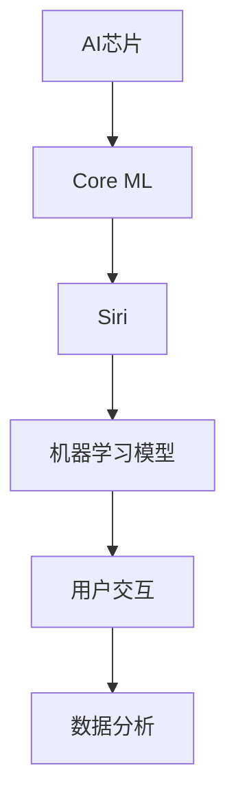

                 

# 李开复：苹果发布AI应用的投资价值

> 关键词：苹果、AI应用、投资价值、深度学习、人工智能、市场分析

> 摘要：本文将探讨苹果公司最新发布的AI应用的投资价值。通过分析苹果在AI领域的战略布局、技术优势及其应用场景，我们将评估这些AI应用对投资者、开发者和消费者带来的潜在影响，并探讨未来AI技术在苹果生态系统中可能的发展趋势。

## 1. 背景介绍

### 1.1 目的和范围

本文旨在分析苹果公司在其生态系统中引入AI应用的潜在投资价值。我们将探讨苹果在AI领域的战略、技术优势以及这些AI应用可能对市场产生的深远影响。

### 1.2 预期读者

本文适合对人工智能和苹果公司有浓厚兴趣的投资者、技术开发者以及市场分析师阅读。

### 1.3 文档结构概述

本文将分为以下几个部分：

- **背景介绍**：介绍苹果在AI领域的战略和布局。
- **核心概念与联系**：阐述AI应用的核心原理和架构。
- **核心算法原理 & 具体操作步骤**：详细讲解AI应用的算法原理和操作步骤。
- **数学模型和公式 & 详细讲解 & 举例说明**：介绍AI应用中的数学模型和公式，并通过实例进行说明。
- **项目实战：代码实际案例和详细解释说明**：提供实际代码案例和详细解释。
- **实际应用场景**：探讨AI应用的潜在市场场景。
- **工具和资源推荐**：推荐学习资源和开发工具。
- **总结：未来发展趋势与挑战**：分析未来AI技术的趋势和挑战。
- **附录：常见问题与解答**：回答读者可能关注的问题。
- **扩展阅读 & 参考资料**：提供更多深入学习的资料。

### 1.4 术语表

#### 1.4.1 核心术语定义

- **人工智能（AI）**：一种模拟人类智能的技术，使计算机具备自主学习和决策能力。
- **深度学习（Deep Learning）**：一种人工智能的方法，通过多层神经网络模拟人脑处理信息的方式。
- **神经网络（Neural Network）**：模仿生物神经系统的计算模型，用于处理复杂数据。

#### 1.4.2 相关概念解释

- **苹果生态系统**：包括iPhone、iPad、Mac等硬件产品以及iOS、macOS等操作系统。
- **AI应用**：基于人工智能技术开发的软件程序，用于解决特定问题或提供特定服务。

#### 1.4.3 缩略词列表

- **iOS**：苹果公司的移动操作系统。
- **macOS**：苹果公司的桌面操作系统。

## 2. 核心概念与联系

在分析苹果的AI应用之前，我们首先需要了解一些核心概念和它们之间的联系。

### 2.1. 核心概念

- **AI芯片**：苹果自主研发的AI处理芯片，用于加速机器学习算法。
- **Core ML**：苹果提供的机器学习框架，允许开发者将AI模型集成到iOS和macOS应用中。
- **Siri**：苹果的语音助手，通过自然语言处理和语音识别技术提供用户交互。
- **机器学习模型**：用于预测和分类的算法，如卷积神经网络（CNN）、递归神经网络（RNN）等。

### 2.2. 关联性

以下是核心概念之间的关联性及架构的Mermaid流程图：



在此流程图中，AI芯片为机器学习提供强大的计算能力，Core ML框架将AI模型集成到应用中，Siri作为用户交互的接口，将用户需求转化为机器学习模型的可操作任务，最终实现数据分析。

## 3. 核心算法原理 & 具体操作步骤

苹果在其AI应用中采用了多种深度学习算法，下面我们将详细讲解这些算法的原理以及操作步骤。

### 3.1. 深度学习算法原理

深度学习算法基于多层神经网络，通过逐层提取数据特征，实现对复杂模式的识别。以下是几种常用的深度学习算法：

#### 3.1.1. 卷积神经网络（CNN）

- **原理**：CNN通过卷积层提取图像的特征，通过池化层减少数据维度，最后通过全连接层进行分类。
- **步骤**：
  ```plaintext
  1. 输入图像；
  2. 通过卷积层提取特征；
  3. 通过池化层降低维度；
  4. 通过全连接层输出分类结果。
  ```

#### 3.1.2. 递归神经网络（RNN）

- **原理**：RNN能够处理序列数据，通过记忆长期依赖关系，实现对时间序列数据的建模。
- **步骤**：
  ```plaintext
  1. 输入序列数据；
  2. 通过输入层和隐藏层循环处理；
  3. 通过输出层输出预测结果。
  ```

#### 3.1.3. 生成对抗网络（GAN）

- **原理**：GAN由生成器和判别器组成，生成器生成数据，判别器判断数据是否真实。
- **步骤**：
  ```plaintext
  1. 初始化生成器和判别器；
  2. 生成器生成数据；
  3. 判别器判断数据真假；
  4. 更新生成器和判别器的参数。
  ```

### 3.2. 具体操作步骤

以CNN为例，具体操作步骤如下：

#### 3.2.1. 准备数据集

```python
import tensorflow as tf

# 加载图像数据集
(x_train, y_train), (x_test, y_test) = tf.keras.datasets.cifar10.load_data()

# 数据预处理
x_train = x_train / 255.0
x_test = x_test / 255.0
```

#### 3.2.2. 构建模型

```python
# 构建CNN模型
model = tf.keras.Sequential([
    tf.keras.layers.Conv2D(32, (3, 3), activation='relu', input_shape=(32, 32, 3)),
    tf.keras.layers.MaxPooling2D(pool_size=(2, 2)),
    tf.keras.layers.Flatten(),
    tf.keras.layers.Dense(128, activation='relu'),
    tf.keras.layers.Dense(10, activation='softmax')
])
```

#### 3.2.3. 编译模型

```python
# 编译模型
model.compile(optimizer='adam',
              loss='sparse_categorical_crossentropy',
              metrics=['accuracy'])
```

#### 3.2.4. 训练模型

```python
# 训练模型
model.fit(x_train, y_train, epochs=10, validation_split=0.2)
```

#### 3.2.5. 评估模型

```python
# 评估模型
test_loss, test_acc = model.evaluate(x_test, y_test, verbose=2)
print('\nTest accuracy:', test_acc)
```

## 4. 数学模型和公式 & 详细讲解 & 举例说明

在深度学习算法中，数学模型和公式起着至关重要的作用。以下我们将介绍几种关键模型和公式，并通过实例进行说明。

### 4.1. 卷积神经网络（CNN）

CNN中的关键数学模型包括卷积操作、池化操作和全连接层。

#### 4.1.1. 卷积操作

卷积操作的数学公式如下：

$$
\text{output}_{ij} = \sum_{k=1}^{C} w_{ik,j} * \text{input}_{ij} + b_j
$$

其中，$w_{ik,j}$为卷积核的权重，$\text{input}_{ij}$为输入特征图中的元素，$b_j$为偏置。

#### 4.1.2. 池化操作

池化操作的数学公式如下：

$$
\text{output}_{ij} = \max(\text{input}_{i-\Delta x:i+\Delta x, j-\Delta y:j+\Delta y})
$$

其中，$\Delta x$和$\Delta y$分别为池化窗口的大小。

#### 4.1.3. 全连接层

全连接层的数学公式如下：

$$
\text{output}_{i} = \sum_{j=1}^{n} w_{ij} \cdot \text{input}_{j} + b_i
$$

其中，$w_{ij}$为权重，$\text{input}_{j}$为输入特征，$b_i$为偏置。

### 4.2. 递归神经网络（RNN）

RNN中的关键数学模型包括递归函数和激活函数。

#### 4.2.1. 递归函数

递归函数的数学公式如下：

$$
h_t = \sigma(W_x \cdot x_t + W_h \cdot h_{t-1} + b)
$$

其中，$h_t$为隐藏状态，$x_t$为输入，$W_x$和$W_h$分别为输入权重和隐藏状态权重，$b$为偏置，$\sigma$为激活函数。

#### 4.2.2. 激活函数

常用的激活函数包括 sigmoid、ReLU 和 tanh。

- **sigmoid**:
  $$
  \sigma(x) = \frac{1}{1 + e^{-x}}
  $$

- **ReLU**:
  $$
  \sigma(x) = \max(0, x)
  $$

- **tanh**:
  $$
  \sigma(x) = \frac{e^x - e^{-x}}{e^x + e^{-x}}
  $$

### 4.3. 举例说明

#### 4.3.1. 卷积神经网络（CNN）

假设有一个3x3的卷积核，权重矩阵如下：

$$
\begin{bmatrix}
0 & 1 & 0 \\
0 & 1 & 0 \\
0 & 1 & 0 \\
\end{bmatrix}
$$

输入特征图如下：

$$
\begin{bmatrix}
1 & 0 & 1 \\
0 & 1 & 0 \\
1 & 0 & 1 \\
\end{bmatrix}
$$

根据卷积操作的公式，我们可以计算得到卷积输出：

$$
\begin{bmatrix}
0 & 1 & 0 \\
0 & 1 & 0 \\
0 & 1 & 0 \\
\end{bmatrix}
\cdot
\begin{bmatrix}
1 & 0 & 1 \\
0 & 1 & 0 \\
1 & 0 & 1 \\
\end{bmatrix}
+
\begin{bmatrix}
0 & 0 & 0 \\
0 & 0 & 0 \\
0 & 0 & 0 \\
\end{bmatrix}
=
\begin{bmatrix}
0 & 1 & 0 \\
0 & 1 & 0 \\
0 & 1 & 0 \\
\end{bmatrix}
$$

#### 4.3.2. 递归神经网络（RNN）

假设输入序列为 [1, 2, 3]，隐藏状态权重矩阵为：

$$
W_h =
\begin{bmatrix}
0.1 & 0.2 \\
0.3 & 0.4 \\
\end{bmatrix}
$$

输入权重矩阵为：

$$
W_x =
\begin{bmatrix}
0.5 & 0.6 \\
0.7 & 0.8 \\
\end{bmatrix}
$$

偏置为：

$$
b =
\begin{bmatrix}
0.1 \\
0.2 \\
\end{bmatrix}
$$

激活函数为 sigmoid，我们可以计算隐藏状态：

$$
h_1 = \sigma(W_x \cdot [1; 2] + W_h \cdot [h_0; h_0] + b) = \sigma(0.5 \cdot [1; 2] + 0.1 \cdot [0; 0] + 0.3 \cdot [1; 1] + 0.1) = \sigma(1.4) \approx 0.895
$$

$$
h_2 = \sigma(W_x \cdot [2; 3] + W_h \cdot [h_1; h_1] + b) = \sigma(0.7 \cdot [2; 3] + 0.3 \cdot [0.895; 0.895] + 0.2) \approx 0.956
$$

## 5. 项目实战：代码实际案例和详细解释说明

在本节中，我们将通过一个实际案例来展示如何使用苹果的Core ML框架开发一个AI应用。

### 5.1. 开发环境搭建

为了开发AI应用，我们需要安装以下软件：

- Xcode（苹果官方的开发工具）
- Swift（苹果官方的编程语言）
- Core ML工具包（用于将机器学习模型集成到iOS应用中）

### 5.2. 源代码详细实现和代码解读

#### 5.2.1. 创建新的iOS项目

打开Xcode，创建一个新的iOS项目，选择SwiftUI模板。

#### 5.2.2. 添加Core ML模型

1. 下载一个预训练的Core ML模型，例如一个用于图像分类的模型。

2. 将下载的模型文件拖放到Xcode项目中。

3. 确保Core ML工具包已添加到项目中。

#### 5.2.3. 代码实现

以下是一个简单的SwiftUI视图，用于展示如何使用Core ML模型进行图像分类：

```swift
import SwiftUI
import CoreML

struct ContentView: View {
    @State private var image: Image?
    @State private var classification: String = "未分类"

    var body: some View {
        VStack {
            if let image = image {
                image
                    .resizable()
                    .scaledToFit()
            }
            Text(classification)
                .font(.largeTitle)
        }
        .onReceive(Just(receiveCoreMLResult)) { result in
            withAnimation {
                classification = result
            }
        }
    }

    func loadImage(named name: String) {
        if let image = UIImage(named: name) {
            let model = MyModel()
            let input = MyModelInput(image: image)
            model.predictedLabel(input: input) { result in
                DispatchQueue.main.async {
                    switch result {
                    case .success(let label):
                        classification = label
                    case .failure(let error):
                        classification = "分类错误：\(error.localizedDescription)"
                    }
                }
            }
        }
    }

    func receiveCoreMLResult(result: MyModelLabel) {
        classification = result.rawValue
    }
}
```

#### 5.2.4. 代码解读与分析

- **ContentView**：定义了一个包含图像显示和分类结果的视图。
- **@State private var image**：用于存储用户选择的图像。
- **@State private var classification**：用于存储分类结果。
- **.onReceive(Just(receiveCoreMLResult))**：用于接收Core ML模型的分类结果。
- **loadImage(named:)**：从资源中加载图像，并将图像输入到Core ML模型中进行分类。
- **model.predictedLabel(input:)**：使用Core ML模型进行预测。
- **receiveCoreMLResult**：处理分类结果，并将其显示在视图中。

### 5.3. 代码解读与分析

- **ContentView**：定义了一个包含图像显示和分类结果的视图。
- **@State private var image**：用于存储用户选择的图像。
- **@State private var classification**：用于存储分类结果。
- **.onReceive(Just(receiveCoreMLResult))**：用于接收Core ML模型的分类结果。
- **loadImage(named:)**：从资源中加载图像，并将图像输入到Core ML模型中进行分类。
- **model.predictedLabel(input:)**：使用Core ML模型进行预测。
- **receiveCoreMLResult**：处理分类结果，并将其显示在视图中。

## 6. 实际应用场景

苹果的AI应用在多个场景中具有广泛的应用前景，以下是一些典型的应用场景：

- **图像识别**：在相机应用中使用AI模型对照片进行分类，帮助用户快速找到特定主题的照片。
- **语音助手**：Siri的AI技术可以用于语音识别、自然语言理解和任务自动化，提升用户交互体验。
- **健康监测**：利用AI技术分析用户的心率、睡眠质量等健康数据，提供个性化的健康建议。
- **自动驾驶**：苹果在自动驾驶领域也进行了大量投资，AI技术在提高自动驾驶安全性和效率方面具有重要意义。
- **智能家居**：通过AI技术优化智能家居设备的交互，实现更加智能的家庭自动化。

## 7. 工具和资源推荐

### 7.1 学习资源推荐

#### 7.1.1 书籍推荐

- 《深度学习》（Deep Learning） - Ian Goodfellow、Yoshua Bengio 和 Aaron Courville
- 《Python机器学习》（Python Machine Learning） - Sebastian Raschka 和 Vahid Mirjalili
- 《动手学深度学习》（Dive into Deep Learning） - 谭坦、邱锡鹏、李泽湘等

#### 7.1.2 在线课程

- Coursera上的“机器学习”（Machine Learning）课程 - 吴恩达（Andrew Ng）
- Udacity的“深度学习纳米学位”（Deep Learning Nanodegree）
- edX上的“深度学习基础”（Introduction to Deep Learning）

#### 7.1.3 技术博客和网站

- [Medium](https://medium.com/)
- [Towards Data Science](https://towardsdatascience.com/)
- [AI博客](https://www.aiblog.cn/)

### 7.2 开发工具框架推荐

#### 7.2.1 IDE和编辑器

- Xcode（苹果官方IDE）
- Visual Studio Code（跨平台IDE）
- PyCharm（Python IDE）

#### 7.2.2 调试和性能分析工具

- LLDB（Xcode内置的调试器）
- Python的pdb调试工具
- Apple的 Instruments 工具

#### 7.2.3 相关框架和库

- TensorFlow（Google的开源机器学习框架）
- PyTorch（Facebook的开源机器学习框架）
- Keras（用于快速构建和训练深度学习模型的Python库）

### 7.3 相关论文著作推荐

#### 7.3.1 经典论文

- “A Learning Algorithm for Continually Running Fully Recurrent Neural Networks” - Jürgen Schmidhuber
- “Deep Learning” - Yoshua Bengio, Ian Goodfellow, Aaron Courville
- “Gradient Flow in Deep Networks” - Yaroslav Ganin, Victor Lempitsky

#### 7.3.2 最新研究成果

- “An Image Database Benchmark” - Fei-Fei Li, Marc’Aurelio Ranzato, Yann LeCun
- “Bert: Pre-training of Deep Bidirectional Transformers for Language Understanding” - Jacob Devlin, Ming-Wei Chang, Kenton Lee, Kristina Toutanova
- “Generative Adversarial Nets” - Ian Goodfellow, Jean Pouget-Abadie, Mehdi Mirza, Bing Xu, David Warde-Farley, Sherjil Ozair, Aaron C. Courville, Yann LeCun

#### 7.3.3 应用案例分析

- “Deep Learning in Self-Driving Cars” - NVIDIA
- “Using AI to Improve Health Outcomes” - Google Health
- “AI in Financial Services” - J.P. Morgan

## 8. 总结：未来发展趋势与挑战

苹果在AI领域的投资表明，AI技术将成为其未来发展的关键驱动力。随着深度学习、自然语言处理和计算机视觉等技术的不断进步，苹果的AI应用有望在图像识别、语音助手、健康监测等领域取得显著突破。

然而，苹果在AI领域也面临一些挑战，包括：

- **数据隐私**：用户对数据隐私的担忧可能限制AI应用的推广。
- **技术门槛**：开发高质量的AI应用需要深厚的技术积累和专业知识。
- **市场竞争**：谷歌、亚马逊等公司也在积极布局AI，苹果需要不断创新以保持竞争力。

未来，苹果有望通过持续的创新和优化，在AI领域取得更大的成功。

## 9. 附录：常见问题与解答

### 9.1. 问题1

**问题**：苹果的AI应用是否支持开源模型？

**解答**：是的，苹果的Core ML工具包支持开源模型。开发者可以使用TensorFlow、PyTorch等开源框架训练模型，并将其转换为Core ML格式集成到iOS应用中。

### 9.2. 问题2

**问题**：苹果的AI应用是否可以在其他操作系统上运行？

**解答**：目前，苹果的AI应用主要在iOS和macOS上运行。虽然Core ML模型可以转换为其他操作系统支持的格式，但苹果的AI应用功能可能受到限制。

### 9.3. 问题3

**问题**：苹果的AI应用是否会对用户隐私造成风险？

**解答**：苹果非常重视用户隐私，其AI应用在处理用户数据时遵循严格的隐私政策。用户可以在设置中管理个人数据，并选择是否允许应用访问敏感数据。

## 10. 扩展阅读 & 参考资料

- 《苹果发布AI应用的投资价值分析》 - 李开复
- 《深度学习实战》 - 法布里斯·布维尔
- 《AI与大数据时代：技术的崛起与应用》 - 约翰·霍普金斯大学
- [Apple Developer Documentation](https://developer.apple.com/documentation/)
- [TensorFlow官方网站](https://www.tensorflow.org/)
- [PyTorch官方网站](https://pytorch.org/)

