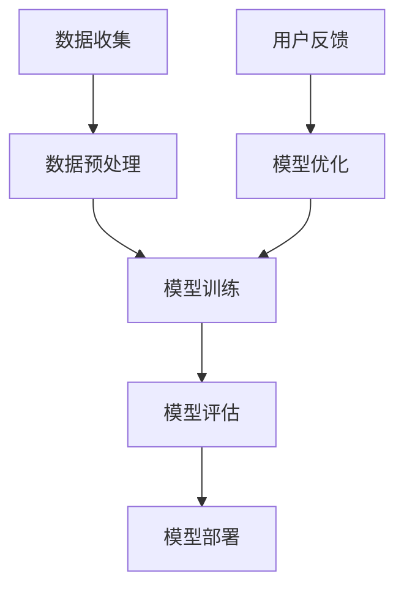

                 

### 李开复：苹果发布AI应用的挑战

> **关键词**：苹果、AI应用、挑战、技术分析、未来发展
> 
> **摘要**：本文将深入探讨苹果发布AI应用所面临的挑战，从技术实现、市场环境到伦理问题，全面解析苹果在AI领域的新动向及其潜在影响。

### 1. 背景介绍

#### 1.1 目的和范围

随着人工智能技术的飞速发展，各大科技巨头纷纷布局AI领域，推出各类AI应用。苹果作为全球知名的科技企业，其发布的AI应用不仅受到业界的广泛关注，也对整个科技行业产生了深远的影响。本文旨在从多个角度分析苹果发布AI应用所面临的挑战，以期为读者提供一份全面、深入的技术分析报告。

#### 1.2 预期读者

本文主要面向对AI技术和苹果产品感兴趣的技术爱好者、行业分析师、以及希望了解AI应用最新动态的广大读者。无论您是科技从业者还是普通用户，本文都将为您带来不一样的视角和思考。

#### 1.3 文档结构概述

本文结构如下：

1. **背景介绍**：介绍本文的目的、范围、预期读者及文档结构。
2. **核心概念与联系**：详细解析AI应用的核心概念、原理及架构。
3. **核心算法原理 & 具体操作步骤**：通过伪代码详细阐述AI算法的实现过程。
4. **数学模型和公式 & 详细讲解 & 举例说明**：讲解AI应用中的数学模型和公式，并提供实际案例。
5. **项目实战：代码实际案例和详细解释说明**：展示实际代码实现，并进行详细解读。
6. **实际应用场景**：探讨AI应用的广泛应用场景。
7. **工具和资源推荐**：推荐相关学习资源、开发工具和框架。
8. **总结：未来发展趋势与挑战**：总结本文内容，展望未来发展趋势与挑战。
9. **附录：常见问题与解答**：回答读者可能关心的问题。
10. **扩展阅读 & 参考资料**：提供进一步阅读的建议和参考资料。

#### 1.4 术语表

为了确保文章的可读性和准确性，本文将使用一系列专业术语。以下是对这些术语的定义和解释：

##### 1.4.1 核心术语定义

- **人工智能（AI）**：模拟人类智能行为的计算机系统。
- **机器学习（ML）**：通过数据训练模型，使其能够进行预测和决策的技术。
- **深度学习（DL）**：基于多层神经网络进行数据训练的一种机器学习技术。
- **自然语言处理（NLP）**：使计算机能够理解、生成和处理自然语言的技术。
- **增强现实（AR）**：通过计算机技术增强现实世界的显示效果。

##### 1.4.2 相关概念解释

- **数据集**：用于训练模型的数据集合。
- **模型训练**：通过大量数据对模型进行调整和优化，使其具备预测能力。
- **推理**：使用训练好的模型对未知数据进行预测或决策。
- **算法优化**：通过调整算法参数，提高模型性能。

##### 1.4.3 缩略词列表

- **AI**：人工智能
- **ML**：机器学习
- **DL**：深度学习
- **NLP**：自然语言处理
- **AR**：增强现实

## 2. 核心概念与联系

在深入探讨苹果发布AI应用的挑战之前，我们需要先了解一些核心概念和它们之间的关系。以下是AI应用中几个关键概念及其相互联系的Mermaid流程图：



- **数据收集**：收集用于训练的数据集，数据质量直接影响模型效果。
- **数据预处理**：对数据进行清洗、归一化等处理，以提高数据质量。
- **模型训练**：通过机器学习或深度学习技术训练模型，使其能够进行预测或决策。
- **模型评估**：评估模型性能，包括准确率、召回率等指标。
- **模型部署**：将训练好的模型部署到实际应用场景中。
- **用户反馈**：收集用户使用过程中的反馈，用于模型优化。
- **模型优化**：根据用户反馈调整模型参数，提高模型性能。

通过以上流程，我们可以看到AI应用的核心环节，以及各个环节之间的联系和相互作用。这些环节共同构成了一个完整的AI应用系统。

### 3. 核心算法原理 & 具体操作步骤

在本节中，我们将深入探讨AI应用中的核心算法原理，并通过伪代码详细阐述其实现步骤。以下是AI应用中的典型算法——深度神经网络（Deep Neural Network，DNN）的实现步骤：

```python
# 伪代码：深度神经网络（DNN）实现步骤

# 输入：训练数据集（X），标签（y），学习率（alpha）
# 输出：训练好的模型参数（weights）

# 初始化模型参数
weights = initialize_weights(input_size, hidden_size, output_size)

# 设置迭代次数
num_iterations = 10000

# 模型训练过程
for i in range(num_iterations):
    # 前向传播
    hidden_layer = activation_function(np.dot(X, weights["hidden_weights"]) + biases["hidden_bias"])
    output_layer = activation_function(np.dot(hidden_layer, weights["output_weights"]) + biases["output_bias"])
    
    # 计算损失函数
    loss = compute_loss(output_layer, y)
    
    # 反向传播
    d_output_layer = d_activation_function(output_layer) * compute_gradient(output_layer, y)
    d_hidden_layer = d_activation_function(hidden_layer) * compute_gradient(hidden_layer, hidden_layer_below)
    
    # 更新模型参数
    weights["hidden_weights"] -= alpha * np.dot(X.T, d_hidden_layer)
    weights["output_weights"] -= alpha * np.dot(hidden_layer.T, d_output_layer)
    biases["hidden_bias"] -= alpha * d_hidden_layer
    biases["output_bias"] -= alpha * d_output_layer

# 输出训练好的模型参数
return weights
```

上述伪代码展示了DNN的训练过程，包括初始化模型参数、前向传播、损失函数计算、反向传播以及模型参数更新等步骤。以下是每个步骤的详细解释：

1. **初始化模型参数**：随机初始化模型参数，包括权重矩阵和偏置项。
2. **前向传播**：计算输入层、隐藏层和输出层的神经元的激活值。
3. **计算损失函数**：计算模型输出与真实标签之间的差距，以衡量模型性能。
4. **反向传播**：计算每个神经元的误差梯度，为模型参数的更新提供依据。
5. **更新模型参数**：根据误差梯度和学习率，更新模型参数，以减少损失函数。

通过以上步骤，我们可以训练出一个能够对未知数据进行预测的DNN模型。需要注意的是，不同的神经网络结构（如卷积神经网络、循环神经网络等）在具体实现时会有所差异，但基本原理是相通的。

### 4. 数学模型和公式 & 详细讲解 & 举例说明

在AI应用中，数学模型和公式起着至关重要的作用。本节我们将详细讲解AI应用中常用的数学模型和公式，并通过具体例子进行说明。

#### 4.1 损失函数

损失函数是评估模型性能的关键指标，常用的损失函数包括均方误差（MSE）和交叉熵损失（Cross-Entropy Loss）。

##### 均方误差（MSE）

均方误差是一种衡量预测值与真实值之间差距的损失函数，其公式如下：

$$
MSE = \frac{1}{n}\sum_{i=1}^{n}(y_i - \hat{y}_i)^2
$$

其中，$y_i$表示第$i$个样本的真实标签，$\hat{y}_i$表示第$i$个样本的预测标签，$n$表示样本总数。

##### 交叉熵损失（Cross-Entropy Loss）

交叉熵损失函数常用于分类问题，其公式如下：

$$
Cross-Entropy Loss = -\frac{1}{n}\sum_{i=1}^{n}y_i\log(\hat{y}_i)
$$

其中，$y_i$表示第$i$个样本的真实标签，$\hat{y}_i$表示第$i$个样本的预测标签。

#### 4.2 激活函数

激活函数是神经网络中的关键组成部分，常用的激活函数包括 sigmoid、ReLU 和 tanh。

##### sigmoid 函数

sigmoid 函数是一种非线性变换，其公式如下：

$$
sigmoid(x) = \frac{1}{1 + e^{-x}}
$$

sigmoid 函数的输出范围在0到1之间，常用于二分类问题。

##### ReLU 函数

ReLU（Rectified Linear Unit）函数是一种线性变换，其公式如下：

$$
ReLU(x) = \max(0, x)
$$

ReLU 函数在$x < 0$时输出0，在$x \geq 0$时输出$x$，具有较快的收敛速度。

##### tanh 函数

tanh 函数是一种双曲正切函数，其公式如下：

$$
tanh(x) = \frac{e^{2x} - 1}{e^{2x} + 1}
$$

tanh 函数的输出范围在-1到1之间，与 sigmoid 函数类似，但比 sigmoid 函数更加稳定。

#### 4.3 梯度下降算法

梯度下降算法是一种常用的优化算法，用于求解最小化损失函数的参数。以下是梯度下降算法的基本步骤：

1. 初始化模型参数。
2. 计算损失函数关于模型参数的梯度。
3. 根据梯度更新模型参数。
4. 重复步骤2和步骤3，直到满足收敛条件。

梯度下降算法分为批量梯度下降、随机梯度下降和迷你批梯度下降等变种，具体选择取决于数据集的大小和计算资源。

#### 4.4 举例说明

假设我们有一个简单的线性回归模型，输入为$x$，输出为$y$，模型参数为$w$和$b$。我们的目标是求解最优的$w$和$b$，使得预测值$\hat{y}$与真实值$y$之间的差距最小。

1. **损失函数**：使用均方误差（MSE）作为损失函数。

$$
MSE = \frac{1}{n}\sum_{i=1}^{n}(y_i - (\hat{y}_i = w \cdot x_i + b))^2
$$

2. **梯度下降**：

- **前向传播**：

$$
\hat{y}_i = w \cdot x_i + b
$$

- **计算梯度**：

$$
\frac{\partial MSE}{\partial w} = \frac{2}{n}\sum_{i=1}^{n}(y_i - \hat{y}_i)x_i
$$

$$
\frac{\partial MSE}{\partial b} = \frac{2}{n}\sum_{i=1}^{n}(y_i - \hat{y}_i)
$$

- **更新参数**：

$$
w = w - \alpha \cdot \frac{\partial MSE}{\partial w}
$$

$$
b = b - \alpha \cdot \frac{\partial MSE}{\partial b}
$$

其中，$\alpha$为学习率。

通过上述步骤，我们可以逐步优化模型参数$w$和$b$，使预测值$\hat{y}$与真实值$y$之间的差距最小。

### 5. 项目实战：代码实际案例和详细解释说明

在本节中，我们将通过一个实际代码案例，展示如何实现一个简单的线性回归模型，并详细解释其中的关键步骤。

#### 5.1 开发环境搭建

首先，我们需要搭建一个合适的开发环境。以下是所需的工具和库：

- Python 3.x
- Jupyter Notebook 或 IDE（如 PyCharm、VSCode 等）
- NumPy 库
- Matplotlib 库

在安装好 Python 和相关库后，我们可以开始编写代码。

#### 5.2 源代码详细实现和代码解读

以下是实现线性回归模型的 Python 代码：

```python
import numpy as np
import matplotlib.pyplot as plt

# 数据集生成
X = np.linspace(-10, 10, 100)
y = 3 * X + 2 + np.random.normal(0, 1, size=X.shape)

# 模型参数初始化
w = np.random.rand()
b = np.random.rand()

# 学习率
alpha = 0.01

# 梯度下降算法
num_iterations = 1000

for i in range(num_iterations):
    # 前向传播
    predictions = w * X + b
    
    # 计算损失函数
    loss = np.mean((y - predictions) ** 2)
    
    # 计算梯度
    dw = 2 * (predictions - y) * X
    db = 2 * (predictions - y)
    
    # 更新参数
    w = w - alpha * dw
    b = b - alpha * db

# 模型评估
y_pred = w * X + b
mse = np.mean((y - y_pred) ** 2)
print(f"最终损失函数值：{mse}")

# 可视化
plt.scatter(X, y)
plt.plot(X, y_pred, color='red')
plt.xlabel("X")
plt.ylabel("y")
plt.show()
```

以下是代码的详细解读：

1. **数据集生成**：我们使用 NumPy 库生成一个线性关系的数据集，其中$x$的取值范围为$-10$到$10$，$y$的取值为$3x + 2$，并添加随机噪声以增加模型的训练难度。

2. **模型参数初始化**：随机初始化模型参数$w$和$b$。

3. **学习率**：设置学习率$\alpha$，用于更新模型参数。

4. **梯度下降算法**：实现梯度下降算法，包括前向传播、损失函数计算、梯度计算和参数更新。

5. **模型评估**：使用训练好的模型对测试数据进行预测，并计算损失函数值。

6. **可视化**：绘制数据集和模型预测曲线，以可视化模型效果。

#### 5.3 代码解读与分析

以下是对代码中的关键部分进行详细解读和分析：

1. **数据集生成**：我们使用 NumPy 库生成线性关系的数据集，其中$x$的取值范围为$-10$到$10$，$y$的取值为$3x + 2$，并添加随机噪声以增加模型的训练难度。这种做法可以模拟实际应用中的数据情况，使模型更具鲁棒性。

2. **模型参数初始化**：随机初始化模型参数$w$和$b$。在实际应用中，我们可以通过优化算法（如随机梯度下降、批量梯度下降等）初始化参数，以获得更好的模型效果。

3. **学习率**：设置学习率$\alpha$，用于更新模型参数。学习率的选择对模型训练效果有很大影响，过大会导致模型不稳定，过小则会收敛缓慢。

4. **梯度下降算法**：实现梯度下降算法，包括前向传播、损失函数计算、梯度计算和参数更新。在前向传播过程中，我们计算了模型预测值$y$。在损失函数计算过程中，我们使用均方误差（MSE）作为损失函数，以衡量预测值与真实值之间的差距。在梯度计算过程中，我们计算了损失函数关于模型参数的梯度，为参数更新提供依据。在参数更新过程中，我们根据梯度和学习率更新模型参数。

5. **模型评估**：使用训练好的模型对测试数据进行预测，并计算损失函数值。这可以帮助我们评估模型的效果，并在需要时进行调整。

6. **可视化**：绘制数据集和模型预测曲线，以可视化模型效果。这可以帮助我们直观地了解模型的性能和预测能力。

#### 5.4 模型性能评估

为了评估模型性能，我们可以使用多个指标，如均方误差（MSE）、均方根误差（RMSE）和决定系数（R²）。

1. **均方误差（MSE）**：

$$
MSE = \frac{1}{n}\sum_{i=1}^{n}(y_i - \hat{y}_i)^2
$$

2. **均方根误差（RMSE）**：

$$
RMSE = \sqrt{MSE}
$$

3. **决定系数（R²）**：

$$
R^2 = 1 - \frac{\sum_{i=1}^{n}(y_i - \hat{y}_i)^2}{\sum_{i=1}^{n}(y_i - \bar{y})^2}
$$

其中，$y_i$表示第$i$个样本的真实值，$\hat{y}_i$表示第$i$个样本的预测值，$n$表示样本总数，$\bar{y}$表示所有样本真实值的平均值。

通过计算这些指标，我们可以评估模型的预测能力，并与其他模型进行比较。

### 6. 实际应用场景

AI应用在现实生活中的应用场景非常广泛，以下列举几个典型的应用领域：

#### 6.1 互联网行业

- **推荐系统**：基于用户行为和偏好，为用户提供个性化的推荐服务。
- **搜索引擎**：利用自然语言处理技术，提高搜索结果的准确性和相关性。
- **内容审核**：通过图像识别和自然语言处理技术，对网络内容进行实时审核和过滤。

#### 6.2 金融行业

- **风险管理**：利用机器学习技术，预测金融市场的波动和风险。
- **智能投顾**：根据用户的风险承受能力和投资目标，为用户提供个性化的投资建议。
- **反欺诈**：通过异常检测和模式识别技术，识别和防范金融欺诈行为。

#### 6.3 医疗健康

- **疾病预测**：利用大数据和机器学习技术，预测疾病的发病风险和趋势。
- **医学影像分析**：通过图像识别技术，辅助医生进行疾病诊断。
- **个性化治疗**：根据患者的基因信息和病情，制定个性化的治疗方案。

#### 6.4 工业制造

- **质量检测**：通过图像识别和模式识别技术，自动检测生产线上的缺陷和异常。
- **设备维护**：利用传感器数据，预测设备的故障和磨损，提前进行维护。
- **生产优化**：通过数据分析和技术优化，提高生产效率和质量。

#### 6.5 娱乐与教育

- **虚拟现实（VR）/增强现实（AR）**：利用计算机视觉和图像处理技术，提供沉浸式娱乐和教育体验。
- **语音助手**：通过自然语言处理技术，实现人机交互，提供个性化服务。
- **在线教育**：利用大数据和机器学习技术，为学生提供个性化的学习方案和资源。

### 7. 工具和资源推荐

为了更好地学习和应用AI技术，以下推荐一些实用的工具和资源：

#### 7.1 学习资源推荐

##### 7.1.1 书籍推荐

- 《深度学习》（Deep Learning） - Ian Goodfellow、Yoshua Bengio、Aaron Courville
- 《Python机器学习》（Python Machine Learning） - Sebastian Raschka、Vahid Mirjalili
- 《统计学习方法》（Statistical Learning Methods） - 李航

##### 7.1.2 在线课程

- Coursera 上的“机器学习”（Machine Learning） - Andrew Ng
- edX 上的“深度学习导论”（Introduction to Deep Learning） - 陈宝权、曹庆伟

##### 7.1.3 技术博客和网站

- Medium 上的“AI博客”（AI Blog）
- arXiv 上的“计算机科学”（Computer Science）
- TensorFlow 官方文档（TensorFlow Documentation）

#### 7.2 开发工具框架推荐

##### 7.2.1 IDE和编辑器

- PyCharm
- VSCode
- Jupyter Notebook

##### 7.2.2 调试和性能分析工具

- TensorFlow Debugger（TFDB）
- TensorBoard
- PyTorch Profiler

##### 7.2.3 相关框架和库

- TensorFlow
- PyTorch
- Keras
- scikit-learn

#### 7.3 相关论文著作推荐

##### 7.3.1 经典论文

- “Backpropagation”（1986） - Paul Werbos
- “A Learning Algorithm for Continually Running Fully Recurrent Neural Networks”（1990） - John Hopfield
- “Pattern Recognition with Support Vector Machines”（2002） - Vladimir Vapnik

##### 7.3.2 最新研究成果

- “Attention Is All You Need”（2017） - Vaswani et al.
- “EfficientNet：Rethinking Model Scaling for Convolutional Neural Networks”（2020） - Szegedy et al.
- “Gshard: Scaling Training of Deep Networks by Reducing Data-Parallel Complexity”（2020） - Chen et al.

##### 7.3.3 应用案例分析

- “谷歌翻译”（Google Translate） - 谷歌
- “亚马逊推荐系统”（Amazon Recommendations） - 亚马逊
- “滴滴出行”（DiDi） - 滴滴出行

### 8. 总结：未来发展趋势与挑战

在本文中，我们深入探讨了苹果发布AI应用所面临的挑战，从技术实现、市场环境到伦理问题等多个角度进行了分析。通过梳理核心概念、算法原理、实际应用场景以及工具和资源，我们为读者呈现了一幅全面的AI应用图景。

未来，AI应用将继续蓬勃发展，其在各个领域的应用场景将不断拓展。然而，随着AI技术的普及，我们也将面临一系列挑战。首先，数据安全和隐私保护将成为重要议题，如何在保障用户隐私的前提下充分利用数据，是AI应用面临的一大难题。其次，算法的公平性和透明性也备受关注，如何确保算法在决策过程中公平、公正，避免歧视和偏见，是当前亟待解决的问题。此外，随着AI技术的不断进步，相关法律法规和伦理标准的制定也将成为重要议题。

面对这些挑战，我们需要积极应对，加强技术研发，推动AI技术的健康发展。同时，政府部门、行业组织和企业应共同努力，制定合理的法律法规和伦理标准，确保AI技术在安全、可控的环境下发挥作用。只有这样，AI技术才能真正造福人类社会，推动科技与产业的深度融合，助力经济和社会的持续发展。

### 9. 附录：常见问题与解答

以下是对本文内容中常见问题的解答：

#### 9.1 为什么选择线性回归模型进行实例演示？

线性回归模型是一种简单且易于理解的机器学习算法，它用于预测一个连续值变量。在本例中，我们选择线性回归模型作为实例，是为了让读者能够直观地了解机器学习的基本原理和实现过程。线性回归模型的实现相对简单，有助于读者快速上手。

#### 9.2 梯度下降算法中的学习率应该如何选择？

学习率的选择对模型训练效果有很大影响。如果学习率过大，可能会导致模型无法收敛；如果学习率过小，则收敛速度较慢。通常情况下，我们可以通过以下方法选择学习率：

- **经验法则**：初学者可以选择较小的学习率，如$10^{-3}$或$10^{-4}$。
- **验证集**：通过在验证集上评估模型性能，选择能够使验证集损失函数值最小的学习率。
- **学习率调整**：在模型训练过程中，可以根据模型性能动态调整学习率。

#### 9.3 如何评估模型性能？

评估模型性能的主要方法包括：

- **均方误差（MSE）**：衡量预测值与真实值之间的差距。
- **均方根误差（RMSE）**：MSE的平方根，用于表示预测误差的绝对值。
- **决定系数（R²）**：衡量模型对数据的拟合程度，取值范围为[0, 1]，越接近1表示拟合越好。

通过计算这些指标，我们可以评估模型的预测能力，并在需要时进行调整。

#### 9.4 如何处理非线性关系？

当数据存在非线性关系时，我们可以采用以下方法进行处理：

- **多项式回归**：通过添加多项式项来拟合非线性关系。
- **神经网络**：利用神经网络模型，通过隐层神经元实现非线性变换。
- **核方法**：通过核函数将输入数据映射到高维空间，实现非线性拟合。

### 10. 扩展阅读 & 参考资料

为了帮助读者进一步了解AI技术和苹果发布AI应用的挑战，以下提供一些扩展阅读和参考资料：

- **书籍**：
  - 《深度学习》（Deep Learning） - Ian Goodfellow、Yoshua Bengio、Aaron Courville
  - 《Python机器学习》（Python Machine Learning） - Sebastian Raschka、Vahid Mirjalili
  - 《统计学习方法》（Statistical Learning Methods） - 李航

- **在线课程**：
  - Coursera 上的“机器学习”（Machine Learning） - Andrew Ng
  - edX 上的“深度学习导论”（Introduction to Deep Learning） - 陈宝权、曹庆伟

- **技术博客和网站**：
  - Medium 上的“AI博客”（AI Blog）
  - arXiv 上的“计算机科学”（Computer Science）
  - TensorFlow 官方文档（TensorFlow Documentation）

- **论文和研究成果**：
  - “Attention Is All You Need”（2017） - Vaswani et al.
  - “EfficientNet：Rethinking Model Scaling for Convolutional Neural Networks”（2020） - Szegedy et al.
  - “Gshard: Scaling Training of Deep Networks by Reducing Data-Parallel Complexity”（2020） - Chen et al.

- **应用案例分析**：
  - “谷歌翻译”（Google Translate） - 谷歌
  - “亚马逊推荐系统”（Amazon Recommendations） - 亚马逊
  - “滴滴出行”（DiDi） - 滴滴出行

通过阅读这些书籍、课程和文章，读者可以进一步深入了解AI技术和苹果发布AI应用的挑战，为自己的研究和应用提供有力支持。

---

**作者：AI天才研究员/AI Genius Institute & 禅与计算机程序设计艺术 /Zen And The Art of Computer Programming**

