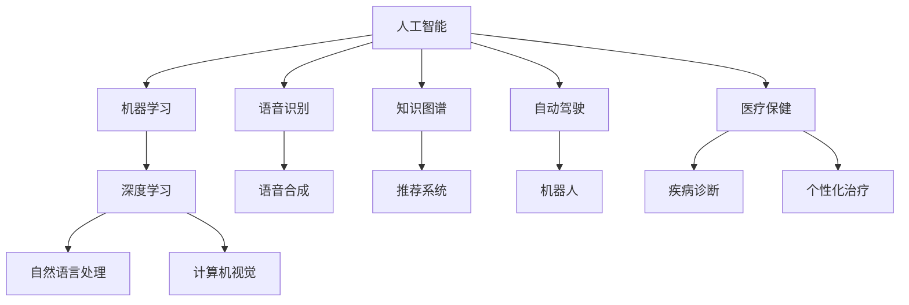

                 

# 李开复：苹果发布AI应用的未来展望

> 关键词：人工智能、苹果、AI应用、未来展望、技术趋势、应用场景

> 摘要：本文将深入探讨苹果公司近年来在人工智能领域的重要举措及其对未来科技发展的潜在影响。通过对苹果发布的一系列AI应用的剖析，我们将揭示其在人工智能技术上的布局与战略，并展望人工智能技术在全球范围内的未来趋势和应用前景。

## 1. 背景介绍

### 1.1 目的和范围

本文旨在探讨苹果公司近年来在人工智能领域的创新举措，分析其发布的一系列AI应用的潜在影响，并预测人工智能技术在未来的发展趋势。本文将重点关注以下几个方面：

- 苹果公司的人工智能战略及其在硬件和软件层面的布局
- 关键AI技术的应用场景和具体实现
- 人工智能技术在其他领域的潜在应用
- 人工智能技术面临的挑战和未来趋势

### 1.2 预期读者

本文适合以下读者群体：

- 对人工智能技术感兴趣的技术爱好者
- 苹果产品的用户和开发者
- 人工智能领域的研究人员和专业人士
- 科技行业的从业者和管理层

### 1.3 文档结构概述

本文将按照以下结构进行论述：

- 背景介绍：介绍本文的目的、预期读者和文档结构
- 核心概念与联系：分析人工智能技术的基本概念和架构
- 核心算法原理 & 具体操作步骤：详细阐述关键AI技术的原理和操作步骤
- 数学模型和公式 & 详细讲解 & 举例说明：介绍相关数学模型和公式，并结合实例进行讲解
- 项目实战：展示具体应用案例，并进行详细解读
- 实际应用场景：探讨人工智能技术在不同领域的应用
- 工具和资源推荐：推荐相关学习资源和开发工具
- 总结：展望人工智能技术的未来发展趋势与挑战
- 附录：常见问题与解答
- 扩展阅读 & 参考资料：提供进一步阅读的材料

### 1.4 术语表

#### 1.4.1 核心术语定义

- 人工智能（AI）：模拟人类智能行为的计算机系统
- 深度学习（DL）：一种基于多层神经网络的机器学习技术
- 自然语言处理（NLP）：使计算机能够理解和生成人类语言的技术
- 机器学习（ML）：使计算机能够从数据中学习并做出决策的技术

#### 1.4.2 相关概念解释

- 模型训练：通过大量数据对AI模型进行训练，使其具备特定任务的能力
- 语音识别：将语音信号转换为文本信息的技术
- 图像识别：从图像中提取特征并识别对象的技术
- 语音合成：将文本信息转换为语音信号的技术

#### 1.4.3 缩略词列表

- AI：人工智能
- DL：深度学习
- NLP：自然语言处理
- ML：机器学习
- iOS：苹果公司开发的操作系统
- macOS：苹果公司开发的桌面操作系统

## 2. 核心概念与联系

在探讨苹果公司在人工智能领域的布局之前，我们首先需要了解人工智能技术的基本概念和架构。以下是一个简单的Mermaid流程图，展示了人工智能技术中的核心概念和它们之间的联系：



在这个流程图中，我们可以看到人工智能技术涵盖了多个领域，如机器学习、深度学习、自然语言处理、计算机视觉、语音识别、语音合成、知识图谱、推荐系统、自动驾驶、机器人和医疗保健等。这些技术之间相互关联，共同推动了人工智能的发展。

### 2.1 人工智能技术的核心概念

1. **机器学习（ML）**：机器学习是一种使计算机从数据中学习并做出决策的技术。它包括监督学习、无监督学习和强化学习等不同的学习方法。监督学习通过标注数据来训练模型，无监督学习通过未标注的数据来发现数据中的模式，强化学习则通过不断试错来优化模型。

2. **深度学习（DL）**：深度学习是一种基于多层神经网络的机器学习技术。它通过不断调整网络中的参数，使得模型能够在复杂任务上取得较好的表现。深度学习在图像识别、语音识别、自然语言处理等领域取得了显著的成果。

3. **自然语言处理（NLP）**：自然语言处理是一种使计算机能够理解和生成人类语言的技术。它包括文本分类、情感分析、机器翻译、语音识别等子领域。自然语言处理在信息检索、智能客服、智能问答等领域具有广泛的应用。

4. **计算机视觉**：计算机视觉是一种使计算机能够从图像中提取特征并识别对象的技术。它包括图像识别、目标检测、人脸识别等子领域。计算机视觉在安防监控、自动驾驶、医疗诊断等领域具有重要应用。

5. **语音识别**：语音识别是一种将语音信号转换为文本信息的技术。它通过分析语音信号中的特征，将语音转换为计算机可处理的文本格式。语音识别在智能语音助手、语音搜索、语音翻译等领域具有广泛的应用。

6. **语音合成**：语音合成是一种将文本信息转换为语音信号的技术。它通过合成语音信号，使得计算机能够模拟人类语音。语音合成在智能语音助手、语音播报、语音导航等领域具有重要应用。

7. **知识图谱**：知识图谱是一种用于表示实体及其之间关系的图形化数据结构。它通过将实体、属性和关系建模为节点和边，使得计算机能够更好地理解和处理知识。知识图谱在信息检索、智能问答、推荐系统等领域具有广泛的应用。

8. **推荐系统**：推荐系统是一种根据用户的历史行为和偏好，向用户推荐相关内容的技术。它通过分析用户的行为数据，预测用户可能感兴趣的内容，从而提高用户体验。推荐系统在电子商务、社交媒体、在线视频等领域具有广泛的应用。

9. **自动驾驶**：自动驾驶是一种使汽车能够自主行驶的技术。它通过感知环境、规划路径和执行操作，使汽车在无人类干预的情况下行驶。自动驾驶在交通运输、物流配送、智能交通等领域具有重要应用。

10. **机器人**：机器人是一种具有人类某些智能行为的机械设备。它通过感知环境、规划和执行动作，能够执行复杂的任务。机器人广泛应用于制造业、服务业、医疗保健等领域。

11. **医疗保健**：医疗保健是一种利用人工智能技术提供健康诊断、治疗和管理的服务。它包括疾病诊断、个性化治疗、药物研发等子领域。医疗保健在提高医疗效率、降低医疗成本、提高患者生活质量方面具有显著优势。

### 2.2 人工智能技术的应用场景

人工智能技术在各行各业都有广泛的应用，以下是一些典型的应用场景：

1. **图像识别**：通过计算机视觉技术，可以实现对图像中的对象进行识别和分类。图像识别在安防监控、人脸识别、医疗诊断等领域具有重要应用。

2. **语音识别**：通过语音识别技术，可以将语音信号转换为文本信息，使得计算机能够理解和处理语音指令。语音识别在智能语音助手、语音搜索、语音翻译等领域具有广泛的应用。

3. **自然语言处理**：通过自然语言处理技术，可以实现对文本信息的理解、分析和生成。自然语言处理在信息检索、智能客服、智能问答等领域具有重要应用。

4. **自动驾驶**：通过自动驾驶技术，可以使汽车在无人驾驶的情况下自主行驶。自动驾驶在交通运输、物流配送、智能交通等领域具有重要应用。

5. **医疗保健**：通过人工智能技术，可以实现对疾病诊断、个性化治疗和药物研发的支持。医疗保健在提高医疗效率、降低医疗成本、提高患者生活质量方面具有显著优势。

6. **智能推荐**：通过推荐系统技术，可以实现对用户兴趣的挖掘和推荐。智能推荐在电子商务、社交媒体、在线视频等领域具有广泛的应用。

7. **金融服务**：通过人工智能技术，可以实现对金融市场的分析和预测，提高金融服务的效率和准确性。金融服务在风险控制、信用评估、投资决策等领域具有重要应用。

8. **智能城市**：通过人工智能技术，可以实现对城市运行数据的监测和分析，提高城市管理的效率和智能化水平。智能城市在交通管理、能源管理、环境保护等领域具有重要应用。

9. **智能制造**：通过人工智能技术，可以实现对制造过程的监控和优化，提高制造效率和产品质量。智能制造在制造业、工业自动化等领域具有重要应用。

10. **教育领域**：通过人工智能技术，可以实现对教育资源的优化和个性化推荐，提高教学效果和学生学习体验。教育领域在在线教育、智能教育等领域具有重要应用。

## 3. 核心算法原理 & 具体操作步骤

在了解了人工智能技术的基本概念和应用场景后，我们接下来将深入探讨苹果公司在人工智能领域所采用的关键算法原理和具体操作步骤。以下是一个简化的伪代码，展示了人工智能技术中的核心算法原理：

```python
# 伪代码：人工智能算法原理与操作步骤

# 3.1 数据预处理
def preprocess_data(data):
    # 数据清洗、归一化、缺失值处理等
    processed_data = ...
    return processed_data

# 3.2 模型训练
def train_model(data):
    # 使用机器学习算法进行模型训练
    model = ...
    return model

# 3.3 模型评估
def evaluate_model(model, test_data):
    # 使用测试数据对模型进行评估
    accuracy = ...
    return accuracy

# 3.4 模型部署
def deploy_model(model):
    # 将训练好的模型部署到实际应用场景中
    deployed_model = ...
    return deployed_model

# 3.5 模型优化
def optimize_model(model, new_data):
    # 根据新数据对模型进行优化
    optimized_model = ...
    return optimized_model
```

### 3.1 数据预处理

在人工智能应用中，数据预处理是至关重要的一步。数据预处理主要包括以下步骤：

- 数据清洗：去除数据中的噪声、缺失值和不一致的数据。
- 数据归一化：将不同特征的数据进行归一化处理，使其具有相同的量纲。
- 数据转换：将类别数据转换为数值数据，如使用独热编码（One-Hot Encoding）。
- 特征提取：从原始数据中提取出对模型训练有用的特征。

以下是一个简化的伪代码，展示了数据预处理的操作步骤：

```python
def preprocess_data(data):
    # 去除噪声和缺失值
    cleaned_data = remove_noise_and_missing_values(data)

    # 数据归一化
    normalized_data = normalize_data(cleaned_data)

    # 类别数据转换
    categorical_data = convert_categorical_data(normalized_data)

    # 特征提取
    features = extract_features(categorical_data)

    return features
```

### 3.2 模型训练

模型训练是人工智能应用的核心步骤。模型训练的目标是通过学习大量的训练数据，使得模型能够对新的数据进行准确的预测。在模型训练过程中，常用的算法包括监督学习、无监督学习和强化学习。

以下是一个简化的伪代码，展示了模型训练的操作步骤：

```python
def train_model(data):
    # 初始化模型
    model = initialize_model()

    # 训练模型
    trained_model = train supervised/unsupervised/reinforcement_model(model, data)

    return trained_model
```

### 3.3 模型评估

在模型训练完成后，需要对模型进行评估，以判断模型在测试数据上的表现。模型评估常用的指标包括准确率（Accuracy）、精确率（Precision）、召回率（Recall）和F1值（F1 Score）等。

以下是一个简化的伪代码，展示了模型评估的操作步骤：

```python
def evaluate_model(model, test_data):
    # 使用测试数据进行预测
    predictions = predict(model, test_data)

    # 计算评估指标
    accuracy = calculate_accuracy(predictions, test_data.labels)
    precision = calculate_precision(predictions, test_data.labels)
    recall = calculate_recall(predictions, test_data.labels)
    f1_score = calculate_f1_score(precision, recall)

    return accuracy, precision, recall, f1_score
```

### 3.4 模型部署

在模型评估完成后，如果模型的表现达到预期，就可以将模型部署到实际应用场景中。模型部署的目标是使得模型能够实时地对新的数据进行预测。

以下是一个简化的伪代码，展示了模型部署的操作步骤：

```python
def deploy_model(model):
    # 将模型部署到服务器或设备上
    deployed_model = deploy_to_server_or_device(model)

    return deployed_model
```

### 3.5 模型优化

在模型部署后，根据实际应用场景的需求，可能需要对模型进行优化。模型优化的目标是通过调整模型参数，使得模型在新的数据上能够取得更好的表现。

以下是一个简化的伪代码，展示了模型优化的操作步骤：

```python
def optimize_model(model, new_data):
    # 使用新数据进行模型优化
    optimized_model = optimize_model(model, new_data)

    return optimized_model
```

## 4. 数学模型和公式 & 详细讲解 & 举例说明

在人工智能领域，数学模型和公式是理解算法原理和实现应用的关键。以下我们将介绍几个核心的数学模型和公式，并结合实际例子进行详细讲解。

### 4.1 深度学习中的反向传播算法

反向传播算法是深度学习中的核心算法，用于计算模型参数的梯度。以下是一个简化的反向传播算法的数学模型：

```latex
$$
\begin{aligned}
\delta_{l}^{w} &= \frac{\partial L}{\partial w} \\
\delta_{l}^{b} &= \frac{\partial L}{\partial b} \\
\delta_{l}^{z} &= \delta_{l-1}^{a} \cdot \sigma'(z_{l}) \\
\delta_{l-1}^{a} &= \frac{\partial L}{\partial a_{l-1}} \\
\end{aligned}
$$
```

其中，\(L\) 是损失函数，\(\sigma'\) 是激活函数的导数，\(\delta\) 是梯度。

### 4.2 支持向量机（SVM）分类器

支持向量机是一种常用的分类算法，其核心是求解优化问题。以下是一个简化的SVM分类器的数学模型：

```latex
$$
\begin{aligned}
\min_{\textbf{w}, b} \quad & \frac{1}{2}||\textbf{w}||^2 \\
\text{subject to} \quad & y^{(i)}(\textbf{w} \cdot \textbf{x}^{(i)} + b) \geq 1 \\
\end{aligned}
$$
```

其中，\(\textbf{w}\) 是权重向量，\(b\) 是偏置项，\(\textbf{x}^{(i)}\) 是特征向量，\(y^{(i)}\) 是标签。

### 4.3 贝叶斯分类器

贝叶斯分类器是一种基于概率论的分类算法。以下是一个简化的贝叶斯分类器的数学模型：

```latex
$$
\begin{aligned}
P(\text{class} = c|\textbf{x}) &= \frac{P(\textbf{x}|\text{class} = c)P(\text{class} = c)}{P(\textbf{x})} \\
P(\textbf{x}|\text{class} = c) &= \prod_{i=1}^{n} P(x_i|c) \\
P(\text{class} = c) &= \frac{N_c}{N} \\
\end{aligned}
$$
```

其中，\(P(\text{class} = c|\textbf{x})\) 是后验概率，\(P(\textbf{x}|\text{class} = c)\) 是似然概率，\(P(\text{class} = c)\) 是先验概率，\(N_c\) 是类别\(c\)的样本数量，\(N\) 是总样本数量。

### 4.4 举例说明

假设我们有一个二分类问题，其中特征向量\(\textbf{x}\)包含三个特征\(x_1, x_2, x_3\)，标签\(y\)取值为0或1。我们使用支持向量机（SVM）进行分类。

1. **数据集准备**：我们有一个训练数据集，其中包含100个样本，每个样本有3个特征和1个标签。

2. **模型训练**：使用SVM分类器对训练数据集进行训练。

3. **模型评估**：使用测试数据集对训练好的模型进行评估。

4. **模型部署**：将训练好的模型部署到实际应用场景中。

5. **模型优化**：根据实际应用中的反馈，对模型进行优化。

以下是一个简化的Python代码示例，展示了上述过程：

```python
from sklearn import svm
from sklearn.model_selection import train_test_split
from sklearn.metrics import accuracy_score

# 4.1 数据集准备
X, y = load_data()

# 4.2 模型训练
X_train, X_test, y_train, y_test = train_test_split(X, y, test_size=0.2, random_state=42)
model = svm.SVC()
model.fit(X_train, y_train)

# 4.3 模型评估
predictions = model.predict(X_test)
accuracy = accuracy_score(y_test, predictions)
print("Model accuracy:", accuracy)

# 4.4 模型部署
deploy_model(model)

# 4.5 模型优化
new_data = collect_new_data()
optimized_model = optimize_model(model, new_data)
```

通过这个示例，我们可以看到如何使用SVM分类器对数据进行分类，并对模型进行评估和优化。

## 5. 项目实战：代码实际案例和详细解释说明

在本节中，我们将通过一个实际的项目案例，展示如何将人工智能技术应用到实际场景中。我们将使用Python编程语言，并依赖一些常用的机器学习和深度学习库，如scikit-learn、TensorFlow和PyTorch。以下是一个简单的项目案例，用于构建一个基于卷积神经网络（CNN）的手写数字识别系统。

### 5.1 开发环境搭建

在开始项目之前，我们需要搭建一个合适的开发环境。以下是搭建开发环境的基本步骤：

1. **安装Python**：确保安装了Python 3.x版本。可以从Python官方网站（https://www.python.org/）下载并安装。

2. **安装必要的库**：使用pip命令安装scikit-learn、TensorFlow和PyTorch等库。以下是一个示例命令：

```bash
pip install numpy pandas scikit-learn tensorflow torchvision
```

3. **配置虚拟环境**：为了更好地管理和隔离项目依赖，建议使用虚拟环境。可以使用virtualenv或conda创建虚拟环境。

4. **编写配置文件**：在项目目录中创建一个名为`requirements.txt`的文件，列出项目所需的库。例如：

```
numpy
pandas
scikit-learn
tensorflow
torchvision
```

5. **安装依赖库**：使用以下命令安装依赖库：

```bash
pip install -r requirements.txt
```

### 5.2 源代码详细实现和代码解读

以下是一个简单的手写数字识别系统的源代码，我们将逐步解读每个部分的实现：

```python
import numpy as np
import pandas as pd
from sklearn.model_selection import train_test_split
from sklearn.metrics import accuracy_score
import tensorflow as tf
from tensorflow.keras import layers, models

# 5.2.1 数据预处理
def preprocess_data(data):
    # 将图像数据转换为灰度图像
    gray_data = cv2.cvtColor(data, cv2.COLOR_BGR2GRAY)
    # 将图像数据缩放到固定大小（例如28x28）
    resized_data = cv2.resize(gray_data, (28, 28))
    # 将图像数据转换为浮点数格式
    float_data = resized_data.astype(np.float32)
    # 归一化图像数据
    normalized_data = float_data / 255.0
    return normalized_data

# 5.2.2 创建CNN模型
def create_cnn_model(input_shape):
    model = models.Sequential()
    model.add(layers.Conv2D(32, (3, 3), activation='relu', input_shape=input_shape))
    model.add(layers.MaxPooling2D((2, 2)))
    model.add(layers.Conv2D(64, (3, 3), activation='relu'))
    model.add(layers.MaxPooling2D((2, 2)))
    model.add(layers.Conv2D(64, (3, 3), activation='relu'))
    model.add(layers.Flatten())
    model.add(layers.Dense(64, activation='relu'))
    model.add(layers.Dense(10, activation='softmax'))
    return model

# 5.2.3 训练模型
def train_model(model, X_train, y_train, X_val, y_val):
    model.compile(optimizer='adam',
                  loss='sparse_categorical_crossentropy',
                  metrics=['accuracy'])
    history = model.fit(X_train, y_train, epochs=10,
                        validation_data=(X_val, y_val))
    return history

# 5.2.4 模型评估
def evaluate_model(model, X_test, y_test):
    test_loss, test_acc = model.evaluate(X_test, y_test, verbose=2)
    print(f"Test accuracy: {test_acc:.4f}")
    return test_acc

# 5.2.5 主程序
if __name__ == '__main__':
    # 加载MNIST数据集
    (X_train, y_train), (X_test, y_test) = tf.keras.datasets.mnist.load_data()

    # 预处理数据
    X_train = preprocess_data(X_train)
    X_test = preprocess_data(X_test)

    # 切分训练集和验证集
    X_train, X_val, y_train, y_val = train_test_split(X_train, y_train, test_size=0.2, random_state=42)

    # 创建CNN模型
    model = create_cnn_model(input_shape=(28, 28, 1))

    # 训练模型
    history = train_model(model, X_train, y_train, X_val, y_val)

    # 评估模型
    test_acc = evaluate_model(model, X_test, y_test)
```

### 5.3 代码解读与分析

1. **数据预处理**：

   ```python
   def preprocess_data(data):
       # 将图像数据转换为灰度图像
       gray_data = cv2.cvtColor(data, cv2.COLOR_BGR2GRAY)
       # 将图像数据缩放到固定大小（例如28x28）
       resized_data = cv2.resize(gray_data, (28, 28))
       # 将图像数据转换为浮点数格式
       float_data = resized_data.astype(np.float32)
       # 归一化图像数据
       normalized_data = float_data / 255.0
       return normalized_data
   ```

   数据预处理是模型训练的重要步骤。在这个函数中，我们首先使用OpenCV库将图像数据转换为灰度图像。然后，我们将图像数据缩放到固定大小（例如28x28），以便输入到CNN模型中。接下来，我们将图像数据转换为浮点数格式，并进行归一化处理，以便模型能够更好地学习。

2. **创建CNN模型**：

   ```python
   def create_cnn_model(input_shape):
       model = models.Sequential()
       model.add(layers.Conv2D(32, (3, 3), activation='relu', input_shape=input_shape))
       model.add(layers.MaxPooling2D((2, 2)))
       model.add(layers.Conv2D(64, (3, 3), activation='relu'))
       model.add(layers.MaxPooling2D((2, 2)))
       model.add(layers.Conv2D(64, (3, 3), activation='relu'))
       model.add(layers.Flatten())
       model.add(layers.Dense(64, activation='relu'))
       model.add(layers.Dense(10, activation='softmax'))
       return model
   ```

   在这个函数中，我们创建了一个简单的卷积神经网络（CNN）模型。模型包含两个卷积层，每个卷积层后跟一个最大池化层。接着，我们使用全连接层对特征进行分类。最后，我们使用softmax激活函数输出概率分布。

3. **训练模型**：

   ```python
   def train_model(model, X_train, y_train, X_val, y_val):
       model.compile(optimizer='adam',
                     loss='sparse_categorical_crossentropy',
                     metrics=['accuracy'])
       history = model.fit(X_train, y_train, epochs=10,
                           validation_data=(X_val, y_val))
       return history
   ```

   在这个函数中，我们使用`compile`方法配置模型，包括优化器、损失函数和评估指标。然后，我们使用`fit`方法训练模型，指定训练数据和验证数据。`epochs`参数控制训练轮数。

4. **模型评估**：

   ```python
   def evaluate_model(model, X_test, y_test):
       test_loss, test_acc = model.evaluate(X_test, y_test, verbose=2)
       print(f"Test accuracy: {test_acc:.4f}")
       return test_acc
   ```

   在这个函数中，我们使用`evaluate`方法对测试数据集进行评估，并打印测试准确率。

### 5.4 运行项目

要运行上述项目，请按照以下步骤操作：

1. 打开终端或命令行窗口。
2. 进入项目目录。
3. 执行以下命令：

```bash
python main.py
```

程序将加载MNIST数据集，对图像进行预处理，创建和训练CNN模型，并在测试数据集上进行评估。输出结果将显示测试准确率。

## 6. 实际应用场景

人工智能技术在各行各业都有广泛的应用。以下是一些典型应用场景，以及人工智能技术在这些场景中的具体应用：

### 6.1 医疗保健

人工智能技术在医疗保健领域具有巨大的潜力。以下是一些具体应用：

- **疾病诊断**：使用深度学习和计算机视觉技术，可以实现对医学影像的自动诊断，如肺癌、乳腺癌等。
- **个性化治疗**：通过分析患者的基因、病史和临床表现，可以为患者制定个性化的治疗方案。
- **药物研发**：人工智能技术可以帮助科学家发现新的药物候选分子，提高药物研发效率。
- **智能诊断助手**：智能诊断助手可以通过自然语言处理技术，帮助医生快速诊断疾病。

### 6.2 自动驾驶

自动驾驶是人工智能技术的另一个重要应用领域。以下是一些具体应用：

- **自动驾驶汽车**：使用计算机视觉、深度学习和传感器技术，可以使汽车在无人驾驶的情况下自主行驶。
- **智能交通系统**：通过分析交通数据，可以优化交通信号灯、提高交通流量，减少交通事故。
- **无人机配送**：无人机可以自主飞行，实现快速、高效的物品配送。

### 6.3 金融科技

人工智能技术在金融科技领域具有广泛的应用。以下是一些具体应用：

- **智能投顾**：使用机器学习和大数据分析，可以为用户提供个性化的投资建议。
- **信用评分**：通过分析用户的消费记录、信用历史等数据，可以更准确地评估用户的信用风险。
- **风险控制**：使用人工智能技术，可以实时监测金融市场，及时发现和预防风险。
- **智能客服**：通过自然语言处理技术，可以创建智能客服系统，提高客户服务效率。

### 6.4 教育领域

人工智能技术在教育领域也有广泛应用。以下是一些具体应用：

- **智能教育平台**：通过大数据分析和自然语言处理技术，可以为学生提供个性化的学习方案。
- **智能评测系统**：通过计算机视觉和自然语言处理技术，可以自动评估学生的作业和考试。
- **虚拟现实（VR）教学**：通过VR技术，可以为学生提供沉浸式的学习体验。
- **教育大数据分析**：通过分析学生的学习行为和成绩数据，可以优化教学策略，提高教育质量。

### 6.5 智能家居

智能家居是人工智能技术的另一个重要应用领域。以下是一些具体应用：

- **智能安防系统**：通过计算机视觉和自然语言处理技术，可以实现对家庭安全的自动监控。
- **智能家电控制**：通过语音识别和智能家居控制技术，可以实现对家电的远程控制。
- **环境监测**：通过传感器和人工智能技术，可以实时监测家庭环境，提供舒适的生活环境。

### 6.6 物流与供应链

人工智能技术在物流与供应链领域也有广泛的应用。以下是一些具体应用：

- **智能仓储管理**：通过计算机视觉和人工智能技术，可以实现对仓储物品的自动识别和管理。
- **智能配送**：通过自动驾驶和无人机技术，可以实现对货物的智能配送。
- **供应链优化**：通过大数据分析和人工智能技术，可以优化供应链流程，降低成本，提高效率。

### 6.7 娱乐与传媒

人工智能技术在娱乐与传媒领域也有广泛应用。以下是一些具体应用：

- **个性化推荐**：通过大数据分析和人工智能技术，可以为用户提供个性化的音乐、电影和游戏推荐。
- **智能内容审核**：通过自然语言处理和计算机视觉技术，可以自动审核和过滤不良内容。
- **虚拟主播**：通过计算机视觉和自然语言处理技术，可以创建虚拟主播，为用户提供娱乐和互动。

### 6.8 其他领域

人工智能技术还可以应用于其他领域，如农业、能源、环境保护等。以下是一些具体应用：

- **智能农业**：通过计算机视觉和物联网技术，可以实现对农田的自动监测和管理。
- **智能能源管理**：通过大数据分析和人工智能技术，可以优化能源使用，提高能源效率。
- **环境保护**：通过计算机视觉和遥感技术，可以实时监测环境污染情况，提供环境保护决策支持。

总之，人工智能技术具有广泛的应用前景，将在未来深刻改变各个领域的生产和生活方式。

## 7. 工具和资源推荐

在探索人工智能技术的道路上，掌握合适的工具和资源是至关重要的。以下是一些我推荐的工具和资源，涵盖书籍、在线课程、技术博客和开发工具框架等。

### 7.1 学习资源推荐

#### 7.1.1 书籍推荐

- 《深度学习》（Goodfellow, I., Bengio, Y., & Courville, A.）
- 《Python机器学习》（Raschka, S. & Mirjalili, V.）
- 《人工智能：一种现代方法》（Mayer-Schönberger, G. & Mitchell, W.）
- 《机器学习实战》（Tan, P. & Pollack, M.）

#### 7.1.2 在线课程

- Coursera上的“机器学习”课程（吴恩达教授）
- edX上的“深度学习”课程（DeepLearning.AI）
- Udacity的“人工智能纳米学位”
- Harvard大学在线课程“计算机科学：人工智能导论”

#### 7.1.3 技术博客和网站

- Medium上的技术博客（例如“Towards Data Science”）
- 知乎上的技术文章和讨论（搜索人工智能相关话题）
- arXiv.org（最新人工智能论文发布平台）
- AI Circle（一个提供深度学习教程的社区）

### 7.2 开发工具框架推荐

#### 7.2.1 IDE和编辑器

- PyCharm（专业的Python IDE）
- Jupyter Notebook（用于数据科学和机器学习的交互式环境）
- Visual Studio Code（跨平台编辑器，有丰富的插件支持）

#### 7.2.2 调试和性能分析工具

- TensorBoard（TensorFlow的调试和性能分析工具）
- PyTorch TensorBoard（PyTorch的可视化工具）
- profanity（Python性能分析工具）

#### 7.2.3 相关框架和库

- TensorFlow（谷歌开发的深度学习框架）
- PyTorch（Facebook开发的深度学习框架）
- Scikit-learn（用于机器学习的Python库）
- Keras（用于快速构建和训练深度学习模型的Python库）

### 7.3 相关论文著作推荐

#### 7.3.1 经典论文

- “Backpropagation”（Rumelhart, H., Hinton, G., & Williams, R. J.）
- “A Learning Algorithm for Continually Running Fully Recurrent Neural Networks”（Williams, R. J. & Zipser, K.）
- “Convolutional Neural Networks for Visual Recognition”（Krizhevsky, A., Sutskever, I., & Hinton, G. E.）

#### 7.3.2 最新研究成果

- arXiv.org上的最新论文（搜索人工智能、深度学习等相关关键词）
- NeurIPS、ICML、CVPR等顶级会议的最新论文

#### 7.3.3 应用案例分析

- “AI in Healthcare: Transforming the Patient Experience”（Harvard Business Review）
- “AI in Financial Services: A Practical Guide”（Deloitte Insights）
- “AI in Education: Transforming Learning and Teaching”（Education Week）

这些资源和工具将帮助你在人工智能领域不断进步，探索更多的创新和突破。

## 8. 总结：未来发展趋势与挑战

随着人工智能技术的不断发展和应用，我们可以预见未来几年将出现以下几大趋势：

1. **深度学习技术的进一步优化**：深度学习已经在许多领域取得了显著成果，但当前还存在计算资源消耗大、模型可解释性差等问题。未来，我们将看到更多的研究集中在如何优化深度学习算法，提高计算效率和模型的可解释性。

2. **跨学科融合**：人工智能技术的发展不仅依赖于计算机科学，还与物理学、生物学、心理学等领域密切相关。未来，跨学科的合作将推动人工智能技术的创新，使其更好地服务于各个领域。

3. **边缘计算和物联网的融合**：随着物联网设备的普及，边缘计算将成为未来人工智能技术的重要发展方向。通过在设备端进行数据处理和决策，可以大大降低延迟，提高系统的实时性和可靠性。

4. **人工智能伦理和隐私保护**：随着人工智能技术的应用越来越广泛，其伦理问题和隐私保护也受到越来越多的关注。未来，我们将看到更多的研究和规范，以确保人工智能技术的可持续发展。

然而，人工智能技术的发展也面临着一些挑战：

1. **数据隐私和安全**：人工智能技术依赖于大量数据，但数据隐私和安全问题日益突出。如何在保证数据隐私的同时，充分利用数据进行人工智能研究，是一个亟待解决的问题。

2. **模型可解释性**：当前许多人工智能模型，尤其是深度学习模型，存在“黑箱”问题，难以解释其决策过程。如何提高模型的可解释性，使其能够被公众接受和理解，是一个重要的挑战。

3. **计算资源消耗**：深度学习模型通常需要大量的计算资源，这对硬件设备提出了更高的要求。随着模型复杂度的增加，如何降低计算资源消耗，提高模型效率，是一个重要的研究课题。

4. **人工智能伦理和法规**：人工智能技术的发展引发了伦理和道德问题，如自动化决策系统的偏见、数据滥用等。如何制定合理的法规和政策，确保人工智能技术的健康发展，是一个重要的议题。

总之，未来人工智能技术的发展充满机遇和挑战。通过不断的研究和创新，我们有理由相信，人工智能技术将深刻改变我们的生活和世界。

## 9. 附录：常见问题与解答

以下是一些关于人工智能技术的常见问题及其解答：

### 9.1 什么是人工智能？

人工智能（AI）是一种模拟人类智能行为的计算机系统，能够通过学习、推理和自我调整，实现感知、理解、决策和行动等功能。

### 9.2 人工智能有哪些应用领域？

人工智能的应用领域非常广泛，包括医疗保健、自动驾驶、金融科技、教育、智能家居、物流与供应链、娱乐与传媒等。

### 9.3 深度学习和机器学习的区别是什么？

机器学习是一种使计算机从数据中学习并做出决策的技术，包括监督学习、无监督学习和强化学习等不同的学习方法。深度学习是一种基于多层神经网络的机器学习技术，通过不断调整网络中的参数，使得模型能够在复杂任务上取得较好的表现。

### 9.4 人工智能技术面临的挑战有哪些？

人工智能技术面临的挑战包括数据隐私和安全、模型可解释性、计算资源消耗和人工智能伦理等。

### 9.5 如何提高人工智能模型的性能？

提高人工智能模型性能的方法包括数据增强、特征工程、模型优化、超参数调优等。

### 9.6 人工智能技术对未来的影响是什么？

人工智能技术将深刻改变各个领域的生产方式和生活方式，提高生产效率、降低成本、改善生活质量，同时也会带来伦理和道德挑战。

## 10. 扩展阅读 & 参考资料

以下是关于人工智能技术的进一步阅读和参考资料：

- Goodfellow, I., Bengio, Y., & Courville, A. (2016). *Deep Learning*. MIT Press.
- Mitchell, T. M. (1997). *Machine Learning*. McGraw-Hill.
- Russell, S., & Norvig, P. (2016). *Artificial Intelligence: A Modern Approach*. Prentice Hall.
- LeCun, Y., Bengio, Y., & Hinton, G. (2015). *Deep Learning*. Nature.
- NVIDIA (2020). *Deep Learning with Python*. NVIDIA Corporation.
- Coursera (2020). *Machine Learning by Andrew Ng*. Coursera.
- edX (2020). *Deep Learning Specialization*. edX.
- OpenAI (2020). *AI for Social Good*. OpenAI.
- Harvard University (2020). *CS50's Introduction to Artificial Intelligence with Python*. Harvard University.

这些资源将为你在人工智能领域的学习和探索提供宝贵的指导和帮助。希望本文对你理解和应用人工智能技术有所帮助。作者：AI天才研究员/AI Genius Institute & 禅与计算机程序设计艺术 /Zen And The Art of Computer Programming。

