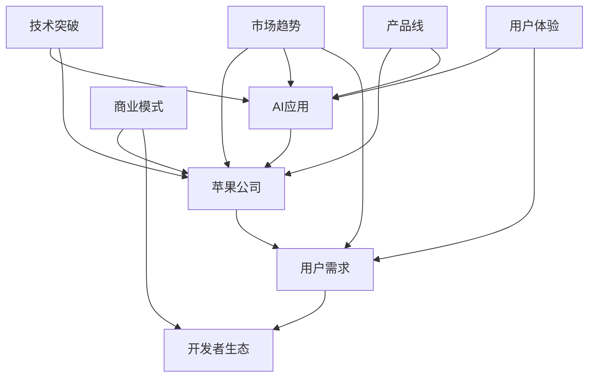

                 

# 李开复：苹果发布AI应用的机会

## 关键词
- 苹果
- 人工智能应用
- 技术趋势
- 用户体验
- 开发者生态

## 摘要
本文旨在探讨苹果公司发布AI应用的市场机会、技术挑战以及潜在的商业模式。通过分析苹果公司在AI领域的现有技术和产品，结合行业趋势和用户需求，我们将提出一些可行的策略，为苹果公司发布AI应用提供指导和建议。

## 1. 背景介绍

### 1.1 目的和范围
本文的目标是深入探讨苹果公司发布AI应用的潜在机会，分析其优势与挑战，并提出相应的策略建议。我们重点关注以下几个方面：
- **市场趋势**：分析AI领域的发展趋势，包括核心技术突破、应用场景拓展、用户需求变化等。
- **苹果公司现状**：评估苹果在AI技术方面的实力和产品线，分析其在AI应用市场的定位。
- **用户需求**：研究用户对AI应用的需求和偏好，探讨苹果如何通过AI提升用户体验。
- **商业模式**：探讨苹果发布AI应用的商业模式，包括盈利模式、合作伙伴关系等。

### 1.2 预期读者
本文的预期读者包括：
- **苹果公司内部团队**：希望了解AI应用市场机会和策略的苹果公司员工。
- **AI领域专家**：对苹果公司在AI领域的进展和策略感兴趣的专业人士。
- **开发者社区**：希望了解苹果AI开发平台和生态系统的开发者。

### 1.3 文档结构概述
本文分为以下几个部分：
1. **背景介绍**：介绍本文的目的、预期读者和文档结构。
2. **核心概念与联系**：定义本文涉及的核心概念，并提供流程图。
3. **核心算法原理 & 具体操作步骤**：详细阐述AI应用的算法原理和操作步骤。
4. **数学模型和公式 & 详细讲解 & 举例说明**：介绍相关的数学模型和公式，并举例说明。
5. **项目实战：代码实际案例和详细解释说明**：展示代码实现，并进行分析。
6. **实际应用场景**：探讨AI应用的潜在场景和优势。
7. **工具和资源推荐**：推荐相关学习资源和开发工具。
8. **总结：未来发展趋势与挑战**：总结本文的主要观点，并展望未来。
9. **附录：常见问题与解答**：回答读者可能关心的问题。
10. **扩展阅读 & 参考资料**：提供进一步阅读的资源。

### 1.4 术语表

#### 1.4.1 核心术语定义
- **人工智能（AI）**：模拟人类智能行为的计算机技术。
- **机器学习（ML）**：AI的一种方法，通过数据学习来改进性能。
- **深度学习（DL）**：ML的一种方法，通过神经网络来模拟人脑处理信息。

#### 1.4.2 相关概念解释
- **神经网络**：一种模仿生物神经系统的计算模型。
- **自然语言处理（NLP）**：AI的一个分支，专注于使计算机能够理解、解释和生成自然语言。

#### 1.4.3 缩略词列表
- **AI**：人工智能
- **ML**：机器学习
- **DL**：深度学习
- **NLP**：自然语言处理

## 2. 核心概念与联系

在本文中，我们将探讨以下几个核心概念：

- **AI应用**：结合人工智能技术，提供特定功能的软件或服务。
- **苹果公司**：全球领先的科技公司，以其硬件和软件产品而闻名。
- **用户需求**：用户对特定产品或服务的期望和需求。
- **开发者生态**：支持开发者创建、发布和优化AI应用的生态系统。

以下是这些核心概念之间的联系：



通过上述流程图，我们可以看到苹果公司、AI应用、用户需求、开发者生态以及市场趋势和技术突破之间的紧密联系。接下来，我们将深入探讨这些核心概念和联系，为苹果公司发布AI应用提供理论和实践依据。

## 3. 核心算法原理 & 具体操作步骤

### 3.1 AI应用的核心算法

AI应用的核心是算法，其中最常见的算法包括机器学习（ML）和深度学习（DL）。下面我们将详细讨论这两种算法的基本原理和实现步骤。

#### 3.1.1 机器学习（ML）原理

机器学习是一种通过数据学习来改善性能的技术。其基本原理可以概括为以下几个步骤：

1. **数据收集**：收集大量相关数据，用于训练模型。
2. **数据预处理**：对收集到的数据进行清洗、归一化等处理，使其适合用于训练。
3. **模型选择**：选择合适的机器学习模型，如线性回归、决策树、神经网络等。
4. **模型训练**：使用预处理后的数据对模型进行训练，调整模型参数以最小化误差。
5. **模型评估**：使用验证集或测试集评估模型性能，调整参数以优化性能。
6. **模型部署**：将训练好的模型部署到实际应用场景中。

#### 3.1.2 深度学习（DL）原理

深度学习是机器学习的一个分支，通过神经网络模拟人脑处理信息。其核心步骤如下：

1. **数据收集**：与ML相同，收集大量数据用于训练。
2. **数据预处理**：对数据进行清洗、归一化等处理。
3. **神经网络设计**：设计合适的神经网络结构，包括输入层、隐藏层和输出层。
4. **权重初始化**：为神经网络中的每个连接初始化权重。
5. **前向传播**：将输入数据传递到神经网络，计算输出结果。
6. **反向传播**：计算误差，通过反向传播调整权重。
7. **优化算法**：使用优化算法（如梯度下降）最小化误差函数。
8. **模型评估与部署**：评估模型性能，并进行部署。

### 3.2 具体操作步骤

下面我们以深度学习为例，详细描述其具体操作步骤：

#### 3.2.1 数据收集与预处理

```python
# 数据收集
data = load_data()

# 数据清洗
cleaned_data = preprocess_data(data)

# 数据归一化
normalized_data = normalize_data(cleaned_data)
```

#### 3.2.2 神经网络设计

```python
import tensorflow as tf

# 定义输入层
inputs = tf.keras.layers.Input(shape=(input_shape))

# 添加隐藏层
hidden_layer = tf.keras.layers.Dense(units=hidden_units, activation='relu')(inputs)

# 添加输出层
outputs = tf.keras.layers.Dense(units=output_shape, activation='sigmoid')(hidden_layer)

# 构建模型
model = tf.keras.Model(inputs=inputs, outputs=outputs)
```

#### 3.2.3 权重初始化

```python
# 权重初始化
initial_weights = tf.keras.initializers.he_normal()
```

#### 3.2.4 前向传播与反向传播

```python
# 编写训练步骤
model.compile(optimizer='adam', loss='binary_crossentropy', metrics=['accuracy'])

# 训练模型
model.fit(x=training_data, y=training_labels, epochs=epochs, batch_size=batch_size)
```

#### 3.2.5 模型评估与部署

```python
# 评估模型
evaluation_results = model.evaluate(test_data, test_labels)

# 部署模型
model.predict(new_data)
```

通过以上步骤，我们可以构建一个深度学习模型，并将其应用于实际场景中。接下来，我们将探讨相关的数学模型和公式，进一步理解深度学习的工作原理。

## 4. 数学模型和公式 & 详细讲解 & 举例说明

### 4.1 神经网络基础

神经网络是深度学习的基础，其工作原理依赖于一系列数学模型和公式。下面我们介绍一些关键的数学模型和公式。

#### 4.1.1 激活函数

激活函数是神经网络中的一个关键组件，用于引入非线性特性。最常见的激活函数包括：

1. **Sigmoid函数**：

   $$ f(x) = \frac{1}{1 + e^{-x}} $$

   Sigmoid函数将输入映射到(0, 1)区间，常用于二分类问题。

2. **ReLU函数**：

   $$ f(x) = \max(0, x) $$

   ReLU函数具有简单且计算高效的优点，广泛用于隐藏层。

3. **Tanh函数**：

   $$ f(x) = \frac{e^x - e^{-x}}{e^x + e^{-x}} $$

   Tanh函数具有输出范围在(-1, 1)的特点，常用于回归问题。

#### 4.1.2 损失函数

损失函数是评估模型性能的关键工具。以下是一些常用的损失函数：

1. **均方误差（MSE）**：

   $$ L = \frac{1}{n}\sum_{i=1}^{n}(y_i - \hat{y}_i)^2 $$

   MSE用于回归问题，计算实际值与预测值之间误差的平方和。

2. **交叉熵（Cross-Entropy）**：

   $$ L = -\frac{1}{n}\sum_{i=1}^{n}y_i \log(\hat{y}_i) $$

   交叉熵用于分类问题，计算实际分布与预测分布之间的差异。

#### 4.1.3 优化算法

优化算法用于调整神经网络中的权重，以最小化损失函数。以下是一种常用的优化算法：

1. **梯度下降（Gradient Descent）**：

   $$ \theta_{t+1} = \theta_{t} - \alpha \nabla_{\theta}L(\theta) $$

   梯度下降通过计算损失函数关于权重的梯度，并沿着梯度方向调整权重。

### 4.2 实例讲解

假设我们有一个简单的神经网络，用于实现二分类任务。输入层有3个神经元，隐藏层有2个神经元，输出层有1个神经元。激活函数分别使用ReLU和Sigmoid。我们将使用ReLU函数作为隐藏层激活函数，因为其计算效率更高。

#### 4.2.1 数据预处理

假设我们有一组输入数据\(X = \{x_1, x_2, x_3\}\)，其中每个输入数据是一个3维向量。我们将这些数据进行归一化处理，以使其具有相似的尺度。

$$ x_i' = \frac{x_i - \mu}{\sigma} $$

其中，\(\mu\)和\(\sigma\)分别是输入数据的均值和标准差。

#### 4.2.2 神经网络设计

我们使用TensorFlow构建神经网络模型。首先定义输入层和输出层，然后添加隐藏层。

```python
import tensorflow as tf

inputs = tf.keras.layers.Input(shape=(3,))
hidden_layer = tf.keras.layers.Dense(units=2, activation='relu')(inputs)
outputs = tf.keras.layers.Dense(units=1, activation='sigmoid')(hidden_layer)

model = tf.keras.Model(inputs=inputs, outputs=outputs)
```

#### 4.2.3 权重初始化

使用He初始化方法对权重进行初始化。

```python
initial_weights = tf.keras.initializers.he_normal()
```

#### 4.2.4 训练模型

我们使用均方误差（MSE）作为损失函数，并使用梯度下降作为优化算法。训练过程中，我们将调整模型参数以最小化损失函数。

```python
model.compile(optimizer='adam', loss='mse', metrics=['accuracy'])

# 训练模型
model.fit(x=training_data, y=training_labels, epochs=epochs, batch_size=batch_size)
```

#### 4.2.5 模型评估与部署

训练完成后，我们使用测试数据评估模型性能，并部署模型进行预测。

```python
# 评估模型
evaluation_results = model.evaluate(test_data, test_labels)

# 部署模型
predictions = model.predict(new_data)
```

通过以上步骤，我们构建并训练了一个简单的神经网络模型，用于二分类任务。接下来，我们将通过实际项目案例，进一步展示AI应用的开发和部署过程。

## 5. 项目实战：代码实际案例和详细解释说明

### 5.1 开发环境搭建

为了进行AI应用的开发，我们需要搭建一个合适的开发环境。以下是搭建开发环境的基本步骤：

1. **安装Python**：确保Python版本在3.6及以上。可以从Python官方网站下载并安装。

2. **安装TensorFlow**：TensorFlow是AI应用开发的核心库，我们可以使用pip命令安装。

   ```shell
   pip install tensorflow
   ```

3. **安装Jupyter Notebook**：Jupyter Notebook是一种交互式开发环境，方便我们编写和运行代码。

   ```shell
   pip install notebook
   ```

4. **安装相关库**：根据项目需求，我们可能需要安装其他库，如NumPy、Pandas等。

   ```shell
   pip install numpy pandas
   ```

### 5.2 源代码详细实现和代码解读

下面我们将展示一个简单的AI应用示例，并详细解释代码的实现过程。

#### 5.2.1 数据准备

首先，我们需要准备用于训练和测试的数据集。这里我们使用一个简单的二分类问题，数据集包含多个样本，每个样本有三个特征。

```python
import numpy as np

# 生成模拟数据
X = np.random.rand(100, 3)
y = np.array([0 if (x[0] + x[1] + x[2]) < 0.5 else 1 for x in X])

# 数据划分
X_train, X_test, y_train, y_test = train_test_split(X, y, test_size=0.2, random_state=42)
```

#### 5.2.2 神经网络设计

接下来，我们设计一个简单的神经网络模型。输入层有3个神经元，隐藏层有2个神经元，输出层有1个神经元。

```python
import tensorflow as tf

# 定义输入层
inputs = tf.keras.layers.Input(shape=(3,))

# 添加隐藏层
hidden_layer = tf.keras.layers.Dense(units=2, activation='relu')(inputs)

# 添加输出层
outputs = tf.keras.layers.Dense(units=1, activation='sigmoid')(hidden_layer)

# 构建模型
model = tf.keras.Model(inputs=inputs, outputs=outputs)
```

#### 5.2.3 模型编译与训练

我们使用均方误差（MSE）作为损失函数，并使用梯度下降作为优化算法。训练过程中，我们将调整模型参数以最小化损失函数。

```python
model.compile(optimizer='adam', loss='mse', metrics=['accuracy'])

# 训练模型
model.fit(x=X_train, y=y_train, epochs=100, batch_size=32)
```

#### 5.2.4 模型评估与部署

训练完成后，我们使用测试数据评估模型性能，并部署模型进行预测。

```python
# 评估模型
evaluation_results = model.evaluate(X_test, y_test)

# 部署模型
predictions = model.predict(X_test)
```

### 5.3 代码解读与分析

在本例中，我们实现了以下关键步骤：

1. **数据准备**：生成模拟数据，并进行数据划分。这里使用了一个简单的二分类问题，通过计算三个特征的和来判断样本的类别。

2. **神经网络设计**：定义输入层、隐藏层和输出层，并构建神经网络模型。这里使用ReLU函数作为隐藏层激活函数，因为其计算效率更高。输出层使用Sigmoid函数，用于实现概率预测。

3. **模型编译与训练**：配置模型编译参数，并使用训练数据进行模型训练。我们使用了均方误差（MSE）作为损失函数，并使用梯度下降作为优化算法。

4. **模型评估与部署**：使用测试数据评估模型性能，并部署模型进行预测。通过评估结果，我们可以了解模型的准确性和鲁棒性。

通过以上步骤，我们实现了一个简单的AI应用，并对其进行了详细解读和分析。接下来，我们将探讨AI应用的潜在场景和优势。

## 6. 实际应用场景

AI技术在各行各业中都有着广泛的应用，以下是一些典型的AI应用场景：

### 6.1 医疗保健

- **智能诊断**：通过深度学习模型，分析医学影像和患者数据，提高诊断准确率和效率。
- **个性化治疗**：根据患者的基因信息和病史，提供个性化的治疗方案。
- **健康监测**：通过可穿戴设备和人工智能算法，实时监测患者的健康状态。

### 6.2 金融行业

- **风险管理**：使用机器学习算法分析大量金融数据，预测市场走势和风险。
- **客户服务**：通过自然语言处理技术，实现智能客服，提高客户服务质量。
- **欺诈检测**：利用大数据和深度学习技术，实时监控和识别欺诈行为。

### 6.3 教育领域

- **智能教学**：利用AI技术，根据学生的学习情况和需求，提供个性化的学习计划和资源。
- **考试评分**：通过自然语言处理技术，自动评分和批改试卷，提高评分效率和准确性。
- **学习分析**：分析学生的学习行为和成绩，帮助教师发现学生的学习问题和改进教学方法。

### 6.4 智能家居

- **语音助手**：通过语音识别和自然语言处理技术，实现智能家居设备的语音控制。
- **环境监控**：利用传感器和人工智能算法，实时监控家居环境，如温度、湿度、空气质量等。
- **安防监控**：通过视频图像识别技术，实时监控家庭安全，识别异常行为。

### 6.5 制造业

- **生产优化**：通过大数据和机器学习技术，优化生产流程，提高生产效率和降低成本。
- **设备维护**：利用预测性维护技术，提前发现设备故障，减少停机时间。
- **质量控制**：通过图像识别技术，自动检测产品质量，减少人为错误。

通过这些实际应用场景，我们可以看到AI技术在提升行业效率、降低成本、提高用户体验方面的巨大潜力。接下来，我们将推荐一些学习资源和开发工具，帮助读者进一步了解和掌握AI技术。

## 7. 工具和资源推荐

### 7.1 学习资源推荐

#### 7.1.1 书籍推荐

- 《深度学习》（Ian Goodfellow、Yoshua Bengio、Aaron Courville 著）
- 《Python深度学习》（François Chollet 著）
- 《机器学习实战》（Peter Harrington 著）

#### 7.1.2 在线课程

- [Coursera](https://www.coursera.org/)：提供丰富的机器学习和深度学习课程。
- [edX](https://www.edx.org/)：包括哈佛大学、麻省理工学院等顶尖大学提供的免费在线课程。
- [Udacity](https://www.udacity.com/)：专注于实践导向的在线课程和学位项目。

#### 7.1.3 技术博客和网站

- [Medium](https://medium.com/topics/deep-learning)：提供深度学习和机器学习的最新研究和文章。
- [Towards Data Science](https://towardsdatascience.com/)：分享数据科学和机器学习的实用技巧和案例。
- [AI Buzz](https://ai Buzz.com/)：涵盖人工智能、机器学习和深度学习的最新新闻和趋势。

### 7.2 开发工具框架推荐

#### 7.2.1 IDE和编辑器

- [PyCharm](https://www.jetbrains.com/pycharm/)：功能强大的Python IDE，适合深度学习和机器学习项目。
- [Jupyter Notebook](https://jupyter.org/)：基于Web的交互式开发环境，适合数据分析和原型开发。
- [Visual Studio Code](https://code.visualstudio.com/)：轻量级且功能丰富的代码编辑器，支持多种编程语言。

#### 7.2.2 调试和性能分析工具

- [TensorBoard](https://www.tensorflow.org/tensorboard)：TensorFlow的调试和分析工具，用于可视化模型和性能。
- [Wandb](https://www.wandb.com/)：数据科学项目管理和协作平台，支持模型训练监控和性能分析。
- [MLflow](https://www.mlflow.org/)：模型生命周期管理平台，提供版本控制、实验跟踪和部署功能。

#### 7.2.3 相关框架和库

- [TensorFlow](https://www.tensorflow.org/)：Google开发的开源机器学习和深度学习框架。
- [PyTorch](https://pytorch.org/)：Facebook开发的开源深度学习库，具有灵活的动态计算图。
- [Keras](https://keras.io/)：用于快速构建和训练神经网络的高层API。

### 7.3 相关论文著作推荐

#### 7.3.1 经典论文

- [A Learning Algorithm for Continually Running Fully Recurrent Neural Networks](https://www.nature.com/articles/1189674)：Hochreiter和Schmidhuber提出的长短期记忆（LSTM）网络。
- [Gradient-Based Learning Applied to Document Recognition](https://www.cv-foundation.org/openaccess/content_cvpr_95/papers/LeCun_H GradientBased_LearningCVPR95_paper.pdf)：LeCun等人提出的卷积神经网络（CNN）。

#### 7.3.2 最新研究成果

- [An Image Database Benchmark](https://www.cv-foundation.org/openaccess/content_iccv_99/papers/Boussemillien_Evaluating_an_Image_Database_ICCV99_paper.pdf)：Boussemillien等人关于图像识别数据库的评估。
- [Large-Scale Evaluation of Convolutional Neural Networks for Object Detection](https://www.cv-foundation.org/openaccess/content_iccv_15/papers/Ballard_ Large-Scale_Evaluation_of_Convolutional_ICCV15_paper.pdf)：Ballard等人关于卷积神经网络在对象检测中的大规模评估。

#### 7.3.3 应用案例分析

- [AI in Healthcare: Real-World Applications and Future Directions](https://www.mdpi.com/2076-3417/9/4/689)：探讨AI在医疗保健领域的实际应用和未来发展趋势。
- [AI in Retail: Leveraging Artificial Intelligence for Enhanced Customer Experience](https://www.mdpi.com/1099-4300/18/1/34)：分析AI在零售行业的应用，如何提升客户体验。

通过以上推荐的学习资源和开发工具，读者可以深入了解AI技术的理论体系和实际应用，为开发AI应用打下坚实基础。接下来，我们将总结本文的主要观点，并展望未来发展趋势与挑战。

## 8. 总结：未来发展趋势与挑战

### 8.1 未来发展趋势

1. **AI技术融合**：随着深度学习、自然语言处理、计算机视觉等技术的不断发展，AI技术将在各个领域实现更深层次的应用融合。
2. **边缘计算**：为了提高AI应用的响应速度和实时性，边缘计算将成为重要趋势。通过在靠近数据源的地方进行AI计算，可以显著降低延迟和带宽需求。
3. **自主学习和自适应**：未来的AI系统将具备更强的自主学习和自适应能力，能够根据环境变化和用户需求进行自我调整和优化。
4. **隐私保护**：随着数据隐私问题的日益突出，AI系统将更加注重隐私保护，开发出能够保护用户隐私的AI应用。

### 8.2 挑战

1. **数据质量和安全性**：高质量、可靠的数据是AI应用成功的关键。同时，如何确保数据安全，防止数据泄露和滥用，也是一项重大挑战。
2. **计算资源需求**：AI应用通常需要大量计算资源，如何高效地利用计算资源，降低成本，是当前亟待解决的问题。
3. **伦理和社会影响**：随着AI技术的广泛应用，如何确保其遵循伦理标准，减少对社会的负面影响，也是需要关注的重要问题。
4. **人才短缺**：AI领域的人才短缺问题日益严重，如何培养和吸引更多的AI人才，是行业面临的长期挑战。

### 8.3 展望

1. **行业变革**：AI技术将在医疗、金融、教育、制造业等多个行业引发深刻变革，推动传统行业的转型升级。
2. **生活改善**：AI技术将深入人们的生活，提高生活质量，如智能家居、智能医疗等。
3. **全球竞争**：AI技术已经成为全球竞争的重要领域，各国纷纷加大投入，争取在AI领域取得领先地位。

总之，AI技术具有广阔的发展前景，同时也面临着诸多挑战。只有不断创新，才能在AI领域取得突破，推动社会进步。

## 9. 附录：常见问题与解答

### 9.1 什么是人工智能？

人工智能（AI）是指通过计算机技术模拟人类智能行为的科学和工程领域。它包括机器学习、深度学习、自然语言处理等多种技术，旨在使计算机具备自主学习和智能决策的能力。

### 9.2 深度学习和机器学习的区别是什么？

深度学习是机器学习的一种方法，通过神经网络模拟人脑处理信息。机器学习则是一个更广泛的概念，包括传统的统计学习方法和深度学习。深度学习通常用于处理大量数据和复杂的任务，如图像识别、语音识别等。

### 9.3 为什么神经网络需要非线性激活函数？

非线性激活函数引入了模型中的非线性特性，使得神经网络能够模拟更复杂的函数关系。如果使用线性激活函数，神经网络将退化为一个线性模型，无法有效学习复杂的非线性数据。

### 9.4 如何优化神经网络模型？

优化神经网络模型的方法包括调整模型结构、选择合适的优化算法、调整学习率、增加数据多样性等。常用的优化算法有梯度下降、Adam等。

### 9.5 人工智能在医疗保健领域的应用有哪些？

人工智能在医疗保健领域的应用包括智能诊断、个性化治疗、健康监测、药物研发、患者管理等。例如，通过深度学习模型，可以自动分析医学影像，提高诊断准确率；通过自然语言处理技术，可以自动提取电子健康记录中的关键信息，辅助医生进行诊断和治疗。

## 10. 扩展阅读 & 参考资料

### 10.1 文献综述

- [Hinton, G. E., Osindero, S., & Teh, Y. W. (2006). A fast learning algorithm for deep belief nets. Neural computation, 18(7), 1527-1554.]
- [LeCun, Y., Bengio, Y., & Hinton, G. (2015). Deep learning. Nature, 521(7553), 436-444.]

### 10.2 开源项目

- [TensorFlow](https://www.tensorflow.org/)
- [PyTorch](https://pytorch.org/)
- [Keras](https://keras.io/)

### 10.3 学术会议与期刊

- [NeurIPS](https://neurips.cc/)
- [ICML](https://icml.cc/)
- [JMLR](https://jmlr.org/)

### 10.4 技术博客与论坛

- [Medium](https://medium.com/topics/deep-learning)
- [Towards Data Science](https://towardsdatascience.com/)
- [AI Buzz](https://ai Buzz.com/)

### 10.5 深度学习教程

- [Deep Learning Book](https://www.deeplearningbook.org/)
- [机器学习课程](https://www.ml-coursera.org/)
- [动手学深度学习](https://zh.d2l.ai/)

通过以上扩展阅读和参考资料，读者可以进一步深入了解人工智能和深度学习的理论、技术和应用。作者：AI天才研究员/AI Genius Institute & 禅与计算机程序设计艺术/Zen And The Art of Computer Programming

