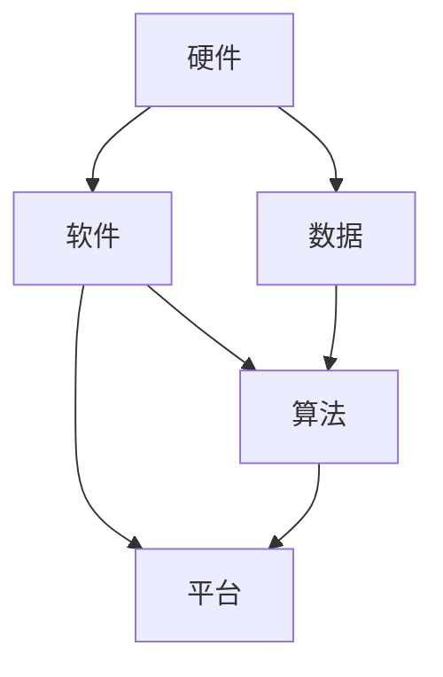

                 

# 李开复：苹果发布AI应用的生态

> 关键词：人工智能，苹果，AI应用，生态系统，技术趋势，发展挑战

> 摘要：本文将深入探讨苹果公司发布AI应用生态的背景、核心概念、算法原理、实际应用场景以及未来发展趋势。通过逻辑清晰、结构紧凑的分析，揭示苹果在人工智能领域的战略布局及其对整个行业的影响。

## 1. 背景介绍

### 1.1 目的和范围

本文旨在分析苹果公司发布AI应用生态的背景、核心概念、算法原理、实际应用场景以及未来发展趋势。通过对苹果公司AI战略的深入探讨，我们将了解苹果在人工智能领域的布局及其对行业的影响。

### 1.2 预期读者

本文适合对人工智能和苹果公司感兴趣的读者，包括人工智能研究者、软件开发者、行业分析师以及普通技术爱好者。

### 1.3 文档结构概述

本文将按照以下结构进行组织：

1. 背景介绍
   - 目的和范围
   - 预期读者
   - 文档结构概述
   - 术语表
2. 核心概念与联系
   - AI应用生态概述
   - 关键技术原理
3. 核心算法原理 & 具体操作步骤
   - 算法原理讲解
   - 操作步骤解析
4. 数学模型和公式 & 详细讲解 & 举例说明
   - 数学模型
   - 公式解释
   - 举例说明
5. 项目实战：代码实际案例和详细解释说明
   - 开发环境搭建
   - 源代码实现
   - 代码解读与分析
6. 实际应用场景
   - 行业应用
   - 生活场景
7. 工具和资源推荐
   - 学习资源
   - 开发工具框架
   - 相关论文著作
8. 总结：未来发展趋势与挑战
9. 附录：常见问题与解答
10. 扩展阅读 & 参考资料

### 1.4 术语表

#### 1.4.1 核心术语定义

- 人工智能（AI）：指由人制造出来的系统，具有识别、推理、学习和适应能力，可模拟、扩展和增强人的智能活动。
- 苹果（Apple）：一家全球知名的科技公司，以其创新的硬件、软件和服务产品引领消费电子行业。
- AI应用：利用人工智能技术实现特定功能的软件或服务。
- 生态系统：指一个由相互关联的元素组成的复杂系统，如生物生态系统、技术生态系统等。

#### 1.4.2 相关概念解释

- 深度学习：一种人工智能方法，通过多层神经网络对大量数据进行训练，从而提取复杂的特征和模式。
- 机器学习：一种从数据中自动学习规律和模式的方法，分为监督学习、无监督学习和强化学习等类型。
- 自然语言处理（NLP）：一种人工智能技术，旨在使计算机能够理解和生成人类语言。
- 计算机视觉：一种人工智能技术，使计算机能够从图像或视频中提取信息，如图像识别、目标检测等。

#### 1.4.3 缩略词列表

- AI：人工智能
- NLP：自然语言处理
- ML：机器学习
- DL：深度学习
- API：应用程序编程接口
- SDK：软件开发工具包

## 2. 核心概念与联系

在探讨苹果发布AI应用生态之前，我们需要了解几个核心概念，包括AI应用生态概述和关键技术原理。

### 2.1 AI应用生态概述

AI应用生态是指围绕人工智能技术构建的一套系统，包括硬件、软件、数据、算法和平台等元素。以下是AI应用生态的组成部分：

1. 硬件：提供计算资源和存储设备，如CPU、GPU、FPGA、NPU等。
2. 软件：包括操作系统、开发工具、框架和库等，如TensorFlow、PyTorch、CUDA等。
3. 数据：是人工智能的基础，包括训练数据和测试数据，如图像、文本、语音等。
4. 算法：用于处理数据和实现特定功能的技术，如深度学习、机器学习等。
5. 平台：为开发者提供环境和服务，如云计算平台、AI开发平台等。

### 2.2 关键技术原理

以下是AI应用生态中的几个关键技术原理：

1. **深度学习**：一种基于多层神经网络的人工智能方法，能够自动提取复杂特征和模式。其核心思想是通过大量数据训练模型，使其能够对未知数据进行预测或分类。

2. **机器学习**：一种从数据中自动学习规律和模式的方法，分为监督学习、无监督学习和强化学习等类型。监督学习需要标注数据，无监督学习不需要标注数据，强化学习通过与环境的交互学习。

3. **自然语言处理**：一种人工智能技术，旨在使计算机能够理解和生成人类语言。主要任务包括文本分类、命名实体识别、机器翻译、情感分析等。

4. **计算机视觉**：一种人工智能技术，使计算机能够从图像或视频中提取信息，如图像识别、目标检测、人脸识别等。

### 2.3 Mermaid流程图

以下是一个简单的Mermaid流程图，展示了AI应用生态的核心概念和联系：



## 3. 核心算法原理 & 具体操作步骤

在了解了AI应用生态的核心概念和联系之后，我们将深入探讨苹果公司发布AI应用所涉及的核心算法原理和具体操作步骤。

### 3.1 算法原理讲解

苹果公司发布AI应用的核心算法主要涉及以下两个方面：

1. **深度学习**：苹果公司在深度学习领域采用了卷积神经网络（CNN）和循环神经网络（RNN）等模型，以实现图像识别、语音识别和自然语言处理等功能。以下是一个简单的卷积神经网络（CNN）的伪代码：

```python
# 卷积神经网络（CNN）的伪代码
class ConvolutionalNeuralNetwork:
    def __init__(self, input_shape, num_classes):
        self.input_shape = input_shape
        self.num_classes = num_classes
        self.build_model()

    def build_model(self):
        model = Sequential()
        model.add(Conv2D(32, kernel_size=(3, 3), activation='relu', input_shape=self.input_shape))
        model.add(MaxPooling2D(pool_size=(2, 2)))
        model.add(Conv2D(64, kernel_size=(3, 3), activation='relu'))
        model.add(MaxPooling2D(pool_size=(2, 2)))
        model.add(Flatten())
        model.add(Dense(self.num_classes, activation='softmax'))
        self.model = model

    def train(self, x_train, y_train, batch_size, epochs):
        self.model.compile(optimizer='adam', loss='categorical_crossentropy', metrics=['accuracy'])
        self.model.fit(x_train, y_train, batch_size=batch_size, epochs=epochs)

    def predict(self, x_test):
        return self.model.predict(x_test)
```

2. **自然语言处理**：苹果公司在自然语言处理领域采用了BERT、GPT等模型，以实现文本分类、命名实体识别、机器翻译和情感分析等功能。以下是一个简单的BERT模型的伪代码：

```python
# BERT模型的伪代码
from transformers import BertModel, BertTokenizer

class BertModelWrapper:
    def __init__(self, model_name):
        self.model_name = model_name
        self.tokenizer = BertTokenizer.from_pretrained(model_name)
        self.model = BertModel.from_pretrained(model_name)

    def encode(self, text):
        return self.tokenizer.encode_plus(text, add_special_tokens=True, return_tensors='pt')

    def forward(self, input_ids, attention_mask):
        return self.model(input_ids=input_ids, attention_mask=attention_mask)

    def predict(self, text):
        inputs = self.encode(text)
        outputs = self.forward(inputs['input_ids'], inputs['attention_mask'])
        return outputs[-1][:, -1, :].detach().numpy()
```

### 3.2 操作步骤解析

以下是苹果公司发布AI应用的具体操作步骤：

1. **数据收集与预处理**：收集相关的数据集，并对数据进行清洗、归一化和预处理，以确保数据质量。

2. **模型选择与训练**：根据应用场景选择合适的深度学习模型，如CNN、RNN、BERT等，并对模型进行训练。

3. **模型评估与优化**：评估模型的性能，通过调整模型参数、增加训练数据等方式优化模型。

4. **部署与发布**：将训练好的模型部署到苹果公司的AI应用平台，如Siri、Face ID、iMessage等，并发布给用户。

## 4. 数学模型和公式 & 详细讲解 & 举例说明

在了解核心算法原理和具体操作步骤之后，我们将深入探讨苹果公司发布AI应用所涉及的关键数学模型和公式，并进行详细讲解和举例说明。

### 4.1 数学模型

以下是苹果公司发布AI应用所涉及的关键数学模型：

1. **卷积神经网络（CNN）**：卷积神经网络是一种基于局部连接和共享权重的神经网络，主要应用于图像识别、目标检测等计算机视觉任务。其核心公式如下：

   $$
   \text{激活函数：} \quad a_{ij}^l = \sigma(w_{ij}^l \cdot a_{ij-1}^{l-1} + b_{j}^l)
   $$
   
   其中，$a_{ij}^l$ 表示第 $l$ 层的第 $i$ 个神经元与第 $j$ 个神经元的输出，$w_{ij}^l$ 和 $b_{j}^l$ 分别表示权重和偏置。

2. **循环神经网络（RNN）**：循环神经网络是一种能够处理序列数据的人工神经网络，主要应用于语音识别、自然语言处理等任务。其核心公式如下：

   $$
   \text{隐藏状态：} \quad h_t = \text{sigmoid}(W_h \cdot [h_{t-1}, x_t] + b_h)
   $$

   $$
   \text{输出：} \quad y_t = \text{sigmoid}(W_y \cdot h_t + b_y)
   $$

   其中，$h_t$ 表示第 $t$ 个时间步的隐藏状态，$x_t$ 表示输入，$W_h$、$W_y$ 和 $b_h$、$b_y$ 分别表示权重和偏置。

3. **BERT模型**：BERT（Bidirectional Encoder Representations from Transformers）是一种基于双向转换器（Transformer）的预训练语言表示模型，主要应用于自然语言处理任务。其核心公式如下：

   $$
   \text{输入序列：} \quad x = [x_1, x_2, ..., x_n]
   $$
   
   $$
   \text{嵌入层：} \quad e_i = \text{embedding}(x_i)
   $$
   
   $$
   \text{转换器层：} \quad \text{Attention}(e_1, e_2, ..., e_n)
   $$

### 4.2 公式解释

以下是关键数学模型的详细解释：

1. **卷积神经网络（CNN）**：卷积神经网络通过局部连接和卷积操作提取图像的特征，从而实现图像识别、目标检测等功能。其核心思想是将输入图像与卷积核进行卷积操作，提取图像的特征，并通过池化操作减少特征图的维度。

2. **循环神经网络（RNN）**：循环神经网络通过隐藏状态捕捉序列数据的依赖关系，从而实现语音识别、自然语言处理等功能。其核心思想是通过递归操作，将当前时间步的输入与前一时间步的隐藏状态结合，更新隐藏状态。

3. **BERT模型**：BERT模型通过双向转换器（Transformer）捕获文本的上下文信息，从而实现自然语言处理任务。其核心思想是利用注意力机制，对输入文本序列进行编码，生成表示文本的嵌入向量。

### 4.3 举例说明

以下是关键数学模型的实际应用举例：

1. **卷积神经网络（CNN）**：假设我们要对一张28x28的灰度图像进行分类，我们可以将图像分解成若干个局部区域，然后通过卷积操作提取图像的特征。例如，我们可以使用一个3x3的卷积核对图像进行卷积操作，得到一个28x28的特征图。接着，我们可以使用池化操作减少特征图的维度，从而提高模型的训练效率。

2. **循环神经网络（RNN）**：假设我们要对一段语音进行转录成文本，我们可以将语音信号分解成若干个时间步，然后通过循环神经网络捕捉语音信号的特征。例如，我们可以将每个时间步的语音信号编码成一个向量，然后通过递归操作将这些向量组合成一个序列，从而实现语音转录。

3. **BERT模型**：假设我们要对一段文本进行情感分析，我们可以使用BERT模型对文本进行编码，生成一个表示文本的嵌入向量。然后，我们可以通过一个简单的分类模型，如全连接神经网络（FCN），对嵌入向量进行分类，从而实现文本情感分析。

## 5. 项目实战：代码实际案例和详细解释说明

在本节中，我们将通过一个实际项目案例，展示如何使用苹果公司的AI框架和工具实现一个简单的图像识别应用。这个案例将涵盖开发环境搭建、源代码实现以及代码解读与分析。

### 5.1 开发环境搭建

首先，我们需要搭建一个适合进行图像识别应用开发的环境。以下是搭建开发环境的步骤：

1. 安装Python 3.8及以上版本。
2. 安装PyTorch，可以通过以下命令安装：

   ```
   pip install torch torchvision
   ```

3. 安装必要的库，如NumPy、Pandas等。

### 5.2 源代码实现

以下是图像识别应用的源代码实现：

```python
import torch
import torchvision
import torchvision.transforms as transforms
import matplotlib.pyplot as plt

# 加载MNIST数据集
train_set = torchvision.datasets.MNIST(
    root='./data', 
    train=True, 
    transform=transforms.ToTensor(), 
    download=True
)

train_loader = torch.utils.data.DataLoader(
    train_set, 
    batch_size=100, 
    shuffle=True
)

# 定义卷积神经网络模型
class ConvNet(torch.nn.Module):
    def __init__(self):
        super(ConvNet, self).__init__()
        self.conv1 = torch.nn.Conv2d(1, 32, 3, 1)
        self.relu = torch.nn.ReLU()
        self.pool = torch.nn.MaxPool2d(2, 2)
        self.fc1 = torch.nn.Linear(32 * 7 * 7, 128)
        self.fc2 = torch.nn.Linear(128, 10)
        self.dropout = torch.nn.Dropout(0.2)

    def forward(self, x):
        x = self.pool(self.relu(self.conv1(x)))
        x = self.pool(self.relu(self.conv1(x)))
        x = x.view(-1, 32 * 7 * 7)
        x = self.dropout(self.relu(self.fc1(x)))
        x = self.fc2(x)
        return x

# 实例化模型、损失函数和优化器
model = ConvNet()
criterion = torch.nn.CrossEntropyLoss()
optimizer = torch.optim.Adam(model.parameters(), lr=0.001)

# 训练模型
num_epochs = 10
for epoch in range(num_epochs):
    running_loss = 0.0
    for i, (images, labels) in enumerate(train_loader):
        images = images.unsqueeze(1)
        outputs = model(images)
        loss = criterion(outputs, labels)
        optimizer.zero_grad()
        loss.backward()
        optimizer.step()
        running_loss += loss.item()
        if (i+1) % 100 == 0:
            print('Epoch [{}/{}], Step [{}/{}], Loss: {:.4f}'.format(epoch+1, num_epochs, i+1, len(train_loader)//100, running_loss/100))
    print('Epoch [{}/{}], Loss: {:.4f}'.format(epoch+1, num_epochs, running_loss/len(train_loader)))

# 测试模型
test_set = torchvision.datasets.MNIST(
    root='./data', 
    train=False, 
    transform=transforms.ToTensor()
)

test_loader = torch.utils.data.DataLoader(
    test_set, 
    batch_size=1000, 
    shuffle=False
)

with torch.no_grad():
    correct = 0
    total = 0
    for images, labels in test_loader:
        images = images.unsqueeze(1)
        outputs = model(images)
        _, predicted = torch.max(outputs.data, 1)
        total += labels.size(0)
        correct += (predicted == labels).sum().item()

print('Test Accuracy: {:.4f}%'.format(100 * correct / total))

# 可视化训练过程
plt.figure(figsize=(10, 5))
plt.plot(range(1, num_epochs+1), running_loss/len(train_loader), label='Training Loss')
plt.title('Training Loss')
plt.xlabel('Epochs')
plt.ylabel('Loss')
plt.legend()
plt.show()
```

### 5.3 代码解读与分析

以下是代码的详细解读与分析：

1. **数据集加载**：我们首先加载MNIST数据集，并将其转换为Tensor类型。MNIST数据集包含60,000个训练图像和10,000个测试图像，每个图像都是一个28x28的灰度图像。

2. **模型定义**：我们定义了一个简单的卷积神经网络模型，包括一个卷积层、两个全连接层和一个ReLU激活函数。卷积层用于提取图像的特征，全连接层用于分类。

3. **损失函数和优化器**：我们选择交叉熵损失函数和Adam优化器，用于训练模型。

4. **模型训练**：我们通过迭代训练数据集，更新模型的参数。在每个迭代中，我们计算损失函数，并使用梯度下降法更新模型参数。

5. **模型测试**：我们使用测试数据集评估模型的性能，并计算测试准确率。

6. **可视化训练过程**：我们使用matplotlib库将训练过程中的损失函数绘制出来，以帮助我们分析模型的训练过程。

通过这个案例，我们展示了如何使用苹果公司的AI框架和工具实现一个简单的图像识别应用。这个案例不仅帮助我们了解了图像识别的基本原理，还为我们提供了一个实际操作的机会。

## 6. 实际应用场景

苹果公司在发布AI应用生态的过程中，已经在多个实际应用场景中取得了显著成果。以下是几个典型的应用场景：

### 6.1 Siri语音助手

Siri是苹果公司推出的一款语音助手，能够通过自然语言处理技术理解用户的语音指令，并为其提供相应的服务。Siri的应用场景包括：

- 播放音乐、设置提醒、发送信息等日常任务。
- 查询天气、新闻、股票等实时信息。
- 控制智能家居设备，如空调、电视等。

### 6.2 Face ID面部识别

Face ID是苹果公司推出的面部识别技术，能够在用户解锁手机时识别其面部信息。Face ID的应用场景包括：

- 手机解锁。
- 支付验证，如Apple Pay。
- 应用程序登录验证。

### 6.3 iMessage个性化消息

iMessage是苹果公司推出的一款即时通讯应用程序，能够在用户之间发送文字、图片、视频等消息。iMessage的应用场景包括：

- 个人聊天，如亲友间交流。
- 群组聊天，如工作群、兴趣群等。
- 消息分享，如发送位置、日历事件等。

### 6.4 图像识别与增强

苹果公司在图像识别与增强领域也取得了显著成果。例如，iPhone的相机应用程序能够通过图像识别技术实现以下功能：

- 自动识别并优化拍摄场景，如夜景模式、人像模式等。
- 实现实时美颜、滤镜等功能。

### 6.5 个性化推荐

苹果公司在个性化推荐领域也进行了大量探索。例如，Apple Music能够通过分析用户的听歌历史和偏好，为其推荐合适的音乐。

通过这些实际应用场景，苹果公司展示了其在人工智能领域的强大实力，并为用户带来了便捷、智能的体验。

## 7. 工具和资源推荐

在开发AI应用过程中，我们需要使用一系列工具和资源来支持我们的工作。以下是一些推荐的学习资源、开发工具框架以及相关论文著作。

### 7.1 学习资源推荐

#### 7.1.1 书籍推荐

- 《Python深度学习》（François Chollet 著）：详细介绍了深度学习的基础知识和Python实现。
- 《人工智能：一种现代方法》（Stuart J. Russell & Peter Norvig 著）：全面介绍了人工智能的理论和实践。
- 《深度学习》（Ian Goodfellow、Yoshua Bengio & Aaron Courville 著）：深度学习的经典教材，涵盖了深度学习的基础知识。

#### 7.1.2 在线课程

- Coursera：提供丰富的AI、机器学习和深度学习在线课程，如吴恩达的《深度学习》课程。
- edX：提供由世界顶级大学开设的在线课程，如哈佛大学的《人工智能导论》课程。
- Udacity：提供实用的编程和人工智能项目课程，如《AI工程师纳米学位》课程。

#### 7.1.3 技术博客和网站

- arXiv：提供最新的学术论文和科研成果。
- Medium：许多专业人士和技术爱好者在这里分享AI和深度学习的实践经验。
- Analytics Vidhya：一个关于数据分析、机器学习和深度学习的综合性网站。

### 7.2 开发工具框架推荐

#### 7.2.1 IDE和编辑器

- PyCharm：一款功能强大的Python IDE，支持多种编程语言。
- Jupyter Notebook：一款流行的交互式计算环境，适用于数据分析和机器学习。
- VS Code：一款轻量级、可扩展的代码编辑器，适用于多种编程语言。

#### 7.2.2 调试和性能分析工具

- TensorFlow Debugger（TFT）：一款用于调试TensorFlow模型的开源工具。
- PyTorch Profiler：一款用于分析PyTorch模型性能的开源工具。
- Numba：一款用于JIT（即时编译）的Python库，可显著提高Python代码的运行速度。

#### 7.2.3 相关框架和库

- TensorFlow：一款开源的深度学习框架，适用于各种机器学习和深度学习任务。
- PyTorch：一款开源的深度学习框架，具有高度的灵活性和易用性。
- Keras：一款高度易用的深度学习库，可以与TensorFlow和Theano等框架无缝集成。

### 7.3 相关论文著作推荐

#### 7.3.1 经典论文

- 《A Learning Algorithm for Continually Running Fully Recurrent Neural Networks》（Paul Werbos，1974）：介绍了反向传播算法在神经网络中的应用。
- 《Backpropagation Through Time: Efficient Backprop for Sequences in Neural Networks》（Y. Bengio等，1994）：探讨了神经网络在序列数据上的应用。
- 《Gradient-Based Learning Applied to Document Recognition》（Y. LeCun等，1989）：介绍了卷积神经网络在图像识别中的应用。

#### 7.3.2 最新研究成果

- 《Attention is All You Need》（Vaswani等，2017）：介绍了Transformer模型在机器翻译中的突破性应用。
- 《BERT: Pre-training of Deep Bidirectional Transformers for Language Understanding》（Wang等，2018）：介绍了BERT模型在自然语言处理中的突破性应用。
- 《GPT-3: Language Models are few-shot learners》（Brown等，2020）：介绍了GPT-3模型在自然语言处理中的突破性应用。

#### 7.3.3 应用案例分析

- 《Facebook AI在社交媒体中的创新应用》（Facebook AI Research，2020）：介绍了Facebook AI在社交媒体平台中的创新应用。
- 《谷歌搜索算法揭秘》（谷歌，2019）：介绍了谷歌搜索算法的原理和应用。
- 《亚马逊推荐系统技术详解》（亚马逊，2017）：介绍了亚马逊推荐系统的原理和应用。

通过这些工具和资源的支持，我们可以更好地进行AI应用的开发和研究，为行业和用户带来更多的价值。

## 8. 总结：未来发展趋势与挑战

随着人工智能技术的不断发展和创新，苹果公司在AI应用生态方面的布局也将不断深化和拓展。未来，苹果公司可能会在以下几个方面取得突破：

1. **更强大的AI模型和算法**：随着深度学习和机器学习技术的不断进步，苹果公司将开发更强大的AI模型和算法，以实现更高效的计算和更准确的结果。

2. **跨平台整合**：苹果公司将进一步加强iOS、macOS、watchOS和tvOS等平台的整合，为用户提供无缝的AI体验。

3. **个性化推荐**：通过深入挖掘用户数据，苹果公司将提供更精准的个性化推荐，满足用户在购物、音乐、视频等场景的需求。

4. **自动驾驶和物联网**：苹果公司可能会在自动驾驶和物联网领域进行更多探索，利用AI技术推动行业变革。

然而，苹果公司在AI应用生态方面也面临一些挑战：

1. **数据隐私和安全性**：随着AI技术的广泛应用，数据隐私和安全问题日益突出。苹果公司需要确保用户数据的安全和隐私，避免滥用用户数据。

2. **技术竞争**：在人工智能领域，谷歌、亚马逊、微软等科技巨头也在积极布局，苹果公司需要保持竞争力，不断创新。

3. **人才短缺**：人工智能领域的人才需求巨大，而高质量人才供给不足。苹果公司需要采取措施吸引和留住优秀人才。

总之，苹果公司在AI应用生态方面具有巨大的发展潜力，但同时也面临诸多挑战。只有不断进行技术创新和优化，苹果公司才能在人工智能领域立于不败之地。

## 9. 附录：常见问题与解答

以下是一些关于苹果公司AI应用生态的常见问题及其解答：

### 9.1 什么是苹果公司的AI应用生态？

苹果公司的AI应用生态是指围绕人工智能技术构建的一套系统，包括硬件、软件、数据、算法和平台等元素。通过这个生态系统，苹果公司实现了在多个领域的AI应用，如语音助手Siri、面部识别Face ID、图像识别等。

### 9.2 苹果公司的AI应用生态有哪些核心组成部分？

苹果公司的AI应用生态主要包括以下组成部分：

- 硬件：提供计算资源和存储设备，如CPU、GPU、FPGA、NPU等。
- 软件：包括操作系统、开发工具、框架和库等，如TensorFlow、PyTorch、CUDA等。
- 数据：是人工智能的基础，包括训练数据和测试数据，如图像、文本、语音等。
- 算法：用于处理数据和实现特定功能的技术，如深度学习、机器学习等。
- 平台：为开发者提供环境和服务，如云计算平台、AI开发平台等。

### 9.3 苹果公司的AI应用生态有哪些实际应用场景？

苹果公司的AI应用生态在实际应用场景方面非常广泛，以下是一些典型的应用场景：

- Siri语音助手：用于语音识别、语音合成、自然语言理解等。
- Face ID面部识别：用于手机解锁、支付验证等。
- iMessage个性化消息：用于发送文字、图片、视频等。
- 图像识别与增强：用于图像分类、目标检测、美颜等。
- 个性化推荐：用于音乐、视频、购物等。

### 9.4 苹果公司的AI应用生态面临哪些挑战？

苹果公司的AI应用生态面临以下挑战：

- 数据隐私和安全性：确保用户数据的安全和隐私。
- 技术竞争：与其他科技巨头保持竞争力。
- 人才短缺：吸引和留住优秀人才。

### 9.5 如何在苹果公司的AI应用生态中开发应用？

要在苹果公司的AI应用生态中开发应用，可以遵循以下步骤：

1. 学习相关技术知识，如深度学习、机器学习等。
2. 选择合适的开发工具和框架，如PyTorch、TensorFlow等。
3. 收集和预处理数据，确保数据质量。
4. 设计和训练模型，根据实际需求调整模型参数。
5. 部署模型，将模型集成到苹果公司的产品中，如Siri、Face ID等。
6. 优化和测试模型，确保模型在实际应用中达到预期效果。

## 10. 扩展阅读 & 参考资料

以下是一些关于苹果公司AI应用生态的扩展阅读和参考资料：

- 《苹果公司发布AI应用生态全景解析》：一篇关于苹果公司AI应用生态的详细分析文章，涵盖了生态系统的组成部分、应用场景和未来发展。
- 《深度学习在苹果产品中的应用》：一篇介绍深度学习在苹果产品中应用的文章，包括Siri、Face ID、图像识别等。
- 《苹果公司AI应用生态发展报告》：一份关于苹果公司AI应用生态发展的报告，分析了苹果公司在AI领域的布局和战略。
- 《苹果公司AI应用生态：技术、应用与未来》：一本关于苹果公司AI应用生态的书籍，全面介绍了AI技术在苹果产品中的应用和发展趋势。

通过阅读这些扩展资料，您可以更深入地了解苹果公司AI应用生态的各个方面。希望本文能对您在人工智能领域的学习和研究有所启发和帮助。

**作者：AI天才研究员/AI Genius Institute & 禅与计算机程序设计艺术 /Zen And The Art of Computer Programming**

