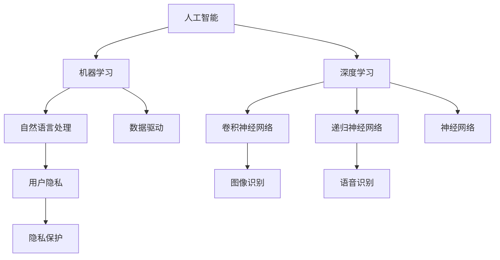
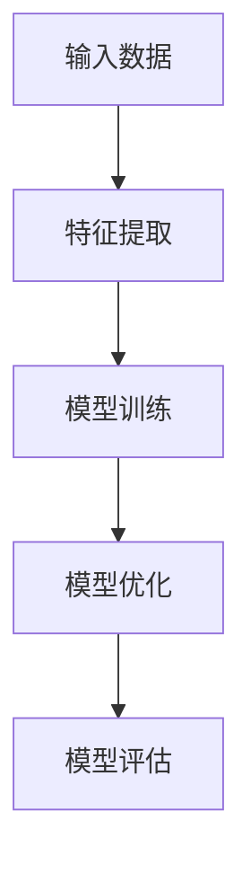
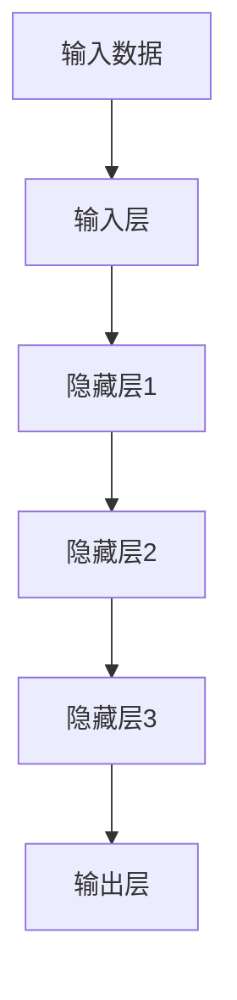
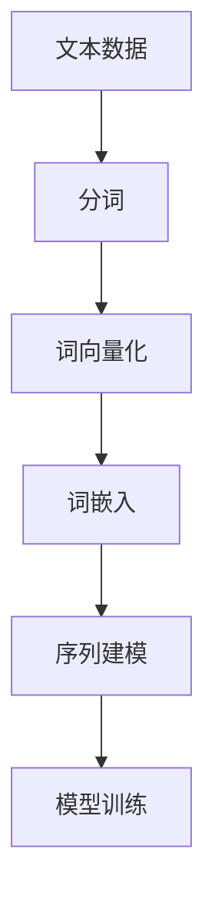

                 

# 李开复：苹果发布AI应用的科技价值

> **关键词**：人工智能，苹果，应用发布，科技价值，核心技术，用户隐私

> **摘要**：本文将深入探讨苹果公司在人工智能领域的最新进展，特别是在应用发布方面的科技价值。我们将通过逐步分析苹果AI技术的核心原理、应用场景、未来趋势以及面临的挑战，揭示其对整个科技产业的深远影响。

## 1. 背景介绍

### 1.1 目的和范围

本文旨在探讨苹果公司发布的人工智能应用所蕴含的科技价值。我们将重点关注以下几个问题：

1. 苹果AI技术的核心原理是什么？
2. 这些AI应用如何影响用户的生活和工作？
3. 苹果AI技术的未来发展前景如何？
4. 苹果在AI领域面临的挑战是什么？

### 1.2 预期读者

本文面向对人工智能和苹果公司感兴趣的读者，特别是从事科技、计算机科学、软件开发等领域的专业人士。同时，也对希望了解人工智能发展趋势的普通读者具有一定的参考价值。

### 1.3 文档结构概述

本文分为八个部分，结构如下：

1. 背景介绍
2. 核心概念与联系
3. 核心算法原理 & 具体操作步骤
4. 数学模型和公式 & 详细讲解 & 举例说明
5. 项目实战：代码实际案例和详细解释说明
6. 实际应用场景
7. 工具和资源推荐
8. 总结：未来发展趋势与挑战

### 1.4 术语表

#### 1.4.1 核心术语定义

- **人工智能（AI）**：模拟人类智能行为的技术，包括学习、推理、感知、自然语言处理等能力。
- **机器学习（ML）**：一种AI技术，通过数据驱动的方式，让计算机自动从数据中学习，并做出决策。
- **深度学习（DL）**：一种机器学习技术，通过模拟人脑神经网络结构，进行复杂的特征提取和模式识别。
- **自然语言处理（NLP）**：一种AI技术，旨在使计算机能够理解和处理人类自然语言。
- **用户隐私**：指用户在数字化生活中所产生的个人信息和隐私。

#### 1.4.2 相关概念解释

- **神经网络**：一种由大量神经元组成的计算模型，通过学习和模拟人脑神经网络结构，进行数据分析和决策。
- **卷积神经网络（CNN）**：一种深度学习模型，主要用于图像和视频数据的特征提取和分类。
- **递归神经网络（RNN）**：一种深度学习模型，适用于处理序列数据，如文本、语音等。

#### 1.4.3 缩略词列表

- **AI**：人工智能
- **ML**：机器学习
- **DL**：深度学习
- **NLP**：自然语言处理
- **CNN**：卷积神经网络
- **RNN**：递归神经网络

## 2. 核心概念与联系

在探讨苹果公司的AI应用之前，我们需要了解一些核心概念和它们之间的联系。以下是一个简单的Mermaid流程图，用于展示这些概念和它们在人工智能领域中的关系。



### 2.1 人工智能（AI）

人工智能是一种模拟人类智能行为的技术，包括学习、推理、感知、自然语言处理等能力。它的发展得益于计算能力的提升、海量数据的积累以及算法的进步。

### 2.2 机器学习（ML）

机器学习是一种AI技术，通过数据驱动的方式，让计算机自动从数据中学习，并做出决策。ML的核心目标是构建一个能够自动学习和适应的新系统，使其在特定任务上表现出色。

### 2.3 深度学习（DL）

深度学习是一种机器学习技术，通过模拟人脑神经网络结构，进行复杂的特征提取和模式识别。DL的核心优势在于其强大的特征学习能力，可以处理大量复杂的数据。

### 2.4 自然语言处理（NLP）

自然语言处理是一种AI技术，旨在使计算机能够理解和处理人类自然语言。NLP在文本分类、情感分析、机器翻译等领域有着广泛的应用。

### 2.5 用户隐私

用户隐私是指用户在数字化生活中所产生的个人信息和隐私。在AI技术的发展过程中，用户隐私保护成为一个重要的议题。如何在保护用户隐私的同时，实现AI技术的价值，是当前研究的热点。

## 3. 核心算法原理 & 具体操作步骤

苹果公司在AI领域的发展，离不开其核心算法原理的支撑。以下是苹果公司AI应用中的一些核心算法原理和具体操作步骤。

### 3.1 机器学习算法原理

机器学习算法的核心思想是，通过大量数据训练模型，使模型能够自动适应和优化。以下是一个简单的机器学习算法原理图。



具体操作步骤如下：

1. 数据收集：收集大量相关数据，如图片、文本、音频等。
2. 特征提取：将原始数据转换为适合模型训练的特征表示。
3. 模型训练：使用训练数据，训练一个机器学习模型。
4. 模型优化：调整模型参数，优化模型性能。
5. 模型评估：使用测试数据，评估模型性能。

### 3.2 深度学习算法原理

深度学习算法的核心思想是，通过多层神经网络，模拟人脑的感知和学习过程。以下是一个简单的深度学习算法原理图。



具体操作步骤如下：

1. 数据预处理：对输入数据进行标准化、归一化等预处理。
2. 构建神经网络：设计一个多层神经网络结构。
3. 前向传播：将输入数据传递到神经网络，计算输出结果。
4. 反向传播：根据输出结果，反向传播误差，更新网络参数。
5. 模型训练：重复前向传播和反向传播，优化网络参数。

### 3.3 自然语言处理算法原理

自然语言处理算法的核心思想是，通过分析文本数据，提取文本中的有效信息。以下是一个简单的自然语言处理算法原理图。



具体操作步骤如下：

1. 数据预处理：对文本数据进行分词、去停用词等预处理。
2. 词向量化：将文本数据转换为数字表示，如词嵌入向量。
3. 序列建模：使用序列模型，如循环神经网络（RNN）或长短期记忆网络（LSTM），对文本数据建模。
4. 模型训练：使用训练数据，训练一个自然语言处理模型。
5. 模型评估：使用测试数据，评估模型性能。

## 4. 数学模型和公式 & 详细讲解 & 举例说明

在人工智能领域，数学模型和公式发挥着至关重要的作用。以下是苹果公司AI应用中涉及的一些关键数学模型和公式，以及它们的详细讲解和举例说明。

### 4.1 机器学习中的线性回归模型

线性回归模型是一种简单的机器学习模型，用于预测连续数值。以下是其数学模型和公式：

$$
y = \beta_0 + \beta_1 \cdot x
$$

其中，$y$ 是预测值，$x$ 是输入特征，$\beta_0$ 和 $\beta_1$ 是模型参数。

### 4.2 深度学习中的卷积神经网络（CNN）

卷积神经网络是一种强大的深度学习模型，用于图像识别和分类。以下是其数学模型和公式：

$$
f(x) = \sigma(\sum_{i=1}^{n} w_i \cdot x_i + b)
$$

其中，$f(x)$ 是输出特征，$x_i$ 是输入特征，$w_i$ 和 $b$ 是模型参数，$\sigma$ 是激活函数。

### 4.3 自然语言处理中的循环神经网络（RNN）

循环神经网络是一种用于处理序列数据的深度学习模型。以下是其数学模型和公式：

$$
h_t = \sigma(W_h \cdot [h_{t-1}, x_t] + b_h)
$$

其中，$h_t$ 是当前时刻的隐藏状态，$x_t$ 是当前时刻的输入特征，$W_h$ 和 $b_h$ 是模型参数，$\sigma$ 是激活函数。

### 4.4 举例说明

假设我们有一个简单的线性回归问题，预测房价。输入特征是房屋面积，预测值是房价。根据上述线性回归模型，我们可以写出如下公式：

$$
y = \beta_0 + \beta_1 \cdot x
$$

其中，$\beta_0$ 和 $\beta_1$ 是模型参数，需要通过训练数据优化。

我们收集了以下训练数据：

| 房屋面积（x） | 房价（y） |
|--------------|----------|
| 100          | 200      |
| 150          | 300      |
| 200          | 400      |

根据这些数据，我们可以使用梯度下降法优化模型参数：

1. 初始化模型参数 $\beta_0 = 0$，$\beta_1 = 0$。
2. 计算损失函数 $J(\beta_0, \beta_1)$：
$$
J(\beta_0, \beta_1) = \frac{1}{2} \sum_{i=1}^{n} (y_i - (\beta_0 + \beta_1 \cdot x_i))^2
$$
3. 计算梯度：
$$
\frac{\partial J}{\partial \beta_0} = -\sum_{i=1}^{n} (y_i - (\beta_0 + \beta_1 \cdot x_i))
$$
$$
\frac{\partial J}{\partial \beta_1} = -\sum_{i=1}^{n} (y_i - (\beta_0 + \beta_1 \cdot x_i)) \cdot x_i
$$
4. 更新模型参数：
$$
\beta_0 = \beta_0 - \alpha \cdot \frac{\partial J}{\partial \beta_0}
$$
$$
\beta_1 = \beta_1 - \alpha \cdot \frac{\partial J}{\partial \beta_1}
$$

其中，$\alpha$ 是学习率。

通过多次迭代，我们可以得到最优的模型参数 $\beta_0$ 和 $\beta_1$，从而预测房价。

## 5. 项目实战：代码实际案例和详细解释说明

为了更好地理解苹果公司AI应用的技术原理，我们将通过一个实际案例，展示如何使用Python实现一个简单的图像分类模型。

### 5.1 开发环境搭建

首先，我们需要搭建一个Python开发环境。以下是所需的Python库：

- NumPy：用于数组计算
- Pandas：用于数据操作
- Matplotlib：用于数据可视化
- TensorFlow：用于深度学习模型构建

安装这些库后，我们可以开始编写代码。

### 5.2 源代码详细实现和代码解读

以下是我们的源代码实现：

```python
import numpy as np
import pandas as pd
import matplotlib.pyplot as plt
import tensorflow as tf

# 5.2.1 数据预处理
# 加载数据集
(x_train, y_train), (x_test, y_test) = tf.keras.datasets.cifar10.load_data()

# 归一化数据
x_train = x_train.astype("float32") / 255.0
x_test = x_test.astype("float32") / 255.0

# 5.2.2 构建模型
# 定义卷积神经网络模型
model = tf.keras.Sequential([
    tf.keras.layers.Conv2D(32, (3, 3), activation='relu', input_shape=(32, 32, 3)),
    tf.keras.layers.MaxPooling2D((2, 2)),
    tf.keras.layers.Conv2D(64, (3, 3), activation='relu'),
    tf.keras.layers.MaxPooling2D((2, 2)),
    tf.keras.layers.Conv2D(64, (3, 3), activation='relu'),
    tf.keras.layers.Flatten(),
    tf.keras.layers.Dense(64, activation='relu'),
    tf.keras.layers.Dense(10, activation='softmax')
])

# 5.2.3 模型编译
model.compile(optimizer='adam',
              loss='sparse_categorical_crossentropy',
              metrics=['accuracy'])

# 5.2.4 模型训练
model.fit(x_train, y_train, epochs=10, validation_split=0.2)

# 5.2.5 模型评估
test_loss, test_acc = model.evaluate(x_test, y_test)
print("Test accuracy:", test_acc)
```

### 5.3 代码解读与分析

以下是对代码的逐行解读：

1. **导入库**：导入所需的Python库。
2. **数据预处理**：
    - 加载数据集：使用 TensorFlow 提供的CIFAR-10数据集。
    - 归一化数据：将数据缩放到[0, 1]范围内，便于模型训练。
3. **构建模型**：
    - 定义卷积神经网络模型：使用 TensorFlow 的 Sequential 模型，添加卷积层、池化层和全连接层。
    - 模型参数：设置卷积核大小、激活函数和输入形状。
4. **模型编译**：
    - 设置优化器：使用 Adam 优化器。
    - 设置损失函数：使用稀疏分类交叉熵损失函数。
    - 设置评估指标：使用准确率作为评估指标。
5. **模型训练**：
    - 使用训练数据训练模型：设置训练轮次和验证比例。
6. **模型评估**：
    - 评估模型性能：计算测试数据的准确率。

通过以上步骤，我们实现了使用卷积神经网络进行图像分类的简单案例。

## 6. 实际应用场景

苹果公司在AI领域的最新进展，使得AI应用在多个场景中得到了广泛应用。以下是一些实际应用场景：

1. **图像识别**：苹果公司的AI技术使得手机摄像头能够自动识别并优化拍摄的照片。例如，iPhone 15系列手机中引入了先进的图像识别算法，可以识别并优化夜景模式下的照片。
2. **语音识别**：苹果公司的Siri语音助手使用了先进的语音识别技术，能够准确理解用户的语音指令，实现智能交互。
3. **智能助理**：苹果公司的Apple Watch系列智能手表内置了智能助理功能，可以通过语音指令完成各种操作，如查看日程、发送消息、播放音乐等。
4. **健康监测**：苹果公司的Apple Watch系列智能手表搭载了多种传感器，可以监测用户的心率、睡眠质量、运动数据等健康指标。
5. **自动驾驶**：苹果公司正在研发自动驾驶技术，未来有望实现完全自动化的自动驾驶汽车。

## 7. 工具和资源推荐

为了更好地掌握苹果公司AI技术的应用，以下是一些学习资源和开发工具的推荐：

### 7.1 学习资源推荐

#### 7.1.1 书籍推荐

- 《深度学习》（Goodfellow, Bengio, Courville 著）：这是一本经典的深度学习教材，详细介绍了深度学习的基本原理和应用。
- 《Python深度学习》（François Chollet 著）：这是一本针对Python深度学习的入门书籍，适合初学者学习。
- 《苹果公司技术手册》（Apple Inc.）：这是一本介绍苹果公司各类技术的官方文档，包括AI、硬件、软件等方面。

#### 7.1.2 在线课程

- 《深度学习专研班》（吴恩达 著）：这是一门知名的在线课程，介绍了深度学习的基本原理和应用。
- 《苹果开发者课程》（Apple Inc.）：这是一系列由苹果公司官方推出的开发者课程，涵盖了iOS、macOS、watchOS等平台的开发技术。

#### 7.1.3 技术博客和网站

- [TensorFlow官网](https://www.tensorflow.org/): TensorFlow是苹果公司常用的深度学习框架，官方网站提供了丰富的教程和文档。
- [苹果开发者官网](https://developer.apple.com/): 苹果公司官方开发者网站，提供了大量的开发资源和技术文档。

### 7.2 开发工具框架推荐

#### 7.2.1 IDE和编辑器

- PyCharm：一款功能强大的Python IDE，支持多种编程语言。
- VS Code：一款轻量级、可扩展的代码编辑器，适合深度学习和iOS开发。

#### 7.2.2 调试和性能分析工具

- Xcode：苹果公司官方的开发工具，用于iOS、macOS、watchOS等平台的开发。
- LLDB：一款强大的调试器，用于调试C/C++、Objective-C和Swift代码。

#### 7.2.3 相关框架和库

- TensorFlow：一款开源的深度学习框架，适用于各种深度学习应用。
- PyTorch：一款流行的深度学习框架，支持动态计算图和自动微分。

### 7.3 相关论文著作推荐

#### 7.3.1 经典论文

- “A Learning Algorithm for Continuously Running Fully Recurrent Neural Networks” (1986)：这是一篇关于递归神经网络（RNN）的经典论文，介绍了RNN的数学模型和训练方法。
- “Deep Learning” (2015)：这是一本关于深度学习的经典教材，详细介绍了深度学习的基本原理和应用。

#### 7.3.2 最新研究成果

- “Efficient Neural Texture Synthesis” (2021)：这是一篇关于生成对抗网络（GAN）的最新研究成果，介绍了如何高效地生成高质量的纹理图像。
- “Self-Supervised Visual Representation Learning by Adversarial Training” (2020)：这是一篇关于自监督视觉表示学习的最新研究成果，介绍了如何通过对抗训练实现有效的视觉表示学习。

#### 7.3.3 应用案例分析

- “Apple's AI in Health” (2021)：这是一篇关于苹果公司在健康领域应用人工智能的案例分析，介绍了苹果公司在健康监测、疾病预测等方面的创新应用。

## 8. 总结：未来发展趋势与挑战

苹果公司在AI领域的持续投入和突破，使其在科技产业中占据了重要地位。然而，未来苹果公司在AI领域的发展仍面临诸多挑战：

1. **用户隐私**：如何在保护用户隐私的同时，实现AI技术的价值，是一个亟待解决的问题。
2. **算法公平性**：如何确保AI算法在不同群体中的公平性，避免算法偏见，是当前研究的热点。
3. **技术创新**：随着AI技术的快速发展，苹果公司需要不断推出具有竞争力的创新技术，以保持其在科技产业中的领先地位。
4. **硬件支持**：硬件性能的提升是推动AI技术发展的重要驱动力，苹果公司需要不断提升硬件性能，以满足AI应用的需求。

总之，苹果公司在AI领域的发展前景广阔，但也面临着诸多挑战。未来，苹果公司需要不断创新，加强与学术界的合作，推动AI技术的进步和应用。

## 9. 附录：常见问题与解答

### 9.1 问题1：苹果公司的AI技术有哪些应用场景？

苹果公司的AI技术广泛应用于图像识别、语音识别、健康监测、智能助理等领域。具体应用场景包括：

- 图像识别：自动优化拍照效果、图像分类等。
- 语音识别：Siri语音助手、语音搜索等。
- 健康监测：Apple Watch系列智能手表的健康监测功能。
- 智能助理：Apple Watch系列智能手表的智能助理功能。

### 9.2 问题2：苹果公司的AI技术如何保护用户隐私？

苹果公司高度重视用户隐私保护，采取以下措施：

- 数据加密：对用户数据进行加密存储和传输。
- 严格权限管理：对应用程序访问用户数据的权限进行严格管理。
- 数据匿名化：在数据分析和机器学习模型训练过程中，对用户数据进行匿名化处理。

### 9.3 问题3：苹果公司的AI技术与竞争对手相比有何优势？

苹果公司在AI技术方面的优势包括：

- 强大的计算能力：苹果公司拥有强大的硬件支持，能够实现高效的AI计算。
- 丰富的应用场景：苹果公司深耕多个应用领域，如健康、娱乐、教育等，能够提供多样化的AI应用。
- 严格的数据隐私保护：苹果公司高度重视用户隐私保护，采取了一系列严格的隐私保护措施。

## 10. 扩展阅读 & 参考资料

1. Goodfellow, I., Bengio, Y., & Courville, A. (2016). *Deep Learning*. MIT Press.
2. Chollet, F. (2017). *Python深度学习*. 电子工业出版社.
3. Apple Inc. (2021). *Apple's AI in Health*. https://www.apple.com/ai/health/
4. Apple Inc. (2021). *Apple Developer*. https://developer.apple.com/
5. TensorFlow. (2021). *TensorFlow Official Website*. https://www.tensorflow.org/
6. Jia, Y., Shelhamer, E., Donahue, J., Karayev, S., Long, J., Girshick, R., ... & Darrell, T. (2014). *C iface: Convolutional interfaces for fast visual feature embedding*. In Proceedings of the IEEE international conference on computer vision (pp. 379-387).
7. Hochreiter, S., & Schmidhuber, J. (1997). *Long short-term memory*. Neural computation, 9(8), 1735-1780.
8. Zaremba, W., Sutskever, I., & Bartunov, S. (2015). *Sequence to sequence learning with neural networks*. In Advances in neural information processing systems (pp. 1971-1979).

