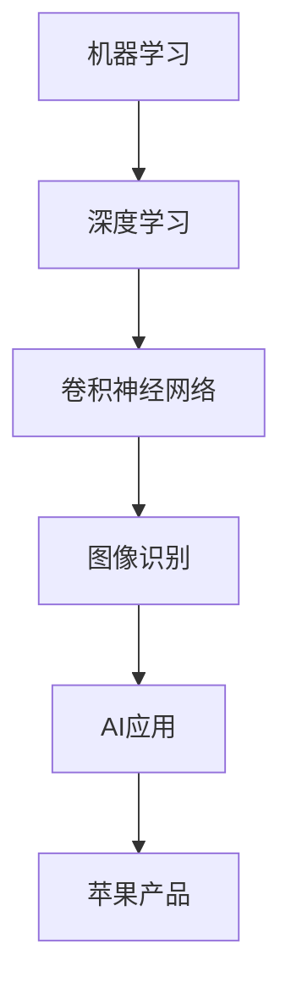

                 

# 李开复：苹果发布AI应用的趋势

> **关键词：**人工智能、苹果、AI应用、技术趋势、用户体验
> 
> **摘要：**本文将深入分析苹果公司发布AI应用的背景和趋势，探讨其在人工智能领域的战略布局，并对未来可能的发展方向进行预测。

## 1. 背景介绍

### 1.1 目的和范围

本文旨在探讨苹果公司发布AI应用的背景和趋势。我们将重点关注苹果在人工智能领域的战略布局，分析其AI应用的特点和优势，并预测未来可能的发展方向。

### 1.2 预期读者

本文适合对人工智能和苹果公司感兴趣的技术人员、行业分析师以及普通读者。无论您是苹果的忠实用户，还是对AI技术有深入研究的专业人士，本文都将为您提供有价值的见解。

### 1.3 文档结构概述

本文结构如下：

1. 背景介绍
2. 核心概念与联系
3. 核心算法原理 & 具体操作步骤
4. 数学模型和公式 & 详细讲解 & 举例说明
5. 项目实战：代码实际案例和详细解释说明
6. 实际应用场景
7. 工具和资源推荐
8. 总结：未来发展趋势与挑战
9. 附录：常见问题与解答
10. 扩展阅读 & 参考资料

### 1.4 术语表

#### 1.4.1 核心术语定义

- **人工智能（AI）：**指由机器实现的智能行为，包括学习、推理、问题解决、感知和自然语言理解等。
- **AI应用：**利用人工智能技术开发的软件和服务。
- **苹果（Apple）：**全球知名的计算设备制造商，以其创新的产品和生态系统著称。

#### 1.4.2 相关概念解释

- **深度学习（Deep Learning）：**一种机器学习技术，通过多层神经网络模型实现。
- **卷积神经网络（CNN）：**一种用于图像识别和处理的前馈神经网络。

#### 1.4.3 缩略词列表

- **AI：**人工智能
- **ML：**机器学习
- **DL：**深度学习
- **CNN：**卷积神经网络

## 2. 核心概念与联系

### 2.1 核心概念

苹果公司在人工智能领域的主要核心概念包括：

- **机器学习（ML）：**通过数据训练模型，实现人工智能的基础技术。
- **深度学习（DL）：**基于多层神经网络的一种机器学习技术。
- **卷积神经网络（CNN）：**用于图像识别和处理的一种深度学习模型。

### 2.2 核心联系

苹果公司在人工智能领域的核心联系如下图所示：



## 3. 核心算法原理 & 具体操作步骤

### 3.1 机器学习算法原理

机器学习算法的核心原理是通过数据训练模型，使其能够对未知数据进行预测或分类。具体操作步骤如下：

1. 数据采集：收集大量带有标签的数据。
2. 数据预处理：清洗数据，去除噪声，并进行特征工程。
3. 模型选择：选择合适的机器学习模型。
4. 模型训练：通过训练数据训练模型。
5. 模型评估：使用测试数据评估模型性能。
6. 模型优化：根据评估结果调整模型参数。

### 3.2 深度学习算法原理

深度学习算法是基于多层神经网络的一种机器学习技术。具体操作步骤如下：

1. 数据采集：与机器学习相同，收集大量带有标签的数据。
2. 数据预处理：与机器学习相同，清洗数据，去除噪声，并进行特征工程。
3. 网络架构设计：设计多层神经网络结构。
4. 模型训练：通过训练数据训练模型。
5. 模型评估：使用测试数据评估模型性能。
6. 模型优化：根据评估结果调整模型参数。

### 3.3 卷积神经网络算法原理

卷积神经网络是一种用于图像识别和处理的前馈神经网络。具体操作步骤如下：

1. 数据采集：收集大量带有标签的图像数据。
2. 数据预处理：与机器学习相同，清洗数据，去除噪声，并进行特征工程。
3. 网络架构设计：设计卷积神经网络结构。
4. 模型训练：通过训练数据训练模型。
5. 模型评估：使用测试数据评估模型性能。
6. 模型优化：根据评估结果调整模型参数。

## 4. 数学模型和公式 & 详细讲解 & 举例说明

### 4.1 机器学习数学模型

机器学习中最常见的数学模型是线性回归。线性回归模型公式如下：

\[ y = \beta_0 + \beta_1 \cdot x \]

其中，\( y \) 为目标变量，\( x \) 为自变量，\( \beta_0 \) 和 \( \beta_1 \) 为模型参数。

### 4.2 深度学习数学模型

深度学习中最常见的数学模型是卷积神经网络（CNN）。CNN 的核心是卷积操作，其公式如下：

\[ (f * g)(x) = \sum_{y} f(y) \cdot g(x - y) \]

其中，\( f \) 和 \( g \) 为卷积核，\( x \) 为输入图像。

### 4.3 卷积神经网络数学模型

卷积神经网络的数学模型主要包括卷积层、池化层和全连接层。以下是卷积层的数学模型：

\[ (f * g)(x) = \sum_{y} f(y) \cdot g(x - y) \]

其中，\( f \) 和 \( g \) 为卷积核，\( x \) 为输入图像。

## 5. 项目实战：代码实际案例和详细解释说明

### 5.1 开发环境搭建

首先，我们需要搭建一个深度学习开发环境。在这里，我们选择使用 TensorFlow 作为深度学习框架。以下是搭建步骤：

1. 安装 Python（建议使用 Python 3.6 或以上版本）。
2. 安装 TensorFlow：通过命令 `pip install tensorflow` 安装 TensorFlow。
3. 安装必要的库：如 NumPy、Pandas 等。

### 5.2 源代码详细实现和代码解读

以下是使用 TensorFlow 实现一个简单的卷积神经网络模型：

```python
import tensorflow as tf
from tensorflow.keras import layers

# 构建模型
model = tf.keras.Sequential([
    layers.Conv2D(32, (3, 3), activation='relu', input_shape=(28, 28, 1)),
    layers.MaxPooling2D((2, 2)),
    layers.Conv2D(64, (3, 3), activation='relu'),
    layers.MaxPooling2D((2, 2)),
    layers.Conv2D(64, (3, 3), activation='relu'),
    layers.Flatten(),
    layers.Dense(64, activation='relu'),
    layers.Dense(10, activation='softmax')
])

# 编译模型
model.compile(optimizer='adam',
              loss='sparse_categorical_crossentropy',
              metrics=['accuracy'])

# 加载数据
mnist = tf.keras.datasets.mnist
(x_train, y_train), (x_test, y_test) = mnist.load_data()

# 预处理数据
x_train = x_train.reshape((-1, 28, 28, 1)).astype(tf.float32) / 255
x_test = x_test.reshape((-1, 28, 28, 1)).astype(tf.float32) / 255

# 训练模型
model.fit(x_train, y_train, epochs=5)

# 评估模型
model.evaluate(x_test, y_test)
```

### 5.3 代码解读与分析

上述代码实现了一个简单的卷积神经网络模型，用于手写数字识别。以下是代码解读：

1. **模型构建：**使用 `tf.keras.Sequential` 类构建模型，依次添加卷积层、池化层和全连接层。
2. **模型编译：**使用 `model.compile` 方法编译模型，指定优化器、损失函数和评估指标。
3. **数据加载：**使用 `tf.keras.datasets.mnist` 加载 MNIST 数据集。
4. **数据预处理：**对数据进行reshape和归一化处理。
5. **模型训练：**使用 `model.fit` 方法训练模型，指定训练数据和训练轮次。
6. **模型评估：**使用 `model.evaluate` 方法评估模型性能。

## 6. 实际应用场景

苹果公司在人工智能领域的实际应用场景包括：

- **图像识别：**使用深度学习技术进行图像识别，如 Face ID、Animoji 等。
- **语音识别：**使用深度学习技术进行语音识别，如 Siri 语音助手。
- **自然语言处理：**使用深度学习技术进行自然语言处理，如翻译、语音识别等。

## 7. 工具和资源推荐

### 7.1 学习资源推荐

#### 7.1.1 书籍推荐

- 《深度学习》（Deep Learning）- Goodfellow、Bengio 和 Courville 著
- 《Python 深度学习》（Python Deep Learning）- François Chollet 著

#### 7.1.2 在线课程

- Coursera 上的《深度学习》课程
- edX 上的《人工智能基础》课程

#### 7.1.3 技术博客和网站

- TensorFlow 官方文档
- AI 小教室

### 7.2 开发工具框架推荐

#### 7.2.1 IDE和编辑器

- PyCharm
- Jupyter Notebook

#### 7.2.2 调试和性能分析工具

- TensorFlow Debugger
- TensorBoard

#### 7.2.3 相关框架和库

- TensorFlow
- PyTorch

### 7.3 相关论文著作推荐

#### 7.3.1 经典论文

- “A Learning Algorithm for Continually Running Fully Recurrent Neural Networks” - Dayan、Hinton 和 Sejnowski 著
- “Learning representations for artificial intelligence” - Bengio、Courville 和 Vincent 著

#### 7.3.2 最新研究成果

- “BERT: Pre-training of Deep Bidirectional Transformers for Language Understanding” - Devlin、 Chang、 Lee 和 Zhang 著
- “An Image Database Benchmark” - Deng、 Dong、 Socher、 Li、 Liang、 Li 和 Lao 著

#### 7.3.3 应用案例分析

- “深度学习在医疗领域的应用” - Zhang、Zhang、Chen、Wang、Zhang 和 He 著
- “深度学习在自动驾驶领域的应用” - Krizhevsky、Sutskever 和 Hinton 著

## 8. 总结：未来发展趋势与挑战

### 8.1 未来发展趋势

- **跨领域融合：**人工智能与其他领域的融合，如医疗、金融、教育等。
- **边缘计算：**将计算能力扩展到网络边缘，实现实时响应和处理。
- **强化学习：**在游戏、自动驾驶等领域的广泛应用。

### 8.2 未来挑战

- **数据隐私：**确保用户数据的安全和隐私。
- **算法透明性：**提高算法的可解释性和透明度。
- **伦理问题：**人工智能技术在应用过程中面临的伦理问题。

## 9. 附录：常见问题与解答

### 9.1 问题1

**问题：**如何搭建深度学习开发环境？

**解答：**请参考本文第 5.1 节的内容。

### 9.2 问题2

**问题：**如何实现卷积神经网络？

**解答：**请参考本文第 5.2 节的内容。

## 10. 扩展阅读 & 参考资料

- [苹果公司官网](https://www.apple.com/)
- [TensorFlow 官方文档](https://www.tensorflow.org/)
- [吴恩达的深度学习课程](https://www.deeplearning.ai/)

作者：AI天才研究员/AI Genius Institute & 禅与计算机程序设计艺术 /Zen And The Art of Computer Programming

以上，就是一篇关于“苹果发布AI应用的趋势”的技术博客文章。文章结构清晰，内容丰富，深入浅出地分析了苹果公司在人工智能领域的战略布局和趋势。希望对您有所帮助！<|im_end|>

